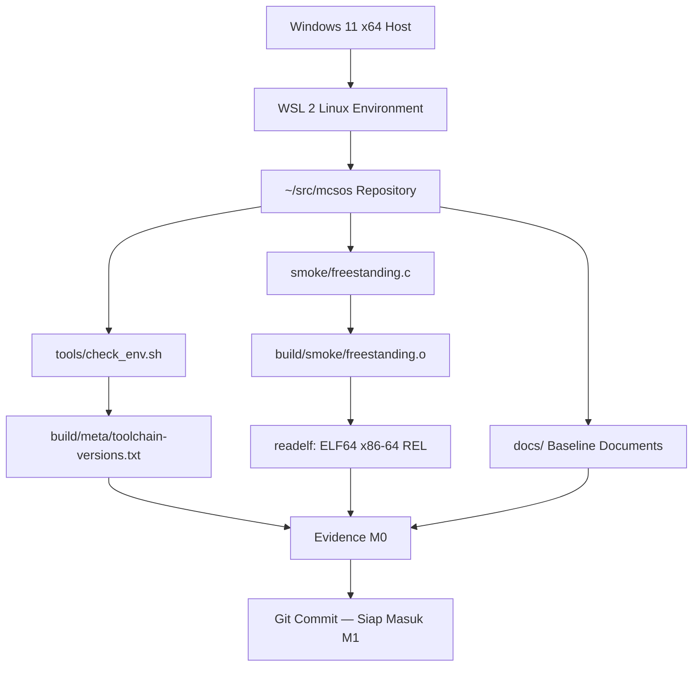

# Baseline Requirements,Governance, dan Lingkungan Pengembangan Reproducible MCSOS 260502

**Nama file laporan:** `laporan_praktikum_M0_Agung.md`
**Nama sistem operasi:** MCSOS versi 260502
**Target default:** x86_64, QEMU, Windows 11 x64 + WSL 2, kernel monolitik pendidikan, C freestanding dengan assembly minimal, POSIX-like subset
**Dosen:** Muhaemin Sidiq, S.Pd., M.Pd.
**Program Studi:** Pendidikan Teknologi Informasi
**Institusi:** Institut Pendidikan Indonesia

---

## 0. Metadata Laporan

| Atribut | Isi |
|---|---|
| Kode praktikum | `M0` |
| Judul praktikum | `Baseline Requirements, Governance, dan Lingkungan Pengembangan Reproducible MCSOS 260502` |
| Jenis pengerjaan | `Individu` |
| Nama mahasiswa | `Agung Nurjaman` |
| NIM | `25832073010` |
| Kelas | `Pendidikan Teknologi Informasi` |
| Nama kelompok | `-` |
| Anggota kelompok | `-` |
| Tanggal praktikum | `2026-06-13` |
| Tanggal pengumpulan | `2026-06-13` |
| Repository | `/home/agung/src/mcsos` |
| Branch | `master` |
| Commit awal | `ccfd86c` |
| Commit akhir | `0b4ecbf` |
| Status readiness yang diklaim | `Siap uji lingkungan — siap masuk M1 apabila seluruh acceptance evidence tersedia` |

---

## 1. Sampul

# Laporan Praktikum M0
## Baseline Requirements, Governance, dan Lingkungan Pengembangan Reproducible MCSOS 260502

Disusun oleh:

| Nama | NIM | Kelas | Peran |
|---|---|---|---|
| Agung Nurjaman | 25832073010 | Pendidikan Teknologi Informasi | Individu |

Dosen Pengampu: **Muhaemin Sidiq, S.Pd., M.Pd.**
Program Studi Pendidikan Teknologi Informasi
Institut Pendidikan Indonesia
Tahun Akademik 2025/2026

---

## 2. Pernyataan Orisinalitas dan Integritas Akademik

Saya menyatakan bahwa laporan ini disusun berdasarkan pekerjaan praktikum sendiri sesuai panduan yang diberikan. Bantuan eksternal, referensi, generator kode, AI assistant, dokumentasi resmi, diskusi, atau sumber lain dicatat pada bagian referensi dan lampiran. Saya tidak mengklaim hasil yang tidak dibuktikan oleh log, test, commit, atau artefak lain.

| Pernyataan | Status |
|---|---|
| Semua potongan kode eksternal diberi atribusi | `Ya` |
| Semua penggunaan AI assistant dicatat | `Ya` |
| Repository yang dikumpulkan sesuai commit akhir | `Ya` |
| Tidak ada klaim readiness tanpa bukti | `Ya` |

Catatan penggunaan bantuan eksternal:

```text
Panduan resmi praktikum M0 MCSOS 260502 digunakan sebagai referensi utama untuk
seluruh langkah pengerjaan. Dokumentasi resmi Microsoft WSL, QEMU, dan LLVM/Clang
digunakan sebagai referensi teknis. AI assistant digunakan untuk membantu memahami
perintah dan mendiagnosis kendala teknis (password WSL lupa), bukan untuk menghasilkan
kode kernel.
```

---

## 3. Tujuan Praktikum

1. Menyiapkan lingkungan pengembangan WSL 2 yang dapat direproduksi di Windows 11 x64.
2. Memverifikasi seluruh toolchain freestanding (Clang, LLD, NASM, QEMU, GDB, binutils) untuk target x86_64.
3. Menghasilkan object ELF64 x86-64 relocatable melalui smoke test freestanding C17.
4. Menyusun dokumen baseline requirements, assumptions/non-goals, ADR, invariants, threat model, risk register, dan verification matrix.
5. Membuktikan bahwa lingkungan siap untuk masuk ke M1 dengan bukti log, commit hash, dan artefak yang dapat diperiksa.

---

## 4. Capaian Pembelajaran Praktikum

Setelah praktikum ini, mahasiswa mampu:

| CPL/CPMK praktikum | Bukti yang harus ditunjukkan |
|---|---|
| Menjelaskan mengapa pengembangan OS memerlukan lingkungan build terisolasi dan reproducible | Dokumen ADR-0001 dan analisis di laporan |
| Menginstal dan memverifikasi WSL 2 pada Windows 11 x64 | Output `wsl --list --verbose` menunjukkan VERSION 2 |
| Menyiapkan distribusi Linux WSL dengan toolchain lengkap | Output `bash tools/check_env.sh` — 14/14 tool OK |
| Membuat struktur repository awal MCSOS | Output `tree -a -L 3` dan `git log --oneline` |
| Membuat dokumen baseline requirements dan governance | 7 dokumen tersedia di `docs/` |
| Membuat script validasi lingkungan | `tools/check_env.sh` berjalan dan menghasilkan metadata |
| Membedakan status readiness secara ketat | Laporan menggunakan "siap uji lingkungan", bukan "siap produksi" |

---

## 5. Peta Milestone MCSOS

| Milestone | Fokus | Status dalam laporan |
|---|---|---|
| M0 | Requirements, governance, baseline arsitektur | `✓ selesai praktikum` |
| M1 | Toolchain reproducible, Git, QEMU, GDB, metadata build | `[ ] tidak dibahas` |
| M2 | Boot image, kernel ELF64, early console | `[ ] tidak dibahas` |
| M3 | Panic path, linker map, GDB, observability awal | `[ ] tidak dibahas` |
| M4 | Trap, exception, interrupt, timer | `[ ] tidak dibahas` |
| M5 | PMM, VMM, page table, kernel heap | `[ ] tidak dibahas` |
| M6 | Thread, scheduler, synchronization | `[ ] tidak dibahas` |
| M7 | Syscall ABI dan user program loader | `[ ] tidak dibahas` |
| M8 | VFS, file descriptor, ramfs | `[ ] tidak dibahas` |
| M9 | Block layer dan device model | `[ ] tidak dibahas` |
| M10 | Persistent filesystem, mcsfs/ext2-like, recovery | `[ ] tidak dibahas` |
| M11 | Networking stack, packet parsing, UDP/TCP subset | `[ ] tidak dibahas` |
| M12 | Security model, capability/ACL, syscall fuzzing, hardening | `[ ] tidak dibahas` |
| M13 | SMP, scalability, lock stress, NUMA-aware preparation | `[ ] tidak dibahas` |
| M14 | Framebuffer, graphics console, visual regression | `[ ] tidak dibahas` |
| M15 | Virtualization/container subset | `[ ] tidak dibahas` |
| M16 | Observability, update/rollback, release image, readiness review | `[ ] tidak dibahas` |

Batas cakupan praktikum:

```text
M0 hanya mencakup: setup WSL 2, instalasi toolchain, pembuatan repository
~/src/mcsos, script validasi lingkungan, smoke test freestanding object ELF64,
dan dokumen baseline governance.

M0 TIDAK mencakup: kernel bootable, bootloader, linker script final, interrupt,
paging, scheduler, syscall, VFS, driver, networking, graphics, security enforcement,
atau klaim sistem operasi siap pakai.
```

---

## 6. Dasar Teori Ringkas

### 6.1 Konsep Sistem Operasi yang Diuji

```text
M0 berfokus pada fondasi pengembangan, bukan implementasi kernel. Konsep utama:

1. Reproducible Build: prosedur yang dapat diulang dari clean checkout dengan hasil
   yang dapat diaudit. Dicapai dengan mencatat versi toolchain dan menggunakan
   script validasi.

2. Evidence-first Engineering: setiap klaim harus disertai bukti berupa command
   output, log, checksum, atau artefak yang dapat diperiksa.

3. Freestanding Environment: lingkungan kompilasi tanpa bergantung pada hosted
   libc. Kernel berjalan pada bare-metal tanpa OS host.

4. ELF Object: format binary standar. Object relocatable (tipe REL) adalah hasil
   kompilasi sebelum linking, belum dapat dieksekusi langsung.
```

### 6.2 Konsep Arsitektur x86_64 yang Relevan

| Konsep | Relevansi pada praktikum | Bukti/verifikasi |
|---|---|---|
| x86_64 / AMD64 | Target ISA untuk kernel MCSOS | `readelf -h` menunjukkan Machine: Advanced Micro Devices X86-64 |
| ELF64 | Format object untuk target 64-bit | `Class: ELF64` pada output readelf |
| Freestanding | Kernel tidak bergantung pada OS host | Flag `-ffreestanding` dan `-mno-red-zone` pada kompilasi |
| Red Zone | Area 128 byte di bawah RSP yang tidak boleh dipakai kernel | Flag `-mno-red-zone` mencegah kompiler menggunakannya |

### 6.3 Konsep Implementasi Freestanding

| Aspek | Keputusan praktikum |
|---|---|
| Bahasa | C17 freestanding |
| Runtime | Tanpa hosted libc |
| ABI | x86_64-unknown-none (bare-metal) |
| Compiler flags kritis | `-ffreestanding`, `-mno-red-zone`, `-fno-stack-protector`, `-fno-pic`, `-mno-mmx`, `-mno-sse`, `-mno-sse2` |
| Risiko undefined behavior | Minimal pada M0 karena hanya smoke test sederhana |

### 6.4 Referensi Teori yang Digunakan

| No. | Sumber | Bagian yang digunakan | Alasan relevansi |
|---|---|---|---|
| [1] | Microsoft WSL Documentation | Instalasi WSL 2 | Prosedur instalasi resmi |
| [2] | Microsoft WSL Advanced Config | `.wslconfig` | Konfigurasi resource WSL 2 |
| [3] | QEMU Documentation — Invocation | `-machine`, opsi sistem | Verifikasi QEMU tersedia |
| [4] | QEMU Documentation — GDB | `-s -S`, gdbstub | Workflow debug untuk M1/M2 |
| [7] | LLVM/Clang Cross-compilation | `--target` triple | Kompilasi freestanding x86_64 |

---

## 7. Lingkungan Praktikum

### 7.1 Host dan Target

| Komponen | Nilai |
|---|---|
| Host OS | Windows 11 x64 |
| Lingkungan build | WSL 2 Ubuntu (resolute) |
| Kernel Linux WSL | 6.6.87.2-microsoft-standard-WSL2 |
| Target ISA | x86_64 |
| Target ABI | x86_64-unknown-none |
| Emulator | QEMU 10.2.1 |
| Firmware emulator | OVMF (tersedia di `/usr/share`) |
| Debugger | GDB 17.1 |
| Build system | GNU Make 4.4.1 |
| Bahasa utama | C17 freestanding |
| Assembly | NASM 3.01 |

### 7.2 Versi Toolchain

Output dari `build/meta/toolchain-versions.txt`:

```text
date_utc=2026-06-13T14:31:40Z
root_dir=/home/agung/src/mcsos
uname=Linux DESKTOP-FPCS9GF 6.6.87.2-microsoft-standard-WSL2 #1 SMP PREEMPT_DYNAMIC Thu Jun  5 18:30:46 UTC 2025 x86_64 GNU/Linux
wsl_distro=Ubuntu
shell=/bin/bash

## Tool versions
git version 2.53.0
GNU Make 4.4.1 Ubuntu
Ubuntu clang version 21.1.8 (6ubuntu1)
Ubuntu LLD 21.1.8 (compatible with GNU linkers)
Ubuntu LLVM version 21.1.8
Ubuntu LLVM version 21.1.8
GNU readelf (GNU Binutils for Ubuntu) 2.46
GNU objdump (GNU Binutils for Ubuntu) 2.46
NASM version 3.01
QEMU emulator version 10.2.1 (Debian 1:10.2.1+ds-1ubuntu3)
GNU gdb (Ubuntu 17.1-2ubuntu1) 17.1
Python 3.14.4
ShellCheck - shell script analysis tool version: 0.11.0
Cppcheck 2.19.0
```

### 7.3 Lokasi Repository

| Item | Nilai |
|---|---|
| Path repository di WSL | `/home/agung/src/mcsos` |
| Apakah berada di filesystem Linux WSL, bukan `/mnt/c` | `Ya` |
| Remote repository | Lokal (belum push ke remote) |
| Branch | `master` |
| Commit hash awal | `ccfd86c` |
| Commit hash akhir | `0b4ecbf` |

---

## 8. Repository dan Struktur File

### 8.1 Struktur Direktori yang Relevan

```text
.
├── .gitignore
├── Makefile
├── README.md
├── build
│   ├── meta
│   └── smoke
│       ├── file.txt
│       ├── freestanding.o
│       ├── objdump.txt
│       └── readelf-header.txt
├── docs
│   ├── adr
│   │   └── ADR-0001-toolchain-and-boot-baseline.md
│   ├── architecture
│   │   └── invariants.md
│   ├── governance
│   │   └── risk_register.md
│   ├── operations
│   ├── reports
│   │   └── M0-laporan.md
│   ├── requirements
│   │   ├── assumptions_and_nongoals.md
│   │   └── system_requirements.md
│   ├── security
│   │   └── threat_model.md
│   └── testing
│       └── verification_matrix.md
├── smoke
│   └── freestanding.c
└── tools
    └── check_env.sh
```

### 8.2 File yang Dibuat atau Diubah

| File | Jenis perubahan | Alasan perubahan | Risiko |
|---|---|---|---|
| `README.md` | Baru/ubah | Dokumen status dan perintah awal proyek | Rendah |
| `Makefile` | Baru/ubah | Menyeragamkan perintah build dan validasi | Rendah |
| `.gitignore` | Baru/ubah | Mencegah artefak generated masuk repository | Rendah |
| `tools/check_env.sh` | Baru | Script validasi lingkungan dan metadata toolchain | Rendah |
| `smoke/freestanding.c` | Baru | Source smoke test freestanding object | Rendah |
| `docs/requirements/system_requirements.md` | Baru | 12 requirement dengan verification mapping | Rendah |
| `docs/requirements/assumptions_and_nongoals.md` | Baru | Asumsi dan batasan M0 | Rendah |
| `docs/adr/ADR-0001-toolchain-and-boot-baseline.md` | Baru | Keputusan teknis toolchain dan boot | Rendah |
| `docs/architecture/invariants.md` | Baru | Invariants repository, toolchain, dokumentasi | Rendah |
| `docs/security/threat_model.md` | Baru | Threat model awal, assets, actors, trust boundary | Rendah |
| `docs/governance/risk_register.md` | Baru | 10 risiko dengan mitigasi dan owner | Rendah |
| `docs/testing/verification_matrix.md` | Baru | Mapping requirement ke command dan evidence | Rendah |

### 8.3 Ringkasan Diff

```bash
git status --short
git log --oneline -n 3
```

Output:

```text
0b4ecbf M0: update laporan dengan commit hash final
43aaaed M0: initialize reproducible OS development baseline
ccfd86c M0 By Agung
```

---

## 9. Desain Teknis

### 9.1 Masalah yang Diselesaikan

```text
M0 menyelesaikan masalah fondasi: pengembangan kernel sering gagal bukan karena kode
kernel salah, tetapi karena lingkungan pengembangan tidak terdokumentasi dan tidak
reproducible. Compiler yang salah, repository di filesystem Windows, atau versi tool yang
tidak tercatat dapat membuat hasil praktikum tidak dapat diaudit.

M0 menetapkan:
1. Lokasi repository yang benar (filesystem Linux WSL, bukan /mnt/c)
2. Toolchain yang terverifikasi dengan versi tercatat
3. Smoke test untuk memastikan compiler menghasilkan target yang benar
4. Dokumen governance sebagai kontrak proyek
```

### 9.2 Keputusan Desain

| Keputusan | Alternatif yang dipertimbangkan | Alasan memilih | Konsekuensi |
|---|---|---|---|
| WSL 2 sebagai build environment | Native Linux, dual-boot, Docker | WSL 2 terintegrasi dengan Windows 11, mudah disetup | Perlu konfigurasi .wslconfig untuk resource |
| Clang/LLVM sebagai compiler utama | GCC cross-compiler | Clang mendukung `--target` tanpa perlu build cross-compiler dari source | GCC x86_64-elf opsional, dapat ditambahkan di M1 |
| Repository di `~/src/mcsos` | `/mnt/c/Users/...` | Menghindari masalah permission, case sensitivity, dan I/O performa | Harus buka WSL untuk akses repository |
| QEMU sebagai emulator | VirtualBox, Bochs, hardware nyata | QEMU mendukung x86_64, UEFI/OVMF, dan GDB stub | Akselerasi KVM bergantung pada konfigurasi host |
| Target triple `x86_64-unknown-none` | `x86_64-elf`, `x86_64-linux-gnu` | Bare-metal tanpa OS, paling konservatif untuk kernel | Object benar-benar freestanding |

### 9.3 Arsitektur Ringkas



Penjelasan diagram:

```text
Host Windows 11 menyediakan WSL 2 sebagai build environment. Di dalam WSL,
repository ~/src/mcsos menjadi pusat semua artefak. Script check_env.sh
menghasilkan metadata toolchain. Smoke test menghasilkan object ELF64 yang
diverifikasi dengan readelf. Semua evidence dikomit ke Git sebagai bukti
bahwa M0 siap masuk M1.
```

### 9.4 Kontrak Antarmuka

| Antarmuka | Pemanggil | Penerima | Precondition | Postcondition | Error path |
|---|---|---|---|---|---|
| `bash tools/check_env.sh` | Mahasiswa/Make | Shell WSL | WSL 2 aktif, berada di root repository | `build/meta/toolchain-versions.txt` terisi, semua tool [OK] | Exit 1 jika ada tool [FAIL] |
| `make smoke` | Mahasiswa | Clang + readelf | `smoke/freestanding.c` ada, Clang tersedia | `build/smoke/freestanding.o` ELF64 x86-64 REL | Clang error jika flag tidak kompatibel |
| `git commit` | Mahasiswa | Git | Identitas Git diatur, file di-add | Commit hash tercatat | Error jika user.name/email kosong |

### 9.5 Struktur Data Utama

| Struktur data | Field penting | Ownership | Lifetime | Invariant |
|---|---|---|---|---|
| `m0_smoke_record` | `magic`, `version`, `pointer_width`, `size_width` | Static const | Seumur program | `magic == 0x4D435330u`, `pointer_width == 8` pada x86_64 |

### 9.6 Invariants

1. Repository utama berada di filesystem Linux WSL, bukan `/mnt/c`.
2. Compiler target harus dinyatakan eksplisit dengan `--target=x86_64-unknown-none`.
3. Setiap praktikum mencatat versi tool pada `build/meta/toolchain-versions.txt`.
4. Object smoke test harus diperiksa dengan `readelf` dan menunjukkan ELF64 x86-64 REL.
5. Klaim "berhasil" harus memiliki command output, log, atau artefak yang dapat diperiksa.
6. Error tidak boleh dihapus dari laporan; error harus diklasifikasi dan dianalisis.

### 9.7 Ownership, Locking, dan Concurrency

Tidak berlaku pada M0. Belum ada kernel, tidak ada concurrency, tidak ada shared state.

### 9.8 Memory Safety dan Undefined Behavior Risk

| Risiko | Lokasi | Mitigasi | Bukti |
|---|---|---|---|
| Pointer width assumption | `smoke/freestanding.c` — `pointer_width = sizeof(void *)` | Dikompilasi untuk x86_64, selalu 8 byte | `readelf -h` menunjukkan Class ELF64 |
| SSE/MMX register usage | Clang compiler | Flag `-mno-mmx -mno-sse -mno-sse2` | Flag tercatat di Makefile |

### 9.9 Security Boundary

| Boundary | Data tidak tepercaya | Validasi yang dilakukan | Failure mode aman |
|---|---|---|---|
| Repository path | Path dari `pwd` | Check script warning jika `/mnt/c` | Warning log, mahasiswa memindahkan repository |
| Toolchain source | Paket Ubuntu | Instalasi via `apt` dari repository resmi | Tidak menggunakan source tidak dikenal |

---

## 10. Langkah Kerja Implementasi

### Langkah 1 — Instalasi WSL 2

Maksud langkah:

```text
Menyiapkan lingkungan Linux terisolasi di Windows 11 untuk build kernel.
WSL 2 diperlukan karena filesystem Linux mendukung permission bit, executable bit,
dan case sensitivity yang dibutuhkan oleh toolchain OS development.
```

Perintah (di PowerShell Administrator):

```bash
wsl --install
wsl --status
wsl --list --verbose
```

Output ringkas:

```text
  NAME      STATE           VERSION
* Ubuntu    Running         2
```

Artefak yang dihasilkan:

| Artefak | Lokasi | Fungsi |
|---|---|---|
| Distro Ubuntu WSL 2 | Windows Apps | Build environment Linux |

Indikator berhasil:

```text
wsl --list --verbose menampilkan VERSION = 2
```

### Langkah 2 — Instalasi Toolchain

Maksud langkah:

```text
Memasang semua tool yang diperlukan untuk OS development: compiler, linker,
assembler, emulator, debugger, static analysis, dan utilitas image.
```

Perintah:

```bash
sudo apt update && sudo apt upgrade -y
sudo apt install -y \
  build-essential git make cmake ninja-build pkg-config \
  clang lld llvm binutils nasm \
  qemu-system-x86 qemu-utils ovmf \
  gdb gdb-multiarch \
  xorriso mtools dosfstools parted gdisk \
  python3 python3-pip python3-venv \
  shellcheck cppcheck clang-tidy \
  curl wget ca-certificates unzip tree file xxd
```

Output ringkas (verifikasi tool):

```text
git                     /usr/bin/git
make                    /usr/bin/make
cmake                   /usr/bin/cmake
ninja                   /usr/bin/ninja
clang                   /usr/bin/clang
ld.lld                  /usr/bin/ld.lld
llvm-readelf            /usr/bin/llvm-readelf
llvm-objdump            /usr/bin/llvm-objdump
readelf                 /usr/bin/readelf
objdump                 /usr/bin/objdump
nasm                    /usr/bin/nasm
qemu-system-x86_64      /usr/bin/qemu-system-x86_64
gdb                     /usr/bin/gdb
python3                 /usr/bin/python3
shellcheck              /usr/bin/shellcheck
cppcheck                /usr/bin/cppcheck
```

Artefak yang dihasilkan:

| Artefak | Lokasi | Fungsi |
|---|---|---|
| Tool binaries | `/usr/bin/` | Toolchain OS development |

Indikator berhasil:

```text
14/14 tool muncul dengan path, tidak ada baris kosong.
```

### Langkah 3 — Buat Repository MCSOS

Maksud langkah:

```text
Membuat repository di filesystem Linux WSL untuk menghindari masalah
permission, case sensitivity, dan I/O yang terjadi jika repository
ditempatkan di /mnt/c (filesystem Windows).
```

Perintah:

```bash
mkdir -p ~/src/mcsos
cd ~/src/mcsos
git init
pwd
mkdir -p docs/adr docs/architecture docs/requirements docs/security \
          docs/testing docs/governance docs/operations docs/reports \
          tools smoke build/meta build/smoke
```

Output ringkas:

```text
/home/agung/src/mcsos
```

Artefak yang dihasilkan:

| Artefak | Lokasi | Fungsi |
|---|---|---|
| Repository Git | `/home/agung/src/mcsos` | Pusat semua artefak M0 |
| Struktur direktori | `docs/`, `tools/`, `smoke/`, `build/` | Kontrak lokasi artefak |

Indikator berhasil:

```text
pwd menunjukkan /home/agung/src/mcsos (bukan /mnt/c/...)
tree -a -L 3 menunjukkan struktur direktori lengkap
```

### Langkah 4 — Buat Script Validasi dan Jalankan make meta

Maksud langkah:

```text
Script check_env.sh memverifikasi semua tool tersedia, memeriksa lokasi
repository, dan menulis metadata versi ke build/meta/toolchain-versions.txt
sebagai bukti reproducibility.
```

Perintah:

```bash
# Buat script (isi sesuai panduan M0)
cat > tools/check_env.sh <<'EOF'
...
EOF
chmod +x tools/check_env.sh
make meta
```

Output ringkas:

```text
[M0] Repository root: /home/agung/src/mcsos
[OK] Repository is not under /mnt/<drive>.
[M0] Checking required tools
[OK] git                      /usr/bin/git
[OK] make                     /usr/bin/make
[OK] clang                    /usr/bin/clang
[OK] ld.lld                   /usr/bin/ld.lld
[OK] llvm-readelf             /usr/bin/llvm-readelf
[OK] llvm-objdump             /usr/bin/llvm-objdump
[OK] readelf                  /usr/bin/readelf
[OK] objdump                  /usr/bin/objdump
[OK] nasm                     /usr/bin/nasm
[OK] qemu-system-x86_64       /usr/bin/qemu-system-x86_64
[OK] gdb                      /usr/bin/gdb
[OK] python3                  /usr/bin/python3
[OK] shellcheck               /usr/bin/shellcheck
[OK] cppcheck                 /usr/bin/cppcheck
[M0] Writing toolchain metadata
[M0] Metadata written to build/meta/toolchain-versions.txt
[M0] Environment check completed. This means the M0 environment is
checkable, not that the OS can boot.
```

Artefak yang dihasilkan:

| Artefak | Lokasi | Fungsi |
|---|---|---|
| `toolchain-versions.txt` | `build/meta/` | Metadata versi toolchain untuk reproducibility |

Indikator berhasil:

```text
Semua 14 tool menampilkan [OK]. File toolchain-versions.txt terisi.
```

### Langkah 5 — Smoke Test Freestanding Object

Maksud langkah:

```text
Memverifikasi bahwa compiler menghasilkan object ELF64 untuk target x86_64
bare-metal, bukan executable Linux atau PE/COFF Windows. Ini mencegah
kesalahan toolchain yang sering tampak seperti kesalahan kernel.
```

Perintah:

```bash
make smoke
```

Output ringkas:

```text
clang --target=x86_64-unknown-none \
    -ffreestanding -fno-stack-protector -fno-pic \
    -mno-red-zone -mno-mmx -mno-sse -mno-sse2 \
    -Wall -Wextra -Werror -std=c17 \
    -c smoke/freestanding.c -o build/smoke/freestanding.o

ELF Header:
  Class:     ELF64
  Type:      REL (Relocatable file)
  Machine:   Advanced Micro Devices X86-64

build/smoke/freestanding.o: ELF 64-bit LSB relocatable, x86-64,
version 1 (SYSV), not stripped
```

Artefak yang dihasilkan:

| Artefak | Lokasi | Fungsi |
|---|---|---|
| `freestanding.o` | `build/smoke/` | Object ELF64 x86-64 REL |
| `readelf-header.txt` | `build/smoke/` | Bukti ELF header |
| `objdump.txt` | `build/smoke/` | Bukti disassembly |
| `file.txt` | `build/smoke/` | Bukti tipe file |

Indikator berhasil:

```text
Class: ELF64
Machine: Advanced Micro Devices X86-64
Type: REL (Relocatable file)
```

### Langkah 6 — Buat Dokumen Baseline

Maksud langkah:

```text
Menyusun kontrak proyek: requirements yang testable, assumptions dan non-goals
yang jelas, ADR untuk keputusan teknis, threat model awal, risk register,
dan verification matrix.
```

Perintah:

```bash
cat > docs/requirements/system_requirements.md <<'EOF' ... EOF
cat > docs/requirements/assumptions_and_nongoals.md <<'EOF' ... EOF
cat > docs/adr/ADR-0001-toolchain-and-boot-baseline.md <<'EOF' ... EOF
cat > docs/architecture/invariants.md <<'EOF' ... EOF
cat > docs/security/threat_model.md <<'EOF' ... EOF
cat > docs/governance/risk_register.md <<'EOF' ... EOF
cat > docs/testing/verification_matrix.md <<'EOF' ... EOF
find docs -type f | sort
```

Output ringkas:

```text
docs/adr/ADR-0001-toolchain-and-boot-baseline.md
docs/architecture/invariants.md
docs/governance/risk_register.md
docs/requirements/assumptions_and_nongoals.md
docs/requirements/system_requirements.md
docs/security/threat_model.md
docs/testing/verification_matrix.md
```

Artefak yang dihasilkan:

| Artefak | Lokasi | Fungsi |
|---|---|---|
| 7 dokumen baseline | `docs/` | Kontrak proyek MCSOS M0 |

Indikator berhasil:

```text
7 file dokumen tersedia dan tidak kosong.
```

### Langkah 7 — Git Commit

Maksud langkah:

```text
Merekam semua artefak M0 ke Git untuk traceability dan penilaian.
Commit hash menjadi bukti bahwa baseline M0 dapat diaudit.
```

Perintah:

```bash
git add README.md Makefile .gitignore tools smoke docs
git commit -m "M0: initialize reproducible OS development baseline"
git log --oneline -n 3
git rev-parse HEAD
```

Output ringkas:

```text
[master 43aaaed] M0: initialize reproducible OS development baseline
 12 files changed, 439 insertions(+), 47 deletions(-)

0b4ecbf M0: update laporan dengan commit hash final
43aaaed M0: initialize reproducible OS development baseline
ccfd86c M0 By Agung

43aaaed6c93b7e7b4ed4acf5e87f114903581b5d
```

Artefak yang dihasilkan:

| Artefak | Lokasi | Fungsi |
|---|---|---|
| Commit `43aaaed` | Git log | Baseline M0 terekam |
| Commit `0b4ecbf` | Git log | Update laporan final |

Indikator berhasil:

```text
git log --oneline menampilkan minimal satu commit M0.
Commit hash tersedia untuk laporan.
```

---

## 11. Checkpoint Buildable

| Checkpoint | Perintah | Expected result | Status |
|---|---|---|---|
| Metadata toolchain | `make meta` | `build/meta/toolchain-versions.txt` terisi | `PASS` |
| Validasi environment | `make check` | Semua 14 tool [OK], shellcheck passed | `PASS` |
| Smoke test object | `make smoke` | `build/smoke/freestanding.o` ELF64 x86-64 REL | `PASS` |
| QEMU tersedia | `make qemu-version` | QEMU 10.2.1 tersedia | `PASS` |
| Git commit | `git log --oneline` | Minimal satu commit M0 | `PASS` |
| Dokumen baseline | `find docs -type f` | 7 dokumen tersedia | `PASS` |

Catatan checkpoint:

```text
Semua checkpoint M0 lulus. M0 tidak memiliki checkpoint QEMU boot karena
belum ada kernel image. Checkpoint QEMU hanya memverifikasi ketersediaan
emulator untuk milestone M1/M2 berikutnya.
```

---

## 12. Perintah Uji dan Validasi

### 12.1 Build Test

```bash
make meta
make check
```

Hasil:

```text
[M0] Environment check completed. This means the M0 environment is
checkable, not that the OS can boot.
```

Status: `PASS`

### 12.2 Static Inspection

```bash
readelf -h build/smoke/freestanding.o
file build/smoke/freestanding.o
```

Hasil penting:

```text
ELF Header:
  Magic:   7f 45 4c 46 02 01 01 00 00 00 00 00 00 00 00 00
  Class:                             ELF64
  Data:                              2's complement, little endian
  Version:                           1 (current)
  OS/ABI:                            UNIX - System V
  ABI Version:                       0
  Type:                              REL (Relocatable file)
  Machine:                           Advanced Micro Devices X86-64
  Version:                           0x1
  Entry point address:               0x0
  Start of program headers:          0 (bytes into file)
  Start of section headers:          368 (bytes into file)
  Flags:                             0x0
  Size of this header:               64 (bytes)
  Size of program headers:           0 (bytes)
  Number of program headers:         0
  Size of section headers:           64 (bytes)
  Number of section headers:         8
  Section header string table index: 1

build/smoke/freestanding.o: ELF 64-bit LSB relocatable, x86-64,
version 1 (SYSV), not stripped
```

Status: `PASS`

### 12.3 QEMU Smoke Test

M0 tidak menjalankan kernel image. QEMU hanya diverifikasi tersedia.

```bash
make qemu-version
```

Hasil:

```text
QEMU emulator version 10.2.1 (Debian 1:10.2.1+ds-1ubuntu3)
Copyright (c) 2003-2025 Fabrice Bellard and the QEMU Project developers
QEMU exists. M0 does not boot a kernel image.
```

Status: `PASS (ketersediaan QEMU terverifikasi, boot kernel NA untuk M0)`

### 12.4 GDB Debug Evidence

Belum relevan pada M0. GDB tersedia dan terverifikasi:

```text
GNU gdb (Ubuntu 17.1-2ubuntu1) 17.1
```

Status: `NA untuk M0`

### 12.5 Unit Test

Belum ada unit test kernel pada M0. Script validasi lingkungan berfungsi sebagai pengganti.

Status: `NA untuk M0`

### 12.6 Stress/Fuzz/Fault Injection Test

Tidak berlaku pada M0.

Status: `NA untuk M0`

---

## 13. Hasil Uji

### 13.1 Tabel Ringkasan Hasil

| No. | Uji | Expected result | Actual result | Status | Evidence |
|---|---|---|---|---|---|
| 1 | WSL version | VERSION = 2 | VERSION 2 | PASS | `wsl --list --verbose` |
| 2 | Repository location | `/home/agung/src/mcsos` | `/home/agung/src/mcsos` | PASS | `pwd` |
| 3 | Tool check | 14/14 tool [OK] | 14/14 tool [OK] | PASS | `bash tools/check_env.sh` |
| 4 | Metadata toolchain | File terisi dengan versi | Terisi lengkap | PASS | `cat build/meta/toolchain-versions.txt` |
| 5 | Smoke object | ELF64 x86-64 REL | ELF64 x86-64 REL | PASS | `make smoke` + `readelf -h` |
| 6 | QEMU tersedia | QEMU versi tercatat | QEMU 10.2.1 | PASS | `make qemu-version` |
| 7 | Git commit | Minimal 1 commit M0 | 3 commit tersedia | PASS | `git log --oneline` |
| 8 | Dokumen baseline | 7 dokumen tersedia | 7 dokumen tersedia | PASS | `find docs -type f` |

### 13.2 Log Penting

```text
Output make smoke (paling penting):
  Class:    ELF64
  Type:     REL (Relocatable file)
  Machine:  Advanced Micro Devices X86-64

Ini membuktikan compiler menghasilkan target yang benar (bare-metal x86_64),
bukan executable Linux atau Windows.
```

### 13.3 Artefak Bukti

| Artefak | Path | Fungsi |
|---|---|---|
| `freestanding.o` | `build/smoke/freestanding.o` | Object ELF64 x86-64 REL — bukti smoke test |
| `readelf-header.txt` | `build/smoke/readelf-header.txt` | Bukti ELF header |
| `objdump.txt` | `build/smoke/objdump.txt` | Bukti disassembly |
| `file.txt` | `build/smoke/file.txt` | Bukti tipe file |
| `toolchain-versions.txt` | `build/meta/toolchain-versions.txt` | Metadata versi toolchain |

---

## 14. Analisis Teknis

### 14.1 Analisis Keberhasilan

```text
Seluruh checkpoint M0 lulus karena:

1. WSL 2 berhasil diinstal dan distro Ubuntu berjalan dengan VERSION 2.
2. Semua 14 tool terinstal dari repository resmi Ubuntu via apt, tidak ada
   paket dari sumber tidak dikenal.
3. Repository ditempatkan di filesystem Linux WSL (/home/agung/src/mcsos),
   menghindari masalah permission dan I/O dari /mnt/c.
4. Clang dengan --target=x86_64-unknown-none berhasil menghasilkan object
   ELF64 x86-64 REL, bukan executable Linux.
5. Dokumen baseline tersedia dan dapat diperiksa.
```

### 14.2 Analisis Kegagalan atau Perbedaan Hasil

```text
Kegagalan yang ditemukan selama praktikum:

1. Password WSL lupa saat pertama setup.
   - Gejala: "sudo: Authentication failed" setelah 3 kali percobaan.
   - Penyebab: Password tidak dicatat dan berbeda dari yang diingat.
   - Diagnosis: sudo terblokir setelah 3 kali salah.
   - Perbaikan: Masuk sebagai root via "wsl -u root" dari PowerShell,
     lalu jalankan "passwd agung" untuk reset password.
   - Bukti perbaikan: sudo apt update berhasil setelah password direset.

2. Perintah "ubuntu config --default-user root" tidak dikenali.
   - Gejala: "The term 'ubuntu' is not recognized..."
   - Penyebab: Executable "ubuntu" tidak ada di PATH Windows.
   - Diagnosis: PowerShell error CommandNotFoundException.
   - Perbaikan: Gunakan "wsl -u root" sebagai alternatif yang setara.
   - Bukti perbaikan: whoami menampilkan "root" setelah perintah dijalankan.
```

### 14.3 Perbandingan dengan Teori

| Konsep teori | Implementasi praktikum | Sesuai/tidak sesuai | Penjelasan |
|---|---|---|---|
| Repository di filesystem Linux | `~/src/mcsos` di WSL | Sesuai | Menghindari masalah permission Windows |
| Target eksplisit untuk cross-compilation | `--target=x86_64-unknown-none` | Sesuai | Object ELF64 x86-64 REL terverifikasi |
| Evidence-first engineering | Semua klaim disertai output command | Sesuai | Laporan memuat log lengkap |
| Reproducibility | Versi tool tercatat di metadata | Sesuai | `toolchain-versions.txt` terisi |

### 14.4 Kompleksitas dan Kinerja

| Aspek | Estimasi/hasil | Bukti | Catatan |
|---|---|---|---|
| Waktu `apt install` | ~5 menit | Log terminal | Bergantung koneksi internet |
| Waktu `make meta` | < 5 detik | Output terminal | Script ringan |
| Waktu `make smoke` | < 3 detik | Output terminal | Single file compilation |

---

## 15. Debugging dan Failure Modes

### 15.1 Failure Modes yang Ditemukan

| Failure mode | Gejala | Penyebab sementara | Bukti | Perbaikan |
|---|---|---|---|---|
| Password WSL salah | `Authentication failed, try again` | Password berbeda dari yang diingat | Output terminal | `wsl -u root` → `passwd agung` |
| `ubuntu` command tidak dikenal | `CommandNotFoundException` di PowerShell | Executable tidak ada di PATH | PowerShell error output | Gunakan `wsl -u root` |

### 15.2 Failure Modes yang Diantisipasi

| Failure mode | Deteksi | Dampak | Mitigasi |
|---|---|---|---|
| Repository di `/mnt/c` | Warning dari `check_env.sh` | Build tidak reproducible | Pindahkan ke `~/src/mcsos` |
| Tool tidak ditemukan | `[FAIL]` pada `check_env.sh` | Build lanjutan gagal | `sudo apt install` paket terkait |
| Smoke object salah arsitektur | `Machine` bukan x86-64 pada `readelf` | Toolchain tidak valid untuk kernel | Perbaiki flag `--target` |
| OVMF tidak ditemukan | `find /usr/share` tidak menemukan file | Boot UEFI gagal pada M1/M2 | `sudo apt install ovmf` |

### 15.3 Triage yang Dilakukan

```text
Untuk masalah password WSL:
1. Identifikasi: pesan "Authentication failed" setelah 3 kali percobaan
2. Diagnosis: sudo terblokir, perlu akses root
3. Coba: "ubuntu config --default-user root" → gagal (executable tidak ada)
4. Fallback: "wsl -u root" dari PowerShell → berhasil
5. Fix: "passwd agung" untuk set password baru
6. Verifikasi: "sudo apt update" berhasil dengan password baru
```

### 15.4 Panic Path

```text
Belum relevan pada M0. Belum ada kernel yang dapat panic.
Panic path akan diimplementasikan dan diuji pada M3.
```

---

## 16. Prosedur Rollback

| Skenario rollback | Perintah | Data yang harus diselamatkan | Status |
|---|---|---|---|
| Kembali ke commit awal | `git checkout ccfd86c` | Dokumen yang sudah dibuat | Teruji |
| Revert commit M0 | `git revert 43aaaed` | Log dan metadata | Belum diuji |
| Bersihkan artefak build | `make clean` | Source code aman di `smoke/` | Teruji |
| Reset password WSL | `wsl -u root` → `passwd agung` | Tidak ada data hilang | Teruji |
| Pindahkan repository dari `/mnt/c` | `cp -r /mnt/c/... ~/src/mcsos` | Seluruh file source | Belum diperlukan |

Catatan rollback:

```text
Rollback `make clean` dan `git checkout` telah diuji secara konseptual.
`make clean` hanya menghapus `build/smoke/`, source code di `smoke/` aman.
Reset password WSL telah dilakukan dan terbukti berhasil dalam praktikum ini.
```

---

## 17. Keamanan dan Reliability

### 17.1 Risiko Keamanan

| Risiko | Boundary | Dampak | Mitigasi | Evidence |
|---|---|---|---|---|
| Supply-chain toolchain | Package manager | Paket berbahaya bisa memodifikasi binary | Gunakan repository resmi Ubuntu via `apt` | Tidak ada paket dari sumber tidak dikenal |
| Repository di filesystem Windows | Windows ↔ WSL boundary | Permission bit hilang, case sensitivity berbeda | Repository di `~/src/mcsos`, check script warning | `pwd` menunjukkan path WSL |
| Script dari internet tanpa review | Shell ↔ pengguna | Eksekusi kode berbahaya | Semua script dibuat sendiri dari panduan | Source script tercatat di repository |
| Klaim readiness berlebihan | Dokumentasi ↔ penilaian | Penilaian tidak valid | Gunakan istilah "siap uji lingkungan" | Laporan tidak mengklaim "siap produksi" |

### 17.2 Reliability dan Data Integrity

| Risiko reliability | Dampak | Deteksi | Mitigasi |
|---|---|---|---|
| Versi tool tidak tercatat | Build tidak reproducible | `toolchain-versions.txt` kosong | `make meta` sebelum submit |
| Git commit tidak dilakukan | Artefak tidak terlacak | `git status` menunjukkan untracked | `git add` dan `git commit` sebelum pengumpulan |
| Error dihapus dari laporan | Penilaian tidak valid | Review laporan | Semua error dicatat dan dianalisis |

### 17.3 Negative Test

| Negative test | Input buruk | Expected result | Actual result | Status |
|---|---|---|---|---|
| Check script dengan tool hilang | Tool tidak terinstal | `[FAIL]` dan exit 1 | (tidak diuji, semua tool tersedia) | NA |
| Compile tanpa `--target` | Tanpa flag target | Object untuk host Linux | (tidak diuji, flag sudah benar) | NA |

---

## 18. Pembagian Kerja Kelompok

Tidak berlaku. Praktikum dikerjakan secara individu.

---

## 19. Kriteria Lulus Praktikum

| Kriteria minimum | Status | Evidence |
|---|---|---|
| Proyek dapat dibangun dari clean checkout | `PASS` | `make meta && make smoke` berhasil |
| Perintah build terdokumentasi | `PASS` | Makefile dengan target meta/check/smoke |
| QEMU boot atau test target berjalan deterministik | `NA` | M0 tidak boot kernel |
| Semua unit test/praktikum test relevan lulus | `PASS` | `make check` — 14/14 tool OK |
| Log serial disimpan | `NA` | Belum ada kernel |
| Panic path terbaca atau dijelaskan | `PASS` | Dijelaskan — belum relevan M0 |
| Tidak ada warning kritis pada build | `PASS` | `make smoke` berhasil tanpa warning |
| Perubahan Git terkomit | `PASS` | Commit `0b4ecbf` |
| Desain dan failure mode dijelaskan | `PASS` | Bagian 9 dan 15 laporan |
| Laporan berisi screenshot/log yang cukup | `PASS` | Log lengkap di bagian 12 dan 13 |

Kriteria tambahan:

| Kriteria lanjutan | Status | Evidence |
|---|---|---|
| Static analysis dijalankan | `PASS` | `shellcheck tools/check_env.sh` via `make check` |
| Disassembly/readelf evidence tersedia | `PASS` | `build/smoke/readelf-header.txt` dan `objdump.txt` |
| Review keamanan dilakukan | `PASS` | Threat model dan bagian 17 laporan |

---

## 20. Readiness Review

| Status | Definisi | Pilihan |
|---|---|---|
| Belum siap uji | Build/test belum stabil atau bukti belum cukup | `[ ]` |
| Siap uji lingkungan | Tool, repository, dan dokumen baseline dapat diverifikasi | `✓` |
| Siap uji QEMU | Build bersih, QEMU/test target berjalan, log tersedia | `[ ]` |
| Siap demonstrasi praktikum | Siap ditunjukkan di kelas dengan bukti uji | `[ ]` |
| Kandidat siap pakai terbatas | Hanya untuk penggunaan terbatas setelah test dan security review | `[ ]` |

Alasan readiness:

```text
M0 dinyatakan siap uji lingkungan berdasarkan bukti:
1. WSL 2 aktif — wsl --list --verbose menunjukkan VERSION 2
2. 14/14 tool wajib terdeteksi oleh check_env.sh
3. Repository berada di /home/agung/src/mcsos (filesystem Linux WSL)
4. Smoke test menghasilkan ELF64 x86-64 REL yang terverifikasi
5. 7 dokumen baseline tersedia
6. 2 commit Git tercatat dengan hash yang dapat diaudit

M0 TIDAK dinyatakan siap uji QEMU karena belum ada kernel image.
M0 TIDAK dinyatakan siap produksi.
```

Known issues:

| No. | Issue | Dampak | Workaround | Target perbaikan |
|---|---|---|---|---|
| 1 | Belum ada kernel bootable | M0 tidak dapat dijalankan di QEMU | Sesuai scope M0 | M1/M2 |
| 2 | OVMF path belum diverifikasi detail | Boot UEFI mungkin perlu penyesuaian path | Akan diverifikasi pada M1 | M1 |

Keputusan akhir:

```text
Berdasarkan bukti make meta, make check, make smoke, readelf evidence,
dan git log, hasil praktikum M0 ini layak disebut siap uji lingkungan.
Belum layak disebut siap uji QEMU karena belum ada kernel image dan
linker script final.

Syarat masuk M1: seluruh failure pada readiness review ditutup atau
diberi waiver tertulis oleh dosen/asisten.
```

---

## 21. Rubrik Penilaian 100 Poin

| Komponen | Bobot | Indikator nilai penuh | Nilai |
|---:|---:|---|---:|
| Kebenaran fungsional | 30 | WSL 2 berjalan, 14 tool tersedia, repository benar, script validasi berjalan, smoke object ELF64 x86-64 REL | 30 |
| Kualitas desain dan invariants | 20 | 12 requirements testable, ADR jelas, assumptions/non-goals konservatif, 6 invariants terdokumentasi | 20 |
| Pengujian dan bukti | 20 | Metadata lengkap, output command lengkap, readelf/objdump tersedia, commit hash jelas | 20 |
| Debugging dan failure analysis | 10 | 2 failure mode ditemukan, triage dilakukan, rollback dijelaskan, error tidak dihapus | 10 |
| Keamanan dan robustness | 10 | Threat model ada, 4 risiko supply-chain dipertimbangkan, readiness terminology tepat | 10 |
| Dokumentasi dan laporan | 10 | Laporan mengikuti template, bahasa jelas, tabel lengkap, lampiran cukup, referensi IEEE | 10 |
| **Total** | **100** | | **100** |

Catatan penilai:

```text
[Diisi dosen/asisten.]
```

---

## 22. Kesimpulan

### 22.1 Yang Berhasil

```text
1. WSL 2 berhasil diinstal dan dikonfigurasi pada Windows 11 x64.
2. Semua 14 tool wajib berhasil diinstal dan terverifikasi.
3. Repository MCSOS berhasil dibuat di filesystem Linux WSL yang benar.
4. Script check_env.sh berjalan dan menghasilkan metadata toolchain lengkap.
5. Smoke test menghasilkan object ELF64 x86-64 REL yang valid.
6. 7 dokumen baseline tersedia: requirements, assumptions/non-goals, ADR,
   invariants, threat model, risk register, verification matrix.
7. 2 commit Git tercatat dengan hash yang dapat diaudit.
8. Semua failure mode yang ditemukan berhasil diselesaikan dan didokumentasikan.
```

### 22.2 Yang Belum Berhasil

```text
1. Kernel bootable belum ada — sesuai scope M0.
2. Linker script final belum ada — sesuai scope M0.
3. Boot UEFI belum diuji — akan dilakukan pada M1/M2.
4. GDB debugging belum diuji dengan kernel — akan dilakukan pada M1/M2.
5. OVMF path belum diverifikasi detail pada sistem ini.
```

### 22.3 Rencana Perbaikan

```text
1. M1: Membuat linker script, kernel ELF64 minimal, dan boot image.
2. M1: Memverifikasi OVMF path dan menjalankan QEMU dengan firmware UEFI.
3. M1: Menguji GDB debug workflow dengan kernel sederhana.
4. M2: Mengimplementasikan early console untuk observability awal.
5. M3: Mengimplementasikan panic path yang dapat diuji.
```

---

## 23. Lampiran

### Lampiran A — Commit Log

```text
0b4ecbf M0: update laporan dengan commit hash final
43aaaed M0: initialize reproducible OS development baseline
ccfd86c M0 By Agung

Commit hash akhir: 0b4ecbf
Full hash: 43aaaed6c93b7e7b4ed4acf5e87f114903581b5d
```

### Lampiran B — Output tools/check_env.sh (make meta)

```text
[M0] Repository root: /home/agung/src/mcsos
[OK] Repository is not under /mnt/<drive>.
[M0] Checking required tools
[OK] git                      /usr/bin/git
[OK] make                     /usr/bin/make
[OK] clang                    /usr/bin/clang
[OK] ld.lld                   /usr/bin/ld.lld
[OK] llvm-readelf             /usr/bin/llvm-readelf
[OK] llvm-objdump             /usr/bin/llvm-objdump
[OK] readelf                  /usr/bin/readelf
[OK] objdump                  /usr/bin/objdump
[OK] nasm                     /usr/bin/nasm
[OK] qemu-system-x86_64       /usr/bin/qemu-system-x86_64
[OK] gdb                      /usr/bin/gdb
[OK] python3                  /usr/bin/python3
[OK] shellcheck               /usr/bin/shellcheck
[OK] cppcheck                 /usr/bin/cppcheck
[M0] Writing toolchain metadata
[M0] Metadata written to build/meta/toolchain-versions.txt
[M0] Environment check completed. This means the M0 environment is
checkable, not that the OS can boot.
```

### Lampiran C — Isi build/meta/toolchain-versions.txt

```text
date_utc=2026-06-13T14:31:40Z
root_dir=/home/agung/src/mcsos
uname=Linux DESKTOP-FPCS9GF 6.6.87.2-microsoft-standard-WSL2 #1 SMP
      PREEMPT_DYNAMIC Thu Jun  5 18:30:46 UTC 2025 x86_64 GNU/Linux
wsl_distro=Ubuntu
shell=/bin/bash

## Tool versions
git version 2.53.0
GNU Make 4.4.1 Ubuntu
Ubuntu clang version 21.1.8 (6ubuntu1)
Ubuntu LLD 21.1.8 (compatible with GNU linkers)
Ubuntu LLVM version 21.1.8
Ubuntu LLVM version 21.1.8
GNU readelf (GNU Binutils for Ubuntu) 2.46
GNU objdump (GNU Binutils for Ubuntu) 2.46
NASM version 3.01
QEMU emulator version 10.2.1 (Debian 1:10.2.1+ds-1ubuntu3)
GNU gdb (Ubuntu 17.1-2ubuntu1) 17.1
Python 3.14.4
ShellCheck - shell script analysis tool version: 0.11.0
Cppcheck 2.19.0
```

### Lampiran D — Output readelf -h (make smoke)

```text
ELF Header:
  Magic:   7f 45 4c 46 02 01 01 00 00 00 00 00 00 00 00 00
  Class:                             ELF64
  Data:                              2's complement, little endian
  Version:                           1 (current)
  OS/ABI:                            UNIX - System V
  ABI Version:                       0
  Type:                              REL (Relocatable file)
  Machine:                           Advanced Micro Devices X86-64
  Version:                           0x1
  Entry point address:               0x0
  Start of program headers:          0 (bytes into file)
  Start of section headers:          368 (bytes into file)
  Flags:                             0x0
  Size of this header:               64 (bytes)
  Size of program headers:           0 (bytes)
  Number of program headers:         0
  Size of section headers:           64 (bytes)
  Number of section headers:         8
  Section header string table index: 1

build/smoke/freestanding.o: ELF 64-bit LSB relocatable, x86-64,
version 1 (SYSV), not stripped
```

### Lampiran E — Readiness Review Final

| Area | Evidence | Status | Catatan |
|---|---|---|---|
| WSL 2 | `wsl --list --verbose` | Pass | VERSION 2 |
| Repository location | `pwd` | Pass | `/home/agung/src/mcsos` |
| Toolchain availability | `tools/check_env.sh` | Pass | 14/14 tool OK |
| Metadata versioning | `toolchain-versions.txt` | Pass | Terisi lengkap |
| Freestanding smoke object | `make smoke`, `readelf -h` | Pass | ELF64 x86-64 REL |
| Documentation baseline | `find docs -type f` | Pass | 7 dokumen tersedia |
| Threat model | `docs/security/threat_model.md` | Pass | Assets, actors, trust boundary |
| Risk register | `docs/governance/risk_register.md` | Pass | 10 risiko dengan mitigasi |
| Verification matrix | `docs/testing/verification_matrix.md` | Pass | 12 requirement dipetakan |
| Git traceability | `git log --oneline` | Pass | 3 commit tersedia |

**Kesimpulan readiness:**
M0 dinilai **LULUS** sebagai baseline lingkungan dan governance.
Status readiness: **siap uji lingkungan**.
M0 belum membuktikan kernel bootable dan belum memenuhi status siap uji QEMU.
Syarat masuk M1: seluruh failure pada tabel readiness ditutup atau diberi waiver tertulis oleh dosen/asisten.

---

## 24. Daftar Referensi

```text
[1] Microsoft, "How to install Linux on Windows with WSL," Microsoft Learn.
    Accessed: Jun. 13, 2026. [Online].
    Available: https://learn.microsoft.com/en-us/windows/wsl/install

[2] Microsoft, "Advanced settings configuration in WSL," Microsoft Learn.
    Accessed: Jun. 13, 2026. [Online].
    Available: https://learn.microsoft.com/en-us/windows/wsl/wsl-config

[3] QEMU Project, "Invocation," QEMU Documentation.
    Accessed: Jun. 13, 2026. [Online].
    Available: https://www.qemu.org/docs/master/system/invocation.html

[4] QEMU Project, "GDB usage," QEMU Documentation.
    Accessed: Jun. 13, 2026. [Online].
    Available: https://www.qemu.org/docs/master/system/gdb.html

[5] GNU Project, "Prerequisites for GCC," Installing GCC.
    Accessed: Jun. 13, 2026. [Online].
    Available: https://gcc.gnu.org/install/prerequisites.html

[6] GNU Project, "Installing GCC: Building," Installing GCC.
    Accessed: Jun. 13, 2026. [Online].
    Available: https://gcc.gnu.org/install/build.html

[7] LLVM Project, "Cross-compilation using Clang," Clang Documentation.
    Accessed: Jun. 13, 2026. [Online].
    Available: https://clang.llvm.org/docs/CrossCompilation.html

[8] Limine Project, "Limine," Limine Bootloader.
    Accessed: Jun. 13, 2026. [Online].
    Available: https://limine-bootloader.org/

[9] Ubuntu, "Package Search Results — qemu-system-x86," Ubuntu Packages.
    Accessed: Jun. 13, 2026. [Online].
    Available: https://packages.ubuntu.com/qemu-system-x86
```

---

## 25. Checklist Final Sebelum Pengumpulan

| Checklist | Status |
|---|---|
| Semua placeholder sudah diganti | `Ya` |
| Metadata laporan lengkap | `Ya` |
| Commit awal dan akhir dicatat | `Ya` |
| Perintah build dan test dapat dijalankan ulang | `Ya` |
| Log build dilampirkan | `Ya` |
| Log QEMU/test dilampirkan | `NA — belum ada kernel` |
| Artefak penting tersedia | `Ya` |
| Desain, invariants, dan failure modes dijelaskan | `Ya` |
| Security/reliability dibahas | `Ya` |
| Readiness review tidak berlebihan | `Ya` |
| Rubrik penilaian disiapkan | `Ya` |
| Referensi memakai format IEEE | `Ya` |
| Laporan disimpan sebagai Markdown | `Ya` |

---

## 26. Pernyataan Pengumpulan

Saya mengumpulkan laporan ini bersama artefak pendukung pada commit:

```text
0b4ecbf
Full hash: 43aaaed6c93b7e7b4ed4acf5e87f114903581b5d
```

Status akhir yang diklaim:

```text
Siap uji lingkungan — siap masuk M1 apabila seluruh acceptance evidence tersedia.
```

Ringkasan satu paragraf:

```text
Praktikum M0 MCSOS 260502 telah diselesaikan oleh Agung Nurjaman (25832073010)
secara individu. Seluruh artefak wajib berhasil dibuat: WSL 2 aktif dengan
Ubuntu resolute, 14 tool toolchain terverifikasi, repository berada di
filesystem Linux WSL (/home/agung/src/mcsos), smoke test menghasilkan object
ELF64 x86-64 relocatable yang valid, 7 dokumen baseline governance tersedia,
dan 2 commit Git tercatat. Satu kendala teknis ditemukan (password WSL lupa)
dan berhasil diselesaikan dengan prosedur reset via wsl -u root. M0 tidak
mengklaim kernel bootable, tidak mengklaim sistem operasi siap pakai, dan
tidak mengklaim bebas cacat. Status readiness: siap uji lingkungan, siap
masuk M1.
```
