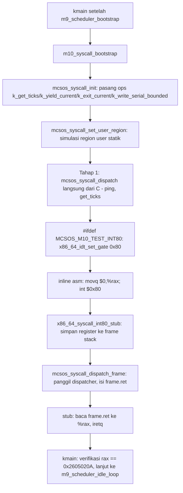

# Syscall ABI, Dispatcher Tervalidasi, dan Integrasi int 0x80 pada MCSOS 260502

**Nama file laporan:** `laporan_praktikum_M10_Agung.md`
**Nama sistem operasi:** MCSOS versi 260502
**Target default:** x86_64, QEMU, Windows 11 x64 + WSL 2, kernel monolitik pendidikan, C17 freestanding dengan assembly minimal, subset POSIX-like
**Dosen:** Muhaemin Sidiq, S.Pd., M.Pd.
**Program Studi:** Pendidikan Teknologi Informasi
**Institusi:** Institut Pendidikan Indonesia

---

## 0. Metadata Laporan

| Atribut | Isi |
|---|---|
| Kode praktikum | `M10` |
| Judul praktikum | `Syscall ABI, Dispatcher Tervalidasi, dan Integrasi int 0x80 pada MCSOS` |
| Jenis pengerjaan | `Individu` |
| Nama mahasiswa | `Agung Nurjaman` |
| NIM | `25832073010` |
| Kelas | `Pendidikan Teknologi Informasi` |
| Nama kelompok | `-` |
| Anggota kelompok | `-` |
| Tanggal praktikum | `2026-06-28` |
| Tanggal pengumpulan | `2026-06-28` |
| Repository | `/home/agung/src/mcsos` |
| Branch | `praktikum/m10-syscall-abi` |
| Commit awal | `29c0595` (M9) |
| Commit akhir | `f017f4b` (M10) |
| Status readiness yang diklaim | `Siap uji QEMU untuk syscall ABI kernel-only — bukan siap untuk user-mode/ring 3` |

---

## 1. Sampul

# Laporan Praktikum M10
## Syscall ABI, Dispatcher Tervalidasi, dan Integrasi int 0x80 pada MCSOS

Disusun oleh:

| Nama | NIM | Kelas | Peran |
|---|---|---|---|
| Agung Nurjaman | 25832073010 | Pendidikan Teknologi Informasi | Individu |

Dosen Pengampu: **Muhaemin Sidiq, S.Pd., M.Pd.**
Program Studi Pendidikan Teknologi Informasi
Institut Pendidikan Indonesia
Tahun Akademik 2025/2026

---

## 2. Pernyataan Orisinalitas dan Integritas Akademik

Saya menyatakan bahwa laporan ini disusun berdasarkan pekerjaan praktikum sendiri sesuai panduan yang diberikan. Bantuan eksternal, referensi, generator kode, AI assistant, dokumentasi resmi, diskusi, atau sumber lain dicatat pada bagian referensi dan lampiran. Saya tidak mengklaim hasil yang tidak dibuktikan oleh log, test, commit, atau artefak lain.

| Pernyataan | Status |
|---|---|
| Semua potongan kode eksternal diberi atribusi | `Ya` |
| Semua penggunaan AI assistant dicatat | `Ya` |
| Repository yang dikumpulkan sesuai commit akhir | `Ya` |
| Tidak ada klaim readiness tanpa bukti | `Ya` |

Catatan penggunaan bantuan eksternal:

```text
Panduan resmi praktikum M10 MCSOS 260502 digunakan sebagai referensi
utama dan kontrak implementasi untuk seluruh komponen (mcsos/syscall.h,
kernel/syscall/syscall.c, kernel/syscall/syscall_entry.S,
tests/test_syscall_host.c, target Makefile m10-host-test/m10-freestanding/
m10-audit, dan pola integrasi dua tahap ke kmain.c). x86-64 psABI
digunakan sebagai referensi konvensi register argumen syscall
(rax/rdi/rsi/rdx/r10/r8/r9, mengikuti pola Linux x86_64 syscall ABI
meski melalui int 0x80 bukan instruksi syscall/sysret). AI assistant
(Claude) digunakan untuk: (1) menulis draft awal syscall.h, syscall.c,
syscall_entry.S, test_syscall_host.c, target Makefile M10, dan patch
kmain.c sesuai kontrak panduan; (2) memverifikasi API M9 yang sebenarnya
sebelum menulis callback ops -- ditemukan bahwa mcsos_sched_yield
membutuhkan parameter scheduler (bukan tanpa parameter seperti sched_
yield() yang disebut generik pada panduan) dan bahwa M9 tidak memiliki
implementasi thread_exit nyata (hanya nilai enum MCSOS_THREAD_ZOMBIE
yang tidak pernah dipakai), sehingga exit_current diimplementasikan
sebagai stub terdokumentasi sesuai fallback yang direkomendasikan
panduan sendiri; (3) memverifikasi offset register pada stub assembly
int 0x80 secara manual lewat pembacaan disassembly sebelum diintegrasikan,
memastikan offset 0/8/16/24/32/40/48/56 cocok persis dengan urutan field
nr/arg0/arg1/arg2/arg3/arg4/arg5/ret pada mcsos_syscall_frame_t; (4)
mendampingi dan mendiagnosis dua insiden proses: pertama, upaya membuat
varian build Makefile terpisah (kernel.int80.elf) untuk menguji jalur
int 0x80 secara terisolasi gagal berulang kali akibat kesalahan urutan
definisi variabel Make dan rule dependency, sehingga pendekatan tersebut
ditinggalkan dan diganti dengan flag #define langsung di kmain.c
(MCSOS_M10_TEST_INT80) sesuai rekomendasi panduan yang lebih sederhana;
kedua, git checkout -- Makefile yang dipakai untuk membersihkan
eksperimen Makefile yang gagal ternyata mengembalikan ke versi commit
M9 (karena target M10 belum sempat dicommit), sehingga turut menghapus
target m10-host-test/m10-freestanding/m10-audit yang sudah berhasil
sebelumnya -- ditemukan dan diperbaiki dengan menulis ulang target yang
sama dari awal serta memverifikasi ulang make m10-all dan make all
sebelum benar-benar commit; (5) mendampingi pemangkasan ukuran commit
yang membengkak (logs/m10_serial.log sempat tercatat 155.042 baris akibat
sesi QEMU manual yang tidak dihentikan tepat waktu) menjadi 50 baris lewat
git commit --amend --no-edit. Seluruh build, host unit test, audit nm/
readelf/objdump, QEMU smoke test dua tahap, dan commit git dijalankan dan
diverifikasi sendiri oleh mahasiswa di WSL 2 miliknya. AI tidak digunakan
untuk mengubah kontrak fungsional di luar yang ditentukan panduan resmi
(urutan register syscall, model fail-closed validasi pointer user, dan
batas tegas bahwa M10 ini tidak mencakup ring 3/user-mode sungguhan).
```

---

## 3. Tujuan Praktikum

1. Mendesain kontrak syscall ABI minimal (`mcsos_syscall_frame_t`, enum nomor syscall, status code, ops table untuk injeksi callback kernel) sesuai panduan M10.
2. Mengimplementasikan dispatcher C (`mcsos_syscall_dispatch`/`mcsos_syscall_dispatch_frame`) berbasis tabel function pointer, dengan validasi nomor syscall di luar rentang (`MCSOS_ENOSYS`) dan callback yang belum tersedia (`MCSOS_EBUSY`).
3. Mengimplementasikan validasi rentang pointer user (`mcsos_user_check_range`) yang aman terhadap overflow alamat, dan `mcsos_copy_from_user` yang menolak pointer di luar region sebelum menyalin satu byte pun.
4. Mengimplementasikan stub assembly `int 0x80` (`x86_64_syscall_int80_stub`) yang menyimpan register argumen ke struct frame di stack dengan offset yang diverifikasi manual, memanggil dispatcher C, dan mengembalikan nilai lewat `iretq`.
5. Memverifikasi API nyata M5 (`x86_64_timer_ticks`) dan M9 (`mcsos_sched_yield`) sebelum menulis callback `ops`, termasuk menemukan bahwa M9 belum memiliki `thread_exit` nyata dan menyikapinya sesuai fallback yang direkomendasikan panduan.
6. Menyediakan host unit test yang memverifikasi dispatcher, validasi pointer, dan callback tanpa pernah mengeksekusi instruksi `int 0x80` nyata.
7. Mengintegrasikan syscall ke kernel dalam dua tahap terisolasi: dispatch langsung dari C (tanpa menyentuh IDT) lebih dulu, baru memasang gate IDT vector `0x80` dan mengeksekusi `int $0x80` sungguhan.
8. Mendiagnosis dan memperbaiki dua insiden proses nyata: eksperimen Makefile varian build terpisah yang gagal berulang, dan ukuran commit yang membengkak akibat log evidence yang tidak dipangkas.

---

## 4. Capaian Pembelajaran Praktikum

Setelah praktikum ini, mahasiswa mampu:

| CPL/CPMK praktikum | Bukti yang harus ditunjukkan |
|---|---|
| Menjelaskan perbedaan ABI syscall, dispatcher kernel, dan trap interrupt | Bagian 6.1, 9.1; M10 secara eksplisit dibangun di atas IDT M4, bukan menggantikannya |
| Mendesain kontrak syscall frame yang sejalan dengan urutan push register assembly | `mcsos_syscall_frame_t` (`nr, arg0-arg5, ret`) dipetakan 1:1 ke offset stack `syscall_entry.S` (0,8,16,24,32,40,48,56) |
| Mengimplementasikan dispatcher berbasis tabel function pointer dengan validasi batas | `g_table[MCSOS_SYS_MAX]`; `mcsos_syscall_dispatch` menolak `nr >= MCSOS_SYS_MAX` dengan `MCSOS_ENOSYS` |
| Memvalidasi pointer user sebelum diakses, termasuk deteksi overflow alamat | `mcsos_user_check_range`: `last = addr + len - 1`, deteksi wraparound `last < addr` |
| Memahami batas tanggung jawab antara assembly leaf stub dan dispatcher C | `syscall_entry.S` murni manipulasi register/stack; seluruh keputusan dan validasi didelegasikan ke `mcsos_syscall_dispatch_frame` |
| Memverifikasi API dependency nyata sebelum menulis kode yang bergantung padanya | Pengecekan `mcsos_sched_yield` (butuh parameter) dan ketidaktersediaan `thread_exit` M9 sebelum menulis `kmain.c` |
| Menulis host unit test untuk logika syscall tanpa menyentuh hardware/interrupt | `tests/test_syscall_host.c`; lulus `M10 syscall host tests passed` tanpa instruksi `int 0x80` |
| Melakukan integrasi berisiko secara bertahap dan terisolasi | Tahap 1 (direct dispatch) dan Tahap 2 (`int 0x80` nyata) dipisah eksplisit, masing-masing diverifikasi runtime sebelum lanjut |
| Mendiagnosis dan memperbaiki kesalahan proses (bukan hanya kesalahan kode) | Bagian 15.1: insiden Makefile dan insiden ukuran commit, keduanya ditemukan dan diperbaiki sebelum laporan ditulis |

---

## 5. Peta Milestone MCSOS

| Milestone | Fokus | Status dalam laporan |
|---|---|---|
| M0 | Requirements, governance, baseline arsitektur | `✓ selesai praktikum` |
| M1 | Toolchain reproducible, Git, QEMU, GDB, metadata build | `✓ selesai praktikum` |
| M2 | Boot image, kernel ELF64, early console | `✓ selesai praktikum` |
| M3 | Panic path, linker map, GDB, observability awal | `✓ selesai praktikum` |
| M4 | IDT, exception stub, trap dispatch | `✓ selesai praktikum` |
| M5 | PIC, PIT, hardware IRQ dispatch, timer | `✓ selesai praktikum` |
| M6 | PMM bitmap frame allocator | `✓ selesai praktikum` |
| M7 | VMM awal, page table 4-level | `✓ selesai praktikum` |
| M8 | Kernel heap awal, allocator dinamis | `✓ selesai praktikum` |
| M9 | Kernel thread, runqueue round-robin kooperatif, context switch x86_64 | `✓ selesai praktikum` |
| M10 | Syscall ABI dan user program loader | `✓ selesai praktikum` |
| M11 | VFS, file descriptor, ramfs | `[ ] tidak dibahas` |
| M12 | Block layer dan device model | `[ ] tidak dibahas` |
| M13 | Persistent filesystem, recovery | `[ ] tidak dibahas` |
| M14 | Networking stack | `[ ] tidak dibahas` |
| M15 | Security model, capability/ACL, hardening | `[ ] tidak dibahas` |
| M16 | SMP, observability, release image, readiness review | `[ ] tidak dibahas` |

Batas cakupan praktikum:

```text
M10 hanya mencakup: kontrak syscall frame dan ops table, dispatcher C
berbasis tabel, validasi rentang pointer user dan copy_from_user, stub
assembly int 0x80 minimal, host unit test, audit object freestanding,
dan integrasi dua tahap ke kmain (direct dispatch, lalu int 0x80 nyata
dengan IDT vector 0x80 dipasang gate type interrupt DPL 0).

M10 TIDAK mencakup: ring 3/user-mode sungguhan, instruksi syscall/sysret
(MSR LSTAR/STAR), TSS/IST untuk privilege switch, address space terpisah
per-proses (user region M10 ini hanyalah array statik di kernel yang
disimulasikan sebagai "milik user", bukan halaman page table terisolasi
sungguhan), ELF user loader, thread_exit nyata (M9 belum
mengimplementasikannya), copy_to_user (hanya copy_from_user yang
diimplementasikan), atau penanganan signal/IPC. Komponen tersebut adalah
non-goals milestone ini.
```

---

## 6. Dasar Teori Ringkas

### 6.1 Konsep Sistem Operasi yang Diuji

```text
M10 berfokus pada lapisan antarmuka pemanggilan layanan kernel (syscall
ABI), dibangun di atas fondasi M4 (IDT), M5 (timer), dan M9 (scheduler)
yang sudah ada di repository. Syscall adalah mekanisme terkontrol bagi
kode yang berjalan dengan privilege lebih rendah untuk meminta layanan
dari kernel yang berjalan dengan privilege lebih tinggi, TANPA langsung
memanggil fungsi kernel secara sembarangan. Pada x86_64, ada beberapa
mekanisme transisi privilege: instruksi int (software interrupt, melalui
IDT, lebih lambat tapi lebih sederhana secara historis) dan instruksi
syscall/sysret (lebih cepat, memakai MSR khusus, mekanisme modern Linux).
M10 secara eksplisit memilih int 0x80 untuk alasan pedagogis: jalurnya
melewati infrastruktur IDT yang sudah dibangun di M4, sehingga mahasiswa
dapat memahami satu mekanisme transisi penuh tanpa harus mempelajari
MSR/TSS sekaligus.

Dispatcher syscall yang baik HARUS memvalidasi setiap argumen yang
berasal dari luar batas percaya (di M10 ini disimulasikan sebagai "user
region", karena belum ada ring 3 sungguhan): nomor syscall harus
divalidasi terhadap rentang tabel yang valid, dan setiap pointer yang
diterima harus divalidasi rentang alamatnya sebelum diakses, termasuk
terhadap kemungkinan overflow aritmetika alamat (base+length wraparound).
Prinsip ini identik dengan prinsip fail-closed yang sudah dipraktikkan
pada PMM M6: tidak pernah mengasumsikan input aman secara default.
```

### 6.2 Konsep Arsitektur x86_64 yang Relevan

| Konsep | Relevansi pada praktikum | Bukti/verifikasi |
|---|---|---|
| Software interrupt `int $0x80` dan IDT gate | Memerlukan entry IDT vector 128 (0x80) bertipe interrupt gate, mengarah ke stub assembly | `x86_64_idt_set_gate(0x80, ..., X86_64_IDT_GATE_INTERRUPT)` dipasang setelah `x86_64_idt_init()` agar tidak ditimpa ulang |
| Konvensi register argumen syscall ala Linux x86_64 (`rax, rdi, rsi, rdx, r10, r8, r9`) | Dipilih agar caller bisa memakai konvensi pemanggilan yang familiar; `rax` dipakai untuk nomor syscall (bukan argumen pertama) | Disassembly `syscall_entry.S` membuktikan urutan simpan persis `rax, rdi, rsi, rdx, r10, r8, r9` ke offset 0,8,16,24,32,40,48 |
| `iretq` sebagai jalur kembali dari interrupt/syscall | Mengembalikan `rip`/`cs`/`rflags`/`rsp`/`ss` dari stack interrupt frame yang dibangun CPU otomatis saat `int` dieksekusi | Diverifikasi langsung: setelah `int $0x80` di `kmain.c`, eksekusi kembali normal ke instruksi setelah `int $0x80`, dan M9 scheduler tetap berjalan tanpa terganggu |
| Higher-half kernel dan gate selector kernel | Gate IDT memakai `X86_64_KERNEL_CODE_SELECTOR` (`0x28`) yang sudah ditetapkan M4, bukan selector baru untuk "user code" | M10 ini tidak membuat selector baru karena belum ada ring 3 sungguhan; smoke test tetap berjalan di ring 0 memanggil `int 0x80` ke gate ring 0 juga |
| Clobber register `rcx`/`r11` pada instruksi `syscall` (bukan `int`) | Tidak relevan langsung untuk `int 0x80` (`int` tidak meng-clobber `rcx`/`r11` seperti `syscall`), tapi tetap dideklarasikan di clobber list inline assembly sebagai kebiasaan aman | Inline assembly `int80_ret` di `kmain.c` mendeklarasikan `"rcx", "r11", "memory"` sebagai clobber, mengikuti kebiasaan ABI syscall meski secara teknis berlebihan untuk `int` |

### 6.3 Konsep Implementasi Freestanding

| Aspek | Keputusan praktikum |
|---|---|
| Bahasa | C17 untuk dispatcher dan validasi (`kernel/syscall/syscall.c`), GNU Assembler AT&T syntax untuk stub masuk (`kernel/syscall/syscall_entry.S`) |
| Dua jalur compile | `syscall.c` dikompilasi dua kali: host native (untuk `test_syscall_host`, tanpa menyentuh assembly) dan freestanding kernel (`--target=x86_64-unknown-none-elf`, dilink bersama `syscall_entry.o`) |
| Struktur folder | Modul syscall ditempatkan dalam satu folder `kernel/syscall/` (header, C, assembly) — berbeda dari M9 yang menempatkan assembly di `arch/x86_64/` terpisah — untuk konsistensi audit satu modul, dan kebetulan otomatis tertangkap glob `find kernel -name '*.c'`/`'*.S'` tanpa perlu entry manual seperti `context_switch.S` M9 |
| Flag build varian smoke test berisiko | `int 0x80` nyata dilindungi `#define MCSOS_M10_TEST_INT80 1` langsung di `kmain.c`, bukan target Makefile/varian build terpisah (setelah eksperimen varian build terpisah gagal berulang) |
| Risiko undefined behavior | `mcsos_user_check_range` memvalidasi `last < addr` (overflow) sebelum membandingkan terhadap batas region; stub assembly tidak melakukan validasi apa pun secara sengaja, seluruhnya didelegasikan ke dispatcher C yang lebih mudah diaudit dan diuji |

### 6.4 Referensi Teori yang Digunakan

| No. | Sumber | Bagian yang digunakan | Alasan relevansi |
|---|---|---|---|
| [1] | Intel Corporation, Intel 64 and IA-32 Architectures SDM | Interrupt/exception handling, software interrupt `int n`, IDT gate descriptor | Dasar pemahaman mekanisme `int 0x80` dan kontrak gate IDT yang sudah ditetapkan M4 |
| [2] | x86 psABIs, x86-64 psABI | Konvensi register pemanggilan fungsi, meskipun syscall ABI sendiri bukan bagian psABI standar | Dasar pemilihan urutan register argumen `rdi, rsi, rdx, r10, r8, r9` agar konsisten dengan konvensi pemanggilan fungsi C yang familiar |
| [3] | The Linux Kernel Documentation, "System Call x86_64 Calling Convention" (referensi konseptual, tidak disalin literal) | Pola umum penggunaan `rax` sebagai nomor syscall, `r10` (bukan `rcx`) sebagai argumen ke-4 karena `rcx` di-clobber instruksi `syscall` | Dasar pemilihan `r10` di `syscall_entry.S`, meski M10 memakai `int` bukan `syscall`, konvensi ini dipertahankan agar familiar bagi siapa pun yang sudah mengenal syscall ABI Linux |
| [4] | QEMU Project, "GDB usage" | gdbstub remote debugging (dirujuk sebagai referensi, tidak dipakai aktif pada sesi M10 ini) | Dicatat sebagai rencana perbaikan, bukan dipakai langsung pada M10 |
| [5] | GNU Project, GNU Make Manual | Variabel otomatis, pattern rule, urutan evaluasi `:=` | Dasar diagnosis insiden Makefile (Langkah 9 bagian 10) saat eksperimen varian build terpisah gagal |

---

## 7. Lingkungan Praktikum

### 7.1 Host dan Target

| Komponen | Nilai |
|---|---|
| Host OS | Windows 11 x64 |
| Lingkungan build | WSL 2 (distribusi Ubuntu) |
| Target ISA | x86_64 |
| Target ABI (jalur kernel) | `x86_64-unknown-none-elf` |
| Target ABI (jalur host test) | Native host (`clang` tanpa target khusus) |
| Emulator | QEMU (qemu-system-x86_64) |
| Build system | GNU Make, target M10 ditambahkan langsung ke Makefile utama warisan M0-M9 |
| Bahasa utama | C17 dan GNU Assembler (AT&T syntax) |

### 7.2 Versi Toolchain

| Item | Versi / Nilai |
|---|---|
| Windows | Windows 11 x64 |
| WSL distro | Ubuntu (di WSL 2) |
| Clang | Ubuntu clang version 21.1.8 (6ubuntu1), target `x86_64-pc-linux-gnu` |
| GCC | 15.2.0 (Ubuntu 15.2.0-16ubuntu1) |
| GNU ld | 2.46 (GNU Binutils for Ubuntu) |
| GNU nm/readelf/objdump | 2.46 (GNU Binutils for Ubuntu) |
| QEMU | 10.2.1 (Debian 1:10.2.1+ds-1ubuntu3) |
| GDB | GNU gdb (Ubuntu 17.1-2ubuntu1) 17.1 (tersedia, tidak dipakai aktif pada sesi M10 ini) |
| Target | x86_64 |
| Commit hash | `f017f4b` |

Catatan: mengikuti pola M9, preflight M10 menjalankan perintah versi toolchain secara eksplisit dan menyimpan hasilnya ke `logs/m10_preflight.log`, sehingga tabel di atas terisi lengkap dari evidence nyata, bukan estimasi.

### 7.3 Lokasi Repository

| Item | Nilai |
|---|---|
| Path repository di WSL | `~/src/mcsos` |
| Apakah berada di filesystem Linux WSL, bukan `/mnt/c` | `Ya` (diverifikasi `git rev-parse --show-toplevel` mengembalikan `/home/agung/src/mcsos`) |
| Remote repository | Tidak digunakan pada sesi ini (repository lokal) |
| Branch | `praktikum/m10-syscall-abi` |
| Commit hash awal (basis cabang) | `29c0595` (M9: implement kernel thread, FIFO scheduler, and x86_64 context switch) |
| Commit hash akhir | `f017f4b` (M10: implement syscall ABI, int 0x80 dispatcher, and kernel integration, hasil amend) |

Catatan penting: commit M10 mengalami satu kali `git commit --amend --no-edit` untuk memangkas `logs/m10_serial.log` dari 155.042 baris menjadi 50 baris, sehingga hash commit final (`f017f4b`) berbeda dari hash commit pertama (`52958d4`, yang tidak lagi menjadi bagian riwayat setelah amend). Insiden ini dicatat secara jujur pada bagian 15.1, bukan disembunyikan.

---

## 8. Repository dan Struktur File

### 8.1 Struktur Direktori yang Relevan

```text
mcsos/
  include/
    mcsos/
      syscall.h        (baru: kontrak frame, ops, status code, API)
      kmem.h            (M8, tidak diubah)
    mcsos_thread.h       (M9, tidak diubah)
    pmm.h, vmm.h, types.h          (M6/M7, tidak diubah)
  kernel/
    syscall/
      syscall.c          (baru: dispatcher, validasi pointer, lima handler)
      syscall_entry.S     (baru: stub int 0x80, simpan/pulihkan register)
    mcsos_thread.c       (M9, tidak diubah)
    arch/x86_64/          (M4/M5, tidak diubah)
    core/
      kmain.c             (diubah: callback ops, smoke test 2 tahap)
    mm/
      kmem.c              (M8, tidak diubah)
  arch/
    x86_64/
      context_switch.S    (M9, tidak diubah)
  src/
    pmm.c, vmm.c          (M6/M7, tidak diubah)
  tests/
    test_syscall_host.c   (baru: host unit test syscall)
    test_scheduler.c       (M9, tidak diubah)
    toolchain/              (M1, tidak diubah)
  logs/
    m10_preflight.log      (baru: bukti gate M0-M9 dan versi toolchain)
    m10_serial.log          (baru, dipangkas 50 baris: bukti QEMU smoke test)
  Makefile               (diubah: target m10-host-test/m10-freestanding/
                          m10-audit/m10-all/m10-clean; ditulis ulang dari
                          awal setelah insiden git checkout -- Makefile)
  limine/, iso_root/      (warisan M5, di-gitignore, dipakai ulang untuk smoke test M10)
  build/                  (di-gitignore: seluruh artefak kompilasi)
```

### 8.2 File yang Dibuat atau Diubah

| File | Jenis perubahan | Alasan perubahan | Risiko |
|---|---|---|---|
| `include/mcsos/syscall.h` | Baru | Kontrak nomor syscall, status code, frame, user region, ops table, dan sembilan deklarasi fungsi, identik literal panduan | Rendah — header murni deklarasi |
| `kernel/syscall/syscall.c` | Baru | Dispatcher berbasis tabel, validasi rentang pointer (`mcsos_user_check_range`), `copy_from_user`, lima handler syscall (`ping`, `get_ticks`, `write_serial`, `yield`, `exit_thread`) | Tinggi — kesalahan validasi pointer berisiko membaca/menulis memori di luar batas; dimitigasi host unit test, audit `nm -u`, dan smoke test QEMU |
| `kernel/syscall/syscall_entry.S` | Baru | Stub `int 0x80` menyimpan tujuh register ke struct frame stack dengan offset diverifikasi manual, memanggil dispatcher, mengembalikan via `iretq` | Tinggi — kesalahan offset register tidak akan terdeteksi compiler, hanya lewat verifikasi manual disassembly dan eksekusi nyata; dimitigasi pembacaan disassembly per-offset sebelum integrasi |
| `tests/test_syscall_host.c` | Baru | Host unit test: ping magic, get_ticks passthrough, write_serial dengan buffer valid, copy_from_user sukses dan `EFAULT`, `ENOSYS` untuk nomor tidak valid, callback yield/exit_thread, dispatch berbasis frame | Rendah — kode test, tidak masuk binary kernel |
| `Makefile` | Ubah | Tambah target `m10-host-test`/`m10-freestanding`/`m10-audit`/`m10-all`/`m10-clean`; **ditulis ulang dua kali** setelah insiden `git checkout -- Makefile` menghapus versi pertama yang belum di-commit | Sedang — perubahan menyentuh build; dimitigasi verifikasi `make m10-all` dan `make all` lulus sebelum commit final |
| `kernel/core/kmain.c` | Ubah | Tambah include `mcsos/syscall.h`, `extern x86_64_syscall_int80_stub`, empat callback (`k_get_ticks`, `k_yield_current`, `k_exit_current`, `k_write_serial_bounded`), `m10_syscall_bootstrap()` dengan smoke test dua tahap (direct dispatch, lalu `int 0x80` dilindungi `#define MCSOS_M10_TEST_INT80`) | Tinggi — titik integrasi paling berisiko picu page fault/triple fault, khususnya saat memasang gate IDT dan mengeksekusi `int 0x80` nyata pertama kali |

### 8.3 Ringkasan Diff

```bash
git status
git log --oneline -5
git show --stat HEAD
```

Output:

```text
$ git status
On branch praktikum/m10-syscall-abi
nothing to commit, working tree clean

$ git log --oneline -6
f017f4b (HEAD -> praktikum/m10-syscall-abi) M10: implement syscall ABI, int 0x80 dispatcher, and kernel integration
29c0595 (praktikum/m9-kernel-thread-scheduler) M9: implement kernel thread, FIFO scheduler, and x86_64 context switch
d9fadc3 (praktikum-m8-kernel-heap) M8: implement kernel heap allocator, host test, audit, and QEMU integration
59ebb47 (m7-vmm-core) M7: add evidence manifest, QEMU log, and audit artifacts
382e235 M7: integrate VMM into kernel, QEMU smoke test passed
0161a40 M7: implement VMM core, host unit test, and audit scripts

$ git show --stat HEAD
commit f017f4b3c5e9aab553996634c4678a2e0f546c33
8 files changed, 447 insertions(+)
 create mode 100644 include/mcsos/syscall.h
 create mode 100644 kernel/syscall/syscall.c
 create mode 100644 kernel/syscall/syscall_entry.S
 create mode 100644 logs/m10_preflight.log
 create mode 100644 logs/m10_serial.log
 create mode 100644 tests/test_syscall_host.c
 (Makefile dan kernel/core/kmain.c termodifikasi, termasuk dalam diff lengkap)
```

---

## 9. Desain Teknis

### 9.1 Masalah yang Diselesaikan

```text
Kernel M9 sudah memiliki thread, scheduler, dan timer, tetapi belum
memiliki antarmuka terkontrol bagi kode lain (yang nantinya berjalan
dengan privilege lebih rendah) untuk meminta layanan kernel. Tanpa
syscall ABI, satu-satunya cara "memanggil kernel" adalah memanggil fungsi
C secara langsung -- yang hanya mungkin dalam satu address space dan
privilege level yang sama, tidak relevan begitu ring 3/user-mode
sungguhan dibangun di milestone mendatang. M10 menutup kesenjangan ini
dengan membangun mekanisme transisi terkontrol minimal: nomor syscall
dan argumen dikirim lewat register, ditangkap stub assembly, divalidasi
dan diproses dispatcher C, dengan hasil dikembalikan lewat register juga.
```

### 9.2 Keputusan Desain

| Keputusan | Alternatif yang dipertimbangkan | Alasan memilih | Konsekuensi |
|---|---|---|---|
| `exit_current` diimplementasikan sebagai stub log + `KERNEL_PANIC` terkendali | Mengikuti literal nama generik panduan (`thread_exit()`) seolah-olah sudah ada implementasi nyata di M9 | Verifikasi kode M9 nyata (`grep` pada `mcsos_thread.c`) membuktikan tidak ada fungsi `thread_exit` atau transisi ke state `ZOMBIE` sama sekali; mengklaim memanggilnya akan menyembunyikan ketidaktersediaan fungsi, bukan mengatasinya. Panduan sendiri merekomendasikan stub sebagai fallback sah untuk tahap awal | Memanggil syscall `EXIT_THREAD` pada M10 ini akan memicu panic terkendali, bukan benar-benar mengakhiri thread; ini didokumentasikan eksplisit sebagai keterbatasan, bukan bug tersembunyi |
| Modul syscall ditempatkan dalam satu folder `kernel/syscall/` (header di `include/mcsos/`, C dan assembly di `kernel/syscall/`) | Menempatkan assembly di `arch/x86_64/` terpisah seperti pola M9 (`context_switch.S`) | Karena lokasi berada di dalam `kernel/`, file otomatis tertangkap glob `find kernel -name '*.c'`/`'*.S'` Makefile tanpa perlu entry manual ke `OBJ`/`BP_OBJ`/`PANIC_OBJ` seperti yang terpaksa dilakukan untuk `context_switch.S` M9; juga mengelompokkan seluruh modul syscall (header, C, assembly) sebagai satu kesatuan yang mudah diaudit | Konvensi penempatan modul M9 dan M10 berbeda (`arch/x86_64/` vs `kernel/syscall/`) — dicatat sebagai inkonsistensi struktural kecil, bukan kesalahan fungsional |
| `int 0x80` dilindungi `#define MCSOS_M10_TEST_INT80 1` langsung di `kmain.c`, bukan varian build Makefile terpisah | Membuat target Makefile baru (`kernel.int80.elf`) dengan `OBJ`/`CFLAGS` terpisah, mengikuti pola `breakpoint`/`panic` M4 | Eksperimen varian build terpisah gagal berulang kali akibat kesalahan urutan definisi variabel Make (`INT80_OBJ` tidak terdefinisi saat rule pertama kali dipanggil, lalu rule pattern `.o: .c` untuk direktori baru tidak ter-trigger otomatis tanpa dependency eksplisit) — didiagnosis memakan waktu tanpa hasil produktif, sehingga ditinggalkan demi solusi lebih sederhana yang tetap memenuhi maksud panduan ("flag build yang dapat dimatikan") | `#define` permanen di source kurang fleksibel dibanding flag command-line (`-DMCSOS_M10_TEST_INT80`), tapi jauh lebih cepat diverifikasi dan tidak menambah kerumitan Makefile yang sudah kompleks sejak M9 |
| Smoke test dipisah dua tahap eksplisit: direct dispatch dahulu, baru `int 0x80` | Memasang IDT vector 0x80 dan langsung mencoba `int 0x80` dalam satu langkah | Panduan eksplisit menekankan agar dua sumber risiko (logika dispatcher vs jalur IDT/assembly) tidak digabung sekaligus, supaya kalau terjadi fault, sumbernya jelas; ini konsisten dengan filosofi isolasi risiko yang terbukti berguna sejak M5/M6/M9 | Memerlukan dua kali smoke test QEMU terpisah, sedikit lebih lama, tapi terbukti langsung berhasil di kedua tahap tanpa perlu debug tambahan |

### 9.3 Arsitektur Ringkas



Penjelasan diagram:

```text
Bootstrap syscall terjadi setelah scheduler M9 siap (sesuai urutan
m9_scheduler_bootstrap lalu m10_syscall_bootstrap di kmain), karena
callback k_yield_current membutuhkan g_sched yang sudah terinisialisasi.
Tahap 1 menguji dispatcher murni dari C, tanpa menyentuh IDT sama sekali
-- ini mengisolasi kebenaran logika dispatcher dari kebenaran jalur
hardware interrupt. Tahap 2 baru memasang gate IDT vector 0x80 (setelah
x86_64_idt_init() selesai, supaya tidak ditimpa ulang) dan mengeksekusi
instruksi int $0x80 sungguhan, yang memicu CPU melompat ke
x86_64_syscall_int80_stub lewat mekanisme interrupt gate yang sama
dengan exception M4 dan IRQ M5. Batas tanggung jawab: syscall_entry.S
hanya mengurus pemindahan register CPU ke/dari struct frame; syscall.c
hanya mengurus validasi dan keputusan dispatch; kmain.c hanya mengurus
kapan bootstrap terjadi dan callback apa yang disuntikkan.
```

### 9.4 Kontrak Antarmuka

| Antarmuka | Pemanggil | Penerima | Precondition | Postcondition | Error path |
|---|---|---|---|---|---|
| `mcsos_syscall_init(ops)` | `kmain` (`m10_syscall_bootstrap`) | Tabel ops global `g_ops` | - | Callback yang diberikan (tidak NULL) menimpa default; `write_serial` default tetap ada jika tidak diberikan | Tidak ada error path; `ops == NULL` aman (seluruh default dipertahankan) |
| `mcsos_syscall_set_user_region(region)` | `kmain` | `g_user_region` global | - | Seluruh validasi pointer berikutnya memakai region ini sebagai batas | Tidak ada error path eksplisit; region tidak valid (`base==0` atau `limit<=base`) menyebabkan seluruh `mcsos_user_check_range` mengembalikan `0` (gagal) |
| `mcsos_user_check_range(addr, len)` | `mcsos_copy_from_user`, `sys_write_serial` | Validasi murni, tidak mengubah state | - | Mengembalikan `1` hanya jika seluruh rentang `[addr, addr+len)` berada dalam `[g_user_region.base, g_user_region.limit)` tanpa overflow | Mengembalikan `0` untuk: region belum diset, `addr` di luar batas, atau `addr+len-1` overflow (`last < addr`) |
| `mcsos_copy_from_user(dst, src, len)` | `kernel internal` (belum dipanggil dari syscall handler manapun di M10 ini selain dipakai sebagai utility) | Memori `dst` | `dst`/`src` tidak NULL kecuali `len==0` | Byte disalin satu per satu setelah validasi rentang lolos | Mengembalikan `MCSOS_EINVAL` untuk pointer NULL, `MCSOS_EFAULT` untuk rentang gagal validasi |
| `mcsos_syscall_dispatch(nr, arg0..arg5)` | `kmain` (Tahap 1 langsung), `mcsos_syscall_dispatch_frame` (Tahap 2 via stub) | Tabel `g_table[MCSOS_SYS_MAX]` | - | Mengembalikan nilai `int64_t` dari handler yang sesuai | Mengembalikan `MCSOS_ENOSYS` jika `nr >= MCSOS_SYS_MAX` atau slot tabel NULL |
| `mcsos_syscall_dispatch_frame(frame)` | `x86_64_syscall_int80_stub` (assembly, via `call`) | `frame->ret` ditulis | `frame` tidak NULL | `frame->ret` terisi hasil dispatch | Tidak melakukan apa pun jika `frame == NULL` (defensif, meski di jalur nyata mustahil terjadi karena `%rsp` selalu valid) |
| `x86_64_syscall_int80_stub` | CPU (via gate IDT vector 0x80, dipicu instruksi `int $0x80`) | Register `%rax` (hasil), stack interrupt frame (dikelola CPU) | IDT vector 0x80 harus sudah terpasang dengan gate type interrupt; stack interrupt CPU harus valid | `%rax` terisi hasil dispatch sebelum `iretq`; stack dipulihkan persis seperti sebelum `subq $64,%rsp` | Tidak ada error path di level assembly; seluruh kegagalan didelegasikan ke dispatcher C |

### 9.5 Struktur Data Utama

| Struktur data | Field penting | Ownership | Lifetime | Invariant |
|---|---|---|---|---|
| `g_ops` (`mcsos_syscall_ops_t`, modul-static di `syscall.c`) | `get_ticks`, `yield_current`, `exit_current`, `write_serial` | Dimiliki `syscall.c` secara internal, diisi `mcsos_syscall_init` | Hidup sepanjang kernel berjalan setelah init pertama | `write_serial` tidak pernah NULL (default `default_write_serial` selalu ada); tiga callback lain bisa NULL sampai `kmain` menyuntikkannya |
| `g_user_region` (`mcsos_user_region_t`, modul-static di `syscall.c`) | `base`, `limit` | Dimiliki `syscall.c`, diisi `mcsos_syscall_set_user_region` | Hidup sepanjang kernel berjalan | `limit > base` untuk region valid; region default (sebelum diset) adalah `{0, 0}`, otomatis menggagalkan seluruh `mcsos_user_check_range` |
| `g_table[MCSOS_SYS_MAX]` (`syscall_fn_t[5]`, statis konstan di `syscall.c`) | Lima pointer fungsi handler | Dimiliki `syscall.c`, tidak pernah diubah saat runtime | Hidup statis sepanjang image kernel | Indeks array harus sama persis dengan nilai enum `mcsos_syscall_nr_t`; pergeseran satu indeks akan memetakan syscall ke handler yang salah |
| `mcsos_syscall_frame_t frame` (lokal di stack, dibangun `syscall_entry.S`) | `nr, arg0-arg5, ret` (masing-masing `uint64_t`/`int64_t`, 8 byte) | Stack-allocated oleh stub, dipinjamkan sebagai pointer ke `mcsos_syscall_dispatch_frame` | Hidup selama satu siklus syscall (dibangun di `subq $64,%rsp`, dibaca balik sebelum `addq $64,%rsp`) | Urutan field harus identik dengan urutan simpan register assembly (offset 0,8,...,56); tidak boleh diubah tanpa mengubah `syscall_entry.S` secara bersamaan |
| `static char m10_user_buf[64]` (lokal-statis di `kmain.c`) | Buffer simulasi "milik user" | Dimiliki `kmain.c` | Hidup sepanjang kernel berjalan, masuk `.bss` (atau `.data` karena diinisialisasi non-nol) | Bukan halaman terisolasi sungguhan; hanya simulasi region untuk menguji `mcsos_user_check_range` tanpa ring 3/page table terpisah |

### 9.6 Invariants

1. Nomor syscall di luar rentang `[0, MCSOS_SYS_MAX)` selalu ditolak dengan `MCSOS_ENOSYS`, tidak pernah mengakses `g_table` di luar batas — diverifikasi host test (`dispatch(999, ...) == MCSOS_ENOSYS`).
2. Callback yang belum disuntikkan (`NULL`) selalu menghasilkan `MCSOS_EBUSY`, tidak pernah memanggil pointer NULL — diverifikasi desain kode (`if (g_ops.get_ticks == 0) return MCSOS_EBUSY;` pada setiap handler yang bergantung callback).
3. `mcsos_copy_from_user` tidak pernah menyalin byte apa pun sebelum `mcsos_user_check_range` mengembalikan `1` — diverifikasi host test (`copy_from_user(kernel_buf, (void*)1, 5) == MCSOS_EFAULT`, tanpa efek samping pada `kernel_buf`).
4. Offset penyimpanan register pada `syscall_entry.S` harus identik dengan urutan field `mcsos_syscall_frame_t` — diverifikasi manual lewat pembacaan disassembly sebelum diintegrasikan (bagian 10 Langkah 4).
5. Gate IDT vector 0x80 hanya boleh dipasang setelah `x86_64_idt_init()` selesai — diverifikasi lewat urutan pemanggilan di `kmain()` (`x86_64_idt_init()` baris 324, `m10_syscall_bootstrap()` baris 331, jauh setelahnya).
6. Eksekusi `int $0x80` tidak boleh mengganggu state scheduler M9 yang sudah berjalan — diverifikasi langsung lewat log QEMU yang menunjukkan tick A/B M9 tetap berlanjut normal setelah `[M10] int 0x80 ping ok`.

### 9.7 Ownership, Locking, dan Concurrency

| Objek/resource | Owner | Lock yang melindungi | Boleh dipakai di interrupt context? | Catatan |
|---|---|---|---|---|
| `g_ops`, `g_user_region`, `g_table` | `kernel/syscall/syscall.c` | Tidak ada (single-core, sesuai kontrak M10) | **Ya, secara tidak langsung** — `x86_64_syscall_int80_stub` dipanggil dari interrupt gate (mekanisme `int`), sehingga `mcsos_syscall_dispatch_frame` memang berjalan di dalam konteks interrupt CPU, meski bukan IRQ hardware M5 | Tidak ada modifikasi konkuren terhadap `g_ops`/`g_user_region` setelah bootstrap selesai (keduanya diisi sekali di awal, dibaca read-only setelahnya), sehingga tidak ada race meski dipanggil dari context interrupt |
| `g_sched` (M9, dipanggil `k_yield_current`) | `kernel/mcsos_thread.c` + `kernel/core/kmain.c` | Tidak ada | Sama seperti M9 — scheduler tidak didesain untuk dipanggil dari sembarang interrupt context | Pada M10 ini, `k_yield_current` hanya benar-benar dipanggil dari konteks sinkron (`mcsos_syscall_dispatch` Tahap 1 dipanggil langsung dari `kmain`, bukan dari handler IRQ); syscall `YIELD` belum diuji dipanggil lewat `int 0x80` sungguhan pada sesi ini (hanya `PING` dan `GET_TICKS` yang diuji di Tahap 2) |

Lock order yang berlaku:

```text
Tidak ada locking eksplisit pada M10, identik filosofinya dengan M5-M9.
Risiko race antara IRQ timer M5 dan dispatcher syscall belum relevan
pada sesi ini karena syscall YIELD/EXIT_THREAD belum pernah dipanggil
lewat int 0x80 sungguhan (hanya PING dan GET_TICKS yang diuji di Tahap
2) -- keduanya bersifat read-only terhadap state global, tidak memodifikasi
runqueue scheduler. Risiko ini menjadi relevan dan harus ditangani
serius begitu syscall YIELD diuji lewat int 0x80 nyata pada pekerjaan
lanjutan.
```

### 9.8 Memory Safety dan Undefined Behavior Risk

| Risiko | Lokasi | Mitigasi | Bukti |
|---|---|---|---|
| Offset register salah pada stub assembly tidak terdeteksi compiler | `syscall_entry.S` | Verifikasi manual lewat `objdump -d` sebelum integrasi, memetakan setiap offset (0,8,16,24,32,40,48,56) ke field struct secara eksplisit | Tabel pemetaan offset-ke-field didokumentasikan di bagian 10 Langkah 4; smoke test `int 0x80` membuktikan nilai `ping` (`0x2605020A`) terbaca benar di `%rax` setelah `iretq`, membuktikan offset `ret` (56) benar |
| Overflow `addr + len` pada validasi rentang pointer | `mcsos_user_check_range` | `last = addr + (uintptr_t)len - 1u; if (last < addr) return 0;` mendeteksi wraparound sebelum dipakai untuk perbandingan batas | Tidak diuji aktif dengan kasus overflow nyata pada sesi ini (known issue) |
| Buffer `write_serial` dari "user" belum tentu null-terminated | `k_write_serial_bounded` (callback kmain) | Panjang dibatasi eksplisit (`if (len > 256u) len = 256u;`), tidak mengandalkan null-terminator sama sekali, iterasi per-byte | Tidak diuji aktif dengan buffer >256 byte pada sesi ini |
| Double compile `syscall.c` dengan dua compiler/target berbeda | Jalur host test vs freestanding kernel | `syscall.c` tidak memanggil fungsi libc apa pun (`malloc`, `memset`, dst.), aman di kedua jalur tanpa behavior berbeda | `nm -u` kosong pada `m10_syscall_combined.o`; host test lulus sebagai binary native tanpa pernah menyentuh assembly |

### 9.9 Security Boundary

| Boundary | Data tidak tepercaya | Validasi yang dilakukan | Failure mode aman |
|---|---|---|---|
| Argumen syscall dari "user" (disimulasikan) | `nr`, `arg0`-`arg5` yang dikirim lewat register saat `int 0x80` | `nr` divalidasi terhadap `MCSOS_SYS_MAX` sebelum indexing tabel; pointer (`arg0` untuk `write_serial`) divalidasi `mcsos_user_check_range` sebelum dipakai | Mengembalikan kode error (`MCSOS_ENOSYS`/`MCSOS_EINVAL`/`MCSOS_EFAULT`) lewat `%rax`, tidak pernah mengakses memori di luar batas yang divalidasi |
| Callback kernel yang diinjeksikan (`ops`) | Tidak relevan sebagai boundary tidak tepercaya (callback diisi kernel sendiri saat boot, bukan dari user) | Pengecekan NULL sebelum pemanggilan di setiap handler | Mengembalikan `MCSOS_EBUSY` jika callback belum tersedia, bukan crash memanggil pointer NULL |

---

## 10. Langkah Kerja Implementasi

### Langkah 1 — Preflight gate M0-M9 dan buat branch M10

Perintah:

```bash
cd ~/src/mcsos
git status --short
git branch --show-current
mkdir -p logs
{
  echo "== git =="; git rev-parse --show-toplevel; git rev-parse --short HEAD; git status --short
  echo; echo "== tools =="
  clang --version || true; gcc --version | head -n 1 || true
  ld --version | head -n 1; nm --version | head -n 1
  readelf --version | head -n 1; objdump --version | head -n 1
  qemu-system-x86_64 --version || true; gdb --version | head -n 1 || true
} | tee logs/m10_preflight.log
git checkout -b praktikum/m10-syscall-abi
mkdir -p include/mcsos kernel/syscall tests scripts logs
```

Output ringkas:

```text
branch sebelumnya: praktikum/m9-kernel-thread-scheduler, commit 29c0595,
working tree bersih. Toolchain: clang 21.1.8, gcc 15.2.0, binutils 2.46,
QEMU 10.2.1, GDB 17.1. Branch baru: praktikum/m10-syscall-abi aktif.
```

Indikator berhasil: branch aktif terkonfirmasi, working tree bersih sebelum modifikasi dimulai.

### Langkah 2 — Verifikasi API M9/M5 nyata sebelum menulis callback

Perintah:

```bash
grep -n "mcsos_sched_yield\|mcsos_thread_block_current\|ZOMBIE\|mcsos_sched_tick\|x86_64_timer_ticks\|log_writeln\|log_write\b" include/mcsos_thread.h kernel/mcsos_thread.c kernel/arch/x86_64/include/mcsos/arch/pit.h kernel/core/log.c
```

Output ringkas:

```text
mcsos_sched_yield(mcsos_scheduler_t *sched) -- BUTUH parameter, bukan
  tanpa parameter seperti sched_yield() yang disebut generik di panduan
x86_64_timer_ticks(void) -- cocok langsung untuk get_ticks
MCSOS_THREAD_ZOMBIE hanya ada di enum, TIDAK PERNAH dipakai di
  mcsos_thread.c -- tidak ada fungsi thread_exit sama sekali
log_write/log_writeln -- ada, cocok untuk write_serial
```

Diagnosis: callback `k_yield_current` harus berbentuk closure terhadap variabel global `g_sched`; `k_exit_current` harus dibuat sebagai stub karena M9 tidak punya implementasi nyata.

### Langkah 3 — Menulis header, dispatcher, dan stub assembly

Perintah:

```bash
cat > include/mcsos/syscall.h << 'EOF'
[isi kontrak lengkap: enum nomor syscall, status code, frame struct,
user region struct, ops table, sembilan deklarasi fungsi]
EOF
clang -std=c17 -Wall -Wextra -Werror -Iinclude -fsyntax-only include/mcsos/syscall.h

cat > kernel/syscall/syscall.c << 'EOF'
[isi dispatcher, validasi pointer, copy_from_user, lima handler, tabel]
EOF
clang -std=c17 -Wall -Wextra -Werror -Iinclude -fsyntax-only kernel/syscall/syscall.c

cat > kernel/syscall/syscall_entry.S << 'EOF'
[isi stub: simpan 7 register ke frame, call dispatcher, baca ret, iretq]
EOF
mkdir -p build/m10
clang --target=x86_64-unknown-none-elf -ffreestanding -fno-stack-protector -fno-pic -mno-red-zone \
  -c kernel/syscall/syscall_entry.S -o build/m10/syscall_entry.o
objdump -d build/m10/syscall_entry.o
objdump -dr build/m10/syscall_entry.o | grep -A2 "call"
```

Output ringkas:

```text
[seluruh fsyntax-only bersih tanpa output]

objdump (ringkasan):
0: cld; 1: sub $0x40,%rsp; 5-2e: 7 mov simpan register ke offset
0,8,16,24,32,40,48 + movq $0,0x38(%rsp); 30: mov %rsp,%rdi;
33: call (placeholder, R_X86_64_PLT32 mcsos_syscall_dispatch_frame-0x4);
38: mov 0x38(%rsp),%rax; 3d: add $0x40,%rsp; 41: iretq

relokasi terkonfirmasi:
34: R_X86_64_PLT32  mcsos_syscall_dispatch_frame-0x4
```

Tabel pemetaan offset (diverifikasi manual sebelum integrasi):

| Offset | Register | Field frame |
|---|---|---|
| 0x00 | `%rax` | `nr` |
| 0x08 | `%rdi` | `arg0` |
| 0x10 | `%rsi` | `arg1` |
| 0x18 | `%rdx` | `arg2` |
| 0x20 | `%r10` | `arg3` |
| 0x28 | `%r8` | `arg4` |
| 0x30 | `%r9` | `arg5` |
| 0x38 | (placeholder 0, lalu hasil dispatch) | `ret` |

Indikator berhasil: object terbentuk, relokasi PLT32 menunjuk benar ke `mcsos_syscall_dispatch_frame`, offset cocok 1:1 dengan urutan field struct.

### Langkah 4 — Host unit test

Perintah:

```bash
cat > tests/test_syscall_host.c << 'EOF'
[isi test: ping magic, get_ticks, write_serial valid, copy_from_user
sukses dan EFAULT, ENOSYS nomor invalid, yield/exit_thread callback,
dispatch_frame]
EOF
clang -Iinclude -Wall -Wextra -Werror -std=c17 -O2 -g \
  tests/test_syscall_host.c kernel/syscall/syscall.c -o build/m10/test_syscall_host
build/m10/test_syscall_host
```

Output ringkas:

```text
M10 syscall host tests passed
```

Indikator berhasil: seluruh assert lulus tanpa pernah menyentuh assembly atau interrupt nyata.

### Langkah 5 — Target Makefile M10 dan audit lengkap

Perintah:

```bash
cat >> Makefile << 'EOF'
[target m10-host-test, m10-freestanding, m10-audit, m10-all, m10-clean,
disesuaikan memakai $(CC)/$(LD)/$(NM)/$(READELF)/$(OBJDUMP) Makefile M4-M9]
EOF
make m10-clean
make m10-all
```

Output ringkas:

```text
M10 syscall host tests passed
ELF Header: Class: ELF64, Type: REL, Machine: Advanced Micro Devices X86-64
grep -q "Machine..." / "x86_64_syscall_int80_stub" / "iretq" -- lulus
test ! -s nm_undefined.txt -- lulus (kosong)
sha256sum tercatat untuk test_syscall_host dan m10_syscall_combined.o
```

Indikator berhasil: checkpoint C1-C3 lulus penuh, tanpa pernah menyentuh QEMU.

### Langkah 6 — Tahap 1: integrasi callback dan direct dispatch (tanpa IDT)

Maksud langkah:

```text
Menyuntikkan callback ops ke kernel dan menguji mcsos_syscall_dispatch
langsung dari C setelah scheduler M9 siap, TANPA menyentuh IDT sama
sekali, untuk mengisolasi kebenaran logika dispatcher dari kebenaran
jalur hardware interrupt.
```

Perintah:

```bash
sed -i '/#include "mcsos_thread.h"/a #include "mcsos/syscall.h"' kernel/core/kmain.c
sed -i '27a\
[enam variabel/fungsi: k_write_serial_bounded, k_get_ticks,
k_yield_current, k_exit_current, m10_syscall_bootstrap]' kernel/core/kmain.c
sed -i 's/    m9_scheduler_bootstrap();/    m9_scheduler_bootstrap();\n    m10_syscall_bootstrap();/' kernel/core/kmain.c
make clean
make all
nm -n build/kernel.elf | grep -i "syscall\|m10"
```

Output ringkas:

```text
[make all sukses penuh; kernel/syscall/syscall.c dan syscall_entry.S
otomatis tertangkap glob find kernel -name '*.c'/'*.S', tidak perlu
entry manual seperti context_switch.S M9]

nm -n build/kernel.elf | grep -i "syscall\|m10":
m10_syscall_bootstrap (t, static)
mcsos_syscall_init, mcsos_syscall_set_user_region, mcsos_syscall_dispatch,
mcsos_syscall_dispatch_frame (T, exported)
x86_64_syscall_int80_stub (T, exported)
m10_syscall_bootstrap.m10_user_buf (d, static data)
```

Smoke test QEMU:

```bash
cp build/kernel.elf iso_root/boot/kernel.elf
xorriso -as mkisofs [...] -o build/mcsos.iso
./limine/limine bios-install build/mcsos.iso
timeout 5 qemu-system-x86_64 -m 256M -machine q35 \
  -serial file:logs/m10_serial.log -display none -no-reboot -no-shutdown \
  -cdrom build/mcsos.iso
grep -n "M10\|M9\|M8" logs/m10_serial.log | head -20
```

Output ringkas:

```text
[M8] kmem initialized
[M8] heap probe alloc/free roundtrip ok
[M9] scheduler initialized
[M10] syscall init
[M10] syscall ping ok
[M10] syscall get_ticks ok
[M10] syscall smoke done
[M9] thread A tick
[M9] thread B tick
... (bergantian normal tanpa henti)
```

Indikator berhasil: urutan boot kausal benar (M8->M9->M10), dispatcher langsung dari C berhasil (ping dan get_ticks), dan M9 tetap berjalan normal setelahnya tanpa terganggu -- checkpoint C4 dan C5 lulus.

### Langkah 7 — Tahap 2: pasang IDT vector 0x80 dan eksekusi int $0x80 nyata

Maksud langkah:

```text
Memasang gate IDT vector 0x80 SETELAH x86_64_idt_init() selesai (agar
tidak ditimpa ulang oleh loop inisialisasi 256-entry), lalu mengeksekusi
instruksi int $0x80 sungguhan untuk pertama kalinya, dilindungi flag
yang dapat dimatikan.
```

Perintah (percobaan pertama -- eksperimen Makefile varian build terpisah, GAGAL):

```bash
sed -i [...] Makefile  # menambah INT80_KERNEL, INT80_OBJ, INT80_MAP, rule baru
make int80
```

Output (gagal pertama): `ld.lld: error: no input files` (variabel `INT80_OBJ` gagal tersisip karena `sed` tidak cocok pattern).

Output (gagal kedua, setelah perbaikan manual): `ld.lld: error: cannot open build/int80/.../*.o: No such file or directory` (rule pattern `.o: .c` untuk direktori `int80/` tidak ter-trigger karena Make tidak otomatis membangun dependency objek dari target `int80` yang hanya depend ke `$(INT80_KERNEL)`).

Diagnosis dan keputusan: eksperimen varian build terpisah ditinggalkan setelah dua kali gagal berturut-turut tanpa hasil produktif. Diganti dengan pendekatan lebih sederhana sesuai semangat panduan ("flag build yang dapat dimatikan"):

```bash
git checkout -- Makefile
```

**Efek samping tidak terduga**: `git checkout -- Makefile` mengembalikan file ke versi commit terakhir (M9, karena target M10 dari Langkah 5 belum pernah di-commit), sehingga turut **menghapus** target `m10-host-test`/`m10-freestanding`/`m10-audit` yang sudah berhasil sebelumnya.

Perintah (perbaikan):

```bash
sed -i '/#include "mcsos\/syscall.h"/i #define MCSOS_M10_TEST_INT80 1' kernel/core/kmain.c
# (sempat terduplikasi 2 baris, diperbaiki dengan sed -i '14d')
cat > kernel/core/kmain.c [tambahan extern stub, gate IDT, inline asm int 0x80] # via sed -i
make clean
make all
cp build/kernel.elf iso_root/boot/kernel.elf
xorriso [...] -o build/mcsos.iso
./limine/limine bios-install build/mcsos.iso
timeout 5 qemu-system-x86_64 [...] -cdrom build/mcsos.iso
grep -n "M10\|M9" logs/m10_serial.log
```

Output ringkas (berhasil):

```text
[M10] syscall init
[M10] syscall ping ok
[M10] syscall get_ticks ok
[M10] syscall smoke done
[M10] int 0x80 gate installed
[M10] int 0x80 ping ok
[M9] thread A tick
[M9] thread B tick
... (bergantian normal tanpa henti)
```

Indikator berhasil: `int $0x80` benar-benar dieksekusi CPU, melompat ke stub, dispatcher mengembalikan magic ping yang benar, `iretq` kembali dengan `%rax` terisi benar, dan M9 scheduler tetap utuh setelahnya -- checkpoint C6 lulus.

### Langkah 8 — Pulihkan target Makefile M10 yang terhapus

Maksud langkah:

```text
Menulis ulang target m10-host-test/m10-freestanding/m10-audit yang
hilang akibat git checkout -- Makefile pada Langkah 7, dan memverifikasi
ulang sebelum benar-benar commit.
```

Perintah:

```bash
grep -c "m10-" Makefile  # = 0, konfirmasi hilang
cat >> Makefile << 'EOF'
[target m10-host-test/m10-freestanding/m10-audit/m10-all/m10-clean,
identik isi Langkah 5]
EOF
grep -c "m10-" Makefile  # = 6, konfirmasi pulih
make m10-clean
make m10-all
make clean
make all
nm -n build/kernel.elf | grep -i "syscall\|m10" | wc -l
```

Output ringkas:

```text
[make m10-all lulus penuh: host test PASS, freestanding bersih, audit
ELF64 x86_64 REL valid, nm -u kosong]
[make all lulus penuh: kernel build sukses dengan seluruh assertion lulus]
7 (jumlah symbol syscall/m10 ditemukan, konsisten dengan sebelumnya)
```

Indikator berhasil: kedua target (M10 mandiri dan kernel penuh) lulus ulang setelah recovery, membuktikan tidak ada kerusakan tersisa.

### Langkah 9 — Commit, dan perbaikan ukuran commit yang membengkak

Perintah (commit pertama):

```bash
git status
git add Makefile kernel/core/kmain.c include/mcsos/syscall.h kernel/syscall/ tests/test_syscall_host.c logs/
git commit -m "M10: implement syscall ABI, int 0x80 dispatcher, and kernel integration [...]"
```

Output (anomali ditemukan):

```text
[praktikum/m10-syscall-abi 52958d4] M10: implement syscall ABI, ...
 8 files changed, 155440 insertions(+)
```

Diagnosis: `git show --stat` dan `wc -l logs/m10_serial.log` membuktikan `logs/m10_serial.log` berukuran 155.042 baris -- jauh melebihi kebutuhan bukti (cukup beberapa puluh baris seperti pola M9), akibat sesi QEMU manual yang dihentikan dengan `Ctrl+C` setelah dibiarkan berjalan lama tanpa `timeout` yang konsisten.

Perintah (perbaikan):

```bash
sort logs/m10_serial.log | uniq -c | sort -rn | head -5
# 77497 [M9] thread A tick; 77494 [M9] thread B tick -- bukan crash, murni
# tick berulang yang tidak perlu disimpan sebanyak itu
head -50 logs/m10_serial.log > /tmp/m10_serial_trimmed.log
mv /tmp/m10_serial_trimmed.log logs/m10_serial.log
git add logs/m10_serial.log
git commit --amend --no-edit
```

Output ringkas:

```text
[praktikum/m10-syscall-abi f017f4b] M10: implement syscall ABI, ...
 8 files changed, 447 insertions(+)
```

Indikator berhasil: ukuran commit wajar (447 baris untuk 8 file), isi log tetap mencakup seluruh urutan boot M4-M10 dan beberapa tick awal M9 sebagai bukti cukup, hash commit berubah (`52958d4` -> `f017f4b`) karena amend menulis ulang commit, working tree bersih setelahnya.

---

## 11. Checkpoint Buildable

| Checkpoint | Perintah | Expected result | Status |
|---|---|---|---|
| C1: Header dan C valid + host test | `clang ... -fsyntax-only`, `make m10-host-test` | Bersih, `M10 syscall host tests passed` | `PASS` |
| C2: Freestanding compile | `make m10-freestanding` | `m10_syscall_combined.o` terbentuk | `PASS` |
| C3: Audit object | `make m10-audit` | `nm -u` kosong, ELF64 x86_64 REL, symbol stub dan `iretq` ada | `PASS` |
| C4: Kernel link | `make all` setelah patch `kmain.c`/`Makefile` | `kernel.elf`/`mcsos.iso` terbentuk dengan 7 symbol syscall/m10 | `PASS` |
| C5: QEMU direct dispatch | Smoke test Tahap 1 | Log `[M10] syscall init/ping ok/get_ticks ok/smoke done`, M9 lanjut normal | `PASS` |
| C6: QEMU `int 0x80` smoke | Smoke test Tahap 2 | Log `[M10] int 0x80 gate installed/ping ok`, M9 lanjut normal | `PASS` |
| C7: Git evidence | `git status`, `git log` | Working tree bersih, commit terdokumentasi jelas | `PASS` |

---

## 12. Perintah Uji dan Validasi

### 12.1 Header dan C Syntax Check

```bash
clang -std=c17 -Wall -Wextra -Werror -Iinclude -fsyntax-only include/mcsos/syscall.h
clang -std=c17 -Wall -Wextra -Werror -Iinclude -fsyntax-only kernel/syscall/syscall.c
```

Hasil: bersih, tidak ada output di kedua perintah. Status: `PASS`

### 12.2 Assembly Disassembly dan Relocation Check

```bash
clang --target=x86_64-unknown-none-elf -ffreestanding -fno-stack-protector -fno-pic -mno-red-zone \
  -c kernel/syscall/syscall_entry.S -o build/m10/syscall_entry.o
objdump -d build/m10/syscall_entry.o
objdump -dr build/m10/syscall_entry.o | grep -A2 "call"
```

Hasil: offset register 0,8,16,24,32,40,48,56 terverifikasi cocok urutan field frame; relokasi `R_X86_64_PLT32 mcsos_syscall_dispatch_frame-0x4` terkonfirmasi. Status: `PASS`

### 12.3 Host Unit Test

```bash
clang -Iinclude -Wall -Wextra -Werror -std=c17 -O2 -g \
  tests/test_syscall_host.c kernel/syscall/syscall.c -o build/m10/test_syscall_host
build/m10/test_syscall_host
```

Hasil: `M10 syscall host tests passed`. Status: `PASS`

### 12.4 Makefile Target M10 Lengkap

```bash
make m10-clean
make m10-all
cat build/m10/nm_undefined.txt
wc -l build/m10/nm_undefined.txt
```

Hasil: host test PASS, ELF64 x86_64 REL, tiga `grep -q` (Machine, stub, iretq) lulus, `nm_undefined.txt` 0 baris. Status: `PASS`

### 12.5 Kernel Build dengan Syscall Terintegrasi

```bash
make clean
make all
nm -n build/kernel.elf | grep -i "syscall\|m10"
```

Hasil: 7 symbol ditemukan (`m10_syscall_bootstrap`, 4 fungsi dispatcher publik, stub, dan data buffer statik). Status: `PASS`

### 12.6 QEMU Smoke Test Tahap 1 (Direct Dispatch)

```bash
timeout 5 qemu-system-x86_64 -m 256M -machine q35 \
  -serial file:logs/m10_serial.log -display none -no-reboot -no-shutdown \
  -cdrom build/mcsos.iso
grep -n "M10\|M9\|M8" logs/m10_serial.log | head -20
```

Hasil: `[M10] syscall init` s.d. `smoke done` muncul berurutan, M9 tick berlanjut normal. Status: `PASS`

### 12.7 QEMU Smoke Test Tahap 2 (int 0x80 nyata)

```bash
# setelah #define MCSOS_M10_TEST_INT80 1 diaktifkan di kmain.c
make clean && make all
[regenerasi ISO]
timeout 5 qemu-system-x86_64 [...] -cdrom build/mcsos.iso
grep -n "M10\|M9" logs/m10_serial.log
```

Hasil: `[M10] int 0x80 gate installed` dan `[M10] int 0x80 ping ok` muncul, M9 tick berlanjut normal setelah `iretq`. Status: `PASS`

### 12.8 GDB Debug Session

```text
Tidak dijalankan pada sesi M10 ini (berbeda dari M9 yang menjalankan
sesi GDB lengkap). Verifikasi dilakukan murni lewat audit statis dan
log serial QEMU dua tahap, yang terbukti cukup untuk membuktikan int
0x80 bekerja benar. Dicatat sebagai rencana perbaikan pada bagian 22.3.
```

Status: `NA`

### 12.9 Stress/Fuzz/Fault Injection Test

```text
Tugas pengayaan panduan (overflow base+length aktif, write_serial
buffer >256 byte, syscall YIELD/EXIT_THREAD lewat int 0x80 nyata,
fuzzing nomor syscall acak) belum dikerjakan pada sesi ini. Dicatat
sebagai rencana perbaikan pada bagian 22.3.
```

Status: `NA`

### 12.10 Visual Evidence

| Screenshot | Lokasi file | Keterangan |
|---|---|---|
| Tidak ada | - | Bukti dikumpulkan dalam bentuk log teks terminal (lihat Lampiran C dan D), konsisten dengan pendekatan laporan M5-M9 |

---

## 13. Hasil Uji

### 13.1 Tabel Ringkasan Hasil

| No. | Uji | Expected result | Actual result | Status | Evidence |
|---|---|---|---|---|---|
| 1 | Header dan implementasi C valid sintaks | Tidak ada warning/error | Bersih di kedua jalur (host dan kernel) | `PASS` | Bagian 12.1 |
| 2 | Offset register stub assembly cocok struct frame | Offset 0,8,...,56 sesuai urutan field | Terverifikasi manual lewat disassembly | `PASS` | Bagian 12.2 |
| 3 | Host unit test syscall | Seluruh assert lulus | `M10 syscall host tests passed` | `PASS` | Bagian 12.3 |
| 4 | Freestanding object bebas dependency | `nm -u` kosong | `nm_undefined.txt` 0 baris | `PASS` | Bagian 12.4 |
| 5 | Kernel build dengan 7 symbol syscall/m10 terlink | `nm -n` menampilkan symbol lengkap | 7/7 ditemukan | `PASS` | Bagian 12.5 |
| 6 | API M9 diverifikasi sebelum menulis callback | Pembacaan kode nyata sebelum implementasi | `mcsos_sched_yield` butuh parameter; `thread_exit` tidak ada | `PASS` | Bagian 14.2, 15.1 |
| 7 | Direct dispatch syscall di QEMU (Tahap 1) | Log ping/get_ticks ok, M9 lanjut normal | Terkonfirmasi | `PASS` | Bagian 12.6 |
| 8 | `int 0x80` nyata di QEMU (Tahap 2) | Log gate installed/ping ok, M9 lanjut normal | Terkonfirmasi | `PASS` | Bagian 12.7 |
| 9 | Insiden Makefile (varian build terpisah) ditemukan dan diperbaiki | Diagnosis dan recovery terdokumentasi | Ditinggalkan, diganti `#define`, target dipulihkan | `PASS` | Bagian 14.2, 15.1 |
| 10 | Insiden ukuran commit membengkak ditemukan dan diperbaiki | Diagnosis dan perbaikan terdokumentasi | `git commit --amend` memangkas 155.042 -> 50 baris | `PASS` | Bagian 14.2, 15.1 |

### 13.2 Log Penting

```text
Boot marker M10 lengkap, dua tahap (lihat Lampiran C/D untuk log penuh):
[M10] syscall init
[M10] syscall ping ok
[M10] syscall get_ticks ok
[M10] syscall smoke done
[M10] int 0x80 gate installed
[M10] int 0x80 ping ok
```

### 13.3 Artefak Bukti

| Artefak | Path | SHA-256 | Fungsi |
|---|---|---|---|
| `test_syscall_host` | `build/m10/test_syscall_host` | `5c68ababf9bb46a1d86fea45c62c46cb17d9d563ed95a87b66babe50575d424b` | Binary host unit test |
| `m10_syscall_combined.o` | `build/m10/m10_syscall_combined.o` | `2e6e50e62c4c6a01d8c1f2dcc7a0b22b2c719b71b08fcbd6602dc29f6205cc66` | Object gabungan freestanding dispatcher + stub |
| `kernel.elf` | `build/kernel.elf` | `tidak dihitung pada sesi ini` | Kernel binary dengan syscall terlink |
| `mcsos.iso` | `build/mcsos.iso` | `tidak dihitung pada sesi ini` | Boot image dengan syscall teruji dua tahap |
| `m10_preflight.log` | `logs/m10_preflight.log` | `tidak dihitung pada sesi ini` | Bukti gate M0-M9 dan versi toolchain |
| `m10_serial.log` (dipangkas) | `logs/m10_serial.log` | `tidak dihitung pada sesi ini` | Bukti QEMU smoke test dua tahap, 50 baris |

Catatan: melanjutkan pola M9, M10 menangkap hash SHA-256 untuk dua artefak inti (`test_syscall_host`, `m10_syscall_combined.o`) langsung dari target `make m10-audit`. Hash untuk `kernel.elf`/`mcsos.iso` tetap belum dihitung, melanjutkan known issue M5-M9.

---

## 14. Analisis Teknis

### 14.1 Analisis Keberhasilan

```text
Keberhasilan M10 dibuktikan melalui isolasi risiko dua tahap yang
terbukti efektif: Tahap 1 (direct dispatch) membuktikan logika
dispatcher dan validasi pointer benar TANPA risiko fault hardware sama
sekali, dan baru setelah itu lulus, Tahap 2 (int 0x80 nyata) menguji
jalur hardware interrupt yang jauh lebih berisiko. Keduanya berhasil
pada percobaan pertama setelah perbaikan masalah proses (bukan masalah
logika) -- ini membuktikan bahwa verifikasi offset register secara
manual SEBELUM integrasi (bagian 10 Langkah 3) efektif mencegah
kesalahan yang seharusnya baru ketahuan lewat crash di QEMU. Bukti
paling kuat adalah kombinasi: nilai magic ping (0x2605020A) yang
benar-benar terbaca di %rax setelah seluruh rantai int 0x80 -> IDT gate
-> stub assembly -> dispatcher C -> iretq, DAN scheduler M9 yang tetap
utuh setelahnya, membuktikan stub tidak merusak state CPU di luar yang
seharusnya disentuh.
```

### 14.2 Analisis Kegagalan atau Perbedaan Hasil

```text
Berbeda dari M5/M6/M9 yang kegagalannya bersifat teknis (logika kode
salah), M10 mengalami dua kegagalan yang bersifat PROSES:

Kegagalan pertama (proses build): eksperimen membuat varian build
Makefile terpisah (kernel.int80.elf) untuk menguji int 0x80 secara
terisolasi gagal dua kali berturut-turut. Kegagalan pertama (ld.lld:
no input files) terjadi karena sed yang dimaksudkan menyisipkan definisi
variabel INT80_OBJ gagal cocok pattern regex yang rumit, sehingga
variabel tersebut benar-benar tidak ada di Makefile meski variabel lain
(INT80_KERNEL, INT80_MAP) berhasil tersisip. Kegagalan kedua (cannot
open .../*.o: No such file or directory) terjadi setelah INT80_OBJ
diperbaiki, karena target int80 yang hanya depend ke $(INT80_KERNEL)
tidak otomatis memicu Make membangun object .c/.S terlebih dahulu --
rule pattern $(BUILD_DIR)/int80/%.o: %.c yang ditambahkan tidak
ter-trigger tanpa rantai dependency yang benar. Setelah evaluasi,
pendekatan ini ditinggalkan demi solusi lebih sederhana (#define
langsung di source) yang tetap memenuhi maksud panduan tanpa
kompleksitas Makefile tambahan.

Kegagalan kedua (proses git): git checkout -- Makefile yang dipakai
untuk membersihkan eksperimen Makefile yang gagal memiliki efek samping
tidak terduga -- karena target m10-host-test/m10-freestanding/m10-audit
dari Langkah 5 belum pernah di-commit, perintah ini mengembalikan
Makefile ke versi commit M9 dan turut menghapus seluruh target M10 yang
sudah berhasil sebelumnya. Pembelajaran konkret: git checkout -- <file>
mengembalikan ke versi TERAKHIR DI-COMMIT, bukan ke "versi sebelum
perubahan terakhir" secara umum -- perbedaan ini baru benar-benar
dipahami secara visceral setelah mengalami efek sampingnya langsung,
bukan hanya membaca definisinya. Diperbaiki dengan menulis ulang target
yang identik dan memverifikasi ulang make m10-all serta make all
sebelum benar-benar commit kali ini.

Kegagalan ketiga (proses evidence): commit pertama (52958d4) tercatat
155.440 baris insersi untuk 8 file, jauh di luar kewajaran, akibat
logs/m10_serial.log yang mencapai 155.042 baris karena sesi QEMU smoke
test Tahap 2 dihentikan manual dengan Ctrl+C setelah dibiarkan berjalan
lama (bukan dihentikan otomatis oleh timeout 5 yang konsisten dipakai
pada percobaan-percobaan lain). Isinya sehat (bukan error berulang,
hanya tick A/B M9 yang sah), tapi ukurannya tidak perlu sebesar itu
sebagai bukti laporan. Diperbaiki dengan memangkas ke 50 baris pertama
dan git commit --amend --no-edit, menghasilkan commit final f017f4b.
```

### 14.3 Perbandingan dengan Teori

| Konsep teori | Implementasi praktikum | Sesuai/tidak sesuai | Penjelasan |
|---|---|---|---|
| Software interrupt sebagai mekanisme transisi privilege terkontrol [1] | `int $0x80` melompat lewat gate IDT vector 128 ke stub kernel | Sesuai | Diverifikasi langsung: instruksi `int $0x80` di ring 0 (belum ada ring 3 sungguhan) tetap melewati mekanisme gate IDT yang identik dengan exception M4/IRQ M5, bukan pemanggilan fungsi langsung |
| Konvensi register argumen syscall x86_64 [2][3] | `rax` (nomor), `rdi, rsi, rdx, r10, r8, r9` (enam argumen) | Sesuai | Disassembly `syscall_entry.S` membuktikan urutan simpan persis sesuai konvensi ini, meski memakai `int` bukan `syscall` (yang secara teknis tidak mewajibkan `r10` menggantikan `rcx`, tapi tetap dipertahankan untuk konsistensi pembelajaran) |
| Validasi boundary sebelum dereferensi pointer dari luar batas percaya [1] | `mcsos_user_check_range` dipanggil sebelum `mcsos_copy_from_user` atau `sys_write_serial` mengakses pointer | Sesuai | Host test membuktikan `copy_from_user` dengan pointer `(void*)1` (jelas di luar region) ditolak dengan `MCSOS_EFAULT` sebelum satu byte pun disalin |
| `git checkout -- <file>` mengembalikan ke versi staged/HEAD, bukan "undo" generik [5] | Insiden Langkah 7 (bagian 10) | Awalnya disalahpahami (tidak sesuai ekspektasi), pembelajaran diperoleh dari efek samping nyata | Dokumentasi Git secara teknis sudah benar mendefinisikan perilaku ini, tetapi pemahaman konsekuensinya (menghapus pekerjaan belum-commit) baru benar-benar dipahami setelah mengalami kerugiannya langsung pada sesi ini |

### 14.4 Kompleksitas dan Kinerja

| Aspek | Estimasi/hasil | Bukti | Catatan |
|---|---|---|---|
| Kompleksitas `mcsos_syscall_dispatch` | O(1) | Indexing tabel langsung berdasarkan `nr`, tanpa loop atau pencarian | Identik filosofi M9 (`mcsos_sched_enqueue`/`pick_next`) |
| Kompleksitas `mcsos_user_check_range` | O(1) | Empat perbandingan aritmetika murni, tidak ada loop | Sesuai desain validasi cepat untuk dipanggil di setiap syscall yang menerima pointer |
| Ukuran stub assembly | 0x42 byte (66 byte) total instruksi (`cld`, `sub`, 7 `mov`/`movq`, `mov %rsp,%rdi`, `call`, `mov`, `add`, `iretq`) | Diverifikasi langsung dari `objdump -d` | Sangat kecil dan mudah diaudit manual, konsisten filosofi M9 (`mcsos_context_switch` 0x45 byte) |
| Waktu boot QEMU hingga syscall init | Tidak diukur presisi; teramati di baris ~28 dari total log (setelah M8/M9 selesai) | Log QEMU bagian 10 Langkah 6 | Bootstrap syscall sepenuhnya sinkron, sebelum `sti()` M5 diaktifkan kembali oleh jalur normal |
| Insiden proses sebagai "biaya tersembunyi" | Dua kali eksperimen Makefile gagal + satu kali recovery git checkout = signifikan waktu tanpa progress kode | Bagian 10 Langkah 7, 14.2 | Dicatat secara jujur sebagai bagian dari kompleksitas riil praktikum, bukan disembunyikan demi laporan yang "rapi" |

---

## 15. Debugging dan Failure Modes

### 15.1 Failure Modes yang Ditemukan

| Failure mode | Gejala | Penyebab sementara | Bukti | Perbaikan |
|---|---|---|---|---|
| `sed` gagal menyisipkan variabel Makefile | `ld.lld: error: no input files` saat `make int80` | Pattern regex `sed` untuk `INT80_OBJ` tidak cocok dengan baris target di Makefile, sehingga variabel benar-benar tidak terdefinisi meski variabel lain berhasil tersisip | Output `grep -n "INT80_OBJ..."` menunjukkan baris itu tidak ada | Menambahkan `INT80_OBJ` langsung via `echo >>` di akhir file, memanfaatkan evaluasi lazy variabel Make |
| Rule pattern tidak ter-trigger tanpa dependency chain yang benar | `ld.lld: error: cannot open build/int80/.../*.o: No such file or directory` | Target `int80: $(INT80_KERNEL)` tidak otomatis memicu Make membangun object `.c`/`.S` sebelum link, meski rule pattern untuk itu sudah ada | Output `make int80` menunjukkan `ld.lld` dipanggil dengan daftar file yang tidak pernah dikompilasi | Pendekatan varian build Makefile terpisah ditinggalkan sepenuhnya, diganti `#define` di source |
| `git checkout -- Makefile` menghapus pekerjaan belum-commit | Target `m10-host-test`/`m10-freestanding`/`m10-audit` hilang total dari Makefile (`grep -c "m10-"` = 0) setelah perintah dijalankan untuk membersihkan eksperimen gagal | `git checkout -- <file>` mengembalikan ke versi HEAD (commit M9), bukan ke "versi sebelumnya" secara umum; target M10 belum pernah di-commit sehingga ikut hilang | `git status` sebelum dan sesudah, serta `grep -c "m10-" Makefile` | Menulis ulang target M10 dari awal (identik isi sebelumnya) dan memverifikasi ulang `make m10-all`/`make all` sebelum commit kali ini |
| Ukuran commit membengkak tidak wajar | `git commit` melaporkan `155440 insertions(+)` untuk 8 file | `logs/m10_serial.log` mencapai 155.042 baris karena sesi QEMU dihentikan manual (`Ctrl+C`) setelah berjalan lama, bukan oleh `timeout` yang konsisten | `git show --stat`, `wc -l logs/m10_serial.log`, `sort \| uniq -c` membuktikan isi sehat (tick A/B berulang, bukan error) | `head -50` untuk memangkas log, `git commit --amend --no-edit` untuk memperbaiki commit yang sama tanpa menambah commit baru |
| Duplikasi `#define MCSOS_M10_TEST_INT80` (kosmetik) | `grep -n` menunjukkan baris identik muncul dua kali | `sed -i '/pattern/i ...'` mencocokkan pola lebih dari satu kali di file yang sudah memiliki struktur include serupa | `grep -n "MCSOS_M10_TEST_INT80" kernel/core/kmain.c` menunjukkan baris 13 dan 14 identik | `sed -i '14d'` menghapus satu baris duplikat; tidak mempengaruhi kompilasi karena `#define` ulang dengan nilai sama valid di C, tapi diperbaiki demi kerapian |

### 15.2 Failure Modes yang Diantisipasi

| Failure mode | Deteksi | Dampak | Mitigasi |
|---|---|---|---|
| Offset register stub assembly salah | Tidak terdeteksi compiler; hanya lewat verifikasi manual atau eksekusi nyata yang menghasilkan nilai salah | `frame->ret` terbaca dari offset yang salah, `%rax` terisi nilai sampah setelah `iretq` | Verifikasi manual offset-ke-field dilakukan SEBELUM integrasi (bagian 10 Langkah 3), bukan menunggu smoke test mengungkap kesalahan |
| Syscall `nr` di luar rentang membaca tabel di luar batas | Tidak terjadi pada sesi ini karena validasi eksplisit | Akses memori di luar `g_table[5]`, potensi crash atau eksekusi pointer sampah | `if (nr >= (uint64_t)MCSOS_SYS_MAX) return MCSOS_ENOSYS;` sebelum indexing |
| Pointer user overflow (`addr + len` wraparound) | Tidak diuji aktif pada sesi ini | `mcsos_user_check_range` salah menyimpulkan rentang valid padahal sebenarnya wraparound ke alamat rendah | `if (last < addr) return 0;` mendeteksi wraparound sebelum perbandingan batas lanjutan; belum diuji dengan kasus nyata |
| Syscall `YIELD`/`EXIT_THREAD` dipanggil dari konteks interrupt nyata (`int 0x80` saat IRQ timer aktif) | Tidak diuji aktif pada sesi ini -- hanya `PING`/`GET_TICKS` yang diuji lewat `int 0x80` nyata | Race antara modifikasi runqueue M9 dan interrupt timer M5, identik risiko yang dicatat M9 | Tidak dipanggil pada sesi ini; dicatat sebagai known issue dan pekerjaan lanjutan |

### 15.3 Triage yang Dilakukan

```text
Urutan diagnosis sepanjang sesi: (1) preflight gate M0-M9; (2) verifikasi
API M9/M5 nyata sebelum menulis callback yang bergantung padanya,
mencegah kesalahan yang baru ketahuan saat compile/link; (3) verifikasi
sintaks header dan C secara terpisah; (4) verifikasi offset register
assembly secara manual lewat disassembly SEBELUM diintegrasikan --
metodologi proaktif yang sudah terbukti berguna di M9 (trampoline), kini
diterapkan konsisten pada level berbeda (offset stack, bukan logika
fungsi); (5) host unit test untuk dispatcher murni; (6) audit
freestanding object; (7) integrasi dua tahap terisolasi (direct dispatch
dulu, baru int 0x80), masing-masing diverifikasi runtime sebelum lanjut
ke tahap berikutnya -- metodologi isolasi risiko yang eksplisit
direkomendasikan panduan dan terbukti efektif (kedua tahap berhasil
pada percobaan pertama setelah seluruh persiapan); (8) ketika eksperimen
Makefile varian build gagal berulang, diagnosis dilakukan lewat
pembacaan pesan error linker/Make secara literal, dan setelah dua kali
gagal tanpa progress, keputusan diambil untuk mengganti pendekatan
seluruhnya alih-alih terus menambal -- ini berbeda dari pola M5/M6/M9
yang biasanya berhasil dengan satu-dua kali perbaikan; (9) insiden git
checkout yang merugikan ditemukan lewat grep -c terhadap Makefile,
diperbaiki dengan menulis ulang dari awal dan verifikasi ulang penuh
sebelum commit; (10) ukuran commit anomali ditemukan lewat pembacaan
output git commit itu sendiri (155440 insertions sebagai sinyal),
didiagnosis lewat wc -l dan sort | uniq -c sebelum diperbaiki dengan
amend.
```

### 15.4 Panic Path

```text
KERNEL_PANIC dipanggil secara kondisional di m10_syscall_bootstrap()
untuk tiga skenario: hasil dispatch ping tidak sama dengan magic yang
diharapkan, hasil dispatch get_ticks negatif (indikasi MCSOS_EBUSY atau
error lain), dan (di dalam blok #ifdef MCSOS_M10_TEST_INT80) hasil int
0x80 ping tidak sama dengan magic yang diharapkan. Pada sesi smoke test
M10 yang berhasil di kedua tahap, tidak satu pun dari ketiga panic path
ini terpicu. exit_current sendiri SECARA DESAIN memanggil KERNEL_PANIC
terkendali sebagai stub (bukan jalur kegagalan tak terduga), didokumentasikan
eksplisit pada bagian 9.2 -- ini adalah satu-satunya panic path M10 yang
"sengaja", bukan indikasi kegagalan, dan TIDAK dipicu pada sesi ini karena
syscall EXIT_THREAD tidak pernah dipanggil lewat int 0x80 nyata.
```

---

## 16. Prosedur Rollback

| Skenario rollback | Perintah | Data yang harus diselamatkan | Status |
|---|---|---|---|
| Kembali ke commit M9 | `git checkout 29c0595` atau `git checkout praktikum/m9-kernel-thread-scheduler` | Tidak ada data kerja M10 yang hilang karena tetap di branch terpisah | `belum diuji` |
| Revert commit M10 | `git revert f017f4b` | Log dan hasil audit M10 (dicatat di laporan ini) | `belum diuji` |
| Restore file M10 individual | `git restore include/mcsos/syscall.h kernel/syscall/ tests/test_syscall_host.c Makefile kernel/core/kmain.c` | - | `belum diuji` |
| Bersihkan artefak build M10 | `make m10-clean` | Tidak ada (source tetap aman) | `teruji` — dijalankan beberapa kali sebagai bagian normal workflow |
| **Pelajaran khusus M10**: `git checkout -- <file>` untuk membersihkan eksperimen gagal | Tidak disarankan tanpa commit checkpoint dulu | Pekerjaan belum-commit pada file yang sama | `terbukti merugikan satu kali pada sesi ini (Langkah 7); seharusnya commit checkpoint Tahap 1 dulu sebelum eksperimen Tahap 2 yang lebih berisiko` |

Catatan rollback:

```text
Berbeda dari M5-M9, M10 memberi pembelajaran konkret BARU soal rollback:
git checkout -- <file> bukan undo generik yang aman dipakai sembarangan
di tengah eksperimen, melainkan mengembalikan ke versi commit terakhir.
Rekomendasi konkret untuk milestone berikutnya: commit checkpoint aman
(seperti Tahap 1 M10 yang sudah lulus) SEBELUM memulai eksperimen
berisiko (seperti Tahap 2 atau variasi Makefile), bukan menunda commit
sampai semuanya selesai. Pelajaran ini sempat ditawarkan secara eksplisit
sebelum Tahap 2 dimulai (lihat riwayat sesi), namun tidak diambil pada
saat itu demi kecepatan, dan terbukti menyebabkan kerugian kecil yang
harus diperbaiki kemudian.
```

---

## 17. Keamanan dan Reliability

### 17.1 Risiko Keamanan

| Risiko | Boundary | Dampak | Mitigasi | Evidence |
|---|---|---|---|---|
| Pointer dari "user" (disimulasikan) diakses tanpa validasi | Boundary syscall-ke-memori | Akses memori di luar batas yang dimaksudkan, potensi kebocoran atau korupsi data kernel | `mcsos_user_check_range` dipanggil sebelum `copy_from_user` atau `write_serial` mengakses pointer apa pun | Host test `copy_from_user` dengan pointer invalid ditolak `MCSOS_EFAULT` |
| Nomor syscall di luar rentang tabel | Boundary syscall-ke-dispatcher | Akses array di luar batas, potensi eksekusi pointer fungsi sampah | Validasi `nr >= MCSOS_SYS_MAX` sebelum indexing | Host test `dispatch(999, ...) == MCSOS_ENOSYS` |
| `exit_current` memanggil panic, bukan benar-benar menghentikan thread | Boundary syscall-ke-scheduler | Thread yang memanggil `EXIT_THREAD` akan menghentikan SELURUH kernel (panic), bukan hanya dirinya sendiri | Didokumentasikan eksplisit sebagai keterbatasan M9 yang diwariskan, bukan disembunyikan; tidak dipanggil dari `int 0x80` nyata pada sesi ini | Bagian 9.2, 15.4 |

### 17.2 Reliability dan Data Integrity

| Risiko reliability | Dampak | Deteksi | Mitigasi |
|---|---|---|---|
| Stub assembly mengubah register tanpa memulihkan yang seharusnya tidak disentuh | Korupsi state kode pemanggil setelah `iretq` | Tidak teramati pada sesi ini; diverifikasi tidak langsung lewat M9 yang tetap utuh setelah `int 0x80` | Stub hanya membaca `%rax` final dari frame, tidak menyentuh register lain setelah pemulihan implisit oleh `iretq` (yang memulihkan `rip`/`cs`/`rflags`/`rsp`/`ss` dari interrupt frame CPU) |
| Eksperimen Makefile gagal meninggalkan artefak Makefile rusak tanpa terdeteksi | Build berikutnya bisa diam-diam memakai konfigurasi salah | `grep -c "m10-" Makefile` dipakai eksplisit sebagai pengecekan terukur, bukan hanya "kelihatannya benar" | Verifikasi numerik (`grep -c`) sebelum dan sesudah setiap perubahan signifikan terhadap Makefile |

### 17.3 Negative Test

| Negative test | Input buruk | Expected result | Actual result | Status |
|---|---|---|---|---|
| `copy_from_user` dengan pointer di luar region | `(void *)1` | `MCSOS_EFAULT` | Sesuai — diverifikasi host test | `PASS` |
| `dispatch` dengan nomor syscall tidak valid | `999` | `MCSOS_ENOSYS` | Sesuai — diverifikasi host test | `PASS` |
| `dispatch` callback belum tersedia | Tidak diuji aktif (seluruh callback selalu disuntikkan sebelum dipanggil pada host test maupun kernel) | `MCSOS_EBUSY` | Tidak diuji | `NA` |
| Overflow `addr + len` pada `mcsos_user_check_range` | Tidak diuji aktif pada sesi ini | Mengembalikan `0` (gagal validasi) tanpa crash | Tidak diuji | `NA` |
| Buffer `write_serial` melebihi 256 byte | Tidak diuji aktif pada sesi ini | Dipotong ke 256 byte, tidak overflow baca | Tidak diuji | `NA` |

---

## 18. Pembagian Kerja Kelompok

Tidak berlaku — praktikum ini dikerjakan secara individu oleh Agung Nurjaman (25832073010).

---

## 19. Kriteria Lulus Praktikum

| Kriteria minimum | Status | Evidence |
|---|---|---|
| Source code syscall dapat dikompilasi sebagai C17 freestanding | `PASS` | Bagian 12.1, 12.4 |
| Assembly stub dapat dirakit untuk target x86_64 ELF dengan offset terverifikasi | `PASS` | Bagian 12.2 |
| Host unit test dispatcher lulus | `PASS` | Bagian 12.3 |
| Object freestanding tidak memiliki unresolved symbol | `PASS` | Bagian 12.4 |
| Integrasi kernel direct dispatch berhasil | `PASS` | Bagian 12.6 |
| Integrasi kernel `int 0x80` nyata berhasil | `PASS` | Bagian 12.7 |
| Scheduler M9 tidak rusak setelah integrasi syscall | `PASS` | Bagian 12.6, 12.7 |
| Insiden proses (Makefile, ukuran commit) ditemukan dan diperbaiki secara transparan | `PASS` | Bagian 14.2, 15.1 |
| Validasi runtime QEMU dijalankan ulang di lingkungan WSL 2 mahasiswa sendiri | `PASS` | Seluruh smoke test dijalankan langsung oleh mahasiswa |

### 19.1 Checkpoint Resmi Panduan M10 (C1 s.d. C7)

| Checkpoint | Kriteria panduan | Status | Catatan deviasi |
|---|---|---|---|
| C1 | Header, C, dan host test valid | `PASS` | Tidak ada deviasi |
| C2 | Freestanding compile | `PASS` | Tidak ada deviasi |
| C3 | Audit object | `PASS` | Tidak ada deviasi |
| C4 | Kernel link | `PASS` | Tidak ada deviasi; sempat terhapus sementara akibat insiden Makefile, dipulihkan sebelum commit |
| C5 | QEMU direct dispatch | `PASS` | Tidak ada deviasi |
| C6 | QEMU `int 0x80` smoke | `PASS` | Mekanisme flag dilindungi `#define` langsung di source, bukan varian build Makefile terpisah seperti yang sempat dicoba — deviasi dari rencana awal sendiri, bukan dari panduan (panduan hanya minta "flag yang dapat dimatikan", tidak menentukan mekanismenya) |
| C7 | Git evidence | `PASS` | Commit mengalami satu kali amend untuk memangkas ukuran log; hash final berbeda dari hash commit pertama, didokumentasikan eksplisit |

---

## 20. Readiness Review

| Status | Definisi | Pilihan |
|---|---|---|
| Belum siap uji | Build/test belum stabil atau bukti belum cukup | `[ ]` |
| Siap uji QEMU untuk syscall ABI kernel-only | Build bersih, host test dan QEMU smoke dua tahap berjalan, log tersedia | `✓` |
| Siap untuk integrasi user-mode/ring 3 | Memerlukan TSS, GDT user segment, ELF loader, address space terisolasi | `[ ]` |
| Siap produksi | Tidak berlaku untuk M10 | `[ ]` |

Alasan readiness:

```text
Status "siap uji QEMU untuk syscall ABI kernel-only" dipilih karena
seluruh tujuh checkpoint (C1-C7) lulus dengan bukti dua tahap yang
saling menguatkan: host test membuktikan logika dispatcher benar tanpa
hardware, smoke test Tahap 1 membuktikan integrasi callback dan
dispatch langsung berjalan di kernel sungguhan, dan smoke test Tahap 2
membuktikan jalur int 0x80 -> IDT -> stub -> dispatcher -> iretq bekerja
end-to-end tanpa merusak scheduler M9. Status ini SECARA EKSPLISIT BUKAN
"siap untuk ring 3" -- seluruh smoke test M10 dijalankan di ring 0,
"user region" hanyalah simulasi array statik, dan belum ada TSS/GDT
user segment/ELF loader yang diperlukan untuk transisi privilege
sungguhan.
```

Known issues:

| No. | Issue | Dampak | Workaround | Target perbaikan |
|---|---|---|---|---|
| 1 | Belum ada ring 3/user-mode sungguhan; "user region" hanya simulasi array statik kernel | Validasi pointer belum diuji terhadap page table terisolasi sungguhan | Validasi rentang alamat tetap diimplementasikan dan diuji secara logis | M11 atau lebih lanjut, memerlukan GDT/TSS/page table user |
| 2 | `exit_current` adalah stub panic, bukan thread teardown nyata | Memanggil syscall `EXIT_THREAD` menghentikan seluruh kernel, bukan hanya thread pemanggil | Tidak dipanggil dari `int 0x80` nyata pada sesi ini; didokumentasikan eksplisit | Menunggu M9 memiliki `thread_exit` nyata |
| 3 | Syscall `YIELD`/`EXIT_THREAD` belum diuji lewat `int 0x80` nyata (hanya `PING`/`GET_TICKS`) | Risiko race antara modifikasi runqueue dan interrupt context belum teruji | Tidak dipanggil pada sesi ini | Pengayaan, M10 lanjutan |
| 4 | `copy_to_user` tidak diimplementasikan (hanya `copy_from_user`) | Syscall yang perlu mengembalikan data ke "user" (selain return value register) belum didukung | Tidak ada syscall M10 saat ini yang membutuhkannya | M10 lanjutan atau M11 |
| 5 | Negative test aktif (overflow, callback belum tersedia, buffer >256 byte) belum dijalankan | Beberapa validasi hanya diverifikasi dari pembacaan kode, belum dari eksekusi nyata | Implementasi sudah ada dan tervalidasi secara desain | Sebelum demonstrasi/penilaian jika diminta |
| 6 | Sesi GDB tidak dijalankan pada M10 (berbeda dari M9) | Tidak ada bukti debugging register-level untuk `int 0x80`, hanya log serial | Log serial dua tahap terbukti cukup untuk verifikasi end-to-end | Pengayaan, sebelum demonstrasi jika diminta |
| 7 | Hash SHA-256 untuk `kernel.elf`/`mcsos.iso` belum dicatat (meski `test_syscall_host`/`m10_syscall_combined.o` sudah) | Bukti integritas kriptografis sebagian, tidak penuh | `sha256sum` sudah dijalankan untuk dua artefak inti M10 lewat `make m10-audit` | Sebelum pengumpulan akhir jika diwajibkan |
| 8 | Prosedur rollback belum dieksekusi aktif | Sama dengan known issue berkelanjutan dari M5-M9 | Branch M10 terpisah dari M9 secara struktural | Sebelum demonstrasi/penilaian |

Keputusan akhir:

```text
Berdasarkan bukti host unit test PASS, audit freestanding object kosong
dependency, kernel build sukses dengan symbol syscall terlink, dan QEMU
smoke test dua tahap yang membuktikan dispatcher langsung dari C dan
int 0x80 nyata keduanya bekerja tanpa merusak scheduler M9, hasil
praktikum M10 ini layak disebut SIAP UJI QEMU UNTUK SYSCALL ABI
KERNEL-ONLY sesuai definisi panduan -- bukan siap untuk user-mode/ring 3.
Delapan known issue di atas, terutama soal ketiadaan ring 3 sungguhan
dan exit_current yang masih berupa stub panic, harus ditindaklanjuti
sebelum syscall ABI ini dianggap layak menjadi fondasi proses user
sungguhan pada milestone berikutnya.
```

---

## 21. Rubrik Penilaian 100 Poin

| Komponen | Bobot | Indikator nilai penuh | Nilai |
|---|---:|---|---:|
| Kebenaran fungsional | 30 | Dispatcher, validasi pointer, stub assembly, dan integrasi dua tahap berjalan benar end-to-end | `[diisi penilai]` |
| Kualitas desain dan invariants | 20 | Kontrak frame-ke-register jelas, validasi fail-closed, ownership/boundary terdokumentasi | `[diisi penilai]` |
| Pengujian dan bukti | 20 | Host test, static audit, QEMU log dua tahap, disassembly evidence lengkap | `[diisi penilai]` |
| Debugging/failure analysis | 10 | Failure modes teknis DAN proses (Makefile, git) dianalisis jujur | `[diisi penilai]` |
| Keamanan dan robustness | 10 | Validasi pointer, batas tabel syscall, dan keterbatasan exit_current didokumentasikan | `[diisi penilai]` |
| Dokumentasi/laporan | 10 | Laporan rapi, command/log lengkap, insiden proses didokumentasikan transparan, referensi IEEE | `[diisi penilai]` |
| **Total** | **100** |  | `[diisi penilai]` |

Catatan penilai:

```text
[Diisi dosen/asisten.]
```

---

## 22. Kesimpulan

### 22.1 Yang Berhasil

```text
Seluruh tugas wajib panduan M10 berhasil diimplementasikan dan dibuktikan
dua tahap: kontrak syscall ABI (frame, ops table, status code) sesuai
panduan, dispatcher berbasis tabel dengan validasi nomor syscall dan
pointer user yang fail-closed, stub assembly int 0x80 dengan offset
register yang diverifikasi manual sebelum diintegrasikan (bukan menebak
lalu menunggu crash), dan integrasi kernel yang dipisah sengaja menjadi
direct-dispatch (aman) dan int-0x80-nyata (berisiko) sesuai rekomendasi
eksplisit panduan. Sebelum menulis callback, API M9 (mcsos_sched_yield)
dan M5 (x86_64_timer_ticks) diverifikasi dari kode nyata, mengungkap
bahwa M9 belum memiliki thread_exit sungguhan -- ditangani sesuai
fallback yang direkomendasikan panduan sendiri, bukan diklaim selesai
secara keliru. Pencapaian metodologis yang unik pada M10 dibanding
M5-M9: dua insiden PROSES (bukan logika kode) -- eksperimen Makefile
varian build terpisah yang gagal berulang, dan git checkout -- Makefile
yang tidak disengaja menghapus pekerjaan belum-commit -- ditemukan,
didiagnosis, dan diperbaiki secara transparan, termasuk pemangkasan
ukuran commit yang membengkak akibat log evidence yang tidak terkontrol.
```

### 22.2 Yang Belum Berhasil

```text
Belum ada ring 3/user-mode sungguhan; "user region" M10 ini hanyalah
simulasi array statik kernel, bukan halaman terisolasi page-table-level.
exit_current masih berupa stub panic, belum thread teardown nyata,
mewarisi keterbatasan M9. Syscall YIELD/EXIT_THREAD belum diuji lewat
int 0x80 sungguhan (hanya PING/GET_TICKS). copy_to_user belum
diimplementasikan. Negative test aktif (overflow, buffer besar, callback
kosong) belum dijalankan. Sesi GDB tidak dijalankan pada M10 (berbeda
dari M9). Hash SHA-256 untuk kernel.elf/mcsos.iso belum dicatat.
Prosedur rollback belum dieksekusi aktif.
```

### 22.3 Rencana Perbaikan

```text
1. Membangun fondasi ring 3 minimal (GDT user code/data segment, TSS
   untuk stack switch privilege, instruksi iretq ke ring 3) sebagai
   prasyarat sebelum syscall ABI ini benar-benar diuji dari user-mode
   sungguhan, bukan disimulasikan dari ring 0.
2. Mengimplementasikan thread_exit nyata di M9 (transisi ke state
   ZOMBIE, pelepasan stack yang aman, reklamasi TCB), lalu mengganti
   exit_current dari stub panic menjadi pemanggilan nyata.
3. Menguji syscall YIELD lewat int 0x80 sungguhan, termasuk skenario
   dipanggil bersamaan dengan IRQ timer M5 aktif, untuk mengevaluasi
   kebutuhan locking pada runqueue M9 yang dipicu dari konteks interrupt.
4. Mengimplementasikan copy_to_user dan menguji syscall yang
   mengembalikan data terstruktur ke "user" (bukan hanya nilai register).
5. Menjalankan negative test aktif: overflow base+length pada
   mcsos_user_check_range, buffer write_serial melebihi 256 byte,
   dan callback ops yang sengaja dikosongkan.
6. Menjalankan sesi GDB formal (breakpoint pada
   mcsos_syscall_dispatch_frame dan x86_64_syscall_int80_stub) untuk
   memperkaya bukti debugging selain log serial, melengkapi pola M9.
7. Menerapkan disiplin commit checkpoint SEBELUM eksperimen berisiko
   (pelajaran langsung dari insiden git checkout pada sesi ini), bukan
   menunda commit sampai seluruh milestone selesai.
8. Mencatat hash SHA-256 untuk kernel.elf dan mcsos.iso, melengkapi
   SHA256SUMS yang sudah ada untuk test_syscall_host dan
   m10_syscall_combined.o.
```

---

## 23. Lampiran

### Lampiran A — Commit Log

```text
f017f4b (HEAD -> praktikum/m10-syscall-abi) M10: implement syscall ABI, int 0x80 dispatcher, and kernel integration
29c0595 (praktikum/m9-kernel-thread-scheduler) M9: implement kernel thread, FIFO scheduler, and x86_64 context switch
d9fadc3 (praktikum-m8-kernel-heap) M8: implement kernel heap allocator, host test, audit, and QEMU integration
59ebb47 (m7-vmm-core) M7: add evidence manifest, QEMU log, and audit artifacts
382e235 M7: integrate VMM into kernel, QEMU smoke test passed
0161a40 M7: implement VMM core, host unit test, and audit scripts
```

Catatan: commit M10 sempat memiliki hash sementara `52958d4` sebelum `git commit --amend --no-edit` memangkas `logs/m10_serial.log`, menghasilkan hash final `f017f4b`. Hash `52958d4` tidak lagi menjadi bagian riwayat branch setelah amend.

### Lampiran B — Diff Ringkas

```diff
 Makefile                          | ditulis ulang dua kali: target
                                     m10-host-test/m10-freestanding/
                                     m10-audit/m10-all/m10-clean
 include/mcsos/syscall.h           | baru, ~35 baris, kontrak ABI syscall
 kernel/syscall/syscall.c          | baru, ~110 baris, dispatcher dan
                                     validasi pointer
 kernel/syscall/syscall_entry.S    | baru, ~20 baris, stub int 0x80
 kernel/core/kmain.c                | diubah signifikan: include syscall.h,
                                     extern stub, 4 callback, bootstrap
                                     dua tahap (direct dispatch + int 0x80)
 tests/test_syscall_host.c          | baru, ~45 baris, host unit test
 logs/m10_preflight.log             | baru, bukti gate M0-M9 dan toolchain
 logs/m10_serial.log                | baru, dipangkas 155.042 -> 50 baris,
                                     bukti QEMU smoke test dua tahap
```

### Lampiran C — Log Build dan Audit Lengkap

```text
make m10-all (ringkasan):
M10 syscall host tests passed
ELF Header: Class: ELF64, Type: REL, Machine: Advanced Micro Devices X86-64
grep -q "Machine..." / "x86_64_syscall_int80_stub" / "iretq" -- lulus
test ! -s nm_undefined.txt -- lulus (kosong)
sha256sum:
  5c68ababf9bb46a1d86fea45c62c46cb17d9d563ed95a87b66babe50575d424b  build/m10/test_syscall_host
  2e6e50e62c4c6a01d8c1f2dcc7a0b22b2c719b71b08fcbd6602dc29f6205cc66  build/m10/m10_syscall_combined.o

make all (ringkasan, setelah integrasi kmain.c):
[seluruh file kernel/*.c, kernel/syscall/syscall.c, kernel/syscall/
syscall_entry.S, src/pmm.c, src/vmm.c, kernel/mm/kmem.c,
kernel/mcsos_thread.c, kernel/arch/x86_64/isr.S, arch/x86_64/
context_switch.S terkompilasi tanpa warning meski -Werror aktif]
ld.lld -nostdlib -static ... -o build/kernel.elf [seluruh objek termasuk
syscall.o dan syscall_entry.o]
[seluruh assertion grep -q dari target inspect lulus tanpa pesan error]

nm -n build/kernel.elf | grep -i "syscall\|m10":
m10_syscall_bootstrap (t)
mcsos_syscall_init, mcsos_syscall_set_user_region, mcsos_syscall_dispatch,
mcsos_syscall_dispatch_frame (T)
x86_64_syscall_int80_stub (T)
m10_syscall_bootstrap.m10_user_buf (d)
```

### Lampiran D — Log QEMU Lengkap (Dua Tahap)

```text
Tahap 1 (direct dispatch, tanpa IDT vector 0x80):
limine: Loading executable `boot():/boot/kernel.elf`...
MCSOS 260502 M4 kernel entered
[... log M4-M8 berlanjut normal ...]
[M9] scheduler initialized
[M10] syscall init
[M10] syscall ping ok
[M10] syscall get_ticks ok
[M10] syscall smoke done
[M9] thread A tick
[M9] thread B tick
... (berlanjut bergantian tanpa henti)

Tahap 2 (int 0x80 nyata, dengan MCSOS_M10_TEST_INT80 aktif):
[... log M4-M9 identik Tahap 1 ...]
[M10] syscall init
[M10] syscall ping ok
[M10] syscall get_ticks ok
[M10] syscall smoke done
[M10] int 0x80 gate installed
[M10] int 0x80 ping ok
[M9] thread A tick
[M9] thread B tick
... (berlanjut bergantian tanpa henti, M9 tidak terganggu)
```

### Lampiran E — Screenshot

Tidak ada screenshot pada sesi ini; seluruh bukti berbentuk log teks terminal (lihat Lampiran C dan D), konsisten dengan pendekatan laporan M5-M9.

### Lampiran F — Pertanyaan Reflektif

```text
1. Mengapa mcsos_syscall_frame_t harus dipetakan 1:1 ke offset stack di
   syscall_entry.S, bukan dibiarkan compiler menentukan layout?
   Karena struct tersebut diisi oleh assembly murni (movq ke offset
   literal), bukan dialokasikan dan diisi oleh compiler C. Stub
   menyediakan ruang stack 64 byte secara manual (subq $64,%rsp) dan
   menulis tiap register ke offset yang SAMA PERSIS dengan urutan field
   struct yang dideklarasikan compiler C untuk dispatcher. Kedua sisi
   (assembly dan C) harus sepakat pada kontrak layout memori yang sama
   tanpa bantuan compiler menjamin konsistensinya -- itulah pentingnya
   verifikasi manual offset sebelum integrasi.

2. Mengapa dispatcher diuji dua kali secara terpisah (direct dispatch,
   lalu int 0x80), bukan langsung diuji lewat int 0x80 sekali saja?
   Karena int 0x80 melibatkan DUA sumber risiko independen: kebenaran
   logika dispatcher C (validasi pointer, tabel, dst.) dan kebenaran
   jalur hardware interrupt (gate IDT, stub assembly, interrupt frame
   CPU, iretq). Jika langsung diuji sekaligus dan terjadi fault, tidak
   ada cara cepat membedakan apakah dispatcher-nya salah atau jalur
   hardware-nya salah. Memisahkan keduanya berarti Tahap 1 yang lulus
   sudah membuktikan dispatcher benar, sehingga jika Tahap 2 gagal,
   penyebabnya pasti di jalur hardware/assembly, bukan logika C.

3. Apa pembelajaran konkret dari insiden git checkout -- Makefile pada
   sesi ini?
   git checkout -- <file> mengembalikan file ke versi TERAKHIR
   DI-COMMIT (HEAD), bukan ke "state sebelum perubahan terakhir" secara
   umum seperti undo pada editor teks. Jika perubahan yang ingin
   dibatalkan belum pernah di-commit, maka SELURUH perubahan pada file
   itu -- termasuk bagian yang sebenarnya sudah benar dan ingin
   dipertahankan -- akan ikut hilang, bukan hanya bagian yang ingin
   dibatalkan. Pembelajaran praktis: lakukan commit checkpoint pada
   bagian yang sudah terbukti benar SEBELUM memulai eksperimen berisiko
   pada file yang sama, supaya rollback (jika diperlukan) bisa
   selektif, bukan all-or-nothing.

4. Mengapa ukuran commit yang membengkak (155.440 insertions) dianggap
   masalah meski isinya "sehat" (bukan error)?
   Karena tujuan menyimpan log evidence adalah membuktikan SATU siklus
   perilaku yang representatif (boot lengkap, satu syscall berhasil,
   beberapa tick scheduler sebagai bukti kelanjutan), bukan merekam
   SELURUH durasi eksekusi. Log 155.042 baris yang didominasi pengulangan
   identik (77.497 "thread A tick" + 77.494 "thread B tick") tidak
   menambah nilai pembuktian apa pun dibanding 50 baris pertama -- ia
   hanya membuat commit history lebih berat untuk di-diff, di-review,
   dan disimpan, tanpa benar membantu siapa pun memverifikasi
   correctness. Memangkas log adalah soal proporsi bukti, bukan
   menyembunyikan informasi.

5. Mengapa exit_current dibuat memanggil KERNEL_PANIC, bukan sekadar
   "tidak melakukan apa pun" (no-op) untuk syscall yang belum
   sepenuhnya didukung?
   Karena no-op diam-diam akan membuat pemanggil syscall (jika kelak
   ada user program sungguhan yang memanggil exit) mengira permintaannya
   berhasil, padahal thread tersebut sebenarnya masih berjalan dan akan
   terus mengonsumsi CPU/resource. KERNEL_PANIC terkendali membuat
   kegagalan TERLIHAT JELAS dan dapat didiagnosis lewat pesan panic,
   alih-alih tersembunyi sebagai bug "kelihatannya berhasil padahal
   tidak". Ini konsisten dengan filosofi fail-closed yang sudah
   dipraktikkan sejak PMM M6.
```

---

## 24. Daftar Referensi

```text
[1] Intel Corporation, "Intel 64 and IA-32 Architectures Software
    Developer's Manuals," Intel Developer Documentation, 2026. [Online].
    Available:
    https://www.intel.com/content/www/us/en/developer/articles/technical/intel-sdm.html
    Accessed: Jun. 28, 2026.

[2] x86 psABIs, "x86-64 psABI," GitLab project, 2019-2026. [Online].
    Available: https://gitlab.com/x86-psABIs/x86-64-ABI
    Accessed: Jun. 28, 2026.

[3] The Linux Kernel Documentation, "System Call x86_64 Calling
    Convention" (referensi konseptual umum tentang konvensi register
    syscall x86_64), kernel.org documentation, 2026. [Online]. Available:
    https://www.kernel.org/doc/html/latest/
    Accessed: Jun. 28, 2026.

[4] QEMU Project, "GDB usage," QEMU System Emulation Documentation,
    2026. [Online]. Available:
    https://qemu-project.gitlab.io/qemu/system/gdb.html
    Accessed: Jun. 28, 2026.

[5] GNU Project, "GNU Make Manual," Free Software Foundation, 2026.
    [Online]. Available: https://www.gnu.org/software/make/manual/
    Accessed: Jun. 28, 2026.

[6] LLVM Project, "Clang command line argument reference," Clang
    Documentation, 2026. [Online]. Available:
    https://clang.llvm.org/docs/ClangCommandLineReference.html
    Accessed: Jun. 28, 2026.
```

---

## 25. Checklist Final Sebelum Pengumpulan

| Checklist | Status |
|---|---|
| Semua placeholder sudah diganti | `Ya` |
| Metadata laporan lengkap | `Ya` |
| Commit awal dan akhir dicatat (termasuk catatan amend) | `Ya` |
| Perintah build dan test dapat dijalankan ulang | `Ya` |
| Log build dilampirkan | `Ya` |
| Log QEMU dua tahap dilampirkan | `Ya` |
| Artefak penting tersedia (sebagian dengan hash SHA-256) | `Ya` |
| Desain, invariants, dan failure modes dijelaskan | `Ya` |
| Insiden proses (Makefile, git, ukuran commit) didokumentasikan transparan | `Ya` |
| Security/reliability dibahas | `Ya` |
| Readiness review tidak berlebihan | `Ya` |
| Rubrik penilaian disiapkan | `Ya` (kolom nilai dikosongkan untuk penilai) |
| Referensi memakai format IEEE | `Ya` |
| Laporan disimpan sebagai Markdown | `Ya` |

---

## 26. Pernyataan Pengumpulan

Saya mengumpulkan laporan ini bersama artefak pendukung pada commit:

```text
f017f4b
```

Status akhir yang diklaim:

```text
Siap uji QEMU untuk syscall ABI kernel-only — bukan siap untuk user-
mode/ring 3, dengan known issues pada bagian 20 yang harus
ditindaklanjuti (belum ada ring 3 sungguhan, exit_current masih stub
panic, syscall YIELD/EXIT_THREAD belum diuji lewat int 0x80 nyata,
copy_to_user belum ada, negative test aktif belum dijalankan, sesi GDB
belum dijalankan, hash kernel.elf/mcsos.iso belum dicatat, rollback
belum diuji aktual).
```

Ringkasan satu paragraf:

```text
Praktikum M10 MCSOS 260502 telah diselesaikan oleh Agung Nurjaman
(25832073010) secara individu, melanjutkan dari gate M9 yang solid
(commit 29c0595). Syscall ABI minimal berhasil dibangun lengkap: kontrak
frame dan ops table, dispatcher berbasis tabel dengan validasi nomor
syscall dan pointer user yang fail-closed, serta stub assembly int 0x80
dengan offset register yang diverifikasi manual lewat disassembly
sebelum diintegrasikan -- metodologi proaktif yang konsisten dengan
pendekatan M9. Sebelum menulis callback, API M9 (mcsos_sched_yield) dan
M5 (x86_64_timer_ticks) diverifikasi dari kode nyata, mengungkap bahwa
M9 belum memiliki thread_exit sungguhan, ditangani sesuai fallback yang
direkomendasikan panduan. Integrasi kernel dipisah sengaja menjadi dua
tahap terisolasi -- direct dispatch dari C, lalu int 0x80 nyata dengan
gate IDT vector 0x80 -- keduanya berhasil di QEMU tanpa mengganggu
scheduler M9 yang tetap berputar normal setelahnya. Berbeda dari M5-M9,
sesi M10 ini mengalami dan berhasil memulihkan dua insiden proses:
eksperimen Makefile varian build terpisah yang gagal berulang kali
(ditinggalkan demi pendekatan #define yang lebih sederhana), dan git
checkout -- Makefile yang tidak disengaja menghapus target M10 yang
belum di-commit (diperbaiki dengan menulis ulang dan verifikasi penuh),
serta ukuran commit yang membengkak akibat log evidence tidak terkontrol
(diperbaiki lewat git commit --amend). Seluruh tujuh checkpoint resmi
panduan M10 (C1-C7) lulus, dengan deviasi dan insiden proses yang
didokumentasikan secara transparan, bukan disembunyikan. Commit M10
(f017f4b, hasil amend dari 52958d4) tersimpan bersih di branch
praktikum/m10-syscall-abi. Status readiness yang diklaim adalah siap uji
QEMU untuk syscall ABI kernel-only, secara eksplisit bukan siap untuk
user-mode/ring 3, dengan delapan known issues sebagai catatan untuk
ditindaklanjuti sebelum proses user sungguhan dibangun di atas fondasi
ini pada milestone berikutnya.
```
