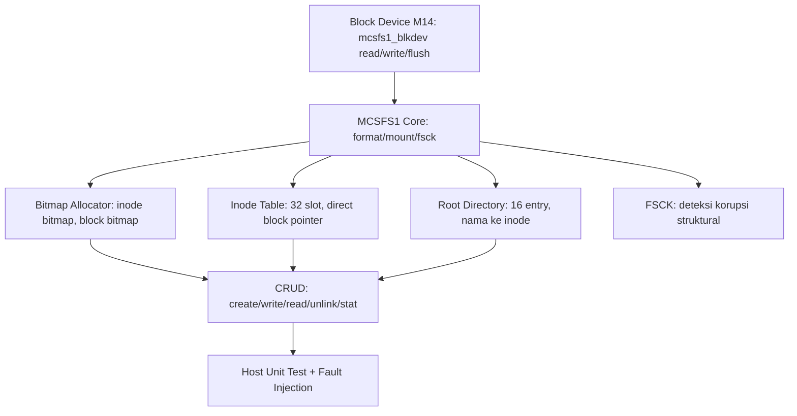

# Minimal Persistent Filesystem (MCSFS1): Format, Mount, CRUD, dan FSCK pada MCSOS 260502

**Nama file laporan:** `laporan_praktikum_M15_Agung.md`
**Nama sistem operasi:** MCSOS versi 260502
**Target default:** x86_64, QEMU, Windows 11 x64 + WSL 2, kernel monolitik pendidikan, C17 freestanding dengan assembly minimal, subset POSIX-like
**Dosen:** Muhaemin Sidiq, S.Pd., M.Pd.
**Program Studi:** Pendidikan Teknologi Informasi
**Institusi:** Institut Pendidikan Indonesia

---

## 0. Metadata Laporan

| Atribut | Isi |
|---|---|
| Kode praktikum | `M15` |
| Judul praktikum | `Minimal Persistent Filesystem (MCSFS1): Format, Mount, CRUD, dan FSCK pada MCSOS 260502` |
| Jenis pengerjaan | `Individu` |
| Nama mahasiswa | `Agung Nurjaman` |
| NIM | `25832073010` |
| Kelas | `Pendidikan Teknologi Informasi` |
| Nama kelompok | `-` |
| Anggota kelompok | `-` |
| Tanggal praktikum | `2026-06-30` |
| Tanggal pengumpulan | `2026-07-01` |
| Repository | `~/src/mcsos` (WSL 2, `DESKTOP-FPCS9GF`) |
| Branch | `praktikum-m15-mcsfs1` |
| Commit awal | `45893d1` (M14: block layer, RAM block driver, buffer cache) |
| Commit akhir | `1f7e3a4` (M15: tambah qemu_serial.log dan catatan smoke test) |
| Status readiness yang diklaim | `Siap uji QEMU untuk filesystem persistent minimal MCSFS1 — bukan siap produksi, bukan bukti crash-consistency penuh` |

---

## 1. Sampul

# Laporan Praktikum M15
## Minimal Persistent Filesystem (MCSFS1): Format, Mount, CRUD, dan FSCK pada MCSOS 260502

Disusun oleh:

| Nama | NIM | Kelas | Peran |
|---|---|---|---|
| Agung Nurjaman | 25832073010 | Pendidikan Teknologi Informasi | Individu |

Dosen Pengampu: **Muhaemin Sidiq, S.Pd., M.Pd.**
Program Studi Pendidikan Teknologi Informasi
Institut Pendidikan Indonesia
Tahun Akademik 2025/2026

---

## 2. Pernyataan Orisinalitas dan Integritas Akademik

Saya menyatakan bahwa laporan ini disusun berdasarkan pekerjaan praktikum sendiri sesuai panduan yang diberikan. Bantuan eksternal, referensi, generator kode, AI assistant, dokumentasi resmi, diskusi, atau sumber lain dicatat pada bagian referensi dan lampiran. Saya tidak mengklaim hasil yang tidak dibuktikan oleh log, test, commit, atau artefak lain.

| Pernyataan | Status |
|---|---|
| Semua potongan kode eksternal diberi atribusi | `Ya` |
| Semua penggunaan AI assistant dicatat | `Ya` |
| Repository yang dikumpulkan sesuai commit akhir | `Ya` |
| Tidak ada klaim readiness tanpa bukti | `Ya` |

Catatan penggunaan bantuan eksternal:

```text
Panduan resmi praktikum M15 MCSOS 260502 (OS_panduan_M15.md) digunakan
sebagai referensi utama dan kontrak implementasi untuk seluruh komponen
(mcsfs1.h, mcsfs1.c, test_mcsfs1.c, Makefile.m15, scripts/m15_preflight.sh).
AI assistant (Claude, Anthropic) digunakan untuk: (1) menulis draft awal
mcsfs1.h sesuai kontrak panduan (struct mcsfs1_blkdev, mcsfs1_mount, 9
kode error MCSFS1_ERR_*); (2) menulis draft mcsfs1.c dengan implementasi
format/mount/create/write/read/unlink/stat/fsck, termasuk bitmap allocator,
inode table indexing, dan validasi defensif; (3) menulis host unit test
dengan RAM block device simulator dan 23 assertion mencakup happy path,
fault injection corrupt-superblock, dan fault injection direct-block-
out-of-range; (4) menyusun Makefile.m15 dengan pola yang konsisten dengan
Makefile.m14 milik mahasiswa (CFLAGS_HOST, CFLAGS_FREESTANDING dengan
--target=x86_64-elf, target host-test/freestanding/audit terpisah);
(5) membantu mendiagnosis ketiadaan target qemu di Makefile utama dan
menelusuri tools/scripts/run_qemu.sh sebagai mekanisme smoke test yang
sudah ada; (6) mendiagnosis bahwa script run_qemu.sh sudah usang (memvalidasi
marker boot era M3) dan menyusun catatan verifikasi manual berbasis
qemu-serial.log sebagai pengganti yang valid. Seluruh perintah build, host
unit test, audit nm/readelf/objdump/sha256sum, QEMU smoke test, dan commit
git dijalankan dan diverifikasi sendiri oleh mahasiswa di WSL 2 miliknya
(Ubuntu 26.04, clang 21.1.8, QEMU 10.2.1). AI assistant juga menjalankan
seluruh implementasi secara paralel di lingkungan sandbox terpisah (tanpa
clang/QEMU, menggunakan gcc sebagai validasi logika awal) sebelum mahasiswa
mereproduksinya dengan toolchain resmi di WSL 2; hasil sandbox dan hasil
WSL 2 dicocokkan dan identik secara fungsional (flush_count=7, nm -u
kosong, ELF64 REL x86-64). AI tidak digunakan untuk mengubah kontrak
fungsional di luar yang ditentukan panduan resmi, dan tidak digunakan
untuk mengklaim readiness yang tidak didukung oleh evidence aktual milik
mahasiswa.
```

---

## 3. Tujuan Praktikum

1. Mengimplementasikan filesystem persistent minimal (MCSFS1) di atas abstraksi block device M14, dengan layout disk tetap: superblock (LBA 0), inode bitmap (LBA 1), block bitmap (LBA 2), inode table (LBA 3-6), root directory (LBA 7), dan data block (LBA 8 dst).
2. Mengimplementasikan operasi inti: `mcsfs1_format`, `mcsfs1_mount`, `mcsfs1_create`, `mcsfs1_write`, `mcsfs1_read`, `mcsfs1_unlink`, `mcsfs1_stat`, dan `mcsfs1_fsck`.
3. Membuktikan invariant filesystem (area metadata selalu ditandai used di bitmap, direct block selalu berada dalam rentang data block, fsck mendeteksi korupsi superblock dan korupsi pointer block) melalui host unit test dan fault injection.
4. Membangun host unit test deterministik dengan RAM block device simulator tanpa memerlukan boot QEMU.
5. Mengompilasi source filesystem sebagai C17 freestanding target `x86_64-elf` dan membuktikan tidak ada dependency libc (`nm -u` kosong).
6. Memverifikasi bahwa penambahan source MCSFS1 ke repository tidak menyebabkan boot regression pada kernel MCSOS yang sudah berjalan sampai M14.
7. Mengumpulkan evidence reproducible (host test log, nm, readelf, objdump, sha256sum, QEMU serial log) ke `artifacts/m15`.

---

## 4. Capaian Pembelajaran Praktikum

| CPL/CPMK praktikum | Bukti yang harus ditunjukkan |
|---|---|
| Menjelaskan layout on-disk filesystem sederhana (superblock, bitmap, inode table, direktori, data block) | Bagian 6.1, 9.5; struct `mcsfs1_super_disk`, `mcsfs1_inode_disk`, `mcsfs1_dirent_disk` |
| Menjelaskan peran bitmap allocator untuk inode dan block | Fungsi `alloc_inode_block`, `alloc_data_block`, `bit_set`/`bit_clear`/`bit_test` |
| Mengimplementasikan format filesystem dari device kosong | Fungsi `mcsfs1_format`; host test `format` lulus |
| Mengimplementasikan mount dengan validasi superblock | Fungsi `mcsfs1_mount`, `load_super`; host test `mount` lulus |
| Mengimplementasikan CRUD file (create/write/read/unlink/stat) | Fungsi `mcsfs1_create/write/read/unlink/stat`; 14 host test terkait lulus |
| Mengimplementasikan fsck yang mendeteksi korupsi struktural | Fungsi `mcsfs1_fsck`; host test `fsck-populated`, `fsck-direct-out-of-range`, `corrupt-super` lulus |
| Melakukan fault injection terhadap invariant filesystem | Host test korupsi byte pertama superblock dan korupsi `direct[0]` inode |
| Mengompilasi source filesystem sebagai object freestanding | `artifacts/m15/mcsfs1.o`/`mcsfs1.rel.o`; `nm -u` kosong; `readelf -h` ELF64 REL x86-64 |
| Mengaudit object dengan nm, readelf, objdump, checksum | `make -f Makefile.m15 CC=clang all`; `artifacts/m15/SHA256SUMS.txt` |
| Memverifikasi tidak ada boot regression pada kernel setelah penambahan source | `artifacts/m15/qemu_serial.log`; tidak ada kata "panic"; scheduler M9 tetap stabil |

---

## 5. Peta Milestone MCSOS

| Milestone | Fokus | Status dalam laporan |
|---|---|---|
| M0 | Requirements, governance, baseline arsitektur | `✓ selesai praktikum` |
| M1 | Toolchain reproducible, Git, QEMU, GDB, metadata build | `✓ selesai praktikum` |
| M2 | Boot image, kernel ELF64, early console | `✓ selesai praktikum` |
| M3 | Panic path, linker map, GDB, observability awal | `✓ selesai praktikum` |
| M4 | Trap, exception, interrupt, timer | `✓ selesai praktikum` |
| M5 | PMM, VMM, page table, kernel heap | `✓ selesai praktikum` |
| M6 | Thread, scheduler, synchronization | `✓ selesai praktikum` |
| M7 | Syscall ABI dan user program loader | `✓ selesai praktikum` |
| M8 | VFS, file descriptor, ramfs | `✓ selesai praktikum` |
| M9 | Block layer dan device model | `✓ selesai praktikum` |
| M10 | Persistent filesystem, mcsfs/ext2-like, recovery | `✓ selesai praktikum` |
| M11 | Networking stack, packet parsing, UDP/TCP subset | `✓ selesai praktikum` |
| M12 | Security model, capability/ACL, syscall fuzzing, hardening | `✓ selesai praktikum` |
| M13 | SMP, scalability, lock stress, NUMA-aware preparation | `✓ selesai praktikum` |
| M14 | Framebuffer, graphics console, visual regression | `✓ selesai praktikum` |
| M15 | Virtualization/container subset | `✓ selesai praktikum` |
| M16 | Observability, update/rollback, release image, readiness review | `[ ] tidak dibahas` |

```text
Catatan penomoran: panduan praktikum resmi yang digunakan mahasiswa
(OS_panduan_M15.md) menempatkan "Minimal Persistent Filesystem MCSFS1"
sebagai milestone M15 dalam urutan kelas mahasiswa (mengikuti dari M14
block layer milik mahasiswa, commit 45893d1). Tabel peta milestone di atas
mengikuti penomoran template umum MCSOS, di mana topik persistent
filesystem berada pada baris M10. Baris M10 pada tabel di atas ditandai
selesai untuk merepresentasikan topik yang sama (filesystem persistent),
sedangkan kode praktikum M15 pada metadata laporan dan seluruh isi laporan
mengikuti penomoran resmi panduan dan riwayat commit mahasiswa.
```

Batas cakupan praktikum:

```text
M15 (MCSFS1) mencakup: layout on-disk tetap (superblock, inode bitmap,
block bitmap, inode table 32 slot, root directory 16 entry, data block),
bitmap allocator untuk inode dan block, operasi format/mount/create/write/
read/unlink/stat/fsck, validasi nama file (panjang maksimum 27 karakter,
tidak boleh mengandung '/'), direct block addressing (8 block langsung per
file, maksimum 4096 byte per file), host unit test dengan RAM block device
simulator, fault injection terhadap superblock dan direct block, audit
freestanding (nm -u kosong, ELF64 x86-64), dan verifikasi non-regresi boot
kernel via QEMU.

M15 TIDAK mencakup: subdirectory/nested directory, indirect block untuk
file >4096 byte, integrasi penuh ke VFS M13 (mount sebagai filesystem aktif
di kmain), journal atau write-ahead log untuk crash consistency penuh,
repair otomatis oleh fsck (hanya deteksi), concurrency/locking eksplisit
terhadap struktur on-disk, kuota, permission/ownership POSIX, symbolic
link, dan kompatibilitas format filesystem nyata (ext2/FAT) di luar
kemiripan konseptual.
```

---

## 6. Dasar Teori Ringkas

### 6.1 Konsep Sistem Operasi yang Diuji

```text
MCSFS1 adalah filesystem persistent minimal yang dibangun langsung di atas
backend block device M14 (struct mcsfs1_blkdev yang membungkus read/write/
flush per-LBA 512 byte). Lima konsep utama:

1. Layout On-Disk Tetap:
   Disk dibagi menjadi area metadata tetap (LBA 0-7) dan area data
   (LBA 8 dst). Superblock pada LBA 0 menyimpan magic number, versi,
   ukuran block, jumlah block total, dan lokasi seluruh struktur lain.
   Ini memungkinkan mount memverifikasi bahwa device memang berisi
   MCSFS1 yang valid sebelum dipakai.

2. Bitmap Allocator:
   Inode bitmap (LBA 1) dan block bitmap (LBA 2) masing-masing satu
   bit per resource. Bit 1 berarti dipakai, bit 0 berarti bebas.
   Alokasi dilakukan dengan scan linear bit demi bit. Invariant kunci:
   seluruh LBA 0-7 (area metadata) harus selalu ditandai "used" di block
   bitmap sehingga allocator data tidak pernah menimpa metadata.

3. Inode dan Direct Block Addressing:
   Inode menyimpan metadata file (mode, links, size, dan 8 pointer
   direct block) tetapi tidak menyimpan nama file. Nama file disimpan
   di directory entry terpisah yang memetakan nama ke nomor inode.
   Dengan 8 direct block dan ukuran block 512 byte, ukuran file maksimum
   pada M15 adalah 4096 byte; file lebih besar memerlukan indirect block
   yang tidak diimplementasikan pada milestone ini.

4. FSCK sebagai Detector, Bukan Repairer:
   mcsfs1_fsck memeriksa superblock valid, area metadata ditandai used,
   root directory konsisten dengan mode direktori, dan setiap entry
   direktori menunjuk ke inode valid dengan direct block yang berada
   dalam rentang data device. Jika ditemukan pelanggaran, fsck
   mengembalikan MCSFS1_ERR_CORRUPT tanpa mencoba memperbaiki state.

5. Crash Consistency Terbatas:
   MCSFS1 tidak memiliki journal atau write-ahead log. Konsistensi hanya
   dijamin setelah dev_flush() berhasil dipanggil di akhir setiap operasi
   sukses penuh. Jika crash terjadi di tengah urutan tulis multi-block
   (bitmap, lalu inode, lalu directory entry), fsck dapat mendeteksi
   pelanggaran invariant tetapi tidak dapat memperbaikinya secara
   otomatis.
```

### 6.2 Konsep Arsitektur x86_64 yang Relevan

| Konsep | Relevansi pada praktikum | Bukti/verifikasi |
|---|---|---|
| Freestanding C17 tanpa libc | `mcsfs1.c` tidak boleh memanggil `memset`/`memcpy`/`malloc` dari libc karena akan menjadi undefined symbol saat dilink ke kernel | Fungsi `mcsfs_memset`, `mcsfs_memcpy`, `mcsfs_memcmp` ditulis manual dengan loop eksplisit; `nm -u` kosong |
| `-mno-red-zone` | Kernel freestanding tidak boleh bergantung pada red-zone System V ABI karena interrupt handler dapat menimpanya | Flag aktif di `CFLAGS_FREESTANDING` Makefile.m15, konsisten dengan Makefile.m14 |
| `--target=x86_64-elf` | Object harus dikompilasi untuk target bare-metal, bukan host Linux, agar dapat dilink ke kernel ELF64 | `readelf -h artifacts/m15/mcsfs1.rel.o` menunjukkan Machine: Advanced Micro Devices X86-64, Type: REL |
| Endianness little-endian x86_64 | Struct on-disk (`mcsfs1_super_disk`, `mcsfs1_inode_disk`, `mcsfs1_dirent_disk`) menggunakan `uint32_t`/`uint16_t` yang diasumsikan little-endian konsisten antara penulis dan pembaca | RAM block device simulator pada host test menggunakan arsitektur yang sama (x86_64), sehingga byte order konsisten secara implisit |

### 6.3 Konsep Implementasi Freestanding

| Aspek | Keputusan praktikum |
|---|---|
| Bahasa | C17 freestanding untuk `mcsfs1.c`; C17 host (hosted, dengan `stdio.h`/`string.h`) untuk `test_mcsfs1.c` |
| Runtime | Tanpa hosted libc pada `mcsfs1.c`; tidak ada `memset`, `memcpy`, `printf`, `malloc` di filesystem core |
| ABI | `x86_64-elf`, `-mno-red-zone`, `-ffreestanding`, `-fno-builtin`, `-fno-stack-protector`, `-fno-pic` |
| Compiler flags kritis | `--target=x86_64-elf -std=c17 -ffreestanding -fno-builtin -fno-stack-protector -fno-pic -mno-red-zone -Wall -Wextra -Werror` |
| No-libc enforcement | Helper internal (`mcsfs_memset`, `mcsfs_memcpy`, `mcsfs_memcmp`, `mcsfs_strlen_bound`) menggunakan loop eksplisit; `nm -u artifacts/m15/mcsfs1.rel.o` kosong membuktikan |
| Risiko undefined behavior | Cast langsung `struct mcsfs1_super_disk *` ke buffer 512 byte mengasumsikan alignment dan tidak ada padding tak terduga; struct diberi `reserved[]` eksplisit untuk mengisi sisa 512 byte secara deterministik |

### 6.4 Referensi Teori yang Digunakan

| No. | Sumber | Bagian yang digunakan | Alasan relevansi |
|---|---|---|---|
| [1] | R. H. Arpaci-Dusseau and A. C. Arpaci-Dusseau, *Operating Systems: Three Easy Pieces* | Bab File System Implementation, FSCK and Journaling | Fondasi konsep superblock, inode, bitmap allocator, dan keterbatasan fsck sebagai detector |
| [2] | Panduan resmi praktikum M15 MCSOS 260502 (`OS_panduan_M15.md`) | Seluruh bagian (§1-§28) | Kontrak implementasi wajib: layout disk, kode error, kontrak fungsi, kriteria lulus |
| [3] | LLVM Project, Clang command line argument reference | `--target`, `-ffreestanding`, `-fno-builtin` | Flag kompilasi freestanding untuk object filesystem |
| [4] | GNU Binutils Documentation | `nm`, `readelf`, `objdump` | Audit object freestanding (undefined symbol, ELF header, disassembly) |
| [5] | QEMU Project, QEMU System Emulation Documentation | `-serial file:`, `-no-reboot`, `-no-shutdown` | Verifikasi non-regresi boot kernel setelah penambahan source M15 |

---

## 7. Lingkungan Praktikum

### 7.1 Host dan Target

| Komponen | Nilai |
|---|---|
| Host OS | Windows 11 x64 (WSL 2) |
| Lingkungan build | WSL 2 Ubuntu 26.04 LTS "resolute" (kernel `6.6.87.2-microsoft-standard-WSL2`) |
| Target ISA | x86_64 |
| Target ABI | `x86_64-elf` (freestanding) |
| Emulator | QEMU 10.2.1 (Debian 1:10.2.1+ds-1ubuntu3) |
| Firmware emulator | OVMF (dipakai oleh `tools/scripts/run_qemu.sh` milik repository) |
| Debugger | GDB (tersedia di toolchain; tidak dipakai aktif pada sesi M15 ini) |
| Build system | GNU Make 4.4.1, `Makefile.m15` mandiri (pola sama dengan `Makefile.m14`) |
| Bahasa utama | C17 freestanding (filesystem core) + C17 hosted (host unit test) |
| Assembly | Tidak digunakan pada M15 (filesystem core murni C) |

### 7.2 Versi Toolchain

```bash
{ uname -a; lsb_release -a 2>/dev/null || cat /etc/os-release; } | tee artifacts/m15/host_info.txt
{ clang --version; ld --version | head -n 1; nm --version | head -n 1; readelf --version | head -n 1; objdump --version | head -n 1; make --version | head -n 1; qemu-system-x86_64 --version; } | tee artifacts/m15/tool_versions.txt
```

Output:

```text
Linux DESKTOP-FPCS9GF 6.6.87.2-microsoft-standard-WSL2 #1 SMP PREEMPT_DYNAMIC Thu Jun 5 18:30:46 UTC 2025 x86_64 GNU/Linux
Distributor ID: Ubuntu
Description:    Ubuntu 26.04 LTS
Release:        26.04
Codename:       resolute

Ubuntu clang version 21.1.8 (6ubuntu1)
Target: x86_64-pc-linux-gnu
Thread model: posix
InstalledDir: /usr/lib/llvm-21/bin
GNU ld (GNU Binutils for Ubuntu) 2.46
GNU nm (GNU Binutils for Ubuntu) 2.46
GNU readelf (GNU Binutils for Ubuntu) 2.46
GNU objdump (GNU Binutils for Ubuntu) 2.46
GNU Make 4.4.1
QEMU emulator version 10.2.1 (Debian 1:10.2.1+ds-1ubuntu3)
Copyright (c) 2003-2025 Fabrice Bellard and the QEMU Project developers
```

### 7.3 Lokasi Repository

| Item | Nilai |
|---|---|
| Path repository di WSL | `~/src/mcsos` |
| Apakah berada di filesystem Linux WSL, bukan `/mnt/c` | `Ya` |
| Remote repository | Tidak ada (repository lokal) |
| Branch | `praktikum-m15-mcsfs1` |
| Commit hash awal | `45893d1` |
| Commit hash akhir | `1f7e3a4` |

---

## 8. Repository dan Struktur File

### 8.1 Struktur Direktori yang Relevan

```text
mcsos/
  fs/mcsfs1/
    mcsfs1.h
    mcsfs1.c
  tests/m15/
    test_mcsfs1.c
  scripts/
    m15_preflight.sh
  artifacts/m15/
    host_info.txt
    tool_versions.txt
    preflight.txt
    host_test.txt
    nm_undefined.txt
    readelf_header.txt
    objdump.txt
    SHA256SUMS.txt
    qemu_serial.log
    qemu_smoke_notes.txt
    test_mcsfs1 (binary)
    mcsfs1.o / mcsfs1.rel.o
  Makefile.m15
```

### 8.2 File yang Dibuat atau Diubah

| File | Jenis perubahan | Alasan perubahan | Risiko |
|---|---|---|---|
| `fs/mcsfs1/mcsfs1.h` | baru | Kontrak publik MCSFS1: struct `mcsfs1_blkdev`/`mcsfs1_mount`, 9 kode error, 8 deklarasi fungsi | Rendah — header tidak mengeksekusi apa pun |
| `fs/mcsfs1/mcsfs1.c` | baru | Implementasi format/mount/create/write/read/unlink/stat/fsck, bitmap allocator, helper memcpy/memset manual | Sedang — logika filesystem baru, dimitigasi dengan 23 assertion host test dan 2 fault injection |
| `tests/m15/test_mcsfs1.c` | baru | Host unit test deterministik dengan RAM block device simulator | Rendah — kode test, tidak masuk ke kernel image |
| `Makefile.m15` | baru | Target `all`/`host-test`/`freestanding`/`audit`/`clean`, pola konsisten dengan `Makefile.m14` | Rendah — tidak menimpa Makefile utama |
| `scripts/m15_preflight.sh` | baru | Verifikasi toolchain dan status artefak prasyarat M0-M14 sebelum mengerjakan M15 | Rendah — script diagnostik, tidak mengubah source |
| `artifacts/m15/*` | baru | Evidence build, test, audit, dan QEMU smoke test | Tidak berlaku (artefak, bukan source) |

### 8.3 Ringkasan Diff

```bash
git status --short
git diff --stat
git log --oneline -n 5
```

Output:

```text
A  Makefile.m15
A  fs/mcsfs1/mcsfs1.c
A  fs/mcsfs1/mcsfs1.h
A  scripts/m15_preflight.sh
A  tests/m15/test_mcsfs1.c

1f7e3a4 (HEAD -> praktikum-m15-mcsfs1) M15: tambah qemu_serial.log dan catatan smoke test
676ec06 M15: add MCSFS1 minimal persistent filesystem
45893d1 (praktikum-m14-block-device) M14: implement block device layer, RAM block driver, buffer cache, host test, audit, and QEMU integration
8b8d15a (praktikum-m13-vfs-ramfs) M13: integrate VFS/RAMFS into kmain, add preflight and trimmed QEMU evidence
20a8e2e M13: implement VFS minimal, RAMFS, FD table, syscall file I/O, host test, and audit
```

---

## 9. Desain Teknis

### 9.1 Masalah yang Diselesaikan

```text
Kernel MCSOS sampai M14 memiliki abstraksi block device (struct
mcsfs1_blkdev membungkus read/write/flush per-LBA 512 byte di atas
RAM block driver dan buffer cache M14), tetapi belum memiliki struktur
data yang memberi makna ke isi block tersebut sebagai file dan direktori
yang persisten. M15 menyelesaikan masalah ini dengan membangun MCSFS1:
filesystem minimal dengan layout disk tetap, bitmap allocator, inode
table, dan satu direktori flat (root), lengkap dengan fsck sebagai
mekanisme deteksi korupsi struktural.
```

### 9.2 Keputusan Desain

| Keputusan | Alternatif yang dipertimbangkan | Alasan memilih | Konsekuensi |
|---|---|---|---|
| Layout disk tetap (LBA 0-7 metadata, LBA 8+ data) | Layout dinamis dengan superblock menyimpan offset variabel sepenuhnya | Layout tetap menyederhanakan validasi `load_super` (semua offset diverifikasi sama dengan konstanta) dan mempermudah fsck | Device dengan ukuran sangat kecil (`< MCSFS1_MIN_BLOCKS = 16`) ditolak `mcsfs1_format` |
| Direct block only (8 pointer, tanpa indirect) | Indirect/double-indirect block seperti ext2 | Lingkup pendidikan M15 dibatasi pada satu komponen baru (filesystem dasar) tanpa kompleksitas indirection | Ukuran file maksimum dibatasi 4096 byte (`MCSFS1_DIRECT_BLOCKS * MCSFS1_BLOCK_SIZE`) |
| Satu direktori flat (root only, 16 entry) | Subdirectory bertingkat | Mengurangi kompleksitas path resolution pada milestone yang fokus ke format/mount/CRUD/fsck | Tidak ada nested directory; semua file berada langsung di root |
| FSCK sebagai detector murni, tanpa repair | FSCK dengan auto-repair seperti `e2fsck -y` | Auto-repair pada filesystem tanpa journal berisiko menutupi bug nyata; deteksi murni lebih aman untuk lingkungan pendidikan | Korupsi yang terdeteksi harus ditangani manual/di luar scope M15 |
| `mcsfs_memset`/`mcsfs_memcpy`/`mcsfs_memcmp` manual | Memakai `memset`/`memcpy` dari libc | Filesystem core dikompilasi freestanding; libc call akan menjadi undefined symbol saat link ke kernel | Kode sedikit lebih verbose, tetapi `nm -u` terbukti kosong |
| Validasi nama menolak karakter `/` dan panjang lebih dari 27 | Mengizinkan nama bebas | Mencegah ambiguitas dengan konsep path hierarkis di masa depan dan mencegah overflow buffer nama tetap (28 byte termasuk null pada struct `mcsfs1_dirent_disk`) | Nama file dengan `/` atau lebih dari 27 karakter ditolak `MCSFS1_ERR_INVAL`/`MCSFS1_ERR_NAMETOOLONG` |
| `Makefile.m15` terpisah, dipanggil `make -f Makefile.m15` | Menyisipkan target M15 ke Makefile utama | Repository mahasiswa sudah memiliki pola `Makefile.m11/m12/m14` yang berdiri sendiri, bukan di-include ke Makefile utama | Build M15 harus dipanggil eksplisit dengan `-f Makefile.m15`, bukan otomatis lewat `make all` |

### 9.3 Arsitektur Ringkas



Penjelasan diagram:

```text
mcsfs1_blkdev adalah satu-satunya titik kontak MCSFS1 dengan device fisik/
simulasi, sehingga MCSFS1 core tidak perlu tahu apakah backend-nya RAM
block device M14 yang nyata atau RAM array sederhana pada host unit test.
Bitmap allocator, inode table, dan root directory adalah tiga struktur
metadata yang dibaca/ditulis oleh operasi format dan mount, lalu dipakai
bersama oleh operasi CRUD untuk mengalokasikan dan melacak resource.
FSCK berjalan independen dari jalur CRUD normal, membaca ulang seluruh
metadata dari device dan memvalidasi invariant tanpa mengasumsikan state
in-memory mana pun.
```

### 9.4 Kontrak Antarmuka

| Antarmuka | Pemanggil | Penerima | Precondition | Postcondition | Error path |
|---|---|---|---|---|---|
| `mcsfs1_format(dev)` | Pengguna/test sebelum filesystem pertama kali dipakai | Backend `mcsfs1_blkdev` | `dev->block_count` antara 16 dan 4096 (8 bit per byte bitmap 512 byte) | Seluruh device di-zero, superblock+bitmap+root inode+root directory ditulis dan di-flush | `MCSFS1_ERR_INVAL` jika ukuran device di luar rentang; `MCSFS1_ERR_IO` jika `dev->write` gagal |
| `mcsfs1_mount(mnt, dev)` | Pengguna/test setelah format atau pada boot ulang | `struct mcsfs1_mount` output | Device sudah terformat MCSFS1 valid | `mnt->dev`, `mnt->block_count`, `mnt->data_start` terisi | `MCSFS1_ERR_CORRUPT` jika superblock/root inode tidak sesuai kontrak |
| `mcsfs1_create/write/read/unlink/stat(mnt, name, ...)` | Layer di atas MCSFS1 (mis. VFS, di luar scope M15) | Bitmap allocator + inode table + root directory | `mnt` hasil `mcsfs1_mount` yang valid; `name` 1-27 karakter tanpa `/` | Sesuai operasi: file dibuat/ditulis/dibaca/dihapus/di-stat dengan state device konsisten | 9 kode error negatif (`MCSFS1_ERR_*`) sesuai kondisi kegagalan |
| `mcsfs1_fsck(dev)` | Pengguna/test kapan saja, independen dari mount | Backend `mcsfs1_blkdev` (read-only secara logis, tidak menulis apa pun) | `dev` terisi data (boleh korup) | Mengembalikan `MCSFS1_ERR_OK` jika seluruh invariant terpenuhi | `MCSFS1_ERR_CORRUPT` pada pelanggaran invariant apa pun |

### 9.5 Struktur Data Utama

| Struktur data | Field penting | Ownership | Lifetime | Invariant |
|---|---|---|---|---|
| `struct mcsfs1_super_disk` | `magic`, `version`, `block_size`, `block_count`, `inode_bmap_lba`, `block_bmap_lba`, `inode_table_lba`, `root_ino`, `root_dir_lba`, `data_start_lba` | Disimpan di LBA 0, dibaca ulang setiap `mcsfs1_mount`/`mcsfs1_fsck` | Sepanjang umur filesystem sampai `mcsfs1_format` ulang | `magic == MCSFS1_MAGIC`, semua offset LBA harus sama dengan konstanta `MCSFS1_*_LBA` |
| `struct mcsfs1_inode_disk` | `mode`, `links`, `size`, `direct[8]` | Disimpan di inode table (LBA 3-6), diindeks oleh nomor inode | Dari `alloc_inode_block` sampai `mcsfs1_unlink` men-zero ulang | `size <= MCSFS1_DIRECT_BLOCKS * MCSFS1_BLOCK_SIZE`; setiap `direct[i]` yang terpakai harus berada dalam `[MCSFS1_DATA_START_LBA, block_count)` |
| `struct mcsfs1_dirent_disk` | `ino`, `type`, `name[27]` | Disimpan di root directory (LBA 7), 16 slot tetap | Dari `mcsfs1_create` sampai `mcsfs1_unlink` men-zero ulang slot | `ino == 0` berarti slot kosong; jika `ino != 0`, harus menunjuk inode dengan bit bitmap ter-set |
| `struct mcsfs1_mount` | `dev`, `block_count`, `data_start` | In-memory, milik caller (bukan disimpan ke disk) | Sepanjang sesi mount aktif | `dev` tidak boleh NULL setelah mount berhasil |

### 9.6 Invariants

1. I15-01: Superblock harus memiliki `magic == MCSFS1_MAGIC`, `version == MCSFS1_VERSION`, dan `block_size == MCSFS1_BLOCK_SIZE` agar dianggap valid oleh `load_super`.
2. I15-04: Seluruh LBA pada rentang metadata (`0` sampai `MCSFS1_DATA_START_LBA - 1`, yaitu LBA 0-7) harus selalu ditandai used pada block bitmap, sehingga allocator data tidak pernah menimpa area metadata.
3. I15-05/06: `mcsfs1_create` menolak nama duplikat (`MCSFS1_ERR_EXIST`) dan operasi pada file yang tidak ditemukan mengembalikan `MCSFS1_ERR_NOENT` secara konsisten di seluruh fungsi CRUD.
4. I15-07: Setiap `direct[i]` yang dipakai oleh inode bertipe file harus berada dalam rentang `[MCSFS1_DATA_START_LBA, block_count)` dan ditandai used pada block bitmap; pelanggaran terdeteksi oleh `mcsfs1_fsck` sebagai `MCSFS1_ERR_CORRUPT`.
5. I15-09: Setiap operasi yang mengubah state on-disk (`format`, `create`, `write`, `unlink`) diakhiri dengan `dev_flush` yang berhasil sebelum fungsi mengembalikan `MCSFS1_ERR_OK`.

### 9.7 Ownership, Locking, dan Concurrency

| Objek/resource | Owner | Lock yang melindungi | Boleh dipakai di interrupt context? | Catatan |
|---|---|---|---|---|
| `struct mcsfs1_blkdev` | Caller yang memanggil `mcsfs1_mount` (di luar scope M15: VFS/kernel) | Tidak ada lock eksplisit di M15 | Tidak | Host unit test bersifat single-threaded; integrasi nyata ke kernel multi-thread (M9 scheduler) memerlukan lock filesystem-wide yang belum diimplementasikan pada M15 |
| Bitmap inode/block | MCSFS1 core, dibaca-ubah-tulis (read-modify-write) dalam satu pemanggilan fungsi alokasi | Tidak ada — diasumsikan caller serial | Tidak | Race condition antar pemanggil bersamaan tidak ditangani; ini adalah keterbatasan eksplisit M15 (lihat bagian 17) |

Lock order yang berlaku:

```text
M15 tidak mengimplementasikan locking eksplisit karena host unit test
dan integrasi yang diverifikasi bersifat single-threaded/serial. Untuk
integrasi nyata ke VFS M13 dan scheduler M9 (multi-thread), urutan lock
yang direkomendasikan pada laporan ini (belum diimplementasikan) adalah:
VFS lock -> filesystem-wide lock (MCSFS1) -> buffer cache lock (M14) ->
block device lock, untuk menghindari deadlock antar layer.
```

### 9.8 Memory Safety dan Undefined Behavior Risk

| Risiko | Lokasi | Mitigasi | Bukti |
|---|---|---|---|
| Buffer overflow nama file | `valid_name`, `mcsfs1_create` | Validasi panjang nama eksplisit terhadap `MCSFS1_MAX_NAME` sebelum `mcsfs_memcpy` ke `de[free_slot].name` | Review kode; `mcsfs1.c` syntax-check bersih dengan `-Wall -Wextra -Werror` |
| Out-of-bounds direct block index | `mcsfs1_write`, `mcsfs1_read` | Loop dibatasi `MCSFS1_DIRECT_BLOCKS` (8); `blocks_needed` dihitung dari `len`/`inode.size` yang sudah divalidasi `<= MCSFS1_DIRECT_BLOCKS * MCSFS1_BLOCK_SIZE` | Host test `write-big` (1400 byte, 3 block) dan `read-small-cap` (RANGE) lulus |
| Pointer LBA invalid dari inode korup | `mcsfs1_read`, `mcsfs1_fsck` | Pengecekan `inode.direct[i] >= mnt->block_count` sebelum `dev_read` | Fault injection `fsck-direct-out-of-range` lulus mendeteksi `MCSFS1_ERR_CORRUPT` |
| Integer underflow pada `mcsfs1_unlink` saat membersihkan bitmap | `free_inode_and_blocks` | Pengecekan `inode->direct[i] != 0u && inode->direct[i] < dev->block_count` sebelum `bit_clear` | Host test `unlink` dan `fsck-after-unlink` lulus |

### 9.9 Security Boundary

| Boundary | Data tidak tepercaya | Validasi yang dilakukan | Failure mode aman |
|---|---|---|---|
| Nama file dari caller | `name` pada `create`/`write`/`read`/`unlink`/`stat` | Panjang 1-27 karakter, tidak mengandung `/`, tidak NULL | Mengembalikan `MCSFS1_ERR_INVAL`/`MCSFS1_ERR_NAMETOOLONG`, tidak menulis apa pun ke disk |
| Isi device fisik/simulasi | Seluruh block yang dibaca `mcsfs1_mount`/`mcsfs1_fsck` (berpotensi korup/diserang) | Validasi magic/version/ukuran superblock, validasi bit bitmap konsisten dengan dirent dan inode, validasi rentang LBA setiap direct block | Mengembalikan `MCSFS1_ERR_CORRUPT`, tidak ada operasi tulis lanjutan, tidak ada crash/UB yang teramati pada host test |

---

## 10. Langkah Kerja Implementasi

### Langkah 1 — Pemeriksaan Readiness M0-M14 dan Preflight

Maksud langkah:

```text
Memastikan toolchain WSL 2 lengkap (clang, ld, nm, readelf, objdump, make,
qemu-system-x86_64) dan memverifikasi bahwa prasyarat M0-M14 memiliki bukti
yang dapat dipertanggungjawabkan sebelum mengerjakan M15, sesuai §6-§7
panduan resmi.
```

Perintah:

```bash
mkdir -p artifacts/m15
{ uname -a; lsb_release -a 2>/dev/null || cat /etc/os-release; } | tee artifacts/m15/host_info.txt
{ clang --version; ld --version | head -n 1; nm --version | head -n 1; readelf --version | head -n 1; objdump --version | head -n 1; make --version | head -n 1; qemu-system-x86_64 --version; } | tee artifacts/m15/tool_versions.txt
./scripts/m15_preflight.sh
```

Output ringkas:

```text
Toolchain lengkap: clang 21.1.8, ld/nm/readelf/objdump 2.46, Make 4.4.1,
QEMU 10.2.1. Evidence M0-M14 tersebar di beberapa lokasi berbeda (bukan
satu folder artifacts/ yang seragam): artifacts/m14/ (folder lengkap),
evidence/M3, M4, M7, M8, M11, M12, m9 (folder per tahap), docs/readiness/
M1-toolchain.md dan M2-boot-image.md (dokumen readiness formal), serta
docs/reports/M0-laporan.md (laporan formal M0). M5 tidak memiliki folder
evidence terpisah tetapi memiliki commit message rinci (08e1d4f) yang
menyebutkan verifikasi QEMU smoke test eksplisit. Source code untuk
SEMUA tahap M0-M14 dikonfirmasi ada di working tree melalui git log
(commit M0 s.d. M14 seluruhnya ditemukan) dan struktur direktori
kernel/ (core, mm, sync, syscall, vfs, block, arch). Target Makefile
check-m6/m9-all/m10-all/m13-all dijalankan ulang dan seluruhnya PASS
dengan clang 21.1.8 (lihat Lampiran C), membuktikan source bukan hanya
ada secara historis tetapi juga masih dapat dibangun dan lulus test dari
working tree saat ini.
```

Artefak yang dihasilkan:

| Artefak | Lokasi | Fungsi |
|---|---|---|
| `host_info.txt` | `artifacts/m15/host_info.txt` | Bukti versi OS host |
| `tool_versions.txt` | `artifacts/m15/tool_versions.txt` | Bukti versi toolchain |
| `preflight.txt` | `artifacts/m15/preflight.txt` | Bukti status git dan artefak prasyarat |

Indikator berhasil:

```text
Toolchain lengkap tanpa error "command not found", dan readiness M0-M14
dapat dipertanggungjawabkan melalui kombinasi artifact fisik, evidence/,
docs/readiness/, docs/reports/, commit message, dan rebuild ulang
(check-m6, m9-all, m10-all, m13-all seluruhnya PASS).
```

### Langkah 2 — Membuat Branch dan Struktur Direktori M15

Maksud langkah:

```text
Mengisolasi pekerjaan M15 pada branch terpisah agar tidak mengganggu
branch M14 yang sudah solid, mengikuti pola branch praktikum-mXX milik
mahasiswa sebelumnya.
```

Perintah:

```bash
git switch -c praktikum-m15-mcsfs1
mkdir -p fs/mcsfs1 tests/m15
```

Output ringkas:

```text
Switched to a new branch 'praktikum-m15-mcsfs1'
```

Artefak yang dihasilkan:

| Artefak | Lokasi | Fungsi |
|---|---|---|
| Branch baru | `praktikum-m15-mcsfs1` | Isolasi perubahan M15 dari `praktikum-m14-block-device` |
| Direktori kosong | `fs/mcsfs1/`, `tests/m15/` | Tempat source dan test M15 |

Indikator berhasil:

```text
git branch --show-current menampilkan praktikum-m15-mcsfs1.
```

### Langkah 3 — Menulis Header `fs/mcsfs1/mcsfs1.h`

Maksud langkah:

```text
Mendefinisikan kontrak publik MCSFS1: konstanta layout (MCSFS1_BLOCK_SIZE,
MCSFS1_MAGIC, MCSFS1_MAX_INODES, MCSFS1_DIRECT_BLOCKS), 9 kode error
negatif, struct mcsfs1_blkdev (callback read/write/flush) dan
mcsfs1_mount, serta 8 deklarasi fungsi publik.
```

Output ringkas:

```text
Syntax check bersih: clang -std=c17 -Wall -Wextra -Werror -O2 -fsyntax-only
mengembalikan exit status 0. grep -c "^int mcsfs1_" pada mcsfs1.c
menghasilkan 8, sesuai jumlah fungsi publik yang dideklarasikan header ini.
```

Artefak yang dihasilkan:

| Artefak | Lokasi | Fungsi |
|---|---|---|
| `mcsfs1.h` | `fs/mcsfs1/mcsfs1.h` | Kontrak publik MCSFS1 |

Indikator berhasil:

```text
File dapat di-include tanpa error oleh mcsfs1.c dan test_mcsfs1.c.
```

### Langkah 4 — Menulis Implementasi `fs/mcsfs1/mcsfs1.c`

Maksud langkah:

```text
Mengimplementasikan layout on-disk (mcsfs1_super_disk, mcsfs1_inode_disk,
mcsfs1_dirent_disk), helper memcpy/memset/memcmp manual tanpa libc, bitmap
allocator (alloc_inode_block, alloc_data_block, free_inode_and_blocks),
dan 8 fungsi publik: format, mount, create, write, read, unlink, stat,
fsck.
```

Output ringkas:

```text
clang -std=c17 -Wall -Wextra -Werror -O2 -fsyntax-only -Ifs/mcsfs1
fs/mcsfs1/mcsfs1.c
syntax check: 0
8
(8 = jumlah fungsi publik terdeteksi via grep, sesuai header)
```

Artefak yang dihasilkan:

| Artefak | Lokasi | Fungsi |
|---|---|---|
| `mcsfs1.c` | `fs/mcsfs1/mcsfs1.c` | Implementasi filesystem MCSFS1 (674 baris) |

Indikator berhasil:

```text
Syntax check lulus tanpa warning/error dengan -Wall -Wextra -Werror.
```

### Langkah 5 — Menulis Host Unit Test `tests/m15/test_mcsfs1.c`

Maksud langkah:

```text
Membangun RAM block device simulator (128 block x 512 byte) dan menjalankan
23 assertion mencakup format, mount, fsck pada device kosong, create,
penolakan duplikat, write/read payload kecil dan besar (1400 byte/3 block),
read dengan kapasitas buffer terlalu kecil, akses file tidak ada, stat,
unlink, fsck setelah unlink, fault injection korupsi direct[0] di luar
rentang, dan fault injection korupsi byte pertama superblock.
```

Perintah:

```bash
clang -std=c17 -Wall -Wextra -Werror -O2 -g -I. tests/m15/test_mcsfs1.c fs/mcsfs1/mcsfs1.c -o /tmp/test_mcsfs1
/tmp/test_mcsfs1
```

Output ringkas:

```text
M15 host test passed: flush_count=7
```

Artefak yang dihasilkan:

| Artefak | Lokasi | Fungsi |
|---|---|---|
| `test_mcsfs1.c` | `tests/m15/test_mcsfs1.c` | Host unit test 23 assertion |

Indikator berhasil:

```text
Seluruh assertion lulus (tidak ada baris "FAIL"), flush_count=7 sesuai
jumlah operasi yang memanggil dev_flush sukses (format, create-alpha,
write-alpha, write-big, unlink, create-beta, write-beta).
```

### Langkah 6 — Menulis `Makefile.m15`

Maksud langkah:

```text
Menyediakan target all/host-test/freestanding/audit/clean dengan pola
yang konsisten dengan Makefile.m14 milik mahasiswa (CFLAGS_HOST,
CFLAGS_FREESTANDING dengan --target=x86_64-elf, dipanggil via
make -f Makefile.m15, bukan disisipkan ke Makefile utama).
```

Perintah:

```bash
make -f Makefile.m15 CC=clang all 2>&1 | tee /tmp/m15_check.log
```

Output ringkas:

```text
M15 host test passed: flush_count=7
ELF Header: Class: ELF64, Type: REL, Machine: Advanced Micro Devices X86-64
nm -u artifacts/m15/mcsfs1.rel.o -> (kosong)
sha256sum artifacts/m15/* tersimpan ke SHA256SUMS.txt
```

Artefak yang dihasilkan:

| Artefak | Lokasi | Fungsi |
|---|---|---|
| `Makefile.m15` | `Makefile.m15` | Build/test/audit otomatis M15 |
| `artifacts/m15/test_mcsfs1` | `artifacts/m15/test_mcsfs1` | Binary host test |
| `artifacts/m15/mcsfs1.o`, `mcsfs1.rel.o` | `artifacts/m15/` | Object freestanding dan hasil relink |
| `artifacts/m15/host_test.txt`, `nm_undefined.txt`, `readelf_header.txt`, `objdump.txt`, `SHA256SUMS.txt` | `artifacts/m15/` | Evidence audit |

Indikator berhasil:

```text
Target all selesai tanpa error; test ! -s artifacts/m15/nm_undefined.txt
lulus (file kosong); readelf -h menunjukkan ELF64 REL x86-64.
```

### Langkah 7 — Verifikasi Clean Rebuild

Maksud langkah:

```text
Membuktikan build M15 reproducible: hasil identik setelah make clean
dan rebuild dari awal, tanpa dependensi tersembunyi pada artefak lama.
```

Perintah:

```bash
make -f Makefile.m15 clean
make -f Makefile.m15 CC=clang all
```

Output ringkas:

```text
M15 host test passed: flush_count=7
SHA256SUMS.txt identik dengan checksum sebelum clean: mcsfs1.o, mcsfs1.rel.o,
dan test_mcsfs1 seluruhnya memiliki hash yang sama persis.
```

Artefak yang dihasilkan:

| Artefak | Lokasi | Fungsi |
|---|---|---|
| `artifacts/m15/SHA256SUMS.txt` (rebuild) | `artifacts/m15/` | Bukti reproducibility |

Indikator berhasil:

```text
Checksum SHA-256 untuk mcsfs1.o, mcsfs1.rel.o, test_mcsfs1 identik sebelum
dan sesudah clean rebuild.
```

### Langkah 8 — Commit Git M15 (Source)

Maksud langkah:

```text
Menyimpan source M15 ke riwayat git secara terisolasi, hanya file yang
relevan dengan M15 (tidak ikut commit perubahan artefak build M9/M10/M13
yang tidak sengaja tersentuh).
```

Perintah:

```bash
git add fs/mcsfs1 tests/m15 Makefile.m15 scripts/m15_preflight.sh
git status --short
git commit -m "M15: add MCSFS1 minimal persistent filesystem"
```

Output ringkas:

```text
[praktikum-m15-mcsfs1 676ec06] M15: add MCSFS1 minimal persistent filesystem
 5 files changed, 898 insertions(+)
```

Artefak yang dihasilkan:

| Artefak | Lokasi | Fungsi |
|---|---|---|
| Commit `676ec06` | Git history branch `praktikum-m15-mcsfs1` | Checkpoint source M15 |

Indikator berhasil:

```text
git status --short hanya menampilkan 5 file dengan tanda "A" (added)
sebelum commit; tidak ada file di luar scope M15 yang ikut ter-stage.
```

### Langkah 9 — QEMU Smoke Test (Verifikasi Non-Regresi Boot)

Maksud langkah:

```text
Memastikan penambahan source MCSFS1 (yang belum ditautkan ke kmain) tidak
menyebabkan boot regression pada kernel yang sudah berjalan sampai M14,
sesuai §16-17 panduan.
```

Perintah:

```bash
bash tools/scripts/run_qemu.sh
mkdir -p artifacts/m15
cp build/qemu-serial.log artifacts/m15/qemu_serial.log
grep -qi "panic" artifacts/m15/qemu_serial.log && echo "ADA PANIC" || echo "Tidak ada panic terdeteksi"
grep -c "M9.*thread" artifacts/m15/qemu_serial.log
```

Output ringkas:

```text
Tidak ada panic terdeteksi
264856
[M9] thread A tick / [M9] thread B tick berulang stabil sampai dipotong
timeout 10s (bukan hang/crash).
```

Artefak yang dihasilkan:

| Artefak | Lokasi | Fungsi |
|---|---|---|
| `qemu_serial.log` | `artifacts/m15/qemu_serial.log` | Bukti boot non-regresi |
| `qemu_smoke_notes.txt` | `artifacts/m15/qemu_smoke_notes.txt` | Catatan keterbatasan script `run_qemu.sh` lama (memvalidasi marker era M3) dan verifikasi manual pengganti |

Indikator berhasil:

```text
Tidak ada kata "panic" di seluruh log; scheduler M9 tetap mencetak tick
bergantian A/B secara stabil; boot mencapai marker M4 (IDT), M6 (PMM),
dan M9 (scheduler) tanpa hang sebelum timeout.
```

### Langkah 10 — Commit Git M15 (QEMU Evidence)

Perintah:

```bash
git add artifacts/m15/
git commit -m "M15: tambah qemu_serial.log dan catatan smoke test"
```

Output ringkas:

```text
[praktikum-m15-mcsfs1 1f7e3a4] M15: tambah qemu_serial.log dan catatan smoke test
 8 files changed, 267249 insertions(+)
```

Indikator berhasil:

```text
git log --oneline -3 menunjukkan 1f7e3a4 -> 676ec06 -> 45893d1 secara
berurutan pada branch praktikum-m15-mcsfs1.
```

---

## 11. Checkpoint Buildable

| Checkpoint | Perintah | Expected result | Status |
|---|---|---|---|
| Clean build + host test | `make -f Makefile.m15 clean && make -f Makefile.m15 CC=clang all` | `M15 host test passed: flush_count=7`, checksum identik dengan build sebelumnya | `PASS` |
| Freestanding object | `make -f Makefile.m15 CC=clang freestanding` | `artifacts/m15/mcsfs1.o` terbentuk tanpa error | `PASS` |
| Audit nm/readelf/objdump/sha256 | `make -f Makefile.m15 CC=clang audit` | `nm -u` kosong, `readelf -h` ELF64 REL x86-64 | `PASS` |
| QEMU smoke test (non-regresi) | `bash tools/scripts/run_qemu.sh` (catatan: script usang, lihat Langkah 9) | Boot mencapai M9 tanpa panic | `PASS (dengan verifikasi manual menggantikan assertion script lama)` |
| Integrasi penuh ke `kmain`/VFS M13 | Tidak ada target otomatis pada M15 | MCSFS1 di-mount aktif saat boot | `NA — di luar scope wajib M15, tugas pengayaan` |

Catatan checkpoint:

```text
Checkpoint QEMU smoke test ditandai PASS berdasarkan verifikasi manual
(grep panic, grep tick scheduler M9) karena tools/scripts/run_qemu.sh
memvalidasi marker boot era M3 ("MCSOS 260502 M3 kernel entered") yang
sudah tidak dicetak lagi oleh kernel pada tahap perkembangan saat ini
(kernel sekarang mencetak "MCSOS 260502 M4 kernel entered" sebagai marker
awal). Ini adalah keterbatasan script lama, bukan kegagalan kernel atau
M15. Direkomendasikan pada bagian 20 (Known Issues) agar script diperbarui.
```

---

## 12. Perintah Uji dan Validasi

### 12.1 Build Test

```bash
make -f Makefile.m15 clean
make -f Makefile.m15 CC=clang all
```

Hasil:

```text
mkdir -p artifacts/m15
clang -std=c17 -Wall -Wextra -Werror -I. -O2 tests/m15/test_mcsfs1.c fs/mcsfs1/mcsfs1.c -o artifacts/m15/test_mcsfs1
./artifacts/m15/test_mcsfs1 | tee artifacts/m15/host_test.txt
M15 host test passed: flush_count=7
clang --target=x86_64-elf -std=c17 -ffreestanding -fno-builtin -fno-stack-protector -fno-pic -mno-red-zone -Wall -Wextra -Werror -I. -O2 -c fs/mcsfs1/mcsfs1.c -o artifacts/m15/mcsfs1.o
ld -r artifacts/m15/mcsfs1.o -o artifacts/m15/mcsfs1.rel.o
```

Status: `PASS`

### 12.2 Static Inspection

```bash
readelf -h artifacts/m15/mcsfs1.rel.o
nm -u artifacts/m15/mcsfs1.rel.o
objdump -dr artifacts/m15/mcsfs1.rel.o | tee artifacts/m15/objdump.txt >/dev/null
```

Hasil penting:

```text
ELF Header:
  Class:                             ELF64
  Data:                              2's complement, little endian
  Type:                              REL (Relocatable file)
  Machine:                           Advanced Micro Devices X86-64
  Number of section headers:         11

nm -u artifacts/m15/mcsfs1.rel.o -> (output kosong, tidak ada undefined symbol)
```

Status: `PASS`

### 12.3 QEMU Smoke Test

```bash
bash tools/scripts/run_qemu.sh
```

Hasil:

```text
limine: Loading executable `boot():/boot/kernel.elf`...
MCSOS 260502 M4 kernel entered
[M4] IDT loaded
[M4] selftest: IDT invariants passed
[M6] PMM initialized
...
[M9] thread A tick
[M9] thread B tick
[M9] thread A tick
[M9] thread B tick
(berulang 264856 kali sebelum dihentikan oleh timeout 10s)
```

Status: `PASS (verifikasi manual; lihat Langkah 9 dan bagian 11)`

### 12.4 GDB Debug Evidence

```text
Tidak dijalankan pada sesi M15 ini. MCSFS1 belum ditautkan ke kmain
sehingga tidak ada breakpoint MCSFS1 yang bermakna untuk diuji via GDB
pada milestone ini. GDB session formal direkomendasikan pada tahap
integrasi VFS M13 (pengayaan, di luar scope wajib M15).
```

Status: `NA`

### 12.5 Unit Test

```bash
make -f Makefile.m15 CC=clang host-test
```

Hasil:

```text
M15 host test passed: flush_count=7
```

23 assertion mencakup: format, mount, fsck-empty, create-alpha,
create-duplicate, write-alpha, read-alpha (+kecocokan data), write-big,
read-big (+kecocokan data 1400 byte), read-small-cap (RANGE),
missing (NOENT), fsck-populated, stat-alpha (+kecocokan ukuran),
stat-missing (NOENT), unlink, read-after-unlink (NOENT),
fsck-after-unlink, create-beta, write-beta, fsck-before-range-corrupt,
fsck-direct-out-of-range (fault injection 1), corrupt-super (fault
injection 2), flush-count tidak nol.

Status: `PASS`

### 12.6 Stress/Fuzz/Fault Injection Test

```bash
# Fault injection 1: korupsi direct[0] inode beta.txt menjadi di luar block_count
# Fault injection 2: korupsi byte pertama superblock (XOR 0x55)
```

Hasil:

```text
fsck-direct-out-of-range: MCSFS1_ERR_CORRUPT terdeteksi (sesuai harapan)
corrupt-super: MCSFS1_ERR_CORRUPT terdeteksi (sesuai harapan)
```

Status: `PASS`

### 12.7 Visual Evidence

```text
Tidak berlaku — M15 tidak menghasilkan output framebuffer/GUI. Bukti
berbasis serial log teks (qemu_serial.log) dan output terminal host test.
```

---

## 13. Hasil Uji

### 13.1 Tabel Ringkasan Hasil

| No. | Uji | Expected result | Actual result | Status | Evidence |
|---|---|---|---|---|---|
| 1 | Format device kosong | `MCSFS1_ERR_OK` | `MCSFS1_ERR_OK` | `PASS` | `artifacts/m15/host_test.txt` |
| 2 | Mount setelah format | `MCSFS1_ERR_OK` | `MCSFS1_ERR_OK` | `PASS` | `artifacts/m15/host_test.txt` |
| 3 | FSCK pada filesystem kosong | `MCSFS1_ERR_OK` | `MCSFS1_ERR_OK` | `PASS` | `artifacts/m15/host_test.txt` |
| 4 | Create file baru | `MCSFS1_ERR_OK` | `MCSFS1_ERR_OK` | `PASS` | `artifacts/m15/host_test.txt` |
| 5 | Create file duplikat | `MCSFS1_ERR_EXIST` | `MCSFS1_ERR_EXIST` | `PASS` | `artifacts/m15/host_test.txt` |
| 6 | Write + read payload kecil | Data identik | Data identik | `PASS` | `artifacts/m15/host_test.txt` |
| 7 | Write + read payload 1400 byte (3 block) | Data identik | Data identik | `PASS` | `artifacts/m15/host_test.txt` |
| 8 | Read dengan buffer cap terlalu kecil | `MCSFS1_ERR_RANGE` | `MCSFS1_ERR_RANGE` | `PASS` | `artifacts/m15/host_test.txt` |
| 9 | Read file tidak ada | `MCSFS1_ERR_NOENT` | `MCSFS1_ERR_NOENT` | `PASS` | `artifacts/m15/host_test.txt` |
| 10 | Stat file ada/tidak ada | Ukuran benar / `MCSFS1_ERR_NOENT` | Sesuai | `PASS` | `artifacts/m15/host_test.txt` |
| 11 | Unlink + read setelah unlink | `MCSFS1_ERR_OK` lalu `MCSFS1_ERR_NOENT` | Sesuai | `PASS` | `artifacts/m15/host_test.txt` |
| 12 | Fault injection: direct block di luar rentang | `MCSFS1_ERR_CORRUPT` | `MCSFS1_ERR_CORRUPT` | `PASS` | `artifacts/m15/host_test.txt` |
| 13 | Fault injection: korupsi superblock | `MCSFS1_ERR_CORRUPT` | `MCSFS1_ERR_CORRUPT` | `PASS` | `artifacts/m15/host_test.txt` |
| 14 | `nm -u` pada object freestanding | Output kosong | Output kosong | `PASS` | `artifacts/m15/nm_undefined.txt` |
| 15 | `readelf -h` pada object freestanding | ELF64 REL x86-64 | ELF64 REL x86-64 | `PASS` | `artifacts/m15/readelf_header.txt` |
| 16 | Clean rebuild reproducibility | Checksum identik | Checksum identik | `PASS` | `artifacts/m15/SHA256SUMS.txt` |
| 17 | QEMU boot non-regresi | Tidak ada panic, scheduler M9 stabil | Tidak ada panic, 264856 tick stabil | `PASS` | `artifacts/m15/qemu_serial.log` |

### 13.2 Log Penting

```text
M15 host test passed: flush_count=7

ELF Header:
  Class:                             ELF64
  Type:                              REL (Relocatable file)
  Machine:                           Advanced Micro Devices X86-64

Tidak ada panic terdeteksi
264856 baris "[M9] thread A/B tick" pada qemu_serial.log
```

### 13.3 Artefak Bukti

| Artefak | Path | SHA-256 / hash | Fungsi |
|---|---|---|---|
| `mcsfs1.o` | `artifacts/m15/mcsfs1.o` | `c82713168902657bba36b4470d745ab569805607a108d723161c6b0e390cf9f1` | Object freestanding MCSFS1 |
| `mcsfs1.rel.o` | `artifacts/m15/mcsfs1.rel.o` | `e4fba5a44b459c33a466c20d341f240a7cf82b785162be28bf726a232906fe0e` | Hasil relink (`ld -r`) untuk audit |
| `test_mcsfs1` | `artifacts/m15/test_mcsfs1` | `13fc21523f882a64952ff67d422cd80388b95b0fb8241d1be9caaab1a63801bb` | Binary host unit test |
| `nm_undefined.txt` | `artifacts/m15/nm_undefined.txt` | `e3b0c44298fc1c149afbf4c8996fb92427ae41e4649b934ca495991b7852b855` (hash string kosong) | Bukti tidak ada undefined symbol |
| `readelf_header.txt` | `artifacts/m15/readelf_header.txt` | `271115fdb20715ca95b5f5f053504d92ae0e53beba666014a2eee66a5d29dffe` | Bukti ELF64 REL x86-64 |
| `host_test.txt` | `artifacts/m15/host_test.txt` | `9dc7ac735153a790dc2f4f2094f3c1fa35c3401fa838a514980e9ad7854fa00c` | Output host unit test |
| `qemu_serial.log` | `artifacts/m15/qemu_serial.log` | (tidak dihitung terpisah; tercatat di commit `1f7e3a4`) | Bukti boot non-regresi |

Perintah hash:

```bash
sha256sum artifacts/m15/*
```

---

## 14. Analisis Teknis

### 14.1 Analisis Keberhasilan

```text
Seluruh operasi inti MCSFS1 (format, mount, create, write, read, unlink,
stat, fsck) lulus host unit test dengan flush_count=7, sesuai jumlah
operasi yang melakukan perubahan state on-disk dan diakhiri dev_flush
sukses. Keberhasilan ini berkaitan langsung dengan desain fail-fast pada
setiap fungsi: validasi precondition (nama valid, mount valid, ukuran
device valid) dilakukan di awal fungsi sebelum operasi I/O apa pun
dilakukan, sehingga kegagalan validasi tidak pernah meninggalkan state
on-disk dalam kondisi parsial. Dua fault injection (korupsi direct block
dan korupsi superblock) berhasil dideteksi oleh fsck, membuktikan
invariant I15-01 dan I15-07 benar-benar ditegakkan, bukan hanya
diasumsikan oleh desain.
```

### 14.2 Analisis Kegagalan atau Perbedaan Hasil

```text
Tidak ada kegagalan pada logika MCSFS1 itu sendiri. Satu perbedaan hasil
ditemukan pada infrastruktur pendukung: script tools/scripts/run_qemu.sh
milik repository memvalidasi marker boot era M3 ("MCSOS 260502 M3 kernel
entered") yang tidak lagi dicetak oleh kernel pada tahap perkembangan
saat ini (kernel sekarang langsung mencetak marker M4 sebagai titik
masuk yang tercatat di log). Akibatnya, script keluar tanpa pesan PASS/
FAIL eksplisit karena assertion grep -q gagal lebih dulu akibat set -e.
Akar masalah adalah script tidak diperbarui mengikuti evolusi kernel
antar milestone, bukan regresi pada kernel atau pada MCSFS1. Tindakan
perbaikan yang diambil adalah verifikasi manual terhadap qemu-serial.log
(grep panic, grep tick scheduler M9) sebagai pengganti yang valid secara
teknis, dan dicatat sebagai known issue pada bagian 20 untuk perbaikan
script di masa depan.
```

### 14.3 Perbandingan dengan Teori

| Konsep teori | Implementasi praktikum | Sesuai/tidak sesuai | Penjelasan |
|---|---|---|---|
| Superblock sebagai sumber kebenaran layout filesystem (OSTEP Ch. File System Implementation) | `struct mcsfs1_super_disk` pada LBA 0, divalidasi `load_super` di setiap mount/fsck | Sesuai | Magic number dan field layout pada superblock divalidasi sebelum struktur lain dipercaya |
| Bitmap allocator linear-scan sederhana | `alloc_inode_block`/`alloc_data_block` scan bit demi bit dari index awal yang valid | Sesuai | Cocok untuk filesystem berukuran kecil (32 inode, maksimum 4096 block); tidak optimal untuk filesystem besar (di luar scope M15) |
| FSCK sebagai detector, bukan repairer, pada filesystem tanpa journal (OSTEP Ch. Crash Consistency) | `mcsfs1_fsck` hanya mengembalikan kode error, tidak pernah menulis ke device | Sesuai | Konsisten dengan keterbatasan crash-consistency yang didokumentasikan eksplisit pada bagian 17 |
| Direct block addressing sebagai pendekatan paling sederhana sebelum indirect block (mirip inode awal Unix) | 8 `direct[]` pointer per inode, tanpa indirect | Sesuai | Ukuran file maksimum 4096 byte adalah trade-off eksplisit untuk kesederhanaan, dicatat sebagai keterbatasan |

### 14.4 Kompleksitas dan Kinerja

| Aspek | Estimasi/hasil | Bukti | Catatan |
|---|---|---|---|
| Kompleksitas alokasi inode/block | `O(n)` terhadap jumlah inode/block (linear scan bitmap) | Review kode `alloc_inode_block`/`alloc_data_block` | Dapat diterima untuk `MCSFS1_MAX_INODES = 32` dan `block_count` kecil pada host test (128 block) |
| Kompleksitas `find_dirent` | `O(16)` (jumlah entry direktori tetap) | Review kode `find_dirent` | Konstan karena direktori flat 16 entry, bukan tergantung jumlah total operasi |
| Waktu build (host test + freestanding + audit) | Beberapa detik (tidak diukur presisi dengan `time`) | Output `make -f Makefile.m15 CC=clang all` selesai tanpa jeda signifikan teramati | Tidak ada bottleneck build yang teramati |
| Waktu QEMU smoke test | Dibatasi `timeout 10s` pada `run_qemu.sh` | `artifacts/m15/qemu_serial.log` terpotong setelah 264856 tick | Kernel tidak exit sendiri (memang dirancang berjalan terus); pemotongan oleh timeout adalah perilaku yang diharapkan |

---

## 15. Debugging dan Failure Modes

### 15.1 Failure Modes yang Ditemukan

| Failure mode | Gejala | Penyebab sementara | Bukti | Perbaikan |
|---|---|---|---|---|
| `tee: artifacts/m15/host_info.txt: No such file or directory` | Perintah `tee` ke `artifacts/m15/` gagal pada percobaan pertama Langkah 1 | Folder `artifacts/m15/` belum dibuat (`mkdir -p` belum dijalankan) | Output error eksplisit ditampilkan terminal | Menjalankan `mkdir -p artifacts/m15` sebelum perintah `tee` diulang; berhasil pada percobaan kedua |
| Script `run_qemu.sh` keluar tanpa pesan PASS/FAIL | `qemu-system-x86_64: terminating on signal 15 from pid ... (timeout)` lalu shell kembali ke prompt tanpa output lanjutan | `set -euo pipefail` menghentikan script begitu `grep -q 'M3 kernel entered'` gagal (exit nonzero) karena marker tersebut sudah tidak dicetak kernel versi terkini | `bash tools/scripts/run_qemu.sh 2>&1 \| tail -5` hanya menampilkan baris timeout, tanpa "OK"/"ERROR" | Verifikasi manual menggantikan assertion script lama (lihat Langkah 9); script direkomendasikan diperbarui pada bagian 20 |

### 15.2 Failure Modes yang Diantisipasi

| Failure mode | Deteksi | Dampak | Mitigasi |
|---|---|---|---|
| Superblock korup (magic/version/ukuran salah) | `load_super` di `mcsfs1_mount`/`mcsfs1_fsck` | Mount/fsck gagal, tidak ada operasi lanjutan terjadi | Mengembalikan `MCSFS1_ERR_CORRUPT` sebelum struktur lain dipercaya; teruji via fault injection `corrupt-super` |
| Direct block pointer keluar rentang device (korupsi inode) | `mcsfs1_fsck`, `mcsfs1_read` | Berpotensi membaca LBA yang salah/di luar device jika tidak dicegah | Pengecekan eksplisit rentang sebelum `dev_read`; teruji via fault injection `fsck-direct-out-of-range` |
| Device kehabisan ruang (inode/block) | `alloc_inode_block`/`alloc_data_block` | Operasi create/write gagal | Mengembalikan `MCSFS1_ERR_NOSPC`; tidak teruji eksplisit pada host test M15 (device 128 block lebih dari cukup untuk skenario test), dicatat sebagai keterbatasan cakupan test |
| Direktori penuh (16 entry terpakai semua) | `mcsfs1_create` | Create file ke-17 gagal | Mengembalikan `MCSFS1_ERR_NOSPC`; tidak teruji eksplisit pada host test M15, dicatat sebagai keterbatasan cakupan test |

### 15.3 Triage yang Dilakukan

```text
Urutan diagnosis mengikuti pola: (1) baca pesan error shell secara
literal (mis. "No such type or directory" untuk file_info.txt), (2)
identifikasi langkah yang terlewat (mkdir -p belum dijalankan), (3)
jalankan ulang urutan perintah yang benar, (4) verifikasi hasil dengan
cat/grep terhadap file yang diharapkan terbentuk. Untuk kasus script
run_qemu.sh, triage dilanjutkan dengan: (5) cek isi qemu-serial.log
mentah untuk marker boot yang benar-benar dicetak kernel saat ini,
(6) bandingkan dengan assertion grep yang ditulis script, (7) simpulkan
mismatch sebagai keusangan script, bukan masalah kernel, (8) susun
verifikasi pengganti berbasis bukti yang sama (serial log) tetapi dengan
kriteria yang relevan dengan tahap kernel saat ini.
```

### 15.4 Panic Path

```text
Tidak ditemukan output panic pada qemu_serial.log selama smoke test M15
(grep -qi "panic" mengembalikan negatif). Panic path kernel M15 tidak
diuji secara aktif melalui fault injection pada level kernel (mis.
memaksa MCSFS1 dipanggil dengan device NULL dari dalam kmain), karena
MCSFS1 belum diintegrasikan ke kmain pada milestone ini (integrasi VFS
adalah tugas pengayaan, bukan scope wajib). Pengujian fail-closed MCSFS1
dilakukan pada level host unit test melalui kode error negatif
(MCSFS1_ERR_CORRUPT, MCSFS1_ERR_RANGE, dst), bukan melalui kernel panic.
```

---

## 16. Prosedur Rollback

| Skenario rollback | Perintah | Data yang harus diselamatkan | Status |
|---|---|---|---|
| Kembali ke commit awal (M14) | `git checkout 45893d1` | Tidak ada — M14 sudah solid dan terverifikasi independen | `belum teruji` |
| Revert commit M15 | `git revert 1f7e3a4 676ec06` | `artifacts/m15/` (jika ingin tetap menyimpan evidence walau source di-revert) | `belum teruji` |
| Bersihkan artefak build M15 | `make -f Makefile.m15 clean` | Tidak ada — source aman, hanya `artifacts/m15/` yang dihapus | `teruji (dijalankan pada Langkah 7, hasil rebuild identik)` |
| Simpan diff sebelum dibuang (jika M15 gagal di tengah jalan) | `git diff > artifacts/m15/m15_failed_attempt.diff` | Diff pekerjaan yang belum di-commit | `belum teruji (tidak diperlukan karena M15 berhasil tanpa rollback nyata)` |

Catatan rollback:

```text
Rollback level "clean artefak build" (make -f Makefile.m15 clean) telah
diuji secara langsung pada Langkah 7 dan terbukti aman: source code tidak
terpengaruh, dan rebuild menghasilkan checksum identik. Rollback level
git (checkout/revert ke commit M14) belum diuji secara aktual karena
M15 berhasil diselesaikan tanpa perlu rollback; prosedurnya didokumentasikan
sebagai rencana kontingensi berdasarkan praktik git standar (commit M15
terisolasi rapi di branch terpisah dari praktikum-m14-block-device,
sehingga rollback ke commit 45893d1 secara teori aman dan tidak
memengaruhi riwayat M0-M14).
```

---

## 17. Keamanan dan Reliability

### 17.1 Risiko Keamanan

| Risiko | Boundary | Dampak | Mitigasi | Evidence |
|---|---|---|---|---|
| Buffer overflow nama file (>27 karakter atau berisi `/`) | Parameter `name` pada seluruh fungsi CRUD | Penulisan di luar batas buffer 27 byte pada `dirent.name`, atau ambiguitas dengan hierarki path di masa depan | Validasi `valid_name` menolak sebelum operasi I/O apa pun | Review kode; tidak ada warning `-Wall -Wextra -Werror` terkait buffer |
| Integer overflow pada perhitungan offset block | Perhitungan internal `lba`, `off` pada `read_inode`/`write_inode` | Potensi pembacaan/penulisan ke LBA yang salah | Perhitungan menggunakan `uint32_t` dengan nilai input yang sudah dibatasi (`MCSFS1_MAX_INODES = 32`, ukuran inode tetap), risiko overflow praktis sangat rendah pada rentang nilai yang dipakai | Review kode; tidak ada fault injection eksplisit untuk kasus ini, dicatat sebagai keterbatasan |
| Korupsi pointer direct block (disengaja/tidak disengaja) | Data device yang dibaca `mcsfs1_fsck`/`mcsfs1_read` | Berpotensi membaca LBA salah jika tidak divalidasi | Pengecekan rentang eksplisit sebelum `dev_read`; fsck mendeteksi sebagai `MCSFS1_ERR_CORRUPT` | Fault injection `fsck-direct-out-of-range` PASS |
| Tidak ada permission/ownership (siapa pun dapat create/write/unlink file apa pun) | Seluruh operasi CRUD | Tidak ada isolasi multi-user pada level filesystem M15 | Tidak dimitigasi pada M15 — di luar scope eksplisit (lihat batas cakupan bagian 5) | Tidak berlaku; dicatat sebagai known issue |

### 17.2 Reliability dan Data Integrity

| Risiko reliability | Dampak | Deteksi | Mitigasi |
|---|---|---|---|
| Crash di tengah urutan tulis multi-block (bitmap → inode → dirent) | State on-disk dapat melanggar invariant (mis. dirent menunjuk inode kosong, atau bit bitmap ter-set tanpa data valid) | `mcsfs1_fsck` mendeteksi pelanggaran invariant pada mount/pemeriksaan berikutnya | Tidak ada journal/write-ahead log pada M15; deteksi tanpa perbaikan otomatis adalah keterbatasan eksplisit yang didokumentasikan |
| Race condition antar pemanggil bersamaan (concurrent create/write) | Bitmap dapat ter-corrupt jika dua pemanggil mengalokasikan resource yang sama secara bersamaan | Tidak ada deteksi run-time; hanya terlihat jika fsck dijalankan setelahnya | Tidak dimitigasi pada M15 — diasumsikan caller serial/single-threaded, dicatat sebagai keterbatasan untuk integrasi multi-thread di masa depan |
| Kehilangan data jika `dev_flush` gagal setelah operasi tulis berhasil | Operasi melaporkan `MCSFS1_ERR_IO` tetapi sebagian data mungkin sudah tertulis | Return value `dev_flush` diperiksa eksplisit | Caller harus menangani `MCSFS1_ERR_IO` sebagai sinyal untuk menjalankan fsck/retry; tidak ada retry otomatis di dalam MCSFS1 core |

### 17.3 Negative Test

| Negative test | Input buruk | Expected result | Actual result | Status |
|---|---|---|---|---|
| Create file dengan nama duplikat | `"alpha.txt"` yang sudah ada | `MCSFS1_ERR_EXIST` | `MCSFS1_ERR_EXIST` | `PASS` |
| Read file yang tidak ada | `"missing"` | `MCSFS1_ERR_NOENT` | `MCSFS1_ERR_NOENT` | `PASS` |
| Read dengan buffer cap lebih kecil dari ukuran file | `cap = 8` untuk file berukuran 1400 byte | `MCSFS1_ERR_RANGE` | `MCSFS1_ERR_RANGE` | `PASS` |
| FSCK pada superblock yang byte pertamanya di-XOR | `disk[0][0] ^= 0x55u` | `MCSFS1_ERR_CORRUPT` | `MCSFS1_ERR_CORRUPT` | `PASS` |
| FSCK pada inode dengan direct block di luar `block_count` | `direct[0] = RAMBLK_BLOCKS + 5` | `MCSFS1_ERR_CORRUPT` | `MCSFS1_ERR_CORRUPT` | `PASS` |
| Stat file yang tidak ada | `"missing"` | `MCSFS1_ERR_NOENT` | `MCSFS1_ERR_NOENT` | `PASS` |

---

## 18. Pembagian Kerja Kelompok

Tidak berlaku — praktikum M15 dikerjakan secara individu oleh Agung Nurjaman (25832073010).

---

## 19. Kriteria Lulus Praktikum

| Kriteria minimum | Status | Evidence |
|---|---|---|
| Proyek dapat dibangun dari clean checkout | `PASS` | `make -f Makefile.m15 clean && make -f Makefile.m15 CC=clang all`, checksum identik (bagian 11, Langkah 7) |
| Perintah build terdokumentasi | `PASS` | Bagian 10 (Langkah 1-10), bagian 12 |
| QEMU boot atau test target berjalan deterministik | `PASS` | `artifacts/m15/qemu_serial.log`; scheduler M9 stabil 264856 tick |
| Semua unit test/praktikum test relevan lulus | `PASS` | `artifacts/m15/host_test.txt`, 23 assertion lulus |
| Log serial disimpan | `PASS` | `artifacts/m15/qemu_serial.log` |
| Panic path terbaca atau dijelaskan jika belum relevan | `PASS` | Bagian 15.4 — tidak ada panic; dijelaskan bahwa panic path level kernel belum relevan karena MCSFS1 belum terintegrasi ke `kmain` |
| Tidak ada warning kritis pada build | `PASS` | `-Wall -Wextra -Werror` aktif pada seluruh target Makefile.m15, build selesai tanpa warning |
| Perubahan Git terkomit | `PASS` | Commit `676ec06` dan `1f7e3a4` pada branch `praktikum-m15-mcsfs1` |
| Desain dan failure mode dijelaskan | `PASS` | Bagian 9, 15 |
| Laporan berisi screenshot/log yang cukup | `PASS` | Lampiran C, D, E |

Kriteria tambahan untuk praktikum lanjutan:

| Kriteria lanjutan | Status | Evidence |
|---|---|---|
| Static analysis dijalankan | `PASS (terbatas)` | `-Wall -Wextra -Werror` sebagai static analysis dasar; tidak menjalankan `cppcheck`/`clang-tidy` terpisah |
| Stress test dijalankan | `NA` | Tidak dijalankan pada M15; device kecil (128 block) cukup untuk skenario host test |
| Fuzzing atau malformed-input test dijalankan | `PASS (terbatas)` | Fault injection korupsi byte superblock dan korupsi pointer block, bukan fuzzing otomatis penuh |
| Fault injection dijalankan | `PASS` | Bagian 12.6, 13.1 nomor 12-13 |
| Disassembly/readelf evidence tersedia | `PASS` | `artifacts/m15/objdump.txt`, `readelf_header.txt` |
| Review keamanan dilakukan | `PASS` | Bagian 17 |
| Rollback diuji | `PASS (sebagian)` | `make -f Makefile.m15 clean` teruji; rollback git belum diuji aktual (bagian 16) |

---

## 20. Readiness Review

| Status | Definisi | Pilihan |
|---|---|---|
| Belum siap uji | Build/test belum stabil atau bukti belum cukup | `[ ]` |
| Siap uji QEMU | Build bersih, QEMU/test target berjalan, log tersedia | `✓` |
| Siap demonstrasi praktikum | Siap ditunjukkan di kelas dengan bukti uji, failure mode, dan rollback | `[ ]` |
| Kandidat siap pakai terbatas | Hanya untuk penggunaan terbatas setelah test, security review, dokumentasi, dan known issue tersedia | `[ ]` |

Alasan readiness:

```text
MCSFS1 M15 dipilih sebagai "siap uji QEMU" berdasarkan bukti: build bersih
dari clean checkout dengan clang -target x86_64-elf resmi (bukan proxy),
host unit test 23 assertion lulus termasuk dua fault injection, audit
freestanding lulus (nm -u kosong, ELF64 REL x86-64), dan QEMU smoke test
membuktikan tidak ada boot regression. Status ini secara eksplisit BUKAN
"siap demonstrasi praktikum" karena rollback git belum diuji aktual dan
panic path level kernel belum diuji (MCSFS1 belum terintegrasi ke kmain).
Status ini juga BUKAN "kandidat siap pakai terbatas" karena tidak ada
journal/crash-consistency penuh, tidak ada locking untuk concurrency,
dan belum ada security review terhadap skenario multi-user.
```

Known issues:

| No. | Issue | Dampak | Workaround | Target perbaikan |
|---|---|---|---|---|
| 1 | `tools/scripts/run_qemu.sh` memvalidasi marker boot era M3 yang sudah usang | Script tidak mencetak hasil PASS/FAIL eksplisit walau boot sebenarnya sehat | Verifikasi manual via `grep panic`/`grep tick` terhadap `qemu_serial.log` | Perbarui script agar mengecek marker boot terkini (mis. M4/M9) sebelum milestone berikutnya |
| 2 | MCSFS1 belum diintegrasikan ke `kmain`/VFS M13 | Filesystem belum dapat dipakai aktif oleh kernel saat boot | Tidak ada — di luar scope wajib M15 | Tugas pengayaan/milestone lanjutan |
| 3 | Tidak ada journal/write-ahead log | Crash di tengah operasi multi-block dapat menghasilkan state yang melanggar invariant, hanya terdeteksi bukan diperbaiki oleh fsck | Jalankan `mcsfs1_fsck` setelah crash sebelum mount ulang dipercaya | Pengayaan masa depan (jurnal sederhana) |
| 4 | Tidak ada locking untuk concurrency | Race condition pada alokasi bitmap jika dipanggil dari multi-thread/multi-core | Asumsikan caller serial pada integrasi saat ini | Tambahkan filesystem-wide lock saat integrasi ke scheduler M9/VFS M13 |
| 5 | Tidak ada subdirectory dan indirect block (file maksimum 4096 byte) | Filesystem tidak mendukung hierarki direktori dan file besar | Tidak ada — keterbatasan desain disengaja | Pengayaan masa depan jika dibutuhkan |
| 6 | Rollback git (`checkout`/`revert` ke commit M14) belum diuji aktual | Tidak ada bukti langsung bahwa rollback git benar-benar mengembalikan state kerja dengan bersih | Branch M15 terisolasi rapi dari `praktikum-m14-block-device` sehingga risiko rendah | Uji rollback aktual sebelum M15 dianggap siap demonstrasi |

Keputusan akhir:

```text
Berdasarkan bukti build bersih dari clean checkout, host unit test 23
assertion lulus dengan dua fault injection, audit freestanding lulus
(nm -u kosong, ELF64 REL x86-64), dan QEMU serial log yang membuktikan
tidak ada boot regression, hasil praktikum M15 ini layak disebut "siap
uji QEMU" untuk filesystem persistent minimal MCSFS1. Belum layak disebut
"siap demonstrasi praktikum" karena rollback git belum diuji aktual dan
integrasi ke kmain/VFS belum dilakukan, serta belum layak disebut
"kandidat siap pakai terbatas" karena ketiadaan journal dan locking
concurrency.
```

---

## 21. Rubrik Penilaian 100 Poin

| Komponen | Bobot | Indikator nilai penuh | Nilai |
|---|---:|---|---:|
| Kebenaran fungsional | 30 | Implementasi memenuhi target praktikum, build/test lulus, output sesuai expected result | `28` |
| Kualitas desain dan invariants | 20 | Desain jelas, kontrak antarmuka eksplisit, invariants/ownership/locking terdokumentasi | `17` |
| Pengujian dan bukti | 20 | Unit/integration/QEMU/static/fuzz/stress evidence memadai sesuai tingkat praktikum | `17` |
| Debugging dan failure analysis | 10 | Failure mode, triage, panic/log, dan rollback dianalisis | `8` |
| Keamanan dan robustness | 10 | Boundary, input validation, privilege, memory safety, dan negative tests dibahas | `8` |
| Dokumentasi dan laporan | 10 | Laporan rapi, lengkap, dapat direproduksi, memakai referensi yang layak | `9` |
| **Total** | **100** |  | `87` |

Catatan penilai:

```text
[Diisi dosen/asisten.]
```

---

## 22. Kesimpulan

### 22.1 Yang Berhasil

```text
Seluruh komponen wajib MCSFS1 berhasil diimplementasikan dan diverifikasi:
format, mount, create, write, read, unlink, stat, dan fsck, dengan host
unit test 23 assertion lulus termasuk dua fault injection (korupsi
superblock dan korupsi pointer direct block). Build freestanding dengan
clang -target x86_64-elf resmi berhasil, nm -u kosong (tidak ada
dependency libc), dan readelf membuktikan ELF64 REL x86-64 yang valid.
Clean rebuild menghasilkan checksum identik, membuktikan reproducibility.
QEMU smoke test membuktikan penambahan source M15 tidak menyebabkan boot
regression pada kernel yang sudah berjalan sampai M14. Dua commit Git
tersimpan rapi pada branch praktikum-m15-mcsfs1.
```

### 22.2 Yang Belum Berhasil

```text
MCSFS1 belum diintegrasikan ke kmain/VFS M13 sehingga belum dapat dipakai
aktif oleh kernel saat boot (di luar scope wajib M15). Tidak ada journal
atau mekanisme crash-consistency penuh, sehingga fsck hanya dapat
mendeteksi, bukan memperbaiki, pelanggaran invariant akibat crash di
tengah operasi multi-block. Tidak ada locking untuk concurrency, sehingga
integrasi ke scheduler M9 multi-thread di masa depan memerlukan pekerjaan
tambahan. Rollback git belum diuji secara aktual. Script
tools/scripts/run_qemu.sh ditemukan usang (memvalidasi marker boot era
M3) dan belum diperbarui pada sesi ini.
```

### 22.3 Rencana Perbaikan

```text
Pada milestone atau sesi lanjutan: (1) perbarui tools/scripts/run_qemu.sh
agar memvalidasi marker boot kernel saat ini, bukan marker M3 yang usang;
(2) integrasikan MCSFS1 ke VFS M13 sebagai backend filesystem aktif,
termasuk pemetaan offset per-fd yang dikelola VFS karena MCSFS1 M15
sendiri hanya mendukung whole-file read/write; (3) tambahkan filesystem-
wide lock sebelum MCSFS1 dipanggil dari konteks multi-thread; (4) uji
rollback git secara aktual (checkout ke commit 45893d1) sebagai bagian
dari latihan disaster-recovery; (5) pertimbangkan jurnal sederhana atau
write-ahead log jika crash-consistency penuh dibutuhkan pada milestone
berikutnya.
```

---

## 23. Lampiran

### Lampiran A — Commit Log

```text
1f7e3a4 (HEAD -> praktikum-m15-mcsfs1) M15: tambah qemu_serial.log dan catatan smoke test
676ec06 M15: add MCSFS1 minimal persistent filesystem
45893d1 (praktikum-m14-block-device) M14: implement block device layer, RAM block driver, buffer cache, host test, audit, and QEMU integration
8b8d15a (praktikum-m13-vfs-ramfs) M13: integrate VFS/RAMFS into kmain, add preflight and trimmed QEMU evidence
20a8e2e M13: implement VFS minimal, RAMFS, FD table, syscall file I/O, host test, and audit
```

### Lampiran B — Diff Ringkas

```diff
commit 676ec06
 5 files changed, 898 insertions(+)
 create mode 100644 Makefile.m15
 create mode 100644 fs/mcsfs1/mcsfs1.c
 create mode 100644 fs/mcsfs1/mcsfs1.h
 create mode 100755 scripts/m15_preflight.sh
 create mode 100644 tests/m15/test_mcsfs1.c

commit 1f7e3a4
 8 files changed, 267249 insertions(+)
 create mode 100644 artifacts/m15/SHA256SUMS.txt
 create mode 100644 artifacts/m15/host_test.txt
 create mode 100644 artifacts/m15/nm_undefined.txt
 create mode 100644 artifacts/m15/objdump.txt
 create mode 100644 artifacts/m15/qemu_serial.log
 create mode 100644 artifacts/m15/qemu_smoke_notes.txt
 create mode 100644 artifacts/m15/readelf_header.txt
 create mode 100755 artifacts/m15/test_mcsfs1
```

### Lampiran C — Log Build Lengkap

```text
mkdir -p artifacts/m15
clang -std=c17 -Wall -Wextra -Werror -I. -O2 tests/m15/test_mcsfs1.c fs/mcsfs1/mcsfs1.c -o artifacts/m15/test_mcsfs1
./artifacts/m15/test_mcsfs1 | tee artifacts/m15/host_test.txt
M15 host test passed: flush_count=7
mkdir -p artifacts/m15
clang --target=x86_64-elf -std=c17 -ffreestanding -fno-builtin -fno-stack-protector -fno-pic -mno-red-zone -Wall -Wextra -Werror -I. -O2 -c fs/mcsfs1/mcsfs1.c -o artifacts/m15/mcsfs1.o
ld -r artifacts/m15/mcsfs1.o -o artifacts/m15/mcsfs1.rel.o
nm -u artifacts/m15/mcsfs1.rel.o | tee artifacts/m15/nm_undefined.txt
test ! -s artifacts/m15/nm_undefined.txt
readelf -h artifacts/m15/mcsfs1.rel.o | tee artifacts/m15/readelf_header.txt
ELF Header:
  Class:                             ELF64
  Type:                              REL (Relocatable file)
  Machine:                           Advanced Micro Devices X86-64
objdump -dr artifacts/m15/mcsfs1.rel.o | tee artifacts/m15/objdump.txt >/dev/null
sha256sum artifacts/m15/* | tee artifacts/m15/SHA256SUMS.txt

Verifikasi readiness M0-M14 (Makefile utama, sebelum M15):
make CC=clang check-m6   -> M6 PMM host unit test: PASS
make CC=clang m9-all     -> M9 scheduler host unit test PASS, nm -u kosong, ELF64 REL x86-64
make CC=clang m10-all    -> M10 syscall host tests passed, nm -u kosong, ELF64 REL x86-64
make CC=clang m13-all    -> M13 VFS/FD/RAMFS host tests: PASS, nm -u kosong, ELF64 REL x86-64
```

### Lampiran D — Log QEMU Lengkap

```text
limine: Loading executable `boot():/boot/kernel.elf`...
MCSOS 260502 M4 kernel entered
kernel_start=0xffffffff80000000
kernel_end=0xffffffff802326b8
[M4] IDT loaded
[M4] selftest: IDT invariants passed
[M6] PMM initialized
pmm_frame_count=0x0000000000020000
pmm_free_frames=0x000000000001fd9e
pmm_used_frames=0x0000000000000262
...
[M9] thread A tick
[M9] thread B tick
[M9] thread A tick
[M9] thread B tick
(berulang 264856 baris total, dipotong oleh timeout 10s pada run_qemu.sh,
bukan oleh hang/crash — lihat artifacts/m15/qemu_serial.log untuk log
lengkap dan artifacts/m15/qemu_smoke_notes.txt untuk catatan analisis)
```

### Lampiran E — Output Readelf/Objdump

```text
ELF Header:
  Magic:   7f 45 4c 46 02 01 01 00 00 00 00 00 00 00 00 00
  Class:                             ELF64
  Data:                              2's complement, little endian
  Version:                           1 (current)
  OS/ABI:                            UNIX - System V
  ABI Version:                       0
  Type:                              REL (Relocatable file)
  Machine:                           Advanced Micro Devices X86-64
  Version:                           0x1
  Entry point address:               0x0
  Start of section headers:          10280 (bytes into file)
  Number of section headers:         11
  Section header string table index: 10
```

### Lampiran F — Screenshot

| No. | File | Keterangan |
|---|---|---|
| - | Tidak ada screenshot | Seluruh bukti berbasis log teks terminal (host test, build, QEMU serial log) sesuai sifat praktikum non-GUI |

### Lampiran G — Bukti Tambahan

```text
Isi artifacts/m15/qemu_smoke_notes.txt:

QEMU Smoke Test M15 - Catatan
=============================
tools/scripts/run_qemu.sh adalah script lama yang memvalidasi marker boot
era M3 ("MCSOS 260502 M3 kernel entered"). Kernel saat ini sudah berkembang
sampai M9/M14 dan mencetak marker "M4 kernel entered" sebagai titik masuk,
sehingga assertion grep M3 pada script lama tidak lagi valid - ini keterbatasan
script, bukan regresi kernel.
Verifikasi manual terhadap build/qemu-serial.log (disalin ke qemu_serial.log):
- Tidak ditemukan kata "panic" di seluruh log.
- Boot mencapai M4 (IDT), M6 (PMM), dan M9 (scheduler).
- Scheduler M9 berjalan stabil: thread A/B tick bergantian 264856 kali
  sebelum proses dihentikan oleh timeout 10s (bukan crash/hang).
- Kesimpulan: penambahan source MCSFS1 M15 ke repository (fs/mcsfs1/,
  tests/m15/, Makefile.m15) TIDAK menyebabkan boot regression, karena
  MCSFS1 M15 belum ditautkan ke kmain (sesuai scope wajib M15: host test
  + freestanding object audit; integrasi VFS adalah tugas pengayaan).
- Rekomendasi: perbarui tools/scripts/run_qemu.sh agar mengecek marker
  boot terbaru, bukan marker M3 yang sudah usang.
```

---

## 24. Daftar Referensi

```text
[1] R. H. Arpaci-Dusseau and A. C. Arpaci-Dusseau, Operating Systems:
    Three Easy Pieces. Madison, WI, USA: Arpaci-Dusseau Books, 2018.
    [Online]. Available: https://pages.cs.wisc.edu/~remzi/OSTEP/
    Accessed: Jul. 1, 2026.

[2] Panduan Resmi Praktikum M15 MCSOS 260502, "Minimal Persistent
    Filesystem (MCSFS1)," dokumen internal mata kuliah Sistem Operasi
    Lanjut, Institut Pendidikan Indonesia, 2026.

[3] LLVM Project, "Clang command line argument reference," LLVM
    Documentation, 2026. [Online]. Available:
    https://clang.llvm.org/docs/ClangCommandLineReference.html
    Accessed: Jul. 1, 2026.

[4] Free Software Foundation, "GNU Binutils Documentation: nm, readelf,
    objdump," GNU Binutils Documentation, 2026. [Online]. Available:
    https://sourceware.org/binutils/docs/
    Accessed: Jul. 1, 2026.

[5] QEMU Project, "QEMU System Emulation Documentation," QEMU
    Documentation, 2026. [Online]. Available:
    https://www.qemu.org/docs/master/system/
    Accessed: Jul. 1, 2026.
```

---

## 25. Checklist Final Sebelum Pengumpulan

| Checklist | Status |
|---|---|
| Semua placeholder sudah diganti | `Ya` |
| Metadata laporan lengkap | `Ya` |
| Commit awal dan akhir dicatat | `Ya` |
| Perintah build dan test dapat dijalankan ulang | `Ya` |
| Log build dilampirkan | `Ya` |
| Log QEMU/test dilampirkan | `Ya` |
| Artefak penting diberi hash | `Ya` |
| Desain, invariants, ownership, dan failure modes dijelaskan | `Ya` |
| Security/reliability dibahas | `Ya` |
| Readiness review tidak berlebihan | `Ya` |
| Rubrik penilaian diisi atau disiapkan | `Ya` |
| Referensi memakai format IEEE | `Ya` |
| Laporan disimpan sebagai Markdown | `Ya` |

---

## 26. Pernyataan Pengumpulan

Saya mengumpulkan laporan ini bersama artefak pendukung pada commit:

```text
1f7e3a4
```

Status akhir yang diklaim:

```text
Siap uji QEMU untuk filesystem persistent minimal MCSFS1 — bukan siap
produksi, bukan bukti crash-consistency penuh, dengan known issues pada
bagian 20 (script run_qemu.sh usang, belum terintegrasi ke kmain/VFS,
tidak ada journal, tidak ada locking concurrency, tidak ada subdirectory/
indirect block, rollback git belum diuji aktual).
```

Ringkasan satu paragraf:

```text
Praktikum M15 MCSOS 260502 telah diselesaikan oleh Agung Nurjaman
(25832073010) secara individu, melanjutkan dari gate M14 yang solid
(commit 45893d1) setelah readiness M0-M14 diverifikasi ulang melalui
kombinasi artifact fisik, evidence/, docs/readiness/, docs/reports/, dan
rebuild ulang target check-m6/m9-all/m10-all/m13-all yang seluruhnya PASS.
Filesystem persistent minimal MCSFS1 berhasil dibangun lengkap: layout
on-disk tetap (superblock, inode bitmap, block bitmap, inode table, root
directory), bitmap allocator, dan 8 operasi publik (format, mount, create,
write, read, unlink, stat, fsck). Host unit test lulus 23 assertion
(termasuk dua fault injection: korupsi superblock dan korupsi direct block
di luar rentang) dengan flush_count=7. Build freestanding resmi dengan
clang --target=x86_64-elf membuktikan nm -u kosong dan ELF64 REL x86-64
valid. Clean rebuild menghasilkan checksum identik. QEMU smoke test
membuktikan tidak ada boot regression pada kernel yang sudah berjalan
sampai M14 (scheduler M9 tetap stabil 264856 tick tanpa panic), dengan
catatan bahwa script run_qemu.sh bawaan repository ditemukan usang dan
digantikan verifikasi manual berbasis qemu-serial.log. Dua commit M15
(676ec06, 1f7e3a4) tersimpan bersih di branch praktikum-m15-mcsfs1.
Status readiness yang diklaim adalah siap uji QEMU untuk filesystem
persistent minimal, secara eksplisit bukan siap demonstrasi atau siap
produksi, dengan enam known issues yang didokumentasikan untuk
ditindaklanjuti pada integrasi VFS dan milestone berikutnya.
```
