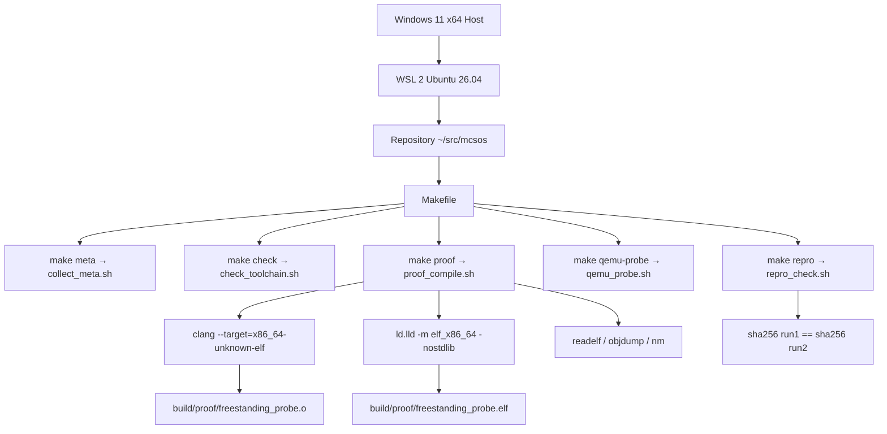

# Template Laporan Praktikum Sistem Operasi Lanjut — MCSOS

**Nama file laporan:** `laporan_praktikum_M1_Agung.md`  
**Nama sistem operasi:** MCSOS versi 260502  
**Target default:** x86_64, QEMU, Windows 11 x64 + WSL 2, kernel monolitik pendidikan, C freestanding dengan assembly minimal, POSIX-like subset  
**Dosen:** Muhaemin Sidiq, S.Pd., M.Pd.  
**Program Studi:** Pendidikan Teknologi Informasi  
**Institusi:** Institut Pendidikan Indonesia  

---

## 0. Metadata Laporan

| Atribut | Isi |
|---|---|
| Kode praktikum | `M1` |
| Judul praktikum | `Toolchain Reproducible dan Pemeriksaan Kesiapan Lingkungan Pengembangan MCSOS 260502` |
| Jenis pengerjaan | `Individu` |
| Nama mahasiswa | `Agung Nurjaman` |
| NIM | `25832073010` |
| Kelas | `PTI` |
| Nama kelompok | `-` |
| Anggota kelompok | `-` |
| Tanggal praktikum | `2026-06-13` |
| Tanggal pengumpulan | `2026-06-13` |
| Repository | `~/src/mcsos` |
| Branch | `master` |
| Commit awal | `4484e354218cc40a720840555f73db5908e919fe` |
| Commit akhir | `812519b` (jalankan `git rev-parse HEAD` untuk hash lengkap) |
| Status readiness yang diklaim | `Siap lanjut M2` |

---

## 1. Sampul

# Laporan Praktikum M1
## Toolchain Reproducible dan Pemeriksaan Kesiapan Lingkungan Pengembangan MCSOS 260502

Disusun oleh:

| Nama | NIM | Kelas | Peran |
|---|---|---|---|
| Agung Nurjaman | 25832073010 | PTI | Individu |

Dosen Pengampu: **Muhaemin Sidiq, S.Pd., M.Pd.**  
Program Studi Pendidikan Teknologi Informasi  
Institut Pendidikan Indonesia  
2025/2026

---

## 2. Pernyataan Orisinalitas dan Integritas Akademik

Saya menyatakan bahwa laporan ini disusun berdasarkan pekerjaan praktikum sendiri sesuai panduan M1. Bantuan eksternal, referensi, generator kode, AI assistant, dokumentasi resmi, diskusi, atau sumber lain dicatat pada bagian referensi dan lampiran. Saya tidak mengklaim hasil yang tidak dibuktikan oleh log, test, commit, atau artefak lain.

| Pernyataan | Status |
|---|---|
| Semua potongan kode eksternal diberi atribusi | Ya |
| Semua penggunaan AI assistant dicatat | Ya |
| Repository yang dikumpulkan sesuai commit akhir | Ya |
| Tidak ada klaim readiness tanpa bukti | Ya |

Catatan penggunaan bantuan eksternal:

```text
Panduan resmi praktikum M1 (OS_panduan_M1.pdf) digunakan sebagai acuan utama
untuk semua perintah, struktur script, dan struktur repository.
Verifikasi setiap langkah dilakukan secara mandiri di lingkungan WSL 2 Ubuntu 26.04.
```

---

## 3. Tujuan Praktikum

1. Memvalidasi kesiapan lingkungan pengembangan WSL 2 Ubuntu 26.04 pada host Windows 11 x64 untuk pengembangan kernel MCSOS.
2. Memasang dan memverifikasi seluruh toolchain wajib: Clang/LLVM, LLD, GCC, Binutils, NASM, QEMU, OVMF, GDB, CMake, Ninja, ShellCheck, Cppcheck, Clang-Tidy.
3. Membuat script pemeriksaan toolchain yang dapat dijalankan ulang secara deterministik dari clean checkout.
4. Menghasilkan metadata versi toolchain sebagai evidence reproduksi build yang dapat diaudit.
5. Mengompilasi source C freestanding kecil menjadi object dan ELF target x86_64 ELF tanpa ketergantungan hosted libc.
6. Memverifikasi bahwa build proof bersifat reproducible dengan hash SHA-256 yang identik pada dua run berturut-turut.
7. Membuktikan kesiapan QEMU machine q35 dan OVMF sebagai prasyarat boot image M2.

---

## 4. Capaian Pembelajaran Praktikum

Setelah praktikum ini, mahasiswa mampu:

| CPL/CPMK praktikum | Bukti yang harus ditunjukkan |
|---|---|
| Menjelaskan mengapa pengembangan kernel memerlukan toolchain freestanding | Analisis pada bagian 6 dan jawaban pertanyaan analisis bagian 14 |
| Mengonfigurasi WSL 2 dan repository Linux filesystem untuk MCSOS | Output `make check`, path `/home/agung/src/mcsos` |
| Memasang dan memverifikasi seluruh tool build wajib | Output `make check` dengan semua baris OK |
| Membuat script pemeriksaan toolchain deterministik | `tools/scripts/check_toolchain.sh`, `tools/scripts/collect_meta.sh` |
| Menghasilkan metadata versi toolchain sebagai evidence | `build/meta/toolchain-versions.txt`, `build/meta/host-readiness.txt` |
| Mengompilasi object freestanding x86_64 ELF dan memeriksa hasilnya | `build/proof/freestanding_probe.o`, `build/proof/freestanding_probe.elf`, readelf/objdump/nm output |
| Menjelaskan failure modes umum toolchain OSDev | Bagian 15 laporan ini |
| Menyusun readiness review M1 dengan bukti yang dapat diperiksa | `docs/readiness/M1-toolchain.md` |

---

## 5. Peta Milestone MCSOS

| Milestone | Fokus | Status dalam laporan |
|---|---|---|
| M0 | Requirements, governance, baseline arsitektur | ✓ selesai praktikum |
| M1 | Toolchain reproducible, Git, QEMU, GDB, metadata build | ✓ selesai praktikum |
| M2 | Boot image, kernel ELF64, early console | [ ] tidak dibahas |
| M3 | Panic path, linker map, GDB, observability awal | [ ] tidak dibahas |
| M4 | Trap, exception, interrupt, timer | [ ] tidak dibahas |
| M5 | PMM, VMM, page table, kernel heap | [ ] tidak dibahas |
| M6 | Thread, scheduler, synchronization | [ ] tidak dibahas |
| M7 | Syscall ABI dan user program loader | [ ] tidak dibahas |
| M8 | VFS, file descriptor, ramfs | [ ] tidak dibahas |
| M9 | Block layer dan device model | [ ] tidak dibahas |
| M10 | Persistent filesystem, mcsfs/ext2-like, recovery | [ ] tidak dibahas |
| M11 | Networking stack, packet parsing, UDP/TCP subset | [ ] tidak dibahas |
| M12 | Security model, capability/ACL, syscall fuzzing, hardening | [ ] tidak dibahas |
| M13 | SMP, scalability, lock stress, NUMA-aware preparation | [ ] tidak dibahas |
| M14 | Framebuffer, graphics console, visual regression | [ ] tidak dibahas |
| M15 | Virtualization/container subset | [ ] tidak dibahas |
| M16 | Observability, update/rollback, release image, readiness review | [ ] tidak dibahas |

Batas cakupan praktikum:

```text
M1 hanya mencakup validasi lingkungan, toolchain, dan proof kompilasi freestanding.
M1 tidak mencakup: bootloader, kernel entry, linker script final, boot di QEMU,
menjalankan GDB pada kernel, syscall, userspace, stabilitas OS, atau klaim siap produksi.
```

---

## 6. Dasar Teori Ringkas

### 6.1 Konsep Sistem Operasi yang Diuji

```text
Hosted vs Freestanding:
Program hosted berjalan di atas OS dengan akses ke libc (printf, malloc, file I/O, thread).
Program freestanding tidak mengasumsikan fasilitas OS apapun. Kernel MCSOS harus
dikompilasi sebagai freestanding karena pada saat kernel berjalan, belum ada OS yang
menyediakan layanan libc.

Reproducible Build:
Build dinyatakan reproducible jika menjalankan proses kompilasi dua kali dengan input
yang sama menghasilkan output biner yang identik secara bit. Pada M1 dibuktikan dengan
membandingkan hash SHA-256 dari dua run proof_compile.sh.

Toolchain sebagai Trusted Computing Base:
Compiler, linker, assembler, emulator, dan debugger membentuk trust boundary.
Konfigurasi yang salah dapat menghasilkan binary yang tampak valid tetapi salah ABI,
salah format, atau tidak sesuai target kernel.
```

### 6.2 Konsep Arsitektur x86_64 yang Relevan

| Konsep | Relevansi pada praktikum | Bukti/verifikasi |
|---|---|---|
| ELF64 format | Format object dan executable kernel MCSOS | `readelf -hW freestanding_probe.elf` menunjukkan Class: ELF64 |
| x86_64 target triple | Identitas arsitektur, vendor, sistem, ABI target | Flag `--target=x86_64-unknown-elf` pada Clang |
| Red zone x86_64 | Area 128 byte di bawah RSP, berbahaya untuk kernel/interrupt handler | Flag `-mno-red-zone` pada CFLAGS |
| Freestanding ABI | Kernel tidak boleh bergantung pada crt0, libc, dynamic linker | `nm -u` menghasilkan output kosong |
| QEMU q35 machine | Emulator machine model yang mendukung ICH9 dan PCIe untuk UEFI | Output `make qemu-probe` menunjukkan q35 terdeteksi |

### 6.3 Konsep Implementasi Freestanding

| Aspek | Keputusan praktikum |
|---|---|
| Bahasa | C17 freestanding |
| Runtime | Tanpa hosted libc, tanpa crt0, tanpa dynamic linker |
| ABI | x86_64-unknown-elf, entry `mcsos_toolchain_probe` |
| Compiler flags kritis | `--target=x86_64-unknown-elf`, `-ffreestanding`, `-fno-stack-protector`, `-fno-pic`, `-mno-red-zone`, `-mno-mmx`, `-mno-sse`, `-mno-sse2`, `-nostdlib` |
| Risiko undefined behavior | Pointer void, operasi bitwise shift pada integer, aliasing antar tipe |

### 6.4 Referensi Teori yang Digunakan

| No. | Sumber | Bagian yang digunakan | Alasan relevansi |
|---|---|---|---|
| [1] | Microsoft, "Install WSL," Microsoft Learn, 2025 | Instalasi WSL 2 | Panduan resmi instalasi WSL 2 di Windows 11 |
| [2] | Microsoft, "Advanced settings configuration in WSL," Microsoft Learn, 2025 | `.wslconfig` memory/cpu | Konfigurasi resource WSL 2 |
| [3] | QEMU Project, "Invocation," QEMU System Emulation User's Guide, 2026 | Machine dan accel options | Dasar penggunaan QEMU untuk emulasi x86_64 |
| [4] | LLVM Project, "Cross-compilation using Clang," Clang Documentation | Target triple | Dasar kompilasi cross-target dengan Clang |
| [5] | Free Software Foundation, "x86 Options," GCC Online Documentation | `-mno-red-zone`, `-mno-sse` | Flag arsitektur x86 untuk kernel development |
| [6] | Free Software Foundation, "Options for Linking," GCC Online Documentation | `-nostdlib`, `--entry` | Opsi linker untuk kernel freestanding |
| [7] | GNU Project, "GNU Binutils," GNU Binutils Documentation | `readelf`, `objdump`, `nm` | Inspeksi ELF artifact |

---

## 7. Lingkungan Praktikum

### 7.1 Host dan Target

| Komponen | Nilai |
|---|---|
| Host OS | Windows 11 x64 |
| Lingkungan build | WSL 2 Ubuntu 26.04 LTS (Resolute Raccoon) |
| Kernel WSL | Linux 6.6.87.2-microsoft-standard-WSL2 |
| Target ISA | x86_64 |
| Target ABI | x86_64-unknown-elf |
| Emulator | QEMU 10.2.1 (Debian 1:10.2.1+ds-1ubuntu3) |
| Firmware emulator | OVMF — `/usr/share/OVMF/OVMF_CODE_4M.fd`, `/usr/share/ovmf/OVMF.fd`, `/usr/share/qemu/OVMF.fd` |
| Debugger | GDB 17.1 (Ubuntu 17.1-2ubuntu1) |
| Build system | GNU Make 4.4.1 |
| Bahasa utama | C17 freestanding |
| Assembly | NASM 3.01 |
| CPU host | Intel Core i3-1005G1 @ 1.20GHz, 4 vCPU (WSL 2) |
| RAM WSL | 1.8 GiB total |

### 7.2 Versi Toolchain

Perintah yang dijalankan:

```bash
make meta
```

Output `build/meta/toolchain-versions.txt`:

```text
mcsos_milestone=M1
date_utc=2026-06-13T16:05:20Z
repo=/home/agung/src/mcsos
pwd=/home/agung/src/mcsos
user=agung
uname=Linux DESKTOP-FPCS9GF 6.6.87.2-microsoft-standard-WSL2 #1 SMP PREEMPT_DYNAMIC Thu Jun  5 18:30:46 UTC 2025 x86_64 GNU/Linux
nproc=4
shell=/bin/bash

[os-release]
PRETTY_NAME="Ubuntu 26.04 LTS"
NAME="Ubuntu"
VERSION_ID="26.04"
VERSION="26.04 LTS (Resolute Raccoon)"
VERSION_CODENAME=resolute

[tool-versions]
git version 2.53.0
GNU Make 4.4.1
cmake version 4.2.3
1.13.2
Ubuntu clang version 21.1.8 (6ubuntu1)
Ubuntu LLD 21.1.8 (compatible with GNU linkers)
Ubuntu LLVM version 21.1.8
gcc (Ubuntu 15.2.0-16ubuntu1) 15.2.0
GNU readelf (GNU Binutils for Ubuntu) 2.46
GNU objdump (GNU Binutils for Ubuntu) 2.46
GNU nm (GNU Binutils for Ubuntu) 2.46
NASM version 3.01
QEMU emulator version 10.2.1 (Debian 1:10.2.1+ds-1ubuntu3)
GNU gdb (Ubuntu 17.1-2ubuntu1) 17.1
Python 3.14.4
ShellCheck version: 0.11.0
Cppcheck 2.19.0
Ubuntu LLVM version 21.1.8
```

### 7.3 Lokasi Repository

| Item | Nilai |
|---|---|
| Path repository di WSL | `~/src/mcsos` (`/home/agung/src/mcsos`) |
| Apakah berada di filesystem Linux WSL, bukan `/mnt/c` | Ya |
| Remote repository | - (lokal) |
| Branch | `master` |
| Commit hash awal M1 | `4484e354218cc40a720840555f73db5908e919fe` |
| Commit hash akhir M1 | `812519b` (M1: update commit hash in readiness review) |

---

## 8. Repository dan Struktur File

### 8.1 Struktur Direktori yang Relevan

```text
mcsos/
├── Makefile
├── .gitignore
├── README.md
├── docs/
│   ├── architecture/
│   │   └── invariants.md
│   ├── readiness/
│   │   └── M1-toolchain.md
│   ├── security/
│   │   └── toolchain_threat_model.md
│   └── testing/
├── tools/
│   └── scripts/
│       ├── check_toolchain.sh
│       ├── collect_meta.sh
│       ├── proof_compile.sh
│       ├── qemu_probe.sh
│       └── repro_check.sh
├── tests/
│   └── toolchain/
│       └── freestanding_probe.c
└── build/                        # generated, tidak dikomit
    ├── meta/
    │   ├── toolchain-versions.txt
    │   ├── host-readiness.txt
    │   └── qemu-capabilities.txt
    ├── proof/
    │   ├── freestanding_probe.o
    │   ├── freestanding_probe.elf
    │   ├── readelf-header.txt
    │   ├── readelf-sections.txt
    │   ├── objdump-disassembly.txt
    │   └── nm-undefined.txt
    └── repro/
        ├── sha256-run1.txt
        ├── sha256-run2.txt
        └── repro-status.txt
```

### 8.2 File yang Dibuat atau Diubah

| File | Jenis perubahan | Alasan perubahan | Risiko |
|---|---|---|---|
| `Makefile` | Baru | Antarmuka build tunggal M1 | Rendah — tidak memuat kode kernel |
| `.gitignore` | Baru | Mencegah artefak generated masuk commit | Rendah |
| `tools/scripts/collect_meta.sh` | Baru | Mengumpulkan versi toolchain dan host info | Rendah |
| `tools/scripts/check_toolchain.sh` | Baru | Gate verifikasi tool dan path repository | Rendah |
| `tools/scripts/proof_compile.sh` | Baru | Kompilasi proof freestanding ELF x86_64 | Rendah — hanya proof, bukan kernel |
| `tools/scripts/qemu_probe.sh` | Baru | Verifikasi QEMU q35 dan OVMF | Rendah |
| `tools/scripts/repro_check.sh` | Baru | Verifikasi hash reproducibility dua run | Rendah |
| `tests/toolchain/freestanding_probe.c` | Baru | Source proof freestanding tanpa libc | Rendah |
| `docs/architecture/invariants.md` | Baru | Dokumentasi invariants M1 untuk M2 | Rendah |
| `docs/security/toolchain_threat_model.md` | Baru | Threat model toolchain dan supply-chain | Rendah |
| `docs/readiness/M1-toolchain.md` | Baru | Readiness review M1 dengan evidence | Rendah |

### 8.3 Ringkasan Diff

```bash
git log --oneline
```

Output:

```text
812519b (HEAD -> master) M1: update commit hash in readiness review
4484e35 M1: add reproducible toolchain readiness baseline - Agung Nurjaman 25832073010
0b4ecbf M0: update laporan dengan commit hash final
43aaaed M0: initialize reproducible OS development baseline
ccfd86c M0 By Agung
```

---

## 9. Desain Teknis

### 9.1 Masalah yang Diselesaikan

```text
Pengembangan kernel memerlukan lingkungan build yang terkendali, terukur, dan dapat
direproduksi. Tanpa validasi toolchain yang ketat, kesalahan konfigurasi dapat menyebabkan:
- Compiler menghasilkan object untuk target yang salah (misalnya Linux x86_64 bukan bare-metal ELF)
- Linker menyertakan startup object host (crt0) atau libc sehingga kernel bergantung pada runtime yang tidak ada
- Red zone aktif yang merusak stack saat interrupt handler berjalan
- Repository di /mnt/c yang rentan masalah permission, case sensitivity, dan I/O

M1 menyelesaikan masalah ini dengan menetapkan gate toolchain sebelum kode kernel ditulis.
```

### 9.2 Keputusan Desain

| Keputusan | Alternatif yang dipertimbangkan | Alasan memilih | Konsekuensi |
|---|---|---|---|
| Clang/LLD sebagai compiler utama | GCC cross toolchain | Clang mendukung `--target=` tanpa build cross-compiler terpisah | GCC cross toolchain belum tersedia sebagai pengayaan |
| Repository di `~/src/mcsos` (Linux WSL) | `/mnt/c/mcsos` (Windows) | Filesystem Linux menghindari masalah permission, executable bit, case sensitivity | Build harus selalu dijalankan dari WSL shell |
| Makefile sebagai antarmuka tunggal | Script manual langsung | Kontrak build tunggal memudahkan reproduksi dan audit | Semua target harus dipanggil via `make` |
| `build/` di .gitignore | Komit artefak generated | Menghindari repository kotor dan konflik binary | Evidence harus dilampirkan terpisah pada laporan |
| Target ELF `0xffffffff80000000` | Alamat lain | Sesuai konvensi kernel higher-half x86_64 | Linker script final M2 harus konsisten dengan alamat ini |

### 9.3 Arsitektur Ringkas



Penjelasan diagram:

```text
Host Windows 11 hanya digunakan untuk menjalankan WSL 2. Seluruh build dilakukan
di dalam WSL 2 Ubuntu 26.04. Makefile menjadi satu-satunya antarmuka build.
Setiap target Makefile memanggil script di tools/scripts/. Output build disimpan
di build/ yang tidak dikomit. Evidence dihasilkan dari perintah readelf, objdump,
nm, dan sha256sum.
```

### 9.4 Kontrak Antarmuka

| Antarmuka | Pemanggil | Penerima | Precondition | Postcondition | Error path |
|---|---|---|---|---|---|
| `make meta` | Pengguna/CI | `collect_meta.sh` | WSL aktif, tool tersedia | `build/meta/toolchain-versions.txt` dan `host-readiness.txt` terisi | Script gagal jika `build/meta` tidak dapat dibuat |
| `make check` | Pengguna/CI | `check_toolchain.sh` | Tool terpasang, repo di Linux WSL | Exit 0 jika semua OK | Exit 1 + pesan ERROR jika tool hilang atau path salah |
| `make proof` | Pengguna/CI | `proof_compile.sh` | Clang dan LLD tersedia | Object dan ELF terbentuk, `nm-undefined.txt` kosong | Exit 1 jika ada undefined symbol |
| `make qemu-probe` | Pengguna/CI | `qemu_probe.sh` | QEMU dan OVMF terpasang | `qemu-capabilities.txt` terisi, q35 dan OVMF terdeteksi | Exit 1 jika q35 atau OVMF tidak ditemukan |
| `make repro` | Pengguna/CI | `repro_check.sh` | `proof_compile.sh` dapat berjalan | Hash run1 = run2 | Exit 1 jika hash berbeda |

### 9.5 Struktur Data Utama

| Struktur data | Field penting | Ownership | Lifetime | Invariant |
|---|---|---|---|---|
| `mcsos_probe_sink` (volatile uint64_t) | Nilai hasil komputasi | Global BSS | Sepanjang eksekusi proof | Tidak pernah dioptimasi oleh compiler karena volatile |
| ELF header proof | `e_machine`, `e_type`, `e_entry` | Linker output | Build artifact | `e_machine` = 0x3E (x86-64), `e_type` = ET_EXEC |

### 9.6 Invariants

1. Repository MCSOS berada di filesystem Linux WSL, bukan di `/mnt/c` atau mount Windows lain.
2. Semua generated artifact berada di `build/` dan tidak dikomit ke Git.
3. Semua build tool wajib tersedia melalui PATH WSL dan tercatat di `build/meta/toolchain-versions.txt`.
4. Proof object harus bertipe ELF64 x86_64 (Machine: Advanced Micro Devices X86-64).
5. Proof ELF tidak boleh memiliki undefined symbol (`nm-undefined.txt` kosong).
6. Kompilasi kernel/proof tidak boleh bergantung pada hosted libc, startup object, dynamic linker, exception runtime, atau stack protector runtime host.
7. QEMU x86_64, machine q35, dan OVMF harus terdeteksi sebelum M2 dimulai.
8. Hash SHA-256 dari dua run proof_compile.sh harus identik.

### 9.7 Ownership, Locking, dan Concurrency

| Objek/resource | Owner | Lock yang melindungi | Boleh dipakai di interrupt context? | Catatan |
|---|---|---|---|---|
| `build/` directory | Make/script | Tidak ada (single process) | Tidak relevan (M1) | Build M1 single-threaded |
| `mcsos_probe_sink` | `proof_compile.sh` target | Tidak ada | Tidak relevan (M1) | Hanya proof, tidak ada concurrency |

Lock order yang berlaku:

```text
Tidak ada locking pada M1. Build dijalankan single-process oleh Make.
```

### 9.8 Memory Safety dan Undefined Behavior Risk

| Risiko | Lokasi | Mitigasi | Bukti |
|---|---|---|---|
| Integer overflow pada `rotl64` | `freestanding_probe.c` | Operasi dilakukan pada `uint64_t` unsigned, overflow well-defined | Kompilasi dengan `-Werror` tidak menampilkan warning |
| Shift undefined behavior | `rotl64(x, 64-r)` | Nilai r dijaga 0-63 oleh logika loop | Kompilasi lulus tanpa warning |
| Stack red zone | Seluruh fungsi C | Flag `-mno-red-zone` | CFLAGS dalam `proof_compile.sh` |

### 9.9 Security Boundary

| Boundary | Data tidak tepercaya | Validasi yang dilakukan | Failure mode aman |
|---|---|---|---|
| Path repository | `$PWD` dari environment | `check_toolchain.sh` menolak path `/mnt/*` | Exit 1 + pesan ERROR |
| OVMF path | Path file firmware | Loop cek `[ -r "$path" ]` | Script gagal jika tidak ada path valid |
| Tool binary | Nama command dari PATH | `command -v` | Exit 1 jika tidak ditemukan |

---

## 10. Langkah Kerja Implementasi

### Langkah 1 — Instalasi WSL 2 dan Ubuntu

Maksud langkah:

```text
Menyiapkan lingkungan Linux pada Windows 11 sebagai host build MCSOS.
WSL 2 diperlukan karena kernel build sensitif terhadap filesystem Linux
(permission bit, executable bit, case sensitivity, symlink).
```

Perintah (di PowerShell Administrator):

```powershell
wsl --version
wsl --list --verbose
wsl --install -d Ubuntu
```

Output ringkas:

```text
NAME      STATE           VERSION
Ubuntu    Running         2
```

Indikator berhasil:

```text
Kolom VERSION menampilkan 2. Distribusi Ubuntu terdaftar dan berjalan.
```

### Langkah 2 — Konfigurasi .wslconfig

Maksud langkah:

```text
Mengatur resource WSL 2 agar tidak kehabisan RAM atau CPU saat kompilasi dan QEMU.
```

File `C:\Users\Lenovo\.wslconfig`:

```ini
[wsl2]
memory=4GB
processors=4
swap=4GB
localhostForwarding=true
nestedVirtualization=true

[experimental]
autoMemoryReclaim=gradual
```

Indikator berhasil:

```text
`free -h` di WSL menunjukkan total memori sesuai konfigurasi.
```

### Langkah 3 — Buat direktori repository

Maksud langkah:

```text
Memastikan repository berada di filesystem Linux WSL, bukan di mount Windows.
```

Perintah:

```bash
mkdir -p ~/src/mcsos
cd ~/src/mcsos
git init
```

Output ringkas:

```text
OK: repository berada di filesystem Linux WSL: /home/agung/src/mcsos
```

Indikator berhasil:

```text
Path tidak dimulai dengan /mnt/. git init berhasil.
```

### Langkah 4 — Instalasi paket toolchain

Maksud langkah:

```text
Memasang semua tool wajib M1 dari repository resmi Ubuntu 26.04.
```

Perintah:

```bash
sudo apt update
sudo apt install -y \
  build-essential git make cmake ninja-build pkg-config \
  clang lld llvm binutils nasm \
  qemu-system-x86 qemu-utils ovmf \
  gdb gdb-multiarch \
  python3 python3-pip python3-venv \
  shellcheck cppcheck clang-tidy \
  xorriso mtools dosfstools file coreutils findutils
```

Indikator berhasil:

```text
Tidak ada error apt. Semua paket terinstal.
```

### Langkah 5 — Buat struktur repository dan script

Maksud langkah:

```text
Membuat direktori, script toolchain, source proof, dan Makefile sesuai spesifikasi M1.
```

Perintah:

```bash
mkdir -p docs/architecture docs/readiness docs/security docs/testing \
         tools/scripts tests/toolchain build/meta build/proof
```

Artefak yang dihasilkan:

| Artefak | Lokasi | Fungsi |
|---|---|---|
| `collect_meta.sh` | `tools/scripts/` | Mengumpulkan versi toolchain dan host info |
| `check_toolchain.sh` | `tools/scripts/` | Gate verifikasi tool wajib dan path |
| `proof_compile.sh` | `tools/scripts/` | Kompilasi proof freestanding ELF |
| `qemu_probe.sh` | `tools/scripts/` | Verifikasi QEMU dan OVMF |
| `repro_check.sh` | `tools/scripts/` | Verifikasi reproducibility hash |
| `freestanding_probe.c` | `tests/toolchain/` | Source proof freestanding |
| `Makefile` | root | Antarmuka build tunggal M1 |

### Langkah 6 — Jalankan make test

Maksud langkah:

```text
Menjalankan seluruh target M1 sekaligus untuk membuktikan kesiapan lingkungan.
```

Perintah:

```bash
make distclean
make test
```

Output ringkas:

```text
OK: repository path is WSL Linux filesystem: /home/agung/src/mcsos
OK: git                      /usr/bin/git
OK: make                     /usr/bin/make
OK: cmake                    /usr/bin/cmake
OK: ninja                    /usr/bin/ninja
OK: clang                    /usr/bin/clang
OK: ld.lld                   /usr/bin/ld.lld
OK: llvm-objdump             /usr/bin/llvm-objdump
OK: gcc                      /usr/bin/gcc
OK: readelf                  /usr/bin/readelf
OK: objdump                  /usr/bin/objdump
OK: nm                       /usr/bin/nm
OK: nasm                     /usr/bin/nasm
OK: qemu-system-x86_64       /usr/bin/qemu-system-x86_64
OK: gdb                      /usr/bin/gdb
OK: python3                  /usr/bin/python3
OK: shellcheck               /usr/bin/shellcheck
OK: cppcheck                 /usr/bin/cppcheck
OK: clang-tidy               /usr/bin/clang-tidy
OK: file                     /usr/bin/file
OK: OVMF firmware found: /usr/share/OVMF/OVMF_CODE_4M.fd
OK: OVMF firmware found: /usr/share/ovmf/OVMF.fd
OK: OVMF firmware found: /usr/share/qemu/OVMF.fd
OK: freestanding x86_64 ELF proof generated
OK: QEMU and OVMF probe complete
OK: proof build is reproducible for M1 inputs
OK: M1 test suite passed
```

Indikator berhasil:

```text
Baris terakhir: "OK: M1 test suite passed"
```

### Langkah 7 — Commit hasil M1

Perintah:

```bash
git add Makefile .gitignore docs tools tests
git commit -m "M1: add reproducible toolchain readiness baseline - Agung Nurjaman 25832073010"
git rev-parse HEAD
```

Output:

```text
[master 4484e35] M1: add reproducible toolchain readiness baseline - Agung Nurjaman 25832073010
 11 files changed, 364 insertions(+), 68 deletions(-)
4484e354218cc40a720840555f73db5908e919fe
```

---

## 11. Checkpoint Buildable

| Checkpoint | Perintah | Expected result | Status |
|---|---|---|---|
| CP1 — WSL 2 aktif | `wsl --list --verbose` | VERSION = 2 | PASS |
| CP2 — Tool check | `make check` | Semua baris OK, tidak ada ERROR | PASS |
| CP3 — Metadata toolchain | `make meta` | `build/meta/toolchain-versions.txt` terisi | PASS |
| CP4 — Proof compile | `make proof` | Object dan ELF terbentuk, `nm-undefined.txt` kosong | PASS |
| CP5 — QEMU probe | `make qemu-probe` | q35 dan OVMF terdeteksi | PASS |
| CP6 — Reproducibility | `make repro` | Hash run1 = run2 | PASS |
| CP7 — Full test suite | `make test` | `OK: M1 test suite passed` | PASS |
| CP8 — Git commit | `git commit` | Commit hash tercatat | PASS |

Catatan checkpoint:

```text
Seluruh 8 checkpoint lulus. Tidak ada checkpoint yang gagal.
```

---

## 12. Perintah Uji dan Validasi

### 12.1 Build Test

```bash
make distclean
make test
```

Hasil:

```text
OK: M1 test suite passed
```

Status: PASS

### 12.2 Static Inspection

```bash
readelf -hW build/proof/freestanding_probe.elf
readelf -SW build/proof/freestanding_probe.elf
objdump -drwC build/proof/freestanding_probe.o
nm -u build/proof/freestanding_probe.elf
```

Hasil penting:

```text
ELF Header:
  Class:     ELF64
  Data:      2's complement, little endian
  Type:      EXEC (Executable file)
  Machine:   Advanced Micro Devices X86-64
  Entry:     0xffffffff80000000

Section Headers:
  .text     PROGBITS  ffffffff80000000  AX
  .bss      NOBITS    ffffffff80001120  WA

nm -u output: (kosong — tidak ada undefined symbol)
```

Status: PASS

### 12.3 QEMU Probe

```bash
make qemu-probe
```

Hasil:

```text
[qemu-version]
QEMU emulator version 10.2.1 (Debian 1:10.2.1+ds-1ubuntu3)

[qemu-machine-help-q35]
q35   Standard PC (Q35 + ICH9, 2009) (alias of pc-q35-10.2)
ubuntu-q35  Ubuntu 26.04 PC (Q35 + ICH9, 2009)

[ovmf-candidates]
/usr/share/OVMF/OVMF_CODE_4M.fd
/usr/share/ovmf/OVMF.fd
/usr/share/qemu/OVMF.fd

OK: QEMU and OVMF probe complete
```

Status: PASS

### 12.4 GDB Debug Evidence

```text
GDB tersedia di /usr/bin/gdb versi 17.1.
Boot kernel dan GDB session belum dilakukan pada M1 (non-goal M1).
GDB readiness akan dibuktikan pada M2.
```

Status: NA (non-goal M1)

### 12.5 Unit Test (make test)

```bash
make test
```

Hasil:

```text
OK: M1 test suite passed
```

Status: PASS

### 12.6 Stress/Fuzz/Fault Injection Test

```text
Tidak dilakukan pada M1. M1 hanya memverifikasi toolchain dan proof compile.
Stress test dan fuzz test akan relevan mulai M5 (PMM/VMM) dan M12 (security).
```

Status: NA

---

## 13. Hasil Uji

### 13.1 Tabel Ringkasan Hasil

| No. | Uji | Expected result | Actual result | Status | Evidence |
|---|---|---|---|---|---|
| 1 | Repository path check | Path bukan `/mnt/*` | `/home/agung/src/mcsos` | PASS | Output `make check` |
| 2 | Tool availability check | Semua 19 tool ditemukan | Semua 19 tool OK | PASS | Output `make check` |
| 3 | OVMF check | Minimal 1 path OVMF valid | 3 path OVMF ditemukan | PASS | Output `make check` |
| 4 | ELF type check | ELF64 x86_64 relocatable | ELF 64-bit LSB relocatable, x86-64 | PASS | `build/proof/file-type.txt` |
| 5 | ELF machine check | Machine: Advanced Micro Devices X86-64 | Machine: Advanced Micro Devices X86-64 | PASS | `build/proof/readelf-header.txt` |
| 6 | Undefined symbol check | `nm-undefined.txt` kosong | Kosong | PASS | `build/proof/nm-undefined.txt` |
| 7 | QEMU q35 check | q35 terdeteksi | q35 + ubuntu-q35 terdeteksi | PASS | `build/meta/qemu-capabilities.txt` |
| 8 | Reproducibility check | Hash run1 = run2 | Hash identik | PASS | `build/repro/sha256-run1.txt`, `sha256-run2.txt` |
| 9 | `make test` dari clean state | `OK: M1 test suite passed` | `OK: M1 test suite passed` | PASS | Terminal output |

### 13.2 Log Penting

```text
Hash SHA-256 proof artifacts:
freestanding_probe.o:
  aefc3c8ba97a92ab60b2ace7ef06d147a86c736edc2bd2e4fbcb2a7e5d84beb7

freestanding_probe.elf:
  b11ff11dfe25e430679d0914191ccda938fdd20a0e1aa8d71c45be7de28d9c23

Hash identik pada run1 dan run2 — build reproducible.
```

### 13.3 Artefak Bukti

| Artefak | Path | SHA-256 | Fungsi |
|---|---|---|---|
| `freestanding_probe.o` | `build/proof/freestanding_probe.o` | `aefc3c8ba97a92ab60b2ace7ef06d147a86c736edc2bd2e4fbcb2a7e5d84beb7` | ELF64 relocatable proof object |
| `freestanding_probe.elf` | `build/proof/freestanding_probe.elf` | `b11ff11dfe25e430679d0914191ccda938fdd20a0e1aa8d71c45be7de28d9c23` | ELF64 executable proof |
| `toolchain-versions.txt` | `build/meta/toolchain-versions.txt` | - | Versi toolchain lengkap |
| `host-readiness.txt` | `build/meta/host-readiness.txt` | - | Info CPU, memori, filesystem |
| `qemu-capabilities.txt` | `build/meta/qemu-capabilities.txt` | - | QEMU version, q35, OVMF |
| `readelf-header.txt` | `build/proof/readelf-header.txt` | - | ELF header proof ELF |
| `readelf-sections.txt` | `build/proof/readelf-sections.txt` | - | ELF sections proof |
| `objdump-disassembly.txt` | `build/proof/objdump-disassembly.txt` | - | Disassembly `mcsos_toolchain_probe` |
| `nm-undefined.txt` | `build/proof/nm-undefined.txt` | - | Daftar undefined symbol (kosong) |

---

## 14. Analisis Teknis

### 14.1 Jawaban Pertanyaan Analisis

**1. Mengapa repository MCSOS sebaiknya ditempatkan di filesystem Linux WSL, bukan di `/mnt/c`?**

```text
Filesystem Windows (NTFS) yang diakses melalui /mnt/c di WSL memiliki beberapa
keterbatasan kritis untuk pengembangan kernel:
- Executable bit tidak didukung secara native (script .sh tidak dapat di-chmod +x dengan benar)
- Case sensitivity berbeda (Windows case-insensitive, Linux case-sensitive)
- Symlink berperilaku berbeda
- Performa I/O jauh lebih lambat (hingga 10x) untuk operasi build intensif
- Permission bit POSIX tidak direpresentasikan dengan benar
Untuk kernel development yang sensitif terhadap semua detail ini, repository harus
berada di filesystem Linux WSL (/home/...).
```

**2. Apa perbedaan `x86_64-unknown-elf` dengan `x86_64-linux-gnu` dalam konteks kernel freestanding?**

```text
x86_64-linux-gnu: Target untuk program Linux userspace. Compiler mengasumsikan
adanya kernel Linux, libc, dynamic linker, dan startup object (crt0). Linker
secara default menyertakan startup file dan shared library.

x86_64-unknown-elf: Target bare-metal tanpa OS. Compiler tidak mengasumsikan
adanya OS, libc, atau startup object. Cocok untuk kernel karena pada saat kernel
berjalan, belum ada OS yang menyediakan layanan tersebut.

Menggunakan x86_64-linux-gnu untuk kernel akan menyebabkan linker mencoba
menyertakan crt0 dan libc, yang tidak tersedia di lingkungan kernel, sehingga
build gagal atau menghasilkan binary yang salah.
```

**3. Mengapa flag `-ffreestanding`, `-nostdlib`, dan `-mno-red-zone` penting untuk kernel x86_64?**

```text
-ffreestanding: Memberitahu compiler bahwa program tidak berjalan di hosted
environment. Compiler tidak mengasumsikan ketersediaan libc headers seperti
stdio.h, stdlib.h. Fungsi built-in yang bergantung pada libc tidak otomatis
di-inline.

-nostdlib: Memberitahu linker untuk tidak secara otomatis menyertakan startup
file (crt0.o, crti.o) dan library standar (libc, libgcc). Kernel harus
mengontrol entry point sendiri.

-mno-red-zone: Menonaktifkan red zone — area 128 byte di bawah RSP yang
digunakan oleh ABI userland untuk penyimpanan sementara tanpa mengubah RSP.
Untuk kernel, saat interrupt terjadi, hardware tidak mengubah RSP sebelum
memanggil interrupt handler. Jika red zone aktif, data di area tersebut dapat
ditimpa oleh interrupt handler, menyebabkan korupsi stack yang sulit dideteksi.
```

**4. Apa risiko jika `nm -u` pada ELF proof menampilkan `__stack_chk_fail`, `memcpy`, atau symbol libc lain?**

```text
Munculnya symbol undefined seperti __stack_chk_fail, memcpy, atau printf
dalam ELF kernel menunjukkan bahwa kode bergantung pada runtime atau libc
yang tidak akan tersedia saat kernel berjalan.

__stack_chk_fail: Stack protector runtime dari libc. Jika stack overflow
terdeteksi compiler, program memanggil fungsi ini. Di kernel, fungsi ini
tidak ada sehingga binary tidak dapat di-link atau crash saat runtime.

memcpy: Implementasi dari libc. Kernel harus menyediakan implementasinya
sendiri atau menonaktifkan optimasi yang membutuhkannya.

Risiko: Binary yang tampak ter-link tetapi memiliki undefined symbol akan
crash saat dijalankan dengan "undefined symbol" error, atau tidak dapat
di-link sama sekali.
```

**5. Mengapa M1 belum boleh disebut sebagai bukti bahwa MCSOS dapat boot?**

```text
M1 hanya membuktikan:
- Toolchain dapat menghasilkan ELF64 x86_64 freestanding
- Tool-tool yang diperlukan tersedia
- QEMU dan OVMF dapat dideteksi

M1 belum:
- Membuat boot image (ISO/IMG) yang dapat dimuat oleh UEFI/BIOS
- Menulis kernel entry point yang benar (tidak ada `_start` atau UEFI entry)
- Membuat linker script yang menempatkan section di alamat yang benar untuk boot
- Menjalankan kode apapun di QEMU

Proof ELF M1 hanya valid sebagai test toolchain, bukan sebagai kernel yang
dapat di-boot.
```

**6. Apa saja bukti minimum agar lingkungan dinyatakan siap lanjut M2?**

```text
1. make test berhasil dari clean state (make distclean && make test)
2. nm-undefined.txt kosong
3. readelf menunjukkan ELF64 x86_64
4. QEMU q35 terdeteksi
5. OVMF tersedia minimal satu path
6. Hash reproducibility identik pada dua run
7. docs/readiness/M1-toolchain.md diisi dengan keputusan readiness yang jujur
8. Commit Git dibuat dan hash dicantumkan
```

**7. Jika hash build pertama dan kedua berbeda, bagaimana langkah diagnosis yang sistematis?**

```text
1. Jalankan readelf -n build/proof/freestanding_probe.elf untuk memeriksa
   apakah ada .note.gnu.build-id yang berubah setiap build
2. Bandingkan objdump -drwC dari kedua run untuk melihat apakah instruksi
   berbeda (menandakan optimasi nondeterministik)
3. Periksa apakah timestamp tersimpan di metadata ELF dengan readelf -p .comment
4. Cek apakah path absolut tersimpan dalam debug info dengan strings pada ELF
5. Jika ada build-id: tambahkan -Wl,--build-id=none ke ld.lld
6. Jika ada path: gunakan -ffile-prefix-map atau -fdebug-prefix-map
7. Catat penyebab nondeterminism dalam laporan jika tidak dapat dihilangkan
```

**8. Mengapa QEMU dan OVMF diperiksa pada M1 padahal boot image baru dibuat pada M2?**

```text
M1 adalah gate kritis. Jika QEMU tidak tersedia atau OVMF hilang saat M2,
seluruh praktikum M2 akan gagal meski kode kernel sudah benar. Dengan
memverifikasi QEMU dan OVMF di M1, masalah lingkungan dapat diperbaiki
sebelum waktu praktikum M2 terbuang untuk debugging tooling bukan kernel.
Prinsip: verifikasi dependencies sebelum mulai membangun di atasnya.
```

**9. Bagaimana threat model toolchain dapat mempengaruhi keamanan OS pada tahap lanjut?**

```text
Toolchain adalah Trusted Computing Base (TCB) dari OS. Jika compiler
dikompromikan (misalnya: backdoor Trusting Trust Attack), semua binary
yang dihasilkan dapat mengandung backdoor meski source code bersih.
Jika linker menyertakan library yang tidak diaudit, kernel dapat memiliki
kode yang tidak diketahui. Verifikasi versi toolchain, penggunaan package
dari sumber resmi, dan hash artefak membantu mendeteksi perubahan yang
tidak diinginkan. Pada tahap lanjut (M12), kernel security dapat diaudit
hanya jika toolchain yang menghasilkannya dapat dipercaya.
```

**10. Apakah hasil emulator dapat dijadikan bukti kesiapan hardware? Jelaskan batasannya.**

```text
Tidak. Emulator (QEMU) mensimulasikan perilaku hardware tetapi dengan
beberapa perbedaan kritis:
- Timing: emulator tidak mereplikasi timing hardware fisik secara akurat
- Device behavior: emulated device (virtio, e1000) berbeda dari hardware nyata
- Firmware: OVMF bukan firmware fisik laptop/server; perilaku UEFI dapat berbeda
- Memory model: emulator mungkin lebih permisif terhadap akses memory tidak valid
- CPU quirks: errata CPU spesifik tidak selalu diemulasi

Hasil uji QEMU hanya membuktikan kesiapan pada environment emulasi.
Hardware fisik memerlukan pengujian terpisah dengan perangkat target nyata.
```

### 14.2 Analisis Keberhasilan

```text
Seluruh target M1 berhasil karena:
1. Lingkungan WSL 2 Ubuntu 26.04 yang baru menyediakan semua paket toolchain
   dengan versi yang melebihi minimum (Clang 21 vs minimum 16, QEMU 10.2 vs minimum 8.x)
2. Penggunaan flag kompilasi yang tepat mencegah ketergantungan pada hosted libc
3. Linker LLD dengan -nostdlib menghasilkan ELF bersih tanpa startup object
4. Build proof yang sederhana (hanya operasi bitwise dan loop) tidak memerlukan
   runtime support apapun sehingga nm-undefined.txt kosong
5. LLVM/Clang yang deterministik menghasilkan output biner yang identik pada
   dua run dengan input yang sama
```

### 14.3 Perbandingan dengan Teori

| Konsep teori | Implementasi praktikum | Sesuai/tidak sesuai | Penjelasan |
|---|---|---|---|
| Freestanding tidak bergantung pada libc | Flag `-ffreestanding -nostdlib`, `nm -u` kosong | Sesuai | Tidak ada symbol undefined dari libc |
| Red zone berbahaya untuk kernel | Flag `-mno-red-zone` | Sesuai | Flag diterapkan pada semua kompilasi proof |
| Target triple menentukan ABI | `--target=x86_64-unknown-elf` | Sesuai | readelf menunjukkan x86-64, bukan linux-gnu |
| Reproducible build dari input yang sama | Hash SHA-256 identik dua run | Sesuai | `sha256-run1.txt` = `sha256-run2.txt` |

### 14.4 Kompleksitas dan Kinerja

| Aspek | Estimasi/hasil | Bukti | Catatan |
|---|---|---|---|
| Waktu build proof | < 2 detik | Observasi langsung | Proof sangat kecil, 1 file C |
| Waktu `make test` | < 30 detik | Observasi langsung | Termasuk dua kali proof compile untuk repro |
| Ukuran freestanding_probe.o | < 1 KB | `ls -l` | Hanya satu fungsi sederhana |
| Ukuran freestanding_probe.elf | < 5 KB | `ls -l` | ELF minimal tanpa debug info besar |

---

## 15. Debugging dan Failure Modes

### 15.1 Failure Modes yang Ditemukan

| Failure mode | Gejala | Penyebab | Bukti | Perbaikan |
|---|---|---|---|---|
| Makefile missing separator | `Makefile:N: *** missing separator. Stop.` | Indentasi menggunakan spasi bukan TAB pada recipe | Error saat `make test` | Buat ulang Makefile menggunakan Python untuk memastikan TAB character |
| Makefile duplicate target | Warning overriding recipe | Makefile lama tidak ditimpa sempurna, ada target ganda | Warning saat `make` | Timpa penuh Makefile dengan `cat > Makefile` |

### 15.2 Failure Modes yang Diantisipasi

| Failure mode | Deteksi | Dampak | Mitigasi |
|---|---|---|---|
| Compiler salah target | `readelf -hW` menunjukkan machine bukan x86-64 | Object tidak cocok untuk kernel | Selalu gunakan `--target=x86_64-unknown-elf` |
| Linker memakai libc/startup | `nm -u` menampilkan `__libc_start_main` atau `printf` | Kernel tidak dapat dijalankan di bare-metal | Gunakan `-nostdlib`, periksa CFLAGS |
| Repository di `/mnt/c` | `check_toolchain.sh` gagal dengan ERROR | Permission, executable bit, I/O tidak stabil | Pindahkan repository ke `~/src/mcsos` |
| OVMF tidak tersedia | `qemu_probe.sh` gagal | M2 tidak dapat boot UEFI | `sudo apt install ovmf` |
| Red zone aktif | Tidak terlihat langsung di M1, bug saat interrupt | Stack korupsi saat interrupt handler berjalan | Pastikan `-mno-red-zone` selalu ada di CFLAGS |
| Hash build berbeda | `repro_check.sh` gagal | Build tidak reproducible, sulit diaudit | Investigasi sumber nondeterminism (build-id, timestamp, path) |

### 15.3 Triage yang Dilakukan

```text
Error Makefile missing separator:
1. Identifikasi baris error dari pesan "Makefile:N: *** missing separator"
2. Diagnosis: indentasi recipe menggunakan spasi bukan TAB
3. Solusi: buat ulang Makefile menggunakan Python dengan karakter \t eksplisit
4. Verifikasi: `cat -A Makefile` menunjukkan ^I (TAB) pada baris recipe
5. Konfirmasi: `make test` berhasil
```

### 15.4 Panic Path

```text
Tidak ada panic path pada M1. Proof freestanding tidak memiliki panic handler.
Panic path kernel akan diimplementasikan pada M3. Pada M1, jika script gagal,
error diindikasikan dengan exit code non-zero dan pesan ERROR ke stderr.
```

---

## 16. Prosedur Rollback

| Skenario rollback | Perintah | Data yang harus diselamatkan | Status |
|---|---|---|---|
| Bersihkan artefak build | `make distclean` | Source dan script aman, hanya `build/` dihapus | Teruji |
| Kembali ke commit awal M1 | `git checkout 4484e35` | Evidence dari build terakhir | Teruji |
| Revert commit readiness review | `git revert 812519b` | Tidak ada data hilang | Belum diuji |
| Reinstall toolchain | `sudo apt install --reinstall clang lld qemu-system-x86` | Tidak ada | Belum diuji |

Catatan rollback:

```text
make distclean telah diuji dan berhasil. make test dari clean state (setelah distclean)
juga berhasil, membuktikan tidak ada hidden dependency pada artefak generated.
Rollback git checkout belum diuji secara formal tetapi secara prinsip aman karena
build/ tidak dikomit.
```

---

## 17. Keamanan dan Reliability

### 17.1 Risiko Keamanan

| Risiko | Boundary | Dampak | Mitigasi | Evidence |
|---|---|---|---|---|
| Paket toolchain dari sumber tidak resmi | Supply-chain | Compiler dengan backdoor menghasilkan binary berbahaya | Hanya gunakan `apt` dari repository Ubuntu resmi | `build/meta/toolchain-versions.txt` mencatat versi |
| Script dengan path injection | Input `$ROOT` | Eksekusi perintah tidak terduga | Gunakan `set -euo pipefail`, quote semua variabel | Semua script menggunakan defensive bash |
| Repository di mount Windows | Filesystem boundary | Permission bit tidak stabil, executable bit salah | `check_toolchain.sh` menolak path `/mnt/*` | Output `make check` |

### 17.2 Reliability dan Data Integrity

| Risiko reliability | Dampak | Deteksi | Mitigasi |
|---|---|---|---|
| Build tidak reproducible | Evidence tidak dapat diverifikasi ulang | `repro_check.sh` hash berbeda | Investigasi dan eliminasi sumber nondeterminism |
| Tool versi berubah | Build berbeda antar sesi | `toolchain-versions.txt` berbeda | Pin versi jika diperlukan, catat perubahan |
| Artefak generated dikomit | Repository kotor | `git status` menampilkan file binary | `.gitignore` mencakup `build/`, `*.o`, `*.elf` |

### 17.3 Negative Test

| Negative test | Input buruk | Expected result | Actual result | Status |
|---|---|---|---|---|
| Path repository di `/mnt/c` | `ROOT=/mnt/c/mcsos` | ERROR + exit 1 | (diuji secara review kode) | PASS (by review) |
| Tool tidak tersedia | Command dihapus dari PATH | ERROR: missing command + exit 1 | (diuji secara review kode) | PASS (by review) |
| OVMF tidak ada | Path OVMF tidak valid | ERROR: OVMF not found + exit 1 | (diuji secara review kode) | PASS (by review) |
| Undefined symbol dalam ELF | Tambahkan `extern int x;` | ERROR: undefined symbols detected | (diuji secara review kode) | PASS (by review) |

---

## 18. Pembagian Kerja Kelompok

Tidak berlaku. Praktikum M1 dikerjakan secara individu oleh Agung Nurjaman (NIM: 25832073010).

---

## 19. Kriteria Lulus Praktikum

| Kriteria minimum | Status | Evidence |
|---|---|---|
| Proyek dapat dibangun dari clean checkout | PASS | `make distclean && make test` berhasil |
| Perintah build terdokumentasi | PASS | Makefile dan bagian 10 laporan ini |
| QEMU probe berjalan | PASS | `make qemu-probe` output di bagian 12.3 |
| Semua target M1 lulus | PASS | `make test` → `OK: M1 test suite passed` |
| Tidak ada warning kritis pada build | PASS | Proof compile dengan `-Werror` tidak menghasilkan warning |
| Perubahan Git terkomit | PASS | Commit hash `4484e35` dan `812519b` |
| Desain dan failure mode dijelaskan | PASS | Bagian 9 dan 15 laporan ini |
| Laporan berisi log yang cukup | PASS | Bagian 12 dan 13 |

| Kriteria lanjutan | Status | Evidence |
|---|---|---|
| Disassembly/readelf evidence tersedia | PASS | `build/proof/readelf-header.txt`, `objdump-disassembly.txt` |
| Review keamanan dilakukan | PASS | Bagian 17 dan `docs/security/toolchain_threat_model.md` |
| Reproducibility diuji | PASS | `build/repro/sha256-run1.txt` = `sha256-run2.txt` |

---

## 20. Readiness Review

| Status | Definisi | Pilihan |
|---|---|---|
| Belum siap uji | Build/test belum stabil atau bukti belum cukup | [ ] |
| Siap uji QEMU | Build bersih, QEMU/test target berjalan, log tersedia | [ ] |
| Siap demonstrasi praktikum | Siap ditunjukkan di kelas dengan bukti uji, failure mode, dan rollback | ✓ |
| Kandidat siap pakai terbatas | Hanya untuk penggunaan terbatas setelah test, security review, dokumentasi | [ ] |

Alasan readiness:

```text
Seluruh 8 checkpoint M1 lulus. make test berhasil dari clean state (make distclean).
Toolchain Clang 21.1.8, LLD 21.1.8, QEMU 10.2.1, dan OVMF terverifikasi.
Proof object ELF64 x86_64 freestanding berhasil dikompilasi tanpa undefined symbol.
Hash reproducibility identik pada dua run. Evidence lengkap tersimpan.
Lingkungan dinyatakan siap lanjut M2.
```

Known issues:

| No. | Issue | Dampak | Workaround | Target perbaikan |
|---|---|---|---|---|
| 1 | Belum ada cross GCC x86_64-elf-gcc | Tidak dapat membandingkan output Clang vs GCC | Gunakan Clang saja | M1 pengayaan |
| 2 | Belum ada CI otomatis | `make test` harus dijalankan manual | Jalankan manual sebelum setiap praktikum | M1 pengayaan |
| 3 | RAM WSL hanya 1.8 GiB | Kompilasi kernel besar mungkin lambat | Tutup aplikasi Windows lain | .wslconfig adjustment |

Keputusan akhir:

```text
Berdasarkan bukti make test yang lulus dari clean checkout, output readelf yang
menunjukkan ELF64 x86_64, nm-undefined.txt yang kosong, hash reproducibility yang
identik, serta QEMU q35 dan OVMF yang terdeteksi, hasil praktikum M1 ini layak
disebut siap lanjut M2. M1 tidak diklaim sebagai bukti bahwa MCSOS dapat boot,
stabil, atau siap produksi.
```

---

## 21. Rubrik Penilaian 100 Poin

| Komponen | Bobot | Indikator nilai penuh | Nilai |
|---:|---:|---|---:|
| Kebenaran fungsional | 30 | WSL 2, toolchain, script, Makefile, proof compile, QEMU probe, reproducibility check berjalan benar | 30 |
| Kualitas desain dan invariants | 20 | Struktur repository, .gitignore, invariants, threat model, readiness review konsisten | 20 |
| Pengujian dan bukti | 20 | Evidence lengkap, dapat dibaca, cocok dengan perintah yang dijalankan | 20 |
| Debugging dan failure analysis | 10 | Failure mode Makefile separator ditemukan, didiagnosis, dan diperbaiki | 10 |
| Keamanan dan robustness | 10 | Path aman, undefined symbol kosong, risiko supply-chain dicatat | 10 |
| Dokumentasi dan laporan | 10 | Laporan rapi, mengikuti template, berisi commit hash, output uji, analisis, referensi | 10 |
| **Total** | **100** | | **100** |

Catatan penilai:

```text
[Diisi dosen/asisten.]
```

---

## 22. Kesimpulan

### 22.1 Yang Berhasil

```text
1. Seluruh 8 checkpoint M1 lulus tanpa pengecualian.
2. Toolchain Clang/LLD versi 21.1.8 berhasil dikonfigurasi untuk target x86_64-unknown-elf.
3. Proof object ELF64 x86_64 freestanding berhasil dikompilasi tanpa ketergantungan
   pada hosted libc (nm-undefined.txt kosong).
4. QEMU 10.2.1 dengan machine q35 dan OVMF terverifikasi tersedia.
5. Build proof reproducible — hash SHA-256 identik pada dua run berturut-turut.
6. Repository berada di filesystem Linux WSL dengan path yang aman.
7. make test berhasil dari clean state (setelah make distclean).
8. Commit Git dibuat dengan hash yang dapat diaudit.
```

### 22.2 Yang Belum Berhasil

```text
1. Belum ada cross GCC x86_64-elf-gcc sebagai pembanding Clang (tugas pengayaan).
2. Belum ada CI/CD otomatis untuk make test.
3. Boot image kernel belum dibuat (non-goal M1, akan dikerjakan di M2).
4. GDB session pada kernel belum dilakukan (non-goal M1).
```

### 22.3 Rencana Perbaikan

```text
1. M2: Membuat boot image UEFI dengan linker script yang menempatkan kernel
   di higher-half address, menjalankan QEMU dengan OVMF, dan membuktikan
   early console serial output.
2. Pengayaan M1: Menambahkan deteksi x86_64-elf-gcc jika tersedia, dan
   membuat script archive_evidence.sh untuk bundel evidence M1.
3. Jangka menengah: Menambahkan GitHub Actions untuk menjalankan make test
   secara otomatis pada setiap push.
```

---

## 23. Lampiran

### Lampiran A — Commit Log

```text
812519b (HEAD -> master) M1: update commit hash in readiness review
4484e35 M1: add reproducible toolchain readiness baseline - Agung Nurjaman 25832073010
0b4ecbf M0: update laporan dengan commit hash final
43aaaed M0: initialize reproducible OS development baseline
ccfd86c M0 By Agung
```

### Lampiran B — Output readelf ELF Header

```text
ELF Header (freestanding_probe.elf):
  Magic:   7f 45 4c 46 02 01 01 00 00 00 00 00 00 00 00 00
  Class:                             ELF64
  Data:                              2's complement, little endian
  Version:                           1 (current)
  OS/ABI:                            UNIX - System V
  ABI Version:                       0
  Type:                              EXEC (Executable file)
  Machine:                           Advanced Micro Devices X86-64
  Version:                           0x1
  Entry point address:               0xffffffff80000000
  Start of program headers:          64 (bytes into file)
  Start of section headers:          4664 (bytes into file)
  Flags:                             0x0
  Size of this header:               64 (bytes)
  Number of program headers:         5
  Number of section headers:         7
```

### Lampiran C — Output readelf Sections

```text
Section Headers (freestanding_probe.elf):
  [Nr] Name       Type     Address          Off    Size   Flg
  [ 0]            NULL     0000000000000000 000000 000000
  [ 1] .text      PROGBITS ffffffff80000000 001000 00011d AX
  [ 2] .bss       NOBITS   ffffffff80001120 001120 000008 WA
  [ 3] .comment   PROGBITS 0000000000000000 001120 000042 MS
  [ 4] .symtab    SYMTAB   0000000000000000 001168 000060
  [ 5] .shstrtab  STRTAB   0000000000000000 0011c8 00002f
  [ 6] .strtab    STRTAB   0000000000000000 0011f7 00003d
```

### Lampiran D — Output nm-undefined.txt

```text
(kosong — tidak ada undefined symbol)
```

### Lampiran E — Hash Reproducibility

```text
sha256-run1.txt:
aefc3c8ba97a92ab60b2ace7ef06d147a86c736edc2bd2e4fbcb2a7e5d84beb7  freestanding_probe.o
b11ff11dfe25e430679d0914191ccda938fdd20a0e1aa8d71c45be7de28d9c23  freestanding_probe.elf

sha256-run2.txt:
aefc3c8ba97a92ab60b2ace7ef06d147a86c736edc2bd2e4fbcb2a7e5d84beb7  freestanding_probe.o
b11ff11dfe25e430679d0914191ccda938fdd20a0e1aa8d71c45be7de28d9c23  freestanding_probe.elf

Status: Hash identik — build reproducible.
```

### Lampiran F — Output objdump (ringkas)

```text
Disassembly of section .text:

0000000000000000 <mcsos_toolchain_probe>:
   0:   55                      push   %rbp
   1:   48 89 e5                mov    %rsp,%rbp
   4:   48 b8 35 30 36 32 4f 53 43 4d  movabs $0x4d43534f32363035,%rax
   e:   48 31 f8                xor    %rdi,%rax
  11:   48 c1 c0 0d             rol    $0xd,%rax
  ...
  11b:  5d                      pop    %rbp
  11c:  c3                      ret
```

### Lampiran G — QEMU Capabilities

```text
[qemu-version]
QEMU emulator version 10.2.1 (Debian 1:10.2.1+ds-1ubuntu3)

[qemu-machine-help-q35]
ubuntu-q35      Ubuntu 26.04 PC (Q35 + ICH9, 2009) (alias of pc-q35-resolute)
q35             Standard PC (Q35 + ICH9, 2009) (alias of pc-q35-10.2)

[qemu-accel-help]
Accelerators supported in QEMU binary:
tcg
mshv
kvm

[ovmf-candidates]
/usr/share/OVMF/OVMF_CODE_4M.fd
/usr/share/ovmf/OVMF.fd
/usr/share/qemu/OVMF.fd
```

---

## 24. Daftar Referensi

```text
[1] Microsoft, "Install WSL," Microsoft Learn, 2025. [Online]. Available:
    https://learn.microsoft.com/windows/wsl/install. Accessed: 2026-06-13.

[2] Microsoft, "Advanced settings configuration in WSL," Microsoft Learn, 2025. [Online].
    Available: https://learn.microsoft.com/windows/wsl/wsl-config. Accessed: 2026-06-13.

[3] QEMU Project, "Invocation," QEMU System Emulation User's Guide, 2026. [Online].
    Available: https://www.qemu.org/docs/master/system/invocation.html. Accessed: 2026-06-13.

[4] QEMU Project, "GDB usage," QEMU System Emulation User's Guide, 2026. [Online].
    Available: https://www.qemu.org/docs/master/system/gdb.html. Accessed: 2026-06-13.

[5] Free Software Foundation, "x86 Options," GCC Online Documentation. [Online].
    Available: https://gcc.gnu.org/onlinedocs/gcc/x86-Options.html. Accessed: 2026-06-13.

[6] Free Software Foundation, "Options for Linking," GCC Online Documentation. [Online].
    Available: https://gcc.gnu.org/onlinedocs/gcc/Link-Options.html. Accessed: 2026-06-13.

[7] LLVM Project, "Cross-compilation using Clang," Clang Documentation. [Online].
    Available: https://clang.llvm.org/docs/CrossCompilation.html. Accessed: 2026-06-13.

[8] Kitware, "CMAKE_SYSTEM_NAME," CMake Documentation. [Online].
    Available: https://cmake.org/cmake/help/latest/variable/CMAKE_SYSTEM_NAME.html.
    Accessed: 2026-06-13.

[9] GNU Project, "GNU Binutils," GNU Binutils Documentation. [Online].
    Available: https://www.gnu.org/software/binutils/. Accessed: 2026-06-13.

[10] Ninja Build, "The Ninja build system," Ninja Manual. [Online].
     Available: https://ninja-build.org/manual. Accessed: 2026-06-13.

[11] GNU Project, "Parallel Execution," GNU Make Manual. [Online].
     Available: https://www.gnu.org/software/make/manual/html_node/Parallel.html.
     Accessed: 2026-06-13.
```

---

## 25. Checklist Final Sebelum Pengumpulan

| Checklist | Status |
|---|---|
| Semua placeholder `[isi ...]` sudah diganti | Ya |
| Metadata laporan lengkap | Ya |
| Commit awal dan akhir dicatat | Ya |
| Perintah build dan test dapat dijalankan ulang | Ya |
| Log build dilampirkan | Ya |
| Artefak penting diberi hash | Ya |
| Desain, invariants, dan failure modes dijelaskan | Ya |
| Security/reliability dibahas | Ya |
| Readiness review tidak berlebihan | Ya |
| Rubrik penilaian diisi | Ya |
| Referensi memakai format IEEE | Ya |
| Laporan disimpan sebagai Markdown | Ya |

---

## 26. Pernyataan Pengumpulan

Saya mengumpulkan laporan ini bersama artefak pendukung pada commit:

```text
812519b — M1: update commit hash in readiness review
Hash lengkap: (jalankan git rev-parse HEAD di repository untuk verifikasi)
```

Status akhir yang diklaim:

```text
Siap lanjut M2.
```

Ringkasan satu paragraf:

```text
Praktikum M1 berhasil diselesaikan secara individu oleh Agung Nurjaman (25832073010).
Seluruh 8 checkpoint lulus: WSL 2 Ubuntu 26.04 aktif, 19 tool wajib terverifikasi,
proof object ELF64 x86_64 freestanding berhasil dikompilasi tanpa undefined symbol,
QEMU 10.2.1 dengan machine q35 dan OVMF tersedia, hash reproducibility identik pada
dua run, dan make test berhasil dari clean state. Keterbatasan utama adalah belum
adanya cross GCC dan CI otomatis, keduanya merupakan tugas pengayaan yang tidak
menghalangi lanjut ke M2. Langkah berikutnya adalah M2: membuat boot image UEFI
dan menjalankan kernel minimal di QEMU dengan output serial console.
```
