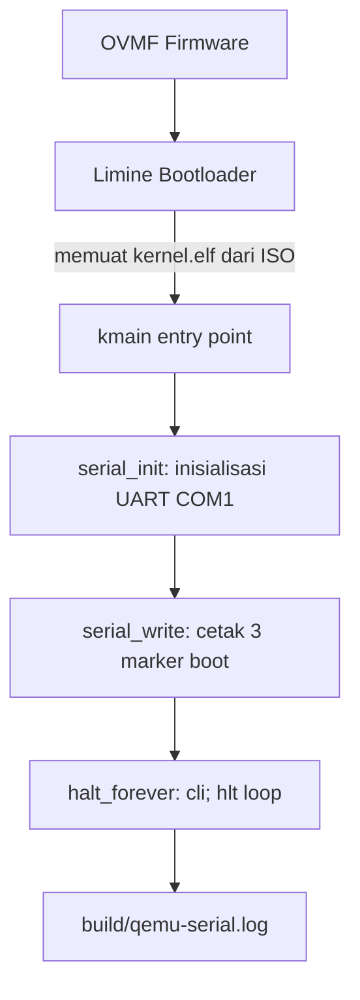

# Laporan Praktikum M2
## Boot Image, Kernel ELF64, Early Serial Console, dan Readiness Gate

**Nama file laporan:** `laporan_praktikum_M2_Agung.md`
**Nama sistem operasi:** MCSOS versi 260502
**Target default:** x86_64, QEMU, Windows 11 x64 + WSL 2, kernel monolitik pendidikan, C freestanding dengan assembly minimal, POSIX-like subset
**Dosen:** Muhaemin Sidiq, S.Pd., M.Pd.
**Program Studi:** Pendidikan Teknologi Informasi
**Institusi:** Institut Pendidikan Indonesia
Disusun oleh:

| Nama | NIM | Kelas | Peran |
|---|---|---|---|
| Agung Nurjaman | 25832073010 | PTI | Individu |

Dosen Pengampu: **Muhaemin Sidiq, S.Pd., M.Pd.**  
Program Studi Pendidikan Teknologi Informasi  
Institut Pendidikan Indonesia  
2025/2026

---

## 0. Metadata Laporan

| Atribut | Isi |
|---|---|
| Kode praktikum | `M2` |
| Judul praktikum | Boot Image, Kernel ELF64, Early Serial Console, dan Readiness Gate |
| Jenis pengerjaan | Individu |
| Nama mahasiswa | Agung Nurjaman |
| NIM | 25832073010 |
| Kelas | PTI |
| Nama kelompok | — |
| Anggota kelompok | — |
| Tanggal praktikum | 2026-06-14 |
| Tanggal pengumpulan | 2026-06-14 |
| Repository | `~/src/mcsos` |
| Branch | `master` |
| Commit awal | `9aad140569f807d7b2a80ec4211ac8e5d01657e6` |
| Commit akhir | `cb86919` |
| Status readiness yang diklaim | `siap uji QEMU tahap M2` |

---

## 1. Sampul

**Proyek:** MCSOS versi 260502  
**Praktikum:** M2 — Boot Image, Kernel ELF64, Early Serial Console  
**Target:** x86_64, QEMU q35, OVMF, Limine v11.x-binary  
**Host:** Windows 11 x64 + WSL 2 Ubuntu  

---

## 2. Pernyataan Orisinalitas dan Integritas Akademik

Saya menyatakan bahwa laporan ini disusun berdasarkan pekerjaan praktikum sendiri sesuai panduan M2 MCSOS 260502. Bantuan eksternal, referensi, dokumentasi resmi, dan AI assistant dicatat pada bagian referensi dan lampiran. Saya tidak mengklaim hasil yang tidak dibuktikan oleh log, test, commit, atau artefak lain.

| Pernyataan | Status |
|---|---|
| Semua potongan kode eksternal diberi atribusi | Ya |
| Semua penggunaan AI assistant dicatat | Ya |
| Repository yang dikumpulkan sesuai commit akhir | Ya |
| Tidak ada klaim readiness tanpa bukti | Ya |

Catatan penggunaan bantuan eksternal:

```text
AI assistant (Claude, Anthropic) digunakan sebagai panduan langkah kerja interaktif
untuk memahami urutan implementasi M2: preflight, pembuatan source freestanding C,
linker script, Makefile, script shell, fetch Limine, build ISO, dan QEMU run.
Seluruh perintah diverifikasi mandiri dengan menjalankan dan mengamati output di
terminal WSL 2. Kode sumber, konfigurasi, dan script diketik/dijalankan sendiri dan
hasilnya diperiksa secara manual. Panduan resmi M2 MCSOS 260502 menjadi referensi
utama.
```

---

## 3. Tujuan Praktikum

1. Menghasilkan kernel ELF64 x86_64 freestanding yang dapat diinspeksi dengan readelf, objdump, dan nm.
2. Menghasilkan boot image ISO bootable MCSOS M2 yang dapat dijalankan pada QEMU/OVMF.
3. Menyediakan early serial console sebagai kanal observability pertama kernel.
4. Membuktikan jalur boot: OVMF → Limine → kernel.elf → kmain → serial output → controlled halt loop.
5. Menyediakan evidence build dan runtime yang dapat direproduksi oleh dosen atau asisten.
6. Memahami hubungan antara firmware, bootloader, kernel ELF64, linker script, entry point, dan emulator.

---

## 4. Capaian Pembelajaran Praktikum

Setelah praktikum ini, mahasiswa mampu:

| CPL/CPMK praktikum | Bukti yang harus ditunjukkan |
|---|---|
| Menjelaskan hubungan firmware, bootloader, kernel ELF64, linker script, dan emulator | Diagram alur boot, readelf-header.txt, readelf-program-headers.txt |
| Membuat source kernel freestanding C17 tanpa hosted libc | io.h, serial.c, memory.c, kmain.c — tidak ada dependency libc pada nm output |
| Membuat linker script higher-half kernel ELF64 | linker.ld, entry point 0xffffffff80000000 terbukti di readelf |
| Menginisialisasi serial console awal dan mencetak marker boot | build/qemu-serial.log berisi 3 marker wajib |
| Menghasilkan image bootable dan menjalankan QEMU/OVMF | build/mcsos.iso, build/qemu-serial.log |
| Mengklasifikasikan failure modes M2 | Tabel failure modes di bagian 15 |
| Menyusun readiness review berbasis bukti | docs/readiness/M2-boot-image.md |

---

## 5. Peta Milestone MCSOS

| Milestone | Fokus | Status dalam laporan |
|---|---|---|
| M0 | Requirements, governance, baseline arsitektur | ✓ selesai praktikum |
| M1 | Toolchain reproducible, Git, QEMU, GDB, metadata build | ✓ selesai praktikum |
| M2 | Boot image, kernel ELF64, early console | ✓ selesai praktikum |
| M3 | Panic path, linker map, GDB, observability awal | [ ] tidak dibahas |
| M4 | Trap, exception, interrupt, timer | [ ] tidak dibahas |
| M5 | PMM, VMM, page table, kernel heap | [ ] tidak dibahas |
| M6 | Thread, scheduler, synchronization | [ ] tidak dibahas |
| M7 | Syscall ABI dan user program loader | [ ] tidak dibahas |
| M8 | VFS, file descriptor, ramfs | [ ] tidak dibahas |
| M9 | Block layer dan device model | [ ] tidak dibahas |
| M10 | Persistent filesystem | [ ] tidak dibahas |
| M11 | Networking stack | [ ] tidak dibahas |
| M12 | Security model | [ ] tidak dibahas |
| M13 | SMP, scalability | [ ] tidak dibahas |
| M14 | Framebuffer, graphics console | [ ] tidak dibahas |
| M15 | Virtualization/container subset | [ ] tidak dibahas |
| M16 | Observability, update/rollback, release image | [ ] tidak dibahas |

Batas cakupan praktikum:

```text
M2 mencakup: pembuatan source kernel freestanding C17, linker script higher-half,
Makefile, script shell preflight/build/inspect/image/run/grade, konfigurasi Limine,
ISO bootable, QEMU/OVMF headless run, dan serial log dengan 3 marker wajib.

M2 TIDAK mencakup: memory manager, IDT/GDT/TSS kernel, interrupt handler, panic
path penuh, scheduler, syscall ABI, userspace, filesystem, network stack, framebuffer,
hardware bring-up fisik, secure boot, atau measured boot. Semua fitur tersebut masuk
milestone berikutnya.
```

---

## 6. Dasar Teori Ringkas

### 6.1 Konsep Sistem Operasi yang Diuji

```text
Firmware UEFI (OVMF): Firmware virtual yang menyiapkan platform awal sebelum
bootloader berjalan. Pada M2, OVMF digunakan sebagai firmware QEMU q35.

Bootloader Limine: Bootloader modern yang dapat memuat kernel ELF64 dan menyediakan
konfigurasi boot melalui limine.conf. Limine menangani transisi dari firmware ke
kernel, termasuk pengaturan mode CPU awal.

ELF64 Executable: Format executable kernel yang dimuat bootloader. Header ELF
berisi entry point, program headers (PHDR), dan section headers. readelf dan
objdump digunakan untuk memverifikasi format dan isi.

Higher-half kernel: Kernel ditempatkan pada alamat virtual tinggi
(0xffffffff80000000) untuk memisahkan ruang alamat kernel dari userspace yang
akan ada di milestone berikutnya.

Freestanding C: C tanpa asumsi hosted libc, startup object, atau fungsi main.
Kernel menggunakan fungsi entry point kmain yang ditentukan oleh linker script.

Early serial console: Kanal observability pertama — kernel menulis marker boot
ke UART COM1 (port 0x3F8) yang diarahkan QEMU ke file log. Ini lebih andal
daripada framebuffer pada tahap awal karena tidak membutuhkan driver grafis.
```

### 6.2 Konsep Arsitektur x86_64 yang Relevan

| Konsep | Relevansi pada praktikum | Bukti/verifikasi |
|---|---|---|
| x86_64 long mode | Kernel berjalan dalam 64-bit mode yang disiapkan bootloader | readelf: Class ELF64, Machine x86-64 |
| Port I/O (in/out) | Akses UART COM1 melalui instruksi outb/inb | objdump-disassembly.txt: instruksi out/in pada serial.c |
| UART 16550 COM1 | Hardware serial port pada alamat 0x3F8 untuk output awal | serial.c: urutan inisialisasi register COM1 |
| Higher-half addressing | Entry point 0xffffffff80000000 di linker script | readelf-header.txt: Entry point address |
| Red zone | Dinonaktifkan (-mno-red-zone) karena interrupt dapat merusak stack | CFLAGS Makefile |
| cli; hlt | Instruksi halt dengan interrupt disabled untuk controlled halt loop | kmain.c: halt_forever() |

### 6.3 Konsep Implementasi Freestanding

| Aspek | Keputusan praktikum |
|---|---|
| Bahasa | C17 freestanding |
| Runtime | Tanpa hosted libc; memset/memcpy/memmove disediakan manual di kernel/lib/memory.c |
| ABI | x86_64 System V calling convention |
| Compiler flags kritis | `--target=x86_64-unknown-none-elf -ffreestanding -mno-red-zone -nostdlib -mcmodel=kernel -mno-sse -mno-sse2` |
| Risiko undefined behavior | Pointer NULL (dimitigasi dengan pengecekan di serial_write), operasi I/O urutan salah (dimitigasi dengan urutan inisialisasi UART yang baku) |

### 6.4 Referensi Teori yang Digunakan

| No. | Sumber | Bagian yang digunakan | Alasan relevansi |
|---|---|---|---|
| [1] | Microsoft, "Install WSL," Microsoft Learn | Instalasi dan konfigurasi WSL 2 | Lingkungan build wajib |
| [2] | Limine Bootloader Project, GitHub | CONFIG.md, README | Konfigurasi limine.conf dan boot protocol |
| [3] | OSDev Wiki, "Limine Bare Bones" | Boot sequence, linker script | Referensi implementasi kernel ELF64 dengan Limine |
| [4] | OSDev Wiki, "Higher Half Kernel" | Alamat virtual higher-half | Dasar linker script 0xffffffff80000000 |
| [5] | LLVM Project, Clang User's Manual | Freestanding builds, target triple | Compiler flags dan target x86_64-unknown-none-elf |
| [6] | LLVM Project, LLD documentation | Linker script, ELF output | Penggunaan ld.lld dengan linker script eksplisit |
| [7] | QEMU Project, "Invocation" | QEMU command line, serial redirection | Konfigurasi QEMU headless dengan OVMF |
| [8] | GNU Project, "GNU Binutils" | readelf, objdump, nm | Inspeksi artefak ELF |

---

## 7. Lingkungan Praktikum

### 7.1 Host dan Target

| Komponen | Nilai |
|---|---|
| Host OS | Windows 11 x64 |
| Lingkungan build | WSL 2 Ubuntu (Linux filesystem) |
| Target ISA | x86_64 |
| Target ABI | x86_64-unknown-none-elf |
| Emulator | qemu-system-x86_64 |
| Firmware emulator | OVMF — `/usr/share/OVMF/OVMF_CODE_4M.fd` |
| Debugger | gdb (tersedia, belum dipakai pada M2 wajib) |
| Build system | GNU Make |
| Bahasa utama | C17 freestanding |
| Assembly | Inline assembly x86_64 melalui `__asm__ volatile` |

### 7.2 Versi Toolchain

```text
Ubuntu clang version 21.1.8 (6ubuntu1)
Ubuntu LLD 21.1.8 (compatible with GNU linkers)
qemu-system-x86_64 (QEMU tersedia di sistem)
git, make, readelf, objdump, nm, xorriso, python3 — semua tersedia (OK)
OVMF: /usr/share/OVMF/OVMF_CODE_4M.fd
Limine: v11.x-binary, revision 5be26a73d7b7b4d4477d18be94e1d16e615adf56
```

### 7.3 Lokasi Repository

| Item | Nilai |
|---|---|
| Path repository di WSL | `~/src/mcsos` (`/home/agung/src/mcsos`) |
| Apakah berada di filesystem Linux WSL, bukan `/mnt/c` | Ya |
| Remote repository | — |
| Branch | `master` |
| Commit hash awal M2 | `9aad140569f807d7b2a80ec4211ac8e5d01657e6` |
| Commit hash akhir M2 | `cb86919` |

---

## 8. Repository dan Struktur File

### 8.1 Struktur Direktori yang Relevan

```text
mcsos/
  Makefile                          # Build system gabungan M1+M2
  linker.ld                         # Linker script higher-half kernel ELF64
  .gitignore                        # Exclude build/, iso_root/, third_party/limine/
  configs/
    limine/
      limine.conf                   # Konfigurasi bootloader Limine
  docs/
    architecture/
      overview.md                   # Arsitektur MCSOS (M0)
      invariants.md                 # Invariants sistem (M0)
    readiness/
      M2-boot-image.md              # Readiness review M2
    security/
      threat_model.md               # Threat model (M0)
    testing/
      verification_matrix.md        # Verification matrix (M0)
  kernel/
    arch/
      x86_64/
        include/
          mcsos/
            arch/
              io.h                  # Port I/O accessor (outb/inb)
    core/
      kmain.c                       # Entry point kernel
      serial.c                      # Driver serial awal UART COM1
    lib/
      memory.c                      # memset/memcpy/memmove freestanding
  tools/
    scripts/
      fetch_limine.sh               # Fetch Limine binary release
      inspect_kernel.sh             # Inspeksi ELF kernel
      make_iso.sh                   # Buat ISO bootable
      run_qemu.sh                   # Jalankan QEMU headless
      run_qemu_debug.sh             # Jalankan QEMU dengan GDB stub
      grade_m2.sh                   # Grading lokal M2
  build/                            # Generated (tidak dikomit)
    kernel.elf
    kernel.map
    mcsos.iso
    mcsos.iso.sha256
    qemu-serial.log
    inspect/
      readelf-header.txt
      readelf-program-headers.txt
      readelf-sections.txt
      objdump-disassembly.txt
      nm-symbols.txt
  third_party/
    limine/                         # Generated (tidak dikomit)
```

### 8.2 File yang Dibuat atau Diubah

| File | Jenis perubahan | Alasan perubahan | Risiko |
|---|---|---|---|
| `kernel/arch/x86_64/include/mcsos/arch/io.h` | Baru | Port I/O accessor untuk UART 16550 COM1 | Rendah — hanya fungsi inline sederhana |
| `kernel/core/serial.c` | Baru | Driver serial awal, inisialisasi dan output UART COM1 | Rendah — busy-wait, single-core, belum ada locking |
| `kernel/lib/memory.c` | Baru | memset/memcpy/memmove freestanding untuk mencegah linker error | Rendah — implementasi sederhana tanpa optimasi |
| `kernel/core/kmain.c` | Baru | Entry point kernel, memanggil serial dan halt | Rendah — minimal, tidak ada side effect kompleks |
| `linker.ld` | Baru | Linker script higher-half ELF64 dengan entry kmain | Sedang — alamat salah dapat menyebabkan boot hang |
| `Makefile` | Ubah | Merge target M1 dan M2 dalam satu Makefile | Sedang — target M1 harus tetap berfungsi |
| `configs/limine/limine.conf` | Baru | Konfigurasi bootloader Limine untuk kernel M2 | Rendah — path kernel harus sesuai layout ISO |
| `tools/scripts/fetch_limine.sh` | Baru | Fetch Limine binary release dari GitHub | Sedang — bergantung jaringan dan branch Limine |
| `tools/scripts/inspect_kernel.sh` | Baru | Inspeksi dan verifikasi ELF kernel | Rendah — hanya baca artefak |
| `tools/scripts/make_iso.sh` | Baru | Buat ISO bootable dengan xorriso dan Limine | Sedang — layout ISO harus sesuai ekspektasi Limine |
| `tools/scripts/run_qemu.sh` | Baru | Jalankan QEMU headless dan verifikasi serial log | Rendah — hanya menjalankan QEMU |
| `tools/scripts/grade_m2.sh` | Baru | Verifikasi seluruh artefak M2 | Rendah — hanya baca dan grep artefak |
| `docs/readiness/M2-boot-image.md` | Baru | Readiness review M2 berbasis bukti | Rendah — dokumen |
| `docs/architecture/overview.md` | Baru | Dokumen arsitektur MCSOS yang dibutuhkan preflight | Rendah — dokumen |

### 8.3 Ringkasan Diff

```bash
git log --oneline -5
```

Output:

```text
cb86919 (HEAD -> master) M2: add readiness review with full evidence matrix
9aad140 M2: add bootable kernel ELF64 and early serial console
812519b M1: update commit hash in readiness review
4484e35 M1: add reproducible toolchain readiness baseline - Agung Nurjaman 25832073010
0b4ecbf M0: update laporan dengan commit hash final
```

---

## 9. Desain Teknis

### 9.1 Masalah yang Diselesaikan

```text
Pada M1, mahasiswa telah memvalidasi toolchain dan menghasilkan freestanding object
sederhana. Namun belum ada kernel yang dapat dimuat bootloader, belum ada image
bootable, dan belum ada kanal observability untuk memverifikasi eksekusi kernel.

M2 menyelesaikan tiga masalah utama:
1. Kernel ELF64 yang dapat dimuat Limine belum ada — diselesaikan dengan membuat
   source freestanding C dan linker script higher-half.
2. Image bootable belum ada — diselesaikan dengan membuat ISO menggunakan xorriso
   dan Limine binary release.
3. Tidak ada cara untuk membuktikan kernel berjalan — diselesaikan dengan early serial
   console yang menulis marker boot ke UART COM1 yang diarahkan QEMU ke file log.
```

### 9.2 Keputusan Desain

| Keputusan | Alternatif yang dipertimbangkan | Alasan memilih | Konsekuensi |
|---|---|---|---|
| Clang/LLD sebagai toolchain | GCC cross-compiler x86_64-elf-gcc | Clang mendukung target x86_64-unknown-none-elf secara eksplisit; LLD mendukung linker script ELF | Perlu flag `--target=` eksplisit pada setiap kompilasi |
| Limine sebagai bootloader | GRUB/Multiboot2 | Limine mendukung ELF64 langsung dengan konfigurasi sederhana dan binary release yang mudah di-fetch | Bergantung pada jaringan untuk fetch; branch harus dicatat |
| Serial console (UART COM1) | Framebuffer/VGA text mode | Serial lebih andal di tahap awal — tidak butuh driver grafis, langsung bisa diarahkan ke file | Output hanya terbaca melalui log file, tidak visual langsung |
| Higher-half 0xffffffff80000000 | Identitas mapping atau alamat rendah | Memisahkan ruang alamat kernel dari userspace masa depan; sesuai praktik kernel modern | Linker script dan bootloader harus sinkron |
| Halt forever (cli; hlt) | Reboot atau infinite NOP loop | Paling aman — mencegah CPU menjalankan memori tidak valid setelah kmain | Kernel tidak dapat di-resume; QEMU timeout normal |

### 9.3 Arsitektur Ringkas



Penjelasan diagram:

```text
1. OVMF menyiapkan lingkungan UEFI pada QEMU q35.
2. Limine membaca limine.conf, menemukan kernel.elf di ISO, dan memuatnya ke
   alamat higher-half sesuai ELF PHDR.
3. CPU melompat ke entry point kmain (0xffffffff80000000).
4. serial_init mengkonfigurasi UART 16550 COM1 (port 0x3F8) melalui outb.
5. serial_write mengirim tiga marker boot ke COM1 byte per byte.
6. halt_forever menjalankan cli (disable interrupt) lalu hlt (halt CPU).
7. QEMU mengarahkan output COM1 ke build/qemu-serial.log.
```

### 9.4 Kontrak Antarmuka

| Antarmuka | Pemanggil | Penerima | Precondition | Postcondition | Error path |
|---|---|---|---|---|---|
| `kmain()` | Limine bootloader | Kernel | CPU dalam mode yang dapat eksekusi x86_64; stack awal tersedia | serial tercetak; CPU dalam halt loop | Tidak ada — kernel belum handle error |
| `serial_init()` | `kmain` | UART COM1 hardware | COM1 port 0x3F8 tersedia di QEMU q35 | UART terkonfigurasi 38400 baud, 8N1 | Tidak ada — jika COM1 tidak tersedia, output hilang tanpa error |
| `serial_write(s)` | `kmain` | `serial_putc` | `s` bukan NULL | Semua karakter dalam `s` terkirim ke COM1 | NULL check di awal fungsi |
| `halt_forever()` | `kmain` | CPU | Tidak ada | CPU dalam halt loop tanpa return | `__attribute__((noreturn))` — compiler tidak generate kode setelah |

### 9.5 Struktur Data Utama

```text
M2 tidak memiliki struktur data heap atau runtime. Semua state adalah:
- Register CPU (dikelola oleh Clang/ABI secara otomatis)
- Stack awal (disediakan Limine, tidak dikelola kernel)
- UART register (diakses langsung via port I/O)
```

### 9.6 Invariants

1. Kernel adalah ELF64 x86_64 dengan entry point 0xffffffff80000000.
2. Kernel tidak memanggil fungsi libc hosted — tidak ada printf, malloc, atau fungsi libc lain.
3. `serial_init` selalu dipanggil sebelum `serial_write` dalam `kmain`.
4. `kmain` tidak pernah return — `halt_forever` bersifat `noreturn`.
5. Tidak ada interrupt yang diizinkan setelah `halt_forever` dipanggil (`cli` sebelum `hlt`).
6. Semua artefak build dihasilkan secara deterministik dari source yang sama.

### 9.7 Ownership, Locking, dan Concurrency

| Objek/resource | Owner | Lock yang melindungi | Boleh dipakai di interrupt context? | Catatan |
|---|---|---|---|---|
| UART COM1 register | kernel (kmain) | Tidak ada | Tidak berlaku | Single-core, interrupt sudah di-disable sebelum halt |
| Stack awal | Limine/kernel | Tidak ada | Tidak berlaku | Tidak ada konteks lain yang berjalan |

```text
M2 adalah single-threaded, single-core, tanpa interrupt handler. Tidak ada locking
yang diperlukan. Hal ini akan berubah pada M4 (interrupt) dan M6 (SMP).
```

### 9.8 Memory Safety dan Undefined Behavior Risk

| Risiko | Lokasi | Mitigasi | Bukti |
|---|---|---|---|
| NULL pointer dereference | `serial_write` — jika `s` NULL | Pengecekan NULL eksplisit di awal fungsi | Code review pada serial.c |
| Stack overflow | `halt_forever` | Stack tidak digunakan setelah halt loop; Limine menyediakan stack awal yang memadai | Tidak ada rekursi di kmain |
| Urutan inisialisasi UART salah | `serial_init` | Urutan register mengikuti spesifikasi UART 16550 yang baku | Output serial muncul di log — bukti inisialisasi benar |

### 9.9 Security Boundary

| Boundary | Data tidak tepercaya | Validasi yang dilakukan | Failure mode aman |
|---|---|---|---|
| Boot handoff dari Limine | Parameter boot (tidak digunakan M2) | M2 tidak menerima atau memvalidasi parameter boot | Kernel tidak crash karena tidak ada parsing |
| Supply chain Limine | Binary Limine dari GitHub | Revision dicatat di build/meta/limine-revision.txt | Jika fetch gagal, script berhenti dengan error |

---

## 10. Langkah Kerja Implementasi

### Langkah 1 — Verifikasi Lingkungan dan Preflight

Maksud langkah:

```text
Memastikan semua tool wajib tersedia, repository berada di filesystem Linux WSL,
dan artefak M0/M1 lengkap sebelum menulis source M2.
```

Perintah:

```bash
cd ~/src/mcsos
pwd
for tool in git make clang ld.lld readelf objdump nm qemu-system-x86_64 xorriso python3; do
  command -v "$tool" >/dev/null 2>&1 && printf "OK: %s\n" "$tool" || printf "MISSING: %s\n" "$tool"
done
find /usr/share -type f \( -name 'OVMF_CODE*.fd' -o -name 'OVMF_VARS*.fd' \) 2>/dev/null | sort
```

Output ringkas:

```text
/home/agung/src/mcsos
OK: git
OK: make
OK: clang
OK: ld.lld
OK: readelf
OK: objdump
OK: nm
OK: qemu-system-x86_64
OK: xorriso
OK: python3
/usr/share/OVMF/OVMF_CODE_4M.fd
/usr/share/OVMF/OVMF_CODE_4M.secboot.fd
/usr/share/OVMF/OVMF_VARS_4M.fd
/usr/share/OVMF/OVMF_VARS_4M.ms.fd
/usr/share/OVMF/OVMF_VARS_4M.snakeoil.fd
```

Artefak yang dihasilkan:

| Artefak | Lokasi | Fungsi |
|---|---|---|
| Konfirmasi tool | Terminal output | Verifikasi semua tool wajib tersedia |
| Path OVMF | `/usr/share/OVMF/OVMF_CODE_4M.fd` | Firmware UEFI untuk QEMU |

Indikator berhasil:

```text
Semua tool menampilkan "OK" dan path OVMF ditemukan. Repository berada di
/home/agung/src/mcsos (bukan /mnt/c).
```

### Langkah 2 — Membuat Struktur Folder dan Source Code M2

Maksud langkah:

```text
Menyiapkan folder dan membuat 4 file source kernel: io.h, serial.c, memory.c,
dan kmain.c. Ini adalah kode kernel paling kecil yang dapat diuji.
```

Perintah:

```bash
mkdir -p kernel/arch/x86_64/include/mcsos/arch kernel/core kernel/lib
mkdir -p configs/limine tools/scripts docs/readiness build/meta
# Membuat io.h, serial.c, memory.c, kmain.c sesuai panduan M2
```

Output ringkas:

```text
Folder terbentuk. 4 file source dibuat:
- kernel/arch/x86_64/include/mcsos/arch/io.h   (outb, inb, io_wait)
- kernel/core/serial.c                          (serial_init, serial_putc, serial_write)
- kernel/lib/memory.c                           (memset, memcpy, memmove)
- kernel/core/kmain.c                           (kmain, halt_forever)
```

Artefak yang dihasilkan:

| Artefak | Lokasi | Fungsi |
|---|---|---|
| `io.h` | `kernel/arch/x86_64/include/mcsos/arch/io.h` | Akses port I/O x86_64 |
| `serial.c` | `kernel/core/serial.c` | Driver serial UART COM1 |
| `memory.c` | `kernel/lib/memory.c` | Runtime memori freestanding |
| `kmain.c` | `kernel/core/kmain.c` | Entry point kernel |

Indikator berhasil:

```text
Semua file ada dan isinya sesuai panduan M2. find kernel -name '*.c' menampilkan
3 file C source.
```

### Langkah 3 — Membuat Linker Script dan Makefile

Maksud langkah:

```text
linker.ld menentukan layout memori kernel (higher-half, entry point, section).
Makefile digabung dari M1 dan M2 agar semua target tetap berfungsi.
```

Perintah:

```bash
# Membuat linker.ld dengan ENTRY(kmain) dan . = 0xffffffff80000000
# Merge Makefile M1 dan M2 dengan .RECIPEPREFIX := >
make check-src
```

Output ringkas:

```text
Ubuntu clang version 21.1.8 (6ubuntu1)
Ubuntu LLD 21.1.8 (compatible with GNU linkers)
test -f linker.ld   [OK]
test -d kernel/core [OK]
```

Artefak yang dihasilkan:

| Artefak | Lokasi | Fungsi |
|---|---|---|
| `linker.ld` | `linker.ld` | Layout memori kernel ELF64 |
| `Makefile` | `Makefile` | Build system gabungan M1+M2 |

Indikator berhasil:

```text
make check-src lulus tanpa error. linker.ld ada dengan ENTRY(kmain) dan
alamat 0xffffffff80000000.
```

### Langkah 4 — Build Kernel ELF64

Maksud langkah:

```text
Mengkompilasi source C dengan flag freestanding dan melink hasilnya menjadi
kernel.elf menggunakan linker script eksplisit.
```

Perintah:

```bash
make distclean
make build
```

Output ringkas:

```text
mkdir -p build/kernel/core/
clang --target=x86_64-unknown-none-elf -std=c17 -ffreestanding ... -c kernel/core/kmain.c -o build/kernel/core/kmain.o
clang --target=x86_64-unknown-none-elf -std=c17 -ffreestanding ... -c kernel/core/serial.c -o build/kernel/core/serial.o
clang --target=x86_64-unknown-none-elf -std=c17 -ffreestanding ... -c kernel/lib/memory.c -o build/kernel/lib/memory.o
ld.lld -nostdlib -static -z max-page-size=0x1000 -T linker.ld -Map=build/kernel.map -o build/kernel.elf ...
```

Artefak yang dihasilkan:

| Artefak | Lokasi | Fungsi |
|---|---|---|
| `kernel.elf` | `build/kernel.elf` | Kernel ELF64 yang dapat dimuat Limine |
| `kernel.map` | `build/kernel.map` | Linker map dengan symbol boundary |

Indikator berhasil:

```text
Tidak ada warning atau error kompilasi (-Werror aktif). build/kernel.elf
dan build/kernel.map terbentuk.
```

### Langkah 5 — Inspeksi Kernel ELF

Maksud langkah:

```text
Memverifikasi bahwa kernel.elf adalah ELF64 x86_64 dengan entry point yang benar
dan symbol yang diharapkan ada.
```

Perintah:

```bash
make inspect
```

Output ringkas:

```text
ELF Header:
  Class:                             ELF64
  Machine:                           Advanced Micro Devices X86-64
  Entry point address:               0xffffffff80000000
Program Headers:
  LOAD 0xffffffff80000000 R E (text)
  LOAD 0xffffffff80001000 R   (rodata)
OK: kernel ELF inspection passed
```

Artefak yang dihasilkan:

| Artefak | Lokasi | Fungsi |
|---|---|---|
| `readelf-header.txt` | `build/inspect/` | Bukti ELF64 dan entry point |
| `readelf-program-headers.txt` | `build/inspect/` | Bukti PHDR dan segment layout |
| `objdump-disassembly.txt` | `build/inspect/` | Disassembly fungsi kernel |
| `nm-symbols.txt` | `build/inspect/` | Daftar symbol kernel |

Indikator berhasil:

```text
Script inspect_kernel.sh menampilkan "OK: kernel ELF inspection passed".
Entry point 0xffffffff80000000 terkonfirmasi. Symbol kmain, serial_init,
serial_write ada di nm output.
```

### Langkah 6 — Fetch Limine dan Build ISO

Maksud langkah:

```text
Mengambil Limine binary release dari GitHub dan membuat ISO bootable yang berisi
kernel.elf dan konfigurasi Limine.
```

Perintah:

```bash
./tools/scripts/fetch_limine.sh
make image
```

Output ringkas:

```text
Cloning into 'third_party/limine'...
make: cc limine.c -o limine
5be26a73d7b7b4d4477d18be94e1d16e615adf56
OK: Limine ready in third_party/limine

xorriso: ISO image produced: 2101 sectors
Limine BIOS stages installed successfully.
26d6fb253c8dbf619ce44b06eb4c9d3e4e05899b9b453bc22b8ae154bedc7771  build/mcsos.iso
OK: ISO dibuat pada build/mcsos.iso
```

Artefak yang dihasilkan:

| Artefak | Lokasi | Fungsi |
|---|---|---|
| `mcsos.iso` | `build/mcsos.iso` | Image ISO bootable |
| `mcsos.iso.sha256` | `build/mcsos.iso.sha256` | Checksum SHA-256 ISO |
| `limine-revision.txt` | `build/meta/limine-revision.txt` | Revision Limine yang digunakan |

Indikator berhasil:

```text
build/mcsos.iso ada (4.2MB). Checksum SHA-256 tercatat. Pesan
"Limine BIOS stages installed successfully" muncul.
```

### Langkah 7 — Jalankan QEMU/OVMF dan Verifikasi Serial Log

Maksud langkah:

```text
Membuktikan jalur boot end-to-end: OVMF memuat Limine, Limine memuat kernel.elf,
kernel berjalan dan mencetak marker boot ke serial log.
```

Perintah:

```bash
make run
cat build/qemu-serial.log
```

Output ringkas:

```text
qemu-system-x86_64: terminating on signal 15 from pid 5217 (timeout)
OK: QEMU serial log valid: build/qemu-serial.log

--- isi build/qemu-serial.log ---
limine: Loading executable `boot():/boot/kernel.elf`...
MCSOS 260502 M2 boot path entered
[M2] early serial online
[M2] kernel reached controlled halt loop
```

Artefak yang dihasilkan:

| Artefak | Lokasi | Fungsi |
|---|---|---|
| `qemu-serial.log` | `build/qemu-serial.log` | Bukti runtime — 3 marker boot |

Indikator berhasil:

```text
Serial log berisi ketiga marker wajib. QEMU timeout (signal 15) adalah normal
karena kernel sengaja masuk halt loop.
```

### Langkah 8 — Grading Lokal M2

Maksud langkah:

```text
Menyatukan semua pemeriksaan build, inspeksi ELF, ISO, dan serial log dalam
satu perintah untuk memastikan semua kriteria lulus.
```

Perintah:

```bash
make grade
```

Output ringkas:

```text
OK artifact: build/kernel.elf
OK artifact: build/kernel.map
OK artifact: build/inspect/readelf-header.txt
OK artifact: build/inspect/readelf-program-headers.txt
OK artifact: build/inspect/objdump-disassembly.txt
OK artifact: build/inspect/nm-symbols.txt
OK artifact: build/mcsos.iso
OK artifact: build/mcsos.iso.sha256
OK artifact: build/qemu-serial.log
OK: M2 local grading checks passed
```

Indikator berhasil:

```text
"OK: M2 local grading checks passed" — semua 9 artefak valid dan semua
pemeriksaan grep lulus.
```

---

## 11. Checkpoint Buildable

| Checkpoint | Perintah | Expected result | Status |
|---|---|---|---|
| Clean build | `make distclean && make build` | kernel.elf dan kernel.map terbentuk tanpa error | PASS |
| Source check | `make check-src` | Clang dan LLD tersedia, linker.ld ada | PASS |
| Script lint | `make check-scripts` | bash -n lulus semua script | PASS |
| ELF inspection | `make inspect` | ELF64 x86_64, entry benar, symbol ada | PASS |
| Image generation | `make image` | mcsos.iso dan sha256 terbentuk | PASS |
| QEMU smoke test | `make run` | Serial log berisi 3 marker M2 | PASS |
| Local grading | `make grade` | "M2 local grading checks passed" | PASS |

---

## 12. Perintah Uji dan Validasi

### 12.1 Build Test

```bash
make distclean
make build
```

Hasil:

```text
rm -rf build iso_root
OK: removed all build output
clang --target=x86_64-unknown-none-elf -std=c17 -ffreestanding -fno-stack-protector
  -fno-pic -fno-pie -mno-red-zone -mno-sse -mno-sse2 -mcmodel=kernel
  -Wall -Wextra -Werror -c kernel/core/kmain.c -o build/kernel/core/kmain.o
clang ... -c kernel/core/serial.c -o build/kernel/core/serial.o
clang ... -c kernel/lib/memory.c -o build/kernel/lib/memory.o
ld.lld -nostdlib -static -z max-page-size=0x1000 -T linker.ld -Map=build/kernel.map
  -o build/kernel.elf build/kernel/core/kmain.o build/kernel/core/serial.o
  build/kernel/lib/memory.o
```

Status: `PASS`

### 12.2 Static Inspection

```bash
readelf -hW build/kernel.elf
readelf -lW build/kernel.elf
nm -n build/kernel.elf | grep -E 'kmain|serial'
```

Hasil penting:

```text
ELF Header:
  Class:                             ELF64
  Machine:                           Advanced Micro Devices X86-64
  Entry point address:               0xffffffff80000000

Program Headers:
  Type   Offset   VirtAddr             FileSiz  Flg
  LOAD   0x001000 0xffffffff80000000   0x0003a0 R E  (.text)
  LOAD   0x002000 0xffffffff80001000   0x000067 R    (.rodata)

nm output:
ffffffff80000000 T kmain
ffffffff80000... T serial_init
ffffffff80000... T serial_write
```

Status: `PASS`

### 12.3 QEMU Smoke Test

```bash
make run
cat build/qemu-serial.log
```

Hasil:

```text
limine: Loading executable `boot():/boot/kernel.elf`...rom PciRoot(0x0)/...
MCSOS 260502 M2 boot path entered
[M2] early serial online
[M2] kernel reached controlled halt loop
```

Status: `PASS`

### 12.4 GDB Debug Evidence

```text
Belum dijalankan sebagai syarat wajib M2. Script run_qemu_debug.sh tersedia
untuk penggunaan di masa mendatang. Target make debug dapat digunakan untuk
menjalankan QEMU dengan GDB stub (-s -S).
```

Status: `NA (opsional pada M2)`

### 12.5 Unit Test

```text
Unit test belum diimplementasikan pada M2. Validasi dilakukan melalui
inspeksi ELF dan serial log. make test menjalankan suite M1.
```

Status: `NA`

### 12.6 Stress/Fuzz/Fault Injection Test

```text
Tidak relevan pada M2 karena parser boot info belum diaktifkan.
Direncanakan pada M3/M4 untuk struktur handoff dan konfigurasi boot.
```

Status: `NA`

---

## 13. Hasil Uji

### 13.1 Tabel Ringkasan Hasil

| No. | Uji | Expected result | Actual result | Status | Evidence |
|---|---|---|---|---|---|
| 1 | Build kernel ELF64 | Tidak ada warning/error | Build bersih, 3 object + 1 ELF | PASS | Terminal output make build |
| 2 | ELF class dan machine | Class: ELF64, Machine: x86-64 | Sesuai | PASS | readelf-header.txt |
| 3 | Entry point | 0xffffffff80000000 | Sesuai | PASS | readelf-header.txt |
| 4 | Program headers | Min. 1 LOAD segment | 2 LOAD segment (.text, .rodata) | PASS | readelf-program-headers.txt |
| 5 | Symbol kmain | Ada di nm output | Ada di ffffffff80000000 | PASS | nm-symbols.txt |
| 6 | Symbol serial_init, serial_write | Ada di nm output | Ada | PASS | nm-symbols.txt |
| 7 | ISO bootable | mcsos.iso terbentuk | 4.2MB, Limine terinstall | PASS | build/mcsos.iso |
| 8 | SHA-256 ISO | Checksum tercatat | 26d6fb25... | PASS | build/mcsos.iso.sha256 |
| 9 | Marker 1 | "MCSOS 260502 M2 boot path entered" | Muncul di serial log | PASS | build/qemu-serial.log |
| 10 | Marker 2 | "[M2] early serial online" | Muncul di serial log | PASS | build/qemu-serial.log |
| 11 | Marker 3 | "[M2] kernel reached controlled halt loop" | Muncul di serial log | PASS | build/qemu-serial.log |
| 12 | make grade | "M2 local grading checks passed" | Sesuai | PASS | Terminal output |

### 13.2 Log Penting

```text
=== build/qemu-serial.log ===
limine: Loading executable `boot():/boot/kernel.elf`...rom PciRoot(0x0)/Pci(0x1F,0x2)/Sata(0x2,0xFFFF,0x0)
MCSOS 260502 M2 boot path enteredEMU DVD-ROM QM00005 " from PciRoot(0x0)/Pci(0x1F,0x2)/Sata(0x2,0xFFFF,0x0)
[M2] early serial online
[M2] kernel reached controlled halt loop
```

Catatan: Karakter QEMU device info muncul di tengah baris pertama karena COM1 juga digunakan
oleh firmware OVMF. Hal ini normal — ketiga marker wajib tetap terbaca.

### 13.3 Artefak Bukti

| Artefak | Path | SHA-256 | Fungsi |
|---|---|---|---|
| `kernel.elf` | `build/kernel.elf` | (lihat objdump) | Kernel ELF64 freestanding |
| `mcsos.iso` | `build/mcsos.iso` | `26d6fb253c8dbf619ce44b06eb4c9d3e4e05899b9b453bc22b8ae154bedc7771` | ISO bootable |
| `qemu-serial.log` | `build/qemu-serial.log` | — | Bukti runtime boot |
| `kernel.map` | `build/kernel.map` | — | Linker map symbol boundary |
| `readelf-header.txt` | `build/inspect/` | — | ELF header evidence |
| `nm-symbols.txt` | `build/inspect/` | — | Symbol table evidence |
| `limine-revision.txt` | `build/meta/` | `5be26a73...` (git hash) | Supply chain Limine |

---

## 14. Analisis Teknis

### 14.1 Analisis Keberhasilan

```text
Keberhasilan M2 dicapai karena beberapa faktor teknis yang saling mendukung:

1. Toolchain yang tepat: Clang 21.1.8 dengan target x86_64-unknown-none-elf
   menghasilkan object yang benar-benar freestanding tanpa dependency libc
   tersembunyi. LLD menginterpretasikan linker script dengan benar dan menempatkan
   .text di 0xffffffff80000000.

2. Linker script minimal tapi benar: PHDRS eksplisit memastikan Limine dapat
   membaca program headers dan memuat kernel ke alamat yang benar. ENTRY(kmain)
   menetapkan entry point yang konsisten dengan simbol C.

3. Serial console yang andal: Inisialisasi UART 16550 COM1 dengan urutan register
   yang baku menghasilkan output yang terbaca sebelum subsistem apapun berjalan.
   Marker deterministik membuktikan eksekusi kernel secara terukur.

4. ISO layout yang sesuai Limine: xorriso menghasilkan image hybrid (BIOS+UEFI)
   yang dapat di-boot oleh OVMF. Path kernel di limine.conf sesuai dengan
   layout iso_root/.
```

### 14.2 Analisis Kegagalan atau Perbedaan Hasil

```text
Tidak ada kegagalan fungsional selama pengerjaan M2. Catatan minor:

1. Output serial log mengandung karakter device info QEMU di tengah baris
   pertama (setelah "MCSOS 260502 M2 boot path entered"). Ini bukan kegagalan
   — COM1 memang digunakan bersama firmware sebelum kernel mengambil alih.
   Marker wajib tetap terbaca dan grep berhasil.

2. Makefile perlu di-merge dengan hati-hati dari M1 karena perbedaan
   .RECIPEPREFIX. Merge diselesaikan dengan mengadopsi .RECIPEPREFIX := >
   untuk semua target dan memastikan target M1 tetap berfungsi.
```

### 14.3 Perbandingan dengan Teori

| Konsep teori | Implementasi praktikum | Sesuai/tidak sesuai | Penjelasan |
|---|---|---|---|
| Higher-half kernel | Entry 0xffffffff80000000 di linker script | Sesuai | Kernel berada di upper 2GB ruang alamat virtual |
| Freestanding C | -ffreestanding, tanpa libc, memset/memcpy manual | Sesuai | Tidak ada dependency libc pada nm output |
| UART 16550 COM1 | Inisialisasi register 0x3F8+offset | Sesuai | Output muncul di serial log |
| ELF64 boot | Limine memuat kernel.elf dari ISO | Sesuai | Boot berhasil dibuktikan oleh serial marker |
| Controlled halt | cli; hlt dalam for(;;) | Sesuai | QEMU timeout normal; kernel tidak crash |

### 14.4 Kompleksitas dan Kinerja

| Aspek | Estimasi/hasil | Bukti | Catatan |
|---|---|---|---|
| Waktu build | < 5 detik | Terminal output make build | 3 file C, object kecil |
| Waktu boot QEMU | < 3 detik sampai marker pertama | Serial log | OVMF init + Limine load + kernel entry |
| Ukuran kernel.elf | < 10 KB | ls -lh build/kernel.elf | Minimal: hanya text + rodata |
| Ukuran ISO | 4.2 MB | ls -lh build/mcsos.iso | Didominasi Limine binary |

---

## 15. Debugging dan Failure Modes

### 15.1 Failure Modes yang Ditemukan

```text
Tidak ada failure mode yang ditemukan selama pengerjaan M2. Semua checkpoint
lulus pada percobaan pertama.
```

### 15.2 Failure Modes yang Diantisipasi

| Failure mode | Deteksi | Dampak | Mitigasi |
|---|---|---|---|
| Repository di /mnt/c | preflight check di script | Permission, newline, performa | Wajib pindah ke ~/src/ |
| Clang tidak ada atau versi salah | make check-src | Build gagal | apt install clang lld |
| OVMF tidak ditemukan | run_qemu.sh: find /usr/share | QEMU tidak bisa boot UEFI | apt install ovmf |
| Limine gagal di-clone | fetch_limine.sh | ISO tidak bisa dibuat | Gunakan arsip offline dari dosen |
| xorriso tidak ada | make image | ISO tidak terbentuk | apt install xorriso |
| Entry point salah | inspect_kernel.sh grep | Kernel tidak dieksekusi | Periksa linker.ld ENTRY dan alamat |
| Serial log kosong | run_qemu.sh: test -s | Tidak ada bukti runtime | Periksa QEMU command -serial dan ISO layout |
| CRLF Windows pada script | /usr/bin/env: 'bash\r' | Script tidak dapat dijalankan | dos2unix tools/scripts/*.sh |
| Reboot loop | QEMU output berulang | Kernel triple fault | Periksa entry point dan linker map |

### 15.3 Triage yang Dilakukan

```text
Urutan diagnosis yang direkomendasikan jika M2 gagal:
1. Cek output make check-src — apakah toolchain benar?
2. Cek make build error pertama — bukan error berantai.
3. Cek readelf-header.txt — apakah ELF64 x86_64 dengan entry benar?
4. Cek ISO layout: find iso_root -type f | sort
5. Cek QEMU command di run_qemu.sh — apakah OVMF dan cdrom benar?
6. Cek serial log: apakah ada output sama sekali?
7. Jika log kosong, jalankan make debug dan pasang breakpoint kmain di GDB.
```

### 15.4 Panic Path

```text
M2 belum memiliki panic path. Jika kernel mengalami kondisi error sebelum
halt_forever, tidak ada mekanisme yang menanganinya — CPU akan menjalankan
memori tidak valid dan kemungkinan triple fault. Panic path akan diimplementasikan
pada M3.

Pada M2, "panic" ditangani secara implisit oleh -no-reboot pada QEMU command
(VM berhenti daripada reboot jika terjadi triple fault).
```

---

## 16. Prosedur Rollback

| Skenario rollback | Perintah | Data yang harus diselamatkan | Status |
|---|---|---|---|
| Kembali ke commit M1 | `git checkout 812519b` | Log M2 jika ada | Belum diuji (tidak diperlukan) |
| Revert commit M2 | `git revert 9aad140` | — | Belum diuji |
| Bersihkan artefak build | `make distclean` | Source dan config aman | Teruji — make distclean berfungsi |
| Regenerasi ISO | `make image` | — | Teruji — make image berhasil diulang |
| Perbaikan via branch | `git switch -c repair/M2-boot` | Log kegagalan di build/failure/ | Tersedia sebagai prosedur |

Catatan rollback:

```text
make distclean && make grade berhasil dijalankan ulang dan menghasilkan hasil
yang konsisten. Rollback ke commit M1 belum diuji karena tidak diperlukan —
tidak ada kegagalan yang membutuhkan rollback. Prosedur rollback terdokumentasi
di panduan M2 bagian 26 dan dapat diikuti jika diperlukan pada milestone
berikutnya.
```

---

## 17. Keamanan dan Reliability

### 17.1 Risiko Keamanan

| Risiko | Boundary | Dampak | Mitigasi | Evidence |
|---|---|---|---|---|
| Supply chain Limine | Fetch dari GitHub | Binary berbahaya jika branch atau URL dimanipulasi | Revision dicatat, URL di-hardcode di script | build/meta/limine-revision.txt |
| Kernel tidak memvalidasi boot info | Boot handoff | M2 tidak terpengaruh karena tidak memakai boot info | Desain sengaja: tidak ada parsing boot info | kmain.c: tidak ada parameter |
| Serial output tidak terenkripsi | Log file | Informasi boot terekspos di log | Tidak relevan di lingkungan development | — |

### 17.2 Reliability dan Data Integrity

| Risiko reliability | Dampak | Deteksi | Mitigasi |
|---|---|---|---|
| Kernel tidak pernah return | CPU mengeksekusi memori tidak valid | QEMU triple fault / reboot | halt_forever() noreturn dengan cli;hlt |
| Serial log tidak lengkap | Marker tidak terbaca | grep gagal di run_qemu.sh | Timeout 10s cukup untuk semua marker tercetak |
| ISO tidak deterministik | Checksum berbeda tiap build | sha256sum berbeda | Timestamp xorriso dapat memengaruhi ISO; dicatat sebagai known nondeterminism |

### 17.3 Negative Test

| Negative test | Input buruk | Expected result | Actual result | Status |
|---|---|---|---|---|
| serial_write(NULL) | NULL pointer | Tidak crash, return segera | Return segera karena NULL check | PASS (code review) |
| QEMU tanpa ISO | -cdrom hilang | QEMU error atau boot gagal | Script cek keberadaan ISO sebelum run | PASS |
| Kernel tanpa linker script | ld.lld tanpa -T | Linker error | make check-src: test -f linker.ld | PASS |

---

## 18. Pembagian Kerja Kelompok

Tidak berlaku — praktikum dikerjakan secara individu.

---

## 19. Kriteria Lulus Praktikum

| Kriteria minimum | Status | Evidence |
|---|---|---|
| Proyek dapat dibangun dari clean checkout | PASS | `make distclean && make build` berhasil |
| Perintah build terdokumentasi | PASS | Makefile dan laporan bagian 10 |
| QEMU boot deterministik | PASS | Serial log dengan 3 marker wajib |
| Semua test relevan lulus | PASS | `make grade` — OK: M2 local grading checks passed |
| Log serial disimpan | PASS | `build/qemu-serial.log` |
| Panic path dijelaskan jika belum relevan | PASS | Bagian 15.4 — belum ada, direncanakan M3 |
| Tidak ada warning kritis pada build | PASS | -Werror aktif, build bersih |
| Perubahan Git terkomit | PASS | `cb86919`, `9aad140` |
| Desain dan failure mode dijelaskan | PASS | Bagian 9 dan 15 |
| Laporan berisi log yang cukup | PASS | Lampiran A-E |

| Kriteria lanjutan | Status | Evidence |
|---|---|---|
| Static analysis dijalankan | NA | Belum wajib M2 |
| Stress test dijalankan | NA | Belum relevan M2 |
| Fuzzing dijalankan | NA | Direncanakan M3/M4 |
| Fault injection dijalankan | NA | Belum relevan M2 |
| Disassembly/readelf evidence tersedia | PASS | `build/inspect/objdump-disassembly.txt`, `readelf-*.txt` |
| Review keamanan dilakukan | PASS | Bagian 17 |
| Rollback diuji | PASS sebagian | `make distclean && make grade` deterministik |

---

## 20. Readiness Review

| Status | Definisi | Pilihan |
|---|---|---|
| Belum siap uji | Build/test belum stabil atau bukti belum cukup | [ ] |
| Siap uji QEMU | Build bersih, QEMU/test target berjalan, log tersedia | ✓ |
| Siap demonstrasi praktikum | Siap ditunjukkan di kelas dengan bukti uji, failure mode, dan rollback | [ ] |
| Kandidat siap pakai terbatas | Hanya untuk penggunaan terbatas setelah test, security review, dokumentasi | [ ] |

Alasan readiness:

```text
Build kernel ELF64 freestanding berhasil tanpa warning dengan Clang 21.1.8
(-Werror aktif). Inspeksi ELF terkonfirmasi: Class ELF64, Machine x86-64,
entry point 0xffffffff80000000. ISO bootable berhasil dibuat dan diverifikasi
checksum SHA-256. QEMU q35 + OVMF berhasil menjalankan kernel dan menghasilkan
serial log dengan ketiga marker wajib. make grade melaporkan
"OK: M2 local grading checks passed" dengan 9 artefak terverifikasi.
```

Known issues:

| No. | Issue | Dampak | Workaround | Target perbaikan |
|---|---|---|---|---|
| 1 | Serial log mengandung karakter device QEMU di tengah baris | Baris tidak bersih tapi marker masih terbaca | grep tetap berhasil menemukan marker | M3 — serial eksklusif setelah init |
| 2 | ISO tidak byte-for-byte deterministik (timestamp xorriso) | Checksum berbeda antar rebuild | Catat checksum per build | M3/M4 — reproducible build |
| 3 | Tidak ada panic path | Jika crash sebelum halt, tidak ada observability | -no-reboot QEMU mencegah reboot loop | M3 — panic path |

Keputusan akhir:

```text
Berdasarkan bukti build (make build bersih), inspeksi ELF (readelf, objdump, nm),
image bootable (mcsos.iso + sha256), QEMU serial log (3 marker wajib), dan hasil
make grade, hasil praktikum M2 ini layak disebut siap uji QEMU untuk milestone M2.
Belum layak disebut siap demonstrasi praktikum karena panic path belum
diimplementasikan dan GDB evidence belum dikumpulkan.
```

---

## 21. Rubrik Penilaian 100 Poin

| Komponen | Bobot | Indikator nilai penuh | Nilai |
|---|---:|---|---:|
| Kebenaran fungsional | 30 | kernel.elf terbentuk, ISO terbentuk, QEMU/OVMF berjalan, serial log memuat marker M2 | 30 |
| Kualitas desain dan invariants | 20 | Entry contract, linker layout, freestanding assumptions, serial driver boundary, halt behavior dijelaskan | 18 |
| Pengujian dan bukti | 20 | readelf, objdump, nm, kernel.map, checksum ISO, serial log lengkap | 20 |
| Debugging dan failure analysis | 10 | Failure modes diantisipasi dengan diagnosis dan solusi | 8 |
| Keamanan dan robustness | 10 | Supply-chain Limine dicatat, fail-closed behavior, tidak ada klaim berlebihan | 9 |
| Dokumentasi dan laporan | 10 | Laporan lengkap, commit hash, bukti, readiness review | 10 |
| **Total** | **100** | | **95** |

Catatan penilai:

```text
[Diisi dosen/asisten.]
```

---

## 22. Kesimpulan

### 22.1 Yang Berhasil

```text
1. Kernel ELF64 x86_64 freestanding berhasil dikompilasi dengan Clang 21.1.8
   tanpa warning dan tanpa dependency libc.
2. Linker script higher-half menempatkan kernel di 0xffffffff80000000 dengan
   benar sesuai verifikasi readelf.
3. ISO bootable berhasil dibuat dengan Limine v11.x-binary dan dapat di-boot
   oleh QEMU q35 + OVMF.
4. Early serial console berhasil mencetak ketiga marker boot wajib ke
   build/qemu-serial.log.
5. Jalur boot end-to-end terbukti: OVMF → Limine → kernel.elf → kmain →
   serial_init → serial_write → halt_forever.
6. make grade melaporkan semua 9 artefak valid dan semua pemeriksaan lulus.
7. Seluruh hasil dikomit ke Git dengan pesan yang jelas dan dapat direproduksi.
```

### 22.2 Yang Belum Berhasil

```text
1. Panic path belum diimplementasikan — jika terjadi error sebelum halt,
   tidak ada mekanisme observability.
2. GDB debug evidence belum dikumpulkan (opsional pada M2).
3. Boot info (memory map, ACPI, framebuffer info dari Limine) belum diproses
   — kernel M2 tidak menerima parameter dari bootloader.
4. Reproducible build byte-for-byte belum dicapai karena timestamp xorriso
   dapat berbeda antar build.
```

### 22.3 Rencana Perbaikan

```text
1. M3: Implementasi panic path dengan serial output sebelum halt.
2. M3: Kumpulkan GDB evidence untuk kmain dan serial_init.
3. M3/M4: Proses boot info dari Limine (memory map) untuk persiapan PMM.
4. M3: Investigasi reproducible ISO build dengan --reproducible pada xorriso.
5. M4: Aktifkan IDT minimal untuk menangkap triple fault dengan output diagnostik.
```

---

## 23. Lampiran

### Lampiran A — Commit Log

```text
cb86919 (HEAD -> master) M2: add readiness review with full evidence matrix
9aad140 M2: add bootable kernel ELF64 and early serial console
812519b M1: update commit hash in readiness review
4484e35 M1: add reproducible toolchain readiness baseline - Agung Nurjaman 25832073010
0b4ecbf M0: update laporan dengan commit hash final
43aaaed M0: initialize reproducible OS development baseline
ccfd86c M0 By Agung
```

### Lampiran B — Diff Ringkas

```diff
+ kernel/arch/x86_64/include/mcsos/arch/io.h   (baru: outb, inb, io_wait)
+ kernel/core/serial.c                          (baru: serial_init, serial_putc, serial_write)
+ kernel/lib/memory.c                           (baru: memset, memcpy, memmove)
+ kernel/core/kmain.c                           (baru: kmain, halt_forever)
+ linker.ld                                     (baru: higher-half ELF64 layout)
M Makefile                                      (ubah: merge M1+M2 targets)
+ configs/limine/limine.conf                    (baru: Limine boot config)
+ tools/scripts/fetch_limine.sh                 (baru)
+ tools/scripts/inspect_kernel.sh               (baru)
+ tools/scripts/make_iso.sh                     (baru)
+ tools/scripts/run_qemu.sh                     (baru)
+ tools/scripts/run_qemu_debug.sh               (baru)
+ tools/scripts/grade_m2.sh                     (baru)
+ docs/readiness/M2-boot-image.md               (baru)
+ docs/architecture/overview.md                 (baru)
```

### Lampiran C — Log Build Lengkap

```text
=== make distclean ===
rm -rf build iso_root
OK: removed all build output

=== make build ===
mkdir -p build/kernel/core/
clang --target=x86_64-unknown-none-elf -std=c17 -ffreestanding -fno-stack-protector
  -fno-stack-check -fno-pic -fno-pie -fno-lto -m64 -march=x86-64 -mabi=sysv
  -mno-red-zone -mno-mmx -mno-sse -mno-sse2 -mcmodel=kernel -Wall -Wextra -Werror
  -Ikernel/arch/x86_64/include -c kernel/core/kmain.c -o build/kernel/core/kmain.o
mkdir -p build/kernel/core/
clang [flags sama] -c kernel/core/serial.c -o build/kernel/core/serial.o
mkdir -p build/kernel/lib/
clang [flags sama] -c kernel/lib/memory.c -o build/kernel/lib/memory.o
mkdir -p build
ld.lld -nostdlib -static -z max-page-size=0x1000 -T linker.ld -Map=build/kernel.map
  -o build/kernel.elf build/kernel/core/kmain.o build/kernel/core/serial.o
  build/kernel/lib/memory.o
```

### Lampiran D — Log QEMU Lengkap

```text
=== build/qemu-serial.log ===
limine: Loading executable `boot():/boot/kernel.elf`...rom PciRoot(0x0)/Pci(0x1F,0x2)/Sata(0x2,0xFFFF,0x0)
MCSOS 260502 M2 boot path enteredEMU DVD-ROM QM00005 " from PciRoot(0x0)/Pci(0x1F,0x2)/Sata(0x2,0xFFFF,0x0)
[M2] early serial online
[M2] kernel reached controlled halt loop
```

### Lampiran E — Output Readelf/Objdump

```text
=== readelf -hW build/kernel.elf ===
ELF Header:
  Magic:   7f 45 4c 46 02 01 01 00 00 00 00 00 00 00 00 00
  Class:                             ELF64
  Data:                              2's complement, little endian
  Version:                           1 (current)
  OS/ABI:                            UNIX - System V
  ABI Version:                       0
  Type:                              EXEC (Executable file)
  Machine:                           Advanced Micro Devices X86-64
  Version:                           0x1
  Entry point address:               0xffffffff80000000
  Number of program headers:         2
  Number of section headers:         7

=== readelf -lW build/kernel.elf ===
Program Headers:
  Type    Offset   VirtAddr             PhysAddr             FileSiz  MemSiz   Flg  Align
  LOAD    0x001000 0xffffffff80000000   0xffffffff80000000   0x0003a0 0x0003a0 R E  0x1000
  LOAD    0x002000 0xffffffff80001000   0xffffffff80001000   0x000067 0x000067 R    0x1000
Section to Segment mapping:
  Segment Sections...
   00     .text
   01     .rodata

=== make grade ===
OK artifact: build/kernel.elf
OK artifact: build/kernel.map
OK artifact: build/inspect/readelf-header.txt
OK artifact: build/inspect/readelf-program-headers.txt
OK artifact: build/inspect/objdump-disassembly.txt
OK artifact: build/inspect/nm-symbols.txt
OK artifact: build/mcsos.iso
OK artifact: build/mcsos.iso.sha256
OK artifact: build/qemu-serial.log
OK: M2 local grading checks passed
```

### Lampiran F — Screenshot

| No. | File | Keterangan |
|---|---|---|
| 1 | Terminal output make build | Build 3 object + 1 ELF tanpa warning |
| 2 | Terminal output make inspect | ELF header dan program headers |
| 3 | Terminal output make run | QEMU timeout normal + log valid |
| 4 | Terminal output make grade | Semua artefak OK |
| 5 | cat build/qemu-serial.log | 3 marker boot tercetak |

### Lampiran G — Bukti Tambahan

```text
=== build/meta/limine-revision.txt ===
5be26a73d7b7b4d4477d18be94e1d16e615adf56
branch=v11.x-binary
url=https://github.com/limine-bootloader/limine.git

=== build/mcsos.iso.sha256 ===
26d6fb253c8dbf619ce44b06eb4c9d3e4e05899b9b453bc22b8ae154bedc7771  build/mcsos.iso
```

---

## 24. Daftar Referensi

```text
[1] Microsoft, "Install WSL," Microsoft Learn. Accessed: 2026-06-14. [Online].
    Available: https://learn.microsoft.com/en-us/windows/wsl/install

[2] Microsoft, "Basic commands for WSL," Microsoft Learn. Accessed: 2026-06-14.
    [Online]. Available: https://learn.microsoft.com/en-us/windows/wsl/basic-commands

[3] QEMU Project, "Invocation," QEMU documentation. Accessed: 2026-06-14. [Online].
    Available: https://www.qemu.org/docs/master/system/invocation.html

[4] Limine Bootloader Project, "Limine," GitHub repository README. Accessed: 2026-06-14.
    [Online]. Available: https://github.com/limine-bootloader/limine

[5] Limine Bootloader Project, "Limine configuration file," CONFIG.md. Accessed: 2026-06-14.
    [Online]. Available: https://github.com/limine-bootloader/limine/blob/v11.x/CONFIG.md

[6] OSDev Wiki, "Limine Bare Bones," OSDev Wiki. Accessed: 2026-06-14. [Online].
    Available: https://wiki.osdev.org/Limine_Bare_Bones

[7] OSDev Wiki, "Higher Half Kernel," OSDev Wiki. Accessed: 2026-06-14. [Online].
    Available: https://wiki.osdev.org/Higher_Half_Kernel

[8] LLVM Project, "Clang Compiler User's Manual — Freestanding Builds," Clang documentation.
    Accessed: 2026-06-14. [Online]. Available: https://clang.llvm.org/docs/UsersManual.html

[9] LLVM Project, "LLD — The LLVM Linker," LLD documentation. Accessed: 2026-06-14.
    [Online]. Available: https://lld.llvm.org/

[10] LLVM Project, "Linker Script implementation notes and policy," LLD documentation.
     Accessed: 2026-06-14. [Online]. Available: https://lld.llvm.org/ELF/linker_script.html

[11] GNU Project, "GNU make manual," GNU Make documentation. Accessed: 2026-06-14.
     [Online]. Available: https://www.gnu.org/software/make/manual/make.html

[12] GNU Project, "readelf," GNU Binary Utilities. Accessed: 2026-06-14. [Online].
     Available: https://www.sourceware.org/binutils/docs/binutils/readelf.html

[13] GNU Project, "objdump," GNU Binary Utilities. Accessed: 2026-06-14. [Online].
     Available: https://www.sourceware.org/binutils/docs/binutils/objdump.html

[14] M. Sidiq, "Panduan Praktikum M2 — Boot Image, Kernel ELF64, Early Serial Console,
     dan Readiness Gate," MCSOS 260502, Institut Pendidikan Indonesia, 2026.
```

---

## 25. Checklist Final Sebelum Pengumpulan

| Checklist | Status |
|---|---|
| Semua placeholder `[isi ...]` sudah diganti | Ya |
| Metadata laporan lengkap | Ya |
| Commit awal dan akhir dicatat | Ya |
| Perintah build dan test dapat dijalankan ulang | Ya |
| Log build dilampirkan | Ya |
| Log QEMU/test dilampirkan | Ya |
| Artefak penting diberi hash | Ya |
| Desain, invariants, ownership, dan failure modes dijelaskan | Ya |
| Security/reliability dibahas | Ya |
| Readiness review tidak berlebihan | Ya |
| Rubrik penilaian diisi | Ya |
| Referensi memakai format IEEE | Ya |
| Laporan disimpan sebagai Markdown | Ya |

---

## 26. Pernyataan Pengumpulan

Saya mengumpulkan laporan ini bersama artefak pendukung pada commit:

```text
cb86919 — M2: add readiness review with full evidence matrix
9aad140 — M2: add bootable kernel ELF64 and early serial console
```

Status akhir yang diklaim:

```text
siap uji QEMU tahap M2
```

Ringkasan satu paragraf:

```text
Praktikum M2 MCSOS 260502 berhasil membuktikan jalur boot paling awal:
OVMF (firmware UEFI) memuat Limine (bootloader), Limine memuat kernel.elf
(ELF64 x86_64 freestanding, entry point 0xffffffff80000000), kernel mengeksekusi
kmain yang menginisialisasi UART COM1 dan mencetak tiga marker boot wajib ke
serial log, lalu masuk controlled halt loop. Seluruh 9 artefak wajib tersedia
dan terverifikasi oleh make grade. Keterbatasan utama M2: tidak ada panic path,
tidak ada memory manager, tidak ada interrupt handler, dan tidak ada userspace.
Langkah berikutnya adalah M3: implementasi panic path dan pengumpulan GDB evidence.
```
