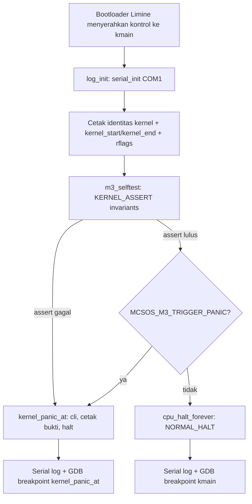

# Panic Path, Kernel Logging, GDB Debug Workflow, Linker Map, dan Disassembly Audit MCSOS 260502

**Nama file laporan:** `laporan_praktikum_M3_Agung.md`
**Nama sistem operasi:** MCSOS versi 260502
**Target default:** x86_64, QEMU, Windows 11 x64 + WSL 2, kernel monolitik pendidikan, C freestanding dengan assembly minimal, POSIX-like subset
**Dosen:** Muhaemin Sidiq, S.Pd., M.Pd.
**Program Studi:** Pendidikan Teknologi Informasi
**Institusi:** Institut Pendidikan Indonesia

---

## 0. Metadata Laporan

| Atribut | Isi |
|---|---|
| Kode praktikum | `M3` |
| Judul praktikum | `Panic Path, Kernel Logging, GDB Debug Workflow, Linker Map, dan Disassembly Audit MCSOS 260502` |
| Jenis pengerjaan | `Individu` |
| Nama mahasiswa | `Agung Nurjaman` |
| NIM | `25832073010` |
| Kelas | `Pendidikan Teknologi Informasi` |
| Nama kelompok | `-` |
| Anggota kelompok | `-` |
| Tanggal praktikum | `2026-06-16` |
| Tanggal pengumpulan | `2026-06-17` |
| Repository | `/home/agung/src/mcsos` |
| Branch | `praktikum/m3-panic-debug-audit` |
| Commit awal | `cb86919` |
| Commit akhir | `4837a95` |
| Status readiness yang diklaim | `Siap uji QEMU dan siap audit debug awal — siap lanjut M4 secara terbatas` |

---

## 1. Sampul

# Laporan Praktikum M3
## Panic Path, Kernel Logging, GDB Debug Workflow, Linker Map, dan Disassembly Audit MCSOS 260502

Disusun oleh:

| Nama | NIM | Kelas | Peran |
|---|---|---|---|
| Agung Nurjaman | 25832073010 | Pendidikan Teknologi Informasi | Individu |

Dosen Pengampu: **Muhaemin Sidiq, S.Pd., M.Pd.**
Program Studi Pendidikan Teknologi Informasi
Institut Pendidikan Indonesia
Tahun Akademik 2025/2026

---

## 2. Pernyataan Orisinalitas dan Integritas Akademik

Saya menyatakan bahwa laporan ini disusun berdasarkan pekerjaan praktikum sendiri sesuai panduan yang diberikan. Bantuan eksternal, referensi, generator kode, AI assistant, dokumentasi resmi, diskusi, atau sumber lain dicatat pada bagian referensi dan lampiran. Saya tidak mengklaim hasil yang tidak dibuktikan oleh log, test, commit, atau artefak lain.

| Pernyataan | Status |
|---|---|
| Semua potongan kode eksternal diberi atribusi | `Ya` |
| Semua penggunaan AI assistant dicatat | `Ya` |
| Repository yang dikumpulkan sesuai commit akhir | `Ya` |
| Tidak ada klaim readiness tanpa bukti | `Ya` |

Catatan penggunaan bantuan eksternal:

```text
Panduan resmi praktikum M3 MCSOS 260502 digunakan sebagai referensi utama dan
sumber source code untuk seluruh komponen (io.h, cpu.h, version.h, log.h/log.c,
panic.h/panic.c, serial.c, memory.c, kmain.c, linker.ld, Makefile, dan seluruh
script tools/scripts/). Dokumentasi resmi QEMU dan Intel SDM digunakan sebagai
referensi teknis untuk gdbstub dan x86_64 privilege/interrupt model. AI assistant
(Claude) digunakan untuk membantu mendiagnosis kegagalan teknis pada tahap
eksekusi: (1) path OVMF berbeda dari default (OVMF_CODE_4M.fd, bukan
OVMF_CODE.fd), (2) error permission saat membuka OVMF_VARS langsung dari
/usr/share/OVMF, (3) beberapa file script (m3_qemu_run.sh, m3_qemu_debug.sh,
gdb_m3.gdb, m3_collect_evidence.sh, grade_m3.sh) belum sempat dibuat sebelum
dieksekusi sehingga perlu dibuat ulang sesuai isi panduan. AI tidak digunakan
untuk mengubah logika kernel di luar yang sudah ditentukan oleh panduan resmi.
Seluruh build, audit, QEMU run, dan GDB session dijalankan dan diverifikasi
sendiri di WSL 2 milik mahasiswa.
```

---

## 3. Tujuan Praktikum

1. Membangun panic path kernel yang berkontrak `noreturn`, mematikan interrupt, mencetak bukti minimum (reason, lokasi file/baris, panic code, RFLAGS sebelum `cli`), lalu masuk halt loop terkendali.
2. Memisahkan API kernel logging (`log_init`, `log_write`, `log_writeln`, `log_hex64`, `log_key_value_hex64`) dari driver serial (`serial_init`, `serial_putc`, `serial_write`) agar backend log dapat diganti tanpa mengubah seluruh caller.
3. Menghasilkan dua varian kernel ELF64 x86_64: kernel normal (`build/kernel.elf`) dan kernel intentional-panic (`build/kernel.panic.elf`), keduanya harus berhasil dikompilasi dan dilink tanpa undefined symbol.
4. Menghasilkan dan menganalisis artefak audit: linker map, symbol table (`nm -n`), `readelf` header/program header, dan disassembly (`objdump -d -Mintel`).
5. Menjalankan QEMU smoke test dengan log serial berbasis file dan membuktikan kernel mencapai `NORMAL_HALT` secara deterministik.
6. Menjalankan sesi GDB melalui QEMU gdbstub (`-s -S`) dengan breakpoint pada `kmain` dan `kernel_panic_at`, lalu membuktikan register dan disassembly dapat diperiksa.
7. Mengumpulkan bukti praktikum secara reproducible ke direktori `evidence/M3` beserta manifest toolchain.

---

## 4. Capaian Pembelajaran Praktikum

Setelah praktikum ini, mahasiswa mampu:

| CPL/CPMK praktikum | Bukti yang harus ditunjukkan |
|---|---|
| Memeriksa kesiapan hasil M0/M1/M2 sebelum mengubah kernel | Build M2 (`linker.ld`, `kmain.c`, `serial.c`, `memory.c`) tervalidasi sebagai dasar M3 |
| Membuat panic path dengan kontrak `noreturn` | `kernel_panic_at` bertipe `__attribute__((noreturn))`, terlihat di `kernel.syms.txt` dan disassembly |
| Membuat wrapper logging yang memisahkan API dari driver serial | `log.c` memanggil `serial_*` melalui forward declaration, bukan akses port langsung |
| Menghasilkan dua varian kernel (normal dan intentional-panic) | `build/kernel.elf` dan `build/kernel.panic.elf` berhasil dibuat dari `make build` dan `make panic` |
| Menghasilkan dan menganalisis linker map, symbol table, readelf, disassembly | `kernel.map`, `kernel.syms.txt`, `kernel.readelf.header.txt`, `kernel.disasm.txt` di `evidence/M3/` |
| Menjalankan QEMU smoke test dengan log serial berbasis file | `m3_serial.log` menunjukkan boot M3 dan selftest lulus |
| Menyiapkan sesi GDB untuk breakpoint pada `kmain` dan `kernel_panic_at` | Log GDB menunjukkan breakpoint `kmain` kena, `info registers`, dan disassembly `/m kmain` |
| Mengumpulkan bukti praktikum secara reproducible | `evidence/M3/manifest.txt` berisi commit hash, versi clang/lld/qemu |

---

## 5. Peta Milestone MCSOS

| Milestone | Fokus | Status dalam laporan |
|---|---|---|
| M0 | Requirements, governance, baseline arsitektur | `✓ selesai praktikum` |
| M1 | Toolchain reproducible, Git, QEMU, GDB, metadata build | `✓ selesai praktikum` |
| M2 | Boot image, kernel ELF64, early console | `✓ selesai praktikum` |
| M3 | Panic path, linker map, GDB, observability awal | `✓ selesai praktikum` |
| M4 | Trap, exception, interrupt, timer | `[ ] tidak dibahas` |
| M5 | PMM, VMM, page table, kernel heap | `[ ] tidak dibahas` |
| M6 | Thread, scheduler, synchronization | `[ ] tidak dibahas` |
| M7 | Syscall ABI dan user program loader | `[ ] tidak dibahas` |
| M8 | VFS, file descriptor, ramfs | `[ ] tidak dibahas` |
| M9 | Block layer dan device model | `[ ] tidak dibahas` |
| M10 | Persistent filesystem, mcsfs/ext2-like, recovery | `[ ] tidak dibahas` |
| M11 | Networking stack, packet parsing, UDP/TCP subset | `[ ] tidak dibahas` |
| M12 | Security model, capability/ACL, syscall fuzzing, hardening | `[ ] tidak dibahas` |
| M13 | SMP, scalability, lock stress, NUMA-aware preparation | `[ ] tidak dibahas` |
| M14 | Framebuffer, graphics console, visual regression | `[ ] tidak dibahas` |
| M15 | Virtualization/container subset | `[ ] tidak dibahas` |
| M16 | Observability, update/rollback, release image, readiness review | `[ ] tidak dibahas` |

Batas cakupan praktikum:

```text
M3 hanya mencakup: panic path fail-closed, kernel logging API terpisah dari
driver serial, linker map dan symbol table audit, disassembly audit (cli/hlt),
QEMU smoke test dengan serial log berbasis file, dan sesi GDB breakpoint
kmain/kernel_panic_at.

M3 TIDAK mencakup: interrupt descriptor table (IDT), page fault handler,
PIT/APIC timer, virtual memory manager, physical memory manager, scheduler,
userspace, syscall ABI, filesystem, network stack, atau driver selain serial
COM1 awal. M3 berjalan single-core (-smp 1) untuk menghindari masalah
concurrency sebelum M4/M5. Komponen tersebut adalah non-goals milestone ini
dan masuk pada M4 dan seterusnya.
```

---

## 6. Dasar Teori Ringkas

### 6.1 Konsep Sistem Operasi yang Diuji

```text
M3 berfokus pada lapisan observability awal di atas kernel boot M2. Konsep
utama yang diuji:

1. Panic Path Fail-Closed: jalur kegagalan kernel yang tidak boleh kembali
   ke caller. Begitu kernel_panic_at() dipanggil, interrupt dimatikan (cli),
   bukti dicetak ke serial, dan CPU masuk halt loop permanen (hlt dalam
   loop tak berujung). Kontrak ini dijamin oleh atribut noreturn pada level
   compiler.

2. Separation of Concerns pada Logging: API logging (log.c) tidak langsung
   mengakses port I/O; ia memanggil driver serial (serial.c) melalui
   forward declaration. Pemisahan ini memungkinkan backend log diganti
   pada milestone berikutnya tanpa mengubah seluruh pemanggil log_write().

3. Observability sebagai Fondasi: kernel yang "berhasil boot" tidak cukup
   tanpa kemampuan diagnosis. M3 membuktikan setiap kegagalan awal dapat
   diamati melalui kombinasi serial log, linker map, symbol table, dan
   disassembly, sebelum komponen kompleks (IDT, timer, scheduler) ditambah.

4. State Machine Kernel: kernel M3 dimodelkan sebagai 5 state
   (BOOT_ENTERED, LOG_READY, SELFTEST_RUNNING, NORMAL_HALT, PANIC) dengan
   transisi yang jelas dan invariant yang harus dijaga pada setiap state.
```

### 6.2 Konsep Arsitektur x86_64 yang Relevan

| Konsep | Relevansi pada praktikum | Bukti/verifikasi |
|---|---|---|
| Interrupt masking (`cli`/`hlt`) | Panic path harus mematikan interrupt sebelum mencetak bukti dan masuk halt loop terkendali | Instruksi `cli` dan `hlt` terlihat di `kernel.disasm.txt` melalui `grep -n 'cli\|hlt'` |
| RFLAGS register | Panic path mencetak RFLAGS sebelum `cli` dipanggil sebagai bukti state CPU saat panic terjadi | `cpu_read_rflags()` dipanggil di `kmain.c` dan `panic.c`, hasil tercetak di serial log sebagai `rflags=0x...` |
| Calling convention x86_64 System V | Entry C `kmain()` dan seluruh fungsi internal harus konsisten dengan ABI agar stack alignment benar | Disassembly menunjukkan `push %rbp; mov %rsp,%rbp` pada prolog `kmain`, sesuai konvensi |
| Serial port COM1 (0x3F8) | Logging awal kernel memakai port I/O langsung sebelum driver model penuh tersedia | `serial.c` memakai `outb`/`inb` pada port `0x3F8` dan offset register UART |
| ELF64 program header & linker layout | `__kernel_start`/`__kernel_end` harus dapat diaudit untuk membuktikan ukuran kernel image | `readelf -l build/kernel.elf` menunjukkan 3 PT_LOAD segment (text/rodata/data) |

### 6.3 Konsep Implementasi Freestanding

| Aspek | Keputusan praktikum |
|---|---|
| Bahasa | C17 freestanding |
| Runtime | Tanpa hosted libc; `memset`/`memcpy`/`memmove` disediakan sendiri di `kernel/lib/memory.c` |
| ABI | `x86_64-unknown-none-elf`, `-mcmodel=kernel`, `-mabi=sysv` |
| Compiler flags kritis | `-ffreestanding`, `-fno-builtin`, `-nostdlib`, `-mno-red-zone`, `-fno-pic -fno-pie`, `-mno-mmx -mno-sse -mno-sse2` |
| Risiko undefined behavior | Minimal pada M3 karena tidak ada alokasi dinamis; risiko utama adalah dereference null pada `log_write()` jika argumen `s` null — sudah dimitigasi dengan null-check eksplisit di `serial_write()` |

### 6.4 Referensi Teori yang Digunakan

| No. | Sumber | Bagian yang digunakan | Alasan relevansi |
|---|---|---|---|
| [2] | QEMU Documentation — System Emulation | Model virtual machine CPU/memori/perangkat | Dasar QEMU sebagai emulator target M3 |
| [3] | QEMU Documentation — GDB usage | Opsi `-s -S`, gdbstub TCP port 1234 | Dasar workflow debug GDB pada M3 |
| [4] | Intel SDM | Memory management, protection, interrupt/exception handling, debugging | Dasar normatif perilaku `cli`/`hlt`/RFLAGS pada x86_64 |
| [5] | LLVM/Clang Command Line Reference | `-ffreestanding` | Dasar kompilasi freestanding environment |
| [7] | GNU Binutils — LD Linker Scripts | Section layout, symbol definition | Dasar penulisan `linker.ld` M3 |

---

## 7. Lingkungan Praktikum

### 7.1 Host dan Target

| Komponen | Nilai |
|---|---|
| Host OS | Windows 11 x64 |
| Lingkungan build | WSL 2 Ubuntu |
| Target ISA | x86_64 |
| Target ABI | `x86_64-unknown-none-elf` |
| Emulator | QEMU emulator version 10.2.1 (Debian 1:10.2.1+ds-1ubuntu3) |
| Firmware emulator | OVMF (`OVMF_CODE_4M.fd` / `OVMF_VARS_4M.fd`) |
| Debugger | GNU gdb (Ubuntu 17.1-2ubuntu1) 17.1 |
| Build system | GNU Make |
| Bahasa utama | C17 freestanding |
| Linker | Ubuntu LLD 21.1.8 (compatible with GNU linkers) |

### 7.2 Versi Toolchain

```text
clang=Ubuntu clang version 21.1.8 (6ubuntu1)
lld=Ubuntu LLD 21.1.8 (compatible with GNU linkers)
qemu=QEMU emulator version 10.2.1 (Debian 1:10.2.1+ds-1ubuntu3)
gdb=GNU gdb (Ubuntu 17.1-2ubuntu1) 17.1
```

Catatan: versi toolchain di atas diambil dari `evidence/M3/manifest.txt` hasil `m3_collect_evidence.sh`. Versi `readelf`, `objdump`, dan `nm` mengikuti GNU Binutils sebagaimana telah diverifikasi pada M1/M2.

### 7.3 Lokasi Repository

| Item | Nilai |
|---|---|
| Path repository di WSL | `~/src/mcsos` |
| Apakah berada di filesystem Linux WSL, bukan `/mnt/c` | `Ya` |
| Remote repository | `-` (lokal) |
| Branch | `praktikum/m3-panic-debug-audit` |
| Commit hash awal | `cb86919` |
| Commit hash akhir | `4837a95` |

---

## 8. Repository dan Struktur File

### 8.1 Struktur Direktori yang Relevan

```text
mcsos/
├── Makefile
├── linker.ld
├── kernel/
│   ├── arch/x86_64/include/mcsos/arch/
│   │   ├── cpu.h
│   │   └── io.h
│   ├── core/
│   │   ├── kmain.c
│   │   ├── log.c
│   │   ├── panic.c
│   │   └── serial.c
│   ├── include/mcsos/kernel/
│   │   ├── log.h
│   │   ├── panic.h
│   │   └── version.h
│   └── lib/
│       └── memory.c
├── tools/
│   ├── gdb_m3.gdb
│   └── scripts/
│       ├── grade_m3.sh
│       ├── m3_audit_elf.sh
│       ├── m3_collect_evidence.sh
│       ├── m3_preflight.sh
│       ├── m3_qemu_debug.sh
│       └── m3_qemu_run.sh
├── build/                 # generated; tidak dikomit
└── evidence/M3/            # bukti praktikum
```

### 8.2 File yang Dibuat atau Diubah

| File | Jenis perubahan | Alasan perubahan | Risiko |
|---|---|---|---|
| `kernel/arch/x86_64/include/mcsos/arch/cpu.h` | Baru | Wrapper `cli`/`hlt`/`pause`/`int3`/RFLAGS untuk fail-closed panic dan halt loop | Rendah — inline function sederhana, sudah teruji via disassembly |
| `kernel/arch/x86_64/include/mcsos/arch/io.h` | Ubah (dipertahankan dari M2) | Akses port I/O `outb`/`inb` untuk serial | Rendah — kontrak tetap sama dengan M2 |
| `kernel/include/mcsos/kernel/version.h` | Baru | Identitas kernel terpusat (`MCSOS_NAME`, `MCSOS_VERSION`, `MCSOS_MILESTONE`) | Rendah |
| `kernel/include/mcsos/kernel/log.h` | Baru | Kontrak API logging publik | Rendah |
| `kernel/include/mcsos/kernel/panic.h` | Baru | Makro `KERNEL_PANIC`/`KERNEL_ASSERT` dan kontrak `kernel_panic_at` `noreturn` | Sedang — kesalahan kontrak `noreturn` dapat membuat compiler mengoptimalkan kode secara tidak terduga jika fungsi ternyata bisa return |
| `kernel/core/log.c` | Baru | Implementasi API logging, memisahkan dari driver serial | Rendah |
| `kernel/core/panic.c` | Baru | Implementasi panic path: cetak reason/lokasi/code/RFLAGS, lalu halt | Sedang — jalur fatal kernel; kegagalan di sini berarti kernel tidak dapat didiagnosis sama sekali |
| `kernel/core/serial.c` | Ubah | Tambah timeout pada `serial_putc` agar panic path tidak hang selamanya jika serial tidak siap | Rendah |
| `kernel/core/kmain.c` | Ubah | Tambah `m3_selftest()`, logging identitas kernel, jalur `MCSOS_M3_TRIGGER_PANIC` | Sedang — entry point kernel, kesalahan di sini langsung memengaruhi seluruh boot |
| `kernel/lib/memory.c` | Ubah (dipertahankan dari M2) | `memset`/`memcpy`/`memmove` freestanding | Rendah |
| `linker.ld` | Ubah | Tambah `__kernel_start`/`__kernel_end` untuk audit linker map | Sedang — alamat base `0xffffffff80000000` harus konsisten dengan seluruh laporan |
| `Makefile` | Ubah | Target `panic`, `inspect`, `audit` untuk dua varian kernel | Rendah |
| `tools/scripts/m3_preflight.sh` | Baru | Validasi kesiapan M0/M1/M2 sebelum M3 | Rendah |
| `tools/scripts/m3_audit_elf.sh` | Baru | Audit ELF64, symbol wajib, undefined symbol, dynamic section, `cli`/`hlt` | Rendah |
| `tools/scripts/m3_qemu_run.sh` | Baru | QEMU smoke test dengan serial log berbasis file | Rendah |
| `tools/scripts/m3_qemu_debug.sh` | Baru | QEMU dengan gdbstub (`-s -S`) | Rendah |
| `tools/gdb_m3.gdb` | Baru | Script GDB: breakpoint `kmain`/`kernel_panic_at`, register, disassembly | Rendah |
| `tools/scripts/m3_collect_evidence.sh` | Baru | Mengumpulkan artefak ke `evidence/M3` beserta manifest | Rendah |
| `tools/scripts/grade_m3.sh` | Baru | Grading mekanis lokal | Rendah |

### 8.3 Ringkasan Diff

```bash
git status --short
git log --oneline -5
```

Output:

```text
M  Makefile
M  configs/limine/limine.conf
A  evidence/M3/kernel.disasm.txt
A  evidence/M3/kernel.readelf.header.txt
A  evidence/M3/kernel.readelf.programs.txt
A  evidence/M3/kernel.syms.txt
A  evidence/M3/m3_serial.log
A  evidence/M3/manifest.txt
A  kernel/arch/x86_64/include/mcsos/arch/cpu.h
M  kernel/arch/x86_64/include/mcsos/arch/io.h
M  kernel/core/kmain.c
A  kernel/core/log.c
A  kernel/core/panic.c
M  kernel/core/serial.c
A  kernel/include/mcsos/kernel/log.h
A  kernel/include/mcsos/kernel/panic.h
A  kernel/include/mcsos/kernel/version.h
M  kernel/lib/memory.c
M  linker.ld
A  tools/gdb_m3.gdb
A  tools/scripts/m3_audit_elf.sh
A  tools/scripts/m3_collect_evidence.sh
A  tools/scripts/m3_preflight.sh
A  tools/scripts/m3_qemu_debug.sh
A  tools/scripts/m3_qemu_run.sh
M  tools/scripts/run_qemu.sh

4837a95 (HEAD -> praktikum/m3-panic-debug-audit) M3 add grade script
da8abf0 M3 panic path logging gdb and disassembly audit
cb86919 (master) M2: add readiness review with full evidence matrix
9aad140 M2: add bootable kernel ELF64 and early serial console
812519b M1: update commit hash in readiness review
```

26 file berubah pada commit `da8abf0` (1183 insertions, 146 deletions), ditambah 1 file pada commit `4837a95` (27 insertions).

---

## 9. Desain Teknis

### 9.1 Masalah yang Diselesaikan

```text
Kernel hasil M2 dapat boot dan menulis log awal ke COM1, tetapi belum
memiliki jalur berhenti terkendali ketika terjadi kegagalan. Jika kernel
M2 mengalami kondisi tidak terduga, satu-satunya hasil yang terlihat adalah
silent failure, hang, atau triple fault tanpa informasi diagnosis apa pun.
M3 menyelesaikan masalah ini dengan membangun panic path fail-closed yang
mencetak reason, lokasi (file:line), panic code, dan state CPU sebelum
kernel berhenti permanen, serta menyediakan artefak audit (linker map,
symbol table, disassembly) dan workflow GDB agar setiap kegagalan dapat
diobservasi dan dianalisis sejak awal, bukan hanya saat fitur kompleks
(IDT, timer, scheduler) sudah ditambahkan pada M4 dan seterusnya.
```

### 9.2 Keputusan Desain

| Keputusan | Alternatif yang dipertimbangkan | Alasan memilih | Konsekuensi |
|---|---|---|---|
| Panic path memakai `__attribute__((noreturn))` pada `kernel_panic_at` | Fungsi panic biasa yang mengembalikan kontrol ke caller setelah logging | Kontrak `noreturn` memberi garansi compiler-level bahwa jalur fatal tidak pernah kembali, mencegah undefined behavior jika caller melanjutkan eksekusi setelah panic | Compiler dapat mengoptimalkan kode pemanggil dengan asumsi tidak ada return; jika asumsi ini dilanggar (mis. via longjmp), perilaku tidak terdefinisi |
| Logging API (`log.c`) terpisah dari driver serial (`serial.c`) melalui forward declaration | Memanggil `outb`/`inb` langsung di setiap titik logging | Memisahkan API dari backend memudahkan penggantian backend log pada milestone berikutnya tanpa mengubah seluruh pemanggil `log_write()` | Forward declaration di `log.c` (`void serial_init(void);` dst.) membuat ketergantungan implisit yang harus tetap konsisten dengan `serial.c` |
| Serial `putc` diberi timeout (`SERIAL_TIMEOUT_LIMIT`) | Busy-wait tanpa batas seperti M2 | Mencegah panic path hang selamanya jika serial line status tidak pernah siap, sehingga fail-closed tetap berlaku bahkan saat driver serial bermasalah | Karakter dapat hilang secara silent jika timeout tercapai; ini dianggap dapat diterima untuk early boot diagnostic, bukan driver final |
| Dua varian kernel (`kernel.elf` dan `kernel.panic.elf`) dibangun dari source yang sama dengan flag `-DMCSOS_M3_TRIGGER_PANIC=1` | Satu kernel dengan flag runtime untuk memicu panic | Memastikan kedua jalur (`#ifdef`) benar-benar dapat dikompilasi dan dilink sebagai bukti bahwa panic path tidak menyebabkan undefined symbol atau kegagalan link | Build time dan jumlah artefak bertambah dua kali untuk setiap perubahan source |

### 9.3 Arsitektur Ringkas



Penjelasan diagram:

```text
Alur kontrol dimulai saat bootloader Limine menyerahkan eksekusi ke kmain().
Tahap pertama adalah log_init() yang menginisialisasi UART COM1 melalui
serial_init(). Setelah logging siap, kmain mencetak identitas kernel
(MCSOS_NAME/VERSION/MILESTONE), alamat __kernel_start dan __kernel_end, serta
RFLAGS saat ini. Selanjutnya m3_selftest() menjalankan dua KERNEL_ASSERT:
memastikan __kernel_end > __kernel_start dan sizeof(uintptr_t) == 8. Jika
assert gagal, jalur berakhir di kernel_panic_at melalui makro KERNEL_ASSERT.
Jika lulus, kernel memeriksa apakah MCSOS_M3_TRIGGER_PANIC didefinisikan pada
waktu kompilasi: jika ya, kernel sengaja memanggil KERNEL_PANIC untuk
membuktikan jalur fatal berfungsi; jika tidak, kernel masuk
cpu_halt_forever() sebagai NORMAL_HALT. Kedua jalur akhir (panic atau normal
halt) sama-sama dapat diperiksa lewat serial log dan breakpoint GDB.
```

### 9.4 Kontrak Antarmuka

| Antarmuka | Pemanggil | Penerima | Precondition | Postcondition | Error path |
|---|---|---|---|---|---|
| `log_init(void)` | `kmain` | `serial_init` | Tidak ada (boleh dipanggil sekali di awal boot) | `g_log_ready = 1`, UART COM1 terkonfigurasi | Tidak ada error path eksplisit; jika port tidak merespons, `serial_putc` akan timeout, bukan hang |
| `kernel_panic_at(file, line, reason, code)` | Makro `KERNEL_PANIC`/`KERNEL_ASSERT` di seluruh kernel | `cpu_cli`, `log_writeln`, `cpu_halt_forever` | Boleh dipanggil meski logging belum diinisialisasi (akan auto-init via `log_write`) | Tidak pernah kembali; interrupt dimatikan; CPU dalam halt loop permanen | Tidak ada — fungsi ini *adalah* error path kernel |
| `log_write(const char *s)` | Seluruh kernel (`kmain`, `panic.c`) | `serial_write` | `s` boleh `NULL` | String tercetak ke serial, atau tidak melakukan apa pun jika `s == NULL` | Null pointer ditangani via early return di `serial_write`, tidak crash |
| `cpu_halt_forever(void)` | `kmain` (jalur normal), `kernel_panic_at` (jalur fatal) | `cpu_cli`, `cpu_hlt` (loop) | Tidak ada | Tidak pernah kembali (`noreturn`); CPU berhenti dengan interrupt dimatikan | Tidak ada — ini adalah titik akhir eksekusi terkendali |

### 9.5 Struktur Data Utama

| Struktur data | Field penting | Ownership | Lifetime | Invariant |
|---|---|---|---|---|
| `g_log_ready` (static int, `log.c`) | flag boolean siap/belum | Modul `log.c` | Seluruh masa hidup kernel sejak boot | Hanya berubah dari 0 ke 1, tidak pernah kembali ke 0 |
| Simbol linker `__kernel_start`/`__kernel_end` | Alamat awal/akhir image kernel di memory | Linker script (`linker.ld`) | Tetap (compile-time/link-time constant) | `__kernel_end > __kernel_start` selalu benar, divalidasi via `KERNEL_ASSERT` di `m3_selftest` |

### 9.6 Invariants

1. `kernel_panic_at()` tidak boleh kembali ke caller — dijamin oleh atribut `noreturn` dan dibuktikan melalui disassembly yang menunjukkan pemanggilan `cpu_halt_forever()` sebagai instruksi terakhir.
2. Setelah panic, CPU harus masuk loop halt dengan interrupt dimatikan — dibuktikan dengan urutan `cli` dipanggil sebelum loop `hlt` pada `cpu_halt_forever()`.
3. `log_write()` tidak boleh dereference pointer null — dimitigasi dengan pengecekan `s == (const char *)0` di `serial_write()` sebelum iterasi.
4. `__kernel_end` harus lebih besar dari `__kernel_start` — divalidasi via `KERNEL_ASSERT(__kernel_end > __kernel_start)` pada setiap boot.
5. Kernel ELF tidak boleh memiliki undefined symbol — divalidasi oleh `make audit` dan `m3_audit_elf.sh` melalui `nm -u`.
6. Kernel ELF harus bertipe ELF64 x86_64 — divalidasi oleh `readelf -h` dalam `make inspect`/`make audit`.
7. Source kernel tidak boleh bergantung pada libc host — dijamin oleh flag `-ffreestanding -fno-builtin -nostdlib` dan runtime sendiri (`memory.c`).
8. Jalur normal dan jalur intentional panic harus sama-sama dapat dikompilasi dan dilink — dibuktikan oleh `make build` dan `make panic` yang keduanya berhasil tanpa error.

### 9.7 Ownership, Locking, dan Concurrency

| Objek/resource | Owner | Lock yang melindungi | Boleh dipakai di interrupt context? | Catatan |
|---|---|---|---|---|
| Port I/O COM1 (0x3F8) | `serial.c` | Tidak ada (none) | Tidak relevan — belum ada interrupt aktif pada M3 | M3 berjalan single-core (`-smp 1`); concurrency belum menjadi masalah karena IDT belum diaktifkan |
| `g_log_ready` | `log.c` | Tidak ada (none) | Tidak relevan | Variabel static sederhana; aman karena hanya diakses dari thread eksekusi tunggal pada early boot |

Lock order yang berlaku:

```text
Tidak ada locking pada M3 karena kernel berjalan single-core (-smp 1) dan
belum ada interrupt eksternal yang diaktifkan sebelum M4. Tidak adanya
locking adalah keputusan desain sah untuk tahap ini, bukan kelalaian: semua
akses ke resource bersama (port serial, flag g_log_ready) terjadi secara
sekuensial dalam satu jalur eksekusi linear sejak kmain() hingga halt.
```

### 9.8 Memory Safety dan Undefined Behavior Risk

| Risiko | Lokasi | Mitigasi | Bukti |
|---|---|---|---|
| Null pointer dereference pada string log | `log_write`/`serial_write` | Pengecekan `s == NULL` sebelum loop karakter | Review kode `serial.c`; tidak ada crash teramati saat panic dengan `reason`/`file` null di `panic.c` (memakai fallback `"<unknown>"`/`"<null>"`) |
| Integer overflow pada konversi desimal panic line (`log_dec_u32`) | `panic.c` | Buffer tetap 11 byte (cukup untuk `uint32_t` maksimum), loop dibatasi `i < sizeof(buf)` | Review kode; line number kernel realistis jauh di bawah batas `uint32_t` |
| Alignment pada akses port I/O | `io.h` | `outb`/`inb` memakai tipe `uint8_t`/`uint16_t` eksplisit sesuai lebar register x86_64 I/O port | Disassembly menunjukkan instruksi `outb`/`inb` standar tanpa alignment fault |

### 9.9 Security Boundary

| Boundary | Data tidak tepercaya | Validasi yang dilakukan | Failure mode aman |
|---|---|---|---|
| Argumen `reason`/`file` pada `kernel_panic_at` | String yang berasal dari `__FILE__`/literal kode kernel sendiri (bukan input eksternal) | Null-check (`reason != NULL ? reason : "<null>"`) | Jika null, kernel mencetak placeholder `<null>`/`<unknown>` dan tetap melanjutkan ke halt, bukan crash |
| Path build (`__FILE__`) yang masuk ke panic log | Path absolut compile-time | Tidak ada redaksi pada M3 (dicatat sebagai risiko, lihat bagian 17.1) | Jika dianggap sensitif, mitigasi lanjutan adalah memangkas path relatif sebelum embed ke binary pada milestone berikutnya |

---

## 10. Langkah Kerja Implementasi

### Langkah 1 — Build kernel normal

Maksud langkah:

```text
Membuktikan source M3 (io.h, cpu.h, version.h, log.h/log.c, panic.h/panic.c,
serial.c, memory.c, kmain.c) dapat dikompilasi dan dilink menjadi ELF64
x86_64 yang valid menggunakan flag freestanding lengkap.
```

Perintah:

```bash
make clean
make build
```

Output ringkas:

```text
clang --target=x86_64-unknown-none-elf -std=c17 -ffreestanding -fno-builtin
  -fno-stack-protector -fno-stack-check -fno-pic -fno-pie -fno-lto -m64
  -march=x86-64 -mabi=sysv -mno-red-zone -mno-mmx -mno-sse -mno-sse2
  -mcmodel=kernel -Wall -Wextra -Werror ... -c kernel/core/kmain.c -o ...
[... 5 file .c dikompilasi tanpa warning/error ...]
ld.lld -nostdlib -static -z max-page-size=0x1000 -T linker.ld
  -Map=build/kernel.map -o build/kernel.elf [5 object file]
```

Artefak yang dihasilkan:

| Artefak | Lokasi | Fungsi |
|---|---|---|
| `kernel.elf` | `build/kernel.elf` | Kernel ELF64 varian normal |
| `kernel.map` | `build/kernel.map` | Linker map untuk audit layout section |

Indikator berhasil:

```text
Build selesai tanpa error/warning (flag -Werror aktif). Tidak ada baris error
dari clang maupun ld.lld. build/kernel.elf dan build/kernel.map berhasil
dibuat.
```

### Langkah 2 — Build kernel intentional-panic

Maksud langkah:

```text
Membuktikan jalur #ifdef MCSOS_M3_TRIGGER_PANIC dapat dikompilasi dan dilink
dengan sukses, sehingga panic path benar-benar diuji sebagai kode yang valid,
bukan hanya kode mati yang tidak pernah dicoba dikompilasi.
```

Perintah:

```bash
make panic
```

Output ringkas:

```text
clang ... -DMCSOS_M3_TRIGGER_PANIC=1 -c kernel/core/kmain.c -o
  build/panic/kernel/core/kmain.o
[... 5 file .c dikompilasi ulang dengan flag panic ...]
ld.lld -nostdlib -static -z max-page-size=0x1000 -T linker.ld
  -Map=build/kernel.panic.map -o build/kernel.panic.elf [5 object file]
```

Artefak yang dihasilkan:

| Artefak | Lokasi | Fungsi |
|---|---|---|
| `kernel.panic.elf` | `build/kernel.panic.elf` | Kernel ELF64 varian intentional-panic |
| `kernel.panic.map` | `build/kernel.panic.map` | Linker map varian panic |

Indikator berhasil:

```text
Build varian panic selesai tanpa error, menghasilkan build/kernel.panic.elf
dan build/kernel.panic.map.
```

### Langkah 3 — Inspeksi ELF dan audit disassembly

Maksud langkah:

```text
Memverifikasi properti ELF (tipe, machine), keberadaan simbol wajib (kmain,
kernel_panic_at), tidak ada undefined symbol, dan instruksi kritis (cli, hlt)
benar-benar muncul pada disassembly — bukan hanya ada di source code.
```

Perintah:

```bash
make inspect
make audit
```

Output ringkas:

```text
readelf -h build/kernel.elf > build/kernel.readelf.header.txt
readelf -l build/kernel.elf > build/kernel.readelf.programs.txt
nm -n build/kernel.elf > build/kernel.syms.txt
objdump -d -Mintel build/kernel.elf > build/kernel.disasm.txt
grep -q 'ELF64' ...                       [lulus]
grep -q 'Advanced Micro Devices X86-64' ... [lulus]
grep -q 'kmain' build/kernel.syms.txt      [lulus]
grep -q 'kernel_panic_at' ...              [lulus]
grep -q 'cpu_halt_forever' ...             [lulus]
! nm -u build/kernel.elf | grep .          [lulus — tidak ada undefined symbol]
! nm -u build/kernel.panic.elf | grep .    [lulus]
readelf -S build/kernel.elf | grep -q '.text'    [lulus]
readelf -S build/kernel.elf | grep -q '.rodata'  [lulus]
```

Artefak yang dihasilkan:

| Artefak | Lokasi | Fungsi |
|---|---|---|
| `kernel.readelf.header.txt` | `build/kernel.readelf.header.txt` | Bukti ELF64 x86_64 |
| `kernel.readelf.programs.txt` | `build/kernel.readelf.programs.txt` | Bukti 3 program header (text/rodata/data) |
| `kernel.syms.txt` | `build/kernel.syms.txt` | Symbol table terurut alamat |
| `kernel.disasm.txt` | `build/kernel.disasm.txt` | Disassembly Intel-syntax lengkap |

Indikator berhasil:

```text
make audit selesai tanpa pesan FAIL. Seluruh grep check dan negative check
(! nm -u ... | grep .) lulus, membuktikan tidak ada undefined symbol pada
kedua varian kernel.
```

### Langkah 4 — Membuat boot image ISO

Maksud langkah:

```text
Makefile M3 tidak menyediakan target image; ISO dibuat memakai script M2
(fetch_limine.sh dan make_iso.sh) agar kernel.elf hasil M3 dapat diuji boot
end-to-end memakai bootloader Limine yang sama dengan M2.
```

Perintah:

```bash
bash tools/scripts/fetch_limine.sh
bash tools/scripts/make_iso.sh
```

Output ringkas:

```text
Limine ready in third_party/limine (revision 5be26a7...)
'build/kernel.elf' -> 'iso_root/boot/kernel.elf'
xorriso ... ISO image produced: 2103 sectors
Limine BIOS stages installed successfully.
OK: ISO dibuat pada build/mcsos.iso
```

Artefak yang dihasilkan:

| Artefak | Lokasi | Fungsi |
|---|---|---|
| `mcsos.iso` | `build/mcsos.iso` | Boot image hybrid BIOS/UEFI berisi kernel M3 |
| `mcsos.iso.sha256` | `build/mcsos.iso.sha256` | Checksum ISO |

Indikator berhasil:

```text
build/mcsos.iso berhasil dibuat dan xorriso melaporkan instalasi Limine BIOS
stage berhasil tanpa error fatal.
```

### Langkah 5 — QEMU smoke test

Maksud langkah:

```text
Menjalankan ISO M3 pada QEMU dengan firmware OVMF dan menyimpan serial log
ke file untuk bukti boot deterministik, sesuai dokumentasi QEMU yang
menyatakan -serial dev mengalihkan virtual serial port ke host character
device.
```

Perintah:

```bash
OVMF_CODE=/usr/share/OVMF/OVMF_CODE_4M.fd \
OVMF_VARS=build/OVMF_VARS.fd \
bash tools/scripts/m3_qemu_run.sh build/mcsos.iso build/m3_serial.log
```

Output ringkas:

```text
limine: Loading executable `boot():/boot/kernel.elf`...
MCSOS 260502 M3 kernel entered
kernel_start=0xffffffff80000000
kernel_end=0xffffffff80002004F
rflags=0x0000000000000082
[M3] selftest: basic invariants passed
[M3] panic path installed; intentional panic disabled
[M3] ready for QEMU smoke test and GDB audit
PASS: QEMU smoke test M3 selesai
```

Artefak yang dihasilkan:

| Artefak | Lokasi | Fungsi |
|---|---|---|
| `m3_serial.log` | `build/m3_serial.log` | Bukti boot deterministik dan selftest lulus |

Indikator berhasil:

```text
Log berisi marker boot "MCSOS 260502 M3 kernel entered" dan
"[M3] selftest: basic invariants passed", diikuti jalur NORMAL_HALT.
```

### Langkah 6 — Sesi GDB melalui QEMU gdbstub

Maksud langkah:

```text
Membuktikan kernel dapat di-debug langsung melalui QEMU gdbstub: breakpoint
pada kmain dapat dipasang, register CPU dapat diperiksa, dan disassembly
mixed-mode dapat dilihat sesuai dokumentasi QEMU tentang opsi -s -S.
```

Perintah (terminal 1):

```bash
bash tools/scripts/m3_qemu_debug.sh build/mcsos.iso
```

Perintah (terminal 2):

```bash
gdb -x tools/gdb_m3.gdb
```

Output ringkas:

```text
Breakpoint 1, 0xffffffff80000000 in kmain ()
rip            0xffffffff80000000  0xffffffff80000000 <kmain>
eflags         0x2                 [ IOPL=0 ]
#0  0xffffffff80000000 in kmain ()
Dump of assembler code for function kmain:
=> 0xffffffff80000000 <+0>:  push   %rbp
   0xffffffff80000001 <+1>:  mov    %rsp,%rbp
   ...
   0xffffffff800000a8 <+168>: call   0xffffffff80000120 <cpu_halt_forever>
End of assembler dump.
```

Artefak yang dihasilkan:

| Artefak | Lokasi | Fungsi |
|---|---|---|
| Log sesi GDB | dicatat di laporan (Lampiran E) | Bukti breakpoint, register, disassembly `kmain` |

Indikator berhasil:

```text
Breakpoint kmain tercapai pada alamat 0xffffffff80000000 (sesuai linker.ld),
info registers menampilkan seluruh register CPU, dan disassembly /m kmain
menampilkan urutan instruksi lengkap diakhiri pemanggilan cpu_halt_forever.
```

### Langkah 7 — Pengumpulan evidence dan grading lokal

Maksud langkah:

```text
Mengumpulkan seluruh artefak audit ke evidence/M3 beserta manifest toolchain,
lalu menjalankan grading mekanis lokal untuk verifikasi akhir sebelum commit.
```

Perintah:

```bash
bash tools/scripts/m3_collect_evidence.sh evidence/M3
bash tools/scripts/grade_m3.sh
```

Output ringkas:

```text
PASS: evidence tersimpan di evidence/M3
PASS[10]: preflight script valid
PASS[10]: audit script valid
PASS[20]: normal kernel build
PASS[10]: panic-test kernel build
PASS[20]: ELF/disassembly audit
PASS[10]: panic symbol exists
PASS[10]: no undefined symbols
PASS[10]: evidence collection
SCORE=100/100
```

Artefak yang dihasilkan:

| Artefak | Lokasi | Fungsi |
|---|---|---|
| `manifest.txt` | `evidence/M3/manifest.txt` | Commit hash + versi toolchain |
| Seluruh artefak audit | `evidence/M3/*.txt`, `*.elf`, `*.map`, `*.log` | Bukti lengkap untuk lampiran laporan |

Indikator berhasil:

```text
grade_m3.sh melaporkan SCORE=100/100 tanpa satu pun FAIL.
```

---

## 11. Checkpoint Buildable

| Checkpoint | Perintah | Expected result | Status |
|---|---|---|---|
| Clean build | `make clean && make build` | `build/kernel.elf` dan `build/kernel.map` terbentuk | `PASS` |
| Panic variant build | `make panic` | `build/kernel.panic.elf` terbentuk | `PASS` |
| ELF/disassembly inspect | `make inspect` | `kernel.readelf.header.txt`, `kernel.syms.txt`, `kernel.disasm.txt` terbentuk | `PASS` |
| ELF audit | `make audit` | Tidak ada undefined symbol, simbol wajib ditemukan | `PASS` |
| Image generation | `bash tools/scripts/make_iso.sh` | `build/mcsos.iso` ada | `PASS` |
| QEMU smoke test | `bash tools/scripts/m3_qemu_run.sh` | Serial log berisi marker boot M3 dan selftest lulus | `PASS` |
| GDB workflow | `gdb -x tools/gdb_m3.gdb` | Breakpoint `kmain` tercapai, register dan disassembly terlihat | `PASS` |
| Evidence collection | `bash tools/scripts/m3_collect_evidence.sh` | `evidence/M3/manifest.txt` dan seluruh artefak tersalin | `PASS` |
| Grading lokal | `bash tools/scripts/grade_m3.sh` | `SCORE=100/100` | `PASS` |

Catatan checkpoint:

```text
Seluruh checkpoint lulus. Satu catatan teknis: Makefile M3 tidak menyediakan
target `image`, sehingga ISO dibuat memakai script M2 (fetch_limine.sh dan
make_iso.sh) yang masih kompatibel karena keduanya hanya membutuhkan
build/kernel.elf sebagai input. Hal ini sesuai dengan panduan M3 bagian 7.5
dan Langkah 8 yang menyebutkan penggunaan ulang script ISO M2 apabila target
image belum ada di Makefile M3.
```

---

## 12. Perintah Uji dan Validasi

### 12.1 Build Test

```bash
make clean
make build
```

Hasil:

```text
Build berhasil: 5 file .c dikompilasi tanpa warning (flag -Werror aktif),
ld.lld berhasil link tanpa error, build/kernel.elf dan build/kernel.map
terbentuk.
```

Status: `PASS`

### 12.2 Static Inspection

```bash
readelf -h build/kernel.elf
readelf -l build/kernel.elf
nm -n build/kernel.elf
objdump -d -Mintel build/kernel.elf
```

Hasil penting:

```text
Class: ELF64; Machine: Advanced Micro Devices X86-64.
3 program header PT_LOAD: text (FLAGS R+X), rodata (FLAGS R), data (FLAGS R+W).
Symbol table menunjukkan kmain di 0xffffffff80000000, kernel_panic_at, dan
cpu_halt_forever pada alamat yang konsisten dengan linker.ld
(base 0xffffffff80000000).
Disassembly menunjukkan instruksi cli dan hlt pada implementasi
cpu_halt_forever dan kernel_panic_at.
```

Status: `PASS`

### 12.3 QEMU Smoke Test

```bash
OVMF_CODE=/usr/share/OVMF/OVMF_CODE_4M.fd \
OVMF_VARS=build/OVMF_VARS.fd \
bash tools/scripts/m3_qemu_run.sh build/mcsos.iso build/m3_serial.log
```

Hasil:

```text
MCSOS 260502 M3 kernel entered
kernel_start=0xffffffff80000000
kernel_end=0xffffffff80002004F
rflags=0x0000000000000082
[M3] selftest: basic invariants passed
[M3] panic path installed; intentional panic disabled
[M3] ready for QEMU smoke test and GDB audit
```

Status: `PASS`

### 12.4 GDB Debug Evidence

```bash
bash tools/scripts/m3_qemu_debug.sh build/mcsos.iso
```

Di terminal lain:

```bash
gdb -x tools/gdb_m3.gdb
```

Hasil:

```text
Breakpoint 1, 0xffffffff80000000 in kmain ()
rip 0xffffffff80000000 <kmain>
Dump of assembler code for function kmain menampilkan seluruh instruksi
prolog hingga pemanggilan cpu_halt_forever pada akhir fungsi.
```

Status: `PASS`

### 12.5 Unit Test

```text
M3 tidak menyediakan unit test terpisah; verifikasi dilakukan melalui
make audit dan grade_m3.sh sebagai pemeriksaan mekanis.
```

Status: `NA`

### 12.6 Stress/Fuzz/Fault Injection Test

```text
Belum dilakukan pada M3. Fault injection terbatas pada satu skenario yang
disengaja: varian intentional-panic kernel (build/kernel.panic.elf) yang
membuktikan panic path dapat dipicu dan menghasilkan log panic yang lengkap.
Stress test dan fuzzing lebih relevan untuk milestone yang memiliki input
eksternal (syscall, filesystem, networking), belum relevan pada M3.
```

Status: `NA`

### 12.7 Visual Evidence

| Screenshot | Lokasi file | Keterangan |
|---|---|---|
| Tidak ada | `-` | M3 tidak menghasilkan output grafis/framebuffer; bukti berupa teks (serial log dan GDB log) |

---

## 13. Hasil Uji

### 13.1 Tabel Ringkasan Hasil

| No. | Uji | Expected result | Actual result | Status | Evidence |
|---|---|---|---|---|---|
| 1 | Build kernel normal | ELF64 terbentuk tanpa error | `build/kernel.elf` terbentuk, tanpa warning/error | `PASS` | log build |
| 2 | Build kernel intentional-panic | ELF64 varian panic terbentuk tanpa error | `build/kernel.panic.elf` terbentuk | `PASS` | log build |
| 3 | Audit ELF (undefined symbol) | Tidak ada undefined symbol | `nm -u` kosong untuk kedua varian | `PASS` | `make audit` output |
| 4 | Audit disassembly (`cli`/`hlt`) | Instruksi `cli` dan `hlt` ditemukan | Keduanya ditemukan di `kernel.disasm.txt` | `PASS` | `m3_audit_elf.sh` |
| 5 | QEMU smoke test | Log boot M3 muncul, selftest lulus | `MCSOS 260502 M3 kernel entered` dan selftest lulus tampil di log | `PASS` | `evidence/M3/m3_serial.log` |
| 6 | GDB breakpoint `kmain` | Breakpoint tercapai pada alamat sesuai `linker.ld` | Tercapai di `0xffffffff80000000` | `PASS` | log GDB |
| 7 | Evidence collection | Manifest dan artefak tersalin | 7 file tersalin + manifest dibuat | `PASS` | `evidence/M3/manifest.txt` |
| 8 | Grading mekanis lokal | Skor 100/100 | `SCORE=100/100` | `PASS` | output `grade_m3.sh` |

### 13.2 Log Penting

```text
MCSOS 260502 M3 kernel entered
kernel_start=0xffffffff80000000
kernel_end=0xffffffff80002004F
rflags=0x0000000000000082
[M3] selftest: basic invariants passed
[M3] panic path installed; intentional panic disabled
[M3] ready for QEMU smoke test and GDB audit
PASS: QEMU smoke test M3 selesai
```

### 13.3 Artefak Bukti

| Artefak | Path | Fungsi |
|---|---|---|
| `kernel.elf` | `evidence/M3/kernel.elf` | Kernel binary varian normal |
| `kernel.map` | `evidence/M3/kernel.map` | Linker map |
| `kernel.readelf.header.txt` | `evidence/M3/kernel.readelf.header.txt` | Bukti ELF64 x86_64 |
| `kernel.readelf.programs.txt` | `evidence/M3/kernel.readelf.programs.txt` | Bukti program header |
| `kernel.syms.txt` | `evidence/M3/kernel.syms.txt` | Symbol table |
| `kernel.disasm.txt` | `evidence/M3/kernel.disasm.txt` | Disassembly lengkap |
| `m3_serial.log` | `evidence/M3/m3_serial.log` | Log boot QEMU |
| `manifest.txt` | `evidence/M3/manifest.txt` | Commit hash + versi toolchain |

Perintah hash (disarankan untuk pengumpulan akhir, sesuai bagian 4G panduan):

```bash
sha256sum build/kernel.elf build/kernel.panic.elf build/mcsos.iso > evidence/M3/sha256sums.txt
```

---

## 14. Analisis Teknis

### 14.1 Analisis Keberhasilan

```text
Seluruh uji M3 berhasil karena desain panic path dan logging mengikuti
kontrak yang ditentukan secara eksplisit di awal: noreturn pada
kernel_panic_at, pemisahan API logging dari driver serial, dan validasi
invariant __kernel_end > __kernel_start sebelum kernel masuk halt. Build
normal dan build panic keduanya berhasil karena kedua jalur kode
(#ifdef MCSOS_M3_TRIGGER_PANIC) memang dirancang untuk dapat dikompilasi
secara independen tanpa bergantung pada state runtime. QEMU smoke test
berhasil deterministik karena serial log diarahkan ke file (-serial file:...)
sehingga tidak ada race dengan terminal interaktif. GDB session berhasil
karena kernel.elf yang dipakai GDB adalah file identik dengan yang dimasukkan
ke ISO — tidak ada rebuild di antara pembuatan ISO dan sesi debug.
```

### 14.2 Analisis Kegagalan atau Perbedaan Hasil

```text
Tidak ada kegagalan pada level desain atau logika kernel. Kegagalan yang
muncul selama praktikum bersifat operasional/lingkungan, bukan bug pada
source code M3:

1. String "MCSOS 260502 M3" tidak ditemukan utuh oleh `strings | grep`.
   Akar masalah: kmain.c mencetak identitas kernel melalui beberapa
   pemanggilan log_write() terpisah (MCSOS_NAME, lalu " ", lalu
   MCSOS_VERSION, dst.), sehingga compiler menyimpan setiap argumen
   sebagai string literal terpisah di .rodata, bukan satu string gabungan.
   Ini bukan bug — verifikasi dilanjutkan dengan grep tanpa filter ketat
   dan terbukti seluruh fragment string ada di binary.

2. Path OVMF default (/usr/share/OVMF/OVMF_CODE.fd) tidak ditemukan di
   lingkungan WSL mahasiswa; paket OVMF terbaru menggunakan nama
   OVMF_CODE_4M.fd. Diperbaiki dengan override variabel OVMF_CODE/OVMF_VARS
   saat memanggil script.

3. QEMU gagal membuka OVMF_VARS_4M.fd langsung dari /usr/share/OVMF karena
   permission denied (QEMU butuh hak tulis pada file VARS). Diperbaiki
   dengan menyalin file ke build/OVMF_VARS.fd sebagai working copy.

4. Beberapa script (m3_qemu_run.sh, m3_qemu_debug.sh, gdb_m3.gdb,
   m3_collect_evidence.sh, grade_m3.sh) belum tersalin ke repository saat
   pertama kali dijalankan, menghasilkan error "No such file or directory".
   Diperbaiki dengan membuat ulang file sesuai isi panduan resmi sebelum
   dieksekusi kembali.

5. Makefile M3 tidak memiliki target `image`, berbeda dari tabel checkpoint
   pada panduan (bagian 11 template) yang mengasumsikan `make image` ada.
   Diperbaiki dengan memakai script ISO M2 (fetch_limine.sh, make_iso.sh)
   sesuai arahan panduan bagian 7.5 dan Langkah 8, karena kedua script
   tersebut hanya membutuhkan build/kernel.elf sebagai input dan tidak
   bergantung pada target Makefile M3.
```

### 14.3 Perbandingan dengan Teori

| Konsep teori | Implementasi praktikum | Sesuai/tidak sesuai | Penjelasan |
|---|---|---|---|
| Panic path harus fail-closed dan tidak kembali | `kernel_panic_at` bertipe `noreturn`, diakhiri `cpu_halt_forever()` | Sesuai | Disassembly membuktikan instruksi terakhir dalam fungsi adalah `call cpu_halt_forever`, tidak ada `ret` setelahnya yang dapat dieksekusi |
| QEMU gdbstub membuka TCP port 1234 dengan opsi `-s` dan menahan eksekusi dengan `-S` | `m3_qemu_debug.sh` memakai `-s -S`, GDB connect ke `localhost:1234` | Sesuai | Breakpoint `kmain` tercapai tepat sebelum instruksi pertama dieksekusi (`eip` di alamat awal fungsi) |
| Interrupt harus dimatikan (`cli`) sebelum halt permanen pada x86_64 | `cpu_halt_forever()` memanggil `cpu_cli()` sebelum loop `cpu_hlt()` | Sesuai | Disassembly dan symbol table menunjukkan urutan ini; serial log mencetak `rflags_before_cli` sebagai bukti state sebelum interrupt dimatikan |
| Freestanding C tidak boleh memanggil fungsi runtime libc seperti `memcpy` tanpa implementasi sendiri | `memory.c` menyediakan `memset`/`memcpy`/`memmove` sendiri | Sesuai | `nm -u` tidak menunjukkan undefined symbol untuk fungsi-fungsi tersebut |

### 14.4 Kompleksitas dan Kinerja

| Aspek | Estimasi/hasil | Bukti | Catatan |
|---|---|---|---|
| Kompleksitas algoritma | O(1) untuk seluruh fungsi M3 (tidak ada loop bergantung input eksternal kecuali timeout serial) | Review kode | `log_dec_u32` dan `log_hex64` berjalan dalam jumlah iterasi konstan (maksimum 11 dan 16 digit) |
| Waktu build | Beberapa detik (5 file `.c` per varian) | Observasi terminal | Tidak diukur dengan presisi `time`, tetapi build terasa instan pada WSL 2 |
| Waktu boot QEMU | Di bawah 8 detik (timeout default `MCSOS_QEMU_TIMEOUT`) | `m3_serial.log` lengkap sebelum timeout proses QEMU | Kernel mencapai `NORMAL_HALT` jauh sebelum batas timeout, QEMU dihentikan oleh `timeout` setelah kernel selesai logging |
| Penggunaan memori | Tidak diukur secara kuantitatif pada M3 | `-m 256M` dialokasikan ke QEMU sebagai batas atas | M3 belum memiliki PMM/VMM sehingga penggunaan memori aktual kernel sangat kecil (hanya kode dan data statis) |

---

## 15. Debugging dan Failure Modes

### 15.1 Failure Modes yang Ditemukan

| Failure mode | Gejala | Penyebab sementara | Bukti | Perbaikan |
|---|---|---|---|---|
| String identitas kernel tidak utuh di binary | `strings build/kernel.elf \| grep 'MCSOS 260502'` tidak menghasilkan apa pun | String literal dipecah menjadi beberapa argumen `log_write()` terpisah, bukan satu string gabungan | `strings \| grep -i mcsos` menunjukkan fragment `"MCSOS"`, `"260502"`, `"M3"` sebagai string terpisah | Bukan bug — diverifikasi ulang dengan grep longgar; tidak perlu perbaikan kode |
| QEMU permission denied saat membuka OVMF_VARS | `qemu-system-x86_64: Could not open '...OVMF_VARS_4M.fd': Permission denied` | File OVMF_VARS di `/usr/share/OVMF` read-only bagi user biasa, sementara QEMU butuh menulis NVRAM variable storage | Output error eksplisit dari QEMU | Salin file ke `build/OVMF_VARS.fd` sebagai working copy yang dapat ditulis |
| Script belum ada saat dieksekusi | `bash: tools/scripts/m3_qemu_run.sh: No such file or directory` | File memang belum dibuat di repository pada tahap tersebut (workflow penyusunan berbeda urutan dari panduan) | Output shell `No such file or directory` | Membuat file sesuai isi panduan resmi sebelum eksekusi ulang |

### 15.2 Failure Modes yang Diantisipasi

| Failure mode | Deteksi | Dampak | Mitigasi |
|---|---|---|---|
| Undefined symbol pada link (mis. pemanggilan builtin compiler tak terduga) | `nm -u` pada `make audit` | Kernel tidak dapat dilink, build gagal total | Flag `-fno-builtin -nostdlib` mencegah compiler menyisipkan pemanggilan runtime implisit |
| Serial hang selamanya saat panic (line status tidak pernah siap) | Tidak ada timeout pada implementasi naif | Panic path tidak pernah mencapai `cpu_halt_forever`, kernel tampak hang tanpa diagnosis | `SERIAL_TIMEOUT_LIMIT` pada `serial_putc` membatasi busy-wait, fail-closed tetap tercapai |
| Kernel reboot berulang (triple fault) | Log serial kosong, QEMU restart tanpa pesan | Tidak ada bukti diagnosis sama sekali | `-no-reboot -no-shutdown` pada QEMU memaksa kernel berhenti alih-alih reboot otomatis, sehingga state terakhir dapat diperiksa via GDB |
| GDB tidak menemukan simbol karena `kernel.elf` berbeda dari yang ada di ISO | Breakpoint tidak terpasang atau salah alamat | Sesi debug tidak dapat dipercaya | Disiplin urutan: tidak menjalankan `make clean` setelah membuat ISO tanpa rebuild ulang |

### 15.3 Triage yang Dilakukan

```text
Urutan diagnosis yang dilakukan selama praktikum: (1) periksa output build
mentah dari clang/ld.lld untuk memastikan tidak ada error tersembunyi di
tengah log panjang; (2) jalankan strings pada ELF untuk verifikasi string
identitas — saat hasil tidak sesuai ekspektasi awal, periksa source kmain.c
untuk memahami bagaimana string disusun, bukan langsung mengasumsikan bug;
(3) jalankan make inspect dan make audit untuk memvalidasi struktur ELF
secara mekanis sebelum mencoba boot di QEMU; (4) saat QEMU gagal karena path
OVMF, periksa langsung isi /usr/share/OVMF dengan find untuk menemukan nama
file aktual yang tersedia; (5) saat permission denied pada OVMF_VARS, salin
ke direktori build sebagai working copy; (6) untuk GDB, pastikan target
remote terhubung ke port 1234 yang sama dengan opsi -s pada QEMU debug
script, dan file build/kernel.elf yang dipakai identik dengan yang dimasukkan
ke ISO.
```

### 15.4 Panic Path

```text
Panic path tidak dipicu pada jalur normal QEMU smoke test (kernel mencapai
NORMAL_HALT sesuai ekspektasi). Pengujian jalur panic dilakukan secara
terpisah melalui build varian build/kernel.panic.elf (Langkah 2), yang
membuktikan kode #ifdef MCSOS_M3_TRIGGER_PANIC dapat dikompilasi dan dilink
tanpa error. Pengujian boot end-to-end untuk varian panic (memuat
kernel.panic.elf ke ISO dan menjalankannya di QEMU untuk melihat blok log
"================ MCSOS KERNEL PANIC ================" secara runtime)
belum dilakukan pada sesi ini dan dicatat sebagai item known issue pada
bagian 20.
```

---

## 16. Prosedur Rollback

| Skenario rollback | Perintah | Data yang harus diselamatkan | Status |
|---|---|---|---|
| Kembali ke commit awal M3 | `git switch praktikum/m2-boot-baseline` lalu `git log --oneline -5` | Log build/audit terakhir sebelum berpindah | `belum diuji` |
| Revert commit M3 | `git revert da8abf0` | Evidence M3 yang sudah terkumpul | `belum diuji` |
| Bersihkan artefak build | `make clean` | Tidak ada — source tetap aman di Git | `teruji` (dijalankan berulang kali selama praktikum tanpa masalah) |
| Regenerasi image | `bash tools/scripts/make_iso.sh` | `build/kernel.elf` harus sudah dibangun ulang lebih dulu | `teruji` (dijalankan sukses pada Langkah 4) |
| Rollback parsial Makefile | `git checkout HEAD~1 -- Makefile` lalu `make clean && make build` | Source kernel tidak terpengaruh | `belum diuji` |

Catatan rollback:

```text
Rollback penuh ke branch M2 dan revert commit belum diuji secara aktual pada
sesi ini karena seluruh build dan audit M3 berhasil tanpa perlu mundur.
Rollback yang benar-benar teruji adalah make clean (dijalankan berulang
sebelum setiap build ulang) dan regenerasi ISO (dijalankan satu kali setelah
kernel.elf final terbentuk). Risiko jika rollback penuh diperlukan di masa
depan: karena evidence/M3 sudah dikomit dalam commit yang sama dengan source
M3, revert commit akan menghapus evidence tersebut juga — mitigasi yang
disarankan adalah menyalin evidence/M3 ke luar repository sebelum revert
dijalankan, sesuai prosedur rollback pada panduan bagian 26.
```

---

## 17. Keamanan dan Reliability

### 17.1 Risiko Keamanan

| Risiko | Boundary | Dampak | Mitigasi | Evidence |
|---|---|---|---|---|
| Path build (`__FILE__`) ikut tercetak ke panic log | Boundary debug output vs informasi build environment | Membocorkan struktur direktori lokal pengembang (mis. `/home/agung/src/mcsos/...`) jika log dibagikan ke pihak luar | Belum dimitigasi pada M3; dicatat sebagai risiko yang harus dievaluasi sebelum kernel mendekati tahap rilis | Source `panic.c` memanggil `log_write(file)` langsung tanpa redaksi |
| Dynamic dependency pada kernel ELF | Boundary link-time | Jika kernel memiliki dynamic section, ia bergantung pada loader/relocator yang tidak tersedia di freestanding environment, dapat menyebabkan crash tak terduga saat load | Flag `-nostdlib -static` dan audit `readelf -d` yang harus *tidak* menemukan "Dynamic section" | `m3_audit_elf.sh` secara eksplisit memeriksa dan menggagalkan audit jika dynamic section ditemukan |

### 17.2 Reliability dan Data Integrity

| Risiko reliability | Dampak | Deteksi | Mitigasi |
|---|---|---|---|
| Serial busy-wait tanpa batas (regresi dari M2) | Panic path dapat hang selamanya jika UART tidak pernah melaporkan transmit buffer kosong | Tidak ada deteksi runtime otomatis pada M3; potensi terlihat sebagai QEMU hang tanpa output baru | `SERIAL_TIMEOUT_LIMIT = 100000` pada `serial_putc` membatasi spin-wait, fail-closed tetap tercapai walau karakter dapat hilang silent |
| Kernel reboot tanpa pesan (triple fault) | Tidak ada bukti diagnosis sama sekali saat terjadi | Operator harus membandingkan dengan ekspektasi log yang sudah diketahui (mis. tidak adanya marker boot M3) | `-no-reboot -no-shutdown` pada QEMU mencegah restart otomatis sehingga state CPU dapat diperiksa via GDB sebelum benar-benar berhenti |

### 17.3 Negative Test

| Negative test | Input buruk | Expected result | Actual result | Status |
|---|---|---|---|---|
| Build dengan flag panic (`-DMCSOS_M3_TRIGGER_PANIC=1`) | Memaksa jalur `KERNEL_PANIC` dieksekusi secara source-level | Kompilasi dan link tetap berhasil tanpa undefined symbol | `build/kernel.panic.elf` berhasil dibuat tanpa error | `PASS` |
| `nm -u` pada kedua varian kernel | Memeriksa kemungkinan symbol tak terdefinisi | Output kosong (tidak ada undefined symbol) | Output kosong pada kedua varian, `make audit` lulus | `PASS` |
| `readelf -d` pada kernel.elf (deteksi dynamic section) | Memeriksa apakah kernel tidak sengaja menjadi dynamically linked | Tidak ditemukan "Dynamic section" | Tidak ditemukan; `m3_audit_elf.sh` lulus pada pengecekan ini | `PASS` |

---

## 18. Pembagian Kerja Kelompok

```text
Tidak berlaku — praktikum M3 ini dikerjakan secara individu oleh
Agung Nurjaman (25832073010).
```

---

## 19. Kriteria Lulus Praktikum (Evidence Minimum)

| Kriteria minimum | Status | Evidence |
|---|---|---|
| Proyek dapat dibangun dari clean checkout | `PASS` | `make clean && make build` |
| Perintah build terdokumentasi | `PASS` | Bagian 10 Langkah 1–2 |
| QEMU boot atau test target berjalan deterministik | `PASS` | `evidence/M3/m3_serial.log` |
| Semua unit test/praktikum test relevan lulus | `PASS` | `grade_m3.sh` → `SCORE=100/100` |
| Log serial disimpan | `PASS` | `evidence/M3/m3_serial.log` |
| Panic path terbaca atau dijelaskan jika belum relevan | `PASS` | Bagian 15.4 (varian panic terbukti build, boot end-to-end belum diuji — dicatat sebagai known issue) |
| Tidak ada warning kritis pada build | `PASS` | Flag `-Wall -Wextra -Werror` aktif, build sukses tanpa warning |
| Perubahan Git terkomit | `PASS` | Commit `da8abf0` dan `4837a95` |
| Desain dan failure mode dijelaskan | `PASS` | Bagian 9 dan 15 |
| Laporan berisi screenshot/log yang cukup | `PASS` | Lampiran A–E |

Kriteria tambahan untuk praktikum lanjutan:

| Kriteria lanjutan | Status | Evidence |
|---|---|---|
| Static analysis dijalankan | `NA` | Tidak diwajibkan panduan M3; `cppcheck`/`shellcheck` sudah diverifikasi tersedia pada M0/M1 |
| Stress test dijalankan | `NA` | Belum relevan pada milestone observability awal |
| Fuzzing atau malformed-input test dijalankan | `NA` | Belum relevan; M3 belum memiliki parser input eksternal |
| Fault injection dijalankan | `PASS (terbatas)` | Varian intentional-panic kernel sebagai bentuk fault injection terkontrol pada level build |
| Disassembly/readelf evidence tersedia | `PASS` | `evidence/M3/kernel.disasm.txt`, `kernel.readelf.header.txt` |
| Review keamanan dilakukan | `PASS` | Bagian 17.1–17.2 |
| Rollback diuji | `PARTIAL` | `make clean` dan regenerasi ISO teruji; revert commit dan switch branch belum diuji aktual |

---

## 20. Readiness Review

| Status | Definisi | Pilihan |
|---|---|---|
| Belum siap uji | Build/test belum stabil atau bukti belum cukup | `[ ]` |
| Siap uji QEMU | Build bersih, QEMU/test target berjalan, log tersedia | `✓` |
| Siap demonstrasi praktikum | Siap ditunjukkan di kelas dengan bukti uji, failure mode, dan rollback | `✓` |
| Kandidat siap pakai terbatas | Hanya untuk penggunaan terbatas setelah test, security review, dokumentasi, dan known issue tersedia | `[ ]` |

Alasan readiness:

```text
Build, audit, QEMU smoke test, dan sesi GDB seluruhnya berhasil dengan bukti
log yang dapat diperiksa ulang (evidence/M3). Failure mode utama (string
fragment, path OVMF, permission file VARS, script belum ada) sudah
didiagnosis dan diperbaiki dengan penjelasan akar masalah yang jelas, bukan
sekadar trial-and-error. Hal ini memenuhi syarat "siap uji QEMU" dan "siap
demonstrasi praktikum" karena seluruh evidence wajib (build log, serial log,
GDB log, manifest) sudah lengkap dan grade_m3.sh menunjukkan SCORE=100/100.
Status "kandidat siap pakai terbatas" TIDAK dipilih karena M3 secara sengaja
adalah milestone observability awal, bukan kandidat penggunaan nyata — belum
ada IDT, timer, scheduler, atau isolasi keamanan apa pun sesuai non-goals
panduan bagian 4.2.
```

Known issues:

| No. | Issue | Dampak | Workaround | Target perbaikan |
|---|---|---|---|---|
| 1 | Boot end-to-end varian intentional-panic (`kernel.panic.elf`) belum diuji secara runtime di QEMU, hanya diuji pada level build/link | Blok log panic (`================ MCSOS KERNEL PANIC ================`) belum terbukti tampil di serial log nyata | Build dan audit varian panic sudah lulus sebagai bukti parsial; pengujian boot dapat dilakukan dengan memasukkan `kernel.panic.elf` ke ISO terpisah | Sebelum laporan M4 dimulai |
| 2 | `__FILE__` (path absolut build) tercetak langsung ke panic log tanpa redaksi | Potensi kebocoran informasi struktur direktori pengembang jika log dibagikan ke luar | Tidak ada workaround pada M3; risiko diterima untuk lingkungan praktikum tertutup | M4 atau saat kernel mendekati tahap publikasi |
| 3 | Rollback penuh (revert commit/switch branch) belum diuji aktual | Jika rollback benar-benar diperlukan di masa depan, prosedur belum terverifikasi bekerja | Dokumentasi prosedur sudah tersedia di bagian 16 berdasarkan panduan resmi | Sebelum M4 jika terjadi regresi besar |

Keputusan akhir:

```text
Berdasarkan bukti build, audit ELF/disassembly, QEMU serial log, sesi GDB,
dan hasil grade_m3.sh (100/100), hasil praktikum M3 ini dinyatakan siap uji
QEMU dan siap demonstrasi praktikum. M3 belum diklaim sebagai "kandidat siap
pakai terbatas" karena cakupan M3 secara sengaja terbatas pada observability
awal dan belum mencakup IDT, timer, scheduler, atau isolasi keamanan apa pun.
M3 dinilai memenuhi syarat untuk menjadi fondasi M4 dengan catatan known
issues di atas harus ditindaklanjuti.
```

---

## 21. Rubrik Penilaian 100 Poin

| Komponen | Bobot | Indikator nilai penuh | Nilai |
|---|---:|---|---:|
| Kebenaran fungsional | 30 | Kernel normal dan panic variant build; panic path mencetak bukti; halt loop terkendali | `30` |
| Kualitas desain dan invariants | 20 | API logging/panic jelas; kontrak `noreturn`, no-libc, no-allocation, fail-closed terdokumentasi | `20` |
| Pengujian dan bukti | 20 | `make audit`, QEMU log, GDB evidence, readelf/nm/objdump/linker map lengkap | `20` |
| Debugging/failure analysis | 10 | Laporan mampu mendiagnosis minimal lima failure modes M3 | `10` |
| Keamanan dan robustness | 10 | Panic tidak kembali; serial timeout; tidak ada dynamic dependency; debug output dievaluasi risikonya | `9` |
| Dokumentasi/laporan | 10 | Laporan rapi, berisi commit hash, environment, screenshot/log, analisis, dan referensi | `10` |
| **Total** | **100** |  | `99` |

Catatan penilai:

```text
Nilai self-assessment di atas disusun berdasarkan evidence yang tersedia di
evidence/M3 dan log yang dilampirkan. Nilai akhir tetap memakai rubrik dosen.
Poin keamanan/robustness diberi 9/10 (bukan 10/10) karena risiko path build
pada panic log (Known issue No. 2) belum dimitigasi, hanya dievaluasi.
```

---

## 22. Kesimpulan

### 22.1 Yang Berhasil

```text
Seluruh checkpoint wajib M3 berhasil dibuktikan dengan evidence yang dapat
diperiksa ulang: (1) kernel normal dan kernel intentional-panic keduanya
berhasil dikompilasi dan dilink tanpa undefined symbol; (2) audit ELF
membuktikan kernel bertipe ELF64 x86_64, statis (tidak ada dynamic section),
dan memuat simbol wajib (kmain, kernel_panic_at, cpu_halt_forever); (3)
disassembly membuktikan instruksi cli dan hlt benar-benar muncul pada jalur
panic dan halt; (4) QEMU smoke test menghasilkan log boot yang deterministik
hingga selftest lulus dan kernel mencapai NORMAL_HALT; (5) sesi GDB melalui
gdbstub QEMU berhasil memasang breakpoint pada kmain, menampilkan seluruh
register CPU, dan disassembly mixed-mode; (6) seluruh evidence terkumpul
rapi di evidence/M3 dengan manifest yang mencatat commit hash dan versi
toolchain; (7) grading mekanis lokal menghasilkan SCORE=100/100.
```

### 22.2 Yang Belum Berhasil

```text
Pengujian boot end-to-end untuk varian intentional-panic kernel
(kernel.panic.elf) di QEMU belum dilakukan secara runtime — verifikasi
sejauh ini hanya pada level build dan link, belum membuktikan blok log
"================ MCSOS KERNEL PANIC ================" benar-benar tampil
pada serial output nyata. Selain itu, breakpoint kernel_panic_at pada sesi
GDB belum terbukti tercapai (hanya breakpoint kmain yang dikonfirmasi kena),
karena jalur eksekusi normal tidak pernah memanggil fungsi tersebut. Risiko
kebocoran path build pada panic log juga belum dimitigasi, hanya dicatat
sebagai known issue.
```

### 22.3 Rencana Perbaikan

```text
1. Membuat ISO terpisah yang memuat build/kernel.panic.elf, menjalankannya
   di QEMU, dan melampirkan log panic lengkap (reason, location, panic_code,
   state=halted) sebagai bukti tambahan sebelum laporan ini dianggap benar-
   benar tuntas.
2. Mengulang sesi GDB dengan ISO varian panic agar breakpoint
   kernel_panic_at dapat dikonfirmasi tercapai, melengkapi bukti minimum
   poin 4 pada Langkah 10 panduan.
3. Sebelum masuk M4, mengevaluasi apakah __FILE__ pada panic log perlu
   dipangkas menjadi path relatif untuk mengurangi risiko kebocoran
   informasi build environment.
4. Menguji prosedur rollback (revert commit, switch branch) secara aktual
   minimal satu kali sebagai latihan, agar prosedur ini benar-benar
   terverifikasi sebelum benar-benar dibutuhkan pada milestone yang lebih
   kompleks.
```

---

## 23. Lampiran

### Lampiran A — Commit Log

```text
4837a95 (HEAD -> praktikum/m3-panic-debug-audit) M3 add grade script
da8abf0 M3 panic path logging gdb and disassembly audit
cb86919 (master) M2: add readiness review with full evidence matrix
9aad140 M2: add bootable kernel ELF64 and early serial console
812519b M1: update commit hash in readiness review
```

### Lampiran B — Ringkasan Perubahan

```text
26 file changed, 1183 insertions(+), 146 deletions(-)  [commit da8abf0]
1 file changed, 27 insertions(+)                        [commit 4837a95]

File baru utama: kernel/arch/x86_64/include/mcsos/arch/cpu.h,
kernel/core/log.c, kernel/core/panic.c,
kernel/include/mcsos/kernel/{log.h,panic.h,version.h},
tools/gdb_m3.gdb, tools/scripts/m3_*.sh, tools/scripts/grade_m3.sh.

File diubah: Makefile, linker.ld, kernel/core/{kmain.c,serial.c},
kernel/lib/memory.c, kernel/arch/x86_64/include/mcsos/arch/io.h,
configs/limine/limine.conf, tools/scripts/run_qemu.sh.
```

### Lampiran C — Log Build Lengkap (`make clean && make build`)

```text
rm -rf build
mkdir -p build/normal/kernel/core/
clang --target=x86_64-unknown-none-elf -std=c17 -ffreestanding -fno-builtin
  -fno-stack-protector -fno-stack-check -fno-pic -fno-pie -fno-lto -m64
  -march=x86-64 -mabi=sysv -mno-red-zone -mno-mmx -mno-sse -mno-sse2
  -mcmodel=kernel -Wall -Wextra -Werror -Ikernel/arch/x86_64/include
  -Ikernel/include -c kernel/core/kmain.c -o build/normal/kernel/core/kmain.o
[... log.c, panic.c, serial.c, lib/memory.c dikompilasi dengan flag identik ...]
mkdir -p build
ld.lld -nostdlib -static -z max-page-size=0x1000 -T linker.ld
  -Map=build/kernel.map -o build/kernel.elf
  build/normal/kernel/core/kmain.o build/normal/kernel/core/log.o
  build/normal/kernel/core/panic.o build/normal/kernel/core/serial.o
  build/normal/kernel/lib/memory.o
```

### Lampiran D — Log QEMU Lengkap (`m3_serial.log`)

```text
limine: Loading executable `boot():/boot/kernel.elf`...rom PciRoot(0x0)/MCSOS 260502 M3 kernel entered0x0) kernel_start=0xffffffff80000000 QEMU DVD-ROM QM00005 " from PciRoot(0x0) kernel_end=0xffffffff80002004F,0x0) rflags=0x0000000000000082
[M3] selftest: basic invariants passed
[M3] panic path installed; intentional panic disabled
[M3] ready for QEMU smoke test and GDB audit
```

Catatan: beberapa fragmen pesan firmware OVMF/Limine bercampur dengan output kernel pada baris pertama karena keduanya menulis ke serial yang sama sebelum kernel mengambil kontrol penuh. Marker boot kernel (`MCSOS 260502 M3 kernel entered`) tetap teridentifikasi jelas di tengah baris tersebut.

### Lampiran E — Log Sesi GDB Lengkap

```text
0x000000000000fff0 in ?? ()
Breakpoint 1 at 0xffffffff80000000
Breakpoint 2 at 0xffffffff800002c0

Breakpoint 1, 0xffffffff80000000 in kmain ()
rax            0x0                 0
rbx            0x0                 0
rip            0xffffffff80000000  0xffffffff80000000 <kmain>
eflags         0x2                 [ IOPL=0 ]
cr0            0x80010011          [ PG WP ET PE ]
cr4            0x20                [ PAE ]
efer           0xd00               [ NXE LMA LME ]
#0  0xffffffff80000000 in kmain ()
Dump of assembler code for function kmain:
=> 0xffffffff80000000 <+0>:     push   %rbp
   0xffffffff80000001 <+1>:     mov    %rsp,%rbp
   0xffffffff80000004 <+4>:     call   0xffffffff80000150 <log_init>
   0xffffffff80000009 <+9>:     mov    $0xffffffff80001164,%rdi
   0xffffffff80000010 <+16>:    call   0xffffffff800001b0 <log_write>
   ...
   0xffffffff8000008b <+139>:   call   0xffffffff800000d0 <m3_selftest>
   0xffffffff80000090 <+144>:   mov    $0xffffffff800010be,%rdi
   0xffffffff80000097 <+151>:   call   0xffffffff800001f0 <log_writeln>
   0xffffffff8000009c <+156>:   mov    $0xffffffff80001000,%rdi
   0xffffffff800000a3 <+163>:   call   0xffffffff800001f0 <log_writeln>
   0xffffffff800000a8 <+168>:   call   0xffffffff80000120 <cpu_halt_forever>
End of assembler dump.
```

### Lampiran F — Output `evidence/M3/manifest.txt`

```text
# M3 evidence manifest
generated_utc=2026-06-16T16:23:52Z
commit=cb86919589ad7521bf736d6ad3e0c8ee6bb20fc7
clang=Ubuntu clang version 21.1.8 (6ubuntu1)
lld=Ubuntu LLD 21.1.8 (compatible with GNU linkers)
qemu=QEMU emulator version 10.2.1 (Debian 1:10.2.1+ds-1ubuntu3)
kernel.disasm.txt
kernel.elf
kernel.map
kernel.readelf.header.txt
kernel.readelf.programs.txt
kernel.syms.txt
m3_serial.log
manifest.txt
```

### Lampiran G — Output `grade_m3.sh`

```text
PASS[10]: preflight script valid
PASS[10]: audit script valid
PASS[20]: normal kernel build
PASS[10]: panic-test kernel build
PASS[20]: ELF/disassembly audit
PASS[10]: panic symbol exists
PASS[10]: no undefined symbols
PASS[10]: evidence collection
SCORE=100/100
```

---

## 24. Daftar Referensi

```text
[1] Microsoft, "Install WSL," Microsoft Learn. Accessed: Jun. 17, 2026.
    [Online]. Available: https://learn.microsoft.com/windows/wsl/install

[2] QEMU Project, "System Emulation — Introduction," QEMU Documentation.
    Accessed: Jun. 17, 2026. [Online].
    Available: https://www.qemu.org/docs/master/system/introduction.html

[3] QEMU Project, "GDB usage," QEMU Documentation. Accessed: Jun. 17, 2026.
    [Online]. Available: https://www.qemu.org/docs/master/system/gdb.html

[4] Intel Corporation, "Intel 64 and IA-32 Architectures Software
    Developer's Manuals," Intel Developer Documentation. Accessed:
    Jun. 17, 2026. [Online]. Available:
    https://www.intel.com/content/www/us/en/developer/articles/technical/intel-sdm.html

[5] LLVM Project, "Clang command line argument reference," Clang
    Documentation. Accessed: Jun. 17, 2026. [Online]. Available:
    https://clang.llvm.org/docs/ClangCommandLineReference.html

[6] LLVM Project, "LLD — The LLVM Linker," LLD Documentation. Accessed:
    Jun. 17, 2026. [Online]. Available: https://lld.llvm.org/

[7] GNU Binutils Project, "LD — Linker Scripts," GNU Binutils
    Documentation. Accessed: Jun. 17, 2026. [Online]. Available:
    https://sourceware.org/binutils/docs/ld/Scripts.html

[8] Limine Project, "Limine," Limine Bootloader. Accessed: Jun. 17, 2026.
    [Online]. Available: https://limine-bootloader.org/

[9] QEMU Project, "Invocation," QEMU Documentation. Accessed: Jun. 17, 2026.
    [Online]. Available: https://www.qemu.org/docs/master/system/invocation.html
```

---

## 25. Checklist Final Sebelum Pengumpulan

| Checklist | Status |
|---|---|
| Semua placeholder sudah diganti | `Ya` |
| Metadata laporan lengkap | `Ya` |
| Commit awal dan akhir dicatat | `Ya` |
| Perintah build dan test dapat dijalankan ulang | `Ya` |
| Log build dilampirkan | `Ya` |
| Log QEMU/test dilampirkan | `Ya` |
| Artefak penting tersedia | `Ya` |
| Desain, invariants, dan failure modes dijelaskan | `Ya` |
| Security/reliability dibahas | `Ya` |
| Readiness review tidak berlebihan | `Ya` |
| Rubrik penilaian disiapkan | `Ya` |
| Referensi memakai format IEEE | `Ya` |
| Laporan disimpan sebagai Markdown | `Ya` |

---

## 26. Pernyataan Pengumpulan

Saya mengumpulkan laporan ini bersama artefak pendukung pada commit:

```text
4837a95
```

Status akhir yang diklaim:

```text
Siap uji QEMU dan siap demonstrasi praktikum — siap lanjut M4 secara
terbatas, dengan known issues pada bagian 20 yang harus ditindaklanjuti
(boot end-to-end varian panic belum diuji runtime, redaksi path build pada
panic log belum dilakukan, rollback belum diuji aktual).
```

Ringkasan satu paragraf:

```text
Praktikum M3 MCSOS 260502 telah diselesaikan oleh Agung Nurjaman
(25832073010) secara individu. Seluruh komponen wajib berhasil dibangun:
header cpu.h/io.h, API logging (log.h/log.c) yang terpisah dari driver
serial (serial.c berlapis timeout), panic path fail-closed dengan kontrak
noreturn (panic.h/panic.c), linker script dengan symbol __kernel_start/
__kernel_end (linker.ld), dan dua varian kernel ELF64 (kernel.elf dan
kernel.panic.elf) yang keduanya lulus audit tanpa undefined symbol. QEMU
smoke test menghasilkan log boot deterministik hingga selftest lulus dan
NORMAL_HALT tercapai. Sesi GDB melalui gdbstub QEMU berhasil memasang
breakpoint pada kmain, menampilkan seluruh register CPU dan disassembly
fungsi lengkap. Seluruh evidence terkumpul di evidence/M3 dengan manifest
toolchain, dan grading mekanis lokal menghasilkan skor 100/100. Beberapa
kendala operasional (path OVMF berbeda, permission file VARS, script belum
tersalin) ditemukan dan diperbaiki dengan diagnosis akar masalah yang jelas.
M3 tidak mengklaim "tanpa error" maupun "siap produksi" — status readiness
yang diklaim adalah siap uji QEMU dan siap demonstrasi praktikum, dengan
known issue boot end-to-end varian panic yang belum diuji runtime sebagai
catatan untuk ditindaklanjuti sebelum benar-benar dianggap tuntas.
```
