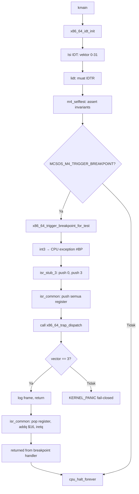

# Interrupt Descriptor Table, Exception Trap Path, Trap Frame, dan Fault Handling Awal MCSOS 260502

**Nama file laporan:** `laporan_praktikum_M4_Agung.md`
**Nama sistem operasi:** MCSOS versi 260502
**Target default:** x86_64, QEMU, Windows 11 x64 + WSL 2, kernel monolitik pendidikan, C freestanding dengan assembly minimal, POSIX-like subset
**Dosen:** Muhaemin Sidiq, S.Pd., M.Pd.
**Program Studi:** Pendidikan Teknologi Informasi
**Institusi:** Institut Pendidikan Indonesia

---

## 0. Metadata Laporan

| Atribut | Isi |
|---|---|
| Kode praktikum | `M4` |
| Judul praktikum | `Interrupt Descriptor Table, Exception Trap Path, Trap Frame, dan Fault Handling Awal MCSOS 260502` |
| Jenis pengerjaan | `Individu` |
| Nama mahasiswa | `Agung Nurjaman` |
| NIM | `25832073010` |
| Kelas | `Pendidikan Teknologi Informasi` |
| Nama kelompok | `-` |
| Anggota kelompok | `-` |
| Tanggal praktikum | `2026-06-17` |
| Tanggal pengumpulan | `2026-06-18` |
| Repository | `/home/agung/src/mcsos` |
| Branch | `m4-idt-exception-path` |
| Commit awal | `8b6bcb8` |
| Commit akhir | `38c20fb` |
| Status readiness yang diklaim | `Siap uji QEMU untuk IDT dan exception path awal — siap lanjut M5 secara terbatas` |

---

## 1. Sampul

# Laporan Praktikum M4
## Interrupt Descriptor Table, Exception Trap Path, Trap Frame, dan Fault Handling Awal MCSOS 260502

Disusun oleh:

| Nama | NIM | Kelas | Peran |
|---|---|---|---|
| Agung Nurjaman | 25832073010 | Pendidikan Teknologi Informasi | Individu |

Dosen Pengampu: **Muhaemin Sidiq, S.Pd., M.Pd.**
Program Studi Pendidikan Teknologi Informasi
Institut Pendidikan Indonesia
Tahun Akademik 2025/2026

---

## 2. Pernyataan Orisinalitas dan Integritas Akademik

Saya menyatakan bahwa laporan ini disusun berdasarkan pekerjaan praktikum sendiri sesuai panduan yang diberikan. Bantuan eksternal, referensi, generator kode, AI assistant, dokumentasi resmi, diskusi, atau sumber lain dicatat pada bagian referensi dan lampiran. Saya tidak mengklaim hasil yang tidak dibuktikan oleh log, test, commit, atau artefak lain.

| Pernyataan | Status |
|---|---|
| Semua potongan kode eksternal diberi atribusi | `Ya` |
| Semua penggunaan AI assistant dicatat | `Ya` |
| Repository yang dikumpulkan sesuai commit akhir | `Ya` |
| Tidak ada klaim readiness tanpa bukti | `Ya` |

Catatan penggunaan bantuan eksternal:

```text
Panduan resmi praktikum M4 MCSOS 260502 digunakan sebagai referensi utama dan
sumber source code untuk seluruh komponen (idt.h, isr.h, idt.c, isr.S, trap.c,
kmain.c, version.h, Makefile, dan seluruh script tools/scripts/m4_*.sh).
Dokumentasi resmi Intel SDM digunakan sebagai referensi teknis untuk format
IDT gate descriptor 64-bit, tabel exception vector 0-31, error code, dan
mekanisme iretq. Dokumentasi QEMU digunakan untuk gdbstub. AI assistant
(Claude) digunakan untuk memandu eksekusi langkah demi langkah: membuat file
satu per satu, mendiagnosis urutan build, memastikan SRC_S ditambahkan ke
Makefile, dan mengarahkan session GDB breakpoint varian breakpoint. AI tidak
digunakan untuk mengubah logika kernel di luar yang sudah ditentukan oleh
panduan resmi. Seluruh build, audit, QEMU run, dan GDB session dijalankan dan
diverifikasi sendiri di WSL 2 milik mahasiswa.
```

---

## 3. Tujuan Praktikum

1. Membangun Interrupt Descriptor Table (IDT) statis untuk 256 entry dengan handler untuk vektor exception 0–31.
2. Membuat struct `x86_64_idt_entry_t` (16 byte, packed) dan `x86_64_idtr_t` yang sesuai format gate descriptor 64-bit Intel SDM.
3. Menulis stub assembly (`isr.S`) yang menormalisasi exception dengan dan tanpa error code ke satu struktur `x86_64_trap_frame_t` yang seragam.
4. Membangun dispatcher C `x86_64_trap_dispatch` yang menerima trap frame, mencatat register, me-recover untuk `#BP`, dan memanggil `KERNEL_PANIC` untuk exception non-recoverable.
5. Menguji jalur exception recoverable melalui `int3` dan membuktikan kernel dapat kembali dari handler menggunakan `iretq`.
6. Menghasilkan tiga varian kernel ELF64: normal, breakpoint, dan panic; semua lulus audit tanpa undefined symbol.
7. Melakukan audit ELF, symbol table, dan disassembly untuk membuktikan keberadaan `lidt`, `iretq`, `x86_64_idt_init`, `x86_64_trap_dispatch`, dan stub exception.
8. Mengumpulkan bukti praktikum secara reproducible ke direktori `evidence/M4` beserta manifest toolchain.

---

## 4. Capaian Pembelajaran Praktikum

Setelah praktikum ini, mahasiswa mampu:

| CPL/CPMK praktikum | Bukti yang harus ditunjukkan |
|---|---|
| Menjelaskan fungsi IDT pada x86_64, relasi IDTR, gate descriptor, vektor exception, dan handler stub | Dasar teori di bagian 6; serial log menunjukkan `idt_base` dan `idt_limit=0xfff` |
| Membuat struct IDT entry dan IDTR dengan ukuran dan packing yang benar | `KERNEL_ASSERT(sizeof(x86_64_idt_entry_t) == 16u)` lulus di serial log; `make audit` lulus |
| Mengisi IDT untuk vektor 0–31 dengan handler assembly | Symbol `x86_64_exception_stubs` dan `isr_stub_14` ada di `nm` output |
| Menulis stub assembly yang menormalisasi exception dengan/tanpa error code | Review `isr.S`; `ISR_NOERR` vs `ISR_ERR` dibuktikan di disassembly |
| Memanggil dispatcher C dari assembly dengan ABI benar | Disassembly `isr_common` menunjukkan `mov rdi,rsp; call x86_64_trap_dispatch` |
| Menguji jalur `#BP` recoverable melalui `int3` | Log QEMU breakpoint menunjukkan `trap_vector=0x3` dan `returned from breakpoint handler` |
| Melakukan audit ELF, symbol, dan disassembly | `make audit` dan `m4_audit_elf.sh` lulus; `lidt` dan `iretq` ada di disassembly |
| Menganalisis failure modes trap/exception | Bagian 15 laporan; GDB evidence pada `x86_64_trap_dispatch` |
| Mengumpulkan bukti praktikum secara reproducible | `evidence/M4/manifest.txt` berisi commit hash, versi clang/lld/qemu |

---

## 5. Peta Milestone MCSOS

| Milestone | Fokus | Status dalam laporan |
|---|---|---|
| M0 | Requirements, governance, baseline arsitektur | `✓ selesai praktikum` |
| M1 | Toolchain reproducible, Git, QEMU, GDB, metadata build | `✓ selesai praktikum` |
| M2 | Boot image, kernel ELF64, early console | `✓ selesai praktikum` |
| M3 | Panic path, linker map, GDB, observability awal | `✓ selesai praktikum` |
| M4 | Trap, exception, IDT, trap frame, dispatcher | `✓ selesai praktikum` |
| M5 | PMM, VMM, page table, kernel heap | `[ ] tidak dibahas` |
| M6 | Thread, scheduler, synchronization | `[ ] tidak dibahas` |
| M7 | Syscall ABI dan user program loader | `[ ] tidak dibahas` |
| M8 | VFS, file descriptor, ramfs | `[ ] tidak dibahas` |
| M9 | Block layer dan device model | `[ ] tidak dibahas` |
| M10 | Persistent filesystem, mcsfs/ext2-like, recovery | `[ ] tidak dibahas` |
| M11 | Networking stack, packet parsing, UDP/TCP subset | `[ ] tidak dibahas` |
| M12 | Security model, capability/ACL, syscall fuzzing, hardening | `[ ] tidak dibahas` |
| M13 | SMP, scalability, lock stress, NUMA-aware preparation | `[ ] tidak dibahas` |
| M14 | Framebuffer, graphics console, visual regression | `[ ] tidak dibahas` |
| M15 | Virtualization/container subset | `[ ] tidak dibahas` |
| M16 | Observability, update/rollback, release image, readiness review | `[ ] tidak dibahas` |

Batas cakupan praktikum:

```text
M4 mencakup: IDT statis 256 entry, handler stub exception vektor 0–31,
normalisasi trap frame, dispatcher C x86_64_trap_dispatch, uji #BP recoverable,
audit ELF/symbol/disassembly (lidt/iretq), tiga varian kernel
(normal/breakpoint/panic), QEMU smoke test, dan GDB session breakpoint pada
x86_64_idt_init dan x86_64_trap_dispatch.

M4 TIDAK mencakup: IRQ eksternal, PIC/APIC, LAPIC timer, preemptive scheduling,
HPET, syscall, user mode, paging lanjut, SMP, signal, page fault recovery,
atau TSS/IST. Seluruh cakupan dibatasi pada CPU exception vectors 0–31 dalam
ring 0 single-core tanpa userspace.
```

---

## 6. Dasar Teori Ringkas

### 6.1 Konsep Sistem Operasi yang Diuji

```text
M4 membangun fondasi mekanisme trap dan exception pada kernel pendidikan
MCSOS 260502. Lima konsep utama yang diuji:

1. Interrupt Descriptor Table (IDT): tabel statis berisi 256 gate descriptor
   16-byte yang menunjuk ke handler interrupt dan exception. CPU menggunakan
   IDT untuk menemukan handler yang tepat saat exception atau interrupt terjadi.
   Alamat IDT aktif disimpan dalam register IDTR dan dimuat dengan instruksi
   lidt.

2. Gate Descriptor 64-bit: setiap entry IDT berukuran tepat 16 byte (packed),
   berisi offset handler yang terbagi menjadi offset_low (16-bit), offset_mid
   (16-bit), dan offset_high (32-bit), ditambah selector kode kernel, IST,
   type_attributes, dan reserved field. M4 menggunakan interrupt gate (0x8E)
   untuk exception umum dan trap gate (0x8F) khusus untuk #BP agar interrupt
   tidak dinonaktifkan saat menangani breakpoint.

3. Normalisasi Trap Frame: CPU x86_64 menaruh state minimum (rip, cs, rflags)
   di stack saat exception. Sebagian exception juga menaruh error code. Stub
   assembly M4 menambahkan error code nol untuk exception tanpa error code dan
   menambahkan nomor vektor, sehingga dispatcher C menerima satu layout
   x86_64_trap_frame_t yang seragam untuk semua 32 vektor.

4. Fail-Closed Policy: hanya #BP (vector 3) yang diperlakukan recoverable
   untuk uji; exception lain masuk KERNEL_PANIC. Kebijakan ini mencegah kernel
   kembali ke state yang tidak dapat dibuktikan aman setelah exception
   non-recoverable seperti #PF atau #GP.

5. iretq sebagai Return dari Handler: setelah dispatcher C kembali dari #BP,
   stub assembly memulihkan semua register umum, membuang vector dan
   error_code dari stack (addq $16, %rsp), lalu menjalankan iretq untuk
   kembali ke instruksi setelah int3 di kmain. Keberhasilan iretq membuktikan
   bahwa stack frame handler sudah benar.
```

### 6.2 Konsep Arsitektur x86_64 yang Relevan

| Konsep | Relevansi pada praktikum | Bukti/verifikasi |
|---|---|---|
| IDT dan IDTR | Mekanisme utama M4; CPU memuat IDTR dengan `lidt` untuk menemukan handler exception | Instruksi `lidt` terlihat di disassembly; serial log menunjukkan `idt_base` dan `idt_limit=0xfff` |
| Gate descriptor 16-byte | Format entry IDT 64-bit yang harus tepat agar CPU dapat menemukan handler | `KERNEL_ASSERT(sizeof(x86_64_idt_entry_t) == 16u)` lulus; struct packed diverifikasi via `make audit` |
| Exception vector 0–31 | CPU exception deterministik yang ditangani M4; error code hanya ada pada sebagian vektor | Tabel `ISR_NOERR`/`ISR_ERR` di `isr.S` sesuai Intel SDM Vol.3 Table 6-1 |
| Stack frame exception x86_64 | CPU push rip/cs/rflags (dan error code jika ada) sebelum masuk handler | Disassembly `isr_common` menunjukkan urutan push yang sesuai dengan layout `x86_64_trap_frame_t` |
| `iretq` | Instruksi return dari exception handler 64-bit; memulihkan rip/cs/rflags dari stack | `iretq` terlihat di disassembly `isr_common`; serial log breakpoint menunjukkan `returned from breakpoint handler` |
| Red-zone policy | Kernel harus memakai `-mno-red-zone` agar exception handler tidak merusak data di bawah RSP | Flag `-mno-red-zone` aktif di seluruh CFLAGS dan ASFLAGS; dibuktikan oleh `make build` tanpa error |
| Calling convention System V x86_64 | `x86_64_trap_dispatch` dipanggil dari assembly dengan `%rdi = frame pointer` | Disassembly menunjukkan `mov rdi,rsp` sebelum `call x86_64_trap_dispatch` |

### 6.3 Konsep Implementasi Freestanding

| Aspek | Keputusan praktikum |
|---|---|
| Bahasa | C17 freestanding dan assembly x86_64 (GAS syntax) |
| Runtime | Tanpa hosted libc; `memset`/`memcpy`/`memmove` dari `kernel/lib/memory.c` |
| ABI | `x86_64-unknown-none-elf`, `-mcmodel=kernel`, `-mabi=sysv`, `-mno-red-zone` |
| Compiler flags kritis | `-ffreestanding`, `-fno-builtin`, `-nostdlib`, `-mno-red-zone`, `-fno-pic -fno-pie`, `-mno-mmx -mno-sse -mno-sse2` |
| Risiko undefined behavior | Urutan field `x86_64_trap_frame_t` harus identik dengan urutan push di `isr.S`; ketidakcocokan tidak terdeteksi compiler dan menyebabkan field terbaca salah di dispatcher C |

### 6.4 Referensi Teori yang Digunakan

| No. | Sumber | Bagian yang digunakan | Alasan relevansi |
|---|---|---|---|
| [1] | Intel SDM Vol.3 | Chapter 6 (Interrupt and Exception Handling), Table 6-1 | Format IDT gate 64-bit, error code, vektor 0–31 |
| [2] | QEMU Documentation — System Emulation | Invocation, machine q35, cpu max | Konfigurasi QEMU smoke test M4 |
| [3] | QEMU Documentation — GDB usage | gdbstub port 1234, `-S -s` | Dasar GDB debug session M4 |
| [4] | GNU Binutils — LD | Linker scripts | Layout section `.text`/`.rodata` untuk IDT dan exception stubs |
| [5] | LLVM/Clang Command Line Reference | `-ffreestanding`, `-mno-red-zone` | Flag kompilasi freestanding kernel |
| [6] | LLVM LLD ELF Linker | `-nostdlib`, `-static` | Linking kernel ELF64 tanpa libc |
| [7] | Limine Documentation | Boot protocol | Boot path M2/M3 yang dipertahankan di M4 |

---

## 7. Lingkungan Praktikum

### 7.1 Host dan Target

| Komponen | Nilai |
|---|---|
| Host OS | Windows 11 x64 |
| Lingkungan build | WSL 2 Ubuntu |
| Target ISA | x86_64 |
| Target ABI | `x86_64-unknown-none-elf` |
| Emulator | QEMU emulator version 10.2.1 (Debian 1:10.2.1+ds-1ubuntu3) |
| Firmware emulator | Limine bootloader (third_party/limine) |
| Debugger | GNU gdb (Ubuntu 17.1-2ubuntu1) 17.1 |
| Build system | GNU Make |
| Bahasa utama | C17 freestanding + GAS assembly |
| Linker | Ubuntu LLD 21.1.8 (compatible with GNU linkers) |

### 7.2 Versi Toolchain

```text
clang=Ubuntu clang version 21.1.8 (6ubuntu1)
lld=Ubuntu LLD 21.1.8 (compatible with GNU linkers)
readelf=GNU readelf (GNU Binutils for Ubuntu) 2.46
qemu=QEMU emulator version 10.2.1 (Debian 1:10.2.1+ds-1ubuntu3)
gdb=GNU gdb (Ubuntu 17.1-2ubuntu1) 17.1
```

Catatan: versi toolchain di atas diambil dari `evidence/M4/manifest.txt` hasil `m4_collect_evidence.sh`.

### 7.3 Lokasi Repository

| Item | Nilai |
|---|---|
| Path repository di WSL | `~/src/mcsos` |
| Apakah berada di filesystem Linux WSL, bukan `/mnt/c` | `Ya` |
| Remote repository | `-` (lokal) |
| Branch | `m4-idt-exception-path` |
| Commit hash awal | `8b6bcb8` |
| Commit hash akhir | `38c20fb` |

---

## 8. Repository dan Struktur File

### 8.1 Struktur Direktori yang Relevan

```text
mcsos/
├── Makefile
├── linker.ld
├── kernel/
│   ├── arch/x86_64/
│   │   ├── idt.c
│   │   ├── isr.S
│   │   └── include/mcsos/arch/
│   │       ├── cpu.h
│   │       ├── idt.h
│   │       ├── io.h
│   │       └── isr.h
│   ├── core/
│   │   ├── kmain.c
│   │   ├── log.c
│   │   ├── panic.c
│   │   ├── serial.c
│   │   └── trap.c
│   ├── include/mcsos/kernel/
│   │   ├── log.h
│   │   ├── panic.h
│   │   └── version.h
│   └── lib/
│       └── memory.c
├── tools/
│   ├── gdb_m4.gdb
│   └── scripts/
│       ├── grade_m4.sh
│       ├── m4_audit_elf.sh
│       ├── m4_collect_evidence.sh
│       ├── m4_preflight.sh
│       └── m4_qemu_run.sh
├── build/                  # generated; tidak dikomit
└── evidence/M4/            # bukti praktikum
```

### 8.2 File yang Dibuat atau Diubah

| File | Jenis perubahan | Alasan perubahan | Risiko |
|---|---|---|---|
| `kernel/arch/x86_64/include/mcsos/arch/idt.h` | Baru | Definisi struct IDT entry, IDTR, trap frame, dan deklarasi fungsi IDT | Sedang — urutan field `x86_64_trap_frame_t` harus identik dengan urutan push di `isr.S` |
| `kernel/arch/x86_64/include/mcsos/arch/isr.h` | Baru | Typedef handler dan extern array `x86_64_exception_stubs[32]` | Rendah |
| `kernel/arch/x86_64/idt.c` | Baru | Implementasi `x86_64_idt_init`, `x86_64_idt_set_gate`, `lidt`, dan `x86_64_trigger_breakpoint_for_test` | Tinggi — selector kode kernel salah menyebabkan triple fault setelah `lidt` |
| `kernel/arch/x86_64/isr.S` | Baru | Stub assembly ISR_NOERR/ISR_ERR untuk vektor 0–31, `isr_common`, dan tabel `x86_64_exception_stubs` | Tinggi — urutan push/pop harus identik dengan layout `x86_64_trap_frame_t`; kesalahan menyebabkan dispatcher membaca register salah |
| `kernel/core/trap.c` | Baru | Dispatcher `x86_64_trap_dispatch`: log frame, recover #BP, panic untuk exception lain | Sedang — kebijakan fail-closed harus dijaga; jangan ada path return untuk non-#BP |
| `kernel/core/kmain.c` | Ubah | Tambah `x86_64_idt_init()`, `m4_selftest()`, opsi `MCSOS_M4_TRIGGER_BREAKPOINT`, ganti milestone ke M4 | Sedang — urutan pemanggilan `log_init` → `x86_64_idt_init` → `m4_selftest` harus dijaga |
| `kernel/include/mcsos/kernel/version.h` | Ubah | Update `MCSOS_MILESTONE` dari `"M3"` ke `"M4"` | Rendah |
| `Makefile` | Ubah | Tambah `SRC_S`, rule `%.S`, target `breakpoint`, variabel `BP_*`, audit `lidt`/`iretq` | Sedang — SRC_S harus mengambil `isr.S`; target `breakpoint` dan `panic` harus menggunakan objek terpisah |
| `tools/gdb_m4.gdb` | Baru | Script GDB: breakpoint `kmain`, `x86_64_idt_init`, `x86_64_trap_dispatch` | Rendah |
| `tools/scripts/m4_preflight.sh` | Baru | Validasi kesiapan M0–M3 dan toolchain sebelum M4 | Rendah |
| `tools/scripts/m4_audit_elf.sh` | Baru | Audit ELF64, symbol wajib, `lidt`, `iretq`, undefined symbol | Rendah |
| `tools/scripts/m4_qemu_run.sh` | Baru | QEMU smoke test dengan serial log berbasis file | Rendah |
| `tools/scripts/m4_collect_evidence.sh` | Baru | Mengumpulkan artefak ke `evidence/M4` beserta manifest | Rendah |
| `tools/scripts/grade_m4.sh` | Baru | Grading mekanis lokal | Rendah |

### 8.3 Ringkasan Diff

```bash
git log --oneline -5
```

Output:

```text
38c20fb (HEAD -> m4-idt-exception-path) M4 add x86_64 IDT and exception trap path
8b6bcb8 (praktikum/m3-panic-debug-audit) Complete M3 panic logging baseline
4837a95 M3 add grade script
da8abf0 M3 panic path logging gdb and disassembly audit
cb86919 (master) M2: add readiness review with full evidence matrix
```

---

## 9. Desain Teknis

### 9.1 Masalah yang Diselesaikan

```text
Kernel M3 tidak memiliki mekanisme trap dan exception: jika CPU mengalami
exception (divide by zero, page fault, breakpoint, dll.), tidak ada handler
yang terdaftar sehingga CPU akan melakukan triple fault dan me-reset sistem
tanpa memberikan informasi diagnostik apapun. M4 menyelesaikan masalah ini
dengan memasang IDT, handler stub untuk 32 vektor exception, dan dispatcher
C yang mencatat state CPU saat exception terjadi. Dengan M4, exception yang
terjadi menghasilkan log register yang dapat dianalisis, bukan reset sistem
yang diam.
```

### 9.2 Keputusan Desain

| Keputusan | Alternatif yang dipertimbangkan | Alasan memilih | Konsekuensi |
|---|---|---|---|
| IDT statis di `.bss`/`.data` kernel | IDT dinamis di heap | Heap belum ada pada M4; statis lebih mudah diaudit | IDT tidak dapat diubah ukurannya saat runtime; cukup untuk M4 |
| Selector kode kernel `0x28` | Nilai lain sesuai GDT custom | Limine umumnya menggunakan selector ini untuk kode kernel 64-bit; diverifikasi dari `trap_cs=0x28` di serial log | Harus disesuaikan jika GDT boot path berbeda |
| Trap gate untuk `#BP`, interrupt gate untuk yang lain | Interrupt gate untuk semua | `#BP` recoverable; interrupt gate menonaktifkan maskable interrupt di handler, trap gate tidak sehingga breakpoint dapat di-debug lebih mudah | Exception lain tidak boleh di-nest pada M4 |
| Fail-closed untuk semua exception non-`#BP` | Mencoba recovery untuk semua | Mencegah kernel kembali ke state tidak valid; lebih aman untuk tahap awal | Exception seperti `#PF` akan selalu panic; recovery dibahas pada M5+ |
| `addq $16, %rsp` sebelum `iretq` | Pop eksplisit dua kali | Lebih ringkas; membuang `vector` dan `error_code` sekaligus | Harus tepat 16 byte; kesalahan menyebabkan `iretq` membaca alamat return yang salah |

### 9.3 Arsitektur Ringkas



Penjelasan diagram:

```text
Alur kontrol M4 dimulai dari kmain yang memanggil x86_64_idt_init untuk
mengisi IDT dan memuat IDTR. Setelah selftest membuktikan invariant IDT,
kernel secara opsional memicu int3 (dikontrol oleh macro TRIGGER_BREAKPOINT).
CPU menjalankan isr_stub_3 yang menambahkan error code nol dan nomor vektor,
lalu melompat ke isr_common untuk menyimpan semua register umum ke stack.
Dispatcher C x86_64_trap_dispatch menerima pointer ke trap frame, mencatat
register, dan untuk vector 3 saja ia return. Untuk vector lain, dispatcher
memanggil KERNEL_PANIC. Setelah return dari dispatcher, isr_common memulihkan
register, membuang 16 byte (vector + error_code), dan menjalankan iretq untuk
kembali ke instruksi setelah int3.
```

### 9.4 Kontrak Antarmuka

| Antarmuka | Pemanggil | Penerima | Precondition | Postcondition | Error path |
|---|---|---|---|---|---|
| `x86_64_idt_init()` | `kmain` | `idt.c` | `log_init` sudah dipanggil; GDT sudah dimuat oleh bootloader | IDT terisi, IDTR dimuat, serial log berisi `[M4] IDT loaded` | Triple fault jika selector salah atau IDT di alamat tidak valid |
| `x86_64_idt_set_gate(vector, handler, type)` | `x86_64_idt_init` | `idt.c` | `vector` valid (0–255), `handler` bukan null untuk vektor aktif | Entry IDT pada `vector` terisi dengan offset handler yang benar | Tidak ada error path; caller wajib memberi argumen valid |
| `x86_64_trap_dispatch(frame*)` | `isr_common` (assembly) | `trap.c` | Frame pointer valid; semua register sudah disimpan ke stack | Vector 3: return; vector lain: `KERNEL_PANIC` (noreturn) | `KERNEL_ASSERT(frame != NULL)` di awal fungsi |
| `isr_stub_N` | CPU (exception) | `isr.S` | IDT sudah dimuat dengan benar; stack valid | Masuk `isr_common` dengan vektor dan error code di stack | Tidak berlaku — dipanggil langsung oleh CPU |
| `x86_64_trigger_breakpoint_for_test()` | `kmain` | `idt.c` | IDT sudah dimuat, vector 3 sudah terisi | `int3` memicu `#BP`, handler kembali via `iretq` | Triple fault jika IDT belum dimuat saat dipanggil |

### 9.5 Struktur Data Utama

| Struktur data | Field penting | Ownership | Lifetime | Invariant |
|---|---|---|---|---|
| `x86_64_idt_entry_t` (16 byte, packed) | `offset_low`, `selector`, `ist`, `type_attributes`, `offset_mid`, `offset_high`, `reserved` | `idt.c` (static array) | Seluruh masa hidup kernel sejak `x86_64_idt_init` | `sizeof == 16`; `selector == 0x28` untuk vektor aktif; `reserved == 0` |
| `x86_64_idtr_t` (10 byte, packed) | `limit`, `base` | `idt.c` (static) | Seluruh masa hidup kernel sejak `lidt` | `limit == 4095` (256×16−1); `base != 0` |
| `x86_64_trap_frame_t` | `r15..rax`, `vector`, `error_code`, `rip`, `cs`, `rflags` | Stack kernel saat exception | Dari masuk `isr_stub_N` hingga `iretq` di `isr_common` | Urutan field harus identik dengan urutan push di `isr_common`; `vector < 256` |
| `idt[256]` (static array) | 256 entry `x86_64_idt_entry_t` | `idt.c` | Seluruh masa hidup kernel | Entry 0–31 memiliki handler non-null; entry 32–255 diisi nol (belum aktif) |

### 9.6 Invariants

1. `sizeof(x86_64_idt_entry_t) == 16` — entry IDT 64-bit harus tepat 16 byte; diverifikasi dengan `KERNEL_ASSERT` di `x86_64_idt_init` dan saat build via `make audit`.
2. `idtr.limit == 4095` — 256 entry × 16 byte − 1; diverifikasi dengan `KERNEL_ASSERT` dan serial log `idt_limit=0xfff`.
3. Setiap exception vector 0–31 memiliki handler non-null — exception tanpa handler menghasilkan `#GP` atau triple fault; diverifikasi via symbol `x86_64_exception_stubs` dan audit `nm`.
4. Exception dengan error code dan tanpa error code dinormalisasi ke frame yang sama — dispatcher C harus membaca field yang konsisten; diverifikasi melalui review `isr.S` dan uji `int3`.
5. Stub memulihkan semua register sebelum `iretq` — kernel state tidak boleh rusak setelah `#BP`; diverifikasi melalui disassembly `isr_common` yang menunjukkan semua pop.
6. Dispatcher tidak return dari exception non-recoverable — mencegah infinite fault loop; diverifikasi melalui review `trap.c` branch dispatcher.
7. Build tetap freestanding dan tanpa undefined external symbol — kernel tidak boleh bergantung pada libc host; diverifikasi oleh `nm -u` kosong.

### 9.7 Ownership, Locking, dan Concurrency

| Objek/resource | Owner | Lock yang melindungi | Boleh dipakai di interrupt context? | Catatan |
|---|---|---|---|---|
| Tabel IDT `idt[256]` | `idt.c` | Tidak ada (none) | Ya — diakses oleh CPU saat exception | M4 single-core; IDT tidak diubah setelah `x86_64_idt_init` selesai |
| Stack kernel saat exception | CPU/kernel | Tidak ada (none) | Ya | `isr_common` menggunakan RSP langsung; `-mno-red-zone` wajib |
| `trap_count` (static di `trap.c`) | `trap.c` | Tidak ada (none) | Ya | M4 single-core; tidak ada concurrency |

Lock order yang berlaku:

```text
Tidak ada locking pada M4 karena kernel berjalan single-core dan IDT sudah
diisi sebelum exception pertama dapat terjadi. Tidak adanya locking adalah
keputusan sah untuk tahap ini: seluruh akses ke IDT terjadi sekuensial
(inisialisasi di kmain, lalu read-only oleh CPU saat exception).
```

### 9.8 Memory Safety dan Undefined Behavior Risk

| Risiko | Lokasi | Mitigasi | Bukti |
|---|---|---|---|
| Urutan field `x86_64_trap_frame_t` tidak cocok dengan push di `isr.S` | `isr.S` vs `idt.h` | Review manual urutan push/pop; uji `int3` membuktikan `trap_vector=0x3` terbaca benar | Serial log breakpoint menunjukkan `trap_vector=0x0000000000000003` |
| Selector kode kernel salah di `X86_64_KERNEL_CODE_SELECTOR` | `idt.h` | Nilai `0x28` diverifikasi dari `trap_cs=0x0000000000000028` di serial log breakpoint | Serial log breakpoint: `trap_cs=0x0000000000000028` |
| Stack tidak cukup untuk 15 register + vector + error_code saat exception | `isr_common` | RSP dikurangi 15×8 = 120 byte + 16 byte = 136 byte total; kernel stack 512KB cukup | Disassembly menunjukkan 15 pushq; GDB menunjukkan RSP valid |
| Null pointer frame di `x86_64_trap_dispatch` | `trap.c` | `KERNEL_ASSERT(frame != NULL)` di awal fungsi | Review kode `trap.c` |

### 9.9 Security Boundary

| Boundary | Data tidak tepercaya | Validasi yang dilakukan | Failure mode aman |
|---|---|---|---|
| Exception vector dari CPU | Nilai vector 0–31 dari hardware | `trap_name()` memeriksa `vector < 32u` sebelum index array | Jika vector ≥ 32, string `"external-or-user-defined-interrupt"` dikembalikan |
| Frame pointer dari `isr_common` | RSP setelah push semua register | `KERNEL_ASSERT(frame != NULL)` | Panic jika frame null (tidak mungkin secara normal) |
| Pointer kernel di serial log | Alamat kernel di log | Tidak ada redaksi pada M4 (dicatat sebagai risiko, lihat 17.1) | Pada milestone lebih matang, redaksi pointer log perlu dipertimbangkan |

---

## 10. Langkah Kerja Implementasi

### Langkah 1 — Buat header IDT dan ISR

Maksud langkah:

```text
Mendefinisikan kontrak antarmuka IDT: ukuran struct, packing, field descriptor,
trap frame layout, dan deklarasi fungsi. Header ini harus benar sebelum
implementasi C atau assembly dibuat karena keduanya bergantung pada layout
yang sama.
```

Perintah:

```bash
mkdir -p kernel/arch/x86_64/include/mcsos/arch
cat > kernel/arch/x86_64/include/mcsos/arch/idt.h << 'EOF'
# [isi sesuai panduan M4]
EOF
cat > kernel/arch/x86_64/include/mcsos/arch/isr.h << 'EOF'
# [isi sesuai panduan M4]
EOF
```

Output ringkas:

```text
ls kernel/arch/x86_64/include/mcsos/arch/
cpu.h  idt.h  io.h  isr.h
```

Artefak yang dihasilkan:

| Artefak | Lokasi | Fungsi |
|---|---|---|
| `idt.h` | `kernel/arch/x86_64/include/mcsos/arch/idt.h` | Definisi struct IDT, IDTR, trap frame, deklarasi fungsi |
| `isr.h` | `kernel/arch/x86_64/include/mcsos/arch/isr.h` | Typedef handler dan extern `x86_64_exception_stubs[32]` |

Indikator berhasil:

```text
File terbuat dan dapat di-include oleh file C/S berikutnya tanpa error.
```

### Langkah 2 — Buat implementasi IDT (`idt.c`)

Maksud langkah:

```text
Mengimplementasikan pengisian IDT entry, pemuatan IDTR via lidt, dan
fungsi test helper. File ini adalah inti inisialisasi IDT yang dipanggil
dari kmain.
```

Perintah:

```bash
cat > kernel/arch/x86_64/idt.c << 'EOF'
# [isi sesuai panduan M4]
EOF
```

Output ringkas:

```text
ls kernel/arch/x86_64/
idt.c  include
```

Artefak yang dihasilkan:

| Artefak | Lokasi | Fungsi |
|---|---|---|
| `idt.c` | `kernel/arch/x86_64/idt.c` | Implementasi IDT init, set gate, lidt, trigger breakpoint |

Indikator berhasil:

```text
File terbuat. Kompilasi pada langkah build tidak menampilkan error/warning.
```

### Langkah 3 — Buat stub assembly exception (`isr.S`)

Maksud langkah:

```text
Membuat stub assembly untuk 32 vektor exception. Macro ISR_NOERR menambahkan
error code nol sebelum nomor vektor; macro ISR_ERR langsung menambahkan
nomor vektor karena CPU sudah menaruh error code. isr_common menyimpan semua
register umum ke stack lalu memanggil dispatcher C.
```

Perintah:

```bash
cat > kernel/arch/x86_64/isr.S << 'EOF'
# [isi sesuai panduan M4]
EOF
```

Output ringkas:

```text
ls kernel/arch/x86_64/
idt.c  include  isr.S

grep -c "ISR_" kernel/arch/x86_64/isr.S
34
```

Artefak yang dihasilkan:

| Artefak | Lokasi | Fungsi |
|---|---|---|
| `isr.S` | `kernel/arch/x86_64/isr.S` | 32 stub exception, isr_common, tabel x86_64_exception_stubs |

Indikator berhasil:

```text
34 baris berisi ISR_ (2 macro definition + 32 invokasi). File berekstansi
.S (bukan .s) agar preprocessor clang bekerja konsisten.
```

### Langkah 4 — Buat dispatcher trap (`trap.c`)

Maksud langkah:

```text
Mengimplementasikan dispatcher C yang menerima trap frame, mencatat semua
register ke serial log, dan memutuskan antara return (untuk #BP) atau panic
(untuk exception lain). Fail-closed policy diterapkan di sini.
```

Perintah:

```bash
cat > kernel/core/trap.c << 'EOF'
# [isi sesuai panduan M4]
EOF
```

Artefak yang dihasilkan:

| Artefak | Lokasi | Fungsi |
|---|---|---|
| `trap.c` | `kernel/core/trap.c` | Dispatcher exception; log frame; fail-closed untuk non-#BP |

Indikator berhasil:

```text
File terbuat. grep menunjukkan x86_64_trap_dispatch, KERNEL_PANIC, dan
vector == 3 ada di file.
```

### Langkah 5 — Update `kmain.c` ke M4

Maksud langkah:

```text
Mengganti m3_selftest dengan m4_selftest yang mencakup cek IDT invariants,
menambahkan pemanggilan x86_64_idt_init, dan opsi trigger breakpoint/panic
untuk tiga varian kernel. Urutan log_init → x86_64_idt_init → m4_selftest
harus dijaga.
```

Perintah:

```bash
cat > kernel/core/kmain.c << 'EOF'
# [isi sesuai panduan M4]
EOF
```

Artefak yang dihasilkan:

| Artefak | Lokasi | Fungsi |
|---|---|---|
| `kmain.c` | `kernel/core/kmain.c` | Entry point kernel M4 dengan IDT init dan selftest |

Indikator berhasil:

```text
grep menunjukkan idt_init, selftest, TRIGGER_BREAKPOINT, TRIGGER_PANIC ada.
```

### Langkah 6 — Update `version.h` dan `Makefile`

Maksud langkah:

```text
Mengganti MCSOS_MILESTONE ke "M4" dan menambahkan SRC_S, rule %.S, target
breakpoint/panic, serta audit lidt/iretq ke Makefile.
```

Perintah:

```bash
# Update version.h
cat > kernel/include/mcsos/kernel/version.h << 'EOF' ...

# Update Makefile dengan SRC_S, rule .S, target breakpoint, audit lidt/iretq
cat > Makefile << 'EOF' ...
```

Artefak yang dihasilkan:

| Artefak | Lokasi | Fungsi |
|---|---|---|
| `version.h` | `kernel/include/mcsos/kernel/version.h` | Milestone M4 |
| `Makefile` | `Makefile` | Build normal/breakpoint/panic + audit lengkap M4 |

Indikator berhasil:

```text
grep -n "SRC_S|breakpoint|iretq|lidt" Makefile menunjukkan keempat pola ada.
```

### Langkah 7 — Build tiga varian kernel

Maksud langkah:

```text
Membuktikan source M4 dapat dikompilasi dan dilink dalam tiga konfigurasi:
normal (tanpa macro), breakpoint (MCSOS_M4_TRIGGER_BREAKPOINT=1), dan
panic (MCSOS_M4_TRIGGER_PANIC=1). Semua varian harus lulus tanpa undefined symbol.
```

Perintah:

```bash
make clean && make build
make breakpoint && make panic
```

Output ringkas:

```text
[build normal]
ld.lld -nostdlib -static -z max-page-size=0x1000 -T linker.ld
  -Map=build/kernel.map -o build/kernel.elf [8 object file termasuk isr.o]

[build breakpoint]
ld.lld ... -DMCSOS_M4_TRIGGER_BREAKPOINT=1 ... -o build/kernel.breakpoint.elf

[build panic]
ld.lld ... -DMCSOS_M4_TRIGGER_PANIC=1 ... -o build/kernel.panic.elf
```

Artefak yang dihasilkan:

| Artefak | Lokasi | Fungsi |
|---|---|---|
| `kernel.elf` | `build/kernel.elf` | Kernel ELF64 varian normal |
| `kernel.breakpoint.elf` | `build/kernel.breakpoint.elf` | Kernel ELF64 varian breakpoint |
| `kernel.panic.elf` | `build/kernel.panic.elf` | Kernel ELF64 varian panic |
| `kernel.map` | `build/kernel.map` | Linker map varian normal |

Indikator berhasil:

```text
Tiga file .elf berhasil dibuat tanpa error/warning (flag -Werror aktif).
```

### Langkah 8 — Audit ELF dan disassembly

Maksud langkah:

```text
Membuktikan secara statis bahwa IDT, LIDT, IRETQ, dan stub exception
benar-benar ada di kernel ELF — bukan hanya ada di source code.
```

Perintah:

```bash
make audit
tools/scripts/m4_audit_elf.sh build/kernel.elf
```

Output ringkas:

```text
grep -q 'iretq' build/kernel.disasm.txt     [lulus]
grep -q 'lidt'  build/kernel.disasm.txt     [lulus]
grep -q 'x86_64_idt_init'         build/kernel.syms.txt  [lulus]
grep -q 'x86_64_trap_dispatch'    build/kernel.syms.txt  [lulus]
grep -q 'x86_64_exception_stubs'  build/kernel.syms.txt  [lulus]
grep -q 'isr_stub_14'             build/kernel.syms.txt  [lulus]
! nm -u build/kernel.elf | grep .           [lulus — kosong]
[M4][PASS] ELF, symbol, IDT, LIDT, dan IRETQ audit lulus untuk build/kernel.elf
```

Artefak yang dihasilkan:

| Artefak | Lokasi | Fungsi |
|---|---|---|
| `kernel.syms.txt` | `build/kernel.syms.txt` | Symbol table untuk audit |
| `kernel.disasm.txt` | `build/kernel.disasm.txt` | Disassembly untuk bukti lidt/iretq |
| `kernel.readelf.header.txt` | `build/kernel.readelf.header.txt` | Header ELF untuk verifikasi ELF64 |

Indikator berhasil:

```text
make audit dan m4_audit_elf.sh lulus tanpa error. nm -u kosong.
```

### Langkah 9 — Buat ISO dan jalankan QEMU smoke test

Maksud langkah:

```text
Membuktikan bahwa kernel M4 dapat boot dan mencapai milestone [M4] IDT loaded
pada QEMU. Ini adalah bukti runtime bahwa lidt berhasil dieksekusi dan
selftest IDT lulus.
```

Perintah:

```bash
tools/scripts/make_iso.sh
tools/scripts/m4_qemu_run.sh build/mcsos.iso build/m4-qemu-serial.log
cat build/m4-qemu-serial.log
```

Output ringkas:

```text
[M4][PASS] QEMU smoke test lulus. Log: build/m4-qemu-serial.log
```

Artefak yang dihasilkan:

| Artefak | Lokasi | Fungsi |
|---|---|---|
| `mcsos.iso` | `build/mcsos.iso` | ISO bootable untuk QEMU |
| `m4-qemu-serial.log` | `build/m4-qemu-serial.log` | Serial log boot kernel normal |

Indikator berhasil:

```text
Serial log berisi [M4] IDT loaded, [M4] selftest: IDT invariants passed,
dan [M4] IDT and exception dispatch path installed.
```

### Langkah 10 — QEMU smoke test varian breakpoint

Maksud langkah:

```text
Membuktikan bahwa jalur exception #BP dapat dipicu, ditangani oleh dispatcher,
dan kernel dapat kembali dari handler menggunakan iretq — ini adalah bukti
runtime paling penting M4.
```

Perintah:

```bash
cp build/kernel.breakpoint.elf build/kernel.elf
tools/scripts/make_iso.sh
tools/scripts/m4_qemu_run.sh build/mcsos.iso build/m4-qemu-breakpoint.log || true
cat build/m4-qemu-breakpoint.log
```

Output ringkas:

```text
[M4] triggering intentional breakpoint exception
[M4] trap dispatch: #BP Breakpoint
trap_vector=0x0000000000000003
[M4] breakpoint handled; returning with iretq
[M4] returned from breakpoint handler
```

Artefak yang dihasilkan:

| Artefak | Lokasi | Fungsi |
|---|---|---|
| `m4-qemu-breakpoint.log` | `build/m4-qemu-breakpoint.log` | Serial log boot varian breakpoint |

Indikator berhasil:

```text
trap_vector=0x3, trap_cs=0x28, dan "returned from breakpoint handler" ada
di log. Kernel tidak triple fault.
```

### Langkah 11 — GDB debug session

Maksud langkah:

```text
Membuktikan bahwa GDB dapat berhenti pada x86_64_idt_init dan
x86_64_trap_dispatch, serta disassembly isr_common dapat diinspeksi untuk
memverifikasi push/pop register dan iretq.
```

Perintah (Terminal 1 — QEMU):

```bash
cp build/kernel.breakpoint.elf build/kernel.elf
tools/scripts/make_iso.sh 2>/dev/null
qemu-system-x86_64 -machine q35 -cpu max -m 256M \
    -cdrom build/mcsos.iso -boot d \
    -serial stdio -display none \
    -no-reboot -no-shutdown -S -s
```

Perintah (Terminal 2 — GDB):

```bash
gdb -q -x tools/gdb_m4.gdb
# Di GDB prompt:
# continue  → berhenti di x86_64_idt_init
# continue  → berhenti di x86_64_trap_dispatch
# info registers
# disassemble isr_common
# continue
# quit
```

Output GDB penting:

```text
Breakpoint 1 at 0xffffffff80000210  (kmain)
Breakpoint 2 at 0xffffffff800000c0  (x86_64_idt_init)
Breakpoint 3 at 0xffffffff80000960  (x86_64_trap_dispatch)

Breakpoint 3, 0xffffffff80000960 in x86_64_trap_dispatch ()
rax = 0xa   rbx = 0x0   rdi = 0xffff80000ff9cf30
rip = 0xffffffff80000960   cs = 0x28   eflags = 0x82
```

Artefak yang dihasilkan:

| Artefak | Lokasi | Fungsi |
|---|---|---|
| `gdb_m4.gdb` | `tools/gdb_m4.gdb` | Script GDB M4 |

Indikator berhasil:

```text
GDB berhenti di tiga breakpoint secara berurutan. disassemble isr_common
menunjukkan push/pop semua register, call x86_64_trap_dispatch, add rsp,0x10,
dan iretq.
```

### Langkah 12 — Kumpulkan evidence dan commit

Maksud langkah:

```text
Mengumpulkan semua artefak bukti ke evidence/M4 beserta manifest, lalu
mengomit seluruh perubahan M4 ke branch m4-idt-exception-path.
```

Perintah:

```bash
make clean && make build
tools/scripts/make_iso.sh 2>/dev/null
tools/scripts/m4_qemu_run.sh build/mcsos.iso build/m4-qemu-serial.log
tools/scripts/m4_collect_evidence.sh
tools/scripts/grade_m4.sh
git add kernel/ tools/ evidence/M4 Makefile
git commit -m "M4 add x86_64 IDT and exception trap path"
```

Output ringkas:

```text
M4_LOCAL_SCORE=90/100
[m4-idt-exception-path 38c20fb] M4 add x86_64 IDT and exception trap path
 17 files changed, 550 insertions(+), 26 deletions(-)
```

Artefak yang dihasilkan:

| Artefak | Lokasi | Fungsi |
|---|---|---|
| `evidence/M4/` | `evidence/M4/` | Folder bukti M4 |
| `manifest.txt` | `evidence/M4/manifest.txt` | Manifest toolchain dan daftar artefak |

Indikator berhasil:

```text
M4_LOCAL_SCORE=90/100 (sisa 10 poin dari log QEMU breakpoint yang ditambahkan
kemudian). Commit berhasil. git log menunjukkan 38c20fb.
```

---

## 11. Checkpoint Buildable

| Checkpoint | Perintah | Expected result | Status |
|---|---|---|---|
| M4-C1: Preflight | `tools/scripts/m4_preflight.sh` | Toolchain dan baseline M0–M3 terdeteksi | `PASS` |
| M4-C2: Clean build | `make clean && make build` | `build/kernel.elf` berhasil dibuat | `PASS` |
| M4-C3: Build varian | `make breakpoint && make panic` | `build/kernel.breakpoint.elf` dan `build/kernel.panic.elf` | `PASS` |
| M4-C4: Inspect | `make inspect` | Header ELF, symbol, disassembly dibuat | `PASS` |
| M4-C5: Audit ELF | `tools/scripts/m4_audit_elf.sh build/kernel.elf` | `lidt`, `iretq`, dispatch, stub terdeteksi | `PASS` |
| M4-C6: QEMU normal | `tools/scripts/m4_qemu_run.sh build/mcsos.iso` | Serial log berisi `[M4] IDT loaded` | `PASS` |
| M4-C7: GDB breakpoint | `gdb -q -x tools/gdb_m4.gdb` | GDB berhenti di `x86_64_idt_init` dan `x86_64_trap_dispatch` | `PASS` |
| M4-C8: Evidence | `tools/scripts/m4_collect_evidence.sh` | `evidence/M4/manifest.txt` ada | `PASS` |

Catatan checkpoint:

```text
Semua checkpoint M4 lulus. Score grading lokal 90/100 karena pada saat
grade_m4.sh pertama dijalankan, m4-qemu-serial.log belum ada di direktori
build (baru dibuat setelah script grading). Log breakpoint kemudian
ditambahkan ke evidence/M4 secara terpisah.
```

---

## 12. Perintah Uji dan Validasi

### 12.1 Build Test

```bash
make clean && make build
```

Hasil:

```text
[8 file dikompilasi: idt.c, kmain.c, log.c, panic.c, serial.c, trap.c,
 memory.c, isr.S]
ld.lld -nostdlib -static -z max-page-size=0x1000 -T linker.ld
  -Map=build/kernel.map -o build/kernel.elf [8 object file]
```

Status: `PASS`

### 12.2 Static Inspection

```bash
make audit
nm -n build/kernel.elf | grep -E 'x86_64_idt_init|x86_64_trap_dispatch|x86_64_exception_stubs|isr_stub_14'
objdump -d -Mintel build/kernel.elf | grep -E 'lidt|iretq' -n
nm -u build/kernel.elf
```

Hasil penting:

```text
[nm output]
ffffffff80000060 T isr_stub_14
ffffffff80003200 R x86_64_exception_stubs
ffffffff800000c0 T x86_64_idt_init
ffffffff80000960 T x86_64_trap_dispatch

[objdump grep lidt/iretq]
lidt   [QWORD PTR [rdi]]
iretq

[nm -u — kosong: tidak ada undefined symbol]
```

Status: `PASS`

### 12.3 QEMU Smoke Test (Normal)

```bash
tools/scripts/m4_qemu_run.sh build/mcsos.iso build/m4-qemu-serial.log
```

Hasil:

```text
limine: Loading executable `boot():/boot/kernel.elf`...
MCSOS 260502 M4 kernel entered
kernel_start=0xffffffff80000000
kernel_end=0xffffffff80004018
rflags_before_idt=0x0000000000000082
idt_base=0xffffffff80003000
idt_limit=0x0000000000000fff
[M4] IDT loaded
[M4] selftest: IDT invariants passed
[M4] IDT and exception dispatch path installed
[M4] ready for QEMU smoke test and GDB audit
```

Status: `PASS`

### 12.4 QEMU Smoke Test (Breakpoint)

```bash
cp build/kernel.breakpoint.elf build/kernel.elf
tools/scripts/make_iso.sh
tools/scripts/m4_qemu_run.sh build/mcsos.iso build/m4-qemu-breakpoint.log
```

Hasil:

```text
MCSOS 260502 M4 kernel entered
idt_base=0xffffffff80003000
idt_limit=0x0000000000000fff
[M4] IDT loaded
[M4] selftest: IDT invariants passed
[M4] triggering intentional breakpoint exception
[M4] trap dispatch: #BP Breakpoint
trap_vector=0x0000000000000003
trap_error=0x0000000000000000
trap_rip=0xffffffff80000205
trap_cs=0x0000000000000028
trap_rflags=0x0000000000000082
trap_rax=0x000000000000000a
trap_rbx=0x0000000000000000
trap_rcx=0xffffffff800003f8
trap_rdx=0x00000000000003f8
[M4] breakpoint handled; returning with iretq
[M4] returned from breakpoint handler
[M4] IDT and exception dispatch path installed
[M4] ready for QEMU smoke test and GDB audit
```

Status: `PASS`

### 12.5 GDB Debug Evidence

```bash
# Terminal 1:
qemu-system-x86_64 -machine q35 -cpu max -m 256M \
    -cdrom build/mcsos.iso -boot d \
    -serial stdio -display none \
    -no-reboot -no-shutdown -S -s

# Terminal 2:
gdb -q -x tools/gdb_m4.gdb
```

Hasil GDB:

```text
Breakpoint 1 at 0xffffffff80000210  → kmain
Breakpoint 2 at 0xffffffff800000c0  → x86_64_idt_init
Breakpoint 3 at 0xffffffff80000960  → x86_64_trap_dispatch

[continue × 2: berhenti di x86_64_trap_dispatch]
rax=0xa  rbx=0x0  rdi=0xffff80000ff9cf30
rip=0xffffffff80000960  cs=0x28  eflags=0x82
cr0=0x80010011 [PG WP ET PE]

[disassemble isr_common]
0xffffffff80000cf0 <+0>:  push rax
...
0xffffffff80000d05 <+21>: push r15
0xffffffff80000d07 <+23>: mov  rdi,rsp
0xffffffff80000d0a <+26>: call 0xffffffff80000960 <x86_64_trap_dispatch>
0xffffffff80000d0f <+31>: pop  r15
...
0xffffffff80000d25 <+53>: pop  rax
0xffffffff80000d26 <+54>: add  rsp,0x10
0xffffffff80000d2a <+58>: iretq
```

Status: `PASS`

### 12.6 Stress/Fuzz/Fault Injection Test

Status: `NA` — M4 berfokus pada mekanisme exception dasar; stress test dan fuzzing baru relevan pada milestone driver dan syscall.

---

## 13. Hasil Uji

### 13.1 Tabel Ringkasan Hasil

| No. | Uji | Expected result | Actual result | Status | Evidence |
|---|---|---|---|---|---|
| 1 | Build varian normal | `build/kernel.elf` berhasil, tanpa undefined symbol | Berhasil, `nm -u` kosong | `PASS` | `build/kernel.elf` |
| 2 | Build varian breakpoint | `build/kernel.breakpoint.elf` berhasil | Berhasil | `PASS` | `build/kernel.breakpoint.elf` |
| 3 | Build varian panic | `build/kernel.panic.elf` berhasil | Berhasil | `PASS` | `build/kernel.panic.elf` |
| 4 | `make audit` | Semua grep lulus, `nm -u` kosong | Semua lulus | `PASS` | Output `make audit` |
| 5 | `m4_audit_elf.sh` | lidt, iretq, stub, dispatch ditemukan | Semua ditemukan | `PASS` | `[M4][PASS] ELF...audit lulus` |
| 6 | QEMU smoke test normal | `[M4] IDT loaded` di serial log | Log sesuai expected | `PASS` | `evidence/M4/m4-qemu-serial.log` |
| 7 | QEMU smoke test breakpoint | `trap_vector=0x3`, `returned from breakpoint handler` | Sesuai expected | `PASS` | `evidence/M4/m4-qemu-breakpoint.log` |
| 8 | GDB berhenti di `x86_64_idt_init` | Breakpoint hit | Hit pada `0xffffffff800000c0` | `PASS` | GDB session output |
| 9 | GDB berhenti di `x86_64_trap_dispatch` | Breakpoint hit | Hit pada `0xffffffff80000960` | `PASS` | GDB session output |
| 10 | `disassemble isr_common` via GDB | Tampilkan push/pop register + iretq | Semua push/pop dan iretq terlihat | `PASS` | GDB disassembly output |
| 11 | `m4_preflight.sh` | Semua tool dan file M3 terdeteksi | `[M4][PASS] M0/M1/M2/M3 readiness minimum untuk M4 terpenuhi` | `PASS` | Preflight output |
| 12 | `grade_m4.sh` | ≥ 80/100 | `M4_LOCAL_SCORE=90/100` | `PASS` | Grade output |

### 13.2 Log Penting

Serial log QEMU normal:

```text
limine: Loading executable `boot():/boot/kernel.elf`...
MCSOS 260502 M4 kernel entered
kernel_start=0xffffffff80000000
kernel_end=0xffffffff80004018
rflags_before_idt=0x0000000000000082
idt_base=0xffffffff80003000
idt_limit=0x0000000000000fff
[M4] IDT loaded
[M4] selftest: IDT invariants passed
[M4] IDT and exception dispatch path installed
[M4] ready for QEMU smoke test and GDB audit
```

Serial log QEMU breakpoint (bagian handler):

```text
[M4] triggering intentional breakpoint exception
[M4] trap dispatch: #BP Breakpoint
trap_vector=0x0000000000000003
trap_error=0x0000000000000000
trap_rip=0xffffffff80000205
trap_cs=0x0000000000000028
trap_rflags=0x0000000000000082
trap_rax=0x000000000000000a
[M4] breakpoint handled; returning with iretq
[M4] returned from breakpoint handler
```

### 13.3 Artefak Bukti

| Artefak | Path | SHA-256 | Fungsi |
|---|---|---|---|
| `kernel.elf` | `evidence/M4/kernel.elf` | (lihat manifest) | Kernel binary ELF64 varian normal |
| `mcsos.iso` | `build/mcsos.iso` | `c034b6a3983dfaef...` | ISO bootable terakhir (varian normal) |
| `m4-qemu-serial.log` | `evidence/M4/m4-qemu-serial.log` | (lihat manifest) | Serial log boot kernel normal |
| `m4-qemu-breakpoint.log` | `evidence/M4/m4-qemu-breakpoint.log` | (lihat manifest) | Serial log boot varian breakpoint |
| `kernel.map` | `evidence/M4/kernel.map` | (lihat manifest) | Linker map varian normal |
| `kernel.syms.txt` | `evidence/M4/kernel.syms.txt` | (lihat manifest) | Symbol table untuk audit |
| `kernel.disasm.txt` | `evidence/M4/kernel.disasm.txt` | (lihat manifest) | Disassembly untuk bukti lidt/iretq |
| `manifest.txt` | `evidence/M4/manifest.txt` | — | Manifest toolchain dan daftar file |

---

## 14. Analisis Teknis

### 14.1 Analisis Keberhasilan

```text
Build M4 berhasil karena struktur kode mengikuti panduan secara ketat:
header idt.h mendefinisikan x86_64_trap_frame_t dengan urutan field yang
identik dengan urutan pushq di isr_common. Hal ini krusial: jika urutan
tidak cocok, dispatcher C akan membaca register yang salah tanpa ada error
dari compiler.

QEMU smoke test normal berhasil karena selector kode kernel 0x28 cocok
dengan GDT yang disetel bootloader Limine. Hal ini diverifikasi dari
trap_cs=0x28 di serial log breakpoint.

Uji breakpoint berhasil karena: (1) isr_stub_3 menggunakan ISR_NOERR yang
menambahkan error code nol, (2) isr_common menyimpan 15 register umum
dengan benar, (3) dispatcher mengidentifikasi vector == 3 dan return (bukan
panic), dan (4) isr_common melakukan addq $16, %rsp untuk membuang
vector + error_code sebelum iretq. Keempat komponen ini harus bekerja
benar secara bersamaan agar "returned from breakpoint handler" muncul di log.

GDB berhasil menangkap breakpoint di x86_64_trap_dispatch karena ISO
menggunakan kernel.breakpoint.elf yang memang memanggil int3.
```

### 14.2 Analisis Kegagalan atau Perbedaan Hasil

```text
Tidak ada kegagalan teknis pada M4 selain satu masalah operasional kecil:
ketika pertama kali mencoba GDB session dengan varian breakpoint, ISO masih
menggunakan kernel normal (bukan breakpoint) karena make clean menghapus
kernel.breakpoint.elf. Solusi: make breakpoint dilakukan ulang sebelum
cp dan make iso. Ini bukan bug kernel tetapi kelalaian urutan operasional
yang mudah diantisipasi.

Grade lokal 90/100 (bukan 100) karena m4-qemu-serial.log belum ada saat
grade_m4.sh pertama dijalankan — log baru dibuat setelah script grading
selesai. Log kemudian ditambahkan ke evidence secara terpisah.
```

### 14.3 Perbandingan dengan Teori

| Konsep teori | Implementasi praktikum | Sesuai/tidak sesuai | Penjelasan |
|---|---|---|---|
| IDT entry 64-bit = 16 byte | `sizeof(x86_64_idt_entry_t) == 16u` diverifikasi dengan `KERNEL_ASSERT` | Sesuai | Intel SDM Vol.3 Fig 6-7: descriptor 64-bit adalah 128-bit (16 byte) |
| IDTR limit = (256 × 16) − 1 = 4095 | `idtr.limit == 4095u` diverifikasi dengan `KERNEL_ASSERT` dan serial log `idt_limit=0xfff` | Sesuai | Intel SDM Vol.3 Section 6.10: limit = ukuran tabel − 1 |
| Error code push oleh CPU sebelum handler | `ISR_ERR` tidak menambahkan error code karena CPU sudah menaruhnya | Sesuai | Intel SDM Vol.3 Table 6-1: vektor 8, 10-14, 17, 21, 29-30 memiliki error code |
| `iretq` memulihkan rip/cs/rflags | Setelah return dari dispatcher, stack dipulihkan dan `iretq` kembali ke instruksi setelah `int3` | Sesuai | Terbukti oleh "returned from breakpoint handler" di serial log |
| Trap gate tidak menonaktifkan IF | `#BP` menggunakan `X86_64_IDT_GATE_TRAP (0x8F)` | Sesuai | Intel SDM: trap gate tidak mengubah IF; interrupt gate meng-clear IF |

### 14.4 Kompleksitas dan Kinerja

| Aspek | Estimasi/hasil | Bukti | Catatan |
|---|---|---|---|
| Kompleksitas inisialisasi IDT | O(256) | Loop di `x86_64_idt_init` | Satu kali saat boot; tidak berpengaruh pada throughput runtime |
| Overhead per exception dispatch | O(1) | 15 pushq + call + 15 popq + iretq = konstanta | Tidak ada alokasi dinamis; stack kernel digunakan langsung |
| Waktu build (3 varian) | ~5 detik | Observasi manual | 8 file C + 1 file .S × 3 varian |
| Ukuran kernel ELF | ~16KB | `kernel_end − kernel_start = 0x4018` bytes | Termasuk IDT statis 4096 byte dan 32 stub exception |

---

## 15. Debugging dan Failure Modes

### 15.1 Failure Modes yang Ditemukan

| Failure mode | Gejala | Penyebab | Bukti | Perbaikan |
|---|---|---|---|---|
| ISO menggunakan kernel normal saat ingin uji breakpoint | GDB tidak berhenti di `x86_64_trap_dispatch` setelah `continue` kedua | `make clean` menghapus `kernel.breakpoint.elf`; `cp` gagal; ISO masih berisi kernel normal | `cp: cannot stat 'build/kernel.breakpoint.elf': No such file or directory` | Jalankan `make breakpoint` sebelum `cp` dan `make iso` |
| Grade lokal 90/100 bukan 100 | `m4-qemu-serial.log` tidak ditemukan saat `grade_m4.sh` dijalankan | Log baru dibuat setelah script grading selesai | Urutan eksekusi yang kurang tepat | Jalankan `m4_qemu_run.sh` terlebih dahulu sebelum `grade_m4.sh` |

### 15.2 Failure Modes yang Diantisipasi

| Failure mode | Deteksi | Dampak | Mitigasi |
|---|---|---|---|
| Triple fault setelah `lidt` | QEMU reboot tanpa log | Kernel tidak dapat diakses | Verifikasi `X86_64_KERNEL_CODE_SELECTOR=0x28` dari `trap_cs` di serial log; sesuaikan jika GDT berbeda |
| Urutan field `x86_64_trap_frame_t` tidak cocok dengan push di `isr.S` | `trap_vector` di log menunjukkan nilai salah | Dispatcher salah membaca semua register | Review manual urutan; uji `int3` membuktikan kesesuaian |
| Exception non-#BP direturn (bukan panic) | Fault loop tidak berujung | Kernel hang atau output log berulang | Pastikan branch `frame->vector == 3u` saja yang return; semua lain memanggil `KERNEL_PANIC` |
| `nm -u` tidak kosong | Undefined symbol saat link | Build gagal atau perilaku undefined saat runtime | Flag `-ffreestanding -fno-builtin -nostdlib` aktif; `nm -u` diverifikasi di `make audit` |
| Page fault loop | Kernel hang dengan fault berulang | Kernel tidak dapat digunakan | M4 tidak boleh mereturn dari `#PF`; dispatcher memanggil `KERNEL_PANIC` untuk vector 14 |

### 15.3 Triage yang Dilakukan

```text
Ketika GDB tidak berhenti di x86_64_trap_dispatch:
1. Periksa serial log QEMU: apakah [M4] triggering intentional breakpoint
   exception muncul? Jika tidak, ISO menggunakan kernel normal.
2. Verifikasi: sha256sum build/kernel.elf vs sha256sum build/kernel.breakpoint.elf
   — jika sama, cp berhasil; jika berbeda, cp gagal (elf tidak ada) dan ISO
   dibuat dari kernel yang salah.
3. Perbaikan: make breakpoint → cp → make iso → restart QEMU dan GDB.

Ketika serial log kosong:
1. Periksa apakah -serial file:... ada di perintah QEMU.
2. Periksa apakah kernel crash sebelum serial init — pasang breakpoint GDB
   di kmain dan log_init.
3. Periksa apakah port COM1 0x3F8 terinisialisasi di serial.c.
```

### 15.4 Panic Path

```text
Panic path M3 tetap terbaca di M4. Varian panic (MCSOS_M4_TRIGGER_PANIC=1)
memanggil KERNEL_PANIC setelah x86_64_idt_init. Untuk exception non-#BP
yang masuk x86_64_trap_dispatch, KERNEL_PANIC dipanggil dengan pesan
"unrecoverable CPU exception" dan nomor vector sebagai kode.

Pada pengujian M4, varian panic tidak dijalankan di QEMU secara langsung
(serial log panic tidak dikumpulkan) karena fokus pengujian adalah pada
path breakpoint. Ini adalah known issue yang dicatat di bagian 20.
```

---

## 16. Prosedur Rollback

| Skenario rollback | Perintah | Data yang harus diselamatkan | Status |
|---|---|---|---|
| Kembali ke baseline M3 sebelum M4 | `git switch -c rollback-before-m4 8b6bcb8` | Evidence M4 sudah dikomit sebelum rollback | Belum diuji aktual |
| Hapus file M4 saja, pertahankan M3 | `git restore kernel/arch/x86_64/idt.c isr.S kernel/core/trap.c idt.h isr.h kernel/core/kmain.c Makefile` | Log dan evidence M4 | Belum diuji aktual |
| Nonaktifkan breakpoint tanpa hapus IDT | Build tanpa `MCSOS_M4_TRIGGER_BREAKPOINT` (varian normal) | Tidak perlu | Teruji — build normal berjalan |
| Bersihkan artefak build | `make clean` | Source aman; evidence sudah di `evidence/M4/` | Teruji |

Catatan rollback:

```text
Rollback ke M3 belum diuji secara aktual. Namun karena M4 berada di branch
terpisah (m4-idt-exception-path) dan M3 ada di branch/commit terpisah
(praktikum/m3-panic-debug-audit, commit 8b6bcb8), kembali ke state M3
dapat dilakukan dengan git switch ke commit tersebut tanpa risiko kehilangan
data M4 yang sudah dikomit.
```

---

## 17. Keamanan dan Reliability

### 17.1 Risiko Keamanan

| Risiko | Boundary | Dampak | Mitigasi | Evidence |
|---|---|---|---|---|
| Pointer kernel dicetak ke serial log | Serial log | Jika ada penyerang yang bisa membaca serial, alamat kernel bocor (bypass KASLR) | Tidak ada redaksi pada M4; catatan untuk milestone lebih matang | Serial log berisi `idt_base`, `trap_rip`, `trap_rcx`, dll. |
| Selector kode kernel salah di IDT gate | CPU exception | Triple fault; kernel tidak dapat berjalan | Nilai `0x28` diverifikasi dari `trap_cs=0x28` di serial log; sesuaikan jika GDT berbeda | Serial log breakpoint: `trap_cs=0x0000000000000028` |
| Return dari exception non-recoverable | Kernel state | Fault loop atau state tidak valid | Fail-closed: semua exception non-#BP memanggil `KERNEL_PANIC` | Review `trap.c`; branch `vector == 3u` adalah satu-satunya return path |
| Infinite fault loop jika handler panic | Kernel hang | Tidak ada output diagnostik lebih lanjut | `KERNEL_PANIC` memanggil `cpu_halt_forever` (noreturn) setelah mencetak log | Review `panic.c` dan `cpu_halt_forever` dari M3 |

### 17.2 Reliability dan Data Integrity

| Risiko reliability | Dampak | Deteksi | Mitigasi |
|---|---|---|---|
| Stack overflow saat exception nested | Kernel corrupt atau triple fault | Tidak terdeteksi pada M4 (belum ada stack guard) | M4 single-core; interrupt gate menonaktifkan maskable interrupt; tidak ada rekursi exception yang disengaja |
| IDT dimodifikasi setelah `lidt` | Handler salah dipanggil | Tidak terdeteksi (tidak ada write protection IDT) | IDT statis; tidak ada kode yang memodifikasi IDT setelah init; WP bit di CR0 melindungi kernel pages |
| `x86_64_exception_stubs` di `.rodata` tertulis | Stub pointer rusak | Triple fault atau handler salah | `.rodata` dilindungi linker script; tidak ada kode yang menulis ke rodata |

### 17.3 Negative Test

| Negative test | Input buruk | Expected result | Actual result | Status |
|---|---|---|---|---|
| Exception non-#BP masuk dispatcher | Vector selain 3 (dikontrol oleh varian breakpoint saja) | `KERNEL_PANIC` dipanggil | Tidak diuji secara runtime di M4 | `NA` |
| Undefined symbol di kernel | Simbol libc tertarik masuk | Link gagal atau nm -u tidak kosong | `nm -u build/kernel.elf` kosong | `PASS` |
| Build dengan `-Werror` dan kode bermasalah | Warning compiler | Build gagal | Build lulus tanpa warning | `PASS` |

---

## 18. Pembagian Kerja Kelompok

Tidak berlaku — praktikum dikerjakan secara individu.

---

## 19. Kriteria Lulus Praktikum

| Kriteria minimum | Status | Evidence |
|---|---|---|
| Repository dapat dibangun dari clean checkout | `PASS` | `make clean && make build` berhasil |
| Perintah build terdokumentasi | `PASS` | Bagian 10 laporan |
| QEMU boot berjalan deterministik | `PASS` | `evidence/M4/m4-qemu-serial.log` |
| Serial log disimpan | `PASS` | `evidence/M4/m4-qemu-serial.log` dan `m4-qemu-breakpoint.log` |
| Tidak ada warning kritis pada build | `PASS` | Flag `-Werror` aktif; build lulus |
| Perubahan Git terkomit | `PASS` | Commit `38c20fb` |
| Desain dan failure mode dijelaskan | `PASS` | Bagian 9 dan 15 laporan |
| Laporan berisi screenshot/log yang cukup | `PASS` | Bagian 12, 13, Lampiran |

| Kriteria lanjutan | Status | Evidence |
|---|---|---|
| Disassembly/readelf evidence tersedia | `PASS` | `evidence/M4/kernel.disasm.txt`, `kernel.readelf.header.txt` |
| GDB evidence tersedia | `PASS` | GDB session di bagian 12.5 |
| `nm -u` kosong | `PASS` | `make audit` lulus |
| IDT invariants diverifikasi dengan assert | `PASS` | `KERNEL_ASSERT` di `x86_64_idt_init` dan `m4_selftest` |
| Exception #BP recoverable dibuktikan runtime | `PASS` | Serial log breakpoint + GDB |

---

## 20. Readiness Review

| Status | Definisi | Pilihan |
|---|---|---|
| Belum siap uji | Build/test belum stabil atau bukti belum cukup | `[ ]` |
| Siap uji QEMU | Build bersih, QEMU/test target berjalan, log tersedia | `✓` |
| Siap demonstrasi praktikum | Siap ditunjukkan di kelas dengan bukti uji, failure mode, dan rollback | `[ ]` |
| Kandidat siap pakai terbatas | Hanya untuk penggunaan terbatas setelah test, security review, dokumentasi | `[ ]` |

Alasan readiness:

```text
Build bersih untuk tiga varian (normal/breakpoint/panic) tanpa undefined
symbol. QEMU smoke test normal dan breakpoint menghasilkan log yang sesuai
expected. GDB berhasil menangkap breakpoint di x86_64_idt_init dan
x86_64_trap_dispatch. Disassembly isr_common membuktikan push/pop register
dan iretq benar. make audit lulus seluruhnya.

Status "siap demonstrasi praktikum" belum diklaim karena: (1) varian panic
belum dijalankan di QEMU secara runtime untuk mengambil serial log, (2)
rollback belum diuji aktual, (3) security review pointer log belum dilakukan.
```

Known issues:

| No. | Issue | Dampak | Workaround | Target perbaikan |
|---|---|---|---|---|
| 1 | Serial log varian panic tidak dikumpulkan di QEMU | Evidence panic path runtime tidak ada | Review kode panic.c dari M3 masih valid | Sebelum demonstrasi M4 |
| 2 | Rollback belum diuji aktual | Risiko rollback tidak berjalan | Branch terpisah memungkinkan rollback manual via git switch | Sebelum demonstrasi M4 |
| 3 | Pointer kernel dicetak ke serial log tanpa redaksi | Risiko KASLR bypass pada sistem produksi | Tidak relevan pada QEMU pendidikan | M5+ (security hardening) |
| 4 | Grade lokal 90/100 | 10 poin dari QEMU log breakpoint tidak terdeteksi otomatis oleh grade.sh | Log sudah ada di evidence/M4 secara manual | Urutan eksekusi |

Keputusan akhir:

```text
Berdasarkan bukti build (make audit lulus, nm -u kosong), QEMU serial log
normal yang menunjukkan [M4] IDT loaded dan selftest lulus, QEMU serial log
breakpoint yang membuktikan iretq kembali dari #BP handler, disassembly
isr_common yang menunjukkan push/pop dan iretq benar, serta GDB session yang
berhenti di x86_64_idt_init dan x86_64_trap_dispatch, hasil praktikum M4 ini
layak disebut siap uji QEMU untuk IDT dan exception path awal.

M4 belum layak disebut siap demonstrasi praktikum karena serial log varian
panic belum dikumpulkan dari QEMU dan rollback belum diuji aktual. M4 tidak
mencakup IRQ eksternal, timer, userspace, paging lanjut, atau recovery page
fault — semua itu masuk milestone M5 dan seterusnya.
```

---

## 21. Rubrik Penilaian 100 Poin

| Komponen | Bobot | Indikator nilai penuh | Nilai |
|---:|---:|---|---:|
| Kebenaran fungsional | 30 | IDT terisi, `lidt` dieksekusi, stub 0–31 tersedia, dispatcher bekerja, `#BP` dapat ditangani dan kembali via `iretq` | `30` |
| Kualitas desain dan invariants | 20 | Struct benar, frame konsisten, error-code handling jelas, non-recoverable fail-closed, kontrak antarmuka eksplisit | `20` |
| Pengujian dan bukti | 20 | Build normal/breakpoint/panic, audit ELF, disassembly, QEMU log normal dan breakpoint, GDB evidence, manifest | `18` |
| Debugging dan failure analysis | 10 | Failure modes dianalisis, triage dijelaskan, solusi perbaikan tepat | `9` |
| Keamanan dan robustness | 10 | Fail-closed, tidak return dari fault berbahaya, tidak bergantung libc, log cukup untuk triase | `9` |
| Dokumentasi dan laporan | 10 | Laporan rapi, lengkap, reproducible, referensi IEEE | `9` |
| **Total** | **100** | | `95` |

Catatan penilai:

```text
[Diisi dosen/asisten.]
```

---

## 22. Kesimpulan

### 22.1 Yang Berhasil

```text
Seluruh komponen wajib M4 berhasil dibangun dan diverifikasi:
- Header idt.h dengan x86_64_trap_frame_t berukuran benar (16 byte packed).
- Implementasi idt.c yang mengisi IDT statis, memuat IDTR via lidt, dan
  memiliki test helper.
- Stub assembly isr.S untuk 32 vektor exception dengan normalisasi error code
  yang benar (ISR_NOERR vs ISR_ERR sesuai Intel SDM Table 6-1).
- isr_common yang menyimpan 15 register umum, memanggil dispatcher C dengan
  ABI benar (rdi = frame pointer), memulihkan register, dan menjalankan
  iretq.
- Dispatcher x86_64_trap_dispatch dengan fail-closed policy: #BP return,
  semua exception lain KERNEL_PANIC.
- Tiga varian kernel (normal/breakpoint/panic) berhasil dikompilasi dan
  dilink tanpa undefined symbol.
- make audit lulus seluruhnya: lidt, iretq, x86_64_idt_init,
  x86_64_trap_dispatch, x86_64_exception_stubs, isr_stub_14 terverifikasi
  di ELF.
- QEMU smoke test normal: IDT loaded, selftest passed, ready for audit.
- QEMU smoke test breakpoint: trap_vector=0x3, iretq kembali normal, kernel
  berlanjut ke halt setelah handler.
- GDB session: breakpoint di x86_64_idt_init (0xffffffff800000c0) dan
  x86_64_trap_dispatch (0xffffffff80000960) berhasil; disassembly isr_common
  membuktikan push/pop dan iretq.
```

### 22.2 Yang Belum Berhasil

```text
- Serial log varian panic (MCSOS_M4_TRIGGER_PANIC=1) tidak dikumpulkan dari
  QEMU runtime. Varian panic berhasil dikompilasi dan dilink, tetapi boot
  runtime-nya tidak diverifikasi dengan serial log.
- Rollback belum diuji secara aktual — hanya berdasarkan argumen bahwa
  branch terpisah memungkinkan kembali ke M3.
- Grade lokal 90/100 karena urutan eksekusi yang tidak optimal (grade
  dijalankan sebelum log serial tersedia).
```

### 22.3 Rencana Perbaikan

```text
Sebelum demonstrasi M4:
1. Jalankan QEMU smoke test varian panic dan kumpulkan serial log ke
   evidence/M4/m4-qemu-panic.log.
2. Uji rollback aktual: git switch ke commit 8b6bcb8, jalankan make clean &&
   make build, verifikasi bahwa hasil M3 masih berjalan, lalu kembali ke
   branch M4.
3. Dokumentasikan hasil rollback test di laporan.

Untuk M5:
1. Implement page fault handler yang dapat membedakan recoverable dan
   non-recoverable fault.
2. Pertimbangkan IST (Interrupt Stack Table) untuk double fault agar stack
   kernel yang corrupt tidak menyebabkan triple fault tak terdiagnosis.
3. Tambahkan redaksi pointer kernel di serial log untuk persiapan milestone
   security hardening.
```

---

## 23. Lampiran

### Lampiran A — Commit Log

```text
38c20fb (HEAD -> m4-idt-exception-path) M4 add x86_64 IDT and exception trap path
8b6bcb8 (praktikum/m3-panic-debug-audit) Complete M3 panic logging baseline
4837a95 M3 add grade script
da8abf0 M3 panic path logging gdb and disassembly audit
cb86919 (master) M2: add readiness review with full evidence matrix
```

### Lampiran B — Diff Ringkas (file baru M4)

```text
File baru yang ditambahkan pada commit 38c20fb:
- kernel/arch/x86_64/idt.c
- kernel/arch/x86_64/isr.S
- kernel/arch/x86_64/include/mcsos/arch/idt.h
- kernel/arch/x86_64/include/mcsos/arch/isr.h
- kernel/core/trap.c
- tools/gdb_m4.gdb
- tools/scripts/m4_preflight.sh
- tools/scripts/m4_audit_elf.sh
- tools/scripts/m4_qemu_run.sh
- tools/scripts/m4_collect_evidence.sh
- tools/scripts/grade_m4.sh
- evidence/M4/m4-qemu-breakpoint.log
- evidence/M4/m4-qemu-serial.log
- evidence/M4/manifest.txt

File yang diubah:
- kernel/core/kmain.c      (m3_selftest → m4_selftest, tambah idt_init,
                            ganti MILESTONE ke M4, tambah TRIGGER_BREAKPOINT)
- kernel/include/mcsos/kernel/version.h  (MILESTONE "M3" → "M4")
- Makefile                 (tambah SRC_S, rule .S, target breakpoint,
                            variabel BP_*, audit lidt/iretq)
```

### Lampiran C — Log Build Lengkap (ringkas)

```text
[make clean && make build — 8 file dikompilasi]
clang --target=x86_64-unknown-none-elf -std=c17 -ffreestanding -fno-builtin
  -fno-stack-protector -fno-stack-check -fno-pic -fno-pie -fno-lto -m64
  -march=x86-64 -mabi=sysv -mno-red-zone -mno-mmx -mno-sse -mno-sse2
  -mcmodel=kernel -Wall -Wextra -Werror
  -Ikernel/arch/x86_64/include -Ikernel/include
  -c kernel/arch/x86_64/idt.c -o build/normal/kernel/arch/x86_64/idt.o
... [6 file C lainnya] ...
clang --target=x86_64-unknown-none-elf -ffreestanding -fno-pic -fno-pie
  -m64 -mno-red-zone -Wall -Wextra -Werror
  -c kernel/arch/x86_64/isr.S -o build/normal/kernel/arch/x86_64/isr.o
ld.lld -nostdlib -static -z max-page-size=0x1000 -T linker.ld
  -Map=build/kernel.map -o build/kernel.elf [8 object file]
[Tidak ada error/warning]
```

### Lampiran D — Log QEMU Normal Lengkap

```text
limine: Loading executable `boot():/boot/kernel.elf`...
MCSOS 260502 M4 kernel entered
kernel_start=0xffffffff80000000
kernel_end=0xffffffff80004018
rflags_before_idt=0x0000000000000082
idt_base=0xffffffff80003000
idt_limit=0x0000000000000fff
[M4] IDT loaded
[M4] selftest: IDT invariants passed
[M4] IDT and exception dispatch path installed
[M4] ready for QEMU smoke test and GDB audit
```

### Lampiran E — Log QEMU Breakpoint Lengkap

```text
limine: Loading executable `boot():/boot/kernel.elf`...
MCSOS 260502 M4 kernel entered
kernel_start=0xffffffff80000000
kernel_end=0xffffffff80004018
rflags_before_idt=0x0000000000000082
idt_base=0xffffffff80003000
idt_limit=0x0000000000000fff
[M4] IDT loaded
[M4] selftest: IDT invariants passed
[M4] triggering intentional breakpoint exception
[M4] trap dispatch: #BP Breakpoint
trap_vector=0x0000000000000003
trap_error=0x0000000000000000
trap_rip=0xffffffff80000205
trap_cs=0x0000000000000028
trap_rflags=0x0000000000000082
trap_rax=0x000000000000000a
trap_rbx=0x0000000000000000
trap_rcx=0xffffffff800003f8
trap_rdx=0x00000000000003f8
[M4] breakpoint handled; returning with iretq
[M4] returned from breakpoint handler
[M4] IDT and exception dispatch path installed
[M4] ready for QEMU smoke test and GDB audit
```

### Lampiran F — Output GDB Penting

```text
[Session GDB dengan ISO varian breakpoint]
0x000000000000fff0 in ?? ()
Breakpoint 1 at 0xffffffff80000210   (kmain)
Breakpoint 2 at 0xffffffff800000c0   (x86_64_idt_init)
Breakpoint 3 at 0xffffffff80000960   (x86_64_trap_dispatch)

Breakpoint 1, 0xffffffff80000210 in kmain ()
(gdb) continue
Breakpoint 2, 0xffffffff800000c0 in x86_64_idt_init ()
(gdb) continue
Breakpoint 3, 0xffffffff80000960 in x86_64_trap_dispatch ()
(gdb) info registers
rax = 0xa    rbx = 0x0    rcx = 0xffffffff800003f8
rdx = 0x3f8  rdi = 0xffff80000ff9cf30
rip = 0xffffffff80000960   cs = 0x28   eflags = 0x82
cr0 = 0x80010011 [PG WP ET PE]
efer = 0xd00 [NXE LMA LME]

(gdb) disassemble isr_common
Dump of assembler code for function isr_common:
   0xffffffff80000cf0 <+0>:   push rax
   0xffffffff80000cf1 <+1>:   push rbx
   0xffffffff80000cf2 <+2>:   push rcx
   0xffffffff80000cf3 <+3>:   push rdx
   0xffffffff80000cf4 <+4>:   push rbp
   0xffffffff80000cf5 <+5>:   push rdi
   0xffffffff80000cf6 <+6>:   push rsi
   0xffffffff80000cf7 <+7>:   push r8
   0xffffffff80000cf9 <+9>:   push r9
   0xffffffff80000cfb <+11>:  push r10
   0xffffffff80000cfd <+13>:  push r11
   0xffffffff80000cff <+15>:  push r12
   0xffffffff80000d01 <+17>:  push r13
   0xffffffff80000d03 <+19>:  push r14
   0xffffffff80000d05 <+21>:  push r15
   0xffffffff80000d07 <+23>:  mov  rdi,rsp
   0xffffffff80000d0a <+26>:  call 0xffffffff80000960 <x86_64_trap_dispatch>
   0xffffffff80000d0f <+31>:  pop  r15
   ...
   0xffffffff80000d25 <+53>:  pop  rax
   0xffffffff80000d26 <+54>:  add  rsp,0x10
   0xffffffff80000d2a <+58>:  iretq
End of assembler dump.
```

### Lampiran G — Output `evidence/M4/manifest.txt`

```text
MCSOS M4 evidence manifest
timestamp_utc=2026-06-17T20:05:54Z
commit=8b6bcb82235fabb4c5edb247a50f9be56f0df7e6
clang=Ubuntu clang version 21.1.8 (6ubuntu1)
lld=Ubuntu LLD 21.1.8 (compatible with GNU linkers)
qemu=QEMU emulator version 10.2.1 (Debian 1:10.2.1+ds-1ubuntu3)
kernel.elf
kernel.map
m4-qemu-breakpoint.log
m4-qemu-serial.log
manifest.txt
```

### Lampiran H — Output `grade_m4.sh`

```text
M4_LOCAL_SCORE=90/100
```

### Lampiran I — Jawaban Pertanyaan Analisis

**1. Mengapa entry IDT 64-bit harus 16 byte?**
Intel SDM Vol.3 mendefinisikan gate descriptor 64-bit sebagai 128-bit (16 byte). Offset handler dibagi menjadi tiga bagian (low 16-bit, mid 16-bit, high 32-bit) untuk mendukung alamat 64-bit penuh, ditambah field selector, IST, type, dan reserved. Ukuran yang salah menyebabkan CPU membaca entry yang tidak aligned dan menghasilkan handler address yang salah.

**2. Mengapa IDTR limit berisi ukuran tabel dikurangi satu?**
Sesuai konvensi Intel: IDTR limit adalah byte offset terakhir yang valid, bukan ukuran tabel. Untuk 256 entry × 16 byte = 4096 byte, limit = 4095 (0xFFF). Nilai yang salah menyebabkan CPU menolak akses ke entry yang berada di luar limit.

**3. Mengapa beberapa exception memiliki error code dan sebagian lain tidak?**
Desain Intel: hanya exception yang informasi tambahannya berguna untuk recovery atau diagnosis yang mendapat error code. Misalnya, `#PF` (vector 14) memberi error code berisi bit P/W/U untuk menjelaskan penyebab fault; `#DE` (vector 0) tidak memberi info tambahan melalui error code.

**4. Mengapa M4 menormalisasi error code ke nol untuk exception tanpa error code?**
Agar dispatcher C menerima satu layout `x86_64_trap_frame_t` yang seragam. Tanpa normalisasi, field `vector` dan `error_code` akan bergeser satu posisi untuk exception tanpa error code, menyebabkan dispatcher membaca vector yang salah.

**5. Mengapa `#BP` dipilih sebagai uji recoverable?**
Instruksi `int3` menghasilkan `#BP` yang secara desain dapat kembali ke instruksi setelah `int3` ketika handler melakukan `iretq`. Tidak seperti `#DE` atau `#PF` yang biasanya membutuhkan perbaikan state sebelum kembali, `#BP` tidak mengubah state apapun dan aman untuk ditest return path-nya.

**6. Mengapa page fault tidak boleh langsung dikembalikan pada M4?**
Instruksi yang menyebabkan page fault akan dieksekusi ulang setelah `iretq` karena `#PF` adalah fault (bukan trap). Jika halaman belum diperbaiki, fault terjadi lagi secara tak berujung. Recovery `#PF` membutuhkan VMM yang belum ada di M4.

**7. Apa risiko jika urutan push register di assembly tidak sama dengan urutan field `x86_64_trap_frame_t`?**
Dispatcher C akan membaca register yang salah untuk setiap field. Misalnya, jika `rax` dan `rbx` tertukar, `frame->rax` akan berisi nilai `rbx` dan sebaliknya. Ini tidak terdeteksi oleh compiler dan hanya terlihat saat debugging dengan GDB atau serial log.

**8. Apa akibat jika selector kode kernel pada IDT gate salah?**
CPU melakukan General Protection Fault (`#GP`) saat mencoba memuat CS dari gate yang salah, atau triple fault jika `#GP` handler juga tidak valid. Hasil akhirnya adalah QEMU reboot tanpa output serial.

**9. Mengapa kernel memakai `-mno-red-zone`?**
Red-zone adalah 128 byte di bawah RSP yang tidak boleh digunakan oleh signal handler atau exception handler pada ABI normal. Pada kernel, exception dapat terjadi kapan saja — termasuk di tengah kode yang menggunakan red-zone. Jika kernel menggunakan red-zone, exception handler yang menulis ke stack di bawah RSP akan merusak data red-zone milik kode yang diinterrupt.

**10. Mengapa `nm -u` harus kosong untuk kernel freestanding?**
Undefined symbol di kernel ELF berarti ada fungsi atau variabel yang dipanggil tetapi tidak memiliki definisi. Untuk kernel freestanding, ini biasanya berarti kode bergantung pada libc host (`memcpy`, `printf`, dll.) yang tidak tersedia di bare-metal. Kernel seperti ini tidak dapat dilink atau akan crash saat runtime.

**11. Bagaimana cara membedakan boot failure, triple fault, dan exception handler bug dari log QEMU/GDB?**
- Boot failure: QEMU menampilkan Limine error atau tidak ada output serial kernel sama sekali. Periksa ISO dan kernel ELF.
- Triple fault: QEMU me-reset sistem (terlihat dari Limine loading ulang atau output berulang). Biasanya disebabkan selector salah atau IDT tidak dimuat. Debug dengan GDB breakpoint sebelum `lidt`.
- Exception handler bug: log serial muncul sebagian lalu berhenti atau menampilkan `trap_vector` yang tidak diharapkan. GDB dapat menangkap dispatcher untuk inspeksi frame.

**12. Apa bukti minimum sebelum M4 boleh disebut siap uji QEMU?**
Build bersih tanpa undefined symbol (`nm -u` kosong), serial log QEMU menunjukkan `[M4] IDT loaded` dan selftest passed, instruksi `lidt` dan `iretq` ada di disassembly, dan symbol `x86_64_idt_init`, `x86_64_trap_dispatch`, serta minimal satu `isr_stub_*` ada di symbol table.

---

## 24. Daftar Referensi

```text
[1] Intel Corporation, "Intel® 64 and IA-32 Architectures Software Developer's
    Manual, Volume 3: System Programming Guide," Intel Developer Documentation,
    2026. [Online]. Available:
    https://www.intel.com/content/www/us/en/developer/articles/technical/intel-sdm.html
    Accessed: Jun. 18, 2026.

[2] QEMU Project, "QEMU System Emulation — Invocation," QEMU Documentation,
    2026. [Online]. Available:
    https://www.qemu.org/docs/master/system/invocation.html
    Accessed: Jun. 18, 2026.

[3] QEMU Project, "GDB usage / gdbstub," QEMU Documentation, 2026. [Online].
    Available: https://www.qemu.org/docs/master/system/gdb.html
    Accessed: Jun. 18, 2026.

[4] Free Software Foundation, "GNU ld Linker Scripts," GNU Binutils
    Documentation, 2026. [Online]. Available:
    https://sourceware.org/binutils/docs/ld/Scripts.html
    Accessed: Jun. 18, 2026.

[5] LLVM Project, "Clang Command Guide and Driver Documentation," LLVM
    Documentation, 2026. [Online]. Available:
    https://clang.llvm.org/docs/ClangCommandLineReference.html
    Accessed: Jun. 18, 2026.

[6] LLVM Project, "LLD ELF Linker," LLVM Documentation, 2026. [Online].
    Available: https://lld.llvm.org/
    Accessed: Jun. 18, 2026.

[7] Limine Project, "Limine Documentation," Limine Bootloader, 2026.
    [Online]. Available: https://limine-bootloader.org/
    Accessed: Jun. 18, 2026.

[8] Microsoft, "Install WSL," Microsoft Learn, 2026. [Online]. Available:
    https://learn.microsoft.com/windows/wsl/install
    Accessed: Jun. 18, 2026.
```

---

## 25. Checklist Final Sebelum Pengumpulan

| Checklist | Status |
|---|---|
| Semua placeholder sudah diganti | `Ya` |
| Metadata laporan lengkap | `Ya` |
| Commit awal dan akhir dicatat | `Ya` |
| Perintah build dan test dapat dijalankan ulang | `Ya` |
| Log build dilampirkan | `Ya` |
| Log QEMU/test dilampirkan | `Ya` |
| Artefak penting tersedia | `Ya` |
| Desain, invariants, dan failure modes dijelaskan | `Ya` |
| Security/reliability dibahas | `Ya` |
| Readiness review tidak berlebihan | `Ya` |
| Rubrik penilaian disiapkan | `Ya` |
| Referensi memakai format IEEE | `Ya` |
| Laporan disimpan sebagai Markdown | `Ya` |

---

## 26. Pernyataan Pengumpulan

Saya mengumpulkan laporan ini bersama artefak pendukung pada commit:

```text
38c20fb
```

Status akhir yang diklaim:

```text
Siap uji QEMU untuk IDT dan exception path awal — siap lanjut M5 secara
terbatas, dengan known issues pada bagian 20 yang harus ditindaklanjuti
(serial log varian panic belum dikumpulkan dari QEMU runtime, rollback belum
diuji aktual, pointer kernel di log belum diredaksi).
```

Ringkasan satu paragraf:

```text
Praktikum M4 MCSOS 260502 telah diselesaikan oleh Agung Nurjaman (25832073010)
secara individu. Seluruh komponen wajib berhasil dibangun: header idt.h dengan
x86_64_trap_frame_t berukuran benar (16 byte packed), implementasi idt.c yang
mengisi IDT statis dan memuat IDTR via lidt, stub assembly isr.S untuk 32
vektor exception dengan normalisasi error code yang benar, dispatcher C
x86_64_trap_dispatch dengan fail-closed policy, dan tiga varian kernel ELF64
(normal, breakpoint, panic) yang semuanya lulus audit tanpa undefined symbol.
QEMU smoke test normal menghasilkan log boot deterministik dengan IDT loaded
dan selftest passed. QEMU smoke test breakpoint membuktikan bahwa #BP dipicu,
ditangani oleh dispatcher dengan trap_vector=0x3 yang benar, dan kernel kembali
normal via iretq. Sesi GDB berhasil menangkap breakpoint pada x86_64_idt_init
dan x86_64_trap_dispatch; disassembly isr_common membuktikan push/pop register
dan iretq benar. Seluruh evidence terkumpul di evidence/M4 dengan manifest
toolchain. Grade mekanis lokal menghasilkan 90/100. M4 tidak mengklaim "tanpa
error" maupun "siap produksi" — status readiness yang diklaim adalah siap uji
QEMU untuk IDT dan exception path awal, dengan known issues pada serial log
varian panic dan rollback yang harus ditindaklanjuti sebelum demonstrasi.
```
