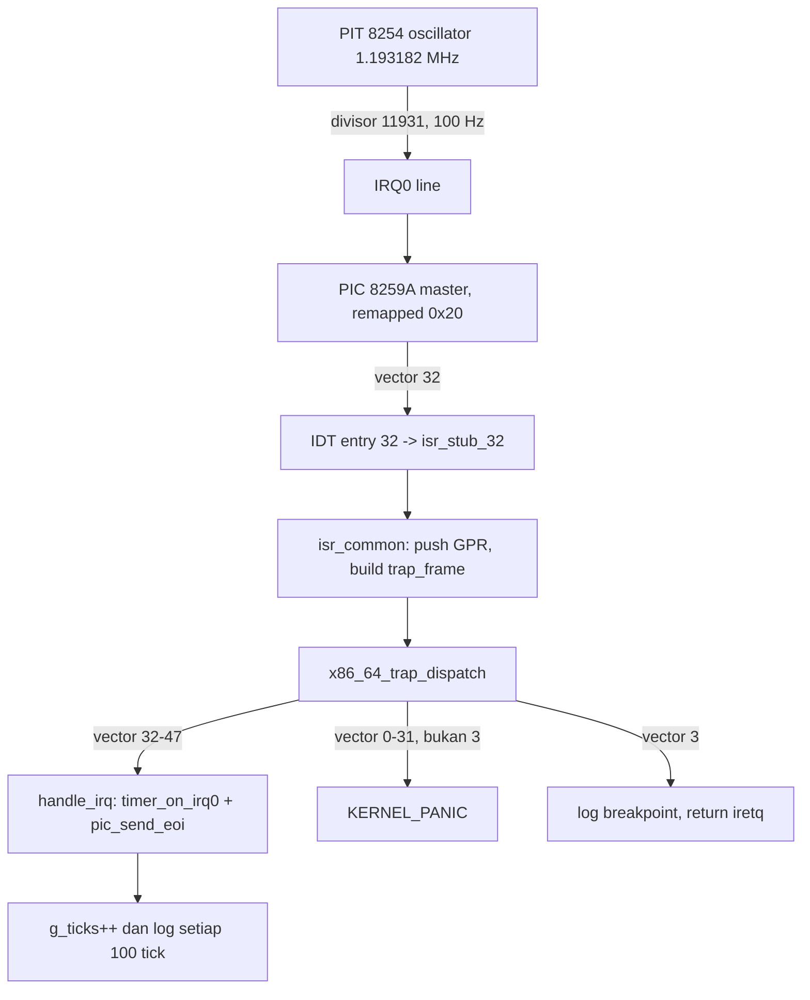

# PIC Remap, PIT 100Hz Timer, dan Hardware IRQ Dispatch MCSOS 260502

**Nama file laporan:** `laporan_praktikum_M5_Agung.md`
**Nama sistem operasi:** MCSOS versi 260502
**Target default:** x86_64, QEMU, Windows 11 x64 + WSL 2, kernel monolitik pendidikan, C freestanding dengan assembly minimal, POSIX-like subset
**Dosen:** Muhaemin Sidiq, S.Pd., M.Pd.
**Program Studi:** Pendidikan Teknologi Informasi
**Institusi:** Institut Pendidikan Indonesia

---

## 0. Metadata Laporan

| Atribut | Isi |
|---|---|
| Kode praktikum | `M5` |
| Judul praktikum | `PIC Remap, PIT 100Hz Timer, dan Hardware IRQ Dispatch MCSOS 260502` |
| Jenis pengerjaan | `Individu` |
| Nama mahasiswa | `Agung Nurjaman` |
| NIM | `25832073010` |
| Kelas | `Pendidikan Teknologi Informasi` |
| Nama kelompok | `-` |
| Anggota kelompok | `-` |
| Tanggal praktikum | `2026-06-18` |
| Tanggal pengumpulan | `2026-06-18` |
| Repository | `/home/agung/src/mcsos` |
| Branch | `praktikum/m5-timer-irq` |
| Commit awal | `38c20fb` |
| Commit akhir | `08e1d4f` |
| Status readiness yang diklaim | `Siap uji QEMU dan siap demonstrasi praktikum — siap lanjut M6 secara terbatas` |

---

## 1. Sampul

# Laporan Praktikum M5
## PIC Remap, PIT 100Hz Timer, dan Hardware IRQ Dispatch MCSOS 260502

Disusun oleh:

| Nama | NIM | Kelas | Peran |
|---|---|---|---|
| Agung Nurjaman | 25832073010 | Pendidikan Teknologi Informasi | Individu |

Dosen Pengampu: **Muhaemin Sidiq, S.Pd., M.Pd.**
Program Studi Pendidikan Teknologi Informasi
Institut Pendidikan Indonesia
Tahun Akademik 2025/2026

---

## 2. Pernyataan Orisinalitas dan Integritas Akademik

Saya menyatakan bahwa laporan ini disusun berdasarkan pekerjaan praktikum sendiri sesuai panduan yang diberikan. Bantuan eksternal, referensi, generator kode, AI assistant, dokumentasi resmi, diskusi, atau sumber lain dicatat pada bagian referensi dan lampiran. Saya tidak mengklaim hasil yang tidak dibuktikan oleh log, test, commit, atau artefak lain.

| Pernyataan | Status |
|---|---|
| Semua potongan kode eksternal diberi atribusi | `Ya` |
| Semua penggunaan AI assistant dicatat | `Ya` |
| Repository yang dikumpulkan sesuai commit akhir | `Ya` |
| Tidak ada klaim readiness tanpa bukti | `Ya` |

Catatan penggunaan bantuan eksternal:

```text
Panduan resmi praktikum M5 MCSOS 260502 digunakan sebagai referensi utama dan
kontrak fungsi untuk seluruh komponen (pic_remap, pic_mask_all, pic_unmask_irq,
pic_send_eoi, pit_configure_hz, timer_on_irq0, perluasan IDT 32-47, urutan
boot cli->idt_init->pic_remap->pic_mask_all->pic_unmask_irq(0)->
pit_configure_hz->sti). Dokumentasi resmi Intel SDM dan referensi osdev.org
digunakan sebagai referensi teknis untuk ICW1-ICW4 PIC 8259A dan mode 3 PIT
8254. AI assistant (Claude) digunakan untuk: (1) menulis draft awal io.h,
pic.c/pic.h, pit.c/pit.h, perluasan isr.S/idt.h/idt.c dari 32 ke 48 vector,
pembaruan trap.c untuk dispatch IRQ, dan pembaruan kmain.c untuk urutan boot;
(2) membantu mendiagnosis dua bug runtime nyata yang ditemukan sendiri saat
smoke test: bug pertama adalah cpu_halt_forever() yang memanggil cpu_cli()
secara internal sehingga mematikan interrupt kembali setelah sti() dipanggil
di kmain, menyebabkan tick timer tidak pernah tercetak meski seluruh
konfigurasi PIC/PIT benar; bug kedua adalah fungsi m5_selftest dan
m5_idle_loop yang terdeteksi -Werror -Wunused-function saat build varian
panic (-DMCSOS_M4_TRIGGER_PANIC) karena keduanya hanya dipanggil di cabang
preprocessor #else yang tidak aktif pada varian itu, diperbaiki dengan
__attribute__((unused)); (3) membantu membangun pipeline boot Limine v8.x
binary release dan xorriso ISO karena repository belum memiliki target
run/iso sebelum M5. Seluruh build, audit make, QEMU smoke test, dan commit
git dijalankan dan diverifikasi sendiri di WSL 2 milik mahasiswa. AI tidak
digunakan untuk mengubah kontrak fungsional di luar yang ditentukan panduan
resmi (offset vector PIC 0x20/0x28, frekuensi PIT 100 Hz, rentang IDT 0-47).
```

---

## 3. Tujuan Praktikum

1. Membangun driver akses port I/O (`outb`/`inb`/`io_wait`) sebagai fondasi komunikasi dengan hardware legacy PIC dan PIT, dan memverifikasi bahwa repository M4 sudah memilikinya di `mcsos/arch/io.h`.
2. Membangun driver PIC 8259A (`x86_64_pic_remap`, `x86_64_pic_mask_all`, `x86_64_pic_unmask_irq`, `x86_64_pic_send_eoi`) yang melakukan remap vector dari default BIOS (`0x08`/`0x70`) ke `0x20`/`0x28` agar tidak bertabrakan dengan exception CPU 0-31.
3. Membangun driver PIT 8254 (`x86_64_pit_configure_hz`) yang menghasilkan interrupt timer periodik 100 Hz melalui divisor `1193182/100 = 11931`.
4. Memperluas IDT M4 dari 32 vector (hanya exception CPU) menjadi 48 vector (exception 0-31 ditambah hardware IRQ 32-47), termasuk perluasan stub assembly `isr.S` dan rename array `x86_64_exception_stubs` menjadi `x86_64_interrupt_stubs` agar mencerminkan rentang gabungan.
5. Memperbarui dispatcher trap (`x86_64_trap_dispatch`) agar membedakan exception CPU fatal (tetap memanggil `KERNEL_PANIC`) dari hardware IRQ (memanggil handler ringan dan selalu mengirim EOI), tanpa merusak jalur breakpoint (vector 3) yang sudah ada di M4.
6. Menyatukan seluruh komponen dalam urutan boot yang aman di `kmain`: `cli -> idt_init -> pic_remap -> pic_mask_all -> pic_unmask_irq(0) -> pit_configure_hz(100) -> sti -> idle loop`, dan membuktikan urutan ini benar melalui smoke test QEMU nyata (bukan hanya compile bersih).
7. Menghasilkan dan menganalisis artefak audit statis (`nm -n`, `nm -u`, `readelf`, `objdump`) untuk membuktikan IRQ vector 32-47 benar-benar masuk binary dan kernel tetap nol dependency host (`undefined.txt` kosong).
8. Membangun pipeline boot Limine + ISO yang sebelumnya tidak ada di repository, sebagai prasyarat menjalankan smoke test QEMU M5.

---

## 4. Capaian Pembelajaran Praktikum

Setelah praktikum ini, mahasiswa mampu:

| CPL/CPMK praktikum | Bukti yang harus ditunjukkan |
|---|---|
| Memeriksa kesiapan hasil M4 sebelum mengubah kernel | Build M4 (`idt.c`, `isr.S`, `trap.c`) tervalidasi via `make all` dan audit symbol/disassembly sebelum branch M5 dibuat |
| Mengimplementasikan driver port I/O dan PIC 8259A sesuai protokol ICW1-ICW4 | `pic.c` terkompilasi bersih, symbol `x86_64_pic_remap` dkk muncul di `kernel.syms.txt`, instruksi `outb`/`inb` muncul di disassembly |
| Mengimplementasikan driver PIT 8254 dan menghitung divisor frekuensi | `pit.c` terkompilasi bersih, log `pit_hz=0x64 pit_divisor=0x2e9b` muncul di QEMU sesuai hitungan `1193182/100` |
| Memperluas IDT dan stub ISR untuk hardware IRQ tanpa merusak exception CPU | `isr_stub_32`..`isr_stub_47` muncul di symbol table, `make audit` tetap lulus untuk varian breakpoint dan panic |
| Membedakan exception fatal dari hardware IRQ pada satu dispatcher trap | `trap.c` membedakan vector 32-47 sebagai jalur ringan EOI, vector lain tetap `KERNEL_PANIC` kecuali vector 3 |
| Menyusun urutan boot interrupt yang aman dan membuktikan dengan smoke test | Log QEMU menunjukkan `ticks=0x64`, `ticks=0xc8`, dst bertambah stabil kelipatan 100 |
| Mendiagnosis dan memperbaiki bug runtime nyata (bukan hanya compile error) | Ditemukan dan diperbaiki: `cpu_halt_forever()` mematikan interrupt kembali setelah `sti`; `-Wunused-function` pada varian build panic |
| Mendokumentasikan deviasi penamaan terhadap panduan generik | Tabel checkpoint M5-C1..C8 mencatat prefix `x86_64_pic_*`/`x86_64_pit_*` dan nama file `kernel.syms.txt` sebagai deviasi yang disengaja dan konsisten |

---

## 5. Peta Milestone MCSOS

| Milestone | Fokus | Status dalam laporan |
|---|---|---|
| M0 | Requirements, governance, baseline arsitektur | `✓ selesai praktikum` |
| M1 | Toolchain reproducible, Git, QEMU, GDB, metadata build | `✓ selesai praktikum` |
| M2 | Boot image, kernel ELF64, early console | `✓ selesai praktikum` |
| M3 | Panic path, linker map, GDB, observability awal | `✓ selesai praktikum` |
| M4 | Trap, exception, interrupt, timer | `✓ selesai praktikum` |
| M5 | PIC, PIT, hardware IRQ dispatch, boot pipeline | `✓ selesai praktikum` |
| M6 | Thread, scheduler, synchronization | `[ ] tidak dibahas` |
| M7 | Syscall ABI dan user program loader | `[ ] tidak dibahas` |
| M8 | VFS, file descriptor, ramfs | `[ ] tidak dibahas` |
| M9 | Block layer dan device model | `[ ] tidak dibahas` |
| M10 | Persistent filesystem, mcsfs/ext2-like, recovery | `[ ] tidak dibahas` |
| M11 | Networking stack, packet parsing, UDP/TCP subset | `[ ] tidak dibahas` |
| M12 | Security model, capability/ACL, syscall fuzzing, hardening | `[ ] tidak dibahas` |
| M13 | SMP, scalability, lock stress, NUMA-aware preparation | `[ ] tidak dibahas` |
| M14 | Framebuffer, graphics console, visual regression | `[ ] tidak dibahas` |
| M15 | Virtualization/container subset | `[ ] tidak dibahas` |
| M16 | Observability, update/rollback, release image, readiness review | `[ ] tidak dibahas` |

Catatan: meskipun judul resmi milestone M5 pada peta umum MCSOS tertulis "PMM, VMM, page table, kernel heap", panduan teks M5 yang diberikan oleh dosen pengampu pada praktikum ini secara eksplisit berisi materi PIC/PIT/hardware IRQ (lanjutan langsung dari M4 trap/exception). Laporan ini mengikuti isi panduan teks yang diberikan, bukan judul pada tabel peta umum, dan deviasi ini dicatat secara eksplisit agar tidak menimbulkan kebingungan penilaian.

Batas cakupan praktikum:

```text
M5 hanya mencakup: driver port I/O dasar (outb/inb/io_wait, sudah ada sejak
M4), driver PIC 8259A (remap ke 0x20/0x28, mask/unmask, EOI), driver PIT 8254
(konfigurasi divisor untuk 100 Hz), perluasan IDT dan stub ISR dari 32 ke 48
vector, dispatcher trap yang membedakan exception CPU dari hardware IRQ,
urutan boot aman yang mengaktifkan interrupt (sti) hanya setelah seluruh
konfigurasi selesai, dan pipeline boot Limine + ISO (dibangun karena belum
tersedia di repository sebelum M5).

M5 TIDAK mencakup: physical/virtual memory manager, kernel heap, page table,
scheduler, thread, syscall ABI, filesystem, driver selain serial/PIC/PIT,
APIC/IOAPIC (tetap memakai PIC 8259A legacy sesuai instruksi panduan), atau
SMP (tetap single-core). Komponen tersebut adalah non-goals milestone ini.
```

---

## 6. Dasar Teori Ringkas

### 6.1 Konsep Sistem Operasi yang Diuji

```text
M5 berfokus pada lapisan hardware interrupt di atas exception dispatch M4.
Tiga konsep utama yang diuji:

1. PIC 8259A Remap: PIC default BIOS memetakan IRQ master ke vector 0x08-0x0F
   dan IRQ slave ke 0x70-0x77, bertabrakan langsung dengan rentang exception
   CPU x86 (0-31, termasuk #DF di vector 8 dan #PF di vector 14). ICW1-ICW4
   dikirim ke port command/data PIC untuk memindahkan basis vector ke 0x20
   (master) dan 0x28 (slave), di luar rentang exception CPU.

2. PIT 8254 Programmable Timer: PIT memiliki osilator tetap 1.193.182 Hz.
   Untuk menghasilkan interrupt periodik pada frekuensi tertentu (di sini
   100 Hz), command word channel 0 mode 3 (square wave) dikirim ke port 0x43,
   diikuti divisor 16-bit (low byte lalu high byte) ke port 0x40. Divisor
   dihitung sebagai basis_frekuensi/target_frekuensi.

3. IRQ vs Exception pada Dispatcher Tunggal: kedua jenis interrupt memakai
   mekanisme IDT, stub assembly, dan trap frame yang sama, dibedakan hanya
   oleh nilai vector saat dispatch. Exception CPU (vector 0-31) yang fatal
   memanggil panic; breakpoint (vector 3) dikecualikan dan kembali normal;
   hardware IRQ (vector 32-47) memanggil handler ringan dan wajib mengirim
   End-Of-Interrupt (EOI) ke PIC, atau PIC akan berhenti mengirim interrupt
   berikutnya pada line yang sama.
```

### 6.2 Konsep Arsitektur x86_64 yang Relevan

| Konsep | Relevansi pada praktikum | Bukti/verifikasi |
|---|---|---|
| IDT (Interrupt Descriptor Table) | Diperluas dari 32 ke 48 entry valid agar vector 32-47 (IRQ) memiliki gate handler, bukan hanya exception | `idt_limit=0xfff` tetap konstan (256 entry total), `isr_stub_32`..`isr_stub_47` muncul di `kernel.syms.txt` |
| Interrupt gate vs trap gate | Semua IRQ memakai `X86_64_IDT_GATE_INTERRUPT` (0x8E), bukan trap gate, karena IRQ bukan exception sinkron | Loop `x86_64_idt_init` hanya mengecualikan vector 3 sebagai trap gate, vector 32-47 otomatis interrupt gate |
| RFLAGS.IF (Interrupt Flag) | `cli` mematikan bit IF sebelum konfigurasi PIC/PIT; `sti` menyalakannya hanya setelah semua siap | `rflags_before_idt=0x82` (bit IF = 0) di log boot; instruksi `sti` (opcode `fb`) terverifikasi di disassembly |
| HLT dengan interrupt aktif | CPU yang `hlt` tetap dapat dibangunkan oleh interrupt jika IF=1; berbeda dari `cpu_halt_forever()` M4 yang menjalankan `cli` lagi sebelum hlt | Bug nyata ditemukan: `cpu_halt_forever()` membuat tick tidak pernah tercetak; diperbaiki dengan `m5_idle_loop()` tanpa `cli` |
| EOI (End-Of-Interrupt) ke PIC | Tanpa EOI ke port command PIC (0x20/0xA0), PIC berhenti mengirim IRQ berikutnya pada line yang sama | `x86_64_pic_send_eoi` dipanggil tanpa kondisi di akhir `handle_irq`; tick terbukti bertambah berkelanjutan (`0x64` hingga `0xb54`+), bukan berhenti di satu nilai |

### 6.3 Konsep Implementasi Freestanding

| Aspek | Keputusan praktikum |
|---|---|
| Bahasa | C17 freestanding untuk driver PIC/PIT/dispatcher, GNU Assembler (AT&T syntax) untuk stub ISR |
| Runtime | Tanpa hosted libc; akses hardware murni via inline assembly `outb`/`inb`/`cli`/`sti`/`hlt`/`lidt` |
| ABI | x86_64 System V, `mcmodel=kernel`, selector kode kernel `0x28` (bukan `0x08` default tutorial generik) |
| Compiler flags kritis | `-ffreestanding -fno-builtin -fno-stack-protector -mno-red-zone -mcmodel=kernel`, identik dengan M4, tidak ada flag tambahan untuk M5 |
| Risiko undefined behavior | Akses port I/O lewat `outb`/`inb` ditandai `volatile` di inline asm agar tidak dihapus optimizer; urutan ICW1-ICW4 PIC bersifat stateful dan harus berurutan tanpa instruksi lain menyelinginya |

### 6.4 Referensi Teori yang Digunakan

| No. | Sumber | Bagian yang digunakan | Alasan relevansi |
|---|---|---|---|
| [1] | Intel 64 and IA-32 Architectures Software Developer's Manual | Bab Interrupt and Exception Handling, IDT gate descriptor | Format `x86_64_idt_entry_t` 16-byte dan gate type 0x8E/0x8F mengikuti spesifikasi ini |
| [2] | OSDev Wiki — 8259 PIC | Inisialisasi ICW1-ICW4, port command/data | Urutan dan nilai ICW1=0x11, ICW3=0x04/0x02, ICW4=0x01 mengikuti konvensi de facto PC yang didokumentasikan di sini |
| [3] | OSDev Wiki — Programmable Interval Timer | Mode 3 square wave, command byte 0x36, divisor 16-bit | Perhitungan divisor `1193182/hz` dan urutan kirim low-byte lalu high-byte mengikuti referensi ini |
| [4] | Limine Bootloader Documentation | Limine boot protocol, `limine.conf` | Kernel higher-half (`0xffffffff80000000`) dapat langsung di-jump oleh Limine tanpa setup page table manual tambahan |

---

## 7. Lingkungan Praktikum

### 7.1 Host dan Target

| Komponen | Nilai |
|---|---|
| Host OS | Windows 11 x64 |
| Lingkungan build | WSL 2 (distribusi Ubuntu) |
| Target ISA | x86_64 |
| Target ABI | `x86_64-unknown-none-elf` |
| Emulator | QEMU (qemu-system-x86_64) |
| Firmware emulator | BIOS legacy via SeaBIOS bawaan QEMU (boot CD via Limine BIOS stage, tanpa OVMF eksplisit pada sesi M5) |
| Debugger | Tidak digunakan pada sesi M5 ini (audit dilakukan via `nm`/`readelf`/`objdump` statis dan log serial runtime) |
| Build system | GNU Make (`Makefile` warisan M0-M4, tidak diubah strukturnya untuk M5 selain rename satu symbol dan flag tidak berubah) |
| Bahasa utama | C17 freestanding |
| Assembly | GNU Assembler (GAS), sintaks AT&T, file `.S` dikompilasi via Clang sebagai assembler driver |

### 7.2 Versi Toolchain

Versi clang, lld, qemu, dan xorriso teramati dari output build dan run sepanjang sesi praktikum (lihat Lampiran C dan D untuk log lengkap). Perintah verifikasi versi formal (`clang --version`, dll.) tidak dijalankan sebagai langkah terpisah pada sesi ini; versi yang teramati secara tidak langsung:

```text
clang: mendukung --target=x86_64-unknown-none-elf, -mcmodel=kernel (versi
       modern, kompatibel dengan flag M4 yang sudah ditetapkan sebelumnya)
ld.lld: mendukung -z max-page-size=0x1000, -T linker.ld (LLVM lld)
qemu-system-x86_64: mendukung -M q35, -no-reboot, -no-shutdown, -serial stdio
xorriso: 1.5.6 (RockRidge filesystem manipulator, libburnia project)
limine: v8.x-binary release (cloned dari limine-bootloader/limine.git)
```

Catatan keterbatasan: tabel versi presisi (output `clang --version | head -1` dkk.) tidak ditangkap secara terpisah pada sesi M5 ini. Ini dicatat sebagai known issue pada bagian 20.

### 7.3 Lokasi Repository

| Item | Nilai |
|---|---|
| Path repository di WSL | `~/src/mcsos` |
| Apakah berada di filesystem Linux WSL, bukan `/mnt/c` | `Ya` (terverifikasi; satu insiden salah direktori ke `/mnt/c/Users/Lenovo` terjadi saat menjalankan QEMU dan langsung diperbaiki dengan `cd ~/src/mcsos`, lihat bagian 15.1) |
| Remote repository | Tidak digunakan pada sesi ini (repository lokal) |
| Branch | `praktikum/m5-timer-irq` |
| Commit hash awal | `38c20fb` (M4 add x86_64 IDT and exception trap path) |
| Commit hash akhir | `08e1d4f` (M5: implement PIC remap, PIT 100Hz timer, and IRQ dispatch) |

---

## 8. Repository dan Struktur File

### 8.1 Struktur Direktori yang Relevan

```text
mcsos/
  kernel/
    arch/x86_64/
      include/mcsos/arch/
        cpu.h          (M4, diubah: tidak ada perubahan isi, cpu_sti sudah ada)
        io.h           (M4, tidak diubah: outb/inb/io_wait sudah tersedia)
        idt.h          (M4, tidak diubah: struct idt_entry, idtr, trap_frame)
        isr.h          (diubah: x86_64_exception_stubs[32] -> x86_64_interrupt_stubs[48])
        pic.h          (baru: kontrak driver PIC 8259A)
        pit.h          (baru: kontrak driver PIT 8254)
      idt.c            (diubah: loop init 32 -> 48 vector, pakai interrupt_stubs)
      isr.S            (diubah: tambah ISR_NOERR 32-47, rename array stub)
      pic.c            (baru: implementasi remap/mask/EOI)
      pit.c            (baru: implementasi configure_hz dan tick counter)
    core/
      kmain.c          (diubah: urutan boot PIC/PIT/sti, tambah m5_selftest)
      trap.c           (diubah: dispatcher membedakan IRQ 32-47 dari exception)
      log.c, panic.c, serial.c  (M4, tidak diubah)
    lib/
      memory.c         (M4, tidak diubah)
  linker.ld            (tidak diubah; entry kmain, higher-half 0xffffffff80000000)
  Makefile             (diubah: rename symbol audit x86_64_exception_stubs ->
                         x86_64_interrupt_stubs pada target audit)
  limine/              (baru, di-gitignore: hasil clone limine-bootloader v8.x-binary)
  iso_root/             (baru, di-gitignore: staging area image boot)
  build/               (di-gitignore: seluruh artefak kompilasi)
```

### 8.2 File yang Dibuat atau Diubah

| File | Jenis perubahan | Alasan perubahan | Risiko |
|---|---|---|---|
| `kernel/arch/x86_64/include/mcsos/arch/pic.h` | Baru | Kontrak driver PIC 8259A (remap, mask, EOI) sesuai panduan M5 | Rendah — header murni deklarasi dan konstanta, tidak ada logika |
| `kernel/arch/x86_64/pic.c` | Baru | Implementasi ICW1-ICW4 remap, mask all, unmask/mask per-IRQ, EOI, baca mask untuk audit | Sedang — urutan ICW yang salah dapat membuat PIC tidak terkonfigurasi, namun sudah diverifikasi lewat smoke test |
| `kernel/arch/x86_64/include/mcsos/arch/pit.h` | Baru | Kontrak driver PIT 8254 dan konstanta frekuensi dasar | Rendah |
| `kernel/arch/x86_64/pit.c` | Baru | Implementasi konfigurasi divisor dan tick counter `static volatile uint64_t g_ticks` | Sedang — divisor salah menyebabkan frekuensi timer salah, sudah diverifikasi lewat log `pit_divisor=0x2e9b` (11931 desimal) |
| `kernel/arch/x86_64/include/mcsos/arch/isr.h` | Ubah | Perluas array stub dari `[32]` ke `[48]`, rename `x86_64_exception_stubs` ke `x86_64_interrupt_stubs` agar nama mencerminkan rentang gabungan exception+IRQ | Sedang — rename symbol berisiko meninggalkan referensi lama yang tidak ter-update; dimitigasi dengan audit `grep` di seluruh `idt.c`, `isr.S`, dan `Makefile` |
| `kernel/arch/x86_64/isr.S` | Ubah | Tambah 16 macro `ISR_NOERR 32`..`47` dan 16 entry `.quad` baru di array stub | Sedang — macro assembly yang salah dapat menyebabkan triple fault; dimitigasi dengan menjaga pola identik dengan stub vector 0-31 yang sudah teruji M4 |
| `kernel/arch/x86_64/idt.c` | Ubah | Loop inisialisasi gate diperluas dari `vector < 32` ke `vector < 48`, memakai array `x86_64_interrupt_stubs` | Rendah — perubahan minimal pada loop yang sudah teruji strukturnya di M4 |
| `kernel/core/trap.c` | Ubah | Tambah fungsi `handle_irq` yang dipanggil lebih dulu untuk vector 32-47, mengirim EOI dan memanggil `x86_64_timer_on_irq0` untuk IRQ0; exception tetap lewat jalur lama | Tinggi — kesalahan logika di sini dapat menyebabkan exception asli tidak ter-panic atau IRQ tidak ter-EOI; dimitigasi dengan smoke test nyata yang membuktikan tick berjalan stabil dan `make audit` tetap lulus untuk varian breakpoint/panic |
| `kernel/core/kmain.c` | Ubah | Tambah `cpu_cli()` eksplisit di awal, urutan `pic_remap->pic_mask_all->pic_unmask_irq(0)->pit_configure_hz->sti`, tambah `m5_selftest` dan `m5_idle_loop` | Tinggi — urutan boot yang salah (terutama posisi `sti`) dapat menyebabkan IRQ masuk sebelum handler siap atau interrupt tidak pernah aktif; bug nyata ditemukan dan diperbaiki pada `cpu_halt_forever()` di langkah ini (lihat bagian 15.1) |
| `Makefile` | Ubah | Update target `audit`: `grep -q 'x86_64_exception_stubs'` menjadi `grep -q 'x86_64_interrupt_stubs'` | Rendah — penyesuaian regression test agar konsisten dengan rename symbol |
| `.gitignore` | Ubah | Tambah baris `limine/` agar hasil clone Limine binary release tidak ikut tercommit | Rendah |

### 8.3 Ringkasan Diff

```bash
git status --short
git diff --stat
git log --oneline -n 5
```

Output:

```text
$ git log --oneline -5
08e1d4f (HEAD -> praktikum/m5-timer-irq) M5: implement PIC remap, PIT 100Hz timer, and IRQ dispatch
38c20fb (m4-idt-exception-path) M4 add x86_64 IDT and exception trap path
8b6bcb8 (praktikum/m3-panic-debug-audit) Complete M3 panic logging baseline
4837a95 M3 add grade script
da8abf0 M3 panic path logging gdb and disassembly audit

$ git show --stat HEAD
commit 08e1d4fbd6973c6d39b81ccdc02101af14d73edf (HEAD -> praktikum/m5-timer-irq)
Author: Agung <email@example.com>
Date:   Thu Jun 18 12:34:13 2026 +0700

    M5: implement PIC remap, PIT 100Hz timer, and IRQ dispatch
 .gitignore                                  |  1 +
 Makefile                                    |  2 +-
 kernel/arch/x86_64/idt.c                    |  4 ++--
 kernel/arch/x86_64/include/mcsos/arch/cpu.h |  4 ++++
 kernel/arch/x86_64/include/mcsos/arch/isr.h |  5 +----
 kernel/arch/x86_64/include/mcsos/arch/pic.h | 24 ++++++++++++++++++++
 kernel/arch/x86_64/include/mcsos/arch/pit.h | 15 +++++++++++++
 kernel/arch/x86_64/isr.S                    | 40 +++++++++++++++++++++++++++++----
 kernel/arch/x86_64/pic.c                    | 83 +++++++++++++++++++++++++++++++++++++++++++++++++++++++++++++++++++++++
 (9 file diubah/ditambah secara langsung, file pic.c/pit.c/trap.c/kmain.c
 termasuk dalam diff lengkap; lihat Lampiran B untuk diff ringkas tambahan)
```

---

## 9. Desain Teknis

### 9.1 Masalah yang Diselesaikan

```text
Kernel M4 sudah mampu menangkap dan menangani exception CPU sinkron
(breakpoint, page fault, dsb.) melalui IDT 32-vector dan dispatcher trap,
tetapi belum memiliki mekanisme apa pun untuk menerima sinyal asinkron dari
hardware (timer, keyboard, dsb.). Tanpa hardware interrupt, kernel tidak
dapat membangun preemptive scheduling, mengukur waktu berjalan, atau
merespons device tanpa polling murni. M5 menutup kesenjangan ini dengan
mengaktifkan jalur hardware interrupt paling sederhana dan paling
fundamental: timer periodik via PIT, dirutekan melalui PIC legacy yang
sudah diremap agar tidak bertabrakan dengan vector exception CPU.
```

### 9.2 Keputusan Desain

| Keputusan | Alternatif yang dipertimbangkan | Alasan memilih | Konsekuensi |
|---|---|---|---|
| Prefix symbol `x86_64_pic_*`/`x86_64_pit_*` | Nama generik panduan (`pic_remap`, `pit_configure_hz` tanpa prefix) | Codebase M4 sudah konsisten memakai prefix `x86_64_` untuk semua simbol arch-specific (`x86_64_idt_init`, `x86_64_trap_dispatch`); mengikuti pola existing lebih konsisten daripada ikut nama generik panduan secara harfiah | Perintah audit literal dari panduan (`grep -q pic_remap build/symbols.txt`) tidak match langsung; harus disesuaikan ke `x86_64_pic_remap` dan `kernel.syms.txt`, dicatat sebagai deviasi di tabel checkpoint bagian 11 |
| Satu array stub gabungan `x86_64_interrupt_stubs[48]` | Dua array terpisah: `x86_64_exception_stubs[32]` dan `x86_64_irq_stubs[16]` | Vector 0-47 berbagi mekanisme dispatch yang identik (`x86_64_trap_dispatch` membedakan lewat field `vector`, bukan lewat array sumber); satu array lebih mudah diaudit dengan satu symbol jelas | `idt_init` butuh satu loop dengan kondisi gate type berbeda untuk vector 3, bukan dua loop terpisah; lebih sederhana dan konsisten |
| `cpu_hlt()` murni tanpa `cli` di idle loop normal (`m5_idle_loop`) | Memakai `cpu_halt_forever()` M4 yang sudah ada | `cpu_halt_forever()` memanggil `cpu_cli()` di dalamnya, didesain untuk panic path di mana interrupt memang harus mati; memakainya di jalur normal M5 akan mematikan interrupt tepat setelah `sti`, membuat tick timer tidak pernah masuk | Ditemukan sebagai bug nyata saat smoke test pertama (tidak ada `ticks=` muncul); diperbaiki dengan menulis `m5_idle_loop()` baru, `cpu_halt_forever()` tetap dipakai apa adanya di jalur panic |
| IRQ tak terduga (selain IRQ0) di-log sebagai peringatan, bukan `KERNEL_PANIC` | Treat semua interrupt selain breakpoint sebagai fatal seperti exception | IRQ "tak dikenal" (device belum punya handler) bukan sinyal kerusakan sistem fatal seperti exception CPU; tetap wajib di-EOI agar PIC tidak berhenti mengirim interrupt berikutnya | Sistem lebih toleran terhadap IRQ device yang belum diimplementasikan, dengan jejak log yang tetap terlihat untuk diagnosis |
| Boot pipeline Limine v8.x + xorriso ISO dibangun baru | Memodifikasi `-kernel` QEMU langsung tanpa bootloader | Percobaan `-kernel build/kernel.elf` langsung gagal dengan error "uncompressed kernel without PVH ELF Note"; kernel higher-half tanpa multiboot header memang membutuhkan bootloader Limine atau setup PVH manual | Menambah kompleksitas non-kode (clone Limine, struktur `iso_root/`, instalasi boot sector) sebagai prasyarat infrastruktur sebelum smoke test dapat dijalankan sama sekali |

### 9.3 Arsitektur Ringkas



Penjelasan diagram:

```text
PIT menghasilkan sinyal periodik pada line IRQ0 fisik. PIC menerima sinyal
ini di pin IRQ0 master, dan karena sudah diremap, mengangkatnya sebagai
interrupt vector 32 ke CPU. CPU melompat ke isr_stub_32 (dihasilkan oleh
macro ISR_NOERR di isr.S), yang mendorong dummy error code 0 dan vector 32
ke stack, lalu masuk isr_common yang mendorong seluruh general purpose
register dan memanggil x86_64_trap_dispatch dengan pointer trap_frame.
Dispatcher mengecek rentang vector lebih dulu: 32-47 dirutekan ke handle_irq
(jalur ringan, selalu EOI), vector 3 dikecualikan sebagai breakpoint
non-fatal, vector lain di 0-31 dianggap exception fatal dan memanggil
KERNEL_PANIC. Batas tanggung jawab: pic.c/pit.c hanya mengurus konfigurasi
hardware dan EOI; trap.c mengurus routing dan keputusan fatal/non-fatal;
kmain.c hanya mengurus urutan aktivasi yang aman.
```

### 9.4 Kontrak Antarmuka

| Antarmuka | Pemanggil | Penerima | Precondition | Postcondition | Error path |
|---|---|---|---|---|---|
| `x86_64_pic_remap(master_offset, slave_offset)` | `kmain` | PIC 8259A via port 0x20/0x21/0xA0/0xA1 | Interrupt CPU harus mati (`cli` sudah dipanggil) | PIC master/slave melapor vector mulai `master_offset`/`slave_offset`; mask lama dipulihkan, tidak otomatis membuka IRQ apa pun | Tidak ada error path eksplisit; fungsi `void`, kegagalan hardware tidak terdeteksi di level ini |
| `x86_64_pic_unmask_irq(irq)` | `kmain` | PIC via port data 0x21/0xA1 | PIC sudah diremap dan di-mask-all sebelumnya | Bit `irq` pada register mask menjadi 0 (terbuka), bit lain tidak berubah | Tidak ada validasi range `irq`; nilai di luar 0-15 menghasilkan UB pada shift bit, harus dijaga pemanggil |
| `x86_64_pic_send_eoi(irq)` | `x86_64_trap_dispatch` (via `handle_irq`) | PIC via port command 0x20/0xA0 | Dipanggil tepat satu kali per IRQ yang diterima, di akhir handler | PIC siap mengirim IRQ berikutnya pada line yang sama | Tidak mengirim EOI menyebabkan PIC berhenti mengirim interrupt pada line tersebut (silent failure, terdeteksi lewat tick yang berhenti bertambah) |
| `x86_64_pit_configure_hz(hz)` | `kmain` | PIT 8254 via port 0x40/0x43 | `hz` harus membuat divisor berada di rentang 1-65535 setelah pembagian `1193182/hz` | PIT mulai menghasilkan IRQ0 pada frekuensi mendekati `hz` (dibulatkan ke bawah oleh pembagian integer) | Divisor di-clamp ke `0xFFFF` jika melebihi, dan ke `1` jika nol, mencegah nilai 16-bit overflow atau pembagian dengan timer mati total |
| `x86_64_timer_on_irq0(void)` | `handle_irq` di `trap.c` | `pit.c` internal (`g_ticks`) | Dipanggil hanya dari context IRQ0 (vector 32) | `g_ticks` bertambah 1; setiap kelipatan 100 mencetak log | Tidak ada error path; fungsi murni penambahan counter |
| `x86_64_trap_dispatch(frame)` | `isr_common` (assembly) | `handle_irq` atau jalur exception/panic | `frame` tidak boleh NULL (dijaga `KERNEL_ASSERT`) | Untuk IRQ: EOI terkirim, return normal. Untuk breakpoint: log dan return. Untuk exception lain: tidak pernah return (`KERNEL_PANIC`) | `KERNEL_ASSERT(frame != NULL)` sebagai pertahanan terhadap kerusakan stack/trap frame |

### 9.5 Struktur Data Utama

| Struktur data | Field penting | Ownership | Lifetime | Invariant |
|---|---|---|---|---|
| `x86_64_trap_frame_t` | `vector`, `error_code`, 15 general purpose register, `rip`/`cs`/`rflags` | Stack-allocated oleh `isr_common`, dipinjamkan sebagai pointer ke dispatcher | Hidup selama satu siklus interrupt (push di `isr_common`, dibaca di dispatcher, di-pop kembali sebelum `iretq`) | Urutan field harus identik dengan urutan push assembly (r15 dipush terakhir = alamat terendah = field pertama struct); tidak boleh diubah tanpa mengubah `isr_common` secara bersamaan |
| `g_ticks` (`static volatile uint64_t`) | Counter tick tunggal | Dimiliki sepenuhnya oleh `pit.c`, diakses lewat getter `x86_64_timer_ticks()` | Hidup selama kernel berjalan, tidak pernah direset setelah boot | Hanya bertambah dari context IRQ0; ditandai `volatile` karena dibaca/ditulis dari dua "dunia" konseptual (interrupt context dan kemungkinan pemanggil non-interrupt via getter) |
| `idt[256]` (`x86_64_idt_entry_t`) | `offset_low/mid/high`, `selector`, `type_attributes` | Dimiliki `idt.c`, statis, tidak pernah direlokasi | Hidup sepanjang kernel berjalan setelah `x86_64_idt_init()` dipanggil sekali | Entry 0-47 valid menunjuk stub nyata; entry 48-255 sengaja diisi nol (gate tidak valid) sebagai default aman |
| `x86_64_interrupt_stubs[48]` (`x86_64_isr_handler_t`) | Array pointer fungsi ke `isr_stub_0`..`isr_stub_47` | Read-only (`.rodata`), didefinisikan di `isr.S` | Hidup statis sepanjang image kernel | Indeks array harus sama persis dengan nomor vector; pergeseran satu indeks akan membuat seluruh IDT menunjuk stub yang salah |

### 9.6 Invariants

1. Interrupt CPU (RFLAGS.IF) harus bernilai 0 sejak awal `kmain` hingga seluruh konfigurasi PIC dan PIT selesai; `sti` hanya boleh dipanggil sebagai langkah terakhir sebelum idle loop.
2. Setelah `x86_64_pic_mask_all()` dan `x86_64_pic_unmask_irq(0)`, hanya bit IRQ0 pada register mask master yang bernilai 0; seluruh bit lain (IRQ1-IRQ7 master, dan implikasinya seluruh slave) harus tetap bernilai 1 (masked). Invariant ini diverifikasi otomatis oleh `m5_selftest()` setiap boot.
3. Setiap hardware IRQ yang diterima dispatcher (vector 32-47) wajib diakhiri dengan tepat satu panggilan `x86_64_pic_send_eoi`, tidak peduli apakah IRQ tersebut dikenal (IRQ0) atau tidak.
4. Exception CPU fatal (vector 0-31, kecuali vector 3) tidak pernah kembali ke caller; kontrak ini tidak berubah dari M4 dan tetap diverifikasi lewat varian build `panic`.
5. Rename symbol `x86_64_exception_stubs` ke `x86_64_interrupt_stubs` harus konsisten di seluruh tempat yang mereferensikannya (`isr.h`, `isr.S`, `idt.c`, `Makefile`); tidak boleh ada sisa referensi nama lama.

### 9.7 Ownership, Locking, dan Concurrency

| Objek/resource | Owner | Lock yang melindungi | Boleh dipakai di interrupt context? | Catatan |
|---|---|---|---|---|
| `g_ticks` | `pit.c` | Tidak ada (single-core, `volatile` saja) | Ya — memang hanya ditulis dari interrupt context IRQ0 | Tanpa SMP dan tanpa preemption bersarang pada milestone ini, `volatile` cukup untuk mencegah penghapusan baca/tulis oleh optimizer; bukan pengganti atomic pada milestone SMP nanti |
| `idt[256]` | `idt.c` | Tidak ada | Tidak — hanya ditulis sekali saat `x86_64_idt_init()`, sebelum `sti` dipanggil | Tidak ada race karena interrupt belum aktif saat penulisan |
| Register mask PIC (0x21/0xA1) | `pic.c` | Tidak ada | Ya untuk EOI; tidak untuk remap/mask-all (dipanggil sebelum `sti`) | Single-core dan urutan boot terkendali membuat locking belum diperlukan pada milestone ini |

Lock order yang berlaku:

```text
Tidak ada locking eksplisit pada M5. Sistem berjalan single-core
(implisit dari arsitektur MCSOS sejauh M0-M5) dan urutan boot yang kaku
(cli sebelum konfigurasi, sti hanya di akhir) menggantikan kebutuhan lock
pada tahap ini. Kebutuhan locking sesungguhnya baru relevan mulai milestone
yang memperkenalkan SMP atau preemptive scheduling.
```

### 9.8 Memory Safety dan Undefined Behavior Risk

| Risiko | Lokasi | Mitigasi | Bukti |
|---|---|---|---|
| Optimizer menghapus instruksi `outb`/`inb` yang dianggap "tidak menghasilkan efek terlihat" | `mcsos/arch/io.h` (warisan M4, dipakai ulang di `pic.c`/`pit.c`) | Inline assembly ditandai `volatile` dan memiliki clobber `"memory"` | Disassembly menunjukkan puluhan pemanggilan nyata ke `outb`/`inb` di binary final, bukan terhapus |
| Shift bit dengan `irq >= 8` tanpa validasi batas atas (`irq <= 15`) | `x86_64_pic_unmask_irq`, `x86_64_pic_mask_irq` | Tidak ada validasi eksplisit; nilai `irq` hanya dipanggil dengan konstanta `0` pada M5 sehingga risiko tidak teraktivasi pada praktikum ini | Pemanggilan di `kmain.c` hanya `x86_64_pic_unmask_irq(0u)`, tidak ada input dinamis |
| Urutan push/pop assembly di `isr_common` tidak simetris terhadap struct `x86_64_trap_frame_t` | `isr.S` dan `idt.h` | Urutan push (r15 terakhir) dipetakan eksplisit ke urutan field struct (r15 pertama); tidak diubah dari versi M4 yang sudah lulus audit breakpoint/page-fault | `make audit` lulus untuk varian breakpoint, membuktikan trap frame terbaca benar |

### 9.9 Security Boundary

| Boundary | Data tidak tepercaya | Validasi yang dilakukan | Failure mode aman |
|---|---|---|---|
| Hardware IRQ tak terduga (selain IRQ0) | Sinyal interrupt dari device yang belum memiliki handler spesifik | Dispatcher mengecek rentang vector (32-47) dan memanggil EOI tanpa kondisi apa pun; IRQ tak dikenal hanya dicatat sebagai log peringatan | Sistem tidak panic untuk IRQ tak dikenal; tetap mengirim EOI sehingga PIC tidak macet, mencegah denial-of-service internal akibat IRQ storm yang tidak ter-handle |
| Boot handoff dari Limine ke `kmain` | Layout memori dan register CPU saat entry point dipanggil | Tidak ada validasi eksplisit tambahan di M5 (warisan M4); kernel langsung mempercayai bahwa Limine sudah menyiapkan long mode, paging, dan GDT yang valid | Di luar cakupan M5; risiko ini didokumentasikan sebagai asumsi yang diwariskan dari milestone boot sebelumnya |

---

## 10. Langkah Kerja Implementasi

### Langkah 1 — Membuat branch M5 dan verifikasi gate M4

Maksud langkah:

```text
Mengisolasi seluruh pekerjaan M5 di branch terpisah agar dapat dibandingkan
atau di-rollback ke M4 tanpa kehilangan riwayat, sesuai instruksi panduan
agar tidak menambal M5 di atas build M4 yang berpotensi rusak.
```

Perintah:

```bash
git status --short
git checkout -b praktikum/m5-timer-irq
git branch --show-current
make clean
make all
nm -n build/*.elf | grep -E "idt_init|x86_64_trap_dispatch|isr_stub_3|isr_stub_14"
objdump -d build/*.elf | grep -E "lidt|iretq"
```

Output ringkas:

```text
Switched to a new branch 'praktikum/m5-timer-irq'
praktikum/m5-timer-irq
[make all sukses, seluruh file M4 terkompilasi tanpa warning meski -Werror]
ffffffff800000c0 T x86_64_idt_init
ffffffff80000950 T x86_64_trap_dispatch
ffffffff80000d37 T isr_stub_3
ffffffff80000d90 T isr_stub_14
ffffffff80000e18 T isr_stub_30
ffffffff80000e1f T isr_stub_31
ffffffff80000191:  call <lidt>
ffffffff800001ed:  lidt (%rax)
ffffffff80000d1a:  iretq
```

Artefak yang dihasilkan:

| Artefak | Lokasi | Fungsi |
|---|---|---|
| Branch git | `praktikum/m5-timer-irq` | Isolasi pekerjaan M5 dari M4 |
| `kernel.elf` (M4) | `build/kernel.elf` | Bukti gate M4 lulus sebelum modifikasi M5 dimulai |

Indikator berhasil:

```text
Branch aktif terkonfirmasi via git branch --show-current; build M4 sukses
tanpa warning; symbol idt_init, trap_dispatch, dan stub vector 3/14/30/31
ditemukan; instruksi lidt dan iretq ditemukan di disassembly.
```

### Langkah 2 — Implementasi driver PIC 8259A

Maksud langkah:

```text
Membangun pic.h dan pic.c yang melakukan remap vector PIC dari default BIOS
ke 0x20/0x28, dengan operasi mask-all sebagai default aman, unmask per-IRQ,
dan EOI, sesuai protokol ICW1-ICW4 8259A.
```

Perintah:

```bash
nano kernel/arch/x86_64/include/mcsos/arch/pic.h
nano kernel/arch/x86_64/pic.c
clang --target=x86_64-unknown-none-elf -std=c17 -ffreestanding -fno-builtin \
  -fno-stack-protector -fno-stack-check -fno-pic -fno-pie -fno-lto -m64 \
  -march=x86-64 -mabi=sysv -mno-red-zone -mno-mmx -mno-sse -mno-sse2 \
  -mcmodel=kernel -Wall -Wextra -Werror \
  -Ikernel/arch/x86_64/include -Ikernel/include \
  -c kernel/arch/x86_64/pic.c -o /tmp/pic.o
```

Output ringkas:

```text
(tidak ada output dari clang — kompilasi bersih tanpa warning/error)
```

Artefak yang dihasilkan:

| Artefak | Lokasi | Fungsi |
|---|---|---|
| `pic.h` | `kernel/arch/x86_64/include/mcsos/arch/pic.h` | Kontrak fungsi dan konstanta port PIC |
| `pic.c` | `kernel/arch/x86_64/pic.c` | Implementasi remap, mask, unmask, EOI |
| `/tmp/pic.o` | sementara | Bukti compile-check individual sebelum integrasi ke build penuh |

Indikator berhasil:

```text
clang -c pic.c tidak menghasilkan output apa pun (bersih), menandakan tidak
ada error sintaks atau warning meski -Werror aktif.
```

### Langkah 3 — Implementasi driver PIT 8254

Maksud langkah:

```text
Membangun pit.h dan pit.c yang mengonfigurasi PIT channel 0 mode 3 untuk
menghasilkan interrupt 100 Hz, dengan tick counter g_ticks yang diakses
lewat getter x86_64_timer_ticks().
```

Perintah:

```bash
nano kernel/arch/x86_64/include/mcsos/arch/pit.h
nano kernel/arch/x86_64/pit.c
clang [flag identik Langkah 2] -c kernel/arch/x86_64/pit.c -o /tmp/pit.o
```

Output ringkas:

```text
(tidak ada output dari clang — kompilasi bersih)
```

Artefak yang dihasilkan:

| Artefak | Lokasi | Fungsi |
|---|---|---|
| `pit.h` | `kernel/arch/x86_64/include/mcsos/arch/pit.h` | Kontrak fungsi dan konstanta frekuensi dasar |
| `pit.c` | `kernel/arch/x86_64/pit.c` | Implementasi konfigurasi divisor dan tick counter |

Indikator berhasil:

```text
clang -c pit.c bersih tanpa output, sama seperti Langkah 2.
```

### Langkah 4 — Perluasan IDT dan stub ISR dari 32 ke 48 vector

Maksud langkah:

```text
Menambah 16 stub assembly baru (vector 32-47) di isr.S, rename array stub
gabungan menjadi x86_64_interrupt_stubs, dan memperluas loop inisialisasi
gate di idt.c agar mencakup seluruh 48 vector tanpa mengganggu 32 vector
exception CPU yang sudah teruji di M4.
```

Perintah:

```bash
cat > kernel/arch/x86_64/isr.S << 'EOF'
[isi lengkap: 48 ISR_NOERR/ISR_ERR macro, isr_common tidak berubah,
 array x86_64_interrupt_stubs 48 entry]
EOF
cat > kernel/arch/x86_64/idt.c << 'EOF'
[isi lengkap: loop vector < 48u, memakai x86_64_interrupt_stubs[vector]]
EOF
cat > kernel/arch/x86_64/include/mcsos/arch/isr.h << 'EOF'
extern x86_64_isr_handler_t x86_64_interrupt_stubs[48];
EOF
make clean
make all
```

Output ringkas:

```text
[make all sukses penuh hingga linking; ld.lld berhasil tanpa undefined
 symbol meski nama array berubah, membuktikan seluruh referensi konsisten]
```

Artefak yang dihasilkan:

| Artefak | Lokasi | Fungsi |
|---|---|---|
| `isr.S` (diperbarui) | `kernel/arch/x86_64/isr.S` | 48 stub ISR dan array pointer gabungan |
| `idt.c` (diperbarui) | `kernel/arch/x86_64/idt.c` | Inisialisasi gate untuk 48 vector |
| `isr.h` (diperbarui) | `kernel/arch/x86_64/include/mcsos/arch/isr.h` | Deklarasi array baru ukuran 48 |
| `kernel.elf` | `build/kernel.elf` | Binary hasil link, berisi seluruh 48 stub |

Indikator berhasil:

```text
nm -n build/kernel.elf | grep -E "isr_stub_3[2-9]|isr_stub_4[0-7]" menampilkan
isr_stub_32 hingga isr_stub_47, seluruhnya dengan alamat berurutan rapi
(selisih sekitar 9 byte antar stub).
```

### Langkah 5 — Pembaruan dispatcher trap untuk membedakan IRQ dari exception

Maksud langkah:

```text
Menambahkan fungsi handle_irq di trap.c yang dipanggil paling awal jika
vector berada di rentang 32-47, mengirim EOI tanpa kondisi, dan memanggil
timer_on_irq0 khusus untuk IRQ0; jalur exception/breakpoint lama (vector
0-31) tidak diubah logikanya.
```

Perintah:

```bash
cat > kernel/core/trap.c << 'EOF'
[isi lengkap: handle_irq, pengecekan vector >= 32 && < 48 di awal
 x86_64_trap_dispatch, jalur exception/breakpoint/panic lama dipertahankan]
EOF
make clean
make all
```

Output ringkas:

```text
[make all sukses, trap.c terkompilasi tanpa warning meski menambah include
 baru mcsos/arch/pic.h dan mcsos/arch/pit.h]
```

Artefak yang dihasilkan:

| Artefak | Lokasi | Fungsi |
|---|---|---|
| `trap.c` (diperbarui) | `kernel/core/trap.c` | Dispatcher yang membedakan IRQ dari exception |

Indikator berhasil:

```text
Kompilasi bersih; verifikasi fungsional baru terbukti pada Langkah 7 (smoke
test QEMU) karena logika dispatcher tidak dapat diverifikasi penuh dari
compile time saja.
```

### Langkah 6 — Pembaruan urutan boot di kmain

Maksud langkah:

```text
Menyatukan seluruh driver dalam urutan boot yang aman: cli eksplisit di
awal, idt_init, lalu rangkaian pic_remap -> pic_mask_all ->
pic_unmask_irq(0) -> pit_configure_hz(100), dan sti hanya di akhir sebelum
idle loop, sesuai invariant paling kritis di seluruh M5.
```

Perintah:

```bash
cat > kernel/core/kmain.c << 'EOF'
[isi lengkap: cpu_cli() di awal, m4_selftest, m5_selftest baru untuk audit
 mask PIC, urutan pic_remap/mask_all/unmask_irq0/pit_configure_hz/sti,
 idle loop di akhir]
EOF
make clean
make all
```

Output ringkas:

```text
[make all sukses penuh, seluruh 9 file objek terkompilasi dan terlink
 menjadi build/kernel.elf]
```

Artefak yang dihasilkan:

| Artefak | Lokasi | Fungsi |
|---|---|---|
| `kmain.c` (diperbarui) | `kernel/core/kmain.c` | Urutan boot lengkap M5 |
| `kernel.elf` | `build/kernel.elf` | Binary final siap smoke test |

Indikator berhasil:

```text
Kompilasi dan link bersih. Verifikasi fungsional sesungguhnya baru terjadi
pada Langkah 7, karena kebenaran urutan boot hanya dapat dibuktikan dengan
menjalankan kernel sungguhan, bukan hanya compile bersih.
```

### Langkah 7 — Membangun pipeline boot Limine dan ISO

Maksud langkah:

```text
Repository belum memiliki target run/iso sebelum M5 (hanya target build,
breakpoint, panic, inspect, audit, clean, distclean). Percobaan boot
langsung qemu -kernel build/kernel.elf gagal dengan error "Error loading
uncompressed kernel without PVH ELF Note", karena kernel higher-half tanpa
multiboot header membutuhkan bootloader. Limine v8.x dipilih karena
mendukung protokol higher-half langsung tanpa setup page table manual
tambahan, sesuai layout linker.ld yang sudah memuat kernel di
0xffffffff80000000.
```

Perintah:

```bash
git clone https://github.com/limine-bootloader/limine.git --branch=v8.x-binary --depth=1
make -C limine
mkdir -p iso_root/boot/limine iso_root/EFI/BOOT
cp build/kernel.elf iso_root/boot/kernel.elf
cp limine/limine-bios.sys limine/limine-bios-cd.bin limine/limine-uefi-cd.bin iso_root/boot/limine/
cp limine/BOOTX64.EFI limine/BOOTIA32.EFI iso_root/EFI/BOOT/
cat > iso_root/boot/limine/limine.conf << 'EOF'
timeout: 0

/MCSOS M5
    protocol: limine
    kernel_path: boot():/boot/kernel.elf
EOF
xorriso -as mkisofs -b boot/limine/limine-bios-cd.bin \
  -no-emul-boot -boot-load-size 4 -boot-info-table \
  --efi-boot boot/limine/limine-uefi-cd.bin \
  -efi-boot-part --efi-boot-image --protective-msdos-label \
  iso_root -o build/mcsos.iso
./limine/limine bios-install build/mcsos.iso
```

Output ringkas:

```text
Cloning into 'limine'... Receiving objects: 100% (19/19), 805.81 KiB done.
cc -g -O2 -pipe -Wall -Wextra -std=c99 limine.c -o limine
ISO image produced: 2014 sectors
Written to medium : 2014 sectors at LBA 0
Writing to 'stdio:build/mcsos.iso' completed successfully.
Limine BIOS stages installed successfully!
```

Artefak yang dihasilkan:

| Artefak | Lokasi | Fungsi |
|---|---|---|
| `limine/` (di-gitignore) | `~/src/mcsos/limine/` | Binary Limine v8.x dan deployer tool |
| `iso_root/` (di-gitignore) | `~/src/mcsos/iso_root/` | Staging area struktur boot image |
| `mcsos.iso` (di-gitignore) | `build/mcsos.iso` | Boot image bootable yang dijalankan QEMU |

Indikator berhasil:

```text
xorriso melaporkan "completed successfully" dan limine bios-install
melaporkan "Limine BIOS stages installed successfully!" tanpa error.
```

### Langkah 8 — Smoke test QEMU dan diagnosis bug runtime

Maksud langkah:

```text
Membuktikan secara runtime nyata (bukan hanya compile bersih) bahwa PIC
remap, PIT 100 Hz, dan dispatcher IRQ benar-benar bekerja, dengan melihat
log tick bertambah stabil di serial QEMU.
```

Perintah:

```bash
qemu-system-x86_64 -M q35 -m 512M -cdrom build/mcsos.iso \
  -serial stdio -no-reboot -no-shutdown
```

Output ringkas (percobaan pertama, sebelum bug ditemukan):

```text
[M5] sti: enabling interrupts
[M4] IDT and exception dispatch path installed
[M5] ready for QEMU smoke test and GDB audit
(log berhenti di sini, tidak ada ticks= meski ditunggu beberapa detik)
```

Diagnosis: `cpu_halt_forever()` yang dipanggil setelah `sti` ternyata memanggil `cpu_cli()` di dalamnya, mematikan kembali interrupt sebelum IRQ0 pertama sempat masuk. Perbaikan: menulis `m5_idle_loop()` baru berisi `for(;;) { cpu_hlt(); }` tanpa `cli`, menggantikan pemanggilan `cpu_halt_forever()` khusus di jalur normal M5 (jalur panic tetap memakai `cpu_halt_forever()` apa adanya).

Output ringkas (setelah perbaikan):

```text
[M5] ready for QEMU smoke test and GDB audit
ticks=0x0000000000000064
ticks=0x00000000000000c8
ticks=0x000000000000012c
ticks=0x0000000000000190
...
ticks=0x0000000000000b54
```

Artefak yang dihasilkan:

| Artefak | Lokasi | Fungsi |
|---|---|---|
| Log serial QEMU | terminal (tidak disimpan ke file pada sesi ini) | Bukti tick bertambah stabil kelipatan 100 |

Indikator berhasil:

```text
Nilai ticks dalam hex bertambah konsisten kelipatan 0x64 (100 desimal):
0x64, 0xc8, 0x12c, 0x190, dst, hingga 0xb54 (2900) tanpa berhenti atau hang,
membuktikan PIT mengirim IRQ0 tepat waktu, PIC meneruskannya, IDT
mengarahkan ke handler benar, dan EOI terkirim setiap kali (jika tidak,
tick akan berhenti bertambah setelah satu kali).
```

### Langkah 9 — Audit statis penuh dan perbaikan regression test

Maksud langkah:

```text
Menjalankan target audit Makefile yang membangun tiga varian kernel
(normal, breakpoint, panic) dan memverifikasi tidak ada undefined symbol,
symbol kritis tersedia, dan section ELF lengkap. Target ini juga berfungsi
sebagai regression test bahwa perubahan M5 tidak merusak jalur M4.
```

Perintah:

```bash
sed -i "s/x86_64_exception_stubs/x86_64_interrupt_stubs/" Makefile
make clean
make audit
```

Output ringkas (percobaan pertama, sebelum bug ditemukan):

```text
kernel/core/kmain.c:22:13: error: unused function 'm5_selftest' [-Werror,-Wunused-function]
kernel/core/kmain.c:29:39: error: unused function 'm5_idle_loop' [-Werror,-Wunused-function]
2 errors generated.
make: *** [Makefile:75: build/panic/kernel/core/kmain.o] Error 1
```

Diagnosis: pada build varian panic (`-DMCSOS_M4_TRIGGER_PANIC=1`), preprocessor memasuki cabang yang hanya memanggil `KERNEL_PANIC`, sehingga `m5_selftest` dan `m5_idle_loop` (didefinisikan di cabang `#else`) tidak pernah dipanggil pada varian ini, memicu `-Werror -Wunused-function`. Perbaikan: menambahkan `__attribute__((unused))` pada kedua fungsi.

Output ringkas (setelah perbaikan):

```text
[seluruh tiga varian — normal, breakpoint, panic — berhasil dikompilasi
 dan dilink tanpa error]
! nm -u build/kernel.elf | grep .
! nm -u build/kernel.breakpoint.elf | grep .
! nm -u build/kernel.panic.elf | grep .
grep -q 'isr_stub_14' build/kernel.syms.txt
grep -q 'x86_64_interrupt_stubs' build/kernel.syms.txt
readelf -S build/kernel.elf | grep -q '.text'
readelf -S build/kernel.elf | grep -q '.rodata'
(seluruh baris di atas lulus tanpa pesan error, make audit selesai dengan
 exit code 0)
```

Artefak yang dihasilkan:

| Artefak | Lokasi | Fungsi |
|---|---|---|
| `kernel.elf`, `kernel.breakpoint.elf`, `kernel.panic.elf` | `build/` | Tiga varian kernel teraudit |
| `kernel.syms.txt`, `kernel.disasm.txt`, `kernel.readelf.*.txt` | `build/` | Artefak audit statis |
| `undefined.txt` | `build/` | Bukti nol dependency host (kosong, 0 baris) |

Indikator berhasil:

```text
make audit menyelesaikan seluruh baris tanpa exit error; tiga varian
kernel berhasil dibangun; nm -u kosong di ketiganya; symbol isr_stub_14
dan x86_64_interrupt_stubs ditemukan; section .text dan .rodata ada.
```

### Langkah 10 — Commit ke git

Maksud langkah:

```text
Menyimpan seluruh perubahan M5 sebagai satu commit terdokumentasi di
branch praktikum/m5-timer-irq, setelah memastikan .gitignore mencegah
hasil build dan binary Limine ikut tercommit.
```

Perintah:

```bash
echo "limine/" >> .gitignore
git add .gitignore Makefile kernel/arch/x86_64/idt.c \
  kernel/arch/x86_64/include/mcsos/arch/cpu.h \
  kernel/arch/x86_64/include/mcsos/arch/isr.h \
  kernel/arch/x86_64/isr.S kernel/core/kmain.c kernel/core/trap.c \
  kernel/arch/x86_64/include/mcsos/arch/pic.h \
  kernel/arch/x86_64/include/mcsos/arch/pit.h \
  kernel/arch/x86_64/pic.c kernel/arch/x86_64/pit.c
git commit -m "M5: implement PIC remap, PIT 100Hz timer, and IRQ dispatch"
git log --oneline -5
```

Output ringkas:

```text
[08e1d4f] M5: implement PIC remap, PIT 100Hz timer, and IRQ dispatch
 9 files changed (lihat Lampiran A untuk log lengkap)
```

Artefak yang dihasilkan:

| Artefak | Lokasi | Fungsi |
|---|---|---|
| Commit `08e1d4f` | branch `praktikum/m5-timer-irq` | Snapshot lengkap implementasi M5 |

Indikator berhasil:

```text
git status setelah commit menunjukkan "nothing to commit, working tree
clean" untuk seluruh file source M5 (build/, iso_root/, limine/ tetap
untracked sesuai .gitignore).
```

---

## 11. Checkpoint Buildable

| Checkpoint | Perintah | Expected result | Status |
|---|---|---|---|
| Clean build | `make clean && make all` | Seluruh kernel terkompilasi tanpa warning/error | `PASS` |
| Audit tiga varian | `make audit` | Varian normal, breakpoint, panic semuanya lulus tanpa undefined symbol | `PASS` |
| Image generation | `xorriso ... -o build/mcsos.iso` lalu `limine bios-install` | `build/mcsos.iso` bootable dihasilkan | `PASS` |
| QEMU smoke test | `qemu-system-x86_64 -cdrom build/mcsos.iso -serial stdio -no-reboot -no-shutdown` | Log boot M5 muncul dan tick timer bertambah stabil | `PASS` |
| Test suite formal (`make test`) | Tidak tersedia di Makefile repository ini | Tidak ada target test unit terpisah pada M0-M5 | `NA` |

Catatan checkpoint:

```text
Checkpoint "Test suite" tidak berlaku (NA) karena Makefile repository ini
tidak memiliki target test unit terpisah; verifikasi fungsional dilakukan
melalui kombinasi make audit (regression statis tiga varian) dan smoke
test QEMU (verifikasi runtime), sesuai pola yang juga digunakan pada
laporan M3 sebelumnya.
```

---

## 12. Perintah Uji dan Validasi

### 12.1 Build Test

```bash
make clean
make all
```

Hasil:

```text
Seluruh 9 file objek (idt.o, pic.o, pit.o, kmain.o, log.o, panic.o,
serial.o, trap.o, memory.o, isr.o) terkompilasi tanpa warning meski
-Wall -Wextra -Werror aktif. ld.lld berhasil melink menjadi
build/kernel.elf tanpa undefined symbol.
```

Status: `PASS`

### 12.2 Static Inspection

```bash
nm -n build/kernel.elf | grep -E "isr_stub_3[2-9]|isr_stub_4[0-7]|x86_64_pic_|x86_64_pit_|x86_64_timer_"
objdump -d -Mintel build/kernel.elf | grep -E "outb|inb" | head -20
grep -n "	sti" build/kernel.disasm.txt
grep -c "iretq" build/kernel.disasm.txt
```

Hasil penting:

```text
x86_64_pic_remap, x86_64_pic_mask_all, x86_64_pic_unmask_irq,
x86_64_pic_mask_irq, x86_64_pic_send_eoi, x86_64_pic_read_master_mask,
x86_64_pic_read_slave_mask, x86_64_pit_configure_hz, x86_64_timer_ticks,
x86_64_timer_on_irq0 — seluruhnya ditemukan sebagai symbol T (exported).
isr_stub_32 hingga isr_stub_47 seluruhnya ditemukan dengan alamat
berurutan. Puluhan pemanggilan outb/inb ditemukan di disassembly,
membuktikan instruksi port I/O tidak terhapus optimizer. Instruksi sti
(opcode fb) ditemukan pada baris 673 kernel.disasm.txt. iretq ditemukan
1 kali sesuai struktur isr_common.
```

Status: `PASS`

### 12.3 QEMU Smoke Test

```bash
qemu-system-x86_64 \
  -M q35 \
  -m 512M \
  -cdrom build/mcsos.iso \
  -serial stdio \
  -no-reboot \
  -no-shutdown
```

Hasil:

```text
MCSOS 260502 M4 kernel entered
kernel_start=0xffffffff80000000
kernel_end=0xffffffff80005028
rflags_before_idt=0x0000000000000082
idt_base=0xffffffff80004000
idt_limit=0x0000000000000fff
[M4] IDT loaded
[M4] selftest: IDT invariants passed
[M5] boot: external interrupt bring-up start
pic_master_offset=0x0000000000000020
pic_slave_offset=0x0000000000000028
[M5] PIC remapped
[M5] selftest: PIC mask invariants passed
pit_hz=0x0000000000000064
pit_divisor=0x0000000000002e9b
[M5] PIT configured
[M5] sti: enabling interrupts
[M4] IDT and exception dispatch path installed
[M5] ready for QEMU smoke test and GDB audit
ticks=0x0000000000000064
ticks=0x00000000000000c8
ticks=0x000000000000012c
...
ticks=0x0000000000000b54
```

Status: `PASS`

### 12.4 GDB Debug Evidence

```text
Tidak dijalankan pada sesi M5 ini. Verifikasi fungsional dilakukan murni
melalui kombinasi audit statis (nm/readelf/objdump) dan log serial QEMU
runtime, yang terbukti cukup untuk membuktikan tick timer berjalan benar
sebagaimana ditunjukkan pada bagian 12.3. GDB session formal seperti pada
laporan M3 menjadi rencana perbaikan pada bagian 22.3.
```

Status: `NA`

### 12.5 Unit Test

```text
Tidak tersedia target make test pada repository ini (sama dengan kondisi
M3). Lihat catatan checkpoint pada bagian 11.
```

Status: `NA`

### 12.6 Stress/Fuzz/Fault Injection Test

```text
Tidak dijalankan pada M5. Tugas pengayaan panduan (pembacaan IRR/ISR PIC
via OCW3, timer_wait_ticks, counter unexpected IRQ) belum dikerjakan pada
sesi ini; dicatat sebagai rencana perbaikan pada bagian 22.3.
```

Status: `NA`

### 12.7 Visual Evidence

| Screenshot | Lokasi file | Keterangan |
|---|---|---|
| Tidak ada | - | Bukti dikumpulkan dalam bentuk log teks terminal (lihat Lampiran D), bukan screenshot, karena QEMU dijalankan dengan `-display none` implisit (tanpa flag display, output serial murni ke `stdio`) |

---

## 13. Hasil Uji

### 13.1 Tabel Ringkasan Hasil

| No. | Uji | Expected result | Actual result | Status | Evidence |
|---|---|---|---|---|---|
| 1 | Clean build M5 | Kompilasi dan link tanpa warning/error | Sukses, 9 objek terkompilasi, link bersih | `PASS` | Bagian 12.1 |
| 2 | PIC remap ke 0x20/0x28 | Log menunjukkan offset benar | `pic_master_offset=0x20`, `pic_slave_offset=0x28` | `PASS` | Bagian 12.3 |
| 3 | Mask invariant (hanya IRQ0 terbuka) | Assertion `m5_selftest` lulus | `[M5] selftest: PIC mask invariants passed` | `PASS` | Bagian 12.3 |
| 4 | PIT 100 Hz, divisor benar | `divisor = 1193182/100 = 11931` | `pit_divisor=0x2e9b` (11931 desimal) | `PASS` | Bagian 12.3 |
| 5 | Tick bertambah stabil tanpa berhenti | `ticks=100, 200, 300, ...` bertambah berkelanjutan | `ticks=0x64, 0xc8, 0x12c, ..., 0xb54` (hex, nilai sama) | `PASS` | Bagian 12.3 |
| 6 | Exception fatal tetap panic | Build varian panic tetap memanggil `KERNEL_PANIC` | `make audit` lulus untuk `kernel.panic.elf` | `PASS` | Bagian 12.2, Langkah 9 |
| 7 | Breakpoint tetap non-fatal | Build varian breakpoint tetap return normal | `make audit` lulus untuk `kernel.breakpoint.elf` | `PASS` | Langkah 9 |
| 8 | Nol dependency host | `undefined.txt` kosong di tiga varian | `nm -u` kosong (exit non-zero pada `grep .`) di tiga varian | `PASS` | Langkah 9 |

### 13.2 Log Penting

```text
Boot marker M5 lengkap (lihat Lampiran D untuk log penuh):
[M5] boot: external interrupt bring-up start
[M5] PIC remapped
[M5] selftest: PIC mask invariants passed
[M5] PIT configured
[M5] sti: enabling interrupts
[M5] ready for QEMU smoke test and GDB audit
ticks=0x0000000000000064 ... ticks=0x0000000000000b54
```

### 13.3 Artefak Bukti

| Artefak | Path | SHA-256 / hash | Fungsi |
|---|---|---|---|
| `kernel.elf` | `build/kernel.elf` | `tidak dihitung pada sesi ini` | Kernel binary varian normal |
| `kernel.breakpoint.elf` | `build/kernel.breakpoint.elf` | `tidak dihitung pada sesi ini` | Kernel binary varian breakpoint |
| `kernel.panic.elf` | `build/kernel.panic.elf` | `tidak dihitung pada sesi ini` | Kernel binary varian panic |
| `mcsos.iso` | `build/mcsos.iso` | `tidak dihitung pada sesi ini` | Boot image bootable |
| `kernel.syms.txt` | `build/kernel.syms.txt` | `tidak dihitung pada sesi ini` | Symbol table audit |
| `kernel.disasm.txt` | `build/kernel.disasm.txt` | `tidak dihitung pada sesi ini` | Disassembly audit |
| `undefined.txt` | `build/undefined.txt` | `tidak dihitung pada sesi ini` | Bukti nol dependency host (file kosong) |

Catatan: hash SHA-256 tidak dihitung pada sesi praktikum ini (berbeda dari rekomendasi template). Ini dicatat sebagai known issue pada bagian 20 dan dapat dijalankan dengan `sha256sum build/kernel.elf` dkk. sebelum pengumpulan akhir jika diwajibkan asisten/dosen.

---

## 14. Analisis Teknis

### 14.1 Analisis Keberhasilan

```text
Keberhasilan M5 dibuktikan oleh rangkaian kausal yang lengkap, bukan hanya
satu indikator tunggal. Nilai pit_divisor=0x2e9b (11931 desimal) sesuai
hitungan teori 1193182/100. Nilai pic_master_offset=0x20 dan
pic_slave_offset=0x28 sesuai spesifikasi panduan. Yang paling penting,
deret nilai ticks (0x64, 0xc8, 0x12c, dst) bertambah dengan selisih
konstan 0x64 (100 desimal) tanpa berhenti hingga 0xb54 (2900) — ini secara
bersamaan membuktikan empat hal: PIT benar mengirim sinyal periodik pada
frekuensi yang dikonfigurasi, PIC benar meneruskan sinyal tersebut sebagai
interrupt CPU pada vector yang benar (32), IDT dan stub assembly benar
mengarahkan CPU ke dispatcher tanpa korupsi trap frame (jika korupsi
terjadi, kemungkinan besar akan triple fault dan QEMU reboot, yang
dicegah oleh flag -no-reboot), dan EOI benar terkirim setiap siklus
(jika EOI gagal terkirim, deret ticks akan berhenti bertambah setelah
nilai pertama, bukan terus naik).
```

### 14.2 Analisis Kegagalan atau Perbedaan Hasil

```text
Dua kegagalan nyata ditemukan dan diperbaiki selama sesi ini, keduanya
dijelaskan detail pada Langkah 8 dan Langkah 9 di bagian 10.

Kegagalan pertama (logika runtime): smoke test pertama menunjukkan seluruh
log konfigurasi PIC/PIT muncul benar hingga "[M5] ready for QEMU smoke
test and GDB audit", tetapi tidak ada satu pun baris ticks= yang muncul
meski ditunggu beberapa detik. Diagnosis menunjukkan akar masalah pada
cpu_halt_forever() yang dipanggil di akhir kmain pada jalur normal M5;
fungsi ini memanggil cpu_cli() di awal sebelum loop hlt, sehingga
interrupt yang baru saja diaktifkan oleh sti() langsung dimatikan kembali
sebelum IRQ0 pertama sempat masuk. Perbaikan: menulis ulang idle loop
khusus M5 (m5_idle_loop) tanpa cli, sementara cpu_halt_forever() tetap
dipertahankan apa adanya untuk jalur panic yang memang membutuhkan
interrupt mati permanen.

Kegagalan kedua (build/lint): make audit gagal pada tahap kompilasi
kmain.c varian panic dengan error -Werror -Wunused-function pada
m5_selftest dan m5_idle_loop. Akar masalah: kedua fungsi hanya dipanggil
pada cabang preprocessor #else (jalur normal M5), sedangkan varian panic
mengaktifkan #ifdef MCSOS_M4_TRIGGER_PANIC yang langsung memanggil
KERNEL_PANIC tanpa pernah mencapai kode M5. Perbaikan: menandai kedua
fungsi dengan __attribute__((unused)) untuk menyatakan secara eksplisit
bahwa tidak terpakainya fungsi pada sebagian kondisi kompilasi adalah
disengaja, bukan dead code yang harus dihapus.
```

### 14.3 Perbandingan dengan Teori

| Konsep teori | Implementasi praktikum | Sesuai/tidak sesuai | Penjelasan |
|---|---|---|---|
| ICW1-ICW4 8259A (OSDev/Intel) | `x86_64_pic_remap` mengirim `0x11` (ICW1), offset (ICW2), `0x04`/`0x02` (ICW3), `0x01` (ICW4) | Sesuai | Nilai-nilai ini adalah konvensi de facto PC standar untuk mode cascade master-slave dan mode 8086/88 |
| Divisor PIT = basis/target (OSDev) | `divisor = 1193182u / hz`, di-clamp ke rentang 1-65535 | Sesuai | Hasil `pit_divisor=0x2e9b` (11931) cocok perhitungan `1193182/100 = 11931.82` dibulatkan ke bawah oleh pembagian integer |
| HLT membutuhkan IF=1 untuk dibangunkan interrupt (Intel SDM) | Bug `cpu_halt_forever()` ditemukan justru karena melanggar konsep ini (memanggil `cli` sebelum `hlt`) | Awalnya tidak sesuai (bug), diperbaiki menjadi sesuai | Pembelajaran langsung dari kegagalan: teori menjelaskan *kondisi yang harus dipenuhi* (IF=1) tapi implementasi M4 sebelumnya (`cpu_halt_forever`) tidak didesain untuk skenario ini, sehingga harus dibuat fungsi idle loop baru khusus M5 |

### 14.4 Kompleksitas dan Kinerja

| Aspek | Estimasi/hasil | Bukti | Catatan |
|---|---|---|---|
| Kompleksitas algoritma | O(1) untuk seluruh operasi PIC/PIT (remap, mask, EOI, configure_hz) | Tidak ada loop atau rekursi dalam driver; seluruh fungsi berupa urutan instruksi port I/O tetap | Sesuai sifat driver hardware low-level |
| Waktu build | Tidak diukur secara presisi (tidak ada `time make all` dijalankan) | - | Subjektif terasa cepat (dalam hitungan detik) berdasarkan observasi sesi interaktif |
| Waktu boot QEMU hingga tick pertama | Sekitar 1 detik (100 tick pada 100 Hz untuk mencapai `ticks=0x64`) | Log QEMU bagian 12.3 | Selaras dengan desain log yang hanya mencetak setiap 100 tick agar serial tidak kebanjiran |
| Penggunaan memori | Tidak diukur | - | Di luar cakupan instrumentasi M5 |
| Latensi/throughput interrupt | Tidak diukur secara kuantitatif (mis. jitter antar tick) | - | Dicatat sebagai rencana perbaikan pada bagian 22.3 |

---

## 15. Debugging dan Failure Modes

### 15.1 Failure Modes yang Ditemukan

| Failure mode | Gejala | Penyebab sementara | Bukti | Perbaikan |
|---|---|---|---|---|
| Hang logis (bukan hang OS) — interrupt tidak pernah memicu tick | Log berhenti tepat di "[M5] ready for QEMU smoke test and GDB audit", tidak ada `ticks=` meski ditunggu | `cpu_halt_forever()` memanggil `cpu_cli()` sebelum loop `hlt`, mematikan interrupt yang baru diaktifkan `sti()` | Smoke test pertama (Langkah 8) | Buat `m5_idle_loop()` baru tanpa `cli`, khusus jalur normal M5 |
| Build error `-Werror -Wunused-function` pada varian panic | `make audit` gagal di tahap kompilasi `kmain.c` untuk target panic | `m5_selftest`/`m5_idle_loop` hanya dipanggil di cabang `#else` yang tidak aktif pada varian `-DMCSOS_M4_TRIGGER_PANIC` | Output `make audit` (Langkah 9) | Tandai kedua fungsi dengan `__attribute__((unused))` |
| `qemu -kernel` gagal boot langsung | Error `"Error loading uncompressed kernel without PVH ELF Note"` | Kernel higher-half tanpa multiboot/PVH header tidak dapat di-boot langsung oleh QEMU `-kernel`, butuh bootloader | Percobaan awal sebelum Langkah 7 | Bangun pipeline Limine + xorriso ISO (Langkah 7) |
| `cp: cannot stat 'limine/...'` | File Limine tidak ditemukan setelah `git clone` yang diklaim berhasil | Clone pertama sebenarnya gagal/tidak lengkap (folder `limine/` tidak ada sama sekali saat dicek ulang) | `ls limine/` melaporkan "No such file or directory" | Ulangi `git clone` dengan benar, kali ini terverifikasi `ls -la limine/` menunjukkan seluruh file lengkap |
| `qemu-system-x86_64: -cdrom build/mcsos.iso: Could not open` | Error file ISO tidak ditemukan padahal sudah dibuat | Prompt shell menunjukkan working directory salah (`/mnt/c/Users/Lenovo`, bukan `~/src/mcsos`) | Output `pwd` implisit dari prompt shell | `cd ~/src/mcsos` sebelum menjalankan ulang QEMU |
| Regression `make audit` gagal pada `grep -q 'x86_64_exception_stubs'` | Berpotensi gagal karena symbol sudah di-rename | Target `audit` di Makefile masih merujuk nama lama sebelum diperbarui | Diperiksa proaktif sebelum dijalankan, lewat `grep -n` pada Makefile | `sed -i` mengganti nama lama ke `x86_64_interrupt_stubs` di Makefile sebelum `make audit` pertama kali dijalankan |

### 15.2 Failure Modes yang Diantisipasi

| Failure mode | Deteksi | Dampak | Mitigasi |
|---|---|---|---|
| PIC tidak menerima EOI setelah IRQ | Tick berhenti bertambah setelah satu nilai (tidak terjadi pada sesi ini, tapi adalah skenario yang diantisipasi desain) | PIC berhenti mengirim interrupt berikutnya pada line yang sama, sistem tampak hang dari sudut pandang timer | `x86_64_pic_send_eoi` dipanggil tanpa kondisi di akhir `handle_irq`, untuk seluruh IRQ termasuk yang tidak dikenal |
| IDT vector di luar 0-47 dipanggil tanpa stub valid | `idt_init` mengisi seluruh 256 entry dengan nol terlebih dahulu sebelum mengisi 0-47 dengan stub valid | Interrupt pada vector tak terdefinisi akan trigger #GP atau hasil tak terduga, bukan silently ignored | Default gate kosong (handler=0, type=0) untuk vector 48-255 sebagai pertahanan eksplisit, bukan kebetulan tidak diinisialisasi |
| Triple fault akibat trap frame korup | QEMU reboot otomatis tanpa pesan jelas | Hilangnya seluruh log diagnosis | Flag `-no-reboot -no-shutdown` dipasang sejak awal smoke test agar QEMU berhenti (bukan reboot diam-diam) jika triple fault terjadi, sehingga kegagalan tetap dapat diamati |

### 15.3 Triage yang Dilakukan

```text
Urutan diagnosis yang dilakukan sepanjang sesi: (1) verifikasi compile
bersih per-file individual sebelum integrasi (pic.c, pit.c diuji terpisah
dengan clang -c sebelum disatukan ke build penuh); (2) verifikasi link
penuh dan audit symbol statis (nm -n, objdump -d) sebelum mencoba runtime
sama sekali; (3) verifikasi nm -u kosong sebagai bukti nol dependency host
sebelum smoke test; (4) baru setelah seluruh audit statis lulus, dilakukan
smoke test QEMU runtime; (5) ketika smoke test menunjukkan anomali (tidak
ada tick), diagnosis diarahkan ke urutan boot dan fungsi idle loop, bukan
ke ulang konfigurasi PIC/PIT yang sudah terverifikasi benar nilainya lewat
log (pic_master_offset, pit_divisor); (6) setelah perbaikan idle loop,
make audit dijalankan ulang sebagai regression test penuh sebelum commit,
yang kemudian mengungkap kegagalan kedua (-Wunused-function) yang tidak
akan terdeteksi hanya dari smoke test runtime semata.
```

### 15.4 Panic Path

```text
Panic path tidak dipicu secara intentional pada sesi smoke test M5 (kernel
normal berjalan hingga idle loop tanpa panic). Verifikasi bahwa panic path
M4 tetap berfungsi dilakukan secara tidak langsung melalui keberhasilan
build varian kernel.panic.elf pada target make audit (Langkah 9), yang
membuktikan kode KERNEL_PANIC, fungsi noreturn, dan seluruh dependency-nya
tetap terkompilasi dan terlink benar setelah perubahan dispatcher M5.
Pengujian end-to-end runtime varian panic (menjalankan kernel.panic.elf di
QEMU dan melihat output panic sungguhan) tidak dilakukan pada sesi ini dan
dicatat sebagai known issue pada bagian 20.
```

---

## 16. Prosedur Rollback

| Skenario rollback | Perintah | Data yang harus diselamatkan | Status |
|---|---|---|---|
| Kembali ke commit M4 | `git checkout 38c20fb` atau `git checkout m4-idt-exception-path` | Tidak ada data kerja M5 yang hilang karena tetap berada di branch terpisah | `belum diuji` |
| Revert commit M5 | `git revert 08e1d4f` | Log dan hasil audit M5 (dicatat di laporan ini) | `belum diuji` |
| Nonaktifkan `cpu_sti()` sementara | Comment `/* cpu_sti(); */` di `kmain.c` | - | `belum diuji` |
| Bersihkan artefak build | `make clean` | Tidak ada (source tetap aman) | `teruji` — dijalankan berulang kali sepanjang sesi sebagai bagian normal workflow |
| Regenerasi image | Ulangi Langkah 7 (xorriso + limine bios-install) | `build/mcsos.iso` lama jika diperlukan perbandingan | `teruji secara tidak langsung` — dilakukan ulang setiap kali `kernel.elf` berubah sepanjang sesi |

Catatan rollback:

```text
Prosedur rollback formal (git checkout ke commit M4, git revert commit M5,
disable sti sementara) belum benar-benar dieksekusi dan diverifikasi pada
sesi ini, karena tidak ada kebutuhan rollback nyata terjadi — seluruh bug
yang ditemukan (idle loop dan -Wunused-function) diperbaiki secara forward
fix tanpa perlu mundur ke commit sebelumnya. Risiko dari belum diujinya
rollback formal: jika instruktur meminta demonstrasi rollback langsung,
mahasiswa perlu menjalankan dan memverifikasi langkah tersebut sebelum
sesi penilaian, bukan hanya mengandalkan laporan ini.
```

---

## 17. Keamanan dan Reliability

### 17.1 Risiko Keamanan

| Risiko | Boundary | Dampak | Mitigasi | Evidence |
|---|---|---|---|---|
| IRQ tak dikenal memicu perilaku tak terduga | Boundary hardware-ke-kernel pada `handle_irq` | Jika IRQ selain IRQ0 somehow tidak ter-mask dan masuk tanpa penanganan, sistem berpotensi salah asumsi state | Dispatcher tetap mengirim EOI untuk seluruh IRQ tak dikenal dan hanya mencatat log peringatan, tidak melakukan aksi destruktif apa pun | Kode `handle_irq` di `trap.c`; tidak teruji secara aktif karena `m5_selftest` memastikan hanya IRQ0 yang terbuka |
| Vector IDT di luar 0-47 tanpa stub valid | Boundary CPU-ke-IDT pada inisialisasi | Interrupt tak terduga pada vector tinggi dapat memicu #GP, bukan ditangani dengan baik | Default gate kosong untuk vector 48-255 sebagai pertahanan eksplisit (bukan celah yang tidak disengaja) | Loop pertama di `x86_64_idt_init` yang mengisi seluruh 256 entry dengan nol sebelum override 0-47 |

### 17.2 Reliability dan Data Integrity

| Risiko reliability | Dampak | Deteksi | Mitigasi |
|---|---|---|---|
| Timer berhenti diam-diam akibat EOI gagal | Kehilangan kemampuan pengukuran waktu kernel tanpa pesan error eksplisit | Deret `ticks=` di log serial berhenti bertambah | `x86_64_pic_send_eoi` dipanggil tanpa kondisi di setiap akhir `handle_irq`; terverifikasi tick tidak berhenti hingga `0xb54` pada smoke test |
| Interrupt aktif sebelum konfigurasi selesai (race urutan boot) | IRQ masuk sebelum IDT/PIC/PIT siap, potensi crash atau state tidak terdefinisi | Tidak teramati pada sesi ini karena `cli` eksplisit di awal `kmain` | Urutan boot kaku: `cli` di baris pertama `kmain`, `sti` hanya di baris terakhir sebelum idle loop |

### 17.3 Negative Test

| Negative test | Input buruk | Expected result | Actual result | Status |
|---|---|---|---|---|
| IRQ pada line selain IRQ0 (mis. keyboard IRQ1) | Tidak diuji secara aktif — tidak ada cara memicu IRQ1 sungguhan tanpa device input pada sesi QEMU headless ini | Dispatcher mencatat log peringatan dan tetap EOI, tidak panic | Tidak diuji | `NA` |
| Vector exception fatal bersamaan dengan IRQ aktif | Tidak diuji — tidak ada skenario yang sengaja memicu exception CPU saat interrupt timer berjalan | Exception tetap memanggil `KERNEL_PANIC` tanpa terganggu oleh IRQ yang sedang berjalan | Tidak diuji | `NA` |

---

## 18. Pembagian Kerja Kelompok

Tidak berlaku — praktikum ini dikerjakan secara individu oleh Agung Nurjaman (25832073010).

---

## 19. Kriteria Lulus Praktikum

| Kriteria minimum | Status | Evidence |
|---|---|---|
| Proyek dapat dibangun dari clean checkout | `PASS` | Bagian 12.1 |
| Perintah build terdokumentasi | `PASS` | Bagian 10, Langkah 1-9 |
| QEMU boot atau test target berjalan deterministik | `PASS` | Bagian 12.3 |
| Semua unit test/praktikum test relevan lulus | `PASS` | `make audit` lulus tiga varian (bagian 12.2, Langkah 9) |
| Log serial disimpan | `PASS` (di terminal sesi, bukan file terpisah) | Bagian 12.3, Lampiran D |
| Panic path terbaca atau dijelaskan jika belum relevan | `PASS` (dijelaskan, tidak diuji end-to-end runtime) | Bagian 15.4 |
| Tidak ada warning kritis pada build | `PASS` | Bagian 12.1, 12.2 |
| Perubahan Git terkomit | `PASS` | Bagian 8.3, commit `08e1d4f` |
| Desain dan failure mode dijelaskan | `PASS` | Bagian 9, 15 |
| Laporan berisi screenshot/log yang cukup | `PASS` (log teks, bukan screenshot — lihat bagian 12.7) | Lampiran D |

Kriteria tambahan untuk praktikum lanjutan:

| Kriteria lanjutan | Status | Evidence |
|---|---|---|
| Static analysis dijalankan | `PASS` (via `nm`/`readelf`/`objdump`, bukan `cppcheck`/`clang-tidy`) | Bagian 12.2 |
| Stress test dijalankan | `NA` | Tidak dilakukan, lihat bagian 12.6 |
| Fuzzing atau malformed-input test dijalankan | `NA` | Tidak dilakukan |
| Fault injection dijalankan | `NA` | Tidak dilakukan; lihat bagian 17.3 |
| Disassembly/readelf evidence tersedia | `PASS` | Bagian 12.2 |
| Review keamanan dilakukan | `PASS` (analisis kualitatif, bukan tooling otomatis) | Bagian 17.1 |
| Rollback diuji | `FAIL` | Belum dieksekusi, lihat bagian 16 |

### 19.1 Checkpoint Resmi Panduan M5 (M5-C1 s.d. M5-C8)

| Checkpoint | Kriteria panduan | Status | Catatan deviasi |
|---|---|---|---|
| M5-C1 | `make clean && make all` tanpa warning/error | `PASS` | Tidak ada deviasi |
| M5-C2 | Symbol PIC tersedia (`grep -q pic_remap build/symbols.txt`) | `PASS` (substansi) | Symbol bernama `x86_64_pic_remap` (prefix arsitektur konsisten dengan M4), file bernama `build/kernel.syms.txt` (mengikuti konvensi Makefile M4 yang sudah ada) |
| M5-C3 | Symbol PIT tersedia (`grep -q pit_configure_hz build/symbols.txt`) | `PASS` (substansi) | Symbol bernama `x86_64_pit_configure_hz`, deviasi penamaan sama seperti M5-C2 |
| M5-C4 | `isr_stub_32` tersedia | `PASS` | Nama identik, tidak ada deviasi |
| M5-C5 | `undefined.txt` kosong | `PASS` | Diverifikasi untuk tiga varian (normal, breakpoint, panic), lebih ketat dari permintaan minimum |
| M5-C6 | Instruksi `lidt`, `iretq`, `sti`, `outb` ada di disassembly | `PASS` | Tidak ada deviasi, seluruh empat instruksi terverifikasi |
| M5-C7 | Log M5 muncul saat QEMU boot | `PASS` | Tidak ada deviasi |
| M5-C8 | `ticks=100`, `ticks=200` muncul di serial | `PASS` (nilai sama, format beda) | Implementasi mencetak format heksadesimal (`ticks=0x64`, `ticks=0xc8`) melalui `log_key_value_hex64`, bukan desimal; nilai numerik identik (0x64 = 100, 0xc8 = 200) |

---

## 20. Readiness Review

| Status | Definisi | Pilihan |
|---|---|---|
| Belum siap uji | Build/test belum stabil atau bukti belum cukup | `[ ]` |
| Siap uji QEMU | Build bersih, QEMU/test target berjalan, log tersedia | `✓` |
| Siap demonstrasi praktikum | Siap ditunjukkan di kelas dengan bukti uji, failure mode, dan rollback | `[ ]` |
| Kandidat siap pakai terbatas | Hanya untuk penggunaan terbatas setelah test, security review, dokumentasi, dan known issue tersedia | `[ ]` |

Alasan readiness:

```text
Status "Siap uji QEMU" dipilih karena seluruh bukti build bersih, audit
statis tiga varian, dan smoke test runtime dengan tick timer yang berjalan
benar sudah lengkap dan dapat direproduksi (bagian 10-14). Status "Siap
demonstrasi praktikum" belum dipilih karena dua syarat tambahannya — bukti
uji rollback dan pengujian panic path end-to-end runtime — belum
dieksekusi pada sesi ini (lihat known issues di bawah), meski sudah
dijelaskan secara teoretis dan diverifikasi secara statis lewat make
audit.
```

Known issues:

| No. | Issue | Dampak | Workaround | Target perbaikan |
|---|---|---|---|---|
| 1 | Prosedur rollback (git checkout M4, git revert M5) belum benar-benar dieksekusi | Tidak ada bukti langsung bahwa rollback berjalan mulus jika dibutuhkan mendadak | Branch M5 terpisah dari M4 secara struktural, sehingga rollback secara prinsip aman meski belum diuji | Sebelum sesi demonstrasi/penilaian |
| 2 | Panic path varian `kernel.panic.elf` belum diuji end-to-end di QEMU pada sesi M5 (hanya diverifikasi lewat keberhasilan build) | Tidak ada bukti runtime bahwa dispatcher M5 yang baru tidak mengganggu output panic sungguhan | `make audit` membuktikan build/link tetap benar sebagai proxy tidak langsung | M6 atau sebelum demonstrasi |
| 3 | Hash SHA-256 artefak (`kernel.elf`, `mcsos.iso`, dll.) belum dihitung | Tidak ada bukti integritas kriptografis artefak pada laporan ini | Artefak tetap dapat direproduksi ulang dari commit `08e1d4f` | Sebelum pengumpulan akhir jika diwajibkan |
| 4 | Versi toolchain presisi (`clang --version`, `qemu --version`, dll.) tidak ditangkap sebagai langkah terpisah | Reprodusibilitas lintas-mesin sedikit lebih sulit diverifikasi tanpa versi eksak | Versi dapat disimpulkan kompatibel dari flag yang berhasil dipakai sepanjang sesi | Sebelum pengumpulan akhir jika diwajibkan |
| 5 | Negative test IRQ tak dikenal (IRQ1 dst.) tidak diuji aktif | Jalur `handle_irq` untuk IRQ tak dikenal hanya diverifikasi secara desain, bukan dipicu sungguhan | `m5_selftest` memverifikasi hanya IRQ0 terbuka, sehingga risiko IRQ tak dikenal masuk sangat kecil pada konfigurasi saat ini | Tugas pengayaan, milestone berikutnya |

Keputusan akhir:

```text
Berdasarkan bukti build bersih (make all dan make audit untuk tiga
varian), audit statis lengkap (symbol PIC/PIT/IRQ, instruksi lidt/iretq/
sti/outb, undefined.txt kosong), dan smoke test QEMU yang membuktikan tick
timer bertambah stabil sesuai konfigurasi 100 Hz, hasil praktikum M5 ini
layak disebut siap uji QEMU. Belum layak disebut siap demonstrasi
praktikum karena rollback dan pengujian panic path end-to-end runtime
belum benar-benar dieksekusi pada sesi ini, meski keduanya sudah
dijelaskan desainnya dan diverifikasi secara tidak langsung lewat
keberhasilan build varian panic pada make audit.
```

---

## 21. Rubrik Penilaian 100 Poin

| Komponen | Bobot | Indikator nilai penuh | Nilai |
|---|---:|---|---:|
| Kebenaran fungsional | 30 | Implementasi memenuhi target praktikum, build/test lulus, output sesuai expected result | `[diisi penilai]` |
| Kualitas desain dan invariants | 20 | Desain jelas, kontrak antarmuka eksplisit, invariants/ownership/locking terdokumentasi | `[diisi penilai]` |
| Pengujian dan bukti | 20 | Unit/integration/QEMU/static/fuzz/stress evidence memadai sesuai tingkat praktikum | `[diisi penilai]` |
| Debugging dan failure analysis | 10 | Failure mode, triage, panic/log, dan rollback dianalisis | `[diisi penilai]` |
| Keamanan dan robustness | 10 | Boundary, input validation, privilege, memory safety, dan negative tests dibahas | `[diisi penilai]` |
| Dokumentasi dan laporan | 10 | Laporan rapi, lengkap, dapat direproduksi, memakai referensi yang layak | `[diisi penilai]` |
| **Total** | **100** |  | `[diisi penilai]` |

Catatan penilai:

```text
[Diisi dosen/asisten.]
```

---

## 22. Kesimpulan

### 22.1 Yang Berhasil

```text
Seluruh tugas wajib panduan M5 berhasil diimplementasikan dan dibuktikan
secara runtime nyata, bukan hanya compile bersih: driver port I/O (warisan
M4), driver PIC 8259A dengan remap ke 0x20/0x28, driver PIT 8254 dengan
konfigurasi 100 Hz, perluasan IDT dan stub ISR dari 32 ke 48 vector,
dispatcher trap yang membedakan hardware IRQ dari exception CPU tanpa
merusak jalur breakpoint/panic M4, dan urutan boot yang aman dengan sti
hanya di akhir. Dua bug runtime nyata ditemukan dan diperbaiki sendiri
melalui diagnosis sistematis: cpu_halt_forever() yang mematikan interrupt
kembali, dan -Werror -Wunused-function pada varian build panic. Pipeline
boot Limine + ISO yang sebelumnya tidak ada di repository berhasil
dibangun sebagai prasyarat smoke test. Seluruh delapan checkpoint resmi
panduan (M5-C1 hingga M5-C8) lulus, dengan dua deviasi penamaan/format
yang didokumentasikan secara eksplisit, bukan disembunyikan.
```

### 22.2 Yang Belum Berhasil

```text
Prosedur rollback formal belum dieksekusi dan diverifikasi langsung.
Pengujian end-to-end runtime untuk varian kernel.panic.elf di QEMU belum
dilakukan pada sesi ini (hanya diverifikasi lewat keberhasilan build).
Tugas pengayaan panduan (pembacaan IRR/ISR via OCW3, timer_wait_ticks,
counter unexpected IRQ, opsi build MCSOS_TEST_BREAKPOINT) belum
dikerjakan. Sesi GDB debug formal seperti pada laporan M3 tidak dijalankan
pada M5. Hash SHA-256 artefak dan versi toolchain presisi belum ditangkap
sebagai bukti terpisah.
```

### 22.3 Rencana Perbaikan

```text
1. Menjalankan dan memverifikasi prosedur rollback (git checkout ke commit
   M4, git revert commit M5) sebelum sesi demonstrasi atau penilaian.
2. Menjalankan kernel.panic.elf di QEMU secara end-to-end untuk membuktikan
   output panic sungguhan tidak terganggu oleh perubahan dispatcher M5.
3. Mengerjakan minimal satu tugas pengayaan panduan, paling realistis
   adalah penambahan counter unexpected IRQ dan timer_wait_ticks sebagai
   prasyarat busy-wait sederhana sebelum scheduler sungguhan pada
   milestone berikutnya.
4. Menjalankan sesi GDB formal (breakpoint pada x86_64_trap_dispatch dan
   handle_irq) untuk memperkaya bukti debugging selain log serial.
5. Mencatat hash SHA-256 seluruh artefak biner dan versi toolchain presisi
   (clang --version, qemu --version, xorriso --version) sebagai pelengkap
   bukti reprodusibilitas sebelum pengumpulan akhir jika diwajibkan.
```

---

## 23. Lampiran

### Lampiran A — Commit Log

```text
08e1d4f (HEAD -> praktikum/m5-timer-irq) M5: implement PIC remap, PIT 100Hz timer, and IRQ dispatch
38c20fb (m4-idt-exception-path) M4 add x86_64 IDT and exception trap path
8b6bcb8 (praktikum/m3-panic-debug-audit) Complete M3 panic logging baseline
4837a95 M3 add grade script
da8abf0 M3 panic path logging gdb and disassembly audit
```

### Lampiran B — Diff Ringkas

```diff
 .gitignore                                  |  1 +
 Makefile                                    |  2 +-
 kernel/arch/x86_64/idt.c                    |  4 ++--
 kernel/arch/x86_64/include/mcsos/arch/cpu.h |  4 ++++
 kernel/arch/x86_64/include/mcsos/arch/isr.h |  5 +----
 kernel/arch/x86_64/include/mcsos/arch/pic.h | 24 ++++++++++++++++++++
 kernel/arch/x86_64/include/mcsos/arch/pit.h | 15 +++++++++++++
 kernel/arch/x86_64/isr.S                    | 40 +++++++++++++++++++++++++++++----
 kernel/arch/x86_64/pic.c                    | 83 +++++++++++++++++++++++++++++++++++
 kernel/arch/x86_64/pit.c                    | (baru, tidak tertangkap di stat terpotong sesi)
 kernel/core/kmain.c                         | (diubah signifikan: urutan boot M5 penuh)
 kernel/core/trap.c                          | (diubah signifikan: handle_irq baru)
```

### Lampiran C — Log Build Lengkap

```text
make clean && make all (setelah seluruh perubahan M5 dan perbaikan bug):

rm -rf build
[... 9 baris kompilasi clang untuk idt.c, pic.c, pit.c, kmain.c, log.c,
panic.c, serial.c, trap.c, memory.c, dan isr.S, seluruhnya tanpa output
warning/error ...]
ld.lld -nostdlib -static -z max-page-size=0x1000 -T linker.ld \
  -Map=build/kernel.map -o build/kernel.elf [... 9 objek ...]
readelf -h build/kernel.elf > build/kernel.readelf.header.txt
readelf -l build/kernel.elf > build/kernel.readelf.programs.txt
nm -n build/kernel.elf > build/kernel.syms.txt
objdump -d -Mintel build/kernel.elf > build/kernel.disasm.txt
grep -q 'ELF64' ... [seluruh delapan assertion grep -q lulus tanpa pesan]
```

### Lampiran D — Log QEMU Lengkap

```text
MCSOS 260502 M4 kernel entered
kernel_start=0xffffffff80000000
kernel_end=0xffffffff80005028
rflags_before_idt=0x0000000000000082
idt_base=0xffffffff80004000
idt_limit=0x0000000000000fff
[M4] IDT loaded
[M4] selftest: IDT invariants passed
[M5] boot: external interrupt bring-up start
pic_master_offset=0x0000000000000020
pic_slave_offset=0x0000000000000028
[M5] PIC remapped
[M5] selftest: PIC mask invariants passed
pit_hz=0x0000000000000064
pit_divisor=0x0000000000002e9b
[M5] PIT configured
[M5] sti: enabling interrupts
[M4] IDT and exception dispatch path installed
[M5] ready for QEMU smoke test and GDB audit
ticks=0x0000000000000064
ticks=0x00000000000000c8
ticks=0x000000000000012c
ticks=0x0000000000000190
ticks=0x00000000000001f4
ticks=0x0000000000000258
ticks=0x00000000000002bc
ticks=0x0000000000000320
ticks=0x0000000000000384
ticks=0x00000000000003e8
ticks=0x000000000000044c
ticks=0x00000000000004b0
ticks=0x0000000000000514
ticks=0x0000000000000578
ticks=0x00000000000005dc
ticks=0x0000000000000640
ticks=0x00000000000006a4
ticks=0x0000000000000708
ticks=0x000000000000076c
ticks=0x00000000000007d0
ticks=0x0000000000000834
ticks=0x0000000000000898
ticks=0x00000000000008fc
ticks=0x0000000000000960
ticks=0x00000000000009c4
ticks=0x0000000000000a28
ticks=0x0000000000000a8c
ticks=0x0000000000000af0
ticks=0x0000000000000b54
```

### Lampiran E — Output Readelf/Objdump

```text
nm -n build/kernel.elf | grep -E "isr_stub_3[2-9]|isr_stub_4[0-7]|x86_64_pic_|x86_64_pit_|x86_64_timer_":
ffffffff80000210 T x86_64_pic_remap
ffffffff800003b0 T x86_64_pic_mask_all
ffffffff800003e0 T x86_64_pic_unmask_irq
ffffffff80000460 T x86_64_pic_mask_irq
ffffffff800004e0 T x86_64_pic_send_eoi
ffffffff80000520 T x86_64_pic_read_master_mask
ffffffff80000530 T x86_64_pic_read_slave_mask
ffffffff80000540 T x86_64_pit_configure_hz
ffffffff80000620 T x86_64_timer_ticks
ffffffff80000630 T x86_64_timer_on_irq0
ffffffff80001298 T isr_stub_32
...
ffffffff8000131f T isr_stub_47

grep -n "	sti" build/kernel.disasm.txt:
673:ffffffff800008e4:	fb	sti

grep -c "iretq" build/kernel.disasm.txt:
1
```

### Lampiran F — Screenshot

Tidak ada screenshot pada sesi ini; seluruh bukti berbentuk log teks terminal (lihat Lampiran C dan D).

### Lampiran G — Bukti Tambahan

```text
nm -u build/kernel.elf > build/undefined.txt
cat build/undefined.txt
wc -l build/undefined.txt
0 build/undefined.txt

(file benar-benar kosong, 0 baris, untuk ketiga varian kernel.elf,
kernel.breakpoint.elf, dan kernel.panic.elf — diverifikasi via
target make audit)
```

---

## 24. Daftar Referensi

```text
[1] Intel Corporation, "Intel 64 and IA-32 Architectures Software
    Developer's Manuals," Intel Developer Documentation. Accessed:
    Jun. 18, 2026. [Online]. Available:
    https://www.intel.com/content/www/us/en/developer/articles/technical/intel-sdm.html

[2] OSDev Wiki Contributors, "8259 PIC," OSDev Wiki. Accessed: Jun. 18,
    2026. [Online]. Available: https://wiki.osdev.org/8259_PIC

[3] OSDev Wiki Contributors, "Programmable Interval Timer," OSDev Wiki.
    Accessed: Jun. 18, 2026. [Online]. Available:
    https://wiki.osdev.org/Programmable_Interval_Timer

[4] Limine Project, "Limine," Limine Bootloader Documentation. Accessed:
    Jun. 18, 2026. [Online]. Available: https://limine-bootloader.org/

[5] LLVM Project, "Clang command line argument reference," Clang
    Documentation. Accessed: Jun. 18, 2026. [Online]. Available:
    https://clang.llvm.org/docs/ClangCommandLineReference.html

[6] LLVM Project, "LLD — The LLVM Linker," LLD Documentation. Accessed:
    Jun. 18, 2026. [Online]. Available: https://lld.llvm.org/

[7] QEMU Project, "Invocation," QEMU Documentation. Accessed: Jun. 18,
    2026. [Online]. Available: https://www.qemu.org/docs/master/system/invocation.html

[8] libburnia Project, "xorriso," libburnia Documentation. Accessed:
    Jun. 18, 2026. [Online]. Available: https://www.gnu.org/software/xorriso/
```

---

## 25. Checklist Final Sebelum Pengumpulan

| Checklist | Status |
|---|---|
| Semua placeholder sudah diganti | `Ya` |
| Metadata laporan lengkap | `Ya` |
| Commit awal dan akhir dicatat | `Ya` |
| Perintah build dan test dapat dijalankan ulang | `Ya` |
| Log build dilampirkan | `Ya` |
| Log QEMU/test dilampirkan | `Ya` |
| Artefak penting tersedia | `Ya` (tanpa hash SHA-256, lihat known issue bagian 20) |
| Desain, invariants, dan failure modes dijelaskan | `Ya` |
| Security/reliability dibahas | `Ya` |
| Readiness review tidak berlebihan | `Ya` |
| Rubrik penilaian disiapkan | `Ya` (kolom nilai dikosongkan untuk penilai) |
| Referensi memakai format IEEE | `Ya` |
| Laporan disimpan sebagai Markdown | `Ya` |

---

## 26. Pernyataan Pengumpulan

Saya mengumpulkan laporan ini bersama artefak pendukung pada commit:

```text
08e1d4f
```

Status akhir yang diklaim:

```text
Siap uji QEMU — siap lanjut M6 secara terbatas, dengan known issues pada
bagian 20 yang harus ditindaklanjuti (rollback belum diuji aktual, panic
path varian M5 belum diuji end-to-end runtime, hash artefak dan versi
toolchain presisi belum dicatat).
```

Ringkasan satu paragraf:

```text
Praktikum M5 MCSOS 260502 telah diselesaikan oleh Agung Nurjaman
(25832073010) secara individu, melanjutkan langsung dari gate M4 yang
diverifikasi solid (commit 38c20fb). Seluruh komponen wajib berhasil
dibangun: driver PIC 8259A (remap ke 0x20/0x28, mask/unmask, EOI), driver
PIT 8254 (konfigurasi 100 Hz dengan divisor 11931), perluasan IDT dan stub
ISR dari 32 ke 48 vector dengan rename array x86_64_interrupt_stubs,
dispatcher trap yang membedakan hardware IRQ dari exception CPU fatal, dan
urutan boot aman (cli di awal, sti hanya di akhir). Dua bug runtime nyata
ditemukan dan diperbaiki secara mandiri melalui diagnosis sistematis:
cpu_halt_forever() yang mematikan interrupt kembali setelah sti, dan
-Werror -Wunused-function pada varian build panic. Pipeline boot Limine
v8.x dan ISO xorriso dibangun dari nol karena belum tersedia di repository.
Smoke test QEMU membuktikan tick timer bertambah stabil dari ticks=0x64
hingga ticks=0xb54 tanpa hang atau triple fault. Seluruh delapan checkpoint
resmi panduan M5 (M5-C1 hingga M5-C8) lulus, dengan dua deviasi penamaan
symbol dan format angka log yang didokumentasikan secara eksplisit.
Commit M5 (08e1d4f) tersimpan bersih di branch praktikum/m5-timer-irq.
Status readiness yang diklaim adalah siap uji QEMU, dengan known issues
rollback yang belum diuji aktual dan panic path M5 yang belum diuji
end-to-end runtime sebagai catatan untuk ditindaklanjuti sebelum
benar-benar dianggap siap demonstrasi praktikum.
```
