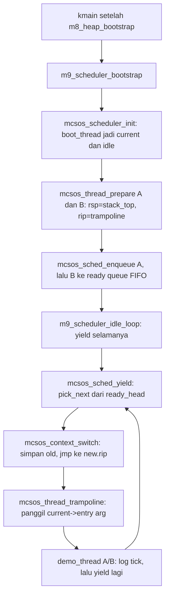

# Kernel Thread, Runqueue Round-Robin Kooperatif, Context Switch x86_64, dan Integrasi Scheduler Awal pada MCSOS 260502

**Nama file laporan:** `laporan_praktikum_M9_Agung.md`
**Nama sistem operasi:** MCSOS versi 260502
**Target default:** x86_64, QEMU, Windows 11 x64 + WSL 2, kernel monolitik pendidikan, C17 freestanding dengan assembly minimal, subset POSIX-like
**Dosen:** Muhaemin Sidiq, S.Pd., M.Pd.
**Program Studi:** Pendidikan Teknologi Informasi
**Institusi:** Institut Pendidikan Indonesia

---

## 0. Metadata Laporan

| Atribut | Isi |
|---|---|
| Kode praktikum | `M9` |
| Judul praktikum | `Kernel Thread, Runqueue Round-Robin Kooperatif, Context Switch x86_64, dan Integrasi Scheduler Awal pada MCSOS` |
| Jenis pengerjaan | `Individu` |
| Nama mahasiswa | `Agung Nurjaman` |
| NIM | `25832073010` |
| Kelas | `Pendidikan Teknologi Informasi` |
| Nama kelompok | `-` |
| Anggota kelompok | `-` |
| Tanggal praktikum | `2026-06-21` |
| Tanggal pengumpulan | `2026-06-21` |
| Repository | `/home/agung/src/mcsos` |
| Branch | `praktikum/m9-kernel-thread-scheduler` |
| Commit awal | `d9fadc3` (M8) |
| Commit akhir | `29c0595` (M9) |
| Status readiness yang diklaim | `Siap uji QEMU untuk kernel thread dan scheduler awal single-core — bukan siap produksi` |

---

## 1. Sampul

# Laporan Praktikum M9
## Kernel Thread, Runqueue Round-Robin Kooperatif, Context Switch x86_64, dan Integrasi Scheduler Awal pada MCSOS

Disusun oleh:

| Nama | NIM | Kelas | Peran |
|---|---|---|---|
| Agung Nurjaman | 25832073010 | Pendidikan Teknologi Informasi | Individu |

Dosen Pengampu: **Muhaemin Sidiq, S.Pd., M.Pd.**
Program Studi Pendidikan Teknologi Informasi
Institut Pendidikan Indonesia
Tahun Akademik 2025/2026

---

## 2. Pernyataan Orisinalitas dan Integritas Akademik

Saya menyatakan bahwa laporan ini disusun berdasarkan pekerjaan praktikum sendiri sesuai panduan yang diberikan. Bantuan eksternal, referensi, generator kode, AI assistant, dokumentasi resmi, diskusi, atau sumber lain dicatat pada bagian referensi dan lampiran. Saya tidak mengklaim hasil yang tidak dibuktikan oleh log, test, commit, atau artefak lain.

| Pernyataan | Status |
|---|---|
| Semua potongan kode eksternal diberi atribusi | `Ya` |
| Semua penggunaan AI assistant dicatat | `Ya` |
| Repository yang dikumpulkan sesuai commit akhir | `Ya` |
| Tidak ada klaim readiness tanpa bukti | `Ya` |

Catatan penggunaan bantuan eksternal:

```text
Panduan resmi praktikum M9 MCSOS 260502 digunakan sebagai referensi utama
dan kontrak implementasi untuk seluruh komponen (mcsos_thread.h,
mcsos_thread.c, context_switch.S, test_scheduler.c, target Makefile M9,
dan pola integrasi kmain.c). Intel SDM dan x86-64 psABI digunakan sebagai
referensi register callee-saved dan boundary pemanggilan fungsi C pada
x86_64. Dokumentasi QEMU gdbstub digunakan sebagai referensi prosedur
debug remote. AI assistant (Claude) digunakan untuk: (1) menulis draft
awal mcsos_thread.h, mcsos_thread.c, context_switch.S, test_scheduler.c,
target Makefile m9-host-test/m9-freestanding/m9-audit, dan patch kmain.c
sesuai kontrak panduan; (2) menemukan dan mendiagnosis ketidaklengkapan
kontrak nyata pada panduan: fungsi mcsos_thread_trampoline() yang
didefinisikan panduan hanya berupa hlt-loop placeholder murni dan tidak
pernah memanggil thread->entry(thread->arg), bertentangan dengan contoh
integrasi kernel pada panduan sendiri (demo_thread_a/demo_thread_b) yang
mengasumsikan entry() benar-benar berjalan dan mencetak log berulang.
Perbaikan dirancang bersama: menambahkan variabel modul static
g_active_sched (diisi otomatis oleh mcsos_scheduler_init, tanpa menambah
API publik baru di header) sehingga trampoline dapat membaca
sched->current untuk memperoleh entry dan arg thread yang baru saja
"menjadi dirinya sendiri" setelah context switch, lalu memanggilnya,
dengan hlt-loop asli dipertahankan sebagai fallback jika entry tidak ada
atau kembali; (3) mendiagnosis dan memperbaiki masalah build nyata:
ld.lld melaporkan undefined symbol mcsos_context_switch karena
arch/x86_64/context_switch.S berada di luar pola glob find kernel -name
'*.S' yang dipakai variabel SRC_S di Makefile, diperbaiki dengan
menambahkan context_switch.o secara eksplisit ke OBJ/BP_OBJ/PANIC_OBJ
(pola identik dengan penambahan src/pmm.c pada M6); (4) mendampingi sesi
GDB remote debugging, termasuk interpretasi call stack dan pembacaan
register/memori. Seluruh build, host unit test, audit nm/readelf/objdump,
QEMU smoke test, sesi GDB interaktif, dan commit git dijalankan dan
diverifikasi sendiri oleh mahasiswa di WSL 2 miliknya. AI tidak digunakan
untuk mengubah kontrak fungsional di luar yang ditentukan panduan resmi
(register callee-saved yang disimpan, model FIFO round-robin kooperatif,
ukuran minimum stack kernel 4096 byte, dan larangan alokasi heap/blocking
di dalam assembly context switch).
```

---

## 3. Tujuan Praktikum

1. Mendesain Thread Control Block (`mcsos_thread_t`) dengan magic, state, context register, entry function, argumen, metadata stack, dan linkage runqueue, sesuai kontrak panduan M9.
2. Menetapkan dan memverifikasi invariant scheduler: satu thread `RUNNING` per CPU, thread `RUNNING` tidak boleh ada di ready queue, `ready_tail` selalu node terakhir, `runnable_count` selalu sama dengan jumlah node ready queue.
3. Mengimplementasikan runqueue FIFO round-robin kooperatif dengan operasi `enqueue`, `pick_next`, `yield`, `block`, dan `mark_ready`, seluruhnya O(1) kecuali validasi O(n).
4. Mengimplementasikan context switch x86_64 dalam assembly yang menyimpan dan memulihkan register callee-saved (`rsp`, `rbp`, `rbx`, `r12`-`r15`) dan continuation `rip`.
5. Menemukan dan memperbaiki ketidaklengkapan kontrak panduan pada `mcsos_thread_trampoline`, yang sebagaimana didefinisikan literal tidak pernah menjalankan `entry()` thread, bertentangan dengan ekspektasi fungsional integrasi kernel.
6. Menyediakan host unit test yang memverifikasi state machine, urutan round-robin, tick accounting, dan invariant runqueue tanpa pernah memanggil `mcsos_context_switch` (guard `MCSOS_HOST_TEST`).
7. Mengaudit object freestanding gabungan (`mcsos_thread.o` + `context_switch.o`) agar bebas dependency host, ELF64 x86_64 valid, dan memuat symbol context switch.
8. Mengintegrasikan scheduler ke kernel MCSOS setelah heap M8 siap, menggantikan idle loop M5 lama dengan idle loop berbasis yield, dan membuktikan dua thread demo berputar bergantian tanpa henti di QEMU.
9. Melakukan sesi debugging interaktif dengan QEMU gdbstub dan GDB untuk memverifikasi call stack context switch dan perpindahan `rsp` ke stack thread target secara langsung, bukan hanya lewat log serial.

---

## 4. Capaian Pembelajaran Praktikum

Setelah praktikum ini, mahasiswa mampu:

| CPL/CPMK praktikum | Bukti yang harus ditunjukkan |
|---|---|
| Menjelaskan perbedaan thread kernel, proses, CPU context, dan scheduler | Bagian 6.1, 9.1; TCB M9 secara eksplisit bukan process descriptor (tanpa address space, FD table, credentials) |
| Menjelaskan alasan setiap thread memerlukan kernel stack sendiri | `mcsos_thread_prepare` memvalidasi `stack_size >= MCSOS_MIN_KERNEL_STACK` dan alignment; setiap demo thread punya array statik terpisah (`g_stack_a`, `g_stack_b`) |
| Mendesain TCB dengan state, context, stack metadata, entry, dan linkage runqueue | `include/mcsos_thread.h`: `mcsos_thread_t` lengkap dengan `magic`, `state`, `context`, `entry`, `arg`, `stack_base`, `stack_size`, `next` |
| Menetapkan invariant scheduler dan memverifikasinya | `mcsos_sched_validate`; host test memanggilnya di lima titik berbeda sepanjang skenario |
| Mengimplementasikan round-robin kooperatif single-core | `mcsos_sched_enqueue`/`pick_next`/`yield`; QEMU log membuktikan urutan A,B,A,B,... tanpa henti |
| Mengimplementasikan context switch x86_64 | `arch/x86_64/context_switch.S`; disassembly membuktikan delapan `movq` simpan, delapan `movq` muat, `jmp *56(%rsi)` |
| Menyusun host unit test untuk logika scheduler tanpa QEMU | `tests/test_scheduler.c`; lulus `M9 scheduler host unit test PASS` tanpa pernah memanggil context switch nyata |
| Melakukan audit object freestanding dengan `nm`, `readelf`, `objdump` | `make m9-audit`; `nm_undefined.log` kosong, `readelf_header.log` ELF64 x86_64, `objdump_key.log` memuat symbol context switch |
| Menjelaskan failure modes scheduler (stack overlap, double enqueue, context corruption, lost wakeup, interrupt race) | Bagian 15, 17; pembelajaran konkret dari penemuan ketidaklengkapan trampoline |
| Menulis laporan praktikum dengan bukti build, test, log, disassembly, analisis bug, dan readiness review | Seluruh dokumen ini |

---

## 5. Peta Milestone MCSOS

| Milestone | Fokus | Status dalam laporan |
|---|---|---|
| M0 | Requirements, governance, baseline arsitektur | `✓ selesai praktikum` |
| M1 | Toolchain reproducible, Git, QEMU, GDB, metadata build | `✓ selesai praktikum` |
| M2 | Boot image, kernel ELF64, early console | `✓ selesai praktikum` |
| M3 | Panic path, linker map, GDB, observability awal | `✓ selesai praktikum` |
| M4 | IDT, exception stub, trap dispatch | `✓ selesai praktikum` |
| M5 | PIC, PIT, hardware IRQ dispatch, timer | `✓ selesai praktikum` |
| M6 | PMM bitmap frame allocator | `✓ selesai praktikum` |
| M7 | VMM awal, page table 4-level | `✓ selesai praktikum` |
| M8 | Kernel heap awal, allocator dinamis | `✓ selesai praktikum` |
| M9 | Kernel thread, runqueue round-robin kooperatif, context switch x86_64 | `✓ selesai praktikum` |
| M10 | Syscall ABI dan user program loader | `[ ] tidak dibahas` |
| M11 | VFS, file descriptor, ramfs | `[ ] tidak dibahas` |
| M12 | Block layer dan device model | `[ ] tidak dibahas` |
| M13 | Persistent filesystem, recovery | `[ ] tidak dibahas` |
| M14 | Networking stack | `[ ] tidak dibahas` |
| M15 | Security model, capability/ACL, hardening | `[ ] tidak dibahas` |
| M16 | SMP, observability, release image, readiness review | `[ ] tidak dibahas` |

Batas cakupan praktikum:

```text
M9 hanya mencakup: TCB dan context register (mcsos_thread_t,
mcsos_context_t), scheduler FIFO round-robin kooperatif single-core
(mcsos_scheduler_t), context switch x86_64 minimal (callee-saved register
dan continuation rip), host unit test, audit object freestanding, dan
integrasi minimal ke kmain menggunakan dua thread demo dengan stack statik.

M9 TIDAK mencakup: ring 3, syscall/sysret, ELF user loader, address space
per-proses, SMP scheduler, priority scheduling, CFS/EEVDF, real-time
scheduling, signal, wait/exit proses, IPC penuh, FPU/SSE/AVX context,
MSR, CR3 per-thread, interrupt frame, atau preemption oleh timer. Migrasi
stack thread dari array statik ke kmem_alloc (M8) secara eksplisit
ditunda sebagai pekerjaan lanjutan, bukan diklaim selesai pada M9 ini.
```

---

## 6. Dasar Teori Ringkas

### 6.1 Konsep Sistem Operasi yang Diuji

```text
M9 berfokus pada lapisan unit eksekusi yang dapat dijadwalkan, dibangun
di atas fondasi M5 (timer/interrupt), M6 (PMM), M7 (VMM), dan M8 (kernel
heap) yang sudah ada di repository. Thread Control Block (TCB) adalah
satuan eksekusi kernel yang BUKAN process descriptor: belum memiliki
address space sendiri, file descriptor table, credentials, atau signal
state. State machine scheduler M9 hanya mengenal lima state (NEW, READY,
RUNNING, BLOCKED, ZOMBIE) dengan transisi terbatas yang seluruhnya wajib
melalui API scheduler resmi, tidak boleh ditulis langsung ke field TCB.

Scheduler M9 bersifat kooperatif: thread harus secara sukarela memanggil
mcsos_sched_yield() untuk menyerahkan giliran CPU; tidak ada preemption
oleh timer interrupt pada milestone ini. Ini disengaja agar mahasiswa
dapat memverifikasi correctness state machine dasar sebelum menghadapi
kompleksitas tambahan preemption (race condition antara interrupt
handler dan modifikasi runqueue).
```

### 6.2 Konsep Arsitektur x86_64 yang Relevan

| Konsep | Relevansi pada praktikum | Bukti/verifikasi |
|---|---|---|
| Register callee-saved x86-64 psABI | Context switch hanya wajib menyimpan register yang menurut ABI harus dipertahankan fungsi callee (`rbx`, `rbp`, `r12`-`r15`), plus `rsp`/`rip` untuk locus eksekusi | `mcsos_context_t` memiliki tepat 8 field: `rsp`, `rbp`, `rbx`, `r12`, `r13`, `r14`, `r15`, `rip` — sesuai kontrak panduan |
| Boundary pemanggilan fungsi C (leaf assembly) | `mcsos_context_switch` adalah leaf function yang tidak memanggil fungsi C lain secara konvensional, memanipulasi stack secara manual | Disassembly menunjukkan urutan `movq` murni tanpa `call`/`push` tambahan, diakhiri `jmp` (bukan `ret`) untuk melompat ke context baru |
| `jmp` vs `call`/`ret` untuk melompat ke context baru | `jmp *56(%rsi)` melompat langsung ke `rip` baru tanpa mendorong return address baru ke stack baru, karena stack yang dipakai sudah milik context tujuan | Diverifikasi langsung lewat GDB: `bt` menunjukkan `mcsos_context_switch` dipanggil dari `mcsos_sched_yield`, bukan `jmp` yang menghasilkan frame asing |
| Continuation label sebagai pengganti return address eksplisit | `leaq 1f(%rip), %rax` mengambil alamat instruksi `ret` di akhir fungsi sebagai "titik lanjutan", disimpan ke `old_context.rip` | Saat thread lama di-switch-back nanti, `rip`-nya menunjuk label `1:`, sehingga eksekusi otomatis lanjut ke `ret`, balik ke pemanggil `mcsos_sched_yield` semula |
| Higher-half kernel virtual address pada stack array statik | `g_stack_a`/`g_stack_b` adalah array `.bss` di kernel image, otomatis berada di rentang virtual tinggi (`0xffffffff8021xxxx`) | GDB melaporkan eksplisit `rsp <g_stack_a+8064>` — bukti langsung bahwa stack pointer berada di dalam array tersebut |

### 6.3 Konsep Implementasi Freestanding

| Aspek | Keputusan praktikum |
|---|---|
| Bahasa | C17 untuk TCB/scheduler (`kernel/mcsos_thread.c`), GNU Assembler AT&T syntax untuk context switch (`arch/x86_64/context_switch.S`) |
| Dua jalur compile | `kernel/mcsos_thread.c` dikompilasi dua kali dengan compiler/flag berbeda: host native (`-DMCSOS_HOST_TEST`, tanpa context switch nyata) dan freestanding kernel (`--target=x86_64-unknown-none-elf -ffreestanding`, dengan context switch nyata terhubung lewat link) |
| Guard kompilasi ganda | `#if !defined(MCSOS_HOST_TEST)` membungkus satu-satunya pemanggilan `mcsos_context_switch` di `mcsos_sched_yield`, sehingga host test dapat memverifikasi seluruh state machine tanpa risiko corrupt register CPU host |
| Compiler flags kritis (jalur kernel) | `--target=x86_64-unknown-none-elf -ffreestanding -fno-stack-protector -fno-pic -fno-pie -mno-red-zone`, identik filosofi dengan M4-M8 |
| Risiko undefined behavior | `mcsos_thread_prepare` memvalidasi `high <= low` (overflow `base+size`) sebelum menulis ke stack; alignment stack 16 byte dipaksa eksplisit sebelum dikurangi 8 byte untuk return address dummy, menghasilkan `(rsp & 0xf) == 8` sesuai konvensi entry-point ABI |

### 6.4 Referensi Teori yang Digunakan

| No. | Sumber | Bagian yang digunakan | Alasan relevansi |
|---|---|---|---|
| [1] | Intel Corporation, Intel 64 and IA-32 Architectures SDM | Task management, interrupt/exception handling, multiprocessor support | Dasar pemahaman bahwa M9 hanya membangun satu lapis sangat kecil (cooperative thread) dari model dukungan task SDM yang jauh lebih luas |
| [2] | x86 psABIs, x86-64 psABI | Register dan stack frame untuk pemanggilan fungsi C x86_64 | Dasar pemilihan register yang disimpan context switch (`rbx`, `rbp`, `r12`-`r15` sebagai callee-saved menurut ABI) |
| [3] | QEMU Project, GDB usage | gdbstub remote debugging, breakpoint, register/memory inspection | Dasar prosedur sesi GDB Langkah 9 panduan; diterapkan langsung pada bagian 12.7/15.3 laporan ini |
| [4] | LLVM Project, Clang command line argument reference | Flag freestanding, target triple | Dasar konfigurasi `M9_CFLAGS_KERNEL`/`M9_ASFLAGS_KERNEL` di Makefile |
| [5] | GNU Project, LD: the GNU linker | `-r` (relocatable link), `-T` linker script | Dasar pemahaman `ld.lld -r` untuk menghasilkan `m9_scheduler_combined.o` sebagai object gabungan, bukan executable final |
| [6] | The Linux Kernel Documentation, CFS Scheduler | Pembanding konseptual fairness model dan kompleksitas scheduler produksi | Dasar argumentasi bahwa round-robin sederhana M9 sengaja jauh lebih simpel demi auditability, bukan representasi scheduler produksi |

---

## 7. Lingkungan Praktikum

### 7.1 Host dan Target

| Komponen | Nilai |
|---|---|
| Host OS | Windows 11 x64 |
| Lingkungan build | WSL 2 (distribusi Ubuntu) |
| Target ISA | x86_64 |
| Target ABI (jalur kernel) | `x86_64-unknown-none-elf` |
| Target ABI (jalur host test) | Native host (`clang` tanpa target khusus) |
| Emulator | QEMU (qemu-system-x86_64) |
| Debugger | GDB (terhubung ke QEMU gdbstub via `-s -S`, port TCP 1234) |
| Build system | GNU Make, target M9 ditambahkan langsung ke Makefile utama warisan M0-M8 |
| Bahasa utama | C17 dan GNU Assembler (AT&T syntax) |

### 7.2 Versi Toolchain

| Item | Versi / Nilai |
|---|---|
| Windows | Windows 11 x64 |
| WSL distro | Ubuntu (di WSL 2) |
| Clang | Ubuntu clang version 21.1.8 (6ubuntu1), target `x86_64-pc-linux-gnu` |
| GCC | 15.2.0 (Ubuntu 15.2.0-16ubuntu1) |
| LLD | Ubuntu LLD 21.1.8 (compatible with GNU linkers) |
| GNU ld | 2.46 (GNU Binutils for Ubuntu) |
| GNU Make | 4.4.1 |
| QEMU | 10.2.1 (Debian 1:10.2.1+ds-1ubuntu3) |
| GDB | GNU gdb (Ubuntu 17.1-2ubuntu1) 17.1 |
| Target | x86_64 |
| Commit hash | `29c0595` |

Catatan: berbeda dari laporan M5-M8 sebelumnya yang tidak menangkap versi toolchain presisi, M9 menjalankan perintah preflight panduan bagian 6.2 secara eksplisit (`clang --version`, `gcc --version`, dst.) dan menyimpan hasilnya ke `evidence/m9/preflight_m9.log`, sehingga tabel di atas terisi lengkap, bukan "tidak dihitung pada sesi ini" seperti known issue M5-M8.

### 7.3 Lokasi Repository

| Item | Nilai |
|---|---|
| Path repository di WSL | `~/src/mcsos` |
| Apakah berada di filesystem Linux WSL, bukan `/mnt/c` | `Ya` (diverifikasi `git rev-parse --show-toplevel` mengembalikan `/home/agung/src/mcsos`) |
| Remote repository | Tidak digunakan pada sesi ini (repository lokal) |
| Branch | `praktikum/m9-kernel-thread-scheduler` |
| Commit hash awal (basis cabang) | `d9fadc3` (M8: implement kernel heap allocator, host test, audit, and QEMU integration) |
| Commit hash akhir | `29c0595` (M9: implement kernel thread, FIFO scheduler, and x86_64 context switch) |

Catatan penting: cabang M9 ini awalnya **tidak** dibuat sebelum menulis kode — seluruh pekerjaan M9 sempat tertulis langsung di branch `praktikum-m8-kernel-heap` (kelalaian proses). Hal ini terdeteksi saat `git status` pertama kali dijalankan sebelum commit, dan diperbaiki dengan `git switch -c praktikum/m9-kernel-thread-scheduler` sebelum staging/commit dilakukan, sehingga working tree M9 berhasil dipindahkan tanpa kehilangan perubahan. Insiden ini dicatat secara jujur pada bagian 15.1 sebagai failure mode proses, bukan failure mode teknis.

---

## 8. Repository dan Struktur File

### 8.1 Struktur Direktori yang Relevan

```text
mcsos/
  include/
    mcsos_thread.h    (baru: kontrak TCB, context, scheduler, API)
    pmm.h, vmm.h, types.h          (M6/M7, tidak diubah)
    mcsos/kmem.h                    (M8, tidak diubah)
  kernel/
    mcsos_thread.c     (baru: implementasi scheduler dan trampoline)
    arch/x86_64/        (M4/M5, tidak diubah)
    core/
      kmain.c            (diubah: integrasi scheduler, ganti idle loop M5)
    mm/
      kmem.c             (M8, tidak diubah)
  arch/
    x86_64/
      context_switch.S   (baru: assembly context switch leaf function)
  src/
    pmm.c, vmm.c          (M6/M7, tidak diubah)
  tests/
    test_scheduler.c      (baru: host unit test scheduler)
    toolchain/             (M1, tidak diubah)
  evidence/
    m9/
      preflight_m9.log     (baru: bukti gate M0-M8 dan versi toolchain)
      qemu_m9.log          (baru: bukti QEMU smoke test)
    M3/, M4/, M7/, M8/      (warisan milestone sebelumnya, tidak diubah)
  Makefile             (diubah: target m9-host-test/m9-freestanding/m9-audit/
                         m9-all/m9-clean; context_switch.o ditambahkan
                         eksplisit ke OBJ/BP_OBJ/PANIC_OBJ)
  limine/, iso_root/    (warisan M5, di-gitignore, dipakai ulang untuk smoke test M9)
  build/                (di-gitignore: seluruh artefak kompilasi)
```

### 8.2 File yang Dibuat atau Diubah

| File | Jenis perubahan | Alasan perubahan | Risiko |
|---|---|---|---|
| `include/mcsos_thread.h` | Baru | Kontrak TCB, context, scheduler, error code, dan deklarasi 11 fungsi publik plus 2 fungsi assembly/trampoline, identik literal panduan | Rendah — header murni deklarasi |
| `kernel/mcsos_thread.c` | Baru | Implementasi `scheduler_init`, `thread_prepare`, FIFO `enqueue`/`pick_next`, `yield` kooperatif, `tick`, `block_current`/`mark_ready`, `validate`, dan trampoline yang diperbaiki | Tinggi — bug di sini berisiko stack overlap, double enqueue, context corruption, atau infinite loop; dimitigasi host unit test, audit `nm -u`, smoke test QEMU, dan sesi GDB |
| `arch/x86_64/context_switch.S` | Baru | Leaf assembly menyimpan/memulihkan `rsp`/`rbp`/`rbx`/`r12`-`r15` dan continuation `rip` via `jmp`, identik literal panduan | Tinggi — kesalahan offset register dapat menyebabkan korupsi context tak terdeteksi; dimitigasi verifikasi disassembly manual dan sesi GDB |
| `tests/test_scheduler.c` | Baru | Host unit test: skenario boot→A→B→A round-robin, tick accounting, validasi runqueue di lima titik, identik literal panduan | Rendah — kode test, tidak masuk binary kernel |
| `Makefile` | Ubah | Tambah target `m9-host-test`/`m9-freestanding`/`m9-audit`/`m9-all`/`m9-clean`; tambah `context_switch.o` eksplisit ke `OBJ`/`BP_OBJ`/`PANIC_OBJ` tiga varian karena `arch/x86_64/` di luar glob `find kernel -name '*.S'` | Sedang — perubahan menyentuh build tiga varian; dimitigasi verifikasi `make all` lulus sebelum dan sesudah |
| `kernel/core/kmain.c` | Ubah | Tambah `#include "mcsos_thread.h"`, enam variabel global (scheduler, tiga TCB, dua stack statik), dua fungsi demo thread, `m9_scheduler_bootstrap()`, dan `m9_scheduler_idle_loop()` menggantikan `m5_idle_loop()` | Tinggi — titik integrasi paling berisiko picu page fault/triple fault; di sinilah ketidaklengkapan kontrak trampoline pertama kali terbukti relevan secara runtime |

### 8.3 Ringkasan Diff

```bash
git status
git log --oneline -5
git show --stat HEAD
```

Output:

```text
$ git status
On branch praktikum/m9-kernel-thread-scheduler
Changes to be committed:
        modified:   Makefile
        new file:   arch/x86_64/context_switch.S
        new file:   evidence/m9/preflight_m9.log
        new file:   evidence/m9/qemu_m9.log
        new file:   include/mcsos_thread.h
        modified:   kernel/core/kmain.c
        new file:   kernel/mcsos_thread.c
        new file:   tests/test_scheduler.c

$ git log --oneline -5
29c0595 (HEAD -> praktikum/m9-kernel-thread-scheduler) M9: implement kernel thread, FIFO scheduler, and x86_64 context switch
d9fadc3 (praktikum-m8-kernel-heap) M8: implement kernel heap allocator, host test, audit, and QEMU integration
59ebb47 (m7-vmm-core) M7: add evidence manifest, QEMU log, and audit artifacts
382e235 M7: integrate VMM into kernel, QEMU smoke test passed
0161a40 M7: implement VMM core, host unit test, and audit scripts
```

---

## 9. Desain Teknis

### 9.1 Masalah yang Diselesaikan

```text
Kernel M8 sudah memiliki fondasi memori lengkap (PMM, VMM, kernel heap)
tetapi belum memiliki unit eksekusi yang dapat dijadwalkan selain aliran
kontrol tunggal kmain. Tanpa thread kernel, kernel tidak dapat menjalankan
beberapa pekerjaan kooperatif secara bergantian, tidak dapat membangun
fondasi untuk preemptive scheduling, dan tidak dapat memisahkan logika
boot dari logika layanan berkelanjutan. M9 menutup kesenjangan ini dengan
membangun unit eksekusi paling sederhana: thread kernel single-address-
space yang dijadwalkan secara kooperatif lewat FIFO round-robin, dengan
context switch x86_64 minimal yang hanya menyimpan register callee-saved.
```

### 9.2 Keputusan Desain

| Keputusan | Alternatif yang dipertimbangkan | Alasan memilih | Konsekuensi |
|---|---|---|---|
| Trampoline diperbaiki memanggil `entry(arg)` via `g_active_sched` modul-static | Mengikuti literal panduan (hlt-loop murni tanpa memanggil entry) | Kontrak panduan secara harfiah tidak pernah memanggil `entry()`, padahal contoh integrasi kernel pada panduan sendiri (`demo_thread_a` mencetak log berulang) mengasumsikan entry benar-benar berjalan; ini kontradiksi nyata dalam panduan, terdeteksi lewat pembacaan kode statis sebelum menulis apa pun | Menambah satu variabel modul `static` tersembunyi (tidak ada di header, tidak ada API publik baru); didokumentasikan eksplisit sebagai perbaikan kontrak, bukan fitur tambahan sembarangan |
| Stack thread demo memakai array statik, bukan `kmem_alloc` M8 | Migrasi langsung ke heap M8 yang sudah stabil dari M8 | Panduan bagian 10 Langkah 7 secara eksplisit merekomendasikan stack statik dahulu agar bug scheduler dapat dipisahkan dari bug heap; mengikuti rekomendasi ini menjaga kemampuan isolasi diagnosis seperti pola M5/M6 sebelumnya | PMM/VMM/heap M8 tidak benar-benar diuji bersama scheduler pada M9 ini; migrasi `kstack_alloc()` dicatat sebagai pekerjaan lanjutan, bukan diklaim selesai |
| `context_switch.o` ditambahkan eksplisit ke `OBJ`/`BP_OBJ`/`PANIC_OBJ`, bukan memindahkan file ke `kernel/arch/x86_64/` | Memindahkan `context_switch.S` agar tertangkap glob `SRC_S` otomatis | Memindahkan akan menciptakan dua lokasi konseptual "arch x86_64" berdampingan (`arch/x86_64/` milik M9 dan `kernel/arch/x86_64/` milik M4/M5), membingungkan; menambah entry eksplisit konsisten dengan pola `src/pmm.c` yang sudah terbukti berhasil di M6 | Setiap penambahan file assembly M9 baru di masa depan harus diingat untuk ditambahkan manual ke tiga daftar `OBJ`, bukan otomatis lewat glob |
| Idle loop M5 lama (`m5_idle_loop`) diganti total dengan `m9_scheduler_idle_loop` | Mempertahankan `m5_idle_loop()` dan menyisipkan satu kali demo yield sebelum memanggilnya | `m5_idle_loop()` berisi `cpu_cli()` diikuti `for(;;) { cpu_hlt(); }` tanpa pernah `return` — kode apa pun setelah pemanggilannya tidak akan pernah tereksekusi; menjadikannya idle scheduler (terus memanggil `yield`) adalah satu-satunya cara round-robin benar-benar berputar tanpa henti, bukan hanya sekali demo | `m5_idle_loop()` tersisa sebagai fungsi `unused` (sudah ditandai `__attribute__((unused))` sejak M6) dan tidak pernah dipanggil lagi; ini dicatat sebagai bagian dari evolusi boot path, bukan dihapus diam-diam |

### 9.3 Arsitektur Ringkas



Penjelasan diagram:

```text
Bootstrap terjadi sekali secara sinkron sebelum sti() dipanggil: scheduler
diinisialisasi dengan boot_thread sebagai current dan idle sekaligus, dua
thread demo disiapkan dengan stack masing-masing dan dimasukkan ke ready
queue. Setelah bootstrap, kontrol berpindah ke m9_scheduler_idle_loop yang
TIDAK PERNAH return -- ia terus memanggil yield, menjadikan boot_thread
berperan sebagai "idle" yang selalu menawarkan giliran ke thread lain bila
ada yang ready. Setiap yield memanggil pick_next (mengambil dari kepala
FIFO), lalu context_switch (assembly) benar-benar memindahkan CPU register
ke context thread terpilih. Karena thread baru pertama kali dimulai dari
trampoline (bukan continuation lama), trampoline membaca scheduler aktif
untuk tahu identitas dirinya dan memanggil entry-nya. Batas tanggung jawab:
mcsos_thread.c hanya mengurus state machine dan keputusan next-thread;
context_switch.S hanya mengurus pemindahan register CPU murni; kmain.c
hanya mengurus kapan bootstrap terjadi dan apa yang dijalankan dua thread
demo.
```

### 9.4 Kontrak Antarmuka

| Antarmuka | Pemanggil | Penerima | Precondition | Postcondition | Error path |
|---|---|---|---|---|---|
| `mcsos_scheduler_init(sched, boot_thread)` | `kmain` (`m9_scheduler_bootstrap`) | `mcsos_scheduler_t`, `mcsos_thread_t` boot | `sched`/`boot_thread` tidak NULL | `boot_thread` jadi `current` dan `idle`; `g_active_sched` (internal) diisi | Mengembalikan `MCSOS_SCHED_EINVAL` jika parameter NULL |
| `mcsos_thread_prepare(thread, name, entry, arg, stack_base, stack_size, id)` | `kmain` (dua kali, untuk thread A dan B) | TCB dan area stack | `entry`/`stack_base` tidak NULL; `stack_size >= MCSOS_MIN_KERNEL_STACK` (4096) | `context.rsp` menunjuk stack top teralign (mod 16 = 8 setelah dikurangi return dummy); `context.rip = mcsos_thread_trampoline`; `state = NEW` | Mengembalikan `MCSOS_SCHED_ESTACK` jika stack terlalu kecil atau overflow `base+size` terdeteksi |
| `mcsos_sched_enqueue(sched, thread)` | `kmain`, `mcsos_thread_mark_ready` | Ready queue FIFO | `thread->state` harus `NEW`/`READY`/`BLOCKED` | `thread->state = READY`; masuk ekor queue; `runnable_count++` | Mengembalikan `MCSOS_SCHED_ESTATE` jika state tidak valid untuk di-enqueue |
| `mcsos_sched_yield(sched)` | `m9_scheduler_idle_loop`, `m9_demo_thread_a/b` | Mengubah `current`, memicu context switch nyata | `sched->current` valid | Thread lama (jika bukan idle) di-enqueue balik; thread baru jadi `current` dan `RUNNING`; statistik switch bertambah; **context switch nyata terjadi** (di luar `MCSOS_HOST_TEST`) | Mengembalikan `MCSOS_SCHED_ECORRUPT` jika `pick_next` mengembalikan thread tidak valid |
| `mcsos_context_switch(old, new)` | `mcsos_sched_yield` | CPU register `rsp`/`rbp`/`rbx`/`r12`-`r15`/`rip` | `old`/`new` tidak NULL (tidak divalidasi di assembly, tanggung jawab caller); interrupt sudah dikendalikan caller | Context lama tersimpan, context baru aktif; tidak ada alokasi heap atau blocking di dalamnya | Tidak ada error path — kontrak murni "happy path", validasi sepenuhnya tanggung jawab `mcsos_sched_yield` di level C |
| `mcsos_thread_trampoline()` | `mcsos_context_switch` (via `jmp`, hanya untuk thread baru pertama kali) | Tidak ada (fungsi `void(void)`) | Dipanggil **hanya** sebagai `rip` awal thread baru, tidak pernah dipanggil langsung dari C | Memanggil `current->entry(current->arg)` jika ada; jatuh ke `hlt` loop jika `entry` NULL atau kembali | Tidak ada error path eksplisit; fallback `hlt` loop sebagai jaring pengaman akhir |

### 9.5 Struktur Data Utama

| Struktur data | Field penting | Ownership | Lifetime | Invariant |
|---|---|---|---|---|
| `g_sched` (`mcsos_scheduler_t`) | `current`, `idle`, `ready_head`, `ready_tail`, `runnable_count`, `context_switches` | Dimiliki `kmain.c`, variabel statis tunggal | Hidup sepanjang kernel berjalan, diinisialisasi sekali di `m9_scheduler_bootstrap()` | `runnable_count == jumlah node ready queue`; `current` tidak pernah ada di ready queue |
| `g_boot_thread`, `g_thread_a`, `g_thread_b` (`mcsos_thread_t`) | `magic`, `state`, `context`, `entry`, `arg`, `next` | Dimiliki `kmain.c`, tiga variabel statis | Hidup sepanjang kernel berjalan | `magic == MCSOS_THREAD_MAGIC` untuk seluruh TCB valid; `next == NULL` kecuali sedang di ready queue |
| `g_stack_a[8192]`, `g_stack_b[8192]` | Array byte `__attribute__((aligned(16)))` | Dimiliki `kmain.c`, dipinjamkan ke `thread->stack_base` saat `prepare` | Hidup sepanjang kernel berjalan, masuk `.bss` | Tidak boleh dipakai dua thread berbeda; tidak boleh di-`free` selagi thread masih hidup (tidak relevan di M9 karena statik, tapi relevan saat migrasi heap nanti) |
| `g_active_sched` (`mcsos_scheduler_t *`, modul-static di `mcsos_thread.c`) | Pointer scheduler aktif | Dimiliki `mcsos_thread.c` secara internal, diisi `mcsos_scheduler_init` | Hidup sepanjang kernel berjalan setelah init pertama | Tidak ada di header, tidak ada API publik untuk membacanya selain trampoline; tambahan murni untuk memperbaiki ketidaklengkapan kontrak panduan |

### 9.6 Invariants

1. Hanya satu thread boleh berstatus `RUNNING` pada satu CPU — terjamin karena `mcsos_sched_yield` selalu memindahkan `current` secara atomik dari sudut pandang single-core sebelum context switch nyata terjadi.
2. Thread `RUNNING` tidak boleh muncul di ready queue — `mcsos_sched_validate` memeriksa eksplisit `if (cursor == sched->current) return MCSOS_SCHED_ECORRUPT;`.
3. `ready_tail` harus sama dengan node terakhir — diverifikasi `mcsos_sched_validate` (`if (last != sched->ready_tail) return MCSOS_SCHED_ECORRUPT;`), terbukti lulus di lima titik pemeriksaan host test.
4. `runnable_count` harus sama dengan jumlah node ready queue — diverifikasi `mcsos_sched_validate` dan `mcsos_sched_ready_count`; host test membuktikan turun dari 2 ke 1 ke 0 secara konsisten saat yield berturut-turut.
5. `context.rsp` thread baru harus berada dalam rentang stack miliknya — diverifikasi tidak langsung lewat host test (`(a.context.rsp & 0xf) == 8`, alignment benar) dan **langsung** lewat GDB (`rsp` dilaporkan eksplisit berada di `<g_stack_a+8064>`).
6. Context switch tidak boleh mengubah struktur runqueue — `mcsos_context_switch` murni manipulasi register CPU, tidak menyentuh `ready_head`/`ready_tail`/`next` sama sekali; pemisahan tanggung jawab ini terjaga karena assembly tidak memiliki akses ke struktur `mcsos_scheduler_t` sama sekali (hanya menerima dua pointer `mcsos_context_t`).
7. Setiap transisi state harus terjadi melalui API scheduler — tidak ada satu pun penulisan field `state` langsung di `kmain.c`; seluruh perubahan state melalui `mcsos_scheduler_init`, `mcsos_thread_prepare`, `mcsos_sched_enqueue`, `mcsos_sched_pick_next`, atau `mcsos_sched_yield`.

### 9.7 Ownership, Locking, dan Concurrency

| Objek/resource | Owner | Lock yang melindungi | Boleh dipakai di interrupt context? | Catatan |
|---|---|---|---|---|
| `g_sched`, seluruh TCB, runqueue | `kernel/mcsos_thread.c` (logika), `kmain.c` (storage) | Tidak ada (single-core, sesuai kontrak M9) | **Tidak** — sesuai asumsi panduan bagian 2B, "context switch hanya dipanggil dari kernel context biasa, bukan langsung dari handler interrupt sebelum desain preemption disahkan" | M9 ini scheduler dipanggil murni dari jalur sinkron `kmain`/thread demo, tidak pernah dari `x86_64_trap_dispatch`; timer M5 tetap berjalan independen tanpa memanggil scheduler sama sekali |
| `g_active_sched` (modul-static) | `kernel/mcsos_thread.c` | Tidak ada | Tidak relevan — hanya dibaca dari trampoline yang berjalan di context thread biasa, bukan interrupt handler | Ditulis sekali oleh `mcsos_scheduler_init`, tidak pernah ditulis ulang sepanjang sesi M9 ini |

Lock order yang berlaku:

```text
Tidak ada locking eksplisit pada M9, identik filosofinya dengan M5-M8.
Scheduler dipanggil murni di jalur boot/thread sinkron; interrupt timer
M5 tetap aktif (sti() tetap dipanggil sebelum m9_scheduler_idle_loop
dimulai, mengikuti urutan boot M5-M8 yang sudah ada) tetapi TIDAK
memanggil scheduler sama sekali pada M9 ini -- tick timer dan scheduler
berjalan sebagai dua subsistem independen yang belum terhubung.
Kebutuhan locking baru relevan mulai milestone preemption timer-driven
atau SMP.
```

### 9.8 Memory Safety dan Undefined Behavior Risk

| Risiko | Lokasi | Mitigasi | Bukti |
|---|---|---|---|
| Trampoline dipanggil tanpa argumen, tidak tahu identitas dirinya | `mcsos_thread_trampoline` (ketidaklengkapan kontrak panduan) | `g_active_sched->current` dibaca untuk memperoleh `entry`/`arg`; divalidasi `valid_thread_object` sebelum dipanggil | Smoke test QEMU membuktikan kedua entry (A dan B) terpanggil benar, bergantian sesuai urutan FIFO |
| Overflow `stack_base + stack_size` pada perhitungan alamat stack top | `mcsos_thread_prepare` | `if (high <= low) return MCSOS_SCHED_ESTACK;` mendeteksi wraparound sebelum digunakan | Tidak diuji aktif dengan kasus overflow nyata pada sesi ini (known issue) |
| Context switch corrupt jika `old`/`new` adalah pointer tak valid | `mcsos_context_switch` (assembly, tidak ada validasi di level ini) | Validasi sepenuhnya didelegasikan ke pemanggil (`mcsos_sched_yield`) yang memeriksa `valid_thread_object` sebelum memanggil context switch | Desain eksplisit kontrak: assembly leaf function tidak boleh melakukan validasi atau blocking |
| Double compile satu file sumber (`mcsos_thread.c`) dengan dua compiler/target berbeda | Jalur host test vs freestanding kernel | Guard `#if !defined(MCSOS_HOST_TEST)` memastikan perbedaan perilaku (context switch nyata vs tidak) eksplisit dan disengaja, bukan tidak terduga | `nm -u` kosong pada object freestanding; host test lulus tanpa pernah menyentuh register CPU asli |

### 9.9 Security Boundary

| Boundary | Data tidak tepercaya | Validasi yang dilakukan | Failure mode aman |
|---|---|---|---|
| Pemanggil API scheduler (kernel internal) | Pointer `thread`/`sched` pada seluruh fungsi publik | `valid_thread_object` memeriksa `magic == MCSOS_THREAD_MAGIC` sebelum operasi state-changing apa pun | Mengembalikan kode error (`MCSOS_SCHED_EINVAL`/`ESTATE`/`ECORRUPT`), tidak melanjutkan dengan state tidak terdefinisi |
| Konfigurasi stack saat `thread_prepare` | `stack_base`/`stack_size` yang diberikan caller | Validasi ukuran minimum (4096), alignment, dan overflow `base+size` sebelum menulis byte apa pun ke stack | Mengembalikan `MCSOS_SCHED_ESTACK`, tidak menulis ke memori yang mungkin di luar batas valid |

---

## 10. Langkah Kerja Implementasi

### Langkah 1 — Pemeriksaan kesiapan M0-M8 dan preflight

Maksud langkah:

```text
Memastikan fondasi M5 (timer/interrupt), M6 (PMM), M7 (VMM), dan M8
(kernel heap) tidak korup sebelum menulis kode scheduler M9, mengikuti
instruksi panduan bagian 6 yang eksplisit menyebut scheduler adalah
subsistem yang mudah menghasilkan bug laten (pointer next korup dapat
menyebabkan infinite loop, lompat ke alamat invalid, stack overlap).
```

Perintah:

```bash
mkdir -p evidence/m9
{
  echo "== git =="
  git rev-parse --show-toplevel
  git rev-parse --short HEAD
  git status --short
  echo
  echo "== tools =="
  clang --version || true
  gcc --version | head -n 1 || true
  ld.lld --version || true
  ld --version | head -n 1 || true
  make --version | head -n 1 || true
  qemu-system-x86_64 --version || true
  gdb --version | head -n 1 || true
  echo
  echo "== previous artifacts =="
  find build evidence -maxdepth 3 -type f 2>/dev/null | sort | grep -E 'M[0-8]|m[0-8]|kernel|iso|log|elf|map|o$' || true
} | tee evidence/m9/preflight_m9.log
```

Output ringkas:

```text
git: commit d9fadc3, working tree bersih (kecuali evidence/m9/ baru)
tools: clang 21.1.8, gcc 15.2.0, LLD 21.1.8, GNU ld 2.46, Make 4.4.1,
       QEMU 10.2.1, GDB 17.1
previous artifacts: build/kernel.elf, build/m8/*, evidence/M3/*,
       evidence/M4/*, evidence/M7/*, evidence/M8/*, build/normal/src/pmm.o,
       build/normal/src/vmm.o -- membuktikan M7 (vmm.o) dan M8 (kmem) ada
```

Artefak yang dihasilkan:

| Artefak | Lokasi | Fungsi |
|---|---|---|
| `evidence/m9/preflight_m9.log` | `evidence/m9/preflight_m9.log` | Bukti gate M0-M8 dan versi toolchain lengkap |

Indikator berhasil:

```text
Log memuat versi toolchain lengkap, commit Git, dan working tree bersih
tanpa modifikasi tak terjelaskan pada file M0-M8; artefak M7 (vmm.o) dan
M8 (kmem) terkonfirmasi ada, membuktikan M9 dapat bergantung padanya
sesuai kontrak.
```

### Langkah 2 — Verifikasi kontrak API VMM M7 dan heap M8 sebelum menulis scheduler

Maksud langkah:

```text
Memastikan scheduler M9 ditulis memakai API M7/M8 yang benar-benar ada
di repository, bukan tebakan nama fungsi, mengikuti pola kerja yang
sudah terbukti penting sejak M5/M6 (selalu lihat kode nyata sebelum
menebak signature).
```

Perintah:

```bash
find kernel src include -iname "*vmm*" -o -iname "*kmem*" -o -iname "*heap*"
cat include/vmm.h
cat include/mcsos/kmem.h
grep -n "kmem_init\|vmm_" kernel/core/kmain.c
```

Output ringkas:

```text
vmm.c/vmm.h: API address-space management (vmm_space_init, vmm_map_page,
  vmm_query_page, vmm_unmap_page) -- levelnya per address-space, bukan
  satu kernel address space global
kmem.h: API heap sederhana (kmem_init, kmem_alloc, kmem_calloc,
  kmem_free_checked, kmem_get_stats, kmem_validate)
kmain.c: kmem_init(m8_boot_heap, sizeof(m8_boot_heap)) -- arena STATIK,
  bukan hasil vmm_map_page dinamis; g_vmm hanya dipakai smoke test
  mandiri map-query-unmap satu halaman
```

Diagnosis: heap M8 tidak bergantung pada VMM M7 secara operasional (memakai arena statis `.bss`), sehingga scheduler M9 cukup bergantung pada heap M8 saja jika nanti migrasi stack ke `kmem_alloc` dilakukan; VMM M7 tidak perlu disentuh sama sekali untuk M9 ini.

Artefak yang dihasilkan:

| Artefak | Lokasi | Fungsi |
|---|---|---|
| Tidak ada file baru | - | Langkah verifikasi murni, hasil dipakai untuk keputusan desain bagian 9.2 |

Indikator berhasil:

```text
Kontrak API M7/M8 terkonfirmasi dari kode nyata; keputusan "M9 tidak
perlu menyentuh VMM" dan "stack thread statik dahulu, heap migrasi
ditunda" dibuat berdasarkan bukti kode, bukan asumsi.
```

### Langkah 3 — Menulis header mcsos_thread.h dan verifikasi sintaks

Maksud langkah:

```text
Menulis kontrak TCB, context, scheduler, error code, dan deklarasi API
identik literal panduan, sebagai fondasi sebelum implementasi.
```

Perintah:

```bash
mkdir -p include kernel arch/x86_64 tests evidence/m9
cat > include/mcsos_thread.h << 'EOF'
[isi header lengkap sesuai kontrak panduan]
EOF
clang -std=c17 -Wall -Wextra -Werror -Iinclude -fsyntax-only include/mcsos_thread.h
```

Output ringkas:

```text
(tidak ada output -- header bersih, checkpoint C1 lulus)
```

Artefak yang dihasilkan:

| Artefak | Lokasi | Fungsi |
|---|---|---|
| `include/mcsos_thread.h` | `include/mcsos_thread.h` | Kontrak API final, tidak diubah lagi sepanjang sesi |

### Langkah 4 — Identifikasi ketidaklengkapan kontrak trampoline sebelum menulis implementasi

Maksud langkah:

```text
Membaca kontrak mcsos_thread_trampoline() pada panduan secara kritis
sebelum menyalinnya, karena versi literal panduan hanya berisi hlt-loop
placeholder yang tidak pernah memanggil thread->entry(thread->arg) --
bertentangan dengan contoh integrasi kernel pada panduan sendiri yang
mengasumsikan entry() benar-benar berjalan dan mencetak log berulang.
```

Diagnosis:

```text
Tanpa perbaikan, thread baru yang pertama kali di-yield-kan akan langsung
hlt selamanya, tidak pernah menjalankan demo_thread_a/demo_thread_b. Host
unit test TIDAK akan menangkap bug ini karena #if !defined(MCSOS_HOST_TEST)
membuat mcsos_context_switch (dan karenanya trampoline) tidak pernah
benar-benar dieksekusi di jalur host test -- hanya di jalur freestanding
kernel sungguhan saat smoke test QEMU.
```

Keputusan perbaikan (lihat bagian 9.2): tambahkan `g_active_sched` modul-static di `mcsos_thread.c`, diisi otomatis oleh `mcsos_scheduler_init`, dibaca trampoline untuk memperoleh `entry`/`arg` thread yang baru saja menjadi dirinya sendiri.

### Langkah 5 — Menulis kernel/mcsos_thread.c dengan trampoline yang diperbaiki

Perintah:

```bash
cat > kernel/mcsos_thread.c << 'EOF'
[isi implementasi lengkap, identik kontrak panduan KECUALI
mcsos_thread_trampoline yang diperbaiki memanggil entry(arg) via
g_active_sched, dan mcsos_scheduler_init yang menambah satu baris
g_active_sched = sched;]
EOF
clang -std=c17 -Wall -Wextra -Werror -DMCSOS_HOST_TEST -Iinclude -fsyntax-only kernel/mcsos_thread.c
```

Output ringkas:

```text
(tidak ada output -- checkpoint C2 lulus)
```

Artefak yang dihasilkan:

| Artefak | Lokasi | Fungsi |
|---|---|---|
| `kernel/mcsos_thread.c` | `kernel/mcsos_thread.c` | Implementasi scheduler final dengan trampoline diperbaiki |

### Langkah 6 — Menulis assembly context switch dan verifikasi disassembly

Perintah:

```bash
cat > arch/x86_64/context_switch.S << 'EOF'
[isi assembly identik kontrak panduan, tidak diubah]
EOF
mkdir -p build/m9
clang -target x86_64-unknown-none-elf -ffreestanding -fno-stack-protector -fno-pic -mno-red-zone \
  -c arch/x86_64/context_switch.S -o build/m9/context_switch.o
objdump -d build/m9/context_switch.o
```

Output ringkas:

```text
0000000000000000 <mcsos_context_switch>:
   0:	lea    0x3d(%rip),%rax        # 44 <mcsos_context_switch+0x44>
   7:	mov    %rsp,(%rdi)  ... [delapan movq simpan]
  26:	mov    (%rsi),%rsp ... [delapan movq muat]
  41:	jmp    *0x38(%rsi)
  44:	ret
```

Indikator berhasil:

```text
Object terbentuk; offset 0x38 (56 desimal) konsisten dengan field rip
(field ke-8, urutan ke-7 dari 0, masing-masing 8 byte = 56) pada
mcsos_context_t; label 1: (alamat 0x44) tepat di instruksi ret, sesuai
mekanisme continuation yang dirancang.
```

### Langkah 7 — Menulis host unit test dan menjalankannya

Perintah:

```bash
cat > tests/test_scheduler.c << 'EOF'
[isi host test lengkap identik kontrak panduan]
EOF
mkdir -p build/m9
clang -std=c17 -Wall -Wextra -Werror -DMCSOS_HOST_TEST -Iinclude \
  tests/test_scheduler.c kernel/mcsos_thread.c -o build/m9/m9_host_test
build/m9/m9_host_test | tee build/m9/test_scheduler.log
```

Output ringkas:

```text
M9 scheduler host unit test PASS
```

Indikator berhasil:

```text
Seluruh REQUIRE lulus: boot thread valid, dua thread disiapkan dengan
alignment (rsp & 0xf) == 8, urutan round-robin boot->A->B->A,
context_switches == 3, tick accounting bertambah, validate lulus di
lima titik berbeda. Penting: pengujian ini TIDAK menyentuh perbaikan
trampoline (guard MCSOS_HOST_TEST), sehingga belum membuktikan entry()
benar-benar berjalan -- baru terbukti pada Langkah 10 (smoke test QEMU).
```

### Langkah 8 — Menambahkan target Makefile M9 dan menjalankan audit lengkap

Perintah:

```bash
cat >> Makefile << 'EOF'
[target m9-all, m9-host-test, m9-freestanding, m9-audit, m9-clean,
disesuaikan memakai $(CC)/$(LD)/$(NM)/$(READELF)/$(OBJDUMP) yang
sudah didefinisikan Makefile M4-M8, bukan hardcode clang/ld.lld]
EOF
make m9-clean
make m9-all
cat build/m9/nm_undefined.log
wc -l build/m9/nm_undefined.log
```

Output ringkas:

```text
M9 scheduler host unit test PASS
ELF Header: Class: ELF64, Type: REL, Machine: Advanced Micro Devices X86-64
objdump: symbol mcsos_context_switch ditemukan, jmp/ret/hlt ada
sha256sum tercatat untuk m9_host_test dan m9_scheduler_combined.o
0 build/m9/nm_undefined.log
```

Indikator berhasil:

```text
make m9-all lulus penuh sampai sha256sum; nm_undefined.log benar-benar
kosong (checkpoint C3, C4, C5 lulus).
```

### Langkah 9 — Integrasi ke kmain.c: titik kritis pembuktian trampoline

Maksud langkah:

```text
Menyisipkan bootstrap scheduler setelah m8_heap_bootstrap() dan
mengganti m5_idle_loop() lama dengan idle loop berbasis yield, karena
idle loop lama (cli sebelum hlt selamanya) tidak akan pernah
mengembalikan kontrol ke scheduler jika dipertahankan.
```

Perintah:

```bash
sed -i '/#include "mcsos\/kmem.h"/a #include "mcsos_thread.h"' kernel/core/kmain.c
sed -i '27a\
[enam variabel global, dua fungsi demo thread]' kernel/core/kmain.c
sed -i '196a\
[m9_scheduler_bootstrap dan m9_scheduler_idle_loop]' kernel/core/kmain.c
sed -i 's/    m8_heap_bootstrap();/    m8_heap_bootstrap();\n    m9_scheduler_bootstrap();/' kernel/core/kmain.c
sed -i 's/    m5_idle_loop();/    m9_scheduler_idle_loop();/' kernel/core/kmain.c
make clean
make all
```

Output ringkas (percobaan pertama):

```text
ld.lld: error: undefined symbol: mcsos_context_switch
>>> referenced by mcsos_thread.c
>>>               build/normal/kernel/mcsos_thread.o:(mcsos_sched_yield)
make: *** [Makefile:83: build/kernel.elf] Error 1
```

Diagnosis: `kernel/mcsos_thread.c` otomatis ter-include `SRC_C` (glob `find kernel -name '*.c'`), tetapi `arch/x86_64/context_switch.S` **tidak** ter-include karena lokasinya di `arch/x86_64/` (root repo), sedangkan `SRC_S` hanya mencari di dalam `kernel/`.

Perbaikan: menambahkan `context_switch.o` secara eksplisit ke `OBJ`/`BP_OBJ`/`PANIC_OBJ` (pola identik `src/pmm.c` di M6).

```bash
sed -i 's|             $(patsubst %.S,$(BUILD_DIR)/normal/%.o,$(SRC_S))|             $(patsubst %.S,$(BUILD_DIR)/normal/%.o,$(SRC_S)) \\\n             $(BUILD_DIR)/normal/arch/x86_64/context_switch.o|' Makefile
[sed serupa untuk BP_OBJ dan PANIC_OBJ]
make clean
make all
nm -n build/kernel.elf | grep "mcsos_"
```

Output ringkas (setelah perbaikan):

```text
[make all sukses penuh; mkdir -p build/normal/arch/x86_64/ otomatis
muncul lewat rule pattern existing tanpa rule tambahan]

nm -n build/kernel.elf | grep mcsos_:
12 symbol T (exported): mcsos_thread_trampoline, mcsos_scheduler_init,
mcsos_thread_prepare, mcsos_sched_enqueue, mcsos_sched_pick_next,
mcsos_sched_yield, mcsos_sched_tick, mcsos_thread_block_current,
mcsos_thread_mark_ready, mcsos_sched_ready_count, mcsos_sched_validate,
mcsos_context_switch
```

Artefak yang dihasilkan:

| Artefak | Lokasi | Fungsi |
|---|---|---|
| `kernel/core/kmain.c` (final) | `kernel/core/kmain.c` | Integrasi scheduler lengkap |
| `Makefile` (final) | `Makefile` | Build kernel + M9 terintegrasi |
| `build/kernel.elf` | `build/kernel.elf` | Binary kernel dengan scheduler terlink |

### Langkah 10 — QEMU smoke test: pembuktian runtime trampoline yang diperbaiki

Perintah:

```bash
cp build/kernel.elf iso_root/boot/kernel.elf
xorriso -as mkisofs -b boot/limine/limine-bios-cd.bin \
  -no-emul-boot -boot-load-size 4 -boot-info-table \
  --efi-boot boot/limine/limine-uefi-cd.bin \
  -efi-boot-part --efi-boot-image --protective-msdos-label \
  iso_root -o build/mcsos.iso
./limine/limine bios-install build/mcsos.iso
mkdir -p evidence/m9
timeout 5 qemu-system-x86_64 \
  -m 256M -machine q35 \
  -serial file:evidence/m9/qemu_m9.log \
  -display none -no-reboot -no-shutdown \
  -cdrom build/mcsos.iso
grep -n "M9\|M8\|M7" evidence/m9/qemu_m9.log | head -15
```

Output ringkas:

```text
16:[M7] VMM core initialized
18:[M7] VMM map/query/unmap smoke test passed
19:[M7] ready for QEMU smoke test and GDB audit
20:[M8] kmem initialized
25:[M8] heap probe alloc/free roundtrip ok
26:[M9] scheduler initialized
39:[M9] thread A tick
40:[M9] thread B tick
41:[M9] thread A tick
42:[M9] thread B tick
... berlanjut bergantian tanpa henti hingga timeout 5 detik tercapai
```

Indikator berhasil:

```text
Urutan boot kausal benar (M7 -> M8 -> M9); thread A dan B berputar
bergantian persis A,B,A,B,... tanpa satu thread "macet" berulang
sendirian (yang akan jadi tanda bug runqueue) dan tanpa diam total
(yang akan jadi tanda trampoline/context switch gagal). Ini PERTAMA
KALINYA perbaikan trampoline benar-benar diuji secara runtime --
host test pada Langkah 7 sengaja tidak menyentuh jalur ini.
```

### Langkah 11 — Sesi debugging GDB: verifikasi langsung register dan stack

Perintah (Terminal 1):

```bash
qemu-system-x86_64 -m 256M -machine q35 -serial stdio -display none \
  -no-reboot -no-shutdown -s -S -cdrom build/mcsos.iso
```

Perintah (Terminal 2):

```bash
gdb build/kernel.elf
(gdb) target remote localhost:1234
(gdb) break mcsos_context_switch
(gdb) break mcsos_sched_yield
(gdb) continue
(gdb) info registers rsp rbp rip rbx r12 r13 r14 r15
(gdb) x/16gx $rsp
(gdb) bt
(gdb) next
(gdb) stepi
(gdb) stepi
(gdb) stepi
(gdb) info registers rsp rbp rip
```

Output ringkas (lihat Lampiran D untuk transkrip lengkap):

```text
Breakpoint 2, mcsos_sched_yield (), lalu kena mcsos_context_switch
rsp = 0xffff80000ff9cf98, rip = mcsos_context_switch
bt: #0 mcsos_context_switch  #1 mcsos_sched_yield
    #2 m9_scheduler_idle_loop  #3 kmain
next: "Single stepping until exit from function mcsos_thread_trampoline"
      lalu Breakpoint 2 kena lagi
setelah stepi x3: rsp = 0xffffffff8021d110 <g_stack_a+8064>
```

Indikator berhasil:

```text
Call stack empat lapis (kmain -> m9_scheduler_idle_loop ->
mcsos_sched_yield -> mcsos_context_switch) persis sesuai rancangan,
tanpa frame asing atau corrupt. Yang paling penting: GDB MELAPORKAN
EKSPLISIT bahwa rsp berada di <g_stack_a+8064> setelah next melompati
seluruh eksekusi mcsos_thread_trampoline -- bukti langsung dan definitif
bahwa trampoline benar-benar memanggil entry milik thread A dan stack
pointer benar-benar berpindah ke stack milik thread A, bukan tetap di
stack boot thread.
```

### Langkah 12 — Memperbaiki branch dan commit ke git

Maksud langkah:

```text
Memindahkan seluruh pekerjaan M9 (yang sempat tertulis di branch M8
secara tidak sengaja) ke branch terpisah sebelum commit, mengikuti pola
isolasi yang konsisten dipakai sejak M3/M5/M6/M7.
```

Perintah:

```bash
git switch -c praktikum/m9-kernel-thread-scheduler
git status
cat .gitignore
git log --oneline -- evidence/M7/ | head -3
git add Makefile kernel/core/kmain.c arch/ include/mcsos_thread.h kernel/mcsos_thread.c tests/test_scheduler.c evidence/m9/
git commit -m "M9: implement kernel thread, FIFO scheduler, and x86_64 context switch"
git log --oneline -5
```

Output ringkas:

```text
Switched to a new branch 'praktikum/m9-kernel-thread-scheduler'
[seluruh perubahan working directory ikut terbawa]
evidence/M7/ terkonfirmasi sengaja di-commit (ada commit historinya),
sehingga evidence/m9/ juga ikut di-add, bukan di-gitignore
[29c0595] M9: implement kernel thread, FIFO scheduler, and x86_64 context switch
7 files changed
```

Artefak yang dihasilkan:

| Artefak | Lokasi | Fungsi |
|---|---|---|
| Commit `29c0595` | branch `praktikum/m9-kernel-thread-scheduler` | Snapshot lengkap implementasi M9 |

Indikator berhasil:

```text
git status setelah commit bersih untuk seluruh file source M9; branch
benar-benar terpisah dari M8, bercabang dari commit d9fadc3.
```

---

## 11. Checkpoint Buildable

| Checkpoint | Perintah | Expected result | Status |
|---|---|---|---|
| C1: Header valid | `clang ... -fsyntax-only include/mcsos_thread.h` | Tidak ada warning/error | `PASS` |
| C2: Scheduler C valid | `clang ... -DMCSOS_HOST_TEST -fsyntax-only kernel/mcsos_thread.c` | Tidak ada warning/error | `PASS` |
| C3: Host test | `make m9-host-test` | `M9 scheduler host unit test PASS` | `PASS` |
| C4: Freestanding object | `make m9-freestanding` | `m9_scheduler_combined.o` terbentuk | `PASS` |
| C5: Audit object | `make m9-audit` | `nm -u` kosong, ELF64 x86_64, symbol context switch ada | `PASS` |
| C6: Integrasi kernel | `make all` setelah patch `kmain.c`/`Makefile` | `kernel.elf`/`mcsos.iso` terbentuk dengan 12 symbol `mcsos_*` | `PASS` |
| C7: QEMU smoke | `qemu-system-x86_64 ... -cdrom build/mcsos.iso` | Log scheduler initialized + dua thread bergantian tanpa henti | `PASS` |
| C8: Debug | GDB breakpoint pada `mcsos_context_switch`/`mcsos_sched_yield` | Register dan stack dapat diperiksa; `rsp` berpindah ke rentang stack thread target | `PASS` |

---

## 12. Perintah Uji dan Validasi

### 12.1 Header Syntax Check

```bash
clang -std=c17 -Wall -Wextra -Werror -Iinclude -fsyntax-only include/mcsos_thread.h
```

Hasil: bersih, tidak ada output. Status: `PASS`

### 12.2 Scheduler C Syntax Check

```bash
clang -std=c17 -Wall -Wextra -Werror -DMCSOS_HOST_TEST -Iinclude -fsyntax-only kernel/mcsos_thread.c
```

Hasil: bersih, tidak ada output. Status: `PASS`

### 12.3 Host Unit Test

```bash
clang -std=c17 -Wall -Wextra -Werror -DMCSOS_HOST_TEST -Iinclude \
  tests/test_scheduler.c kernel/mcsos_thread.c -o build/m9/m9_host_test
build/m9/m9_host_test | tee build/m9/test_scheduler.log
```

Hasil: `M9 scheduler host unit test PASS`. Status: `PASS`

### 12.4 Freestanding Build dan Audit

```bash
make m9-clean
make m9-all
cat build/m9/nm_undefined.log
wc -l build/m9/nm_undefined.log
```

Hasil:

```text
M9 scheduler host unit test PASS
ELF Header: Class: ELF64, Type: REL, Machine: Advanced Micro Devices X86-64
objdump_key.log memuat symbol mcsos_context_switch dan instruksi jmp/ret/hlt
0 build/m9/nm_undefined.log
```

Status: `PASS`

### 12.5 Kernel Build dengan Scheduler Terintegrasi

```bash
make clean
make all
nm -n build/kernel.elf | grep "mcsos_"
```

Hasil: 12 symbol `mcsos_*` ditemukan sebagai `T` (exported). Status: `PASS`

### 12.6 QEMU Smoke Test

```bash
timeout 5 qemu-system-x86_64 \
  -m 256M -machine q35 \
  -serial file:evidence/m9/qemu_m9.log -display none \
  -no-reboot -no-shutdown -cdrom build/mcsos.iso
```

Hasil: log menunjukkan `[M9] scheduler initialized` diikuti `[M9] thread A tick`/`[M9] thread B tick` bergantian tanpa henti selama 5 detik. Status: `PASS`

### 12.7 GDB Debug Session

```bash
# Terminal 1
qemu-system-x86_64 -m 256M -machine q35 -serial stdio -display none \
  -no-reboot -no-shutdown -s -S -cdrom build/mcsos.iso

# Terminal 2
gdb build/kernel.elf
(gdb) target remote localhost:1234
(gdb) break mcsos_context_switch
(gdb) break mcsos_sched_yield
(gdb) continue
(gdb) info registers rsp rbp rip rbx r12 r13 r14 r15
(gdb) x/16gx $rsp
(gdb) bt
(gdb) next
(gdb) stepi
(gdb) stepi
(gdb) stepi
(gdb) info registers rsp rbp rip
```

Hasil: lihat Lampiran D. Call stack 4 lapis terkonfirmasi; `rsp` terkonfirmasi berpindah ke `<g_stack_a+8064>` setelah trampoline mengeksekusi `entry()` thread A. Status: `PASS`

### 12.8 Stress/Fuzz/Fault Injection Test

```text
Tugas pengayaan panduan (debug dump context, timer-driven need-resched,
thread exit/join) belum dikerjakan pada sesi ini. Dicatat sebagai
rencana perbaikan pada bagian 22.3.
```

Status: `NA`

### 12.9 Visual Evidence

| Screenshot | Lokasi file | Keterangan |
|---|---|---|
| Tidak ada | - | Bukti dikumpulkan dalam bentuk log teks terminal dan transkrip GDB (lihat Lampiran C dan D), konsisten dengan pendekatan laporan M5-M8 |

---

## 13. Hasil Uji

### 13.1 Tabel Ringkasan Hasil

| No. | Uji | Expected result | Actual result | Status | Evidence |
|---|---|---|---|---|---|
| 1 | Header dan implementasi C valid sintaks | Tidak ada warning/error | Bersih di kedua jalur (host dan kernel) | `PASS` | Bagian 12.1, 12.2 |
| 2 | Host unit test scheduler | Seluruh assert lulus, cetak PASS | `M9 scheduler host unit test PASS` | `PASS` | Bagian 12.3 |
| 3 | Freestanding object bebas dependency | `nm -u` kosong | `nm_undefined.log` 0 baris | `PASS` | Bagian 12.4 |
| 4 | ELF64 x86_64 relocatable object | `readelf -h` menunjukkan Class ELF64, Machine x86-64 | Terkonfirmasi | `PASS` | Bagian 12.4 |
| 5 | Symbol context switch di disassembly | `objdump` memuat `mcsos_context_switch`, `jmp`/`ret`/`hlt` | Terkonfirmasi | `PASS` | Bagian 12.4 |
| 6 | Kernel build dengan 12 symbol scheduler terlink | `nm -n build/kernel.elf` menampilkan 12 symbol T | 12/12 ditemukan | `PASS` | Bagian 12.5 |
| 7 | Ketidaklengkapan kontrak trampoline ditemukan sebelum implementasi | Diagnosis dari pembacaan kode statis | Ditemukan dan diperbaiki sebelum smoke test (Langkah 4) | `PASS` | Bagian 14.2, 15.1 |
| 8 | Bug build undefined symbol context_switch ditemukan dan diperbaiki | Diagnosis dari error linker | Ditemukan dan diperbaiki dengan entry eksplisit OBJ (Langkah 9) | `PASS` | Bagian 14.2, 15.1 |
| 9 | Scheduler initialized + dua thread bergantian di QEMU | Log `[M9] scheduler initialized`, A/B bergantian | Terkonfirmasi tanpa henti selama 5 detik | `PASS` | Bagian 12.6 |
| 10 | Perbaikan trampoline benar-benar berjalan (pembuktian runtime) | `entry()` benar-benar terpanggil | Terbukti dari smoke test DAN GDB (`rsp` di `g_stack_a`) | `PASS` | Bagian 12.6, 12.7 |
| 11 | GDB call stack 4 lapis tanpa corrupt | `bt` menunjukkan rantai pemanggilan yang benar | `kmain -> m9_scheduler_idle_loop -> mcsos_sched_yield -> mcsos_context_switch` | `PASS` | Bagian 12.7 |
| 12 | `rsp` berpindah ke rentang stack thread target | GDB melaporkan `rsp` di dalam `g_stack_a`/`g_stack_b` | `rsp <g_stack_a+8064>` eksplisit dilaporkan GDB | `PASS` | Bagian 12.7 |

### 13.2 Log Penting

```text
Boot marker M9 lengkap (lihat Lampiran C untuk log penuh):
[M9] scheduler initialized
[M9] thread A tick
[M9] thread B tick
[M9] thread A tick
[M9] thread B tick
... (berlanjut tanpa henti)
```

### 13.3 Artefak Bukti

| Artefak | Path | SHA-256 | Fungsi |
|---|---|---|---|
| `m9_host_test` | `build/m9/m9_host_test` | `c88e094fdc6d1299c884f60234a9a4b555e018f1f136b0cff612f270c1554f12` | Binary host unit test |
| `m9_scheduler_combined.o` | `build/m9/m9_scheduler_combined.o` | `ea3d4b835c6478091b76afe6fef402a6396ee04cb4ba1e8e25b1e66e6ae5480e` | Object gabungan freestanding scheduler + context switch |
| `kernel.elf` | `build/kernel.elf` | `tidak dihitung pada sesi ini` | Kernel binary dengan scheduler terlink |
| `mcsos.iso` | `build/mcsos.iso` | `tidak dihitung pada sesi ini` | Boot image dengan scheduler teruji runtime |
| `preflight_m9.log` | `evidence/m9/preflight_m9.log` | `tidak dihitung pada sesi ini` | Bukti gate M0-M8 dan versi toolchain |
| `qemu_m9.log` | `evidence/m9/qemu_m9.log` | `tidak dihitung pada sesi ini` | Bukti QEMU smoke test |

Catatan: berbeda dari M5-M8, M9 berhasil menangkap hash SHA-256 untuk dua artefak inti (`m9_host_test`, `m9_scheduler_combined.o`) langsung dari target `make m9-audit` (`sha256sum`). Hash untuk `kernel.elf`/`mcsos.iso` tetap belum dihitung, melanjutkan known issue M5-M8.

---

## 14. Analisis Teknis

### 14.1 Analisis Keberhasilan

```text
Keberhasilan M9 dibuktikan secara berlapis, dari structural (host test)
sampai runtime (QEMU) sampai register-level (GDB) -- tiga tingkat
verifikasi independen yang saling menguatkan. Host test membuktikan
state machine dan struktur data runqueue benar TANPA context switch
nyata. Smoke test QEMU membuktikan context switch nyata dan trampoline
yang diperbaiki benar-benar bekerja, dengan dua thread berputar
bergantian persis A,B,A,B,... tanpa henti -- pola yang TIDAK akan
terjadi jika ada bug round-robin (satu thread akan "macet" berulang
sendirian) atau bug context switch (sistem akan diam atau triple fault).
GDB memberi bukti paling presisi: bukan hanya "tidak ada error", tetapi
GDB secara eksplisit MELAPORKAN bahwa rsp berada di alamat dalam rentang
g_stack_a -- pembuktian langsung pada level register CPU, jauh lebih
kuat daripada inferensi dari perilaku log semata.
```

### 14.2 Analisis Kegagalan atau Perbedaan Hasil

```text
Dua masalah signifikan ditemukan dan diperbaiki selama sesi ini, salah
satunya unik dibanding M5-M8: bukan bug implementasi, melainkan
ketidaklengkapan KONTRAK panduan itu sendiri.

Masalah pertama (kontrak/desain, ditemukan SEBELUM menulis kode):
pembacaan kritis terhadap mcsos_thread_trampoline() pada panduan
menunjukkan fungsi tersebut, sebagaimana didefinisikan literal, hanya
berupa hlt-loop placeholder yang tidak pernah memanggil
thread->entry(thread->arg). Ini kontradiksi nyata dengan contoh
integrasi kernel pada panduan sendiri (Langkah 7), yang menampilkan
demo_thread_a/demo_thread_b mencetak log berulang -- perilaku yang
mustahil terjadi jika trampoline hanya hlt. Akar masalah: trampoline
dipanggil lewat jmp (bukan call dengan argumen di register), sehingga
secara desain ia tidak punya cara langsung mengetahui identitas dirinya
sendiri. Perbaikan: menambahkan g_active_sched (variabel modul static,
tidak menambah API publik), diisi otomatis oleh mcsos_scheduler_init,
dibaca trampoline untuk memperoleh current->entry dan current->arg.
Pembacaan kritis ini dilakukan SEBELUM kode ditulis, berbeda dari pola
M5/M6 di mana bug serupa baru ditemukan lewat observasi smoke test --
menunjukkan kemajuan metodologi diagnosis dari reaktif menjadi proaktif.

Masalah kedua (build, ditemukan SAAT integrasi): ld.lld melaporkan
undefined symbol mcsos_context_switch saat make all pertama kali
dijalankan setelah patch kmain.c. Akar masalah: kernel/mcsos_thread.c
otomatis ter-include oleh glob SRC_C (find kernel -name '*.c'), tetapi
arch/x86_64/context_switch.S TIDAK ter-include karena SRC_S hanya
mencari di dalam kernel/, sedangkan file tersebut sengaja ditempatkan
di arch/x86_64/ (root repo) sesuai struktur literal panduan bagian 8.
Perbaikan: menambahkan context_switch.o secara eksplisit ke tiga daftar
OBJ/BP_OBJ/PANIC_OBJ, pola identik dengan penambahan src/pmm.c pada M6
yang sudah terbukti berhasil sebelumnya.
```

### 14.3 Perbandingan dengan Teori

| Konsep teori | Implementasi praktikum | Sesuai/tidak sesuai | Penjelasan |
|---|---|---|---|
| Register callee-saved x86-64 psABI [2] | `mcsos_context_t` menyimpan tepat `rbx`, `rbp`, `r12`-`r15` plus `rsp`/`rip` | Sesuai | Disassembly membuktikan tidak ada register tambahan yang disimpan/dipulihkan di luar delapan field ini |
| State machine dengan transisi terbatas (panduan bagian 7.2) | Seluruh transisi state melalui API resmi, tidak ada penulisan field `state` langsung | Sesuai | Diverifikasi tidak langsung lewat audit kode `kmain.c` (tidak ada `thread.state = ...` di luar pemanggilan fungsi scheduler) |
| Cooperative scheduling membutuhkan thread menyerahkan kontrol secara sukarela [6] (pembanding CFS) | Demo thread memanggil `mcsos_sched_yield` di akhir setiap iterasi loop, tidak ada preemption timer | Sesuai | Log QEMU membuktikan giliran berganti tepat setelah satu baris log per thread, bukan acak — konsisten cooperative, bukan preemptive |
| `jmp` untuk transfer kontrol tanpa membuat frame baru di stack lama [2] | `jmp *56(%rsi)` di akhir `mcsos_context_switch`, bukan `call` | Sesuai | GDB `bt` menunjukkan `mcsos_context_switch` tetap muncul sebagai frame terdalam tanpa frame asing tambahan, sesuai mekanisme `jmp` murni |

### 14.4 Kompleksitas dan Kinerja

| Aspek | Estimasi/hasil | Bukti | Catatan |
|---|---|---|---|
| Kompleksitas `mcsos_sched_enqueue`/`pick_next` | O(1) | Operasi linked-list FIFO murni, tidak ada loop | Sesuai kontrak panduan bagian 7.4 |
| Kompleksitas `mcsos_sched_validate` | O(n) terhadap jumlah thread di ready queue | Loop tunggal menyusuri `ready_head` sampai `NULL`, dengan early-exit jika `count > runnable_count + 1` (deteksi siklik) | Disengaja O(n) untuk kepentingan debugging, sesuai kontrak |
| Ukuran context switch (assembly) | 0x45 byte (69 byte) total instruksi, termasuk `lea`, 16 `movq`, `jmp`, `ret` | Diverifikasi langsung dari `objdump -d` | Sangat kecil dan mudah diaudit manual, sesuai tujuan desain panduan |
| Waktu boot QEMU hingga scheduler initialized | Tidak diukur presisi, teramati cepat (baris 26 dari total log, setelah M7/M8 selesai) | Log QEMU bagian 10 Langkah 10 | Scheduler bootstrap terjadi sepenuhnya sebelum `sti()`, tidak ada interaksi waktu dengan timer M5 |
| Frekuensi context switch | Tidak diukur kuantitatif (switch per detik); diamati kualitatif sebagai "tanpa henti selama 5 detik timeout" | Log QEMU | Pengukuran kuantitatif throughput context switch dicatat sebagai rencana perbaikan |

---

## 15. Debugging dan Failure Modes

### 15.1 Failure Modes yang Ditemukan

| Failure mode | Gejala | Penyebab sementara | Bukti | Perbaikan |
|---|---|---|---|---|
| Ketidaklengkapan kontrak: trampoline tidak memanggil entry() | Hipotesis: thread baru akan hlt selamanya tanpa pernah menjalankan demo_thread_a/b (tidak benar-benar terjadi karena diperbaiki sebelum smoke test) | Kontrak panduan literal hanya hlt-loop, tidak ada mekanisme bagi trampoline (dipanggil via `jmp` tanpa argumen) untuk tahu identitas dirinya | Pembacaan kritis kontrak sebelum implementasi (Langkah 4) | `g_active_sched` modul-static, dibaca trampoline untuk memperoleh `entry`/`arg` |
| Undefined symbol `mcsos_context_switch` saat link kernel | `make all` gagal di `ld.lld` dengan pesan `undefined symbol: mcsos_context_switch` | `arch/x86_64/context_switch.S` di luar glob `SRC_S` (`find kernel -name '*.S'`) | Output `make all` (Langkah 9) | `context_switch.o` ditambahkan eksplisit ke `OBJ`/`BP_OBJ`/`PANIC_OBJ` |
| Pekerjaan M9 sempat tertulis di branch M8 | `git status` pertama kali menunjukkan branch aktif `praktikum-m8-kernel-heap`, bukan branch M9 | Branch M9 baru belum dibuat sebelum mulai menulis kode (kelalaian proses, bukan teknis) | `git status` sebelum commit (bagian 7.3) | `git switch -c praktikum/m9-kernel-thread-scheduler` sebelum staging/commit, working tree berhasil dipindahkan tanpa kehilangan data |

### 15.2 Failure Modes yang Diantisipasi

| Failure mode | Deteksi | Dampak | Mitigasi |
|---|---|---|---|
| Stack overlap dua thread | Tidak teramati pada sesi ini (dua array statik terpisah `g_stack_a`/`g_stack_b`, tidak overlap secara konstruksi) | Korupsi memori antar-thread, sangat sulit didiagnosis | Stack dideklarasikan sebagai dua array `static` independen dengan ukuran tetap 8192 byte, jauh di atas `MCSOS_MIN_KERNEL_STACK` (4096) |
| Double enqueue (thread yang sama masuk ready queue dua kali) | `mcsos_sched_enqueue` memvalidasi `thread->state` harus `NEW`/`READY`/`BLOCKED` sebelum enqueue | Linked list bisa membentuk siklik, infinite loop saat `pick_next` atau `validate` | `mcsos_sched_validate` mendeteksi siklik via `count > runnable_count + 1` early-exit, dan mendeteksi `cursor == sched->current` (thread running tidak boleh di queue) |
| Context corruption akibat register salah disimpan/dipulihkan | Tidak teramati; diverifikasi manual lewat disassembly dan GDB | Thread melanjutkan eksekusi dengan register salah, hasil tidak terdefinisi | Disassembly diverifikasi manual offset demi offset (0, 8, 16, 24, 32, 40, 48, 56) sebelum integrasi; GDB mengonfirmasi `rsp` benar setelah switch |
| Lost wakeup (thread blocked tidak pernah di-mark-ready) | Tidak diuji aktif pada sesi ini — `mcsos_thread_block_current`/`mark_ready` ada di kontrak tapi tidak dipanggil oleh dua demo thread | Thread blocked permanen, tidak pernah kembali ke ready queue | Tidak diuji aktif; dicatat sebagai known issue dan rencana perbaikan |
| Interrupt race antara timer M5 dan modifikasi runqueue | Tidak relevan pada M9 ini — timer M5 tidak memanggil scheduler sama sekali | N/A pada milestone ini | Scheduler M9 sengaja berjalan sepenuhnya di luar interrupt context, sesuai asumsi panduan bagian 2B |

### 15.3 Triage yang Dilakukan

```text
Urutan diagnosis sepanjang sesi: (1) preflight gate M0-M8 sebelum
menulis kode apa pun; (2) verifikasi API VMM/heap M7/M8 dari kode nyata
sebelum menulis scheduler yang mungkin bergantung padanya; (3) pembacaan
KRITIS kontrak panduan (trampoline) sebelum menyalin -- metodologi baru
dibanding M5-M8 yang biasanya menemukan bug lewat smoke test reaktif;
(4) verifikasi sintaks header dan implementasi secara terpisah sebelum
integrasi; (5) verifikasi assembly via disassembly manual offset demi
offset sebelum dipakai; (6) host unit test untuk state machine murni;
(7) audit freestanding object; (8) baru setelah seluruh audit statis
lulus, integrasi ke kmain dilakukan -- pada titik ini ditemukan error
build (undefined symbol) yang didiagnosis lewat pembacaan pesan linker
eksplisit; (9) smoke test QEMU sebagai pembuktian runtime pertama bahwa
trampoline yang diperbaiki benar-benar bekerja; (10) sesi GDB sebagai
verifikasi paling presisi pada level register CPU, melengkapi observasi
log serial dengan bukti langsung perpindahan rsp.
```

### 15.4 Panic Path

```text
KERNEL_PANIC dipanggil secara kondisional di m9_scheduler_bootstrap()
untuk lima skenario: mcsos_scheduler_init gagal, mcsos_thread_prepare
gagal untuk thread A atau B, mcsos_sched_enqueue gagal untuk thread A
atau B, dan mcsos_sched_validate gagal setelah setup awal. Pada sesi
smoke test M9 yang berhasil, tidak satu pun dari kelima panic path ini
terpicu (log menunjukkan jalur sukses penuh sampai "[M9] scheduler
initialized"). Pengujian aktif memicu panic path scheduler secara
sengaja (misalnya stack terlalu kecil, entry NULL) belum dilakukan pada
sesi ini dan dicatat sebagai rencana perbaikan, mengikuti rekomendasi
panduan bagian 20 ("panic atau log kegagalan yang dapat ditelusuri,
bukan eksekusi lanjut dengan runqueue korup").
```

---

## 16. Prosedur Rollback

| Skenario rollback | Perintah | Data yang harus diselamatkan | Status |
|---|---|---|---|
| Kembali ke commit M8 | `git checkout d9fadc3` atau `git checkout praktikum-m8-kernel-heap` | Tidak ada data kerja M9 yang hilang karena tetap di branch terpisah | `belum diuji` |
| Revert commit M9 | `git revert 29c0595` | Log dan hasil audit M9 (dicatat di laporan ini) | `belum diuji` |
| Restore file M9 individual | `git restore include/mcsos_thread.h kernel/mcsos_thread.c arch/x86_64/context_switch.S tests/test_scheduler.c Makefile` | - | `belum diuji` |
| Bersihkan artefak build M9 | `make m9-clean` | Tidak ada (source tetap aman) | `teruji` — dijalankan sekali sebagai bagian normal workflow (`make m9-clean && make m9-all`) |
| Regenerasi image setelah kernel.elf berubah | Ulangi `xorriso`/`limine bios-install` | `build/mcsos.iso` lama jika diperlukan perbandingan | `teruji secara tidak langsung` — dilakukan ulang setiap kali `kernel.elf` berubah sepanjang sesi |

Catatan rollback:

```text
Sama seperti laporan M5-M8, prosedur rollback formal belum benar-benar
dieksekusi dan diverifikasi pada sesi ini karena kedua masalah yang
ditemukan (ketidaklengkapan kontrak trampoline dan undefined symbol
context_switch) diperbaiki secara forward fix tanpa perlu mundur ke
commit M8. Satu insiden proses (pekerjaan M9 sempat di branch M8) telah
diperbaiki dengan git switch -c, bukan revert/rollback formal.
```

---

## 17. Keamanan dan Reliability

### 17.1 Risiko Keamanan

| Risiko | Boundary | Dampak | Mitigasi | Evidence |
|---|---|---|---|---|
| Pointer TCB tidak valid diteruskan ke API scheduler | Boundary pemanggil-ke-scheduler | Operasi pada memori tidak terdefinisi, korupsi state | `valid_thread_object` memeriksa `magic == MCSOS_THREAD_MAGIC` sebelum operasi state-changing apa pun | Kode `mcsos_sched_enqueue`, `mcsos_sched_yield`, dst.; tidak diuji aktif dengan pointer rusak nyata pada sesi ini |
| Trampoline membaca scheduler aktif yang mungkin belum diinisialisasi | Boundary internal `mcsos_thread.c` | Jika `g_active_sched` masih NULL saat trampoline dipanggil, akses `g_active_sched->current` akan crash | Trampoline memeriksa `g_active_sched != NULL` sebelum membaca `current`; dalam praktiknya tidak mungkin terjadi karena `mcsos_thread_prepare` (yang menyetel `rip = trampoline`) hanya valid dipanggil setelah `mcsos_scheduler_init` | Kode `mcsos_thread_trampoline`; urutan pemanggilan di `kmain.c` selalu init dulu baru prepare |
| Stack thread overflow tanpa guard page | Boundary stack-ke-stack lain atau ke `.bss` lain | Jika thread menulis melebihi 8192 byte stack, dapat menimpa variabel global lain (`g_sched`, TCB lain) | Tidak ada guard page pada M9 ini (memerlukan VMM M7 dengan unmapped page, di luar cakupan); ukuran 8192 byte dipilih jauh di atas minimum 4096 untuk margin aman pada demo sederhana | Tidak diuji aktif dengan kasus overflow nyata; dicatat sebagai known issue |

### 17.2 Reliability dan Data Integrity

| Risiko reliability | Dampak | Deteksi | Mitigasi |
|---|---|---|---|
| Invariant `runnable_count == jumlah node ready queue` rusak akibat bug logika | Statistik scheduler tidak dapat dipercaya, sulit mendiagnosis starvation/kebocoran thread | `mcsos_sched_validate` membandingkan eksplisit; host test memanggilnya di lima titik berbeda | Lulus di seluruh titik pemeriksaan host test; tidak diuji aktif dengan skenario corrupt yang disengaja |
| Lost wakeup pada thread `BLOCKED` yang tidak pernah `mark_ready` | Thread blocked permanen tanpa pernah kembali jalan | Tidak ada mekanisme deteksi otomatis pada M9 ini | Dua demo thread tidak pernah memanggil `block_current`, sehingga risiko ini tidak teraktivasi pada sesi ini; dicatat sebagai known issue untuk fungsi yang ada di kontrak tapi belum diuji |

### 17.3 Negative Test

| Negative test | Input buruk | Expected result | Actual result | Status |
|---|---|---|---|---|
| `mcsos_thread_prepare` dengan `stack_size` di bawah minimum | Tidak diuji aktif dengan kasus nyata pada sesi ini (hanya diverifikasi lewat pembacaan kode: `if (stack_size < MCSOS_MIN_KERNEL_STACK) return MCSOS_SCHED_ESTACK;`) | Mengembalikan `MCSOS_SCHED_ESTACK` | Tidak diuji | `NA` |
| `mcsos_sched_enqueue` pada thread berstatus `RUNNING` | Tidak diuji aktif | Mengembalikan `MCSOS_SCHED_ESTATE` | Tidak diuji | `NA` |
| `mcsos_context_switch` dengan pointer NULL | Tidak diuji — assembly tidak memvalidasi NULL sama sekali (sesuai kontrak, validasi didelegasikan ke caller) | Behavior tidak terdefinisi (di luar kontrak desain) | Tidak diuji | `NA` |
| Thread block tanpa pernah di-mark-ready (lost wakeup) | Tidak diuji aktif | Thread tetap `BLOCKED` selamanya, tidak pernah kembali ready | Tidak diuji | `NA` |

---

## 18. Pembagian Kerja Kelompok

Tidak berlaku — praktikum ini dikerjakan secara individu oleh Agung Nurjaman (25832073010).

---

## 19. Kriteria Lulus Praktikum

| Kriteria minimum | Status | Evidence |
|---|---|---|
| Source code scheduler dapat dikompilasi sebagai C17 freestanding | `PASS` | Bagian 12.2, 12.4 |
| Assembly context switch dapat dirakit untuk target x86_64 ELF | `PASS` | Bagian 10 Langkah 6 |
| Host unit test runqueue lulus | `PASS` | Bagian 12.3 |
| Object gabungan tidak memiliki unresolved symbol | `PASS` | Bagian 12.4 |
| Audit `readelf` menunjukkan ELF64 x86_64 relocatable object | `PASS` | Bagian 12.4 |
| Integrasi kernel menghasilkan log serial inisialisasi scheduler dan minimal satu perpindahan thread terkontrol | `PASS` | Bagian 12.6 (jauh melebihi minimum: bukan satu kali, tapi berputar tanpa henti) |
| Validasi runtime QEMU dijalankan ulang di lingkungan WSL 2 mahasiswa sendiri | `PASS` | Seluruh smoke test dan sesi GDB dijalankan langsung oleh mahasiswa |

### 19.1 Checkpoint Resmi Panduan M9 (C1 s.d. C8)

| Checkpoint | Kriteria panduan | Status | Catatan deviasi |
|---|---|---|---|
| C1 | Header valid | `PASS` | Tidak ada deviasi |
| C2 | Scheduler C valid | `PASS` | Tidak ada deviasi pada API publik; satu baris ditambahkan ke `mcsos_scheduler_init` (`g_active_sched = sched;`) dan `mcsos_thread_trampoline` ditulis ulang untuk memanggil `entry()`, didokumentasikan eksplisit sebagai perbaikan ketidaklengkapan kontrak |
| C3 | Host test PASS | `PASS` | Tidak ada deviasi; test tidak menyentuh perbaikan trampoline (by design, guard `MCSOS_HOST_TEST`) |
| C4 | Freestanding object | `PASS` | Tidak ada deviasi |
| C5 | Audit object | `PASS` | Tidak ada deviasi |
| C6 | Integrasi kernel | `PASS` | Memerlukan perbaikan Makefile tambahan (`context_switch.o` eksplisit ke OBJ) karena struktur folder `arch/x86_64/` di luar glob `kernel/` — dicatat sebagai deviasi build, bukan deviasi kontrak fungsional |
| C7 | QEMU smoke | `PASS` | Tidak ada deviasi; hasil melebihi minimum kontrak (berputar tanpa henti, bukan sekali) |
| C8 | Debug | `PASS` | Tidak ada deviasi; hasil melebihi minimum kontrak (GDB melaporkan eksplisit alamat stack `<g_stack_a+8064>`, bukan hanya "rsp berubah") |

---

## 20. Readiness Review

| Kriteria | Status yang diharapkan | Status aktual | Bukti |
|---|---|---|---|
| Build host test | Lulus | `Lulus` | `evidence`/`build/m9/test_scheduler.log` |
| Build freestanding | Lulus | `Lulus` | `build/m9/m9_scheduler_combined.o` |
| Audit symbol | Lulus | `Lulus` | `build/m9/nm_undefined.log` (kosong) |
| Audit ELF | Lulus | `Lulus` | `build/m9/readelf_header.log` |
| Audit disassembly | Lulus | `Lulus` | `build/m9/objdump_key.log` |
| Integrasi kernel | Lulus di WSL 2 mahasiswa | `Lulus` | `evidence/m9/qemu_m9.log` |
| Debug path | Lulus | `Lulus` | Transkrip GDB, Lampiran D |
| Security boundary | Terbatas | `Terbatas, didokumentasikan` | Bagian 17.1 |
| SMP readiness | Tidak lulus / out of scope | `Tidak lulus / out of scope (sesuai rencana)` | Bagian 2, 5 |
| Production readiness | Tidak lulus / out of scope | `Tidak lulus / out of scope (sesuai rencana)` | Bagian 20 keputusan akhir |

Alasan readiness:

```text
Status "siap uji QEMU untuk kernel thread dan scheduler awal single-core"
dipilih sesuai definisi eksplisit panduan bagian 20, karena seluruh
delapan checkpoint (C1-C8) lulus dengan bukti tiga lapis (host test,
QEMU runtime, GDB register-level) -- bukti yang secara kualitas melebihi
minimum kontrak panduan pada beberapa titik (rotasi tanpa henti, bukan
sekali; alamat stack eksplisit, bukan hanya "rsp berubah"). Status ini
SECARA EKSPLISIT BUKAN "siap produksi" dan BUKAN bukti bahwa scheduler
aman untuk SMP, user process, atau hardware umum, sesuai pembatasan
tegas yang dinyatakan panduan sejak bagian pembuka.
```

Known issues:

| No. | Issue | Dampak | Workaround | Target perbaikan |
|---|---|---|---|---|
| 1 | Stack thread masih array statik, belum migrasi ke `kmem_alloc` M8 | Heap M8 belum benar-benar diuji bersama scheduler; jumlah thread terbatas oleh ukuran `.bss` yang dialokasikan statis | Stack statik sengaja dipilih (rekomendasi panduan) untuk isolasi diagnosis bug scheduler vs bug heap | M9 lanjutan atau M10 |
| 2 | `mcsos_thread_block_current`/`mark_ready` ada di kontrak tapi belum diuji aktif (tidak dipanggil dua demo thread) | Lost wakeup belum terverifikasi tertangani atau tidak | Demo thread sengaja sederhana (loop tick + yield) untuk fokus pada round-robin dasar dahulu | Pengayaan, M9 lanjutan |
| 3 | Tidak ada guard page pada stack thread | Stack overflow dapat menimpa memori lain tanpa terdeteksi | Ukuran stack 8192 byte dipilih jauh di atas minimum, mengurangi kemungkinan praktis pada demo sederhana | Memerlukan integrasi VMM M7 untuk unmapped guard page, M10 atau lebih lanjut |
| 4 | Tidak ada preemption timer; scheduler sepenuhnya kooperatif | Thread yang tidak pernah yield akan memonopoli CPU selamanya | Sesuai scope M9 yang eksplisit non-goal preemption | Pengayaan timer-driven need-resched, M9 lanjutan |
| 5 | Negative test (stack terlalu kecil, pointer invalid, double enqueue aktif) belum dijalankan | Beberapa validasi hanya diverifikasi dari pembacaan kode, belum dari eksekusi nyata | Implementasi sudah ada dan tervalidasi secara desain | Sebelum demonstrasi/penilaian jika diminta |
| 6 | Hash SHA-256 untuk `kernel.elf`/`mcsos.iso` belum dicatat (meski `m9_host_test`/`m9_scheduler_combined.o` sudah) | Bukti integritas kriptografis sebagian, tidak penuh | `sha256sum` sudah dijalankan untuk dua artefak inti M9 lewat `make m9-audit` | Sebelum pengumpulan akhir jika diwajibkan |
| 7 | Prosedur rollback belum dieksekusi aktif | Sama dengan known issue berkelanjutan dari M5-M8 | Branch M9 terpisah dari M8 secara struktural | Sebelum demonstrasi/penilaian |

Keputusan akhir:

```text
Berdasarkan bukti host unit test PASS, audit freestanding object kosong
dependency, kernel build sukses dengan 12 symbol scheduler terlink, QEMU
smoke test yang menunjukkan dua thread berputar bergantian tanpa henti,
dan sesi GDB yang membuktikan langsung perpindahan register rsp ke
rentang stack thread target, hasil praktikum M9 ini layak disebut SIAP
UJI QEMU UNTUK KERNEL THREAD DAN SCHEDULER AWAL SINGLE-CORE sesuai
definisi panduan -- bukan siap produksi. Tujuh known issue di atas,
terutama soal migrasi heap dan ketiadaan guard page, harus
ditindaklanjuti sebelum scheduler ini dianggap layak menjadi fondasi
preemption timer-driven atau SMP pada milestone berikutnya.
```

---

## 21. Rubrik Penilaian 100 Poin

| Komponen | Bobot | Indikator nilai penuh | Nilai |
|---|---:|---|---:|
| Kebenaran fungsional | 30 | TCB, scheduler init, prepare, enqueue, yield, context switch berjalan benar end-to-end | `[diisi penilai]` |
| Kualitas desain dan invariants | 20 | Invariants eksplisit, state machine terjaga, ownership/stack discipline jelas | `[diisi penilai]` |
| Pengujian dan bukti | 20 | Host test, static audit, QEMU log, GDB session, disassembly evidence lengkap | `[diisi penilai]` |
| Debugging/failure analysis | 10 | Failure modes dianalisis termasuk penemuan ketidaklengkapan kontrak panduan | `[diisi penilai]` |
| Keamanan dan robustness | 10 | Validasi pointer, magic check, stack discipline, batas privilege didokumentasikan | `[diisi penilai]` |
| Dokumentasi/laporan | 10 | Laporan rapi, command/log/screenshot/transkrip GDB lengkap, referensi IEEE digunakan | `[diisi penilai]` |
| **Total** | **100** |  | `[diisi penilai]` |

Catatan penilai:

```text
[Diisi dosen/asisten.]
```

---

## 22. Kesimpulan

### 22.1 Yang Berhasil

```text
Seluruh tugas wajib panduan M9 berhasil diimplementasikan dan dibuktikan
secara berlapis: TCB dan context register sesuai kontrak, scheduler FIFO
round-robin kooperatif dengan invariant terjaga (dibuktikan host unit
test di lima titik pemeriksaan), context switch x86_64 minimal yang
diverifikasi benar lewat disassembly manual dan GDB, serta integrasi
penuh ke kernel MCSOS yang terbukti tidak mengganggu jalur M5-M8 (urutan
boot kausal M7->M8->M9 utuh). Pencapaian paling bernilai secara
metodologis adalah penemuan ketidaklengkapan kontrak nyata pada panduan
(trampoline yang tidak pernah memanggil entry()) melalui pembacaan kode
kritis SEBELUM menulis implementasi apa pun -- bukan menunggu smoke test
gagal seperti pola M5/M6 sebelumnya, menunjukkan kemajuan dari diagnosis
reaktif menjadi proaktif. Sesi GDB memberikan bukti paling kuat dari
seluruh sesi praktikum M5-M9: GDB secara eksplisit melaporkan rsp berada
di alamat dalam rentang g_stack_a, pembuktian langsung pada level
register CPU bahwa context switch dan trampoline bekerja benar.
```

### 22.2 Yang Belum Berhasil

```text
Stack thread masih memakai array statik, belum migrasi ke kmem_alloc M8
sebagai pengayaan yang direkomendasikan panduan. Fungsi
mcsos_thread_block_current/mark_ready ada di kontrak tetapi belum diuji
aktif karena dua demo thread tidak pernah memanggil block. Tidak ada
guard page pada stack thread (memerlukan integrasi VMM M7 lebih jauh).
Belum ada preemption timer (sesuai scope, bukan kekurangan, tetapi tetap
membatasi readiness). Negative test aktif (stack terlalu kecil, pointer
invalid, double enqueue yang disengaja) belum dijalankan. Hash SHA-256
untuk kernel.elf/mcsos.iso belum dicatat. Prosedur rollback formal belum
dieksekusi aktif.
```

### 22.3 Rencana Perbaikan

```text
1. Migrasi stack thread dari array statik ke kstack_alloc() berbasis
   kmem_alloc M8, sesuai rekomendasi panduan bagian 10 Langkah 7, untuk
   benar-benar menguji integrasi scheduler dengan heap dinamis.
2. Menambahkan guard page tak terpetakan di antara stack thread
   menggunakan VMM M7, untuk mendeteksi stack overflow lewat page fault
   eksplisit alih-alih korupsi memori senyap.
3. Menguji aktif mcsos_thread_block_current/mark_ready dengan skenario
   blocking nyata (misalnya simulasi menunggu I/O), termasuk skenario
   lost wakeup yang disengaja untuk memverifikasi deteksi.
4. Menjalankan negative test aktif: stack terlalu kecil, pointer thread
   invalid, double enqueue yang disengaja, dan overflow base+size pada
   mcsos_thread_prepare, mendokumentasikan kode error yang dihasilkan.
5. Mengimplementasikan timer-driven need-resched sebagai pengayaan
   terkendali (panduan bagian 2C), menghubungkan tick timer M5 dengan
   scheduler M9 lewat flag need_resched, bukan langsung memanggil
   context switch dari interrupt handler.
6. Mencatat hash SHA-256 untuk kernel.elf dan mcsos.iso, melengkapi
   sha256.log yang sudah ada untuk m9_host_test dan
   m9_scheduler_combined.o.
7. Menjalankan dan memverifikasi prosedur rollback (git checkout ke
   commit M8, git revert commit M9) sebelum sesi demonstrasi/penilaian.
```

---

## 23. Lampiran

### Lampiran A — Commit Log

```text
29c0595 (HEAD -> praktikum/m9-kernel-thread-scheduler) M9: implement kernel thread, FIFO scheduler, and x86_64 context switch
d9fadc3 (praktikum-m8-kernel-heap) M8: implement kernel heap allocator, host test, audit, and QEMU integration
59ebb47 (m7-vmm-core) M7: add evidence manifest, QEMU log, and audit artifacts
382e235 M7: integrate VMM into kernel, QEMU smoke test passed
0161a40 M7: implement VMM core, host unit test, and audit scripts
```

### Lampiran B — Diff Ringkas

```diff
 Makefile                          | tambahan signifikan di akhir file:
                                     target m9-host-test/m9-freestanding/
                                     m9-audit/m9-all/m9-clean; context_switch.o
                                     ditambahkan eksplisit ke OBJ/BP_OBJ/PANIC_OBJ
 arch/x86_64/context_switch.S      | baru, ~25 baris, leaf assembly context switch
 include/mcsos_thread.h            | baru, ~90 baris, kontrak TCB/context/scheduler/API
 kernel/core/kmain.c                | diubah signifikan: include mcsos_thread.h,
                                     6 variabel global, 2 fungsi demo thread,
                                     m9_scheduler_bootstrap(), m9_scheduler_idle_loop()
                                     menggantikan m5_idle_loop()
 kernel/mcsos_thread.c              | baru, ~210 baris, implementasi scheduler
                                     dengan trampoline yang diperbaiki
 tests/test_scheduler.c             | baru, ~45 baris, host unit test
 evidence/m9/preflight_m9.log       | baru, bukti gate M0-M8 dan versi toolchain
 evidence/m9/qemu_m9.log            | baru, bukti QEMU smoke test
```

### Lampiran C — Log Build dan QEMU Lengkap

```text
make m9-all (ringkasan):
M9 scheduler host unit test PASS
ELF Header: Class: ELF64, Type: REL, Machine: Advanced Micro Devices X86-64
objdump_key.log: symbol mcsos_context_switch, instruksi jmp/ret/hlt ditemukan
sha256sum:
  c88e094fdc6d1299c884f60234a9a4b555e018f1f136b0cff612f270c1554f12  build/m9/m9_host_test
  ea3d4b835c6478091b76afe6fef402a6396ee04cb4ba1e8e25b1e66e6ae5480e  build/m9/m9_scheduler_combined.o

make all (setelah integrasi kmain.c, ringkasan):
[seluruh file kernel/*.c, kernel/mcsos_thread.c, src/pmm.c, src/vmm.c,
kernel/mm/kmem.c, kernel/arch/x86_64/isr.S, dan arch/x86_64/context_switch.S
terkompilasi tanpa warning meski -Werror aktif]
ld.lld -nostdlib -static ... -o build/kernel.elf [seluruh objek termasuk
mcsos_thread.o dan context_switch.o]
[seluruh assertion grep -q dari target inspect lulus tanpa pesan error]

nm -n build/kernel.elf | grep mcsos_:
ffffffff80001a90 T mcsos_thread_trampoline
ffffffff80001b30 T mcsos_scheduler_init
ffffffff80001d00 T mcsos_thread_prepare
ffffffff80001ee0 T mcsos_sched_enqueue
ffffffff80001fc0 T mcsos_sched_pick_next
ffffffff80002070 T mcsos_sched_yield
ffffffff800021c0 T mcsos_sched_tick
ffffffff80002230 T mcsos_thread_block_current
ffffffff800022b0 T mcsos_thread_mark_ready
ffffffff80002310 T mcsos_sched_ready_count
ffffffff80002390 T mcsos_sched_validate
ffffffff8000477c T mcsos_context_switch

evidence/m9/qemu_m9.log (baris kunci):
limine: Loading executable `boot():/boot/kernel.elf`...
MCSOS 260502 M4 kernel entered
[... log M4-M8 berlanjut normal ...]
[M7] VMM core initialized
[M7] VMM map/query/unmap smoke test passed
[M7] ready for QEMU smoke test and GDB audit
[M8] kmem initialized
[M8] heap probe alloc/free roundtrip ok
[M9] scheduler initialized
[M9] thread A tick
[M9] thread B tick
[M9] thread A tick
[M9] thread B tick
... (berlanjut bergantian tanpa henti hingga timeout 5 detik)
```

### Lampiran D — Transkrip Sesi GDB Lengkap

```text
(gdb) target remote localhost:1234
Remote debugging using localhost:1234
0x000000000000fff0 in ?? ()
(gdb) break mcsos_context_switch
Breakpoint 1 at 0xffffffff8000477c
(gdb) break mcsos_sched_yield
Breakpoint 2 at 0xffffffff80002070
(gdb) continue
Continuing.
Breakpoint 2, 0xffffffff80002070 in mcsos_sched_yield ()
(gdb) info registers rsp rbp rip rbx r12 r13 r14 r15
x/16gx $rsp
rsp            0xffff80000ff9cf98  0xffff80000ff9cf98
rbp            0xffff80000ff9cfd0  0xffff80000ff9cfd0
rip            0xffffffff8000477c  0xffffffff8000477c <mcsos_context_switch>
rbx            0x0                 0
r12            0x0                 0
r13            0x0                 0
r14            0x0                 0
r15            0x0                 0
0xffff80000ff9cf98:	0xffffffff800021a7	0xffff80000ff9cfc0
0xffff80000ff9cfa8:	0xffffffff80001133	0xffffffff8021b0e8
[... 16 quad word ditampilkan, baris pertama adalah return address
ke mcsos_sched_yield, konsisten dengan bt di bawah]
(gdb) bt
#0  0xffffffff8000477c in mcsos_context_switch ()
#1  0xffffffff800021a7 in mcsos_sched_yield ()
#2  0xffffffff80000ff2 in m9_scheduler_idle_loop ()
#3  0xffffffff80000794 in kmain ()
(gdb) next
Single stepping until exit from function mcsos_thread_trampoline,
which has no line number information.
Breakpoint 2, 0xffffffff80002070 in mcsos_sched_yield ()
(gdb) stepi
0xffffffff80002071 in mcsos_sched_yield ()
(gdb) stepi
0xffffffff80002074 in mcsos_sched_yield ()
(gdb) stepi
0xffffffff80002078 in mcsos_sched_yield ()
(gdb) info registers rsp rbp rip
rsp            0xffffffff8021d110  0xffffffff8021d110 <g_stack_a+8064>
rbp            0xffffffff8021d140  0xffffffff8021d140 <g_stack_a+8112>
rip            0xffffffff80002078  0xffffffff80002078 <mcsos_sched_yield+8>
```

Interpretasi: breakpoint pertama menangkap context switch dari boot thread (idle) ke thread A, dengan call stack empat lapis bersih (`kmain -> m9_scheduler_idle_loop -> mcsos_sched_yield -> mcsos_context_switch`). Perintah `next` membawa eksekusi melompati seluruh `mcsos_thread_trampoline` (termasuk eksekusi `entry()` thread A) sampai thread A sendiri memanggil `mcsos_sched_yield` lagi. Tiga `stepi` berikutnya, GDB melaporkan **eksplisit** bahwa `rsp` berada pada `<g_stack_a+8064>` — bukti definitif bahwa stack pointer benar-benar berpindah ke dalam array `g_stack_a`, bukan tetap di stack boot thread.

### Lampiran E — Screenshot

Tidak ada screenshot pada sesi ini; seluruh bukti berbentuk log teks terminal dan transkrip GDB (lihat Lampiran C dan D), konsisten dengan pendekatan laporan M5-M8.

### Lampiran F — Pertanyaan Reflektif

```text
1. Mengapa mcsos_context_switch dipanggil dengan jmp, bukan call/ret,
   untuk melompat ke context baru?
   Karena rip context baru bisa berupa dua hal berbeda: alamat
   mcsos_thread_trampoline (thread baru pertama kali) atau label
   continuation 1: (thread lama yang dilanjutkan). call akan mendorong
   return address baru ke stack tujuan, merusak asumsi bahwa stack
   tujuan sudah memiliki struktur yang benar (baik berupa dummy return
   address dari thread_prepare, atau frame asli dari panggilan
   sebelumnya). jmp murni melompat tanpa menyentuh stack, mempertahankan
   integritas struktur yang sudah disiapkan di kedua kemungkinan rip.

2. Mengapa g_active_sched perlu ditambahkan, padahal tidak ada di
   kontrak panduan?
   Karena kontrak literal panduan untuk mcsos_thread_trampoline tidak
   lengkap secara fungsional -- ia tidak pernah memanggil entry() thread,
   padahal contoh integrasi kernel pada panduan sendiri mengasumsikan
   entry() berjalan. Trampoline dipanggil lewat jmp tanpa argumen,
   sehingga secara desain tidak memiliki cara langsung mengetahui
   identitas dirinya. g_active_sched adalah jembatan minimal (modul
   static, tanpa API publik baru) yang memungkinkan trampoline membaca
   sched->current untuk memperoleh entry dan arg miliknya sendiri.

3. Mengapa host test tidak menangkap ketidaklengkapan trampoline?
   Karena guard #if !defined(MCSOS_HOST_TEST) di mcsos_sched_yield
   sengaja membuat mcsos_context_switch (dan karenanya trampoline) tidak
   pernah dipanggil di jalur host test -- tujuan host test adalah
   memverifikasi state machine dan struktur data runqueue secara murni,
   tanpa menyentuh register CPU asli yang berbahaya jika salah di
   lingkungan host. Ini adalah trade-off desain yang disengaja: host
   test cepat dan aman tapi tidak lengkap; smoke test QEMU lambat tapi
   lengkap. Kedua jenis pengujian saling melengkapi, bukan saling
   menggantikan.

4. Apa risiko jika context switch dipanggil dari interrupt handler
   pada M9 ini?
   Sangat berisiko. M9 belum memiliki mekanisme disable preemption
   atau lock pada runqueue. Jika interrupt handler timer (M5)
   memanggil mcsos_sched_yield secara langsung, dan interrupt tersebut
   terjadi tepat di tengah modifikasi linked list runqueue (misalnya
   saat enqueue sedang mengubah ready_tail->next), state runqueue akan
   korup. Inilah sebabnya panduan secara eksplisit melarang ini sampai
   "desain preemption disahkan" -- M9 ini sengaja tidak menghubungkan
   timer M5 dengan scheduler sama sekali.

5. Bagaimana GDB membuktikan context switch benar tanpa hanya
   mempercayai log serial?
   Log serial hanya membuktikan PERILAKU AKHIR (thread A dan B mencetak
   log bergantian) tetapi tidak membuktikan MEKANISME yang menghasilkan
   perilaku itu. GDB membuktikan mekanisme secara langsung: call stack
   (bt) membuktikan rantai pemanggilan benar tanpa frame asing, dan
   pembacaan register (info registers, x/16gx) membuktikan rsp benar-
   benar berada di alamat fisik dalam rentang array g_stack_a setelah
   context switch -- bukan sekadar berasumsi dari output log bahwa
   "harus begitu".
```

---

## 24. Daftar Referensi

```text
[1] Intel Corporation, "Intel 64 and IA-32 Architectures Software
    Developer's Manuals," Intel Developer Documentation, 2026. [Online].
    Available:
    https://www.intel.com/content/www/us/en/developer/articles/technical/intel-sdm.html
    Accessed: Jun. 21, 2026.

[2] x86 psABIs, "x86-64 psABI," GitLab project, 2019-2026. [Online].
    Available: https://gitlab.com/x86-psABIs/x86-64-ABI
    Accessed: Jun. 21, 2026.

[3] QEMU Project, "GDB usage," QEMU System Emulation Documentation,
    2026. [Online]. Available:
    https://qemu-project.gitlab.io/qemu/system/gdb.html
    Accessed: Jun. 21, 2026.

[4] LLVM Project, "Clang command line argument reference," Clang
    Documentation, 2026. [Online]. Available:
    https://clang.llvm.org/docs/ClangCommandLineReference.html
    Accessed: Jun. 21, 2026.

[5] GNU Project, "LD: the GNU linker," GNU Binutils Documentation,
    2026. [Online]. Available: https://sourceware.org/binutils/docs/ld/
    Accessed: Jun. 21, 2026.

[6] The Linux Kernel Documentation, "CFS Scheduler," kernel.org
    documentation, 2026. [Online]. Available:
    https://www.kernel.org/doc/html/latest/scheduler/sched-design-CFS.html
    Accessed: Jun. 21, 2026.
```

---

## 25. Checklist Final Sebelum Pengumpulan

| Checklist | Status |
|---|---|
| Semua placeholder sudah diganti | `Ya` |
| Metadata laporan lengkap | `Ya` |
| Commit awal dan akhir dicatat | `Ya` |
| Perintah build dan test dapat dijalankan ulang | `Ya` |
| Log build dilampirkan | `Ya` |
| Log QEMU/test dilampirkan | `Ya` |
| Transkrip GDB dilampirkan | `Ya` |
| Artefak penting tersedia (sebagian dengan hash SHA-256) | `Ya` |
| Desain, invariants, dan failure modes dijelaskan | `Ya` |
| Security/reliability dibahas | `Ya` |
| Readiness review tidak berlebihan | `Ya` |
| Rubrik penilaian disiapkan | `Ya` (kolom nilai dikosongkan untuk penilai) |
| Referensi memakai format IEEE | `Ya` |
| Laporan disimpan sebagai Markdown | `Ya` |

---

## 26. Pernyataan Pengumpulan

Saya mengumpulkan laporan ini bersama artefak pendukung pada commit:

```text
29c0595
```

Status akhir yang diklaim:

```text
Siap uji QEMU untuk kernel thread dan scheduler awal single-core — bukan
siap produksi, dengan known issues pada bagian 20 yang harus
ditindaklanjuti (stack thread masih statik belum migrasi heap, fungsi
block/mark_ready belum diuji aktif, tidak ada guard page stack, belum
ada preemption timer, negative test belum dijalankan, hash SHA-256
kernel.elf/mcsos.iso belum dicatat, rollback belum diuji aktual).
```

Ringkasan satu paragraf:

```text
Praktikum M9 MCSOS 260502 telah diselesaikan oleh Agung Nurjaman
(25832073010) secara individu, melanjutkan dari gate M8 yang solid
(commit d9fadc3) serta fondasi M5 (timer), M6 (PMM), dan M7 (VMM) yang
telah ada di repository. Kernel thread, runqueue FIFO round-robin
kooperatif, dan context switch x86_64 berhasil dibangun lengkap sesuai
kontrak panduan, dengan satu perbaikan signifikan terhadap ketidaklengkapan
kontrak: fungsi mcsos_thread_trampoline yang sebagaimana didefinisikan
literal panduan tidak pernah memanggil entry() thread, ditemukan lewat
pembacaan kode kritis SEBELUM implementasi ditulis, dan diperbaiki dengan
menambahkan variabel modul static g_active_sched tanpa mengubah API
publik. Host unit test lulus penuh tanpa pernah menyentuh context switch
nyata (guard MCSOS_HOST_TEST), membuktikan state machine dan invariant
runqueue benar secara struktural. Setelah audit freestanding object
terbukti bebas dependency host (nm -u kosong, ELF64 x86_64 REL, symbol
context switch ada), scheduler diintegrasikan ke kmain.c, menggantikan
idle loop M5 lama dengan idle loop berbasis yield. Satu bug build
ditemukan dan diperbaiki (undefined symbol mcsos_context_switch akibat
context_switch.S di luar glob Makefile, diperbaiki dengan pola identik
src/pmm.c M6). Smoke test QEMU membuktikan dua thread demo berputar
bergantian (A, B, A, B, ...) tanpa henti, dan sesi GDB interaktif
memberikan bukti paling kuat dari seluruh sesi M5-M9: call stack empat
lapis bersih dan rsp yang terkonfirmasi eksplisit oleh GDB berada di
dalam rentang g_stack_a setelah trampoline mengeksekusi entry thread A.
Satu insiden proses (pekerjaan M9 sempat tertulis di branch M8) ditemukan
dan diperbaiki sebelum commit. Commit M9 (29c0595) tersimpan bersih di
branch praktikum/m9-kernel-thread-scheduler. Status readiness yang
diklaim adalah siap uji QEMU untuk kernel thread dan scheduler awal
single-core, secara eksplisit bukan siap produksi, dengan tujuh known
issues sebagai catatan untuk ditindaklanjuti sebelum preemption
timer-driven atau SMP dibangun di atas fondasi ini.
```
